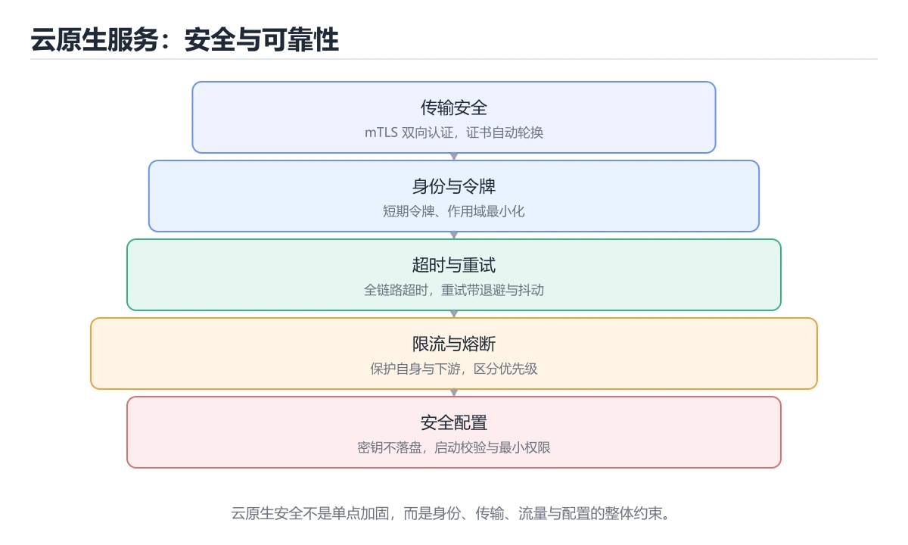
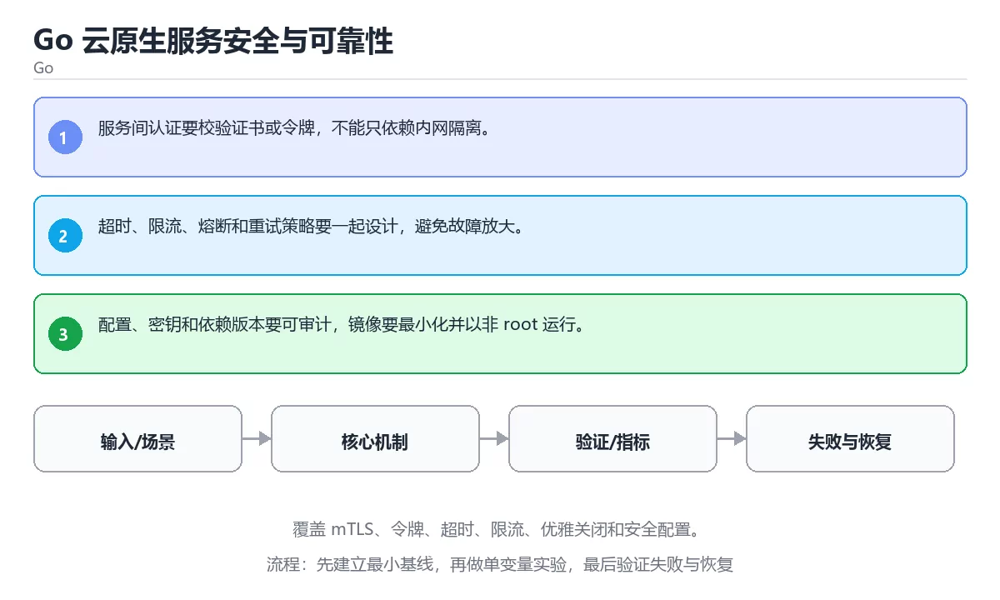

# Go 云原生服务安全与可靠性

> 内容更新时间：2026-10-06 · 学习阶段：高级 · 预计用时：40 分钟





## 本节知识框架

**课程定位**：所属分类 `go`（Go），课程主题 `Go 云原生服务安全与可靠性`，学习阶段 高级，建议用时 45 分钟。

本课主线：覆盖 mTLS、令牌、超时、限流、优雅关闭和安全配置。

**学完本课应当能够**
- 说清 `云原生` 与 `mTLS` 的含义与区别，并各举一个正例和一个反例。
- 用本课示例验证 `限流` 的行为，记录输入、输出与失败条件。
- 遇到「容器默认以 root 运行」这类问题时，能说出触发条件与修复顺序。

### 从概念到验证的学习链条

1. `云原生`：先掌握 以容器、编排、声明式配置、微服务和可观测性为基础构建和运行应用，再用它解释 `mTLS` 为什么会出现。
2. `mTLS`：先掌握 双向 TLS：客户端与服务端互相验证证书，常用于服务网格中确认双方身份，再用它解释 `限流` 为什么会出现。
3. `限流`：先掌握 按时间窗口限制请求速率（令牌桶或漏桶），保护后端不被突发流量打垮，再用它解释 `优雅关闭` 为什么会出现。
4. `优雅关闭`：先掌握 服务停止时先停止接收新请求，再等待在途任务完成并释放资源，再用它解释 本课示例的观察结果 为什么会出现。

**先修与衔接**：本课是「Go」分类的第 22 课。先修内容：《Go 性能剖析与调优（进阶）》。《Go 性能剖析与调优（进阶）》里的 `pprof`、`trace` 是本课的前提。相关或后续课程：《Go 第一个程序》。

### 完成判据

- **定义关**：不看正文也能说明 `云原生` 是 以容器、编排、声明式配置、微服务和可观测性为基础构建和运行应用，并指出一个反例。
- **机制关**：能按“输入 → 转换 → 输出 → 验证”复述 `Go 云原生服务安全与可靠性`，而不是只背结论。
- **示例关**：能运行或推演 `Go 云原生服务安全与可靠性` 的 `text` 示例，并说明一个真实出现的标识符或字面量。
- **证据关**：能指出 `Go 云原生服务安全与可靠性` 示例里的 调用了 `main()`，并说明它支持或反驳了本课的哪一条结论。
- **排错关**：能复现 容器默认以 root 运行，记录现象并按 用非 root 用户运行并限制内核能力 修复。
- **迁移关**：能把 `云原生`、`mTLS`、`限流`、`优雅关闭` 放进一个与 `Go 云原生服务安全与可靠性` 不同的项目场景，并保持输入与验证条件可追踪。
- **复盘关**：学完 `Go 云原生服务安全与可靠性` 后，用一句话写下仍然不确定的结论，并列出下一次验证需要的输入、环境和成功判据。

### 复习清单

- [ ] 能不看正文复述本课核心术语，并指出一个边界或反例。
- [ ] 能运行或推演本课示例，记录输入、输出与失败现象。
- [ ] 能完成一次自测，并把错题对照错误表定位原因。

## 核心概念定义

| 术语 | 操作性定义 | 常见边界与风险 |
| --- | --- | --- |
| 云原生 | 以容器、编排、声明式配置、微服务和可观测性为基础构建和运行应用。 | 容器与集群环境差异会改变行为，本地通过后仍需在目标编排环境复验。 |
| mTLS | 双向 TLS：客户端与服务端互相验证证书，常用于服务网格中确认双方身份。 | 只在「双向 TLS：客户端与服务端互相验证证书，常用于服务网格中确认双方身份」这一前提下成立，换输入或换环境要重新验证。 |
| 限流 | 按时间窗口限制请求速率（令牌桶或漏桶），保护后端不被突发流量打垮。 | 网络延迟、超时与版本协商会改变行为，只在真实链路或多版本客户端上验证才算数。 |
| 优雅关闭 | 服务停止时先停止接收新请求，再等待在途任务完成并释放资源。 | 网络延迟、超时与版本协商会改变行为，只在真实链路或多版本客户端上验证才算数。 |

## 原理与运行机制

### 机制总览

**教材衔接：核心知识**

### 1. 服务间认证要校验证书或令牌，不能只依赖内网隔离。

- 关键做法：先用 package 建立 云原生 的基线，再逐步加入边界与失败条件。
- 验证标准：mTLS 的异常路径有明确错误信息与恢复动作。

### 2. 超时、限流、熔断和重试策略要一起设计，避免故障放大。

把这条结论放回「Go 云原生服务安全与可靠性」的完整流程里展开：

- 正文依据：能用自己的话解释：超时、限流、熔断和重试策略要一起设计，避免故障放大。
- 落地检查：把「2. 超时、限流、熔断和重试策略要一起设计，避免故障放大。」改写成一条可执行的核对项，逐条验证输入、超时与失败路径。

### 3. 配置、密钥和依赖版本要可审计，镜像要最小化并以非 root 运行。

把这条结论放回「Go 云原生服务安全与可靠性」的完整流程里展开：

- 正文依据：合上教程，用 3～5 句话解释Go 云原生服务安全与可靠性。
- 落地检查：把「3. 配置、密钥和依赖版本要可审计，镜像要最小化并以非 root 运行。」改写成一条可执行的核对项，逐条验证输入、超时与失败路径。

**教材衔接：关键流程**

**教材衔接：实践路径**

**教材衔接：版本与时效**

- 升级「Go 云原生服务安全与可靠性」涉及的依赖前，先用 package 复现当前行为，再逐项核对版本说明与破坏性变更。
- 模块校验、最小版本选择与供应链安全是生产升级的重点
- 官方发布说明：https://go.dev/doc/devel/release

### 升级检查清单

- 先固定当前版本，跑通全部示例与测验，再升级工具链。
- 升级时只动一个依赖版本，用 package 记录构建与运行结果。
- 升级后重点回归 云原生 的默认值、警告信息与错误格式。
- 升级完成后记录 云原生 的新旧版本差异，并据此调整下次复核时间。

**教材衔接：零基础精讲：把Go 云原生服务安全与可靠性真正讲透**

### 先建立一个直觉

本课的摘要可以当作一张地图：覆盖 mTLS、令牌、超时、限流、优雅关闭和安全配置。

### 逐步拆解

1. 澄清输入与目标。先写清「Go 云原生服务安全与可靠性」要解决的问题、合法输入范围和成功标准，再进入后续步骤。
2. 描述处理过程。把「云原生、mTLS、限流、优雅关闭」映射到具体步骤，每步都要求能单独验证。
3. 定义输出。把 package 的返回值、日志和失败信号都写清楚，缺一项都不算完整。
4. 让「Go 云原生服务安全与可靠性」的失败路径尽早暴露：把云原生推到边界值，记录错误信息、重试或降级动作，以及人工兜底条件。
5. 用同一个云原生输入跑两遍：一遍按正文步骤，一遍故意跳过一步，比较输出并解释为什么必须按顺序执行。

### 把正文串成一条执行链

- **1. 服务间认证要校验证书或令牌，不能只依赖内网隔离。**：在「Go 云原生服务安全与可靠性」里，「1. 服务间认证要校验证书或令牌，不能只依赖内网隔离。」这一步要先写清输入与预期，再记录实际结果和差异；结果不符时回到对应小节核对前提。
- **2. 超时、限流、熔断和重试策略要一起设计，避免故障放大。**：在「Go 云原生服务安全与可靠性」里，「2. 超时、限流、熔断和重试策略要一起设计，避免故障放大。」这一步要先写清输入与预期，再记录实际结果和差异；结果不符时回到对应小节核对前提。
- **3. 配置、密钥和依赖版本要可审计，镜像要最小化并以非 root 运行。**：在「Go 云原生服务安全与可靠性」里，「3. 配置、密钥和依赖版本要可审计，镜像要最小化并以非 root 运行。」这一步要先写清输入与预期，再记录实际结果和差异；结果不符时回到对应小节核对前提。
- **考点 1：围绕“Go 云原生服务安全与可靠性”中的 云原生、mTLS、限流，下列哪两项是本课强调的实践判断？**：先独立作答，再回到本课对应小节核对判断依据；答错时记录是哪一个前提被忽略。
- **考点 2：核心知识 的代码阅读题**：先独立作答，再回到本课正文核对 package 的执行路径；答错时记录是哪一个前提被忽略。
- **考点 3：关于「配置、密钥和依赖版本要可审计，镜像要最小化并以非 root 运行。」，下列说法正确的是？**：先独立作答，再回到本课对应小节核对判断依据；答错时记录是哪一个前提被忽略。

### 从测验反推易错点

- 参考判断：服务间认证要校验证书或令牌，不能只依赖内网隔离。
- 自问：如果去掉题干里的一个限定词，结论还成立吗？

- 参考判断：超时、限流、熔断和重试策略要一起设计，避免故障放大。

- 参考判断：配置、密钥和依赖版本要可审计，镜像要最小化并以非 root 运行。

**检查点 4：本课的核心学习目标是什么？**

- 参考判断：覆盖 mTLS、令牌、超时、限流、优雅关闭和安全配置。

- 参考判断：Timeout、timeout


### 变式训练

1. 把 云原生 放进一个只有单机、没有额外依赖的小项目，先保证正确再扩展。
2. 扩大 mTLS 的规模，记录本课结论在哪一个量级开始不成立。
3. 让 package 的外部依赖超时，确认系统能回滚或补偿，而不是留下脏数据。
5. 删掉一个看似必要的步骤（例如 云原生 相关的校验），观察哪个测试或指标先失败，用证据说明它为什么不能省。
6. 把 云原生 的方案切换到低资源设备，重新评估默认参数、超时和降级策略。


### 迁移案例库

换一个 mTLS 约束重做一次，确认结论在新条件下是否仍然成立。

#### 迁移案例 1：围绕「云原生」做一次小实验

**验收**：云原生的结论要有证据、差异可解释、失败可恢复；做不到时回到「核心知识」缩小问题范围。

#### 迁移案例 2：围绕「mTLS」做一次小实验

**步骤**：
1. 复述当前方案对「mTLS」的假设，写成一句可证伪的话。

#### 迁移案例 3：围绕「限流」做一次小实验

**步骤**：
1. 复述当前方案对「限流」的假设，写成一句可证伪的话。

#### 迁移案例 4：围绕「优雅关闭」做一次小实验

**步骤**：
1. 复述当前方案对「优雅关闭」的假设，写成一句可证伪的话。

#### 迁移案例 5：围绕「云原生」做一次小实验

**步骤**：

#### 迁移案例 6：围绕「mTLS」做一次小实验

**步骤**：

#### 迁移案例 7：围绕「限流」做一次小实验

**步骤**：

#### 迁移案例 8：围绕「优雅关闭」做一次小实验

**步骤**：

#### 迁移案例 9：围绕「云原生」做一次小实验

**步骤**：

#### 迁移案例 10：围绕「mTLS」做一次小实验

**步骤**：

#### 迁移案例 11：围绕「限流」做一次小实验

**步骤**：

#### 迁移案例 12：围绕「优雅关闭」做一次小实验

**步骤**：

#### 迁移案例 13：围绕「云原生」做一次小实验

**步骤**：

#### 迁移案例 14：围绕「mTLS」做一次小实验

**步骤**：

#### 迁移案例 15：围绕「限流」做一次小实验

**步骤**：

#### 迁移案例 16：围绕「优雅关闭」做一次小实验

**步骤**：

<!-- p0-depth-v2:end -->

**教材衔接：验证步骤**

### 机制拆解：每一步的输入、动作与输出

#### 1. `云原生`
- 输入：`云原生`；本步把 以容器、编排、声明式配置、微服务和可观测性为基础构建和运行应用 当作判断规则。
- 动作：围绕 `云原生` 保留中间状态，并记录它与 `mTLS` 的对应关系。
- 输出：`mTLS`，它可以被下一段代码、测试或记录继续使用。
- `云原生` 的失败条件：容器与集群环境差异会改变行为，本地通过后仍需在目标编排环境复验。

#### 2. `mTLS`
- 输入：`云原生`；本步把 双向 TLS：客户端与服务端互相验证证书，常用于服务网格中确认双方身份 当作判断规则。
- 动作：围绕 `mTLS` 保留中间状态，并记录它与 `限流` 的对应关系。
- 输出：`限流`，它可以被下一段代码、测试或记录继续使用。
- `mTLS` 的失败条件：只在「双向 TLS：客户端与服务端互相验证证书，常用于服务网格中确认双方身份」这一前提下成立，换输入或换环境要重新验证。

#### 3. `限流`
- 输入：`mTLS`；本步把 按时间窗口限制请求速率（令牌桶或漏桶），保护后端不被突发流量打垮 当作判断规则。
- 动作：围绕 `限流` 保留中间状态，并记录它与 `优雅关闭` 的对应关系。
- 输出：`优雅关闭`，它可以被下一段代码、测试或记录继续使用。
- `限流` 的失败条件：网络延迟、超时与版本协商会改变行为，只在真实链路或多版本客户端上验证才算数。

#### 4. `优雅关闭`
- 输入：`限流`；本步把 服务停止时先停止接收新请求，再等待在途任务完成并释放资源 当作判断规则。
- 动作：围绕 `优雅关闭` 保留中间状态，并记录它与 `main` 的对应关系。
- 输出：`main`，它可以被下一段代码、测试或记录继续使用。
- `优雅关闭` 的失败条件：网络延迟、超时与版本协商会改变行为，只在真实链路或多版本客户端上验证才算数。

### 示例中的可观察事实

1. 调用了 `main()`；它对应的课程主题是 `Go 云原生服务安全与可靠性`。
2. 调用了 `Println()`；它对应的课程主题是 `Go 云原生服务安全与可靠性`。
3. 出现字面量 `fmt`；它对应的课程主题是 `Go 云原生服务安全与可靠性`。
4. 出现字面量 `net/http`；它对应的课程主题是 `Go 云原生服务安全与可靠性`。
5. 出现字面量 `time`；它对应的课程主题是 `Go 云原生服务安全与可靠性`。
6. 出现字面量 `timeout:`；它对应的课程主题是 `Go 云原生服务安全与可靠性`。

### 复现实验记录

- 环境：`Go 云原生服务安全与可靠性` 使用 `text` 示例，固定 `云原生`、`mTLS`、`限流`、`优雅关闭` 作为第一组条件。
- 首轮输入：先确认 调用了 `main()`，预测 `云原生` 会怎样变化。
- 基线观察：记录命令、输入、输出和错误原文，不用截图代替可复制的文本。
- 单变量修改：只改变 `云原生`，观察 `优雅关闭` 是否仍满足定义。
- 失败注入：复现 容器默认以 root 运行，确认现象是 逃逸后权限过大。
- 记录结论：把“修改前、修改后、预期变化、实际变化”写成四列表，这样复盘 `Go 云原生服务安全与可靠性` 时才能区分概念错误与实现错误。

## 典型应用场景

- **容器默认以 root 运行**：典型现象是逃逸后权限过大；正确做法是用非 root 用户运行并限制内核能力。
- **基础镜像不固定版本**：典型现象是构建结果不可复现，镜像可能被替换；正确做法是固定镜像摘要并定期扫描依赖漏洞。
- **没有健康检查与优雅退出**：典型现象是滚动发布时请求被中断；正确做法是提供存活与就绪探针，并处理关闭信号。

### 最小验证场景

- 准备：保留 `text` 示例的原始输入，先记录 `Go 云原生服务安全与可靠性` 的基线输出和完整运行命令。
- 观察：先核对 调用了 `main()`，再改变一个与 `云原生` 相关的条件。
- 判定：新结果与 `Go 云原生服务安全与可靠性` 的基线不同不等于错误；只有当差异破坏了 `云原生` 的定义或错误表中的约束，才判定为失败。

### 选择与边界

- 使用 `云原生` 时，先满足它的定义：以容器、编排、声明式配置、微服务和可观测性为基础构建和运行应用；容器与集群环境差异会改变行为，本地通过后仍需在目标编排环境复验。
- 使用 `mTLS` 时，先满足它的定义：双向 TLS：客户端与服务端互相验证证书，常用于服务网格中确认双方身份；只在「双向 TLS：客户端与服务端互相验证证书，常用于服务网格中确认双方身份」这一前提下成立，换输入或换环境要重新验证。
- 使用 `限流` 时，先满足它的定义：按时间窗口限制请求速率（令牌桶或漏桶），保护后端不被突发流量打垮；网络延迟、超时与版本协商会改变行为，只在真实链路或多版本客户端上验证才算数。
- 使用 `优雅关闭` 时，先满足它的定义：服务停止时先停止接收新请求，再等待在途任务完成并释放资源；网络延迟、超时与版本协商会改变行为，只在真实链路或多版本客户端上验证才算数。

## 代码/协议/SQL 示例

### 最小可验证示例

**教材衔接：最小可运行示例**

先用 package 跑通最小示例，然后只改一个与 云原生 相关的取值：

```go
package main

import (
	"fmt"
	"net/http"
	"time"
)

func main() {
	client := &http.Client{Timeout: 2 * time.Second}
	fmt.Println("timeout:", client.Timeout)
}
```

**教材衔接：预期输出**

```text
timeout: 2s
```

### 示例精读：先找证据，再改一个条件

1. 调用了 `main()`；它出现在 `Go 云原生服务安全与可靠性` 的示例中，阅读时先确认它前后各发生了什么。
2. 调用了 `Println()`；它出现在 `Go 云原生服务安全与可靠性` 的示例中，阅读时先确认它前后各发生了什么。
3. 出现字面量 `fmt`；它出现在 `Go 云原生服务安全与可靠性` 的示例中，阅读时先确认它前后各发生了什么。
4. 出现字面量 `net/http`；它出现在 `Go 云原生服务安全与可靠性` 的示例中，阅读时先确认它前后各发生了什么。
5. 出现字面量 `time`；它出现在 `Go 云原生服务安全与可靠性` 的示例中，阅读时先确认它前后各发生了什么。
6. 出现字面量 `timeout:`；它出现在 `Go 云原生服务安全与可靠性` 的示例中，阅读时先确认它前后各发生了什么。
- 在 `Go 云原生服务安全与可靠性` 中与 `云原生` 对照：示例必须能支持 以容器、编排、声明式配置、微服务和可观测性为基础构建和运行应用，否则说明这一段还缺少实现或验证步骤。
- 在 `Go 云原生服务安全与可靠性` 中与 `mTLS` 对照：示例必须能支持 双向 TLS：客户端与服务端互相验证证书，常用于服务网格中确认双方身份，否则说明这一段还缺少实现或验证步骤。
- 在 `Go 云原生服务安全与可靠性` 中与 `限流` 对照：示例必须能支持 按时间窗口限制请求速率（令牌桶或漏桶），保护后端不被突发流量打垮，否则说明这一段还缺少实现或验证步骤。
- 在 `Go 云原生服务安全与可靠性` 中与 `优雅关闭` 对照：示例必须能支持 服务停止时先停止接收新请求，再等待在途任务完成并释放资源，否则说明这一段还缺少实现或验证步骤。

## 时间/空间复杂度或性能分析

**性能关注点（Go 云原生服务安全与可靠性）**：调度器与 GC 影响开销：记录 P99 延迟、协程数量与堆占用，优先用 pprof 采样。

**测量方法**：以 `Go 云原生服务安全与可靠性` 的 `云原生` 场景为对象，固定输入跑一遍记录基线，再把规模或并发度提高一个数量级复测；两次结果的差值与波动范围才是结论依据。

### 需要控制的变量与记录项

- `Go 云原生服务安全与可靠性` 的 `云原生`：固定它的版本、输入范围和资源上限，分别记录速度、内存与失败率的变化。
- `Go 云原生服务安全与可靠性` 的 `mTLS`：固定它的版本、输入范围和资源上限，分别记录速度、内存与失败率的变化。
- `Go 云原生服务安全与可靠性` 的 `限流`：固定它的版本、输入范围和资源上限，分别记录速度、内存与失败率的变化。
- `Go 云原生服务安全与可靠性` 的 `优雅关闭`：固定它的版本、输入范围和资源上限，分别记录速度、内存与失败率的变化。
- `Go 云原生服务安全与可靠性` 中 `云原生` 的边界：容器与集群环境差异会改变行为，本地通过后仍需在目标编排环境复验。达到边界时不要外推，必须重新测量。
- `Go 云原生服务安全与可靠性` 中 `mTLS` 的边界：只在「双向 TLS：客户端与服务端互相验证证书，常用于服务网格中确认双方身份」这一前提下成立，换输入或换环境要重新验证。达到边界时不要外推，必须重新测量。
- `Go 云原生服务安全与可靠性` 中 `限流` 的边界：网络延迟、超时与版本协商会改变行为，只在真实链路或多版本客户端上验证才算数。达到边界时不要外推，必须重新测量。
- `Go 云原生服务安全与可靠性` 中 `优雅关闭` 的边界：网络延迟、超时与版本协商会改变行为，只在真实链路或多版本客户端上验证才算数。达到边界时不要外推，必须重新测量。
- `Go 云原生服务安全与可靠性` 的代码证据：先验证 调用了 `main()`，再记录该路径的输入规模与耗时；只看代码行数不能推出复杂度。

## 常见误区与易错点

| 容易写错的做法 | 实际现象 | 原因与正确做法 |
| --- | --- | --- |
| 容器默认以 root 运行 | 逃逸后权限过大。 | 用非 root 用户运行并限制内核能力。 |
| 基础镜像不固定版本 | 构建结果不可复现，镜像可能被替换。 | 固定镜像摘要并定期扫描依赖漏洞。 |
| 没有健康检查与优雅退出 | 滚动发布时请求被中断。 | 提供存活与就绪探针，并处理关闭信号。 |

### 现场 1：容器默认以 root 运行

**症状**：逃逸后权限过大。

**根因与修复**：用非 root 用户运行并限制内核能力。

**自检**：在本课示例里复现「容器默认以 root 运行」，改成用非 root 用户运行并限制内核能力后重跑；如果症状消失且失败路径按预期变化，说明定位正确。

### 现场 2：基础镜像不固定版本

**症状**：构建结果不可复现，镜像可能被替换。

**根因与修复**：固定镜像摘要并定期扫描依赖漏洞。

**自检**：在本课示例里复现「基础镜像不固定版本」，改成固定镜像摘要并定期扫描依赖漏洞后重跑；如果症状消失且失败路径按预期变化，说明定位正确。

### 现场 3：没有健康检查与优雅退出

**症状**：滚动发布时请求被中断。

**根因与修复**：提供存活与就绪探针，并处理关闭信号。

**自检**：在本课示例里复现「没有健康检查与优雅退出」，改成提供存活与就绪探针，并处理关闭信号后重跑；如果症状消失且失败路径按预期变化，说明定位正确。

## 与其他知识点的关系

| 关系 | 课程 | 为什么 |
| --- | --- | --- |
| 先修 | 《Go 性能剖析与调优（进阶）》 | 本课会直接使用它的概念或操作前提。 |
| 关联 | 《Go 第一个程序》 | 用于横向比较或把本课结论迁移到相邻主题。 |
| 前置顺序 | 《Go 性能剖析与调优（进阶）》 | 同分类中安排在本课之前，建议先完成其自测。 |

**教材衔接：复习与迁移**

### 概念复述

- 用一句话说明「Go 云原生服务安全与可靠性」解决什么问题：覆盖 mTLS、令牌、超时、限流、优雅关闭和安全配置。
- 写出云原生、mTLS、限流之间的关系，并各举一个例子。
- 说出本课最容易混淆的两个概念，以及区分它们的判据。

### 正文逐节复核

- **实践任务**：本节围绕Go 云原生服务安全与可靠性安排 3 个可交付任务，每个任务都要求留下可以复查的记录。
- **零基础精讲：把Go 云原生服务安全与可靠性真正讲透**：本课的摘要可以当作一张地图：覆盖 mTLS、令牌、超时、限流、优雅关闭和安全配置。

### 测验回顾

1. 围绕“Go 云原生服务安全与可靠性”中的 云原生、mTLS、限流，下列哪两项是本课强调的实践判断？
   - 依据：本课把Go 云原生服务安全与可靠性拆成概念、示例与故障现场三部分，因此判断 云原生 时必须同时交代输入、输出和失败路径，这使“学习 云原生 时要同时说明输入、输出和失败路径，不能只看正常流程”成立。在Go 云原生服务安全与可靠性里，判断 mTLS 时要固定版本与边界输入，所以“验证 mTLS 时要固定版本并覆盖边界输入，结论才可复现”才可复现。
2. 下面这段 Go 代码摘自「Go 云原生服务安全与可靠性」的正文示例。关于这段代码，下面哪一项说法与实际内容相符？
   - 依据：在「Go 云原生服务安全与可靠性」里，这段代码把主要逻辑封装在函数或方法里，需要被调用才会执行。这段代码出自「Go 云原生服务安全与可靠性」的正文示例，围绕云原生、mTLS、限流展开；把输入或边界换成空值、极值或失败情况后，结论要以「Go 云原生服务安全与可靠性」的实际运行结果为准。
3. 关于「配置、密钥和依赖版本要可审计，镜像要最小化并以非 root 运行。」，下列说法正确的是？
   - 依据：在「Go 云原生服务安全与可靠性」里，配置、密钥和依赖版本要可审计，镜像要最小化并以非 root 运行。在「Go 云原生服务安全与可靠性」里，如果只凭关键词作答，很容易把只要小数据能跑通，大规模和异常情况也一定正确。「Go 云原生服务安全与可靠性」要求先交代云原生、mTLS、限流的前提再下结论，所以“配置、密钥和依赖版本要可审计”只在题干“配置、密钥和依赖版本要可审计”给定的条件下成立。
4. 「Go 云原生服务安全与可靠性」的核心学习目标是什么？
   - 依据：在「Go 云原生服务安全与可靠性」里，结论应落在「覆盖 mTLS、令牌、超时、限流、优雅关闭和安全配置」。在「Go 云原生服务安全与可靠性」里，结论应落在覆盖 mTLS、令牌、超时、限流、优雅关闭和安全配置。在「Go 云原生服务安全与可靠性」里，这道题要求区分概念与边界，覆盖 mTLS、令牌、超时、限流、优雅关闭和安全配置。
5. 补全代码：「Go 云原生服务安全与可靠性」示例中，下面这行代码缺少哪个关键字或函数名？请填入 ____。

### 迁移练习

- **先修**：`Go 性能剖析与调优（进阶）`。本课默认这些内容已经掌握。
- **相关或后续**：`Go 第一个程序`。本课术语会在这些课程里继续使用。
- **术语归属**：`云原生`、`mTLS`、`限流` 的定义以本课「核心概念定义」为准，换到其他课程时先确认定义是否被改写。
- 同一分类的《Go 微服务与可观测》也涉及 `优雅关闭`；两课衔接时先确认这个术语的定义是否一致。
- 同一分类的《实战：Go REST API 服务》也涉及 `优雅关闭`；两课衔接时先确认这个术语的定义是否一致。

### 先修与后续术语接口

- `Go 第一个程序`：两者通过本分类的学习顺序衔接，阅读时重点比较各自的输入与失败条件。
- `Go 性能剖析与调优（进阶）`：两者通过本分类的学习顺序衔接，阅读时重点比较各自的输入与失败条件。

### 容易混淆的相邻概念

- `云原生` 与 `mTLS`：前者强调 以容器、编排、声明式配置、微服务和可观测性为基础构建和运行应用；后者强调 双向 TLS：客户端与服务端互相验证证书，常用于服务网格中确认双方身份。判断时分别检查两条定义的适用范围，不要只看名称相似就互换。
- `mTLS` 与 `限流`：前者强调 双向 TLS：客户端与服务端互相验证证书，常用于服务网格中确认双方身份；后者强调 按时间窗口限制请求速率（令牌桶或漏桶），保护后端不被突发流量打垮。判断时分别检查两条定义的适用范围，不要只看名称相似就互换。
- `限流` 与 `优雅关闭`：前者强调 按时间窗口限制请求速率（令牌桶或漏桶），保护后端不被突发流量打垮；后者强调 服务停止时先停止接收新请求，再等待在途任务完成并释放资源。判断时分别检查两条定义的适用范围，不要只看名称相似就互换。

## 自测题与参考答案

> 先独立作答，再对照参考答案；答案都能在本课正文、术语表或错误表里找到依据。

### 自测 1（概念复述）

不看正文，写出 `云原生` 的操作性定义，并说明它与 `mTLS` 的区别。

**参考答案**：以容器、编排、声明式配置、微服务和可观测性为基础构建和运行应用。

`mTLS` 的定位是：双向 TLS：客户端与服务端互相验证证书，常用于服务网格中确认双方身份；两者的差别要从适用对象与失败模式上说明。

### 自测 2（排错）

本课错误表记录了「容器默认以 root 运行」这类做法。请写出它会出现的现象、根因，以及修复顺序。

**参考答案**：现象是逃逸后权限过大；正确做法是用非 root 用户运行并限制内核能力。修复时先复现现象并保留证据，再改动一处假设重跑，确认现象消失。

### 自测 3（动手验证）

运行本课的 `text` 示例，改动其中一个输入后重新运行，记录输出与错误信息。

**参考答案**：正常输入下 `text` 示例应当复现正文给出的结果；改动输入后，如果结果改变或报错，先核对它是否满足 `Go 云原生服务安全与可靠性` 中`云原生` 的适用范围，再检查错误表里是否有同类现象。

### 自测 4（代码阅读）

阅读本课开头的 `text` 示例，说明它体现了`云原生` 的哪一条性质，并指出改动哪个输入会让这条性质不再成立。

**参考答案**：`云原生` 的定义是 以容器、编排、声明式配置、微服务和可观测性为基础构建和运行应用，示例正是在实现这条定义。改动与 `云原生` 有关的一个输入后，如果结果不再符合 `Go 云原生服务安全与可靠性` 的正文描述，就说明该性质只在当前前提成立。

### 自测 5（迁移）

把 `Go 云原生服务安全与可靠性` 的方法迁移到自己的项目：围绕 `云原生` 写出一个与错误表同类的风险点，并说明触发条件和检验方式。

**参考答案**：例如「没有健康检查与优雅退出」，它会导致滚动发布时请求被中断；检验方式是按提供存活与就绪探针，并处理关闭信号改一处再复现，确认现象消失且没有引入新的失败分支。

### 自测 6（对比）

用一个表格对比 `云原生` 与 `mTLS`：各写一行适用场景、一行失败表现。

**参考答案**：`云原生` 的定义是以容器、编排、声明式配置、微服务和可观测性为基础构建和运行应用；`mTLS` 的定义是双向 TLS：客户端与服务端互相验证证书，常用于服务网格中确认双方身份。两者的失败表现分别对应本课错误表里与本术语相关的行。

### 自测 7（排错顺序）

面对「容器默认以 root 运行」引发的问题，请把“复现 逃逸后权限过大 → 保留证据 → 用非 root 用户运行并限制内核能力 → 回归验证”四步写成可执行的检查清单。

**参考答案**：第一步按逃逸后权限过大复现；第二步记录输入、版本与完整报错；第三步按用非 root 用户运行并限制内核能力只改一处；第四步重跑并确认失败路径也按预期变化。

### 自测 8（边界判断）

针对 `优雅关闭`，分别写出“可以使用”的条件和“结论不再成立”的条件。

**参考答案**：网络延迟、超时与版本协商会改变行为，只在真实链路或多版本客户端上验证才算数。 同时要把 `优雅关闭` 的定义 服务停止时先停止接收新请求，再等待在途任务完成并释放资源 与实际输入逐项对照。

### 自测 9（机制重建）

不看正文，按输入、转换、输出、验证四段重建 `云原生` → `mTLS` → `限流` → `优雅关闭` 的作用链。

**参考答案**：起点是 `云原生` 的定义 以容器、编排、声明式配置、微服务和可观测性为基础构建和运行应用；中间每一步都保留可观察状态；终点由 `优雅关闭` 检查，失败时回到错误表定位第一个偏离定义的步骤。

### 自测 10（综合排错）

在 `Go 云原生服务安全与可靠性` 中，现象是 滚动发布时请求被中断。请围绕 没有健康检查与优雅退出 写出最小复现、关键证据、修复动作和回归验证，并说明为什么不能只凭一次运行下结论。

**参考答案**：先复现 没有健康检查与优雅退出，记录输入与完整错误；再按 提供存活与就绪探针，并处理关闭信号 只改一处。回归时同时跑正常路径和边界路径，只有两次结果都可解释，才把修复视为完成。

### 自测 11（一分钟复述）

用每分钟约 200 字的速度复述 `Go 云原生服务安全与可靠性`：先给主问题，再按顺序说出 `云原生`、`mTLS`、`限流`、`优雅关闭`，最后给一个失败案例。

**自评标准**：主问题必须对应 覆盖 mTLS、令牌、超时、限流、优雅关闭和安全配置；每个术语都要能接上一句定义或边界；失败案例必须写成可观察现象，不能用“可能有风险”代替证据。

## 术语速查

| 术语 | 一句话说明 |
| --- | --- |
| `云原生` | 以容器、编排、声明式配置、微服务和可观测性为基础构建和运行应用。 |
| `mTLS` | 双向 TLS：客户端与服务端互相验证证书，常用于服务网格中确认双方身份。 |
| `限流` | 按时间窗口限制请求速率（令牌桶或漏桶），保护后端不被突发流量打垮。 |
| `优雅关闭` | 服务停止时先停止接收新请求，再等待在途任务完成并释放资源。 |

**术语关系**：`云原生`（以容器、编排、声明式配置、微服务和可观测性为基础构建和运行应用） → `mTLS`（双向 TLS：客户端与服务端互相验证证书） → `限流`（按时间窗口限制请求速率（令牌桶或漏桶）） → `优雅关闭`（服务停止时先停止接收新请求）。

## 考点精讲

`Go 云原生服务安全与可靠性` 的题库有 6 道题，下面逐题给出题干、正确项与判断依据：先自己作答，再核对正确项，最后回到正文对应小节复核。

### 考点 1：第 1 题

- **题目**：围绕“Go 云原生服务安全与可靠性”中的 云原生、mTLS、限流，下列哪两项是本课强调的实践判断？
- **正确项**：验证 mTLS 时要固定版本并覆盖边界输入，结论才可复现；学习 云原生 时要同时说明输入、输出和失败路径，不能只看正常流程
- **判断依据**：这道题落在术语 `云原生` 上：以容器、编排、声明式配置、微服务和可观测性为基础构建和运行应用。复习时把 `云原生` 的定义、适用边界和一个反例一起说清楚，再回到「核心概念定义」核对原文。

### 考点 2：第 2 题

- **题目**：`Go 云原生服务安全与可靠性` 的示例代码用于验证 `云原生`，其背景是覆盖 mTLS、令牌、超时、限流、优雅关闭和安全配置。代码的真实内容是下面哪一项？
- **正确项**：出现字面量 `net/http`
- **判断依据**：这道题落在术语 `云原生` 上：以容器、编排、声明式配置、微服务和可观测性为基础构建和运行应用。复习时把 `云原生` 的定义、适用边界和一个反例一起说清楚，再回到「核心概念定义」核对原文。

### 考点 3：第 3 题

- **题目**：在 `Go 云原生服务安全与可靠性` 里，与 `云原生` 有关的说法中，哪一项最符合覆盖 mTLS、令牌、超时、限流、优雅关闭和安全配置。？
- **正确项**：配置、密钥和依赖版本要可审计，镜像要最小化并以非 root 运行。
- **判断依据**：这道题落在术语 `云原生` 上：以容器、编排、声明式配置、微服务和可观测性为基础构建和运行应用。复习时把 `云原生` 的定义、适用边界和一个反例一起说清楚，再回到「核心概念定义」核对原文。

### 考点 4：第 4 题

- **题目**：`Go 云原生服务安全与可靠性` 的主线是：覆盖 mTLS、令牌、超时、限流、优雅关闭和安全配置。下面哪一项与这条主线一致？
- **正确项**：覆盖 mTLS、令牌、超时、限流、优雅关闭和安全配置。
- **判断依据**：这道题落在术语 `云原生` 上：以容器、编排、声明式配置、微服务和可观测性为基础构建和运行应用。复习时把 `云原生` 的定义、适用边界和一个反例一起说清楚，再回到「核心概念定义」核对原文。

### 考点 5：第 5 题

- **题目**：填空：补齐下面这段术语说明中的空缺。课程 `覆盖 mTLS、令牌、超时、限流、优雅关闭和安全配置。`，这段说明是：`____`：双向 TLS：客户端与服务端互相验证证书，常用于服务网格中确认双方身份。空缺处应填哪个术语？
- **正确项**：mTLS
- **判断依据**：这道题落在术语 `mTLS` 上：双向 TLS：客户端与服务端互相验证证书，常用于服务网格中确认双方身份。复习时把 `mTLS` 的定义、适用边界和一个反例一起说清楚，再回到「核心概念定义」核对原文。

### 考点 6：第 6 题

- **题目**：下面几项都与 `云原生` 有关，请按 `Go 云原生服务安全与可靠性` 的正文顺序排列；该课主线是覆盖 mTLS、令牌、超时、限流、优雅关闭和安全配置。
- **正确项**：核心知识 → 关键流程 → 实践路径 → 常见误区
- **判断依据**：这道题落在术语 `云原生` 上：以容器、编排、声明式配置、微服务和可观测性为基础构建和运行应用。复习时把 `云原生` 的定义、适用边界和一个反例一起说清楚，再回到「核心概念定义」核对原文。

### 考点 7：`云原生`

- **要点**：以容器、编排、声明式配置、微服务和可观测性为基础构建和运行应用。
- **云原生 的边界**：容器与集群环境差异会改变行为，本地通过后仍需在目标编排环境复验。

### 考点 8：`mTLS`

- **要点**：双向 TLS：客户端与服务端互相验证证书，常用于服务网格中确认双方身份。
- **mTLS 的边界**：只在「双向 TLS：客户端与服务端互相验证证书，常用于服务网格中确认双方身份」这一前提下成立，换输入或换环境要重新验证。

### 考点 9：`限流`

- **要点**：按时间窗口限制请求速率（令牌桶或漏桶），保护后端不被突发流量打垮。
- **限流 的边界**：网络延迟、超时与版本协商会改变行为，只在真实链路或多版本客户端上验证才算数。

### 考点 10：`优雅关闭`

- **要点**：服务停止时先停止接收新请求，再等待在途任务完成并释放资源。
- **优雅关闭 的边界**：网络延迟、超时与版本协商会改变行为，只在真实链路或多版本客户端上验证才算数。

### 考点 11：排错——容器默认以 root 运行

- **现象**：逃逸后权限过大。
- **处理**：用非 root 用户运行并限制内核能力。

### 考点 12：排错——基础镜像不固定版本

- **现象**：构建结果不可复现，镜像可能被替换。
- **处理**：固定镜像摘要并定期扫描依赖漏洞。

### 考点 13：综合辨析——`云原生` 与 `优雅关闭`

- **辨析点**：`云原生` 的定义是 以容器、编排、声明式配置、微服务和可观测性为基础构建和运行应用；`优雅关闭` 的定义是 服务停止时先停止接收新请求，再等待在途任务完成并释放资源。
- **答题要求**：面对 `Go 云原生服务安全与可靠性` 的题目，先判断描述的是 `云原生` 还是 `优雅关闭`，再归到对应定义，最后写出一个会让该定义失效的边界输入。

### 考点 14：排错评分点

- **现象分**：能写出 逃逸后权限过大，而不是只写“程序有错”。
- **证据分**：保留触发 容器默认以 root 运行 的输入、版本和错误原文。
- **修复分**：按 用非 root 用户运行并限制内核能力 只改一处，并同时回归正常路径与边界路径。

## 内容元数据

- 内容版本：v2.0
- 最后更新：2026-10-06
- 学习阶段：高级
- 适用环境：Go 1.24+；本课聚焦 云原生。
- 内容来源：内置结构化课程与工程实践整理
- 相关主题：云原生、mTLS、限流、优雅关闭
- 质量版本：P0 测验标准 + P1 覆盖扩展 + P2 体验补全

## 参考资料与复核

- 最后复核：2026-10-04
- 下次复核：2027-04-10
- 复核范围：版本兼容、API 行为、安全建议与工程实践
- 来源性质：官方文档、标准或权威教材；本课核对关键词：云原生、mTLS、限流、优雅关闭。

| 参考资料 | 本课用途 |
| --- | --- |
| [net/http](https://pkg.go.dev/net/http) | HTTP 客户端与服务端 |
| [Go 内存模型](https://go.dev/ref/mem) | 并发读写与同步语义 |
| [Go 测试](https://go.dev/doc/tutorial/add-a-test) | 测试、基准与覆盖率 |

| [本课术语索引：Go 云原生服务安全与可靠性](#核心概念定义) | 按本课输入、术语边界和错误表现逐项核对 |
> 「Go 云原生服务安全与可靠性」的链接用于离线阅读后的延伸核对；App 不会自动联网。