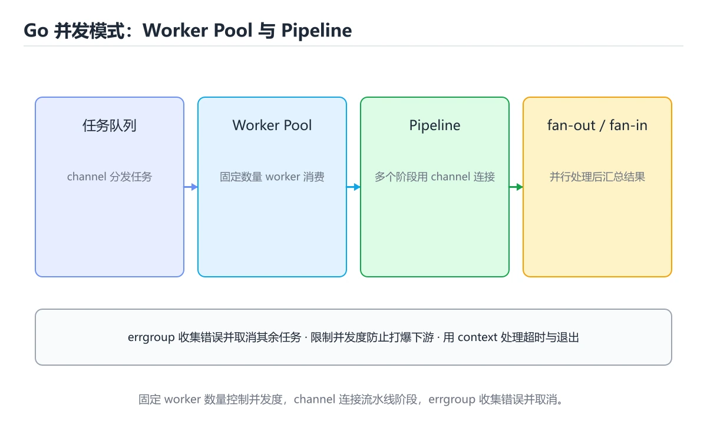
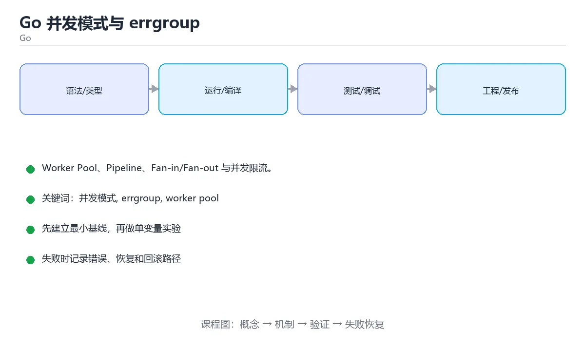

# Go 并发模式与 errgroup





> 内容更新时间：2026-10-06 · 学习阶段：高级 · 预计用时：40 分钟

## 本节知识框架

**课程定位**：所属分类 `go`（Go），课程主题 `Go 并发模式与 errgroup`，学习阶段 高级，建议用时 45 分钟。

本课主线：Worker Pool、Pipeline、Fan-in/Fan-out 与并发限流。

**学完本课应当能够**
- 说清 `并发模式` 与 `worker 池` 的含义与区别，并各举一个正例和一个反例。
- 用本课示例验证 `fan-in 与 fan-out` 的行为，记录输入、输出与失败条件。
- 遇到「没人关闭 channel」这类问题时，能说出触发条件与修复顺序。

### 从概念到验证的学习链条

1. `并发模式`：先掌握 并发模式是「被反复验证过的 goroutine + channel 组合拳」，再用它解释 `worker 池` 为什么会出现。
2. `worker 池`：先掌握 固定数量的 goroutine 从 channel 取任务，用有界并发保护下游与本地资源，再用它解释 `fan-in 与 fan-out` 为什么会出现。
3. `fan-in 与 fan-out`：先掌握 把任务分发给多个 goroutine，再把结果汇聚回一个 channel 的经典并发结构，再用它解释 `限流` 为什么会出现。
4. `限流`：先掌握 用带缓冲 channel 或 rate.Limiter 控制单位时间放行的任务数，避免把下游打垮，再用它解释 本课示例的观察结果 为什么会出现。

**先修与衔接**：本课是「Go」分类的第 17 课。先修内容：《gRPC 与 Protobuf 实践》。《gRPC 与 Protobuf 实践》里的 `gRPC`、`Protocol Buffers` 是本课的前提。相关或后续课程：《Go 测试进阶：基准、模糊与集成》。

### 完成判据

- **定义关**：不看正文也能说明 `并发模式` 是 并发模式是「被反复验证过的 goroutine + channel 组合拳」，并指出一个反例。
- **机制关**：能按“输入 → 转换 → 输出 → 验证”复述 `Go 并发模式与 errgroup`，而不是只背结论。
- **示例关**：能运行或推演 `Go 并发模式与 errgroup` 的 `go` 示例，并说明一个真实出现的标识符或字面量。
- **证据关**：能指出 `Go 并发模式与 errgroup` 示例里的 调用了 `ProcessAll()`，并说明它支持或反驳了本课的哪一条结论。
- **排错关**：能复现 没人关闭 channel，记录现象并按 由发送方在结束前关闭 修复。
- **迁移关**：能把 `并发模式`、`errgroup`、`worker pool`、`pipeline` 放进一个与 `Go 并发模式与 errgroup` 不同的项目场景，并保持输入与验证条件可追踪。
- **复盘关**：学完 `Go 并发模式与 errgroup` 后，用一句话写下仍然不确定的结论，并列出下一次验证需要的输入、环境和成功判据。

### 复习清单

- [ ] 能不看正文复述本课核心术语，并指出一个边界或反例。
- [ ] 能运行或推演本课示例，记录输入、输出与失败现象。
- [ ] 能完成一次自测，并把错题对照错误表定位原因。

## 核心概念定义

| 术语 | 操作性定义 | 常见边界与风险 |
| --- | --- | --- |
| 并发模式 | 并发模式是「被反复验证过的 goroutine + channel 组合拳」。 | 共享状态与调度顺序会改变结论，单线程或串行测试通过不等于并发下成立。 |
| worker 池 | 固定数量的 goroutine 从 channel 取任务，用有界并发保护下游与本地资源。 | 易错：资源耗尽；正确做法是用 semaphore 或 worker 池。 |
| fan-in 与 fan-out | 把任务分发给多个 goroutine，再把结果汇聚回一个 channel 的经典并发结构。 | 共享状态与调度顺序会改变结论，单线程或串行测试通过不等于并发下成立。 |
| 限流 | 用带缓冲 channel 或 rate.Limiter 控制单位时间放行的任务数，避免把下游打垮。 | 易错：内存暴涨、下游被打爆；正确做法是用 `SetLimit` 或信号量限流。 |

## 原理与运行机制

### 机制总览

**教材衔接：模式速查**

| 模式 | 结构 | 适用 |
| --- | --- | --- |
| Worker Pool | 固定 worker 消费任务队列 | 控制并发度、批量处理 |
| Pipeline | 多阶段 channel 串联 | 数据流式处理 |
| Fan-out / Fan-in | 多协程处理再汇总 | 提高吞吐 |
| Semaphore | 带缓冲 channel 限制并发 | 保护下游 |
| Timeout / Cancellation | context 传播取消 | 防止无限等待 |
| Singleflight | 合并重复请求 | 缓存击穿、惊群 |

**教材衔接：版本与时效**

- 升级前确认 并发模式 的兼容范围，把不可回退的改动单独拆成一次提交。
- 模块校验、最小版本选择与供应链安全是生产升级的重点
- 官方发布说明：https://go.dev/doc/devel/release

### 升级检查清单

- 先固定当前版本，跑通全部示例与测验，再升级工具链。
- 一次只改一个版本条件，把 并发模式 相关的差异单独记成一条结论。
- 升级后重点回归 并发模式 的默认值、警告信息与错误格式。
- 升级后把 WithContext 的实测版本写进「内容元数据」，再更新复核日期。

### 机制拆解：每一步的输入、动作与输出

#### 1. `并发模式`
- 输入：`并发模式`；本步把 并发模式是「被反复验证过的 goroutine + channel 组合拳」 当作判断规则。
- 动作：围绕 `并发模式` 保留中间状态，并记录它与 `worker 池` 的对应关系。
- 输出：`worker 池`，它可以被下一段代码、测试或记录继续使用。
- `并发模式` 的失败条件：共享状态与调度顺序会改变结论，单线程或串行测试通过不等于并发下成立。

#### 2. `worker 池`
- 输入：`并发模式`；本步把 固定数量的 goroutine 从 channel 取任务，用有界并发保护下游与本地资源 当作判断规则。
- 动作：围绕 `worker 池` 保留中间状态，并记录它与 `fan-in 与 fan-out` 的对应关系。
- 输出：`fan-in 与 fan-out`，它可以被下一段代码、测试或记录继续使用。
- `worker 池` 的失败条件：当无限起 goroutine时，会出现资源耗尽。

#### 3. `fan-in 与 fan-out`
- 输入：`worker 池`；本步把 把任务分发给多个 goroutine，再把结果汇聚回一个 channel 的经典并发结构 当作判断规则。
- 动作：围绕 `fan-in 与 fan-out` 保留中间状态，并记录它与 `限流` 的对应关系。
- 输出：`限流`，它可以被下一段代码、测试或记录继续使用。
- `fan-in 与 fan-out` 的失败条件：共享状态与调度顺序会改变结论，单线程或串行测试通过不等于并发下成立。

#### 4. `限流`
- 输入：`fan-in 与 fan-out`；本步把 用带缓冲 channel 或 rate.Limiter 控制单位时间放行的任务数，避免把下游打垮 当作判断规则。
- 动作：围绕 `限流` 保留中间状态，并记录它与 `ProcessAll` 的对应关系。
- 输出：`ProcessAll`，它可以被下一段代码、测试或记录继续使用。
- `限流` 的失败条件：当无限制启动 goroutine时，会出现内存暴涨、下游被打爆。

### 示例中的可观察事实

1. 调用了 `ProcessAll()`；它对应的课程主题是 `Go 并发模式与 errgroup`。
2. 调用了 `WithContext()`；它对应的课程主题是 `Go 并发模式与 errgroup`。
3. 调用了 `SetLimit()`；它对应的课程主题是 `Go 并发模式与 errgroup`。
4. 调用了 `Done()`；它对应的课程主题是 `Go 并发模式与 errgroup`。
5. 调用了 `Err()`；它对应的课程主题是 `Go 并发模式与 errgroup`。
6. 调用了 `process()`；它对应的课程主题是 `Go 并发模式与 errgroup`。
7. 调用了 `Wait()`；它对应的课程主题是 `Go 并发模式与 errgroup`。
8. 调用了 `Generate()`；它对应的课程主题是 `Go 并发模式与 errgroup`。

### 复现实验记录

- 环境：`Go 并发模式与 errgroup` 使用 `go` 示例，固定 `并发模式`、`errgroup`、`worker pool`、`pipeline` 作为第一组条件。
- 首轮输入：先确认 调用了 `ProcessAll()`，预测 `并发模式` 会怎样变化。
- 基线观察：记录命令、输入、输出和错误原文，不用截图代替可复制的文本。
- 单变量修改：只改变 `并发模式`，观察 `限流` 是否仍满足定义。
- 失败注入：复现 没人关闭 channel，确认现象是 接收方永远阻塞。
- 记录结论：把“修改前、修改后、预期变化、实际变化”写成四列表，这样复盘 `Go 并发模式与 errgroup` 时才能区分概念错误与实现错误。

## 典型应用场景

- **没人关闭 channel**：典型现象是接收方永远阻塞；正确做法是由发送方在结束前关闭。
- **多个发送方都关 channel**：典型现象是panic；正确做法是用 WaitGroup 加一个协程关闭。
- **goroutine 泄漏**：典型现象是内存持续增长；正确做法是加 context 或退出条件。
- **用无缓冲 channel 传大量结果**：典型现象是发送方被阻塞；正确做法是用带缓冲或专门收集协程。

### 最小验证场景

- 准备：保留 `go` 示例的原始输入，先记录 `Go 并发模式与 errgroup` 的基线输出和完整运行命令。
- 观察：先核对 调用了 `ProcessAll()`，再改变一个与 `并发模式` 相关的条件。
- 判定：新结果与 `Go 并发模式与 errgroup` 的基线不同不等于错误；只有当差异破坏了 `并发模式` 的定义或错误表中的约束，才判定为失败。

### 选择与边界

- 使用 `并发模式` 时，先满足它的定义：并发模式是「被反复验证过的 goroutine + channel 组合拳」；共享状态与调度顺序会改变结论，单线程或串行测试通过不等于并发下成立。
- 使用 `worker 池` 时，先满足它的定义：固定数量的 goroutine 从 channel 取任务，用有界并发保护下游与本地资源；易错：资源耗尽；正确做法是用 semaphore 或 worker 池。
- 使用 `fan-in 与 fan-out` 时，先满足它的定义：把任务分发给多个 goroutine，再把结果汇聚回一个 channel 的经典并发结构；共享状态与调度顺序会改变结论，单线程或串行测试通过不等于并发下成立。
- 使用 `限流` 时，先满足它的定义：用带缓冲 channel 或 rate.Limiter 控制单位时间放行的任务数，避免把下游打垮；易错：内存暴涨、下游被打爆；正确做法是用 `SetLimit` 或信号量限流。

## 代码/协议/SQL 示例

### 最小可验证示例

```go
// 固定并发度处理任务，任一失败即取消其余任务
func ProcessAll(ctx context.Context, items []Item, workers int) error {
	g, ctx := errgroup.WithContext(ctx)
	g.SetLimit(workers)                 // 限制并发，避免打爆下游

	for _, item := range items {
		item := item                    // Go 1.22 之前需复制，避免闭包捕获
		g.Go(func() error {
			select {
			case <-ctx.Done():
				return ctx.Err()
			default:
			}
			return process(ctx, item)
		})
	}
	return g.Wait()
}

// Pipeline：每个阶段一个 goroutine，用 channel 传递，defer close 保证下游能退出
func Generate(nums ...int) <-chan int {
	out := make(chan int)
	go func() {
		defer close(out)
		for _, n := range nums {
			out <- n
		}
	}()
	return out
}

func Square(in <-chan int) <-chan int {
	out := make(chan int)
	go func() {
		defer close(out)
		for n := range in {
			out <- n * n
		}
	}()
	return out
}

func Sum(in <-chan int) int {
	total := 0
	for n := range in {
		total += n
	}
	return total
}

// 使用：Generate → Square → Sum，全程流式，内存占用恒定
func Demo() int {
	return Sum(Square(Generate(1, 2, 3, 4)))
}
```

**教材衔接：Worker Pool + errgroup**

**运行方式**：运行 `Go 并发模式与 errgroup` 的示例时，用 `go run 文件名.go` 运行；模块依赖由 `go mod` 管理。

### 示例精读：先找证据，再改一个条件

1. 调用了 `ProcessAll()`；它出现在 `Go 并发模式与 errgroup` 的示例中，阅读时先确认它前后各发生了什么。
2. 调用了 `WithContext()`；它出现在 `Go 并发模式与 errgroup` 的示例中，阅读时先确认它前后各发生了什么。
3. 调用了 `SetLimit()`；它出现在 `Go 并发模式与 errgroup` 的示例中，阅读时先确认它前后各发生了什么。
4. 调用了 `Done()`；它出现在 `Go 并发模式与 errgroup` 的示例中，阅读时先确认它前后各发生了什么。
5. 调用了 `Err()`；它出现在 `Go 并发模式与 errgroup` 的示例中，阅读时先确认它前后各发生了什么。
6. 调用了 `process()`；它出现在 `Go 并发模式与 errgroup` 的示例中，阅读时先确认它前后各发生了什么。
7. 调用了 `Wait()`；它出现在 `Go 并发模式与 errgroup` 的示例中，阅读时先确认它前后各发生了什么。
8. 调用了 `Generate()`；它出现在 `Go 并发模式与 errgroup` 的示例中，阅读时先确认它前后各发生了什么。
- 在 `Go 并发模式与 errgroup` 中与 `并发模式` 对照：示例必须能支持 并发模式是「被反复验证过的 goroutine + channel 组合拳」，否则说明这一段还缺少实现或验证步骤。
- 在 `Go 并发模式与 errgroup` 中与 `worker 池` 对照：示例必须能支持 固定数量的 goroutine 从 channel 取任务，用有界并发保护下游与本地资源，否则说明这一段还缺少实现或验证步骤。
- 在 `Go 并发模式与 errgroup` 中与 `fan-in 与 fan-out` 对照：示例必须能支持 把任务分发给多个 goroutine，再把结果汇聚回一个 channel 的经典并发结构，否则说明这一段还缺少实现或验证步骤。
- 在 `Go 并发模式与 errgroup` 中与 `限流` 对照：示例必须能支持 用带缓冲 channel 或 rate.Limiter 控制单位时间放行的任务数，避免把下游打垮，否则说明这一段还缺少实现或验证步骤。

## 时间/空间复杂度或性能分析

| 坑 | 现象 | 正确做法 |
| --- | --- | --- |
| 没人关闭 channel | 接收方永远阻塞 | 由发送方在结束前关闭 |
| 多个发送方都关 channel | panic | 用 WaitGroup 加一个协程关闭 |
| goroutine 泄漏 | 内存持续增长 | 加 context 或退出条件 |
| 用无缓冲 channel 传大量结果 | 发送方被阻塞 | 用带缓冲或专门收集协程 |
| 忘了检查 `ok` | 读到零值当成有效数据 | `v, ok := <-ch` |
| 用共享变量收集结果 | 数据竞争 | 用 channel 或加锁 |
| 循环变量捕获 | 全部用最后一个值 | Go 1.22 已修复，旧版本加 `v := v` |
| 无限起 goroutine | 资源耗尽 | 用 semaphore 或 worker 池 |

**测量方法**：以 `Go 并发模式与 errgroup` 的 `并发模式` 场景为对象，固定输入跑一遍记录基线，再把规模或并发度提高一个数量级复测；两次结果的差值与波动范围才是结论依据。

### 需要控制的变量与记录项

- `Go 并发模式与 errgroup` 的 `并发模式`：固定它的版本、输入范围和资源上限，分别记录速度、内存与失败率的变化。
- `Go 并发模式与 errgroup` 的 `errgroup`：固定它的版本、输入范围和资源上限，分别记录速度、内存与失败率的变化。
- `Go 并发模式与 errgroup` 的 `worker pool`：固定它的版本、输入范围和资源上限，分别记录速度、内存与失败率的变化。
- `Go 并发模式与 errgroup` 的 `pipeline`：固定它的版本、输入范围和资源上限，分别记录速度、内存与失败率的变化。
- `Go 并发模式与 errgroup` 的 `singleflight`：固定它的版本、输入范围和资源上限，分别记录速度、内存与失败率的变化。
- `Go 并发模式与 errgroup` 中 `并发模式` 的边界：共享状态与调度顺序会改变结论，单线程或串行测试通过不等于并发下成立。达到边界时不要外推，必须重新测量。
- `Go 并发模式与 errgroup` 中 `worker 池` 的边界：易错：资源耗尽；正确做法是用 semaphore 或 worker 池。达到边界时不要外推，必须重新测量。
- `Go 并发模式与 errgroup` 中 `fan-in 与 fan-out` 的边界：共享状态与调度顺序会改变结论，单线程或串行测试通过不等于并发下成立。达到边界时不要外推，必须重新测量。
- `Go 并发模式与 errgroup` 中 `限流` 的边界：易错：内存暴涨、下游被打爆；正确做法是用 `SetLimit` 或信号量限流。达到边界时不要外推，必须重新测量。
- `Go 并发模式与 errgroup` 的代码证据：先验证 调用了 `ProcessAll()`，再记录该路径的输入规模与耗时；只看代码行数不能推出复杂度。

## 常见误区与易错点

| 容易写错的做法 | 实际现象 | 原因与正确做法 |
| --- | --- | --- |
| 没人关闭 channel | 接收方永远阻塞 | 由发送方在结束前关闭 |
| 多个发送方都关 channel | panic | 用 WaitGroup 加一个协程关闭 |
| goroutine 泄漏 | 内存持续增长 | 加 context 或退出条件 |
| 用无缓冲 channel 传大量结果 | 发送方被阻塞 | 用带缓冲或专门收集协程 |
| 忘了检查 `ok` | 读到零值当成有效数据 | `v, ok := <-ch` |
| 用共享变量收集结果 | 数据竞争 | 用 channel 或加锁 |
| 循环变量捕获 | 全部用最后一个值 | Go 1.22 已修复，旧版本加 `v := v` |
| 无限起 goroutine | 资源耗尽 | 用 semaphore 或 worker 池 |
| 无限制启动 goroutine | 内存暴涨、下游被打爆 | 用 `SetLimit` 或信号量限流 |
| 忘记 `defer close(out)` | 下游 `range` 永久阻塞 | 阶段结束时关闭 channel |
| 在循环里直接闭包捕获循环变量 | 处理到同一个元素 | Go 1.22 前需复制或传参 |
| goroutine 里 panic 未处理 | 进程崩溃 | 在入口 `recover` 并记录 |
| 用 channel 做共享内存同步 | 代码难懂、易死锁 | 简单计数用原子操作，状态用锁 |
| 忘记检查 `ctx.Done()` | 取消后仍继续干活 | 在循环与阻塞点检查 |
| 在 worker 中用 `time.Sleep` 重试 | 无法取消 | 用 `select` 配合 `ctx.Done()` 与定时器 |
| 重复请求各打一次下游 | 缓存击穿放大 | 用 singleflight 合并 |
| 忘记 defer close(out) | 下游 range 永久阻塞。 | 阶段结束时关闭 channel。 |

### 现场 1：没人关闭 channel

**症状**：接收方永远阻塞。

**根因与修复**：由发送方在结束前关闭。

**自检**：在本课示例里复现「没人关闭 channel」，改成由发送方在结束前关闭后重跑；如果症状消失且失败路径按预期变化，说明定位正确。

### 现场 2：多个发送方都关 channel

**症状**：panic。

**根因与修复**：用 WaitGroup 加一个协程关闭。

**自检**：在本课示例里复现「多个发送方都关 channel」，改成用 WaitGroup 加一个协程关闭后重跑；如果症状消失且失败路径按预期变化，说明定位正确。

### 现场 3：goroutine 泄漏

**症状**：内存持续增长。

**根因与修复**：加 context 或退出条件。

**自检**：在本课示例里复现「goroutine 泄漏」，改成加 context 或退出条件后重跑；如果症状消失且失败路径按预期变化，说明定位正确。

### 现场 4：用无缓冲 channel 传大量结果

**症状**：发送方被阻塞。

**根因与修复**：用带缓冲或专门收集协程。

**自检**：在本课示例里复现「用无缓冲 channel 传大量结果」，改成用带缓冲或专门收集协程后重跑；如果症状消失且失败路径按预期变化，说明定位正确。

### 现场 5：忘了检查 `ok`

**症状**：读到零值当成有效数据。

**根因与修复**：`v, ok := <-ch`。

**自检**：在本课示例里复现「忘了检查 `ok`」，改成`v, ok := <-ch`后重跑；如果症状消失且失败路径按预期变化，说明定位正确。

### 现场 6：用共享变量收集结果

**症状**：数据竞争。

**根因与修复**：用 channel 或加锁。

**自检**：在本课示例里复现「用共享变量收集结果」，改成用 channel 或加锁后重跑；如果症状消失且失败路径按预期变化，说明定位正确。

### 现场 7：循环变量捕获

**症状**：全部用最后一个值。

**根因与修复**：Go 1.22 已修复，旧版本加 `v := v`。

**自检**：在本课示例里复现「循环变量捕获」，改成Go 1.22 已修复，旧版本加 `v := v`后重跑；如果症状消失且失败路径按预期变化，说明定位正确。

### 现场 8：无限起 goroutine

**症状**：资源耗尽。

**根因与修复**：用 semaphore 或 worker 池。

**自检**：在本课示例里复现「无限起 goroutine」，改成用 semaphore 或 worker 池后重跑；如果症状消失且失败路径按预期变化，说明定位正确。

### 现场 9：无限制启动 goroutine

**症状**：内存暴涨、下游被打爆。

**根因与修复**：用 `SetLimit` 或信号量限流。

**自检**：在本课示例里复现「无限制启动 goroutine」，改成用 `SetLimit` 或信号量限流后重跑；如果症状消失且失败路径按预期变化，说明定位正确。

## 与其他知识点的关系

- **先修**：`gRPC 与 Protobuf 实践`。本课默认这些内容已经掌握。
- **相关或后续**：`Go 测试进阶：基准、模糊与集成`。本课术语会在这些课程里继续使用。
- **术语归属**：`并发模式`、`worker 池`、`fan-in 与 fan-out` 的定义以本课「核心概念定义」为准，换到其他课程时先确认定义是否被改写。
- 同一分类的《实战：Go 并发抓取与 Worker Pool》也涉及 `worker pool`；两课衔接时先确认这个术语的定义是否一致。

### 先修与后续术语接口

- `gRPC 与 Protobuf 实践`：两者通过本分类的学习顺序衔接，阅读时重点比较各自的输入与失败条件。
- `Go 测试进阶：基准、模糊与集成`：两者通过本分类的学习顺序衔接，阅读时重点比较各自的输入与失败条件。

### 容易混淆的相邻概念

- `并发模式` 与 `worker 池`：前者强调 并发模式是「被反复验证过的 goroutine + channel 组合拳」；后者强调 固定数量的 goroutine 从 channel 取任务，用有界并发保护下游与本地资源。判断时分别检查两条定义的适用范围，不要只看名称相似就互换。
- `worker 池` 与 `fan-in 与 fan-out`：前者强调 固定数量的 goroutine 从 channel 取任务，用有界并发保护下游与本地资源；后者强调 把任务分发给多个 goroutine，再把结果汇聚回一个 channel 的经典并发结构。判断时分别检查两条定义的适用范围，不要只看名称相似就互换。
- `fan-in 与 fan-out` 与 `限流`：前者强调 把任务分发给多个 goroutine，再把结果汇聚回一个 channel 的经典并发结构；后者强调 用带缓冲 channel 或 rate.Limiter 控制单位时间放行的任务数，避免把下游打垮。判断时分别检查两条定义的适用范围，不要只看名称相似就互换。

## 自测题与参考答案

> 先独立作答，再对照参考答案；答案都能在本课正文、术语表或错误表里找到依据。

### 自测 1（概念复述）

不看正文，写出 `并发模式` 的操作性定义，并说明它与 `worker 池` 的区别。

**参考答案**：并发模式是「被反复验证过的 goroutine + channel 组合拳」。

`worker 池` 的定位是：固定数量的 goroutine 从 channel 取任务，用有界并发保护下游与本地资源；两者的差别要从适用对象与失败模式上说明。

### 自测 2（排错）

本课错误表记录了「没人关闭 channel」这类做法。请写出它会出现的现象、根因，以及修复顺序。

**参考答案**：现象是接收方永远阻塞；正确做法是由发送方在结束前关闭。修复时先复现现象并保留证据，再改动一处假设重跑，确认现象消失。

### 自测 3（动手验证）

运行本课的 `go` 示例，把其中的 `1` 换成一个边界值后重新运行，记录输出与错误信息。

**参考答案**：正常输入下 `go` 示例应当复现正文给出的结果；把 `1` 换成边界值后，如果结果改变或报错，先核对它是否满足 `Go 并发模式与 errgroup` 中`并发模式` 的适用范围，再检查错误表里是否有同类现象。

### 自测 4（代码阅读）

阅读本课开头的 `go` 示例，说明它体现了`并发模式` 的哪一条性质，并指出改动哪个输入会让这条性质不再成立。

**参考答案**：`并发模式` 的定义是 并发模式是「被反复验证过的 goroutine + channel 组合拳」，示例正是在实现这条定义。改动与 `并发模式` 有关的一个输入后，如果结果不再符合 `Go 并发模式与 errgroup` 的正文描述，就说明该性质只在当前前提成立。

### 自测 5（迁移）

把 `Go 并发模式与 errgroup` 的方法迁移到自己的项目：围绕 `并发模式` 写出一个与错误表同类的风险点，并说明触发条件和检验方式。

**参考答案**：例如「忘记 defer close(out)」，它会导致下游 range 永久阻塞；检验方式是按阶段结束时关闭 channel改一处再复现，确认现象消失且没有引入新的失败分支。

### 自测 6（对比）

用一个表格对比 `并发模式` 与 `worker 池`：各写一行适用场景、一行失败表现。

**参考答案**：`并发模式` 的定义是并发模式是「被反复验证过的 goroutine + channel 组合拳」；`worker 池` 的定义是固定数量的 goroutine 从 channel 取任务，用有界并发保护下游与本地资源。两者的失败表现分别对应本课错误表里与本术语相关的行。

### 自测 7（排错顺序）

面对「没人关闭 channel」引发的问题，请把“复现 接收方永远阻塞 → 保留证据 → 由发送方在结束前关闭 → 回归验证”四步写成可执行的检查清单。

**参考答案**：第一步按接收方永远阻塞复现；第二步记录输入、版本与完整报错；第三步按由发送方在结束前关闭只改一处；第四步重跑并确认失败路径也按预期变化。

### 自测 8（边界判断）

针对 `限流`，分别写出“可以使用”的条件和“结论不再成立”的条件。

**参考答案**：易错：内存暴涨、下游被打爆；正确做法是用 `SetLimit` 或信号量限流。 同时要把 `限流` 的定义 用带缓冲 channel 或 rate.Limiter 控制单位时间放行的任务数，避免把下游打垮 与实际输入逐项对照。

### 自测 9（机制重建）

不看正文，按输入、转换、输出、验证四段重建 `并发模式` → `worker 池` → `fan-in 与 fan-out` → `限流` 的作用链。

**参考答案**：起点是 `并发模式` 的定义 并发模式是「被反复验证过的 goroutine + channel 组合拳」；中间每一步都保留可观察状态；终点由 `限流` 检查，失败时回到错误表定位第一个偏离定义的步骤。

### 自测 10（综合排错）

在 `Go 并发模式与 errgroup` 中，现象是 下游 range 永久阻塞。请围绕 忘记 defer close(out) 写出最小复现、关键证据、修复动作和回归验证，并说明为什么不能只凭一次运行下结论。

**参考答案**：先复现 忘记 defer close(out)，记录输入与完整错误；再按 阶段结束时关闭 channel 只改一处。回归时同时跑正常路径和边界路径，只有两次结果都可解释，才把修复视为完成。

### 自测 11（一分钟复述）

用每分钟约 200 字的速度复述 `Go 并发模式与 errgroup`：先给主问题，再按顺序说出 `并发模式`、`worker 池`、`fan-in 与 fan-out`、`限流`，最后给一个失败案例。

**自评标准**：主问题必须对应 Worker Pool、Pipeline、Fan-in/Fan-out 与并发限流；每个术语都要能接上一句定义或边界；失败案例必须写成可观察现象，不能用“可能有风险”代替证据。

## 术语速查

| 术语 | 一句话说明 |
| --- | --- |
| `并发模式` | 并发模式是「被反复验证过的 goroutine + channel 组合拳」。 |
| `worker 池` | 固定数量的 goroutine 从 channel 取任务，用有界并发保护下游与本地资源。 |
| `fan-in 与 fan-out` | 把任务分发给多个 goroutine，再把结果汇聚回一个 channel 的经典并发结构。 |
| `限流` | 用带缓冲 channel 或 rate.Limiter 控制单位时间放行的任务数，避免把下游打垮。 |

**术语关系**：`并发模式`（并发模式是「被反复验证过的 goroutine + channel 组合拳」） → `worker 池`（固定数量的 goroutine 从 channel 取任务） → `fan-in 与 fan-out`（把任务分发给多个 goroutine） → `限流`（用带缓冲 channel 或 rate.Limiter 控制单位时间放行的任务数）。

## 考点精讲

`Go 并发模式与 errgroup` 的题库有 6 道题，下面逐题给出题干、正确项与判断依据：先自己作答，再核对正确项，最后回到正文对应小节复核。

### 考点 1：第 1 题

- **题目**：下面这段 `go` 代码来自 `Go 并发模式与 errgroup`。课程主线是Worker Pool、Pipeline、Fan-in/Fan-out 与并发限流。代码与 `并发模式` 有关。哪一项是代码里真实出现的内容？
- **正确项**：调用了 `Add()`
- **判断依据**：这道题落在术语 `并发模式` 上：并发模式是「被反复验证过的 goroutine + channel 组合拳」。复习时把 `并发模式` 的定义、适用边界和一个反例一起说清楚，再回到「核心概念定义」核对原文。

### 考点 2：第 2 题

- **题目**：Pipeline 各阶段为什么通常要 defer close(out)？
- **正确项**：让下游 range 能正常结束
- **判断依据**：这道题检验本课主问题：Worker Pool、Pipeline、Fan-in/Fan-out 与并发限流。复习时先复述本课主问题，再举一个会让结论失效的输入。

### 考点 3：第 3 题

- **题目**：大量相同请求同时到达导致下游被打爆，可用什么合并？
- **正确项**：singleflight
- **判断依据**：这道题检验本课主问题：Worker Pool、Pipeline、Fan-in/Fan-out 与并发限流。复习时先复述本课主问题，再举一个会让结论失效的输入。

### 考点 4：第 4 题

- **题目**：围绕“Go 并发模式与 errgroup”中的 并发模式、errgroup、worker pool，下列哪两项是本课强调的实践判断？
- **正确项**：学习 并发模式 时要同时说明输入、输出和失败路径，不能只看正常流程；验证 errgroup 时要固定版本并覆盖边界输入，结论才可复现
- **判断依据**：这道题落在术语 `并发模式` 上：并发模式是「被反复验证过的 goroutine + channel 组合拳」。复习时把 `并发模式` 的定义、适用边界和一个反例一起说清楚，再回到「核心概念定义」核对原文。

### 考点 5：第 5 题

- **题目**：简单的并发计数，最轻量的方案是？
- **正确项**：atomic.Int64
- **判断依据**：这道题检验本课主问题：Worker Pool、Pipeline、Fan-in/Fan-out 与并发限流。复习时先复述本课主问题，再举一个会让结论失效的输入。

### 考点 6：第 6 题

- **题目**：填空：补齐下面这段术语说明中的空缺。课程 `Worker Pool、Pipeline、Fan-in/Fan-out 与并发限流。`，这段说明是：`____`：用带缓冲 channel 或 rate.Limiter 控制单位时间放行的任务数，避免把下游打垮。空缺处应填哪个术语？
- **正确项**：限流
- **判断依据**：这道题落在术语 `限流` 上：用带缓冲 channel 或 rate.Limiter 控制单位时间放行的任务数，避免把下游打垮。复习时把 `限流` 的定义、适用边界和一个反例一起说清楚，再回到「核心概念定义」核对原文。

### 考点 7：`并发模式`

- **要点**：并发模式是「被反复验证过的 goroutine + channel 组合拳」。
- **并发模式 的边界**：共享状态与调度顺序会改变结论，单线程或串行测试通过不等于并发下成立。

### 考点 8：`worker 池`

- **要点**：固定数量的 goroutine 从 channel 取任务，用有界并发保护下游与本地资源。
- **worker 池 的边界**：易错：资源耗尽；正确做法是用 semaphore 或 worker 池。

### 考点 9：`fan-in 与 fan-out`

- **要点**：把任务分发给多个 goroutine，再把结果汇聚回一个 channel 的经典并发结构。
- **fan-in 与 fan-out 的边界**：共享状态与调度顺序会改变结论，单线程或串行测试通过不等于并发下成立。

### 考点 10：`限流`

- **要点**：用带缓冲 channel 或 rate.Limiter 控制单位时间放行的任务数，避免把下游打垮。
- **限流 的边界**：易错：内存暴涨、下游被打爆；正确做法是用 `SetLimit` 或信号量限流。

### 考点 11：排错——没人关闭 channel

- **现象**：接收方永远阻塞。
- **处理**：由发送方在结束前关闭。

### 考点 12：排错——多个发送方都关 channel

- **现象**：panic。
- **处理**：用 WaitGroup 加一个协程关闭。

### 考点 13：综合辨析——`并发模式` 与 `限流`

- **辨析点**：`并发模式` 的定义是 并发模式是「被反复验证过的 goroutine + channel 组合拳」；`限流` 的定义是 用带缓冲 channel 或 rate.Limiter 控制单位时间放行的任务数，避免把下游打垮。
- **答题要求**：面对 `Go 并发模式与 errgroup` 的题目，先判断描述的是 `并发模式` 还是 `限流`，再归到对应定义，最后写出一个会让该定义失效的边界输入。

### 考点 14：排错评分点

- **现象分**：能写出 接收方永远阻塞，而不是只写“程序有错”。
- **证据分**：保留触发 没人关闭 channel 的输入、版本和错误原文。
- **修复分**：按 由发送方在结束前关闭 只改一处，并同时回归正常路径与边界路径。

## 内容元数据

- 内容版本：v2.0
- 最后更新：2026-10-06
- 学习阶段：高级
- 适用环境：Go 1.24+
；本课聚焦 并发模式。
- 内容来源：内置结构化课程与工程实践整理
- 相关主题：并发模式、errgroup、worker pool、pipeline、singleflight
- 质量版本：P0 测验标准 + P1 覆盖扩展 + P2 体验补全

## 参考资料与复核

- 最后复核：2026-10-04
- 下次复核：2027-04-10
- 复核范围：版本兼容、API 行为、安全建议与工程实践
- 来源性质：官方文档、标准或权威教材；本课核对关键词：并发模式、errgroup、worker pool、pipeline、singleflight。

| 参考资料 | 本课用途 |
| --- | --- |
| [Go 并发](https://go.dev/talks/2012/concurrency.slide) | goroutine 与 channel |
| [Effective Go](https://go.dev/doc/effective_go) | 惯用写法与接口设计 |
| [Go 测试](https://go.dev/doc/tutorial/add-a-test) | 测试、基准与覆盖率 |

| [本课术语索引：Go 并发模式与 errgroup](#核心概念定义) | 按本课输入、术语边界和错误表现逐项核对 |
> 「Go 并发模式与 errgroup」的链接用于离线阅读后的延伸核对；App 不会自动联网。