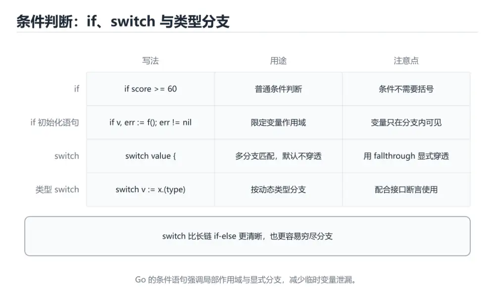

# Go 条件判断

> 内容更新时间：2026-10-06 · 学习阶段：入门 · 预计用时：35 分钟




## 学习目标

- 先认识Go 条件判断需要的工具、输入和输出。
- 按步骤运行最小示例，并记录结果与错误。
- 用一个边界输入验证自己是否真正掌握。

## 前置知识

- 会进行基本的文件或命令行操作。
- 不需要预先掌握「Go」的高级知识。

## 一句话入门

用 if 和 switch 表达分支。

## 最小示例

```go
package main

import "fmt"

func main() {
	temperature := 31
	if temperature > 30 {
		fmt.Println("hot")
	} else {
		fmt.Println("normal")
	}
}
```

## 预期输出

```text
hot
```

## 常见错误与排查

- 忽略函数返回的 error，导致错误被静默吞掉。
- 复制命令时遗漏空格、引号或必要参数。

## 动手练习

1. 原样运行最小示例，保存命令和输出。
2. 把数字 2 改成 10，预测并验证新结果。
3. 制造一个错误输入，写出错误信息和修复方法。

## 本课小结

- 入门阶段先保证能运行、能观察、能解释，再追求复杂功能。
- 每次只改一个变量，记录预测与实际结果。
- 遇到错误先看第一条错误信息，再回到最小示例。

## Go 的 if 语义与初始化语句

Go 的 `if` 条件不需要括号，但代码块必须使用花括号，且左花括号不能另起一行。条件表达式必须是布尔类型，整数或字符串不能隐式转换为布尔值。`if` 支持在条件前写一条初始化语句，例如 `if value, err := parse(input); err == nil { ... }`，变量作用域只覆盖条件与两个分支。这种写法把“取得结果、检查错误、使用结果”放在一个局部范围内，减少了变量泄漏。

Go 没有三元运算符，简单条件要用完整的 `if/else` 表达；这不是缺点，而是有意保持语法单一、可读性稳定。多分支可以用 `switch`，它默认不会贯穿到下一个分支，除非显式写 `fallthrough`。`switch` 也可以带初始化语句和不带表达式，用作多条件判断。`if`、`switch` 和 `for` 是 Go 中最主要的控制结构。

错误处理通常采用提前返回：先检查 `err != nil`，处理或返回错误，再继续正常逻辑。这种“守卫式”写法比层层嵌套更容易阅读。不要把错误信息丢掉，也不要用布尔值代替错误，因为调用方需要上下文来区分失败原因。对于需要包装的错误，可以使用 `%w` 保留错误链，再用 `errors.Is` 或 `errors.As` 判断。

## 布尔表达式与错误处理风格

`&&` 和 `||` 会短路求值：左边已经决定结果时，右边不会执行。因此可以把空指针检查放在前面，例如 `if node != nil && node.Value > 0`，避免越界或 panic。但不要依赖短路来隐藏副作用，也不要把复杂条件写成一长串；把子条件提取成语义明确的变量或函数，能让判断过程可测试。

Go 的零值设计让很多条件更简单：数字默认 0，字符串默认空串，布尔默认 false，指针和接口默认 nil。但 nil 接口和含 nil 指针的接口并不等价，判断时要区分类型和值。切片、map 和 channel 的 nil 行为也各不相同，例如读取 nil map 返回零值，写入 nil map 会 panic。

练习时写一个小函数，用初始化语句解析整数并检查错误，再用提前返回改写嵌套版本。分别覆盖空字符串、负数、零、最大值和非法格式，记录每个分支的返回值。这能同时练习 Go 的条件语法、作用域和错误处理习惯。

## 代码实验：把示例跑成证据

### 实验一：建立基线

```go
package main

import "fmt"

func main() {
	temperature := 31
	if temperature > 30 {
		fmt.Println("hot")
	} else {
		fmt.Println("normal")
	}
}
```

### 实验二：只改一个输入

沿用「Go 条件判断」的最小示例做一次单变量实验：

| 实验 | 改动 | 预测 | 实际 | 结论 |
| --- | --- | --- | --- | --- |
| 基线 | 保持「Go 条件判断」示例原样 |  |  |  |
| 边界 | 把Go 条件判断换成空值或极值 |  |  |  |
| 失败 | 给Go传入非法输入 |  |  |  |

做完后用一句话写出「Go 条件判断」的结论：输入怎么变，结果才怎么变。

### 实验三：制造一个可控错误

声明一个局部变量却不使用，或者删除一个仍然被引用的导入。Go 会把它们当作编译错误；记录错误信息后再恢复。

| 实验 | 改动 | 预测 | 实际 | 结论 |
| --- | --- | --- | --- | --- |
| 基线 | 保持原样 |  |  |  |
| 边界 |  |  |  |  |
| 失败 |  |  |  |  |

### 实验四：用三句话复述

1. 输入是什么，哪些输入属于合法范围，哪些属于边界或非法范围？
2. 程序按什么顺序处理输入，在哪一步产生了状态变化或副作用？
3. 输出如何验证，失败时第一条可观察证据是什么？

## 可运行练习

本节围绕Go 条件判断安排 3 个可交付任务，每个任务都要求留下可以复查的记录。

### 任务 1：用自己的话画出结构

不看书，用一张图说清「Go 条件判断」的结构，画完再对照骨架：

- 主干：一句话入门 → 最小示例 → 预期输出 → 常见错误
- 连接线：在每条边上标出输入、输出与失败路径。
- 自检：能否用一句话说明Go 条件判断与Go的关系？

### 任务 2：做一次对比实验

**验收标准**：表格里两个方案的结论不能完全一样；写下“在什么条件下应该换方案”。

### 任务 3：迁移到自己的场景

**验收标准**：至少有一个可复现的命令、代码片段或数据样例；结论能被别人独立检查。

## 故障现场

### 现场 1：本课的 Go 条件判断 常规用例通过，但边界用例失败

把这条结论放回「Go 条件判断」的完整流程里展开：

- 正文依据：本节围绕Go 条件判断安排 3 个可交付任务，每个任务都要求留下可以复查的记录。
- 落地检查：把「现场 1：本课的 Go 条件判断 常规用例通过，但边界用例失败」改写成一条可执行的核对项，逐条验证输入、超时与失败路径。

### 现场 2：本课的 Go 结果在两次运行之间不一致

**症状**：在本课的练习或生产场景里出现“本课的 Go 结果在两次运行之间不一致”。

**复现**：准备一组最小输入，只保留触发“本课的 Go 结果在两次运行之间不一致”的必要条件，连续运行两次确认结果稳定。

**定位**：围绕“Go 依赖了当前版本、执行顺序或共享状态，单次运行无法暴露差异”检查调用链、输入数据和环境配置，先验证假设再改代码。

**预防**：把“本课的 Go 结果在两次运行之间不一致”写成一条自动化用例，并在本课的验收清单里保留对应检查项。

### 现场 3：本课的验证只在开发机通过

**症状**：在本课的练习或生产场景里出现“本课的验证只在开发机通过”。

## 版本与时效

- 升级前用 go vet、go test -race 与静态检查覆盖并发生命周期
- 模块校验、最小版本选择与供应链安全是生产升级的重点
- 官方发布说明：https://go.dev/doc/devel/release

### 升级检查清单

- 先固定当前版本，跑通全部示例与测验，再升级工具链。
- 只改一个版本变量，记录编译、测试、性能与产物体积的变化。
- 重点回归默认值、弃用警告、序列化格式、并发语义和错误信息。
- 升级完成后更新本课的“最后复核 / 下次复核”日期与版本说明。

## 本课复习清单

离开本课前，逐项确认：

- [ ] 不看解析，能说出「Go 的 if 语句在语法上有什么特点？」的判断依据。
- [ ] 不看解析，能说出的判断依据。
- [ ] 不看解析，能说出「Go 的 switch 语句与 C 风格 switch 相比，关键差异是？」的判断依据。
- [ ] 不看解析，能说出「Go 中没有三目运算符，如何实现类似逻辑？」的判断依据。
- [ ] 不看解析，能说出「填空：Go 条件判断术语速查中，表示的判断依据。
- [ ] 至少运行一次本课示例，记录输入、输出和一个边界情况。
- [ ] 把本课最容易混淆的两个概念写成一句话对照。

| 复盘项 | 记录 |
| --- | --- |
| 已经能独立解释的考点 |  |
| 仍然说不清的概念 |  |
| 下一步验证动作 |  |

## 复习与自测

下面按正文顺序回顾每一节，并给出一个自检问题；说不清的地方回到原章节补课。

### 最小示例

```go
package main

import "fmt"

func main() {
	temperature := 31
	if temperature > 30 {
		fmt.Println("hot")
	} else {
		fmt.Println("normal")
	}
}
```

自检：这一节与相邻主题的边界在哪里？

### 预期输出

```text
hot
```

### 常见错误

自检：把这一节讲给没学过的人，最需要强调哪一点？

### 动手练习

自检：如果去掉这一节里的一个前提，结论会怎样变化？

### Go 的 if 语义与初始化语句

Go 的 `if` 条件不需要括号，但代码块必须使用花括号，且左花括号不能另起一行。条件表达式必须是布尔类型，整数或字符串不能隐式转换为布尔值。

自检：用自己的话复述这一节，并举一个反例。

### 布尔表达式与错误处理风格

`&&` 和 `||` 会短路求值：左边已经决定结果时，右边不会执行。因此可以把空指针检查放在前面，例如 `if node != nil && node.Value > 0`，避免越界或 panic。

## 术语速查

把「Go 条件判断」里反复出现的术语集中放在一起。复习时先遮住右列，尝试用自己的话解释，再回到正文核对。

| 术语 | 一句话说明 |
| --- | --- |
| `if 语句` | 条件不写括号，但必须写花括号；条件里可以带初始化语句。 |
| `switch` | 默认不贯穿，case 命中后自动结束，可以不带条件当多分支用。 |
| `逻辑运算符` | &&、\|\|、! 组合条件，并且短路求值。 |
| `没有三元运算符` | Go 只保留 if-else，需要用变量接收分支结果。 |
| `错误即返回值` | 函数把错误作为返回值层层上交，而不是抛异常。 |

## 考点精讲

### 考点 1：概念判断·Go 条件判断

- **题目**：Go 的 if 语句在语法上有什么特点？
- **判断依据**：在「Go 条件判断」里，条件不写圆括号，但代码块的大括号必须存在。Go 要求条件的圆括号省略、代码块的花括号保留，并且左花括号必须与 if 同行，这是 gofmt 统一格式的一部分。回到「Go 条件判断」的正文示例，用“Go 的 if 语句在语法上有什么特”走一遍Go 条件判断、Go、入门练习的完整流程，能复现的结论才可以保留。

### 考点 2：概念判断·Go 条件判断

- **题目**：Go 中 if value, err := f; err != nil { ... } 这种写法的特点是？
- **判断依据**：在「Go 条件判断」里，初始化语句在 if 作用域内执行，变量只在该结构可用。err == nil { ... }，变量作用域只覆盖条件与两个分支。if 支持一段初始化语句，它先执行，随后判断条件。这道题的关键在「Go 条件判断」的Go 条件判断、Go、入门练习：先确认题干“Go 中 if value”问的是哪一步，再排除偷换前提的选项。

### 考点 3：概念判断·Go 条件判断

- **题目**：Go 的 switch 语句与 C 风格 switch 相比，关键差异是？
- **判断依据**：在「Go 条件判断」里，默认自动结束当前分支。Go 的 switch 默认不穿透，每个 case 执行完自动结束，因此不需要写 break。「Go 条件判断」要求先交代Go 条件判断、Go、入门练习的前提再下结论，所以“默认自动结束当前分支”只在题干“Go 的 switch 语句与 C 风格 switch 相比”给定的条件下成立。

### 考点 4：多选辨析·Go 条件判断

- **题目**：围绕“Go 条件判断”中的 Go 条件判断、Go、入门练习，下列哪两项是本课强调的实践判断？
- **判断依据**：在「Go 条件判断」里，题干的正确项是验证 Go 时要固定版本并覆盖边界输入，结论才可复现；学习 Go 条件判断 时要同时说明输入、输出和失败路径，不能只看正常流程。结论应落在验证 Go 时要固定版本并覆盖边界输入。回到「Go 条件判断」的正文示例，用“围绕Go 条件判断中的 Go 条件判”走一遍Go 条件判断、Go、入门练习的完整流程，能复现的结论才可以保留。

### 考点 5：填空·____

- **题目**：填空：在「Go 条件判断」的术语速查里，「Go 的 `____` 条件不需要括号，但代码块必须使用花括号，且左花括号不能另起一行。条件表达式必须是布尔类型，整数或字符串不能隐式转换为布尔值。`____` 支持在条件前写一条初始化语句，例如 `____ value, err := parse(i」描述的是哪个术语？
- **判断依据**：空格应填写「if」。条件表达式必须是布尔类型，整数或字符串不能隐式转换为布尔值。err == nil { ... }，变量作用域只覆盖条件与两个分支。在「Go 条件判断」里判断这道题，要把Go 条件判断、Go、入门练习的条件、过程与失败路径逐项对齐，换成“填空”这个场景，只有满足前提的结论才成立。

### 考点 6：排错·Go 条件判断

- **题目**：阅读「Go 条件判断」的代码片段，下面哪项判断是正确的？
- **判断依据**：把“条件不写圆括号，但代码块的大括号必须存在”代回「Go 条件判断」里“阅读Go 条件判断的代码片段”的例子核对，条件一旦改变，结论就要用Go 条件判断、Go、入门练习重新推导。回到Go 条件判断、Go、入门练习本身再看一遍：只有“条件不写圆括号，但代码块的大括号必须存在”与题干“阅读Go”的前提一致，结论才成立。

## English Overview

**Title:** Go Conditionals

**Summary:** Express branches with if and switch.

**Category:** Go
**Level:** 入门
**Key terms:** Go 条件判断, Go, 入门练习

## 内容元数据

- 内容版本：v2.0
- 最后更新：2026-10-06
- 学习阶段：入门
- 适用环境：Go 1.24+
- 内容来源：内置结构化课程与工程实践整理
- 相关主题：Go 条件判断、Go、入门练习
- 质量版本：P0 测验标准 + P1 覆盖扩展 + P2 体验补全

## 参考资料与复核

- 最后复核：2026-10-04
- 下次复核：2027-04-04
- 复核范围：版本兼容、API 行为、安全建议与工程实践
- 来源性质：官方文档、标准或权威教材；正文为离线教学重组

| 参考资料 | 本课用途 |
| --- | --- |
| [Effective Go](https://go.dev/doc/effective_go) | 惯用写法与接口设计 |
| [Go 官方教程](https://go.dev/tour/) | 语言基础与并发入门 |
| [database/sql](https://pkg.go.dev/database/sql) | 数据库连接、事务与预编译 |

> 「Go 条件判断」的链接用于离线阅读后的延伸核对；App 不会自动联网。

## 复习与迁移

复习目标：把「Go 条件判断」的判断标准放回可复现的例子里。先自己作答，再对照依据；如果结论正确但理由不完整，回到正文补足前提。

### 概念复述

- 用一句话说明「Go 条件判断」解决什么问题：用 if 和 switch 表达分支。
- 写出Go 条件判断、Go、入门练习之间的关系，并各举一个例子。
- 说出本课最容易混淆的两个概念，以及区分它们的判据。

### 正文逐节复核

- **Go 的 if 语义与初始化语句**：Go 的 `if` 条件不需要括号，但代码块必须使用花括号，且左花括号不能另起一行。
- **布尔表达式与错误处理风格**：Go 的零值设计让很多条件更简单：数字默认 0，字符串默认空串，布尔默认 false，指针和接口默认 nil。
- **实践任务**：本节围绕Go 条件判断安排 3 个可交付任务，每个任务都要求留下可以复查的记录。
- **逐节复习与自检**：Go 的 `if` 条件不需要括号，但代码块必须使用花括号，且左花括号不能另起一行。

### 测验回顾

1. Go 的 if 语句在语法上有什么特点？
   - 依据：在「Go 条件判断」里，条件不写圆括号，但代码块的大括号必须存在。Go 要求条件的圆括号省略、代码块的花括号保留，并且左花括号必须与 if 同行，这是 gofmt 统一格式的一部分。回到「Go 条件判断」的正文示例，用“Go 的 if 语句在语法上有什么特”走一遍Go 条件判断、Go、入门练习的完整流程，能复现的结论才可以保留。
2. Go 中 if value, err := f; err != nil { ... } 这种写法的特点是？
   - 依据：在「Go 条件判断」里，初始化语句在 if 作用域内执行，变量只在该结构可用。err == nil { ... }，变量作用域只覆盖条件与两个分支。if 支持一段初始化语句，它先执行，随后判断条件。这道题的关键在「Go 条件判断」的Go 条件判断、Go、入门练习：先确认题干“Go 中 if value”问的是哪一步，再排除偷换前提的选项。
3. Go 的 switch 语句与 C 风格 switch 相比，关键差异是？
   - 依据：在「Go 条件判断」里，默认自动结束当前分支。Go 的 switch 默认不穿透，每个 case 执行完自动结束，因此不需要写 break。「Go 条件判断」要求先交代Go 条件判断、Go、入门练习的前提再下结论，所以“默认自动结束当前分支”只在题干“Go 的 switch 语句与 C 风格 switch 相比”给定的条件下成立。
4. 围绕“Go 条件判断”中的 Go 条件判断、Go、入门练习，下列哪两项是本课强调的实践判断？
   - 依据：在「Go 条件判断」里，题干的正确项是验证 Go 时要固定版本并覆盖边界输入，结论才可复现；学习 Go 条件判断 时要同时说明输入、输出和失败路径，不能只看正常流程。结论应落在验证 Go 时要固定版本并覆盖边界输入。回到「Go 条件判断」的正文示例，用“围绕Go 条件判断中的 Go 条件判”走一遍Go 条件判断、Go、入门练习的完整流程，能复现的结论才可以保留。
5. 填空：在「Go 条件判断」的术语速查里，「Go 的 `____` 条件不需要括号，但代码块必须使用花括号，且左花括号不能另起一行。条件表达式必须是布尔类型，整数或字符串不能隐式转换为布尔值。`____` 支持在条件前写一条初始化语句，例如 `____ value, err := parse(i」描述的是哪个术语？
   - 依据：空格应填写「if」。条件表达式必须是布尔类型，整数或字符串不能隐式转换为布尔值。err == nil { ... }，变量作用域只覆盖条件与两个分支。在「Go 条件判断」里判断这道题，要把Go 条件判断、Go、入门练习的条件、过程与失败路径逐项对齐，换成“填空”这个场景，只有满足前提的结论才成立。
6. 阅读「Go 条件判断」的代码片段，下面哪项判断是正确的？
   - 依据：把“条件不写圆括号，但代码块的大括号必须存在”代回「Go 条件判断」里“阅读Go 条件判断的代码片段”的例子核对，条件一旦改变，结论就要用Go 条件判断、Go、入门练习重新推导。回到Go 条件判断、Go、入门练习本身再看一遍：只有“条件不写圆括号，但代码块的大括号必须存在”与题干“阅读Go”的前提一致，结论才成立。

### 迁移练习

把「Go 条件判断」的结论迁移到相邻主题，每次迁移都写清预测与证据：

1. 换输入：用Go 条件判断处理一组你自己的数据，对比教材示例的结果差异。
2. 换失败条件：制造一个Go相关的错误，说明如何从错误信息定位根因。
3. 换规模：把数据量或并发度提高一个数量级，说明「Go 条件判断」的结论是否仍成立。

## 工程化精练：决策、失败与验证

这一章把「Go 条件判断」从“看懂”推进到“能判断、能验证、能排错”。所有判断都围绕Go 条件判断、Go与入门练习展开，并与前文的示例、测验和失败现场互相对照。

### 一、Go 条件判断 的判断算法

| 步骤 | 要回答的问题 | 判断依据 | 记录什么 |
| --- | --- | --- | --- |
| 1. 定目标 | 「Go 条件判断」这一步要解决什么问题？ | 把Go 条件判断的目标写成一句可验证的结论 | 输入、约束、成功标准 |
| 2. 找边界 | Go在什么条件下失效？ | 先列空值、极值、重复和失败路径 | 反例与触发条件 |
| 3. 跑基线 | 原始示例的真实输出是什么？ | 命令、版本和环境必须可复现 | 命令、输出、耗时 |
| 4. 只改一处 | 把入门练习换成另一种取值会怎样？ | 预测写在运行之前 | 预测与实际的差异 |
| 5. 回写结论 | 结论能否被他人复现？ | 把判断写成清单或测试 | 结论、证据、遗留问题 |

这张表的用法不是从上到下浏览，而是每次只填一行：先用「Go 条件判断」前文的示例验证第 3 行，再故意破坏一个条件验证第 2 行。当你能在不看解析的情况下说出Go 条件判断的判断依据，才算真正掌握本课。

- 先从Go 条件判断入手：把它写成“输入是什么、输出是什么、哪一步最容易出错”。如果这三句话中有一句说不清，说明对「Go 条件判断」的理解还停留在术语层面，需要回到正文的最小示例重新观察一次。

- 再把Go当成对照实验的变量：固定其他条件，只改变它的取值，记录输出是否变化。结论“变”或“不变”都要写出理由，并说明这个理由能否被他人独立复现。

- 针对入门练习做一次失败演练：故意给出空值、极值或错误类型，观察「Go 条件判断」的报错位置和处理方式。错误信息只是入口，真正要定位的是哪一层假设被破坏。

- 把「Go 条件判断」的结论压缩成一条可执行清单：先检查输入，再检查版本与环境，然后跑最小用例，最后才扩大规模。顺序颠倒会让排错范围成倍增加。

- 如果结论依赖时间或规模，就把数据量提高一个数量级再跑一次。在「Go 条件判断」里，小样本成立不代表大样本成立，复杂度、资源占用和失败率都要重新记录。

- 如果结论依赖并发或共享状态，就固定输入并连续运行多次。结果不一致时，优先怀疑「Go 条件判断」中Go 条件判断相关步骤的隐藏状态，而不是先改代码。

- 把「Go 条件判断」的判断写成测试：一个正常用例、一个边界用例、一个失败用例。测试通过只是起点，还要确认失败用例确实以预期方式失败。

- 把本课与相邻主题连起来：Go 条件判断解决的是“怎么做”，Go回答“什么时候不适用”。两者都答得出来，迁移才算完成。

> 第 2 轮复核「Go 条件判断」：把上面的结论逐条改写为可验证的问题，并记录仍不确定的部分。

- 先从Go 条件判断入手：把它写成“输入是什么、输出是什么、哪一步最容易出错”。如果这三句话中有一句说不清，说明对「Go 条件判断」的理解还停留在术语层面，需要回到正文的最小示例重新观察一次。

- 再把Go当成对照实验的变量：固定其他条件，只改变它的取值，记录输出是否变化。结论“变”或“不变”都要写出理由，并说明这个理由能否被他人独立复现。

- 针对入门练习做一次失败演练：故意给出空值、极值或错误类型，观察「Go 条件判断」的报错位置和处理方式。错误信息只是入口，真正要定位的是哪一层假设被破坏。

- 把「Go 条件判断」的结论压缩成一条可执行清单：先检查输入，再检查版本与环境，然后跑最小用例，最后才扩大规模。顺序颠倒会让排错范围成倍增加。

- 如果结论依赖时间或规模，就把数据量提高一个数量级再跑一次。在「Go 条件判断」里，小样本成立不代表大样本成立，复杂度、资源占用和失败率都要重新记录。

- 如果结论依赖并发或共享状态，就固定输入并连续运行多次。结果不一致时，优先怀疑「Go 条件判断」中Go 条件判断相关步骤的隐藏状态，而不是先改代码。

- 把「Go 条件判断」的判断写成测试：一个正常用例、一个边界用例、一个失败用例。测试通过只是起点，还要确认失败用例确实以预期方式失败。

- 把本课与相邻主题连起来：Go 条件判断解决的是“怎么做”，Go回答“什么时候不适用”。两者都答得出来，迁移才算完成。

> 第 3 轮复核「Go 条件判断」：把上面的结论逐条改写为可验证的问题，并记录仍不确定的部分。

- 先从Go 条件判断入手：把它写成“输入是什么、输出是什么、哪一步最容易出错”。如果这三句话中有一句说不清，说明对「Go 条件判断」的理解还停留在术语层面，需要回到正文的最小示例重新观察一次。

- 再把Go当成对照实验的变量：固定其他条件，只改变它的取值，记录输出是否变化。结论“变”或“不变”都要写出理由，并说明这个理由能否被他人独立复现。

- 针对入门练习做一次失败演练：故意给出空值、极值或错误类型，观察「Go 条件判断」的报错位置和处理方式。错误信息只是入口，真正要定位的是哪一层假设被破坏。

- 把「Go 条件判断」的结论压缩成一条可执行清单：先检查输入，再检查版本与环境，然后跑最小用例，最后才扩大规模。顺序颠倒会让排错范围成倍增加。

### 二、Go 条件判断 的机制拆解与自测

把本课考点还原成可回答的问题，再逐题写出依据：

**问题 1**：Go 的 if 语句在语法上有什么特点？

- 关联术语：Go 条件判断
- 判断依据：条件不写圆括号，但代码块的大括号必须存在
- 追问：如果把Go 条件判断的条件换成边界值，这个结论是否仍然成立？

**问题 2**：Go 中 if value, err := f; err != nil { ... } 这种写法的特点是？

- 关联术语：Go
- 判断依据：初始化语句在 if 作用域内执行，变量只在该结构可用
- 追问：如果把Go的条件换成边界值，这个结论是否仍然成立？

**问题 3**：Go 的 switch 语句与 C 风格 switch 相比，关键差异是？

- 关联术语：入门练习
- 判断依据：默认自动结束当前分支
- 追问：如果把入门练习的条件换成边界值，这个结论是否仍然成立？

**问题 4**：围绕“Go 条件判断”中的 Go 条件判断、Go、入门练习，下列哪两项是本课强调的实践判断？

- 关联术语：Go 条件判断
- 判断依据：验证 Go 时要固定版本并覆盖边界输入，结论才可复现
- 追问：如果把Go 条件判断的条件换成边界值，这个结论是否仍然成立？

**问题 5**：填空：在「Go 条件判断」的术语速查里，「Go 的 `____` 条件不需要括号，但代码块必须使用花括号，且左花括号不能另起一行。条件表达式必须是布尔类型，整数或字符串不能隐式转换为布尔值。`____` 支持在条件前写一条初始化语句，例如 `____ value, err := parse(i」描述的是哪个术语？

- 关联术语：Go
- 判断依据：回到「Go 条件判断」正文对应小节，先用最小示例验证再下结论。
- 追问：如果把Go的条件换成边界值，这个结论是否仍然成立？

**问题 6**：阅读「Go 条件判断」的代码片段，下面哪项判断是正确的？

- 关联术语：入门练习
- 判断依据：回到「Go 条件判断」正文对应小节，先用最小示例验证再下结论。
- 追问：如果把入门练习的条件换成边界值，这个结论是否仍然成立？

### 三、失败模式与修复顺序

| 失败信号 | 常见根因 | 先做什么 | 修复后如何确认 |
| --- | --- | --- | --- |
| 「Go 条件判断」中 Go 条件判断 相关步骤报错 | 输入、版本或前置条件与示例不一致 | 保留第一条错误信息，回到最小输入 | 用条件不写圆括号，但代码块的大括号必须存在复跑，确认输出可复现 |
| 「Go 条件判断」中 Go 相关步骤报错 | 输入、版本或前置条件与示例不一致 | 保留第一条错误信息，回到最小输入 | 用初始化语句在 if 作用域内执行，变量只在该结构可用复跑，确认输出可复现 |
| 「Go 条件判断」中 入门练习 相关步骤报错 | 输入、版本或前置条件与示例不一致 | 保留第一条错误信息，回到最小输入 | 用默认自动结束当前分支复跑，确认输出可复现 |
| 结果在两次运行之间不一致 | 隐藏状态、并发或环境差异 | 固定版本与输入，记录随机因素 | 连续运行三次得到同一结论 |
| 单次结果正确但规模一大就失效 | 只测了正常路径，没有覆盖边界 | 把数据量或并发度提高一个数量级 | 记录边界值、耗时与失败率 |

排错顺序固定为：先复现，再缩小输入，然后只改一个条件，最后把结论写成回归用例。对「Go 条件判断」来说，任何不能复现的“修好了”都不算完成。

### 四、离开本课前的验证清单

| 检查项 | 通过标准 | 证据 |
| --- | --- | --- |
| 能复述 | 用三句话说明「Go 条件判断」解决什么问题、边界在哪 | 不看解析写出的结论 |
| 能运行 | 最小示例在本机跑通 | 命令、输出与版本 |
| 能改条件 | 只改一个输入并解释差异 | 预测与实际的对照 |
| 能排错 | 至少制造并修复一个失败 | 错误信息与修复步骤 |
| 能迁移 | 把Go 条件判断、Go、入门练习用到新场景 | 一个自选练习的结论 |

完成标准：能不看解析说清「Go 条件判断」全部自测题的依据，并且至少有一条Go 条件判断相关的结论经过真实运行验证。如果某一步只停留在“感觉懂了”，就把它写成下一轮针对「Go 条件判断」的最小验证任务。

### 五、把结论写成可检查的证据

学习「Go 条件判断」时，最容易出现的情况是“听过、看懂了，但换一个输入就说不清”。下面把Go 条件判断与Go放进一条可检查的证据链：每一句结论都要能回答“从哪里来、在什么条件下成立、失败时怎么发现”。

| 证据类型 | 本课要求 | 不合格的表现 |
| --- | --- | --- |
| 概念证据 | 用一句话说明Go 条件判断的定义与适用场景 | 只背术语，说不出它解决什么问题 |
| 运行证据 | 能复现「Go 条件判断」的最小示例 | 输出与记录对不上，或换机器就不一致 |
| 对照证据 | 只改一个条件，说明差异来自哪里 | 一次改多个变量，无法归因 |
| 失败证据 | 故意制造错误并记录恢复步骤 | 只测正常路径，失败时靠猜 |
| 迁移证据 | 把Go用到自选场景 | 换一个例子就完全套不上 |

举例：条件不写圆括号，但代码块的大括号必须存在。把这个结论代回「Go 条件判断」的正文，找出它对应的输入、处理步骤与输出；再换掉其中一个条件，观察结论是否仍然成立。能完成这一步，才说明这条知识已经从“记忆”变成“可用的判断”。

最后留一个自检问题：如果只能保留三条笔记，你会写下哪三句？把答案限定为「Go 条件判断」中的可验证结论，并给每条结论配一个反例。这三句加上对应反例，就是本课最值得带入后续课程的复习材料。
