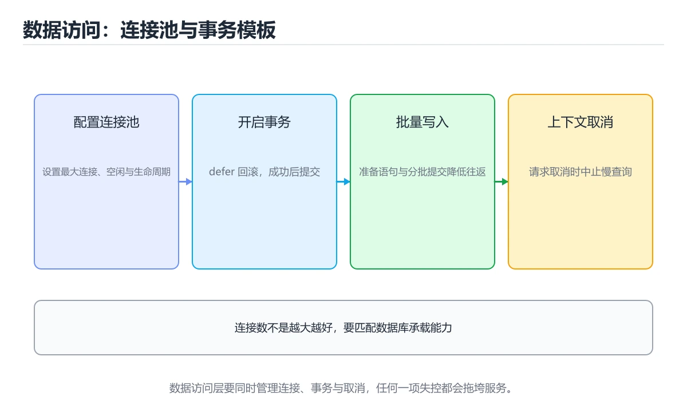
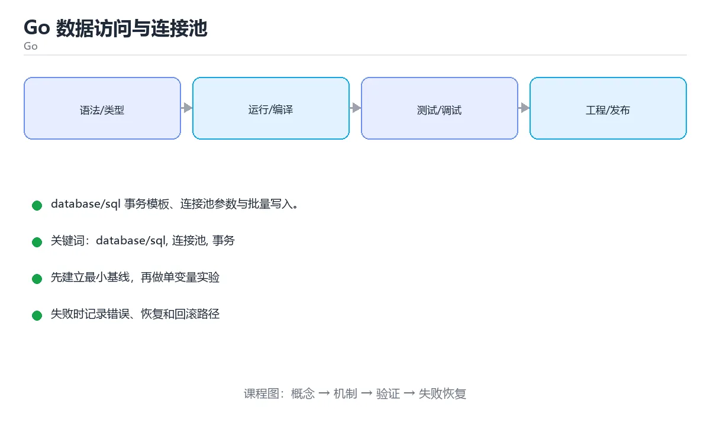

# Go 数据访问：database/sql 与连接池





> 内容更新时间：2026-10-03 · 学习阶段：进阶 · 预计用时：18 分钟

## 学习目标

- 能用自己的话解释「Go 数据访问与连接池」解决了什么问题，而不是只背术语。
- 能说清 「database/sql」、「连接池」、「事务」、「批量插入」 之间的关系，并分别举出一个例子。
- 能把本课知识放回「Go」的知识体系，说明它和相邻主题的边界。
- 能完成本课练习，并用验收标准检查自己的结果。

> 一句话摘要：database/sql 事务模板、连接池参数与批量写入。

## 前置知识

- 先完成上一课《Go 测试进阶：基准、模糊与集成》；如果已经掌握，可以直接用本课练习自测。
- 本课阶段：进阶。建议先掌握同一分类的基础课程，并能独立运行正文中的最小示例。
- 开始前先复习：database/sql、连接池、事务。
- 如果某一步看不懂，先记录具体卡点，完成练习后再回头读一遍。


## 方案选型速查

| 方案 | 类型安全 | 学习成本 | 适用 |
| --- | --- | --- | --- |
| `database/sql` | 手写扫描 | 低 | 简单查询、完全掌控 SQL |
| sqlc | 由 SQL 生成类型安全代码 | 中 | 想要类型安全又不想写 ORM |
| GORM | 链式 API + 自动迁移 | 中 | 快速开发 CRUD |
| ent | 代码生成 + 图查询 | 中高 | 复杂关系模型 |

要点：**无论用哪种方案，SQL 与索引设计仍是性能的决定因素**，ORM 只改变写法。

## 连接池参数速查

| 参数 | 含义 | 建议 |
| --- | --- | --- |
| `SetMaxOpenConns` | 最大连接数 | 按数据库承载能力设定，避免打满 |
| `SetMaxIdleConns` | 空闲连接数 | 与最大连接数接近，减少频繁建连 |
| `SetConnMaxLifetime` | 连接最长存活 | 几分钟到半小时，避开数据库侧超时 |
| `SetConnMaxIdleTime` | 空闲多久回收 | 与负载波动匹配 |
| `context` 超时 | 单次查询超时 | 每个查询都要设 |

```go
// 初始化连接池：显式设置参数并验证连通性
func NewDB(ctx context.Context, dsn string) (*sql.DB, error) {
	db, err := sql.Open("pgx", dsn)
	if err != nil {
		return nil, fmt.Errorf("打开数据库: %w", err)
	}
	db.SetMaxOpenConns(20)
	db.SetMaxIdleConns(20)
	db.SetConnMaxLifetime(30 * time.Minute)
	db.SetConnMaxIdleTime(5 * time.Minute)

	pingCtx, cancel := context.WithTimeout(ctx, 3*time.Second)
	defer cancel()
	if err := db.PingContext(pingCtx); err != nil {
		return nil, fmt.Errorf("连接检测失败: %w", err)
	}
	return db, nil
}

// 事务模板：用 defer 保证回滚，提交失败也回滚
func Transfer(ctx context.Context, db *sql.DB, from, to int64, cents int64) error {
	tx, err := db.BeginTx(ctx, &sql.TxOptions{Isolation: sql.LevelReadCommitted})
	if err != nil {
		return fmt.Errorf("开启事务: %w", err)
	}
	defer func() {
		_ = tx.Rollback()               // 已提交时返回 ErrTxDone，可忽略
	}()

	if _, err := tx.ExecContext(ctx,
		`UPDATE accounts SET balance = balance - $1 WHERE id = $2 AND balance >= $1`,
		cents, from); err != nil {
		return fmt.Errorf("扣款: %w", err)
	}
	if _, err := tx.ExecContext(ctx,
		`UPDATE accounts SET balance = balance + $1 WHERE id = $2`,
		cents, to); err != nil {
		return fmt.Errorf("入账: %w", err)
	}
	return tx.Commit()
}

// 批量插入：预编译语句 + 单事务，避免 N 次往返
func BatchInsert(ctx context.Context, db *sql.DB, rows [][]any) error {
	tx, err := db.BeginTx(ctx, nil)
	if err != nil {
		return err
	}
	defer func() { _ = tx.Rollback() }()

	stmt, err := tx.PrepareContext(ctx, `INSERT INTO orders(user_id, amount_cents) VALUES ($1, $2)`)
	if err != nil {
		return err
	}
	defer stmt.Close()

	for _, row := range rows {
		if _, err := stmt.ExecContext(ctx, row...); err != nil {
			return fmt.Errorf("插入失败: %w", err)
		}
	}
	return tx.Commit()
}
```

## 必守规则速查

| 规则 | 原因 |
| --- | --- |
| 永远用参数化查询 | 防止 SQL 注入 |
| 每个查询带 context 超时 | 避免慢查询拖垮服务 |
| 用 `rows.Close()` 与检查 `rows.Err()` | 释放连接并发现遍历中的错误 |
| 只取需要的列 | 减少网络与内存开销 |
| 分页用游标而非大 OFFSET | 深分页会扫描大量行 |
| 不要在循环里单条查询 | N+1 问题，改批量或 JOIN |
| 事务保持短小 | 长事务持锁、放大主从延迟 |
| 连接池与数据库上限对齐 | 连接打满会导致整体不可用 |

## 常见错误对照表

| 容易踩的做法 | 实际现象 | 原因与正确做法 |
| --- | --- | --- |
| 用字符串拼接 SQL | 注入漏洞 | 一律参数化 |
| 忘记 `rows.Close()` | 连接泄漏、池被耗尽 | `defer rows.Close()` |
| 不检查 `rows.Err()` | 中途错误被忽略 | 遍历后必须检查 |
| 事务里做网络调用 | 长事务、锁等待 | 外部调用放事务外 |
| 连接池设得过大 | 数据库连接打满 | 按数据库承载能力设定 |
| `sql.Open` 返回即认为连通 | 首次查询才报错 | 用 `PingContext` 验证 |
| 循环里逐条插入 | 极慢 | 预编译语句加单事务批处理 |
| 用 `SELECT *` | 列变更导致扫描错位 | 显式列出列 |

## 自测清单

- [ ] 所有 SQL 使用参数化查询并带 context 超时。
- [ ] 连接池四个参数按数据库能力显式配置。
- [ ] 事务短小、用 defer 回滚、外部调用放事务外。
- [ ] 批量写入使用预编译语句加单事务。
- [ ] `rows` 正确关闭并检查 `Err()`。


## 零基础详解：Go 访问数据库

### 一句话说清它是什么

Go 用 `database/sql` 统一访问各种数据库：**连接池 + 预编译语句 + context + 事务** 是四块基石。
用 ORM 也可以，但先理解这四块，出问题时才知道从哪查。

### 用生活比喻理解

| 概念 | 比喻 | 说明 |
| --- | --- | --- |
| 连接池 | 车队的车辆 | 复用连接，避免每次新建 |
| 预编译语句 | 固定模具 | SQL 结构与数据分离，防注入 |
| context | 任务时限 | 超时就取消，别一直等 |
| 事务 | 打包操作 | 要么全成功，要么全回滚 |
| N+1 查询 | 来回跑仓库 | 一次能取的别拆成 N 次 |

### 连接池的四个关键参数

```go
db, err := sql.Open("postgres", dsn)     // 注意：Open 不会真的连库
if err != nil {
    return err
}

db.SetMaxOpenConns(25)                   // 最大连接数
db.SetMaxIdleConns(10)                   // 空闲连接数
db.SetConnMaxLifetime(30 * time.Minute)  // 连接最长寿命
db.SetConnMaxIdleTime(5 * time.Minute)   // 空闲多久回收

ctx, cancel := context.WithTimeout(context.Background(), 3*time.Second)
defer cancel()
if err := db.PingContext(ctx); err != nil {   // 真正验证连通性
    return fmt.Errorf("数据库不可用: %w", err)
}
```

| 参数 | 设太小 | 设太大 |
| --- | --- | --- |
| MaxOpenConns | 请求排队 | 压垮数据库 |
| MaxIdleConns | 频繁建连 | 占用连接 |
| ConnMaxLifetime | 用到被服务端断开的连接 | 连接复用不足 |

### 查询三步：Query、Scan、Close

```go
func ListUsers(ctx context.Context, db *sql.DB, minAge int) ([]User, error) {
    const query = `
        SELECT id, name, age
        FROM users
        WHERE age >= $1
        ORDER BY id
        LIMIT 100`

    rows, err := db.QueryContext(ctx, query, minAge)   // 参数化，别拼接
    if err != nil {
        return nil, fmt.Errorf("查询用户: %w", err)
    }
    defer rows.Close()                                  // 必须关闭

    var users []User
    for rows.Next() {
        var u User
        if err := rows.Scan(&u.ID, &u.Name, &u.Age); err != nil {
            return nil, fmt.Errorf("扫描行: %w", err)
        }
        users = append(users, u)
    }
    if err := rows.Err(); err != nil {                  // 别漏掉这一步
        return nil, fmt.Errorf("遍历结果: %w", err)
    }
    return users, nil
}
```

**三个必须做的动作**：`defer rows.Close()`、检查 `rows.Err()`、用 `QueryContext` 传 context。

### 单行查询与「没找到」

```go
var u User
err := db.QueryRowContext(ctx, query, id).Scan(&u.ID, &u.Name, &u.Age)
switch {
case errors.Is(err, sql.ErrNoRows):
    return User{}, ErrNotFound        // 业务错误，不是系统错误
case err != nil:
    return User{}, fmt.Errorf("查询用户 %d: %w", id, err)
}
```

不要把 `sql.ErrNoRows` 当成 500 错误返回给用户。

### 事务：三步不能少

```go
func Transfer(ctx context.Context, db *sql.DB, from, to int, amount int) error {
    tx, err := db.BeginTx(ctx, &sql.TxOptions{Isolation: sql.LevelSerializable})
    if err != nil {
        return fmt.Errorf("开启事务: %w", err)
    }
    defer func() {
        if err != nil {                 // 出错就回滚
            _ = tx.Rollback()
        }
    }()

    if _, err = tx.ExecContext(ctx, `UPDATE accounts SET balance = balance - $1 WHERE id = $2`, amount, from); err != nil {
        return fmt.Errorf("扣款: %w", err)
    }
    if _, err = tx.ExecContext(ctx, `UPDATE accounts SET balance = balance + $1 WHERE id = $2`, amount, to); err != nil {
        return fmt.Errorf("入账: %w", err)
    }
    if err = tx.Commit(); err != nil {
        return fmt.Errorf("提交: %w", err)
    }
    return nil
}
```

注意 `defer` 里闭合的是外层的 `err` 变量，所以要用 `err =` 而不是 `:=`。

### 避免 N+1 查询

```go
// 反例：先查 100 个订单，再为每个订单查一次用户 —— 共 101 次查询
for _, o := range orders {
    _ = db.QueryRow("SELECT name FROM users WHERE id = $1", o.UserID)
}

// 正例：一次查回来，在内存里做映射
// SELECT id, name FROM users WHERE id = ANY($1)
nameByID := make(map[int]string, len(userIDs))
// ... 填充
```

### database/sql、sqlc、GORM 怎么选

| 方案 | 特点 | 适合 |
| --- | --- | --- |
| `database/sql` | 手写 SQL，最可控 | 追求性能与可控性 |
| `sqlc` | 写 SQL 自动生成类型安全代码 | **推荐的中间路线** |
| `GORM` | 全功能 ORM，上手快 | 快速开发、CRUD 多 |

### 新手最容易踩的八个坑

| 坑 | 现象 | 正确做法 |
| --- | --- | --- |
| 以为 `sql.Open` 会连库 | 错误延后暴露 | 用 `PingContext` 验证 |
| 忘了 `rows.Close()` | 连接泄漏，池被耗尽 | 拿到 rows 立刻 defer |
| 漏检查 `rows.Err()` | 遍历中途的错误被吞 | 循环后必须检查 |
| 用字符串拼 SQL | SQL 注入 | 一律用参数占位 |
| 事务里用 `:=` 重新声明 err | 回滚不生效 | 用 `err =` |
| 把 `sql.ErrNoRows` 当系统错误 | 用户看到 500 | 转成业务错误 |
| 请求级操作不带 context | 无法取消，慢查询拖垮服务 | 全部传 `ctx` |
| 循环里查数据库 | N+1，性能极差 | 批量查询 + 内存映射 |

### 手把手练习：带分页与批量查询

```go
type User struct {
    ID   int
    Name string
}

func ListByIDs(ctx context.Context, db *sql.DB, ids []int) ([]User, error) {
    if len(ids) == 0 {
        return nil, nil
    }

    // PostgreSQL 用 ANY($1)；MySQL 可用 IN (?,?,?) 动态占位
    rows, err := db.QueryContext(ctx,
        `SELECT id, name FROM users WHERE id = ANY($1)`, pq.Array(ids))
    if err != nil {
        return nil, fmt.Errorf("批量查询: %w", err)
    }
    defer rows.Close()

    users := make([]User, 0, len(ids))
    for rows.Next() {
        var u User
        if err := rows.Scan(&u.ID, &u.Name); err != nil {
            return nil, fmt.Errorf("扫描: %w", err)
        }
        users = append(users, u)
    }
    if err := rows.Err(); err != nil {
        return nil, fmt.Errorf("遍历: %w", err)
    }
    return users, nil
}
```

### 学完自测

- [ ] 能说出连接池四个参数各自的作用。
- [ ] 知道 `sql.Open` 与 `PingContext` 的区别。
- [ ] 能说出查询结果必须做的三个收尾动作。
- [ ] 知道事务里为什么要注意 `err` 的声明方式。
- [ ] 能说出 N+1 查询的成因与解决思路。

## 动手练习


> 本课练习重点：围绕「database/sql、连接池、事务」完成复述、实验和交付，每个结果都要能被别人检查。

先写最小程序并用 go test 验证，再补 context、并发上限和错误传播。

### 练习 1：建立心智模型（10 分钟）

合上教程，用 3～5 句话回答：

1. 「Go 数据访问与连接池」解决了什么问题？
2. 如果没有它，会出现什么具体后果？
3. 它和「连接池」是什么关系？

**验收标准**：至少出现一个本课关键词，并写出一个反例、边界条件或失效场景。

### 练习 2：做一次可控实验（20 分钟）

从正文中选一个最小示例，完成以下操作：

1. 先预测修改一个参数、输入或步骤后的结果。
2. 再实际执行或逐步推演，记录真实结果。
3. 如果结果与预测不同，写出差异原因。

**验收标准**：留下「原例 → 改动 → 预测 → 结果 → 原因」五步记录。

### 练习 3：交付一个小结果（30 分钟）

写一个可运行的小程序，并用 `go test` 或 `go vet` 验证结果。

任务要求：

- 结果必须能被别人检查，不能只写“我已经理解了”。
- 至少覆盖「database/sql」和「连接池」两个关键词。
- 写出 1 个仍然不确定的问题，以及下一步如何验证。

> 提示：时间有限时优先做练习 1 和练习 2；练习 3 可以拆成两次完成。

## 本课小结

- 核心问题：「Go 数据访问与连接池」不是孤立术语，而是在「Go」中解决一类具体问题。
- 关键关系：先分清「database/sql」与「连接池」的职责，再理解「事务」的适用边界。
- 判断标准：能解释正常场景、边界条件和失败场景，才算真正掌握。
- 下一步：完成练习后，用自己的话写下 3 条要点，再去做本课测验。


## 考点精讲：把测验题还原成判断过程

本课有 6 个判断点。先自己作答，再看「判断依据」；如果结论正确但理由不完整，回到正文对应章节补足概念。

### 考点 1：数据库连接池的 SetMaxOpenConns 设置过大，会有什么后果？

- **正确判断**：数据库连接被打满
- **判断依据**：正确答案是「数据库连接被打满」，本课在「零基础详解：Go 访问数据库」中说明：Go 用 database/sql 统一访问各种数据库：连接池 + 预编译语句 + context + 事务 是四块基石。连接数超过数据库承载能力会导致排队、内存上涨甚至拒绝服务，应按数据库能力设定。本课还在「零基础详解：Go 访问数据库」中说明：不要把 sql.ErrNoRows 当成 500 错误返回给用户。本课还在「零基础详解：Go 访问数据库」中说明：知道 sql.Open 与 PingContext 的区别。
- **迁移检查**：如果给某个错误选项去掉一个限定词，它会不会变成正确？说明理由。

### 考点 2：遍历 Query 结果集后，必须做什么？

- **正确判断**：关闭 rows 并检查 rows.Err()
- **判断依据**：正确答案是「关闭 rows 并检查 rows.Err()」，本课在「零基础详解：Go 访问数据库」中说明：Go 用 database/sql 统一访问各种数据库：连接池 + 预编译语句 + context + 事务 是四块基石。Close 释放连接，Err 能发现遍历过程中发生的错误，两者缺一不可。本课还在「零基础详解：Go 访问数据库」中说明：三个必须做的动作：defer rows.Close()、检查 rows.Err()、用 QueryContext 传 context。
- **迁移检查**：把题干里的一个条件换成边界值，原来的结论还成立吗？写出判断过程。

### 考点 3：批量插入大量数据，性能最好的写法是？

- **正确判断**：预编译语句加单个事务批量执行
- **判断依据**：正确答案是「预编译语句加单个事务批量执行」，本课在「方案选型速查」中说明：要点：无论用哪种方案，SQL 与索引设计仍是性能的决定因素，ORM 只改变写法。预编译减少解析开销，单事务减少提交与日志刷盘次数。本课还在「零基础详解：Go 访问数据库」中说明：知道事务里为什么要注意 err 的声明方式。
- **迁移检查**：遮住选项，只根据定义复述一次答案，再回来看哪个选项与复述一致。

### 考点 4：关于事务，正确的做法是？

- **正确判断**：事务尽量短小，外部调用放在事务外
- **判断依据**：正确答案是「事务尽量短小，外部调用放在事务外」，本课在「零基础详解：Go 访问数据库」中说明：注意 defer 里闭合的是外层的 err 变量，所以要用 err = 而不是 :=。长事务会长期持锁并放大主从延迟，外部调用应移到事务外。本课还在「零基础详解：Go 访问数据库」中说明：知道事务里为什么要注意 err 的声明方式。
- **迁移检查**：把题干里的一个条件换成边界值，原来的结论还成立吗？写出判断过程。

### 考点 5：防止 SQL 注入的根本做法是？

- **正确判断**：一律使用参数化查询
- **判断依据**：正确答案是「一律使用参数化查询」，这道题在问防止SQL注入的根本做法是，判断时要把题干限定的输入、边界与目标逐项对齐。参数化让数据与语句分离，从根本上避免注入。课程摘要指出database/sql 事务模板，连接池参数与批量写入，本课要判断的正是防止SQL注入的根本做法是。
- **迁移检查**：把题干里的一个条件换成边界值，原来的结论还成立吗？写出判断过程。

### 考点 6：补全代码：「Go 数据访问与连接池」示例中，下面这行代码缺少哪个关键字或函数名？请填入 ____。 `db.____(30 * time.Minute)`

- **正确判断**：SetConnMaxLifetime / setconnmaxlifetime
- **判断依据**：正确答案是「SetConnMaxLifetime」，这道题在问补全代码：Go数据访问与连接池示例中，下面这行代码缺…___(30*time.Minute)`，判断时要把题干限定的输入、边界与目标逐项对齐。本课示例中还能看到 `db.SetConnMaxLifetime(30 * time.Minute)` 这样的用法，说明该关键字在本课代码中承担实际功能。
- **迁移检查**：把答案换成另一种等价写法，是否仍然正确？说明依据。

## 本课复习清单

离开本课前，逐项确认：

- [ ] 不看解析，能说出「数据库连接池的 SetMaxOpenConns 设置过大，会有什么后果？」的判断依据。
- [ ] 不看解析，能说出「遍历 Query 结果集后，必须做什么？」的判断依据。
- [ ] 不看解析，能说出「批量插入大量数据，性能最好的写法是？」的判断依据。
- [ ] 不看解析，能说出「关于事务，正确的做法是？」的判断依据。
- [ ] 不看解析，能说出「防止 SQL 注入的根本做法是？」的判断依据。
- [ ] 不看解析，能说出「补全代码：「Go 数据访问与连接池」示例中，下面这行代码缺少哪个关键字或函数名？…」的判断依据。
- [ ] 至少运行一次本课示例，记录输入、输出和一个边界情况。
- [ ] 把本课最容易混淆的两个概念写成一句话对照。

| 复盘项 | 记录 |
| --- | --- |
| 已经能独立解释的考点 |  |
| 仍然说不清的概念 |  |
| 下一步验证动作 |  |

## 术语速查

把本课反复出现的术语集中放在一起。复习时先遮住右列，尝试用自己的话解释，再回到正文核对。

| 术语 | 本课语境 |
| --- | --- |
| `database/sql` | \| `database/sql` \| 手写扫描 \| 低 \| 简单查询、完全掌控 SQL \| |
| `SetMaxOpenConns` | \| `SetMaxOpenConns` \| 最大连接数 \| 按数据库承载能力设定，避免打满 \| |
| `SetMaxIdleConns` | \| `SetMaxIdleConns` \| 空闲连接数 \| 与最大连接数接近，减少频繁建连 \| |
| `SetConnMaxLifetime` | \| `SetConnMaxLifetime` \| 连接最长存活 \| 几分钟到半小时，避开数据库侧超时 \| |
| `SetConnMaxIdleTime` | \| `SetConnMaxIdleTime` \| 空闲多久回收 \| 与负载波动匹配 \| |
| `context` | \| `context` 超时 \| 单次查询超时 \| 每个查询都要设 \| |
| `rows.Close()` | \| 用 `rows.Close()` 与检查 `rows.Err()` \| 释放连接并发现遍历中的错误 \| |
| `rows.Err()` | \| 用 `rows.Close()` 与检查 `rows.Err()` \| 释放连接并发现遍历中的错误 \| |
| `defer rows.Close()` | \| 忘记 `rows.Close()` \| 连接泄漏、池被耗尽 \| `defer rows.Close()` \| |
| `sql.Open` | \| `sql.Open` 返回即认为连通 \| 首次查询才报错 \| 用 `PingContext` 验证 \| |
| `PingContext` | \| `sql.Open` 返回即认为连通 \| 首次查询才报错 \| 用 `PingContext` 验证 \| |
| `SELECT *` | \| 用 `SELECT *` \| 列变更导致扫描错位 \| 显式列出列 \| |

## 面试问答与自测

下面把本课考点换成面试追问。先口述自己的答案，
再对照参考回答检查是否遗漏了前提、边界或失败路径。

### 追问 1：数据库连接池的 SetMaxOpenConns 设置过大，会有什么后果？

**参考回答**：正确答案是「数据库连接被打满」，本课在「零基础详解·Go 访问数据库」中说明：Go 用 database/sql 统一访问各种数据库：连接池 + 预编译语句 + context + 事务 是四块基石。连接数超过数据库承载能力会导致排队、内存上涨甚至拒绝服务，应按数据库能力设定。本课还在「零基础详解·Go 访问数据库」中说明：不要把 sql.ErrNoRows 当成 500 错误返回给用户。本课还在「零基础详解·Go 访问数据库」中说明：知道 sql.Open 与 PingContext 的区别。

### 追问 2：遍历 Query 结果集后，必须做什么？

**参考回答**：正确答案是「关闭 rows 并检查 rows.Err()」，本课在「零基础详解·Go 访问数据库」中说明：Go 用 database/sql 统一访问各种数据库：连接池 + 预编译语句 + context + 事务 是四块基石。Close 释放连接，Err 能发现遍历过程中发生的错误，两者缺一不可。本课还在「零基础详解·Go 访问数据库」中说明：三个必须做的动作：defer rows.Close()、检查 rows.Err()、用 QueryContext 传 context。

### 追问 3：批量插入大量数据，性能最好的写法是？

**参考回答**：正确答案是「预编译语句加单个事务批量执行」，本课在「方案选型速查」中说明：要点：无论用哪种方案，SQL 与索引设计仍是性能的决定因素，ORM 只改变写法。预编译减少解析开销，单事务减少提交与日志刷盘次数。本课还在「零基础详解·Go 访问数据库」中说明：知道事务里为什么要注意 err 的声明方式。

### 追问 4：关于事务，正确的做法是？

**参考回答**：正确答案是「事务尽量短小，外部调用放在事务外」，本课在「零基础详解·Go 访问数据库」中说明：注意 defer 里闭合的是外层的 err 变量，所以要用 err = 而不是 :=。长事务会长期持锁并放大主从延迟，外部调用应移到事务外。本课还在「零基础详解·Go 访问数据库」中说明：知道事务里为什么要注意 err 的声明方式。

### 追问 5：防止 SQL 注入的根本做法是？

**参考回答**：正确答案是「一律使用参数化查询」，这道题在问防止SQL注入的根本做法是，判断时要把题干限定的输入、边界与目标逐项对齐。参数化让数据与语句分离，从根本上避免注入。课程摘要指出database/sql 事务模板，连接池参数与批量写入，本课要判断的正是防止SQL注入的根本做法是。

## English Overview

**Title:** Data Access in Go

**Summary:** database/sql transactions, connection pool and batch writes.

**Category:** Go  
**Level:** 进阶  
**Key terms:** database/sql, 连接池, 事务, 批量插入, N+1, 参数化查询

> The full tutorial is written in Chinese. This bilingual overview helps English readers identify the topic, scope and key terms before studying the detailed examples.

## 内容元数据

- 内容版本：v2.0
- 最后更新：2026-10-03
- 学习阶段：进阶
- 适用环境：Go 1.24+
- 内容来源：内置结构化课程与工程实践整理
- 相关主题：database/sql、连接池、事务、批量插入、N+1、参数化查询
- 质量版本：P0 测验标准 + P1 覆盖扩展 + P2 体验补全


## 参考资料与复核

- 最后复核：2026-10-04
- 下次复核：2027-04-04
- 复核范围：版本兼容、API 行为、安全建议与工程实践
- 来源性质：官方文档与标准；本课正文为离线教学重组，不复制原文

| 参考资料 | 本课用途 |
| --- | --- |
| [Go 官方文档](https://go.dev/doc/) | 语言、并发与工具链 |
| [Go 标准库](https://pkg.go.dev/std) | 标准库 API |

> 本课主题：database/sql 事务模板、连接池参数与批量写入。

> App 完全离线展示文字链接，不会自动联网；需要延伸阅读时可复制链接到浏览器。
