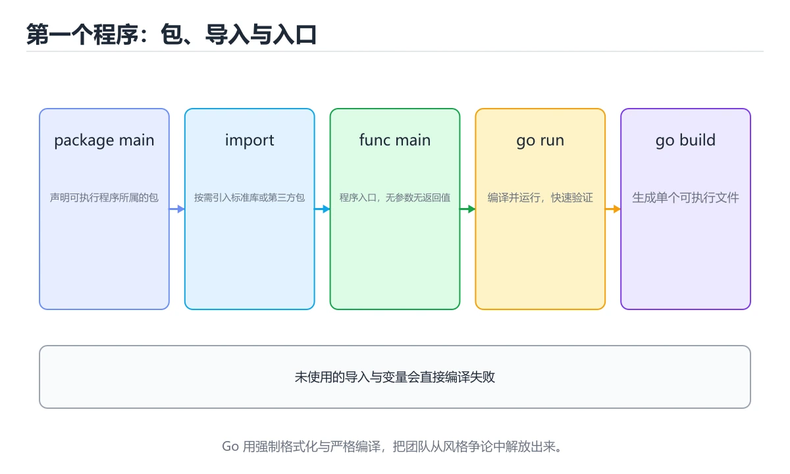
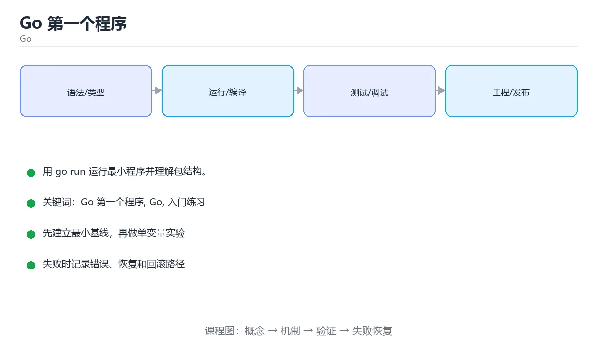

# 本课主题

> 内容更新时间：2026-10-03





## 学习目标

- 先认识本课主题需要的工具、输入和输出。
- 按步骤运行最小示例，并记录结果与错误。
- 用一个边界输入验证自己是否真正掌握。

## 前置知识

- 会进行基本的文件或命令行操作。
- 不需要预先掌握「Go」的高级知识。

## 一句话入门

用 go run 运行最小程序并理解包结构。

## 最小示例

```go
package main

import "fmt"

func main() {
	fmt.Println("hello from Go")
}
```

## 预期输出

```text
hello from Go
```

## 常见错误

- 忽略函数返回的 error，导致错误被静默吞掉。
- 复制命令时遗漏空格、引号或必要参数。

## 动手练习

1. 原样运行最小示例，保存命令和输出。
2. 把数字 2 改成 10，预测并验证新结果。
3. 制造一个错误输入，写出错误信息和修复方法。

## 本课小结

- 入门阶段先保证能运行、能观察、能解释，再追求复杂功能。
- 每次只改一个变量，记录预测与实际结果。
- 遇到错误先看第一条错误信息，再回到最小示例。

## 代码实验：把示例跑成证据

### 实验一：建立基线

```go
package main

import "fmt"

func main() {
	fmt.Println("hello from Go")
}
```

### 实验二：只改一个输入

### 实验三：制造一个可控错误

声明一个局部变量却不使用，或者删除一个仍然被引用的导入。Go 会把它们当作编译错误；记录错误信息后再恢复。

| 实验 | 改动 | 预测 | 实际 | 结论 |
| --- | --- | --- | --- | --- |
| 基线 | 保持原样 |  |  |  |
| 边界 |  |  |  |  |
| 失败 |  |  |  |  |

### 实验四：用三句话复述

1. 输入是什么，哪些输入属于合法范围，哪些属于边界或非法范围？
2. 程序按什么顺序处理输入，在哪一步产生了状态变化或副作用？
3. 输出如何验证，失败时第一条可观察证据是什么？

## Go 语言基础机制速览

### 包、入口与工具链

Go 程序由包组成，`package main` 加 `func main()` 是可执行程序的入口。`go run` 编译并运行，`go build` 生成二进制，`go test` 运行测试，`go mod` 管理依赖。包名决定导入路径的最后一段，未使用的导入和局部变量会直接导致编译失败，这是 Go 有意保持代码整洁的设计。

### 变量、类型与零值

`var` 用于显式声明，`:=` 用于在函数内短声明并让编译器推断类型。Go 是静态类型语言，不同类型之间不会隐式转换，整数与浮点数、字符串与字节切片都需要显式转换。未初始化的变量会得到零值：数值为 0，字符串为空串，布尔为 false，指针和接口为 nil，切片、map、channel 也是 nil。零值让类型可以直接使用，但写入 nil map 会 panic，读取则返回零值。

### 函数、错误与资源管理

Go 函数可以返回多个值，最常用的组合是结果加 `error`。错误是普通值，调用方应显式检查，不要把错误丢掉或用 panic 代替可预期的失败。`defer` 把清理动作推迟到函数返回时执行，常用于关闭文件、释放锁和记录耗时；多个 defer 按后进先出执行。`panic` 只适合不可恢复的程序错误，`recover` 必须配合 defer 使用，不能把它当作常规异常控制流。

### 切片、map 与循环

数组长度固定且属于类型的一部分，切片是动态长度视图，包含指针、长度和容量。`append` 在容量不足时会分配新底层数组，因此原切片的修改不一定同步；需要独立副本时使用 `copy` 或 `slices.Clone`。map 的键必须可比较，遍历顺序不保证稳定。`range` 遍历切片时复制元素，修改元素要用下标；遍历 map 时可同时取得键和值，但不要依赖顺序。循环变量在旧版本中会被复用，闭包或 goroutine 捕获时要显式复制。

### 并发与上下文

goroutine 是轻量执行单元，channel 用于在 goroutine 之间传递数据。无缓冲 channel 需要发送和接收同时就绪，有缓冲 channel 在缓冲满或空时阻塞。`select` 可以在多个 channel 操作之间选择，配合 `context.Context` 传递取消、超时和请求范围的值。共享内存并发仍然需要 mutex 或原子操作；并发安全不等于业务原子性，复合操作要在同一临界区内完成。

## 本课自测清单与错误对照

本课测验以直接定义和步骤判断为主。请把每个错误选项改写成一句反例，
说明它在哪个输入、边界或前提变化下会失败。

### 完成标准

- [ ] 能用具体输入复现最小示例，并逐行解释输入、处理与输出。
- [ ] 能只改一个值完成边界实验，并让预测与实际结果一致。
- [ ] 能制造一个可控错误，读出第一条错误信息并完成修复。
- [ ] 能不看书说出本课至少两个易错点和对应的验证方法。

### 复盘记录

| 项目 | 记录 |
| --- | --- |
| 学到的核心机制 |  |
| 仍然不确定的问题 |  |
| 下一步验证动作 |  |

## 实践任务

本节围绕本课主题安排 3 个可交付任务，每个任务都要求留下可以复查的记录。

### 任务 1：用自己的话画出结构

### 任务 2：做一次对比实验

**验收标准**：表格里两个方案的结论不能完全一样；写下“在什么条件下应该换方案”。

### 任务 3：迁移到自己的场景

**验收标准**：至少有一个可复现的命令、代码片段或数据样例；结论能被别人独立检查。

## 故障现场

### 现场 1：本课的 本课主题 常规用例通过，但边界用例失败

### 现场 2：本课的 Go 结果在两次运行之间不一致

**症状**：在本课的练习或生产场景里出现“本课的 Go 结果在两次运行之间不一致”。

**复现**：准备一组最小输入，只保留触发“本课的 Go 结果在两次运行之间不一致”的必要条件，连续运行两次确认结果稳定。

**定位**：围绕“Go 依赖了当前版本、执行顺序或共享状态，单次运行无法暴露差异”检查调用链、输入数据和环境配置，先验证假设再改代码。

**预防**：把“本课的 Go 结果在两次运行之间不一致”写成一条自动化用例，并在本课的验收清单里保留对应检查项。

### 现场 3：本课的验证只在开发机通过

**症状**：在本课的练习或生产场景里出现“本课的验证只在开发机通过”。

## 版本与时效

- 升级前用 go vet、go test -race 与静态检查覆盖并发生命周期
- 模块校验、最小版本选择与供应链安全是生产升级的重点
- 官方发布说明：https://go.dev/doc/devel/release

### 升级检查清单

- 先固定当前版本，跑通全部示例与测验，再升级工具链。
- 只改一个版本变量，记录编译、测试、性能与产物体积的变化。
- 重点回归默认值、弃用警告、序列化格式、并发语义和错误信息。
- 升级完成后更新本课的“最后复核 / 下次复核”日期与版本说明。

## 本课复习清单

离开本课前，逐项确认：

- [ ] 不看解析，能说出「Go 可执行程序的 main 包与 main 函数有什么关系？」的判断依据。
- [ ] 不看解析，能说出「go run main.go 与 go build main.go 的区别是？」的判断依据。
- [ ] 不看解析，能说出「Go 对未使用的变量和导入采取什么策略？」的判断依据。
- [ ] 不看解析，能说出「fmt.Println("hello from Go") 的输出行为是？」的判断依据。
- [ ] 不看解析，能说出「填空：本课主题术语速查中，表示「Go 程序由包组成，`____` 加…」的判断依据。
- [ ] 至少运行一次本课示例，记录输入、输出和一个边界情况。
- [ ] 把本课最容易混淆的两个概念写成一句话对照。

| 复盘项 | 记录 |
| --- | --- |
| 已经能独立解释的考点 |  |
| 仍然说不清的概念 |  |
| 下一步验证动作 |  |

## 逐节复习与自检

下面按正文顺序回顾每一节，并给出一个自检问题；说不清的地方回到原章节补课。

### 一句话入门

自检：这一节的关键输入与输出分别是什么？

### 最小示例

```go
package main

import "fmt"

func main() {
	fmt.Println("hello from Go")
}
```

自检：这一节与相邻主题的边界在哪里？

### 预期输出

```text
hello from Go
```

### 常见错误

自检：把这一节讲给没学过的人，最需要强调哪一点？

### 动手练习

自检：如果去掉这一节里的一个前提，结论会怎样变化？

## 术语速查

| 术语 | 本课语境 |
| --- | --- |
| `package main` | Go 程序由包组成，`package main` 加 `func main()` 是可执行程序的入口。`go run` 编译并运行，`go build` 生成二进制，`go test` 运行测试，`go mod` 管理依… |
| `func main()` | Go 程序由包组成，`package main` 加 `func main()` 是可执行程序的入口。`go run` 编译并运行，`go build` 生成二进制，`go test` 运行测试，`go mod` 管理依… |
| `go run` | Go 程序由包组成，`package main` 加 `func main()` 是可执行程序的入口。`go run` 编译并运行，`go build` 生成二进制，`go test` 运行测试，`go mod` 管理依… |
| `go build` | Go 程序由包组成，`package main` 加 `func main()` 是可执行程序的入口。`go run` 编译并运行，`go build` 生成二进制，`go test` 运行测试，`go mod` 管理依… |
| `go test` | Go 程序由包组成，`package main` 加 `func main()` 是可执行程序的入口。`go run` 编译并运行，`go build` 生成二进制，`go test` 运行测试，`go mod` 管理依… |
| `go mod` | Go 程序由包组成，`package main` 加 `func main()` 是可执行程序的入口。`go run` 编译并运行，`go build` 生成二进制，`go test` 运行测试，`go mod` 管理依… |
| `var` | `var` 用于显式声明，`:=` 用于在函数内短声明并让编译器推断类型。Go 是静态类型语言，不同类型之间不会隐式转换，整数与浮点数、字符串与字节切片都需要显式转换。未初始化的变量会得到零值：数值为 0，字符串为空串，… |
| `:=` | `var` 用于显式声明，`:=` 用于在函数内短声明并让编译器推断类型。Go 是静态类型语言，不同类型之间不会隐式转换，整数与浮点数、字符串与字节切片都需要显式转换。未初始化的变量会得到零值：数值为 0，字符串为空串，… |
| `error` | Go 函数可以返回多个值，最常用的组合是结果加 `error`。错误是普通值，调用方应显式检查，不要把错误丢掉或用 panic 代替可预期的失败。`defer` 把清理动作推迟到函数返回时执行，常用于关闭文件、释放锁和记… |
| `defer` | Go 函数可以返回多个值，最常用的组合是结果加 `error`。错误是普通值，调用方应显式检查，不要把错误丢掉或用 panic 代替可预期的失败。`defer` 把清理动作推迟到函数返回时执行，常用于关闭文件、释放锁和记… |
| `panic` | Go 函数可以返回多个值，最常用的组合是结果加 `error`。错误是普通值，调用方应显式检查，不要把错误丢掉或用 panic 代替可预期的失败。`defer` 把清理动作推迟到函数返回时执行，常用于关闭文件、释放锁和记… |
| `recover` | Go 函数可以返回多个值，最常用的组合是结果加 `error`。错误是普通值，调用方应显式检查，不要把错误丢掉或用 panic 代替可预期的失败。`defer` 把清理动作推迟到函数返回时执行，常用于关闭文件、释放锁和记… |

## 考点精讲

### 考点 1：Go 可执行程序的 main 包与 main 函数有什么关系？

- **判断依据**：正确答案是「package main 声明入口包」。Go 用包组织代码，只有 package main 加上无参数无返回值的 func main 才会被编译成可执行程序的入口。判断这类题时，要把「package main 声明入口包」放回题干限定的对象、输入和边界，「任何包里的 main 函数都会被自动执行」、「package main 只是注释，不影响程序入口」 等说法虽然包含相关术语，但范围或前提与本题不一致。

### 考点 2：围绕“Go 第一个程序”中的 Go 第一个程序、Go、入门练习，下列哪两项是本课强调的实践判断？

- **判断依据**：正确答案包括「学习 Go 第一个程序 时要同时说明输入、输出和失败路径，不能只看正常流程」、「验证 Go 时要固定版本并覆盖边界输入，结论才可复现」。本题应选学习 本课主题 时要同时说明输入、输出和失败路径（gofirstprogram 第 2 题）。

### 考点 3：下面这段 Go 代码复现了“Go 第一个程序”中 Go 第一个程序、Go、入门练习 相关的一个常见故障，哪一项最准确地解释了问题？

- **判断依据**：符合题干条件的是「循环条件用了 <=，i == len(data) 时越界，运行时 panic」。符合题干条件的是循环条件用了 <=，i == len(data) 时越界，运行时 panic。结合Go 第一个程序、Go来看，符合题干条件的是循环条件用了 <=。Go 第一个程序 的边界应改成 i < len(data)。

### 考点 4：fmt.Println("hello from Go") 的输出行为是？

- **判断依据**：结论应落在「把文本写到标准输出并在末尾换行」。fmt.Println 输出参数并用空格分隔、末尾换行，Printf 则按格式串输出，Print 不自动换行。这道题要求区分概念与边界，「把文本写到标准输出并在末尾换行」只有在题干给出的前提下才成立，而「把文本写进名为 fmt 的日志文件」、「只在调试模式下输出到控制台」缺少同一组条件。

### 考点 5：填空：「Go 第一个程序」术语速查中，表示「Go 程序由包组成，`____` 加 `func main()` 是可执行程序的入口。`go run` 编译并运行，`go build` 生成二进制，`go test` 运行测试，`go mod` 管理依赖。包名决定导入路径…」的术语是什么？

- **判断依据**：围绕 填空：Go 第一个程序术语速查中，表示Go 程序由包组成，… 作答时，先用Go 第一个程序建立输入与输出的基线，再把package main代入边界条件核对，结论才能复现。判断这类题时，要把「package main」放回题干限定的对象、输入和边界， 等说法虽然包含相关术语，但范围或前提与本题不一致。

### 考点 6：按照「Go 第一个程序」从概念到实践的讲解顺序排列下列主题。

- **判断依据**：正确的执行顺序是「一句话入门」 → 「最小示例」 → 「预期输出」 → 「常见错误」。在本课中，正确顺序是：1. 一句话入门 → 2. 最小示例 → 3. 预期输出 → 4. 常见错误。本课围绕用 go run 运行最小程序并理解包结构。解题的关键不是记住孤立术语，而是确认「一句话入门 → 最小示例 → 预期输出 → 常见错误」是否完整覆盖题干的输入、输出和失败路径，并排除「一句话入门」、「最小示例」这类相邻概念。

## English Overview

**Title:** Go First Program

**Summary:** Run a minimal Go program and understand packages.

**Category:** Go
**Level:** 入门
**Key terms:** 本课主题, Go, 入门练习

## 内容元数据

- 内容版本：v2.0
- 最后更新：2026-10-03
- 学习阶段：入门
- 适用环境：Go 1.24+
- 内容来源：内置结构化课程与工程实践整理
- 相关主题：本课主题、Go、入门练习
- 质量版本：P0 测验标准 + P1 覆盖扩展 + P2 体验补全


## 参考资料与复核

- 最后复核：2026-10-04
- 下次复核：2027-04-04
- 复核范围：版本兼容、API 行为、安全建议与工程实践
- 来源性质：官方文档、标准或权威教材；正文为离线教学重组

| 参考资料 | 本课用途 |
| --- | --- |
| [Effective Go](https://go.dev/doc/effective_go) | 惯用写法与接口设计 |
| [Go 并发](https://go.dev/talks/2012/concurrency.slide) | goroutine 与 channel |
| [database/sql](https://pkg.go.dev/database/sql) | 数据库连接、事务与预编译 |

> 「Go 第一个程序」的链接用于离线阅读后的延伸核对；App 不会自动联网。

## 复习与迁移

- 围绕「Go 可执行程序的 main 包与 main 函数有什么关系？」做迁移时，先记录输入、边界和预期，再观察本课主题对结果的影响，并用「package main 声明入口包」解释正常与失败路径。
- 把Go放进最小实验：固定版本和输入，只改变一个条件，记录输出差异，并说明「学习 本课主题 时要同时说明输入、输出和失败路径，不能只看正常流程；验证 G…」在什么前提下成立。
- 复习「下面这段 Go 代码复现了本课主题中 本课主题、Go、入门练习 相关的一个常见故障，哪一…」时，不要只背结论；用入门练习的边界值复现一次，再把现象、原因和修复写成三步记录。
- 如果把本课主题换成空值、极值或并发输入，「把文本写到标准输出并在末尾换行」是否仍然成立？写出验证命令和观察到的结果。
- 围绕「填空：本课主题术语速查中，表示「Go 程序由包组成，`____` 加 `func main()`…」做迁移时，先记录输入、边界和预期，再观察Go对结果的影响，并用「package main」解释正常与失败路径。
- 把入门练习放进最小实验：固定版本和输入，只改变一个条件，记录输出差异，并说明「一句话入门 → 最小示例 → 预期输出 → 常见错误」在什么前提下成立。
- 复习「Go 可执行程序的 main 包与 main 函数有什么关系？」时，不要只背结论；用本课主题的边界值复现一次，再把现象、原因和修复写成三步记录。

<!-- p0p1-review:start -->
## 复习与迁移

- 围绕「Go 可执行程序的 main 包与 main 函数有什么关系？」做迁移时，先记录输入、边界和预期，再观察本课主题对结果的影响，并用「package main 声明入口包」解释正常与失败路径。
- 把Go放进最小实验：固定版本和输入，只改变一个条件，记录输出差异，并说明「学习 本课主题 时要同时说明输入、输出和失败路径，不能只看正常流程；验证 Go 时要…」在什么前提下成立。
- 复习「下面这段 Go 代码复现了本课主题中 本课主题、Go、入门练习 相关的一个常见故障，哪一项最准确…」时，不要只背结论；用入门练习的边界值复现一次，再把现象、原因和修复写成三步记录。
- 如果把本课主题换成空值、极值或并发输入，「把文本写到标准输出并在末尾换行」是否仍然成立？写出验证命令和观察到的结果。
- 围绕「填空：本课主题术语速查中，表示「Go 程序由包组成，`____` 加 `func main()`…」做迁移时，先记录输入、边界和预期，再观察Go对结果的影响，并用「package main」解释正常与失败路径。
- 把入门练习放进最小实验：固定版本和输入，只改变一个条件，记录输出差异，并说明「一句话入门 → 最小示例 → 预期输出 → 常见错误」在什么前提下成立。
- 复习「Go 可执行程序的 main 包与 main 函数有什么关系？」时，不要只背结论；用本课主题的边界值复现一次，再把现象、原因和修复写成三步记录。
- 如果把Go换成空值、极值或并发输入，「学习 本课主题 时要同时说明输入、输出和失败路径，不能只看正常流程；验证 Go 时要…」是否仍然成立？写出验证命令和观察到的结果。
- 围绕「下面这段 Go 代码复现了本课主题中 本课主题、Go、入门练习 相关的一个常见故障，哪一项最准确…」做迁移时，先记录输入、边界和预期，再观察入门练习对结果的影响，并用「循环条件用了 <=，i == len(data) 时越界，运行时 panic。」解释正常与失败路径。
- 把本课主题放进最小实验：固定版本和输入，只改变一个条件，记录输出差异，并说明「把文本写到标准输出并在末尾换行」在什么前提下成立。
- 复习「填空：本课主题术语速查中，表示「Go 程序由包组成，`____` 加 `func main()`…」时，不要只背结论；用Go的边界值复现一次，再把现象、原因和修复写成三步记录。
- 如果把入门练习换成空值、极值或并发输入，「一句话入门 → 最小示例 → 预期输出 → 常见错误」是否仍然成立？写出验证命令和观察到的结果。
- 围绕「Go 可执行程序的 main 包与 main 函数有什么关系？」做迁移时，先记录输入、边界和预期，再观察本课主题对结果的影响，并用「package main 声明入口包」解释正常与失败路径。
- 把Go放进最小实验：固定版本和输入，只改变一个条件，记录输出差异，并说明「学习 本课主题 时要同时说明输入、输出和失败路径，不能只看正常流程；验证 Go 时要…」在什么前提下成立。
- 复习「下面这段 Go 代码复现了本课主题中 本课主题、Go、入门练习 相关的一个常见故障，哪一项最准确…」时，不要只背结论；用入门练习的边界值复现一次，再把现象、原因和修复写成三步记录。
- 如果把本课主题换成空值、极值或并发输入，「把文本写到标准输出并在末尾换行」是否仍然成立？写出验证命令和观察到的结果。
- 围绕「填空：本课主题术语速查中，表示「Go 程序由包组成，`____` 加 `func main()`…」做迁移时，先记录输入、边界和预期，再观察Go对结果的影响，并用「package main」解释正常与失败路径。
- 把入门练习放进最小实验：固定版本和输入，只改变一个条件，记录输出差异，并说明「一句话入门 → 最小示例 → 预期输出 → 常见错误」在什么前提下成立。
<!-- p0p1-review:end -->
