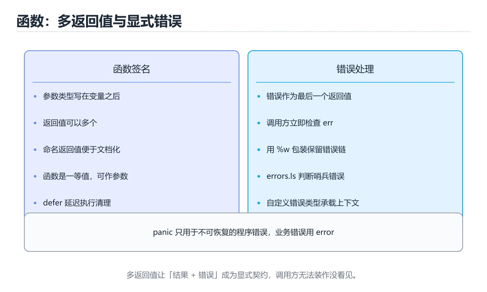
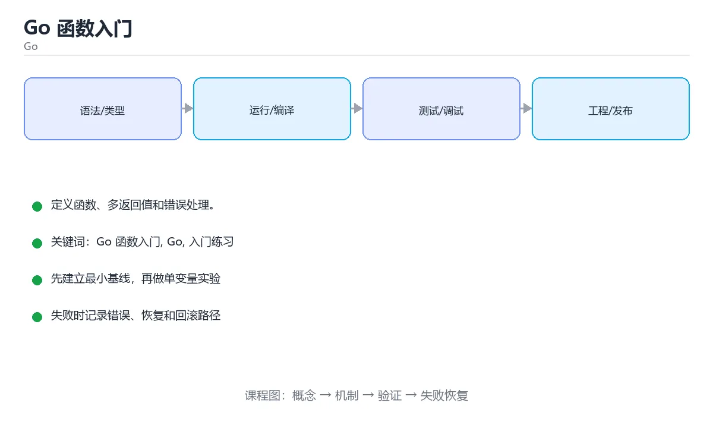

# Go 函数入门





> 内容更新时间：2026-10-03 · 学习阶段：入门 · 预计用时：15 分钟

## 学习目标

- 先认识「Go 函数入门」需要的工具、输入和输出。
- 按步骤运行最小示例，并记录结果与错误。
- 用一个边界输入验证自己是否真正掌握。

## 前置知识

- 会进行基本的文件或命令行操作。
- 不需要预先掌握「Go」的高级知识。

## 一句话入门

定义函数、多返回值和错误处理。

## 最小示例

```go
package main

import "fmt"

func square(n int) int { return n * n }

func main() {
	fmt.Println("square(7) =", square(7))
}
```

## 预期输出

```text
square(7) = 49
```

## 常见错误

- 忽略函数返回的 error，导致错误被静默吞掉。
- 复制命令时遗漏空格、引号或必要参数。

## 动手练习

1. 原样运行最小示例，保存命令和输出。
2. 把数字 2 改成 10，预测并验证新结果。
3. 制造一个错误输入，写出错误信息和修复方法。

## 本课小结

- 入门阶段先保证能运行、能观察、能解释，再追求复杂功能。
- 每次只改一个变量，记录预测与实际结果。
- 遇到错误先看第一条错误信息，再回到最小示例。


## 代码实验：把示例跑成证据

这一节不引入新语法，而是把「Go 函数入门」的最小示例变成可以复现、可以对照的实验。每次只改变一个条件，先写预测，再运行，最后解释差异。

### 实验一：建立基线

```go
package main

import "fmt"

func square(n int) int { return n * n }

func main() {
	fmt.Println("square(7) =", square(7))
}
```

先原样运行上面的代码，记录命令、完整输出和退出状态。然后把输出与正文的预期输出逐字对照，不要用“看起来差不多”代替核对；空格、大小写、换行和错误流向都可能暴露环境差异。

### 实验二：只改一个输入

从代码中选一个会影响结果的字面量、参数或输入，把它替换成边界值：数值可尝试 0、1、最大值和最小值，字符串可尝试空串和超长文本，集合可尝试空集合、单元素和重复元素。先写出预测，再运行并记录实际结果。

### 实验三：制造一个可控错误

声明一个局部变量却不使用，或者删除一个仍然被引用的导入。Go 会把它们当作编译错误；记录错误信息后再恢复。

| 实验 | 改动 | 预测 | 实际 | 结论 |
| --- | --- | --- | --- | --- |
| 基线 | 保持原样 |  |  |  |
| 边界 |  |  |  |  |
| 失败 |  |  |  |  |

### 实验四：用三句话复述

1. 输入是什么，哪些输入属于合法范围，哪些属于边界或非法范围？
2. 程序按什么顺序处理输入，在哪一步产生了状态变化或副作用？
3. 输出如何验证，失败时第一条可观察证据是什么？

## Go 语言基础机制速览

### 包、入口与工具链

Go 程序由包组成，`package main` 加 `func main()` 是可执行程序的入口。`go run` 编译并运行，`go build` 生成二进制，`go test` 运行测试，`go mod` 管理依赖。包名决定导入路径的最后一段，未使用的导入和局部变量会直接导致编译失败，这是 Go 有意保持代码整洁的设计。

### 变量、类型与零值

`var` 用于显式声明，`:=` 用于在函数内短声明并让编译器推断类型。Go 是静态类型语言，不同类型之间不会隐式转换，整数与浮点数、字符串与字节切片都需要显式转换。未初始化的变量会得到零值：数值为 0，字符串为空串，布尔为 false，指针和接口为 nil，切片、map、channel 也是 nil。零值让类型可以直接使用，但写入 nil map 会 panic，读取则返回零值。

### 函数、错误与资源管理

Go 函数可以返回多个值，最常用的组合是结果加 `error`。错误是普通值，调用方应显式检查，不要把错误丢掉或用 panic 代替可预期的失败。`defer` 把清理动作推迟到函数返回时执行，常用于关闭文件、释放锁和记录耗时；多个 defer 按后进先出执行。`panic` 只适合不可恢复的程序错误，`recover` 必须配合 defer 使用，不能把它当作常规异常控制流。

### 切片、map 与循环

数组长度固定且属于类型的一部分，切片是动态长度视图，包含指针、长度和容量。`append` 在容量不足时会分配新底层数组，因此原切片的修改不一定同步；需要独立副本时使用 `copy` 或 `slices.Clone`。map 的键必须可比较，遍历顺序不保证稳定。`range` 遍历切片时复制元素，修改元素要用下标；遍历 map 时可同时取得键和值，但不要依赖顺序。循环变量在旧版本中会被复用，闭包或 goroutine 捕获时要显式复制。

### 并发与上下文

goroutine 是轻量执行单元，channel 用于在 goroutine 之间传递数据。无缓冲 channel 需要发送和接收同时就绪，有缓冲 channel 在缓冲满或空时阻塞。`select` 可以在多个 channel 操作之间选择，配合 `context.Context` 传递取消、超时和请求范围的值。共享内存并发仍然需要 mutex 或原子操作；并发安全不等于业务原子性，复合操作要在同一临界区内完成。

## 本课自测清单与错误对照

下面把「Go 函数入门」最容易混淆的选项集中起来。不要只记正确答案，要能说明错误选项在什么条件下看似合理、又为什么不能满足题干。

本课测验以直接定义和步骤判断为主。请把每个错误选项改写成一句反例，
说明它在哪个输入、边界或前提变化下会失败。

### 完成标准

- [ ] 能用具体输入复现最小示例，并逐行解释输入、处理与输出。
- [ ] 能只改一个值完成边界实验，并让预测与实际结果一致。
- [ ] 能制造一个可控错误，读出第一条错误信息并完成修复。
- [ ] 能不看书说出本课至少两个易错点和对应的验证方法。

### 复盘记录

| 项目 | 记录 |
| --- | --- |
| 学到的核心机制 |  |
| 仍然不确定的问题 |  |
| 下一步验证动作 |  |


## 考点精讲：把测验题还原成判断过程

本课有 5 个判断点。先自己作答，再看「判断依据」；如果结论正确但理由不完整，回到正文对应章节补足概念。

### 考点 1：Go 函数返回 (int, error) 这种多返回值的设计意图是？

- **正确判断**：同时返回结果与可能的错误，由调用方显式处理
- **判断依据**：正确答案是「同时返回结果与可能的错误，由调用方显式处理」，这道题在问Go函数返回(int,error)这种多返回值的设计意图是，判断时要把题干限定的输入、边界与目标逐项对齐。Go 用多返回值把结果与错误并排交给调用方，约定 error 放在最后，调用方通过 if err != nil 判断并处理。
- **迁移检查**：遮住选项，只根据定义复述一次答案，再回来看哪个选项与复述一致。

### 考点 2：Go 中函数参数与返回值的类型标注方式是？

- **正确判断**：参数名在前类型在后，返回值类型写在参数表之后
- **判断依据**：正确答案是「参数名在前类型在后，返回值类型写在参数表之后」，这道题在问Go中函数参数与返回值的类型标注方式是，判断时要把题干限定的输入、边界与目标逐项对齐。函数签名写成 func square(n int) int，参数先名后类型，返回值类型在参数表后。
- **迁移检查**：如果给某个错误选项去掉一个限定词，它会不会变成正确？说明理由。

### 考点 3：关于 Go 中函数作为值的使用，下列说法正确的是？

- **正确判断**：函数是一等值，可以赋给变量、作为参数或返回值
- **判断依据**：正确答案是「函数是一等值，可以赋给变量、作为参数或返回值」，这道题在问关于Go中函数作为值的使用，下列说法正确的是，判断时要把题干限定的输入、边界与目标逐项对齐。Go 的函数类型是一等公民，可以赋值给变量、作为回调传入、由函数返回，也可以写成匿名函数并形成闭包捕获外部变量。
- **迁移检查**：把题干里的一个条件换成边界值，原来的结论还成立吗？写出判断过程。

### 考点 4：Go 函数示例运行后，控制台输出是什么？

- **正确判断**：square(7) = 49，函数返回参数平方
- **判断依据**：正确答案是「square(7) = 49，函数返回参数平方」，这道题在问Go函数示例运行后，控制台输出是什么，判断时要把题干限定的输入、边界与目标逐项对齐。square 接收 int 参数并返回 n n，square(7) 得到 49。Go 函数示例运行后，控制台输出是什么。
- **迁移检查**：遮住选项，只根据定义复述一次答案，再回来看哪个选项与复述一致。

### 考点 5：填空：「Go 函数入门」术语速查中，表示「Go 程序由包组成，`____` 加 `func main()` 是可执行程序的入口。`go run` 编译并运行，`go build` 生成二进制，`go test` 运行测试，`go mod` 管理依赖。包名决定导入路径…」的术语是什么？

- **正确判断**：package main
- **判断依据**：正确答案是「package main」，这道题在问填空：Go函数入门术语速查中，表示Go程序由包组成，…管理依赖，包名决定导入路径…的术语是什么，判断时要把题干限定的输入、边界与目标逐项对齐。包名决定导入路径…的术语是什么。课程摘要指出定义函数，多返回值和错误处理，本课要判断的正是填空：Go函数入门术语速查中，表示Go程序由包组成，…管理依赖，包名决定导入路径…的术语是什么。
- **迁移检查**：如果填成相近的另一个函数或关键字，程序会在哪一步出错？

## 本课复习清单

离开本课前，逐项确认：

- [ ] 不看解析，能说出「Go 函数返回 (int, error) 这种多返回值的设计意图是？」的判断依据。
- [ ] 不看解析，能说出「Go 中函数参数与返回值的类型标注方式是？」的判断依据。
- [ ] 不看解析，能说出「关于 Go 中函数作为值的使用，下列说法正确的是？」的判断依据。
- [ ] 不看解析，能说出「Go 函数示例运行后，控制台输出是什么？」的判断依据。
- [ ] 不看解析，能说出「填空：「Go 函数入门」术语速查中，表示「Go 程序由包组成，`____` 加 …」的判断依据。
- [ ] 至少运行一次本课示例，记录输入、输出和一个边界情况。
- [ ] 把本课最容易混淆的两个概念写成一句话对照。

| 复盘项 | 记录 |
| --- | --- |
| 已经能独立解释的考点 |  |
| 仍然说不清的概念 |  |
| 下一步验证动作 |  |

## 逐节复习与自检

下面按正文顺序回顾每一节，并给出一个自检问题；说不清的地方回到原章节补课。

### 最小示例

```go
package main

import "fmt"

func square(n int) int { return n * n }

func main() {
	fmt.Println("square(7) =", square(7))
}
```

自检：这一节与相邻主题的边界在哪里？

### 预期输出

```text
square(7) = 49
```

自检：这一节与相邻主题的边界在哪里？

### 常见错误

忽略函数返回的 error，导致错误被静默吞掉。

自检：把这一节讲给没学过的人，最需要强调哪一点？

### 动手练习

把数字 2 改成 10，预测并验证新结果。制造一个错误输入，写出错误信息和修复方法。

自检：如果去掉这一节里的一个前提，结论会怎样变化？

## 术语速查

把本课反复出现的术语集中放在一起。复习时先遮住右列，尝试用自己的话解释，再回到正文核对。

| 术语 | 本课语境 |
| --- | --- |
| `package main` | Go 程序由包组成，`package main` 加 `func main()` 是可执行程序的入口。`go run` 编译并运行，`go build` 生成二进制，`go test` 运行测试，`go mod` 管理依… |
| `func main()` | Go 程序由包组成，`package main` 加 `func main()` 是可执行程序的入口。`go run` 编译并运行，`go build` 生成二进制，`go test` 运行测试，`go mod` 管理依… |
| `go run` | Go 程序由包组成，`package main` 加 `func main()` 是可执行程序的入口。`go run` 编译并运行，`go build` 生成二进制，`go test` 运行测试，`go mod` 管理依… |
| `go build` | Go 程序由包组成，`package main` 加 `func main()` 是可执行程序的入口。`go run` 编译并运行，`go build` 生成二进制，`go test` 运行测试，`go mod` 管理依… |
| `go test` | Go 程序由包组成，`package main` 加 `func main()` 是可执行程序的入口。`go run` 编译并运行，`go build` 生成二进制，`go test` 运行测试，`go mod` 管理依… |
| `go mod` | Go 程序由包组成，`package main` 加 `func main()` 是可执行程序的入口。`go run` 编译并运行，`go build` 生成二进制，`go test` 运行测试，`go mod` 管理依… |
| `var` | `var` 用于显式声明，`:=` 用于在函数内短声明并让编译器推断类型。Go 是静态类型语言，不同类型之间不会隐式转换，整数与浮点数、字符串与字节切片都需要显式转换。未初始化的变量会得到零值：数值为 0，字符串为空串，… |
| `:=` | `var` 用于显式声明，`:=` 用于在函数内短声明并让编译器推断类型。Go 是静态类型语言，不同类型之间不会隐式转换，整数与浮点数、字符串与字节切片都需要显式转换。未初始化的变量会得到零值：数值为 0，字符串为空串，… |
| `error` | Go 函数可以返回多个值，最常用的组合是结果加 `error`。错误是普通值，调用方应显式检查，不要把错误丢掉或用 panic 代替可预期的失败。`defer` 把清理动作推迟到函数返回时执行，常用于关闭文件、释放锁和记… |
| `defer` | Go 函数可以返回多个值，最常用的组合是结果加 `error`。错误是普通值，调用方应显式检查，不要把错误丢掉或用 panic 代替可预期的失败。`defer` 把清理动作推迟到函数返回时执行，常用于关闭文件、释放锁和记… |
| `panic` | Go 函数可以返回多个值，最常用的组合是结果加 `error`。错误是普通值，调用方应显式检查，不要把错误丢掉或用 panic 代替可预期的失败。`defer` 把清理动作推迟到函数返回时执行，常用于关闭文件、释放锁和记… |
| `recover` | Go 函数可以返回多个值，最常用的组合是结果加 `error`。错误是普通值，调用方应显式检查，不要把错误丢掉或用 panic 代替可预期的失败。`defer` 把清理动作推迟到函数返回时执行，常用于关闭文件、释放锁和记… |

## 面试问答与自测

下面把本课考点换成面试追问。先口述自己的答案，
再对照参考回答检查是否遗漏了前提、边界或失败路径。

### 追问 1：Go 函数返回 (int, error) 这种多返回值的设计意图是？

**参考回答**：正确答案是「同时返回结果与可能的错误，由调用方显式处理」，这道题在问Go函数返回(int,error)这种多返回值的设计意图是，判断时要把题干限定的输入、边界与目标逐项对齐。Go 用多返回值把结果与错误并排交给调用方，约定 error 放在最后，调用方通过 if err != nil 判断并处理。

### 追问 2：Go 中函数参数与返回值的类型标注方式是？

**参考回答**：正确答案是「参数名在前类型在后，返回值类型写在参数表之后」，这道题在问Go中函数参数与返回值的类型标注方式是，判断时要把题干限定的输入、边界与目标逐项对齐。函数签名写成 func square(n int) int，参数先名后类型，返回值类型在参数表后。

### 追问 3：关于 Go 中函数作为值的使用，下列说法正确的是？

**参考回答**：正确答案是「函数是一等值，可以赋给变量、作为参数或返回值」，这道题在问关于Go中函数作为值的使用，下列说法正确的是，判断时要把题干限定的输入、边界与目标逐项对齐。Go 的函数类型是一等公民，可以赋值给变量、作为回调传入、由函数返回，也可以写成匿名函数并形成闭包捕获外部变量。

### 追问 4：Go 函数示例运行后，控制台输出是什么？

**参考回答**：正确答案是「square(7) = 49，函数返回参数平方」，这道题在问Go函数示例运行后，控制台输出是什么，判断时要把题干限定的输入、边界与目标逐项对齐。square 接收 int 参数并返回 n n，square(7) 得到 49。Go 函数示例运行后，控制台输出是什么。

### 追问 5：填空：「Go 函数入门」术语速查中，表示「Go 程序由包组成，`____` 加 `func main()` 是可执行程序的入口。`go run` 编译并运行，`go build` 生成二进制，`go test` 运行测试，`go mod` 管理依赖。包名决定导入路径…」的术语是什么？

**参考回答**：正确答案是「package main」，这道题在问填空：Go函数入门术语速查中，表示Go程序由包组成，…管理依赖，包名决定导入路径…的术语是什么，判断时要把题干限定的输入、边界与目标逐项对齐。包名决定导入路径…的术语是什么。课程摘要指出定义函数，多返回值和错误处理，本课要判断的正是填空：Go函数入门术语速查中，表示Go程序由包组成，…管理依赖，包名决定导入路径…的术语是什么。

<!-- p0-depth-v2:start -->
## 零基础精讲：把「Go 函数入门」真正讲透

### 先建立一个直觉

把「Go 函数入门」看成一个有输入、处理、输出和失败边界的工程问题。先定义什么叫正确，再讨论性能和扩展。

本课的摘要可以当作一张地图：定义函数、多返回值和错误处理。

阅读时不要只记结论，先问三个问题：它解决什么问题？依赖哪些前提？在什么条件下会失效？

### 逐步拆解

1. 识别输入。先写清数据类型、取值范围、空值策略，以及输入来自用户、文件还是另一个服务。
2. 描述处理过程。把「Go 函数入门、Go、入门练习」映射到具体步骤，每步都要求能单独验证。
3. 定义输出。输出不仅包括正常结果，还包括错误码、日志、指标和资源释放状态。
4. 找出一条失败路径。让错误尽早暴露，并说明重试、降级、回滚或人工处理的边界。
5. 用一个小例子贯穿全过程。先手算或预测结果，再运行代码或实验，最后解释差异。

### 把正文串成一条执行链

- **实验一：建立基线**：先原样运行上面的代码，记录命令、完整输出和退出状态
- **实验二：只改一个输入**：从代码中选一个会影响结果的字面量、参数或输入，把它替换成边界值：数值可尝试 0、1、最大值和最小值，字符串可尝试空串和超长文本，集合可尝试空集合、单元素和重复元素
- **实验三：制造一个可控错误**：实验三：制造一个可控错误
- **实验四：用三句话复述**：1. 输入是什么，哪些输入属于合法范围，哪些属于边界或非法范围
- **包、入口与工具链**：Go 程序由包组成，`package main` 加 `func main()` 是可执行程序的入口
- **变量、类型与零值**：`var` 用于显式声明，`:=` 用于在函数内短声明并让编译器推断类型

### 从测验反推易错点

**检查点 1：Go 函数返回 (int, error) 这种多返回值的设计意图是？**

- 参考判断：同时返回结果与可能的错误，由调用方显式处理
- 解析：正确答案是「同时返回结果与可能的错误，由调用方显式处理」，这道题在问Go函数返回(int,error)这种多返回值的设计意图是，判断时要把题干限定的输入、边界与目标逐项对齐。Go 用多返回值把结果与错误并排交给调用方，约定 error 放在最后，调用方通过 if err != nil 判断并处理。
- 自问：如果去掉题干里的一个限定词，结论还成立吗？

**检查点 2：Go 中函数参数与返回值的类型标注方式是？**

- 参考判断：参数名在前类型在后，返回值类型写在参数表之后
- 解析：正确答案是「参数名在前类型在后，返回值类型写在参数表之后」，这道题在问Go中函数参数与返回值的类型标注方式是，判断时要把题干限定的输入、边界与目标逐项对齐。函数签名写成 func square(n int) int，参数先名后类型，返回值类型在参数表后。
- 自问：如果去掉题干里的一个限定词，结论还成立吗？

**检查点 3：关于 Go 中函数作为值的使用，下列说法正确的是？**

- 参考判断：函数是一等值，可以赋给变量、作为参数或返回值
- 解析：正确答案是「函数是一等值，可以赋给变量、作为参数或返回值」，这道题在问关于Go中函数作为值的使用，下列说法正确的是，判断时要把题干限定的输入、边界与目标逐项对齐。Go 的函数类型是一等公民，可以赋值给变量、作为回调传入、由函数返回，也可以写成匿名函数并形成闭包捕获外部变量。
- 自问：如果去掉题干里的一个限定词，结论还成立吗？

**检查点 4：Go 函数示例运行后，控制台输出是什么？**

- 参考判断：square(7) = 49，函数返回参数平方
- 解析：正确答案是「square(7) = 49，函数返回参数平方」，这道题在问Go函数示例运行后，控制台输出是什么，判断时要把题干限定的输入、边界与目标逐项对齐。square 接收 int 参数并返回 n n，square(7) 得到 49。Go 函数示例运行后，控制台输出是什么。
- 自问：如果去掉题干里的一个限定词，结论还成立吗？

**检查点 5：填空：「Go 函数入门」术语速查中，表示「Go 程序由包组成，`____` 加 `func main()` …**

- 参考判断：package main
- 解析：正确答案是「package main」，这道题在问填空：Go函数入门术语速查中，表示Go程序由包组成，…管理依赖，包名决定导入路径…的术语是什么，判断时要把题干限定的输入、边界与目标逐项对齐。包名决定导入路径…的术语是什么。课程摘要指出定义函数，多返回值和错误处理，本课要判断的正是填空：Go函数入门术语速查中，表示Go程序由包组成，…管理依赖，包名决定导入路径…的术语是什么。
- 自问：如果去掉题干里的一个限定词，结论还成立吗？

### 工程排错顺序

| 先查什么 | 要得到的证据 | 判断标准 |
| --- | --- | --- |
| 输入与前提是否满足 | 日志、输入样例、测试或指标 | 能复现并解释，才算定位 |
| 核心步骤是否产生了预期中间结果 | 日志、输入样例、测试或指标 | 能复现并解释，才算定位 |
| 失败路径是否可观测、可恢复 | 日志、输入样例、测试或指标 | 能复现并解释，才算定位 |
| 资源、权限与成本是否在预算内 | 日志、输入样例、测试或指标 | 能复现并解释，才算定位 |

排查顺序应遵循「先复现、再缩小范围、再验证假设、最后修改」。不要同时改多个变量，否则即使问题消失，也无法知道真正原因。

### 变式训练

1. 把它放进一个只有单机、没有额外依赖的小项目，先保证正确，再考虑扩展。
2. 把输入规模扩大十倍，记录时间、内存和失败路径，找出第一个真正瓶颈。
3. 制造一次依赖超时或错误输入，要求系统给出可解释错误并且不留下半完成状态。
4. 让另一个同学只读接口说明和测试用例，复现你的结论；无法复现的部分继续补文档或测试。
5. 删掉一个看似必要的步骤，观察哪个测试或指标先失败，用证据说明它为什么必要。
6. 把方案切换到低资源设备，重新评估默认参数、超时和降级策略。

每道变式都写下：预测、实际结果、差异、下一步。没有留下证据的练习，很难迁移到真实项目。

### 本课自测

- [ ] 能用一句话解释「Go 函数入门」在本课中的角色与边界。
- [ ] 能举出一个正常例子和一个失败例子。
- [ ] 能说出最小验证步骤，以及需要记录的证据。
- [ ] 能用一句话解释「Go」在本课中的角色与边界。
- [ ] 能举出一个正常例子和一个失败例子。
- [ ] 能说出最小验证步骤，以及需要记录的证据。
- [ ] 能用一句话解释「入门练习」在本课中的角色与边界。
- [ ] 能举出一个正常例子和一个失败例子。
- [ ] 能说出最小验证步骤，以及需要记录的证据。
- [ ] 能用一句话解释「Go 函数入门」在本课中的角色与边界。
- [ ] 能举出一个正常例子和一个失败例子。
- [ ] 能说出最小验证步骤，以及需要记录的证据。
- [ ] 能用一句话解释「Go」在本课中的角色与边界。
- [ ] 能举出一个正常例子和一个失败例子。
- [ ] 能说出最小验证步骤，以及需要记录的证据。

### 迁移案例库

下面用不同约束重复同一套方法。每完成一轮，都把结论写进笔记，并只改变一个变量。

#### 迁移案例 1：围绕「Go 函数入门」做一次小实验

**目标**：在不改变课程主体的前提下，验证「Go 函数入门」中的一个关键判断。

**步骤**：
1. 复述当前方案对「Go 函数入门」的假设，写成一句可证伪的话。
2. 设计一个正常输入和一个边界输入，分别预测输出。
3. 运行或逐步演算，记录实际输出、耗时和失败信息。
4. 只调整一个参数，比较前后差异并解释原因。
5. 补充一条测试或复习卡，确保下次能更快复现。

**验收**：结论有证据、差异可解释、失败可恢复；如果做不到，说明还需要缩小问题范围。

#### 迁移案例 2：围绕「Go」做一次小实验

**目标**：在不改变课程主体的前提下，验证「Go 函数入门」中的一个关键判断。

**步骤**：
1. 复述当前方案对「Go」的假设，写成一句可证伪的话。
2. 设计一个正常输入和一个边界输入，分别预测输出。
3. 运行或逐步演算，记录实际输出、耗时和失败信息。
4. 只调整一个参数，比较前后差异并解释原因。
5. 补充一条测试或复习卡，确保下次能更快复现。

**验收**：结论有证据、差异可解释、失败可恢复；如果做不到，说明还需要缩小问题范围。

#### 迁移案例 3：围绕「入门练习」做一次小实验

**目标**：在不改变课程主体的前提下，验证「Go 函数入门」中的一个关键判断。

**步骤**：
1. 复述当前方案对「入门练习」的假设，写成一句可证伪的话。
2. 设计一个正常输入和一个边界输入，分别预测输出。
3. 运行或逐步演算，记录实际输出、耗时和失败信息。
4. 只调整一个参数，比较前后差异并解释原因。
5. 补充一条测试或复习卡，确保下次能更快复现。

**验收**：结论有证据、差异可解释、失败可恢复；如果做不到，说明还需要缩小问题范围。

#### 迁移案例 4：围绕「Go 函数入门」做一次小实验

**目标**：在不改变课程主体的前提下，验证「Go 函数入门」中的一个关键判断。

**步骤**：
1. 复述当前方案对「Go 函数入门」的假设，写成一句可证伪的话。
2. 设计一个正常输入和一个边界输入，分别预测输出。
3. 运行或逐步演算，记录实际输出、耗时和失败信息。
4. 只调整一个参数，比较前后差异并解释原因。
5. 补充一条测试或复习卡，确保下次能更快复现。

**验收**：结论有证据、差异可解释、失败可恢复；如果做不到，说明还需要缩小问题范围。

#### 迁移案例 5：围绕「Go」做一次小实验

**目标**：在不改变课程主体的前提下，验证「Go 函数入门」中的一个关键判断。

**步骤**：
1. 复述当前方案对「Go」的假设，写成一句可证伪的话。
2. 设计一个正常输入和一个边界输入，分别预测输出。
3. 运行或逐步演算，记录实际输出、耗时和失败信息。
4. 只调整一个参数，比较前后差异并解释原因。
5. 补充一条测试或复习卡，确保下次能更快复现。

**验收**：结论有证据、差异可解释、失败可恢复；如果做不到，说明还需要缩小问题范围。

#### 迁移案例 6：围绕「入门练习」做一次小实验

**目标**：在不改变课程主体的前提下，验证「Go 函数入门」中的一个关键判断。

**步骤**：
1. 复述当前方案对「入门练习」的假设，写成一句可证伪的话。
2. 设计一个正常输入和一个边界输入，分别预测输出。
3. 运行或逐步演算，记录实际输出、耗时和失败信息。
4. 只调整一个参数，比较前后差异并解释原因。
5. 补充一条测试或复习卡，确保下次能更快复现。

**验收**：结论有证据、差异可解释、失败可恢复；如果做不到，说明还需要缩小问题范围。

#### 迁移案例 7：围绕「Go 函数入门」做一次小实验

**目标**：在不改变课程主体的前提下，验证「Go 函数入门」中的一个关键判断。

**步骤**：
1. 复述当前方案对「Go 函数入门」的假设，写成一句可证伪的话。
2. 设计一个正常输入和一个边界输入，分别预测输出。
3. 运行或逐步演算，记录实际输出、耗时和失败信息。
4. 只调整一个参数，比较前后差异并解释原因。
5. 补充一条测试或复习卡，确保下次能更快复现。

**验收**：结论有证据、差异可解释、失败可恢复；如果做不到，说明还需要缩小问题范围。

#### 迁移案例 8：围绕「Go」做一次小实验

**目标**：在不改变课程主体的前提下，验证「Go 函数入门」中的一个关键判断。

**步骤**：
1. 复述当前方案对「Go」的假设，写成一句可证伪的话。
2. 设计一个正常输入和一个边界输入，分别预测输出。
3. 运行或逐步演算，记录实际输出、耗时和失败信息。
4. 只调整一个参数，比较前后差异并解释原因。
5. 补充一条测试或复习卡，确保下次能更快复现。

**验收**：结论有证据、差异可解释、失败可恢复；如果做不到，说明还需要缩小问题范围。

#### 迁移案例 9：围绕「入门练习」做一次小实验

**目标**：在不改变课程主体的前提下，验证「Go 函数入门」中的一个关键判断。

**步骤**：
1. 复述当前方案对「入门练习」的假设，写成一句可证伪的话。
2. 设计一个正常输入和一个边界输入，分别预测输出。
3. 运行或逐步演算，记录实际输出、耗时和失败信息。
4. 只调整一个参数，比较前后差异并解释原因。
5. 补充一条测试或复习卡，确保下次能更快复现。

**验收**：结论有证据、差异可解释、失败可恢复；如果做不到，说明还需要缩小问题范围。

#### 迁移案例 10：围绕「Go 函数入门」做一次小实验

**目标**：在不改变课程主体的前提下，验证「Go 函数入门」中的一个关键判断。

**步骤**：
1. 复述当前方案对「Go 函数入门」的假设，写成一句可证伪的话。
2. 设计一个正常输入和一个边界输入，分别预测输出。
3. 运行或逐步演算，记录实际输出、耗时和失败信息。
4. 只调整一个参数，比较前后差异并解释原因。
5. 补充一条测试或复习卡，确保下次能更快复现。

**验收**：结论有证据、差异可解释、失败可恢复；如果做不到，说明还需要缩小问题范围。

#### 迁移案例 11：围绕「Go」做一次小实验

**目标**：在不改变课程主体的前提下，验证「Go 函数入门」中的一个关键判断。

**步骤**：
1. 复述当前方案对「Go」的假设，写成一句可证伪的话。
2. 设计一个正常输入和一个边界输入，分别预测输出。
3. 运行或逐步演算，记录实际输出、耗时和失败信息。
4. 只调整一个参数，比较前后差异并解释原因。
5. 补充一条测试或复习卡，确保下次能更快复现。

**验收**：结论有证据、差异可解释、失败可恢复；如果做不到，说明还需要缩小问题范围。

#### 迁移案例 12：围绕「入门练习」做一次小实验

**目标**：在不改变课程主体的前提下，验证「Go 函数入门」中的一个关键判断。

**步骤**：
1. 复述当前方案对「入门练习」的假设，写成一句可证伪的话。
2. 设计一个正常输入和一个边界输入，分别预测输出。
3. 运行或逐步演算，记录实际输出、耗时和失败信息。
4. 只调整一个参数，比较前后差异并解释原因。
5. 补充一条测试或复习卡，确保下次能更快复现。

**验收**：结论有证据、差异可解释、失败可恢复；如果做不到，说明还需要缩小问题范围。

#### 迁移案例 13：围绕「Go 函数入门」做一次小实验

**目标**：在不改变课程主体的前提下，验证「Go 函数入门」中的一个关键判断。

**步骤**：
1. 复述当前方案对「Go 函数入门」的假设，写成一句可证伪的话。
2. 设计一个正常输入和一个边界输入，分别预测输出。
3. 运行或逐步演算，记录实际输出、耗时和失败信息。
4. 只调整一个参数，比较前后差异并解释原因。
5. 补充一条测试或复习卡，确保下次能更快复现。

**验收**：结论有证据、差异可解释、失败可恢复；如果做不到，说明还需要缩小问题范围。

#### 迁移案例 14：围绕「Go」做一次小实验

**目标**：在不改变课程主体的前提下，验证「Go 函数入门」中的一个关键判断。

**步骤**：
1. 复述当前方案对「Go」的假设，写成一句可证伪的话。
2. 设计一个正常输入和一个边界输入，分别预测输出。
3. 运行或逐步演算，记录实际输出、耗时和失败信息。
4. 只调整一个参数，比较前后差异并解释原因。
5. 补充一条测试或复习卡，确保下次能更快复现。

**验收**：结论有证据、差异可解释、失败可恢复；如果做不到，说明还需要缩小问题范围。

#### 迁移案例 15：围绕「入门练习」做一次小实验

**目标**：在不改变课程主体的前提下，验证「Go 函数入门」中的一个关键判断。

**步骤**：
1. 复述当前方案对「入门练习」的假设，写成一句可证伪的话。
2. 设计一个正常输入和一个边界输入，分别预测输出。
3. 运行或逐步演算，记录实际输出、耗时和失败信息。
4. 只调整一个参数，比较前后差异并解释原因。
5. 补充一条测试或复习卡，确保下次能更快复现。

**验收**：结论有证据、差异可解释、失败可恢复；如果做不到，说明还需要缩小问题范围。

#### 迁移案例 16：围绕「Go 函数入门」做一次小实验

**目标**：在不改变课程主体的前提下，验证「Go 函数入门」中的一个关键判断。

**步骤**：
1. 复述当前方案对「Go 函数入门」的假设，写成一句可证伪的话。
2. 设计一个正常输入和一个边界输入，分别预测输出。
3. 运行或逐步演算，记录实际输出、耗时和失败信息。
4. 只调整一个参数，比较前后差异并解释原因。
5. 补充一条测试或复习卡，确保下次能更快复现。

**验收**：结论有证据、差异可解释、失败可恢复；如果做不到，说明还需要缩小问题范围。

<!-- p0-depth-v2:end -->

## English Overview

**Title:** Go Functions

**Summary:** Define functions with multiple returns and errors.

**Category:** Go  
**Level:** 入门  
**Key terms:** Go 函数入门, Go, 入门练习

> The full tutorial is written in Chinese. This bilingual overview helps English readers identify the topic, scope and key terms before studying the detailed examples.

## 内容元数据

- 内容版本：v2.0
- 最后更新：2026-10-03
- 学习阶段：入门
- 适用环境：Go 1.24+
- 内容来源：内置结构化课程与工程实践整理
- 相关主题：Go 函数入门、Go、入门练习
- 质量版本：P0 测验标准 + P1 覆盖扩展 + P2 体验补全


## 参考资料与复核

- 最后复核：2026-10-04
- 下次复核：2027-04-04
- 复核范围：版本兼容、API 行为、安全建议与工程实践
- 来源性质：官方文档与标准；本课正文为离线教学重组，不复制原文

| 参考资料 | 本课用途 |
| --- | --- |
| [Go 官方文档](https://go.dev/doc/) | 语言、并发与工具链 |
| [Go 标准库](https://pkg.go.dev/std) | 标准库 API |

> 本课主题：定义函数、多返回值和错误处理。

> App 完全离线展示文字链接，不会自动联网；需要延伸阅读时可复制链接到浏览器。

<!-- code-practice:v1:start -->

## 代码练习（6 题）

下面题目与课程测验同源：覆盖代码输出、排错与场景判断。建议先自己写出答案，再到「测验」里核对成绩。

### 练习 1 · 代码输出

在 Go 课程“Go 函数入门”的条件实验里，这段代码运行后输出什么？

```go
package main

import "fmt"

func double(value int) int {
    return value * 2
}

func main() {
    fmt.Println(double(4))
}
```

- A. 7
- B. 9
- C. 16
- D. 8

**参考答案**：D. 8
**参考输出**：`8`

**解析**

在 Go 课程“Go 函数入门”的条件代码实验里，程序先完成赋值、循环或函数调用，再把结果写到标准输出，因此正确结果是 8。
判断 Go 课程“Go 函数入门”的代码输出时，要把“源码写了什么”和“运行时实际打印什么”分开；变量值和循环边界都会直接改变最终结果。
把 8 当作基线后，可以只改一个输入或一个边界，再观察 Go 课程“Go 函数入门”的输出如何变化，这就是验证掌握程度的方法。

### 练习 2 · 代码输出

在 Go 课程“Go 函数入门”的函数实验里，这段代码运行后输出什么？

```go
package main

import "fmt"

func main() {
    x := 3
    fmt.Println(x)
}
```

- A. 2
- B. 6
- C. 4
- D. 3

**参考答案**：D. 3
**参考输出**：`3`

**解析**

在 Go 课程“Go 函数入门”的函数代码实验里，程序先完成赋值、循环或函数调用，再把结果写到标准输出，因此正确结果是 3。
判断 Go 课程“Go 函数入门”的代码输出时，要把“源码写了什么”和“运行时实际打印什么”分开；变量值和循环边界都会直接改变最终结果。
把 3 当作基线后，可以只改一个输入或一个边界，再观察 Go 课程“Go 函数入门”的输出如何变化，这就是验证掌握程度的方法。

### 练习 3 · 代码输出

在 Go 课程“Go 函数入门”的集合实验里，这段代码运行后输出什么？

```go
package main

import "fmt"

func main() {
    total := 0
    for i := 1; i <= 4; i++ {
        total += i
    }
    fmt.Println(total)
}
```

- A. 9
- B. 10
- C. 20
- D. 11

**参考答案**：B. 10
**参考输出**：`10`

**解析**

在 Go 课程“Go 函数入门”的集合代码实验里，程序先完成赋值、循环或函数调用，再把结果写到标准输出，因此正确结果是 10。
判断 Go 课程“Go 函数入门”的代码输出时，要把“源码写了什么”和“运行时实际打印什么”分开；变量值和循环边界都会直接改变最终结果。
把 10 当作基线后，可以只改一个输入或一个边界，再观察 Go 课程“Go 函数入门”的输出如何变化，这就是验证掌握程度的方法。

### 练习 4 · 代码排错

Go 课程“Go 函数入门”的下面这段代码无法运行，最可能的修复是什么？

```go
package main

import "fmt"

func main() {
    total := 0
    for i := 1; i <= 4; i++
        total += i
    }
    fmt.Println(total)
}
```

- A. 把输出语句整段删除，代码就会自动修复
- B. 重新安装运行时并清空所有缓存
- C. 把变量名改成另一个单词即可
- D. 在 for 语句末尾补上左花括号

**参考答案**：D. 在 for 语句末尾补上左花括号

**解析**

Go 课程“Go 函数入门”里的这段代码无法通过编译或解析，关键原因是缺少了必要语法结构，正确修复是在 for 语句末尾补上左花括号。
在 Go 课程“Go 函数入门”中，错误信息通常会指出出错行和期望符号；先读第一条错误，再检查这一行的括号、冒号、分号或花括号。
修复后还要重新运行 Go 课程“Go 函数入门”的最小示例，确认输出恢复，并记录这次问题属于语法错误而不是逻辑错误。

### 练习 5 · 代码排错

Go 课程“Go 函数入门”的这段代码结果偏小，应该怎样修改？

```go
package main

import "fmt"

func main() {
    total := 0
    for i := 1; i < 4; i++ {
        total += i
    }
    fmt.Println(total)
}
```

- A. 把输出语句移到循环体内部
- B. 把循环条件 i < 4 改成 i <= 4
- C. 把累加操作改成减法操作
- D. 把循环变量从 1 改成 0，其余保持不变

**参考答案**：B. 把循环条件 i < 4 改成 i <= 4
**修复后输出**：`10`

**解析**

Go 课程“Go 函数入门”里的循环边界少算了最后一项，当前输出是 6，而完整求和应为 10。
正确修复是把循环条件 i < 4 改成 i <= 4；这类错误属于边界问题，代码能运行但结果偏离，所以比语法错误更隐蔽。
验证 Go 课程“Go 函数入门”时至少选择首项、中间值和末尾值三个输入，比较手算结果与程序输出，才能发现类似偏差。

### 练习 6 · 概念判断

在 Go 课程“Go 函数入门”的学习或项目场景中，哪种做法最有助于得到可验证、可迁移的结果？

- A. 先围绕「Go 函数入门」写最小可运行示例，再用边界输入验证“Go 函数入门”的结果
- B. 只背下「Go 函数入门」的结论，遇到新输入时凭感觉修改代码
- C. 一次改完所有变量和依赖，再统一观察是否报错
- D. 跳过错误信息，直接复制另一段代码直到能运行

**参考答案**：A. 先围绕「Go 函数入门」写最小可运行示例，再用边界输入验证“Go 函数入门”的结果

**解析**

在 Go 课程“Go 函数入门”里，Go 函数入门不是孤立的名词，而是一组可以用输入、过程、输出和边界验证的行为。
对 Go 课程“Go 函数入门”来说，先写最小可运行示例，再逐步增加边界输入，能把“感觉会了”转化成可以重复的证据。
如果只背结论或一次改很多变量，出错时就无法判断是哪一步破坏了 Go 课程“Go 函数入门”的预期；先把变化隔离出来才容易定位。

<!-- code-practice:v1:end -->
