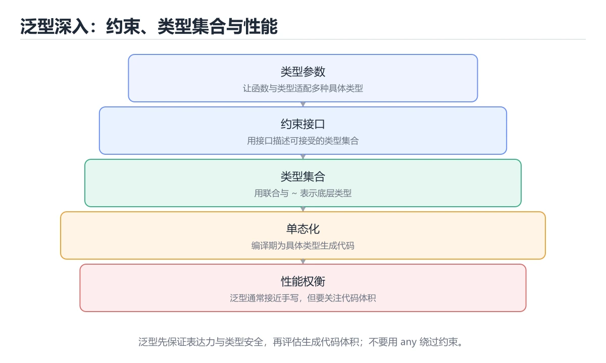
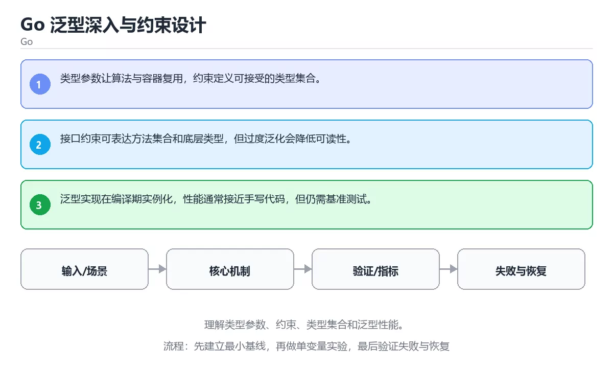

# Go 泛型深入与约束设计

> 内容更新时间：2026-10-06 · 学习阶段：高级 · 预计用时：35 分钟





## 本节知识框架

**课程定位**：所属分类 `go`（Go），课程主题 `Go 泛型深入与约束设计`，学习阶段 高级，建议用时 45 分钟。

本课主线：理解类型参数、约束、类型集合和泛型性能。

**学完本课应当能够**
- 说清 `泛型` 与 `约束` 的含义与区别，并各举一个正例和一个反例。
- 用本课示例验证 `类型参数` 的行为，记录输入、输出与失败条件。
- 遇到「用空接口代替类型参数」这类问题时，能说出触发条件与修复顺序。

### 从概念到验证的学习链条

1. `泛型`：先掌握 把类型作为参数复用同一套逻辑，同时让编译器保留类型检查，再用它解释 `约束` 为什么会出现。
2. `约束`：先掌握 模板或类型系统对可用类型、值或操作施加的限制条件，再用它解释 `类型参数` 为什么会出现。
3. `类型参数`：先掌握 按“Go 泛型深入与约束设计”中 泛型、约束、类型参数 的实践顺序，把四个步骤排成从准备到复盘的合理顺序，再用它解释 `性能` 为什么会出现。
4. `性能`：先掌握 系统在给定负载下表现出的吞吐、延迟、资源占用和稳定性，再用它解释 本课示例的观察结果 为什么会出现。

**先修与衔接**：本课是「Go」分类的第 20 课。先修内容：《实战：Go 并发抓取与 Worker Pool》。《实战：Go 并发抓取与 Worker Pool》里的 `goroutine`、`errgroup` 是本课的前提。相关或后续课程：《Go 性能剖析与调优（进阶）》、《Swift 集合与泛型》。

### 完成判据

- **定义关**：不看正文也能说明 `泛型` 是 把类型作为参数复用同一套逻辑，同时让编译器保留类型检查，并指出一个反例。
- **机制关**：能按“输入 → 转换 → 输出 → 验证”复述 `Go 泛型深入与约束设计`，而不是只背结论。
- **示例关**：能运行或推演 `Go 泛型深入与约束设计` 的 `text` 示例，并说明一个真实出现的标识符或字面量。
- **证据关**：能指出 `Go 泛型深入与约束设计` 示例里的 调用了 `main()`，并说明它支持或反驳了本课的哪一条结论。
- **排错关**：能复现 用空接口代替类型参数，记录现象并按 需要静态约束时使用类型参数 修复。
- **迁移关**：能把 `泛型`、`约束`、`类型参数`、`性能` 放进一个与 `Go 泛型深入与约束设计` 不同的项目场景，并保持输入与验证条件可追踪。
- **复盘关**：学完 `Go 泛型深入与约束设计` 后，用一句话写下仍然不确定的结论，并列出下一次验证需要的输入、环境和成功判据。

### 复习清单

- [ ] 能不看正文复述本课核心术语，并指出一个边界或反例。
- [ ] 能运行或推演本课示例，记录输入、输出与失败现象。
- [ ] 能完成一次自测，并把错题对照错误表定位原因。

## 核心概念定义

| 术语 | 操作性定义 | 常见边界与风险 |
| --- | --- | --- |
| 泛型 | 把类型作为参数复用同一套逻辑，同时让编译器保留类型检查。 | 易错：代码难读且实例化膨胀；正确做法是只在确实需要复用时引入泛型。 |
| 约束 | 模板或类型系统对可用类型、值或操作施加的限制条件。 | 易错：丢失编译期类型检查；正确做法是需要静态约束时使用类型参数。 |
| 类型参数 | 按“Go 泛型深入与约束设计”中 泛型、约束、类型参数 的实践顺序，把四个步骤排成从准备到复盘的合理顺序。 | 易错：丢失编译期类型检查；正确做法是需要静态约束时使用类型参数。 |
| 性能 | 系统在给定负载下表现出的吞吐、延迟、资源占用和稳定性。 | 结论随输入规模变化，小规模成立不代表大规模成立，需要重新测量。 |

## 原理与运行机制

### 机制总览

**教材衔接：核心知识**

### 1. 类型参数让算法与容器复用，约束定义可接受的类型集合。

- 关键做法：先让 泛型 的最小示例可复现，再加入并发或规模条件。
- 验证标准：泛型 的结果可复现、错误可解释、失败能恢复。

### 2. 接口约束可表达方法集合和底层类型，但过度泛化会降低可读性。

把这条结论放回「Go 泛型深入与约束设计」的完整流程里展开：

- 正文依据：能用自己的话解释：类型参数让算法与容器复用，约束定义可接受的类型集合。
- 落地检查：把「2. 接口约束可表达方法集合和底层类型，但过度泛化会降低可读性。」改写成一条可执行的核对项，逐条验证输入、超时与失败路径。

### 3. 泛型实现在编译期实例化，性能通常接近手写代码，但仍需基准测试。

把这条结论放回「Go 泛型深入与约束设计」的完整流程里展开：

- 正文依据：能用自己的话解释：接口约束可表达方法集合和底层类型，但过度泛化会降低可读性。
- 落地检查：把「3. 泛型实现在编译期实例化，性能通常接近手写代码，但仍需基准测试。」改写成一条可执行的核对项，逐条验证输入、超时与失败路径。

**教材衔接：关键流程**

**教材衔接：实践路径**

**教材衔接：版本与时效**

- 升级前确认 泛型 的兼容范围，把不可回退的改动单独拆成一次提交。
- 模块校验、最小版本选择与供应链安全是生产升级的重点
- 官方发布说明：https://go.dev/doc/devel/release

### 升级检查清单

- 先固定当前版本，跑通全部示例与测验，再升级工具链。
- 只改 泛型 的版本变量，记录编译、测试与产物体积的变化。
- 先回归 泛型 与 约束 的默认行为和错误信息，再扩大测试范围。
- 升级完成后更新本课「最后复核 / 下次复核」日期，并记录 泛型 的版本变化。

**教材衔接：零基础精讲：把Go 泛型深入与约束设计真正讲透**

### 先建立一个直觉

本课的摘要可以当作一张地图：理解类型参数、约束、类型集合和泛型性能。

### 逐步拆解

1. 澄清输入与目标。先写清「Go 泛型深入与约束设计」要解决的问题、合法输入范围和成功标准，再进入后续步骤。
2. 描述处理过程。把「泛型、约束、类型参数、性能」映射到具体步骤，每步都要求能单独验证。
3. 定义输出。把 interface 的返回值、日志和失败信号都写清楚，缺一项都不算完整。
4. 构造一次泛型越界，记录系统是拒绝、降级还是静默出错；三者对应的修复策略完全不同。
5. 把「核心知识」里的最小示例抄成 interface 一行的输入，先手算结果再执行，确认两者一致。

### 把正文串成一条执行链

- **1. 类型参数让算法与容器复用，约束定义可接受的类型集合。**：在「Go 泛型深入与约束设计」里，「1. 类型参数让算法与容器复用，约束定义可接受的类型集合。」这一步要先写清输入与预期，再记录实际结果和差异；结果不符时回到对应小节核对前提。
- **2. 接口约束可表达方法集合和底层类型，但过度泛化会降低可读性。**：在「Go 泛型深入与约束设计」里，「2. 接口约束可表达方法集合和底层类型，但过度泛化会降低可读性。」这一步要先写清输入与预期，再记录实际结果和差异；结果不符时回到对应小节核对前提。
- **3. 泛型实现在编译期实例化，性能通常接近手写代码，但仍需基准测试。**：在「Go 泛型深入与约束设计」里，「3. 泛型实现在编译期实例化，性能通常接近手写代码，但仍需基准测试。」这一步要先写清输入与预期，再记录实际结果和差异；结果不符时回到对应小节核对前提。
- **考点 1：按“Go 泛型深入与约束设计”中 泛型、约束、类型参数 的实践顺序，把四个步骤排成从准备到复盘的合理顺序。**：先独立作答，再回到本课对应小节核对判断依据；答错时记录是哪一个前提被忽略。
- **考点 2：关于「接口约束可表达方法集合和底层类型，但过度泛化会降低可读性。」，下列说法正确的是？**：先独立作答，再回到本课对应小节核对判断依据；答错时记录是哪一个前提被忽略。
- **考点 3：核心知识 的代码阅读题**：先独立作答，再回到本课正文核对 interface 的执行路径；答错时记录是哪一个前提被忽略。

### 从测验反推易错点

- 参考判断：类型参数让算法与容器复用，约束定义可接受的类型集合。
- 自问：如果去掉题干里的一个限定词，结论还成立吗？

- 参考判断：接口约束可表达方法集合和底层类型，但过度泛化会降低可读性。

- 参考判断：泛型实现在编译期实例化，性能通常接近手写代码，但仍需基准测试。

**检查点 4：本课的核心学习目标是什么？**

- 参考判断：理解类型参数、约束、类型集合和泛型性能。

**检查点 5：以下哪些术语与Go 泛型深入与约束设计直接相关？（多选）**

- 参考判断：泛型、约束


### 变式训练

1. 先用一个单文件示例验证 interface，确认正确性后再引入框架或分布式组件。
2. 把 泛型 的输入规模扩大十倍，记录时间、内存和失败路径，找出第一个瓶颈。
3. 制造一次 泛型 相关的依赖超时或错误输入，要求错误可解释且不留半完成状态。
5. 故意跳过 约束 的检查再运行，比较与正常流程的差异，并说明这个检查挡住的到底是哪一类失败。
6. 在低带宽或低算力条件下重跑 约束，记录降级路径是否仍然可用。


### 迁移案例库

换一个 约束 约束重做一次，确认结论在新条件下是否仍然成立。

#### 迁移案例 1：围绕「泛型」做一次小实验

**验收**：迁移过程要留下 interface 的可运行记录，并说明约束在新场景下是否仍然成立。

#### 迁移案例 2：围绕「约束」做一次小实验

**步骤**：
1. 复述当前方案对「约束」的假设，写成一句可证伪的话。

#### 迁移案例 3：围绕「类型参数」做一次小实验

**步骤**：
1. 复述当前方案对「类型参数」的假设，写成一句可证伪的话。

#### 迁移案例 4：围绕「性能」做一次小实验

**步骤**：
1. 复述当前方案对「性能」的假设，写成一句可证伪的话。

#### 迁移案例 5：围绕「泛型」做一次小实验

**步骤**：

#### 迁移案例 6：围绕「约束」做一次小实验

**步骤**：

#### 迁移案例 7：围绕「类型参数」做一次小实验

**步骤**：

#### 迁移案例 8：围绕「性能」做一次小实验

**步骤**：

#### 迁移案例 9：围绕「泛型」做一次小实验

**步骤**：

#### 迁移案例 10：围绕「约束」做一次小实验

**步骤**：

#### 迁移案例 11：围绕「类型参数」做一次小实验

**步骤**：

#### 迁移案例 12：围绕「性能」做一次小实验

**步骤**：

#### 迁移案例 13：围绕「泛型」做一次小实验

**步骤**：

#### 迁移案例 14：围绕「约束」做一次小实验

**步骤**：

#### 迁移案例 15：围绕「类型参数」做一次小实验

**步骤**：

#### 迁移案例 16：围绕「性能」做一次小实验

**步骤**：

<!-- p0-depth-v2:end -->

**教材衔接：验证步骤**

### 机制拆解：每一步的输入、动作与输出

#### 1. `泛型`
- 输入：`泛型`；本步把 把类型作为参数复用同一套逻辑，同时让编译器保留类型检查 当作判断规则。
- 动作：围绕 `泛型` 保留中间状态，并记录它与 `约束` 的对应关系。
- 输出：`约束`，它可以被下一段代码、测试或记录继续使用。
- `泛型` 的失败条件：当为所有函数套泛型时，会出现代码难读且实例化膨胀。

#### 2. `约束`
- 输入：`泛型`；本步把 模板或类型系统对可用类型、值或操作施加的限制条件 当作判断规则。
- 动作：围绕 `约束` 保留中间状态，并记录它与 `类型参数` 的对应关系。
- 输出：`类型参数`，它可以被下一段代码、测试或记录继续使用。
- `约束` 的失败条件：当用空接口代替类型参数时，会出现丢失编译期类型检查。

#### 3. `类型参数`
- 输入：`约束`；本步把 按“Go 泛型深入与约束设计”中 泛型、约束、类型参数 的实践顺序，把四个步骤排成从准备到复盘的合理顺序 当作判断规则。
- 动作：围绕 `类型参数` 保留中间状态，并记录它与 `性能` 的对应关系。
- 输出：`性能`，它可以被下一段代码、测试或记录继续使用。
- `类型参数` 的失败条件：当用空接口代替类型参数时，会出现丢失编译期类型检查。

#### 4. `性能`
- 输入：`类型参数`；本步把 系统在给定负载下表现出的吞吐、延迟、资源占用和稳定性 当作判断规则。
- 动作：围绕 `性能` 保留中间状态，并记录它与 `main` 的对应关系。
- 输出：`main`，它可以被下一段代码、测试或记录继续使用。
- `性能` 的失败条件：结论随输入规模变化，小规模成立不代表大规模成立，需要重新测量。

### 示例中的可观察事实

1. 调用了 `main()`；它对应的课程主题是 `Go 泛型深入与约束设计`。
2. 调用了 `Println()`；它对应的课程主题是 `Go 泛型深入与约束设计`。
3. 调用了 `Sum()`；它对应的课程主题是 `Go 泛型深入与约束设计`。
4. 出现字面量 `fmt`；它对应的课程主题是 `Go 泛型深入与约束设计`。

### 复现实验记录

- 环境：`Go 泛型深入与约束设计` 使用 `text` 示例，固定 `泛型`、`约束`、`类型参数`、`性能` 作为第一组条件。
- 首轮输入：先确认 调用了 `main()`，预测 `泛型` 会怎样变化。
- 基线观察：记录命令、输入、输出和错误原文，不用截图代替可复制的文本。
- 单变量修改：只改变 `泛型`，观察 `性能` 是否仍满足定义。
- 失败注入：复现 用空接口代替类型参数，确认现象是 丢失编译期类型检查。
- 记录结论：把“修改前、修改后、预期变化、实际变化”写成四列表，这样复盘 `Go 泛型深入与约束设计` 时才能区分概念错误与实现错误。

## 典型应用场景

- **用空接口代替类型参数**：典型现象是丢失编译期类型检查；正确做法是需要静态约束时使用类型参数。
- **约束写得过宽**：典型现象是编译期无法发现误用；正确做法是用接口约束精确描述所需操作。
- **为所有函数套泛型**：典型现象是代码难读且实例化膨胀；正确做法是只在确实需要复用时引入泛型。

### 最小验证场景

- 准备：保留 `text` 示例的原始输入，先记录 `Go 泛型深入与约束设计` 的基线输出和完整运行命令。
- 观察：先核对 调用了 `main()`，再改变一个与 `泛型` 相关的条件。
- 判定：新结果与 `Go 泛型深入与约束设计` 的基线不同不等于错误；只有当差异破坏了 `泛型` 的定义或错误表中的约束，才判定为失败。

### 选择与边界

- 使用 `泛型` 时，先满足它的定义：把类型作为参数复用同一套逻辑，同时让编译器保留类型检查；易错：代码难读且实例化膨胀；正确做法是只在确实需要复用时引入泛型。
- 使用 `约束` 时，先满足它的定义：模板或类型系统对可用类型、值或操作施加的限制条件；易错：丢失编译期类型检查；正确做法是需要静态约束时使用类型参数。
- 使用 `类型参数` 时，先满足它的定义：按“Go 泛型深入与约束设计”中 泛型、约束、类型参数 的实践顺序，把四个步骤排成从准备到复盘的合理顺序；易错：丢失编译期类型检查；正确做法是需要静态约束时使用类型参数。
- 使用 `性能` 时，先满足它的定义：系统在给定负载下表现出的吞吐、延迟、资源占用和稳定性；结论随输入规模变化，小规模成立不代表大规模成立，需要重新测量。

## 代码/协议/SQL 示例

### 最小可验证示例

**教材衔接：最小可运行示例**

先用 interface 跑通最小示例，然后只改一个与 泛型 相关的取值：

```go
package main

import "fmt"

type Number interface{ ~int | ~float64 }

func Sum[T Number](values []T) T {
	var total T
	for _, value := range values {
		total += value
	}
	return total
}

func main() {
	fmt.Println(Sum([]int{1, 2, 3}))
}
```

**教材衔接：预期输出**

```text
6
```

### 示例精读：先找证据，再改一个条件

1. 调用了 `main()`；它出现在 `Go 泛型深入与约束设计` 的示例中，阅读时先确认它前后各发生了什么。
2. 调用了 `Println()`；它出现在 `Go 泛型深入与约束设计` 的示例中，阅读时先确认它前后各发生了什么。
3. 调用了 `Sum()`；它出现在 `Go 泛型深入与约束设计` 的示例中，阅读时先确认它前后各发生了什么。
4. 出现字面量 `fmt`；它出现在 `Go 泛型深入与约束设计` 的示例中，阅读时先确认它前后各发生了什么。
- 在 `Go 泛型深入与约束设计` 中与 `泛型` 对照：示例必须能支持 把类型作为参数复用同一套逻辑，同时让编译器保留类型检查，否则说明这一段还缺少实现或验证步骤。
- 在 `Go 泛型深入与约束设计` 中与 `约束` 对照：示例必须能支持 模板或类型系统对可用类型、值或操作施加的限制条件，否则说明这一段还缺少实现或验证步骤。
- 在 `Go 泛型深入与约束设计` 中与 `类型参数` 对照：示例必须能支持 按“Go 泛型深入与约束设计”中 泛型、约束、类型参数 的实践顺序，把四个步骤排成从准备到复盘的合理顺序，否则说明这一段还缺少实现或验证步骤。
- 在 `Go 泛型深入与约束设计` 中与 `性能` 对照：示例必须能支持 系统在给定负载下表现出的吞吐、延迟、资源占用和稳定性，否则说明这一段还缺少实现或验证步骤。

## 时间/空间复杂度或性能分析

**性能关注点（Go 泛型深入与约束设计）**：调度器与 GC 影响开销：记录 P99 延迟、协程数量与堆占用，优先用 pprof 采样。

**本课特有开销（Go 泛型深入与约束设计 · 泛型）**：并发度提高后要观察是否出现拐点：延迟上升而吞吐不增，说明瓶颈已转移。

**测量方法**：以 `Go 泛型深入与约束设计` 的 `泛型` 场景为对象，固定输入跑一遍记录基线，再把规模或并发度提高一个数量级复测；两次结果的差值与波动范围才是结论依据。

### 需要控制的变量与记录项

- `Go 泛型深入与约束设计` 的 `泛型`：固定它的版本、输入范围和资源上限，分别记录速度、内存与失败率的变化。
- `Go 泛型深入与约束设计` 的 `约束`：固定它的版本、输入范围和资源上限，分别记录速度、内存与失败率的变化。
- `Go 泛型深入与约束设计` 的 `类型参数`：固定它的版本、输入范围和资源上限，分别记录速度、内存与失败率的变化。
- `Go 泛型深入与约束设计` 的 `性能`：固定它的版本、输入范围和资源上限，分别记录速度、内存与失败率的变化。
- `Go 泛型深入与约束设计` 中 `泛型` 的边界：易错：代码难读且实例化膨胀；正确做法是只在确实需要复用时引入泛型。达到边界时不要外推，必须重新测量。
- `Go 泛型深入与约束设计` 中 `约束` 的边界：易错：丢失编译期类型检查；正确做法是需要静态约束时使用类型参数。达到边界时不要外推，必须重新测量。
- `Go 泛型深入与约束设计` 中 `类型参数` 的边界：易错：丢失编译期类型检查；正确做法是需要静态约束时使用类型参数。达到边界时不要外推，必须重新测量。
- `Go 泛型深入与约束设计` 中 `性能` 的边界：结论随输入规模变化，小规模成立不代表大规模成立，需要重新测量。达到边界时不要外推，必须重新测量。
- `Go 泛型深入与约束设计` 的代码证据：先验证 调用了 `main()`，再记录该路径的输入规模与耗时；只看代码行数不能推出复杂度。

## 常见误区与易错点

| 容易写错的做法 | 实际现象 | 原因与正确做法 |
| --- | --- | --- |
| 用空接口代替类型参数 | 丢失编译期类型检查。 | 需要静态约束时使用类型参数。 |
| 约束写得过宽 | 编译期无法发现误用。 | 用接口约束精确描述所需操作。 |
| 为所有函数套泛型 | 代码难读且实例化膨胀。 | 只在确实需要复用时引入泛型。 |

### 现场 1：用空接口代替类型参数

**症状**：丢失编译期类型检查。

**根因与修复**：需要静态约束时使用类型参数。

**自检**：在本课示例里复现「用空接口代替类型参数」，改成需要静态约束时使用类型参数后重跑；如果症状消失且失败路径按预期变化，说明定位正确。

### 现场 2：约束写得过宽

**症状**：编译期无法发现误用。

**根因与修复**：用接口约束精确描述所需操作。

**自检**：在本课示例里复现「约束写得过宽」，改成用接口约束精确描述所需操作后重跑；如果症状消失且失败路径按预期变化，说明定位正确。

### 现场 3：为所有函数套泛型

**症状**：代码难读且实例化膨胀。

**根因与修复**：只在确实需要复用时引入泛型。

**自检**：在本课示例里复现「为所有函数套泛型」，改成只在确实需要复用时引入泛型后重跑；如果症状消失且失败路径按预期变化，说明定位正确。

## 与其他知识点的关系

**教材衔接：复习与迁移**

### 概念复述

- 用一句话说明「Go 泛型深入与约束设计」解决什么问题：理解类型参数、约束、类型集合和泛型性能。
- 写出泛型、约束、类型参数之间的关系，并各举一个例子。
- 说出本课最容易混淆的两个概念，以及区分它们的判据。

### 正文逐节复核

- **实践任务**：本节围绕Go 泛型深入与约束设计安排 3 个可交付任务，每个任务都要求留下可以复查的记录。
- **零基础精讲：把Go 泛型深入与约束设计真正讲透**：本课的摘要可以当作一张地图：理解类型参数、约束、类型集合和泛型性能。


### 迁移练习

把「Go 泛型深入与约束设计」的结论迁移到相邻主题，每次迁移都写清预测与证据：

- **先修**：`实战：Go 并发抓取与 Worker Pool`。本课默认这些内容已经掌握。
- **相关或后续**：`Go 性能剖析与调优（进阶）`、`Swift 集合与泛型`。本课术语会在这些课程里继续使用。
- **术语归属**：`泛型`、`约束`、`类型参数` 的定义以本课「核心概念定义」为准，换到其他课程时先确认定义是否被改写。
- 同一分类的《Go 性能优化与内存》也涉及 `性能`；两课衔接时先确认这个术语的定义是否一致。
- 同一分类的《Go 泛型与标准库实战》也涉及 `泛型`；两课衔接时先确认这个术语的定义是否一致。

### 先修与后续术语接口

- `Swift 集合与泛型`：共享术语 `泛型`、`约束`，共同关键词 `泛型`、`约束`。
- `实战：Go 并发抓取与 Worker Pool`：两者通过本分类的学习顺序衔接，阅读时重点比较各自的输入与失败条件。
- `Go 性能剖析与调优（进阶）`：两者通过本分类的学习顺序衔接，阅读时重点比较各自的输入与失败条件。

### 容易混淆的相邻概念

- `泛型` 与 `约束`：前者强调 把类型作为参数复用同一套逻辑，同时让编译器保留类型检查；后者强调 模板或类型系统对可用类型、值或操作施加的限制条件。判断时分别检查两条定义的适用范围，不要只看名称相似就互换。
- `约束` 与 `类型参数`：前者强调 模板或类型系统对可用类型、值或操作施加的限制条件；后者强调 按“Go 泛型深入与约束设计”中 泛型、约束、类型参数 的实践顺序，把四个步骤排成从准备到复盘的合理顺序。判断时分别检查两条定义的适用范围，不要只看名称相似就互换。
- `类型参数` 与 `性能`：前者强调 按“Go 泛型深入与约束设计”中 泛型、约束、类型参数 的实践顺序，把四个步骤排成从准备到复盘的合理顺序；后者强调 系统在给定负载下表现出的吞吐、延迟、资源占用和稳定性。判断时分别检查两条定义的适用范围，不要只看名称相似就互换。

## 自测题与参考答案

> 先独立作答，再对照参考答案；答案都能在本课正文、术语表或错误表里找到依据。

### 自测 1（概念复述）

不看正文，写出 `泛型` 的操作性定义，并说明它与 `约束` 的区别。

**参考答案**：把类型作为参数复用同一套逻辑，同时让编译器保留类型检查。

`约束` 的定位是：模板或类型系统对可用类型、值或操作施加的限制条件；两者的差别要从适用对象与失败模式上说明。

### 自测 2（排错）

本课错误表记录了「用空接口代替类型参数」这类做法。请写出它会出现的现象、根因，以及修复顺序。

**参考答案**：现象是丢失编译期类型检查；正确做法是需要静态约束时使用类型参数。修复时先复现现象并保留证据，再改动一处假设重跑，确认现象消失。

### 自测 3（动手验证）

运行本课的 `text` 示例，改动其中一个输入后重新运行，记录输出与错误信息。

**参考答案**：正常输入下 `text` 示例应当复现正文给出的结果；改动输入后，如果结果改变或报错，先核对它是否满足 `Go 泛型深入与约束设计` 中`泛型` 的适用范围，再检查错误表里是否有同类现象。

### 自测 4（代码阅读）

阅读本课开头的 `text` 示例，说明它体现了`泛型` 的哪一条性质，并指出改动哪个输入会让这条性质不再成立。

**参考答案**：`泛型` 的定义是 把类型作为参数复用同一套逻辑，同时让编译器保留类型检查，示例正是在实现这条定义。改动与 `泛型` 有关的一个输入后，如果结果不再符合 `Go 泛型深入与约束设计` 的正文描述，就说明该性质只在当前前提成立。

### 自测 5（迁移）

把 `Go 泛型深入与约束设计` 的方法迁移到自己的项目：围绕 `泛型` 写出一个与错误表同类的风险点，并说明触发条件和检验方式。

**参考答案**：例如「为所有函数套泛型」，它会导致代码难读且实例化膨胀；检验方式是按只在确实需要复用时引入泛型改一处再复现，确认现象消失且没有引入新的失败分支。

### 自测 6（对比）

用一个表格对比 `泛型` 与 `约束`：各写一行适用场景、一行失败表现。

**参考答案**：`泛型` 的定义是把类型作为参数复用同一套逻辑，同时让编译器保留类型检查；`约束` 的定义是模板或类型系统对可用类型、值或操作施加的限制条件。两者的失败表现分别对应本课错误表里与本术语相关的行。

### 自测 7（排错顺序）

面对「用空接口代替类型参数」引发的问题，请把“复现 丢失编译期类型检查 → 保留证据 → 需要静态约束时使用类型参数 → 回归验证”四步写成可执行的检查清单。

**参考答案**：第一步按丢失编译期类型检查复现；第二步记录输入、版本与完整报错；第三步按需要静态约束时使用类型参数只改一处；第四步重跑并确认失败路径也按预期变化。

### 自测 8（边界判断）

针对 `性能`，分别写出“可以使用”的条件和“结论不再成立”的条件。

**参考答案**：结论随输入规模变化，小规模成立不代表大规模成立，需要重新测量。 同时要把 `性能` 的定义 系统在给定负载下表现出的吞吐、延迟、资源占用和稳定性 与实际输入逐项对照。

### 自测 9（机制重建）

不看正文，按输入、转换、输出、验证四段重建 `泛型` → `约束` → `类型参数` → `性能` 的作用链。

**参考答案**：起点是 `泛型` 的定义 把类型作为参数复用同一套逻辑，同时让编译器保留类型检查；中间每一步都保留可观察状态；终点由 `性能` 检查，失败时回到错误表定位第一个偏离定义的步骤。

### 自测 10（综合排错）

在 `Go 泛型深入与约束设计` 中，现象是 代码难读且实例化膨胀。请围绕 为所有函数套泛型 写出最小复现、关键证据、修复动作和回归验证，并说明为什么不能只凭一次运行下结论。

**参考答案**：先复现 为所有函数套泛型，记录输入与完整错误；再按 只在确实需要复用时引入泛型 只改一处。回归时同时跑正常路径和边界路径，只有两次结果都可解释，才把修复视为完成。

### 自测 11（一分钟复述）

用每分钟约 200 字的速度复述 `Go 泛型深入与约束设计`：先给主问题，再按顺序说出 `泛型`、`约束`、`类型参数`、`性能`，最后给一个失败案例。

**自评标准**：主问题必须对应 理解类型参数、约束、类型集合和泛型性能；每个术语都要能接上一句定义或边界；失败案例必须写成可观察现象，不能用“可能有风险”代替证据。

## 术语速查

| 术语 | 一句话说明 |
| --- | --- |
| `泛型` | 把类型作为参数复用同一套逻辑，同时让编译器保留类型检查。 |
| `约束` | 模板或类型系统对可用类型、值或操作施加的限制条件。 |
| `类型参数` | 按“Go 泛型深入与约束设计”中 泛型、约束、类型参数 的实践顺序，把四个步骤排成从准备到复盘的合理顺序。 |
| `性能` | 系统在给定负载下表现出的吞吐、延迟、资源占用和稳定性。 |

**术语关系**：`泛型`（把类型作为参数复用同一套逻辑） → `约束`（模板或类型系统对可用类型、值或操作施加的限制条件） → `类型参数`（按“Go 泛型深入与约束设计”中 泛型、约束、类型参数 的实践顺序） → `性能`（系统在给定负载下表现出的吞吐、延迟、资源占用和稳定性）。

## 考点精讲

`Go 泛型深入与约束设计` 的题库有 6 道题，下面逐题给出题干、正确项与判断依据：先自己作答，再核对正确项，最后回到正文对应小节复核。

### 考点 1：第 1 题

- **题目**：按“Go 泛型深入与约束设计”中 泛型、约束、类型参数 的实践顺序，把四个步骤排成从准备到复盘的合理顺序。
- **正确项**：先明确 泛型 的输入、输出与约束 → 写出最小示例并核对 约束 的基线结果 → 只改一个变量，记录边界与失败路径的变化 → 固定版本与证据，把“Go 泛型深入与约束设计”的结论写成可复现记录
- **判断依据**：这道题落在术语 `泛型` 上：把类型作为参数复用同一套逻辑，同时让编译器保留类型检查。复习时把 `泛型` 的定义、适用边界和一个反例一起说清楚，再回到「核心概念定义」核对原文。

### 考点 2：第 2 题

- **题目**：在 `Go 泛型深入与约束设计` 里，与 `泛型` 有关的说法中，哪一项最符合理解类型参数、约束、类型集合和泛型性能。？
- **正确项**：接口约束可表达方法集合和底层类型，但过度泛化会降低可读性。
- **判断依据**：这道题落在术语 `泛型` 上：把类型作为参数复用同一套逻辑，同时让编译器保留类型检查。复习时把 `泛型` 的定义、适用边界和一个反例一起说清楚，再回到「核心概念定义」核对原文。

### 考点 3：第 3 题

- **题目**：这段 `go` 代码对应 `Go 泛型深入与约束设计` 的 `泛型`。课程要解决的是理解类型参数、约束、类型集合和泛型性能。关于代码内容，哪一项说法准确？
- **正确项**：调用了 `Sum()`
- **判断依据**：这道题落在术语 `泛型` 上：把类型作为参数复用同一套逻辑，同时让编译器保留类型检查。复习时把 `泛型` 的定义、适用边界和一个反例一起说清楚，再回到「核心概念定义」核对原文。

### 考点 4：第 4 题

- **题目**：`Go 泛型深入与约束设计` 的主线是：理解类型参数、约束、类型集合和泛型性能。下面哪一项与这条主线一致？
- **正确项**：理解类型参数、约束、类型集合和泛型性能。
- **判断依据**：这道题落在术语 `泛型` 上：把类型作为参数复用同一套逻辑，同时让编译器保留类型检查。复习时把 `泛型` 的定义、适用边界和一个反例一起说清楚，再回到「核心概念定义」核对原文。

### 考点 5：第 5 题

- **题目**：课程 `理解类型参数、约束、类型集合和泛型性能。`。在 `Go 泛型深入与约束设计` 里，`泛型`、`约束` 与下面哪些选项属于同一层概念？（多选）
- **正确项**：泛型；约束
- **判断依据**：这道题落在术语 `泛型` 上：把类型作为参数复用同一套逻辑，同时让编译器保留类型检查。复习时把 `泛型` 的定义、适用边界和一个反例一起说清楚，再回到「核心概念定义」核对原文。

### 考点 6：第 6 题

- **题目**：关于 `泛型`，下列哪些说法与 `Go 泛型深入与约束设计` 的正文一致？判断时以理解类型参数、约束、类型集合和泛型性能。为主线。（多选）
- **正确项**：接口约束可表达方法集合和底层类型，但过度泛化会降低可读性；类型参数让算法与容器复用，约束定义可接受的类型集合
- **判断依据**：这道题落在术语 `泛型` 上：把类型作为参数复用同一套逻辑，同时让编译器保留类型检查。复习时把 `泛型` 的定义、适用边界和一个反例一起说清楚，再回到「核心概念定义」核对原文。

### 考点 7：`泛型`

- **要点**：把类型作为参数复用同一套逻辑，同时让编译器保留类型检查。
- **泛型 的边界**：易错：代码难读且实例化膨胀；正确做法是只在确实需要复用时引入泛型。

### 考点 8：`约束`

- **要点**：模板或类型系统对可用类型、值或操作施加的限制条件。
- **约束 的边界**：易错：丢失编译期类型检查；正确做法是需要静态约束时使用类型参数。

### 考点 9：`类型参数`

- **要点**：按“Go 泛型深入与约束设计”中 泛型、约束、类型参数 的实践顺序，把四个步骤排成从准备到复盘的合理顺序。
- **类型参数 的边界**：易错：丢失编译期类型检查；正确做法是需要静态约束时使用类型参数。

### 考点 10：`性能`

- **要点**：系统在给定负载下表现出的吞吐、延迟、资源占用和稳定性。
- **性能 的边界**：结论随输入规模变化，小规模成立不代表大规模成立，需要重新测量。

### 考点 11：排错——用空接口代替类型参数

- **现象**：丢失编译期类型检查。
- **处理**：需要静态约束时使用类型参数。

### 考点 12：排错——约束写得过宽

- **现象**：编译期无法发现误用。
- **处理**：用接口约束精确描述所需操作。

### 考点 13：综合辨析——`泛型` 与 `性能`

- **辨析点**：`泛型` 的定义是 把类型作为参数复用同一套逻辑，同时让编译器保留类型检查；`性能` 的定义是 系统在给定负载下表现出的吞吐、延迟、资源占用和稳定性。
- **答题要求**：面对 `Go 泛型深入与约束设计` 的题目，先判断描述的是 `泛型` 还是 `性能`，再归到对应定义，最后写出一个会让该定义失效的边界输入。

### 考点 14：排错评分点

- **现象分**：能写出 丢失编译期类型检查，而不是只写“程序有错”。
- **证据分**：保留触发 用空接口代替类型参数 的输入、版本和错误原文。
- **修复分**：按 需要静态约束时使用类型参数 只改一处，并同时回归正常路径与边界路径。

## 内容元数据

- 内容版本：v2.0
- 最后更新：2026-10-06
- 学习阶段：高级
- 适用环境：Go 1.24+；本课聚焦 泛型。
- 内容来源：内置结构化课程与工程实践整理
- 相关主题：泛型、约束、类型参数、性能
- 质量版本：P0 测验标准 + P1 覆盖扩展 + P2 体验补全

## 参考资料与复核

- 最后复核：2026-10-04
- 下次复核：2027-04-10
- 复核范围：版本兼容、API 行为、安全建议与工程实践
- 来源性质：官方文档、标准或权威教材；本课核对关键词：泛型、约束、类型参数、性能。

| 参考资料 | 本课用途 |
| --- | --- |
| [Go pprof](https://pkg.go.dev/net/http/pprof) | 性能剖析与火焰图 |
| [Go Modules](https://go.dev/doc/modules/) | 模块、版本与依赖 |
| [Go 标准库](https://pkg.go.dev/std) | 标准库 API |

| [本课术语索引：Go 泛型深入与约束设计](#核心概念定义) | 按本课输入、术语边界和错误表现逐项核对 |
> 「Go 泛型深入与约束设计」的链接用于离线阅读后的延伸核对；App 不会自动联网。