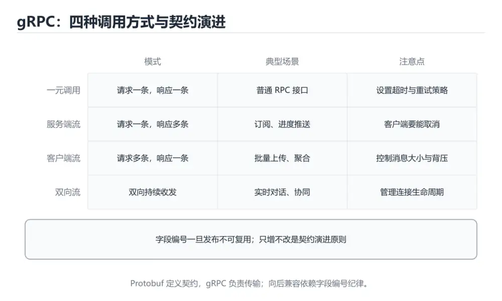
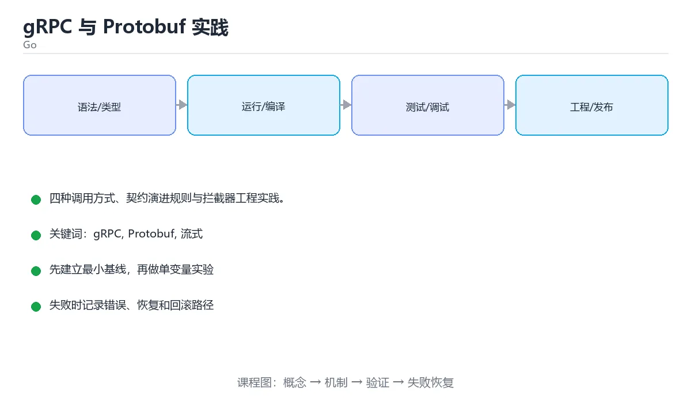

# gRPC 与 Protobuf 实践

> 内容更新时间：2026-10-03





## 学习目标

- 能用自己的话解释本课主题解决了什么问题，而不是只背术语。
- 能说清 「gRPC」、「Protobuf」、「流式」、「契约」 之间的关系，并分别举出一个例子。
- 能把本课知识放回「Go」的知识体系，说明它和相邻主题的边界。
- 能完成本课练习，并用验收标准检查自己的结果。

> 一句话摘要：四种调用方式、契约演进规则与拦截器工程实践。

## 前置知识

- 先完成上一课《Go 性能剖析与调优实战》；如果已经掌握，可以直接用本课练习自测。
- 本课阶段：进阶。建议先掌握同一分类的基础课程，并能独立运行正文中的最小示例。
- 开始前先复习：gRPC、Protobuf、流式。
- 如果某一步看不懂，先记录具体卡点，完成练习后再回头读一遍。

## 与 REST 的取舍速查

| 维度 | gRPC | REST + JSON |
| --- | --- | --- |
| 协议 | HTTP/2 加 Protobuf | HTTP/1.1 或 2 加 JSON |
| 契约 | `.proto` 强类型 | OpenAPI 或约定 |
| 代码生成 | 客户端与服务端都生成 | 通常只生成客户端 |
| 性能 | 序列化小、支持多路复用与流式 | 可读性好、调试方便 |
| 浏览器支持 | 需 grpc-web 代理 | 原生支持 |
| 适用 | 内部服务间高频调用 | 对外接口、第三方集成 |

经验：**内部服务用 gRPC，对外接口用 REST**；需要双向流式时优先 gRPC。

## 四种调用方式

| 方式 | 语义 | 适用 |
| --- | --- | --- |
| Unary | 一问一答 | 普通 RPC |
| Server streaming | 一个请求多个响应 | 大结果集、日志推送 |
| Client streaming | 多个请求一个响应 | 批量上传、聚合计算 |
| Bidirectional | 双向流 | 实时通信、协作编辑 |

```protobuf
syntax = "proto3";

package order.v1;

option go_package = "example.com/api/gen/order/v1;orderv1";

service OrderService {
  rpc GetOrder(GetOrderRequest) returns (GetOrderResponse);
  rpc ListOrders(ListOrdersRequest) returns (stream Order);
  rpc CreateOrder(CreateOrderRequest) returns (CreateOrderResponse);
}

message GetOrderRequest {
  int64 id = 1;
}

message Order {
  int64 id = 1;
  int64 user_id = 2;
  string status = 3;
  int64 amount_cents = 4;
}

message GetOrderResponse {
  Order order = 1;
}
```

```go
// 服务端要点：参数校验、标准错误码、明确区分内部错误
func (s *orderServer) GetOrder(ctx context.Context, req *orderv1.GetOrderRequest) (
	*orderv1.GetOrderResponse, error) {
	if req.GetId() <= 0 {
		return nil, status.Error(codes.InvalidArgument, "id 必须为正")
	}
	order, err := s.repo.Find(ctx, req.GetId())
	if errors.Is(err, ErrNotFound) {
		return nil, status.Error(codes.NotFound, "订单不存在")
	}
	if err != nil {
		return nil, status.Error(codes.Internal, "查询失败")
	}
	return &orderv1.GetOrderResponse{Order: toProto(order)}, nil
}

// 客户端要点：每次调用都带超时与元数据
func FetchOrder(client orderv1.OrderServiceClient, id int64) (*orderv1.Order, error) {
	ctx, cancel := context.WithTimeout(context.Background(), 800*time.Millisecond)
	defer cancel()
	ctx = metadata.AppendToOutgoingContext(ctx, "x-request-id", requestID())

	resp, err := client.GetOrder(ctx, &orderv1.GetOrderRequest{Id: id})
	if err != nil {
		return nil, fmt.Errorf("GetOrder(%d): %w", id, err)
	}
	return resp.GetOrder(), nil
}
```

## 工程实践速查

| 主题 | 做法 |
| --- | --- |
| 契约演进 | 只做向后兼容变更：加字段、不改字段号、不删必填 |
| 字段编号 | 一经使用不可复用，废弃字段用 `reserved` |
| 超时与重试 | 客户端设置 deadline；只重试幂等方法 |
| 错误模型 | 用标准状态码加结构化 details，而不是靠字符串 |
| 拦截器 | 统一处理日志、鉴权、限流、恢复 panic |
| 负载均衡 | 客户端侧 LB 或服务网格，注意长连接复用 |
| 可观测 | 透传 trace id，记录方法名、状态码与耗时 |
| 兼容浏览器 | 通过 grpc-web 或网关转 REST |

## 常见错误对照表

| 容易踩的做法 | 实际现象 | 原因与正确做法 |
| --- | --- | --- |
| 修改已用字段编号 | 新旧版本解析错乱 | 编号不可复用，废弃用 `reserved` |
| 不设 deadline | 请求无限挂起 | 每次调用都带超时 |
| 用错误字符串区分错误类型 | 调用方无法可靠判断 | 使用标准 status code |
| 拦截器 recover 后不记录 | 问题被隐藏 | 记录堆栈并返回 Internal |
| 流式接口无背压处理 | 内存暴涨 | 控制发送速率与缓冲 |
| 大消息不分片 | 超限或内存问题 | 拆分或改用流式 |
| 直接对外暴露 gRPC | 浏览器与第三方难接入 | 加网关或提供 REST 接口 |

## 自测清单

- [ ] 能说清 gRPC 与 REST 的取舍。
- [ ] 熟悉四种调用方式并会选型。
- [ ] 契约演进遵循向后兼容规则，字段编号不复用。
- [ ] 客户端调用都设置 deadline，错误用标准状态码。
- [ ] 拦截器统一处理日志、鉴权与 panic 恢复。

## 零基础详解：gRPC 与 Protobuf

### 一句话说清它是什么

gRPC 是「用接口定义文件驱动」的服务间通信方式：先写 `.proto`，再自动生成客户端与服务端代码。
它基于 HTTP/2 + Protobuf，天然支持强类型与流式调用。

### 用生活比喻理解

| 概念 | 比喻 | 说明 |
| --- | --- | --- |
| `.proto` | 合同模板 | 双方都按它生成代码 |
| Protobuf | 压缩表格 | 比 JSON 更小更快 |
| 生成代码 | 双方的对讲机 | 不用手写序列化 |
| 一元调用 | 一问一答 | 最常见的模式 |
| 流式调用 | 持续通话 | 单向或双向持续传数据 |
| 拦截器 | 安检 | 统一做日志、鉴权、超时 |

### 一个完整的 proto 文件

```protobuf
syntax = "proto3";

package user.v1;

option go_package = "example.com/myapp/gen/user/v1;userv1";

message GetUserRequest {
  int64 id = 1;
}

message User {
  int64 id = 1;
  string name = 2;
  string email = 3;
}

service UserService {
  rpc GetUser(GetUserRequest) returns (User);
  rpc ListUsers(ListUsersRequest) returns (stream User);   // 服务端流
}
```

| 要点 | 说明 |
| --- | --- |
| 字段编号 | 一旦发布不要改，改了就不兼容 |
| `package` | 带版本号，便于演进（`user.v1`） |
| 保留字段 | 删除字段时用 `reserved` 占位，防止被复用 |

### 生成代码与运行

```bash
# 安装工具
go install google.golang.org/protobuf/cmd/protoc-gen-go@latest
go install google.golang.org/grpc/cmd/protoc-gen-go-grpc@latest

# 生成
protoc --go_out=. --go-grpc_out=. proto/user.proto

# 或用 buf（更现代，配置集中）
buf generate
```

### 服务端实现

```go
type Server struct {
    userv1.UnimplementedUserServiceServer     // 向前兼容：以后加方法不会编译失败
    store *Store
}

func (s *Server) GetUser(ctx context.Context, req *userv1.GetUserRequest) (*userv1.User, error) {
    if req.GetId() <= 0 {
        return nil, status.Error(codes.InvalidArgument, "id 必须为正数")
    }

    u, err := s.store.Find(ctx, req.GetId())
    if errors.Is(err, ErrNotFound) {
        return nil, status.Error(codes.NotFound, "用户不存在")
    }
    if err != nil {
        return nil, status.Error(codes.Internal, "内部错误")
    }
    return &userv1.User{Id: u.ID, Name: u.Name, Email: u.Email}, nil
}

func main() {
    lis, _ := net.Listen("tcp", ":50051")
    s := grpc.NewServer(
        grpc.UnaryInterceptor(LoggingInterceptor),
    )
    userv1.RegisterUserServiceServer(s, &Server{})
    log.Fatal(s.Serve(lis))
}
```

### 状态码：别只会 return err

| 码 | 含义 | 使用场景 |
| --- | --- | --- |
| `OK` | 成功 | 正常返回 |
| `InvalidArgument` | 参数错误 | 校验失败 |
| `NotFound` | 不存在 | 资源没找到 |
| `AlreadyExists` | 已存在 | 唯一键冲突 |
| `PermissionDenied` | 无权限 | 越权访问 |
| `Unauthenticated` | 未认证 | token 无效 |
| `DeadlineExceeded` | 超时 | 上游超时 |
| `Unavailable` | 暂时不可用 | 下游挂了 |
| `Internal` | 内部错误 | 未预期异常 |

**要点**：不要用 `Internal` 表示「用户不存在」，客户端需要靠状态码决定要不要重试。

### 客户端调用与超时

```go
conn, err := grpc.NewClient("localhost:50051",
    grpc.WithTransportCredentials(insecure.NewCredentials()))
if err != nil {
    return err
}
defer conn.Close()

client := userv1.NewUserServiceClient(conn)

ctx, cancel := context.WithTimeout(context.Background(), 2*time.Second)
defer cancel()

user, err := client.GetUser(ctx, &userv1.GetUserRequest{Id: 1})
if err != nil {
    st, ok := status.FromError(err)
    if ok && st.Code() == codes.NotFound {
        return ErrNotFound
    }
    return fmt.Errorf("调用失败: %w", err)
}
```

### gRPC 与 REST 怎么选

| 维度 | gRPC | REST + JSON |
| --- | --- | --- |
| 性能 | 高（二进制、多路复用） | 一般 |
| 类型安全 | 强（代码生成） | 弱（手写类型） |
| 浏览器支持 | 需 grpc-web | 原生支持 |
| 可调试性 | 需专门工具 | curl 即可 |
| 适合 | **服务间内部调用** | 对外公开 API |

### 新手最容易踩的八个坑

| 坑 | 现象 | 正确做法 |
| --- | --- | --- |
| 改已发布字段编号 | 线上数据错乱 | 编号永不复用，用 `reserved` |
| 用 `Internal` 表示业务错误 | 客户端无法正确处理 | 用语义化状态码 |
| 不设超时 | 调用永久挂起 | 全部带 context 超时 |
| 直接在循环里逐个调用 | N 次往返，慢 | 用流式或批量接口 |
| 忘记实现 `Unimplemented` 嵌入 | 加方法后编译失败 | 嵌入它保证向前兼容 |
| 大消息单次传输 | 内存暴涨 | 用流式或分页 |
| 拦截器里做重活 | 每个请求都慢 | 只做轻量横切逻辑 |
| 用 gRPC 直接对外 | 浏览器与调试困难 | 对外暴露 REST 或 grpc-web |

### 手把手练习：带分页的列表接口

```protobuf
message ListUsersRequest {
  int32 page = 1;
  int32 size = 2;
}

message ListUsersResponse {
  repeated User users = 1;
  int32 total = 2;
}

service UserService {
  rpc ListUsers(ListUsersRequest) returns (ListUsersResponse);
}
```

```go
func (s *Server) ListUsers(ctx context.Context, req *userv1.ListUsersRequest) (*userv1.ListUsersResponse, error) {
    page, size := int(req.GetPage()), int(req.GetSize())
    if page < 1 {
        page = 1
    }
    if size <= 0 || size > 100 {
        size = 20
    }

    users, total, err := s.store.List(ctx, page, size)
    if err != nil {
        return nil, status.Error(codes.Internal, "查询失败")
    }

    out := make([]*userv1.User, 0, len(users))
    for _, u := range users {
        out = append(out, &userv1.User{Id: u.ID, Name: u.Name, Email: u.Email})
    }
    return &userv1.ListUsersResponse{Users: out, Total: int32(total)}, nil
}
```

### 学完自测

- [ ] 能说出 gRPC 相比 REST 的三个优势与两个劣势。
- [ ] 知道为什么 proto 字段编号不能复用。
- [ ] 能说出 `NotFound` 与 `Internal` 的区别。
- [ ] 知道客户端为什么必须设超时。
- [ ] 能说出 `Unimplemented...Server` 的作用。

## 动手练习

> 本课练习重点：围绕「gRPC、Protobuf、流式」完成复述、实验和交付，每个结果都要能被别人检查。

先写最小程序并用 go test 验证，再补 context、并发上限和错误传播。

### 练习 1：建立心智模型（10 分钟）

合上教程，用 3～5 句话回答：

1. 本课主题解决了什么问题？
2. 如果没有它，会出现什么具体后果？
3. 它和「Protobuf」是什么关系？

**验收标准**：至少出现一个本课关键词，并写出一个反例、边界条件或失效场景。

### 练习 2：做一次可控实验（20 分钟）

从正文中选一个最小示例，完成以下操作：

1. 先预测修改一个参数、输入或步骤后的结果。
2. 再实际执行或逐步推演，记录真实结果。
3. 如果结果与预测不同，写出差异原因。

**验收标准**：留下「原例 → 改动 → 预测 → 结果 → 原因」五步记录。

### 练习 3：交付一个小结果（30 分钟）

写一个可运行的小程序，并用 `go test` 或 `go vet` 验证结果。

任务要求：

- 结果必须能被别人检查，不能只写“我已经理解了”。
- 至少覆盖「gRPC」和「Protobuf」两个关键词。
- 写出 1 个仍然不确定的问题，以及下一步如何验证。

> 提示：时间有限时优先做练习 1 和练习 2；练习 3 可以拆成两次完成。

## 本课小结

- 核心问题：本课主题不是孤立术语，而是在「Go」中解决一类具体问题。
- 关键关系：先分清「gRPC」与「Protobuf」的职责，再理解「流式」的适用边界。
- 判断标准：能解释正常场景、边界条件和失败场景，才算真正掌握。
- 下一步：完成练习后，用自己的话写下 3 条要点，再去做本课测验。

## 可运行练习

### 任务 1：先跑通，再解释

```bash
# 安装工具
go install google.golang.org/protobuf/cmd/protoc-gen-go@latest
go install google.golang.org/grpc/cmd/protoc-gen-go-grpc@latest

# 生成
protoc --go_out=. --go-grpc_out=. proto/user.proto

# 或用 buf（更现代，配置集中）
buf generate
```

### 任务 2：只改一个条件

### 任务 3：迁移到自己的数据

用同一套思路处理一组你自己的数据或场景，保持输出格式与任务 1 一致。

## 故障现场

### 现场 1：本课的 gRPC 常规用例通过，但边界用例失败

**症状**：在本课的练习或生产场景里出现“本课的 gRPC 常规用例通过，但边界用例失败”。

**复现**：准备一组最小输入，只保留触发“本课的 gRPC 常规用例通过，但边界用例失败”的必要条件，连续运行两次确认结果稳定。

**定位**：围绕“gRPC 的前置条件与取值边界没有写进代码，默认值掩盖了空值和极值”检查调用链、输入数据和环境配置，先验证假设再改代码。

**预防**：把“本课的 gRPC 常规用例通过，但边界用例失败”写成一条自动化用例，并在本课的验收清单里保留对应检查项。

### 现场 2：本课的 Protobuf 结果在两次运行之间不一致

**症状**：在本课的练习或生产场景里出现“本课的 Protobuf 结果在两次运行之间不一致”。

**复现**：准备一组最小输入，只保留触发“本课的 Protobuf 结果在两次运行之间不一致”的必要条件，连续运行两次确认结果稳定。

**定位**：围绕“Protobuf 依赖了当前版本、执行顺序或共享状态，单次运行无法暴露差异”检查调用链、输入数据和环境配置，先验证假设再改代码。

**预防**：把“本课的 Protobuf 结果在两次运行之间不一致”写成一条自动化用例，并在本课的验收清单里保留对应检查项。

### 现场 3：本课的验证只在开发机通过

**症状**：在本课的练习或生产场景里出现“本课的验证只在开发机通过”。

**定位**：围绕“环境版本、配置和输入规模与目标环境不同，gRPC 缺少可重复的验证记录”检查调用链、输入数据和环境配置，先验证假设再改代码。

## 版本与时效

- 升级前用 go vet、go test -race 与静态检查覆盖并发生命周期
- 模块校验、最小版本选择与供应链安全是生产升级的重点
- 官方发布说明：https://go.dev/doc/devel/release

### 升级检查清单

- 先固定当前版本，跑通全部示例与测验，再升级工具链。
- 只改一个版本变量，记录编译、测试、性能与产物体积的变化。
- 重点回归默认值、弃用警告、序列化格式、并发语义和错误信息。
- 升级完成后更新本课的“最后复核 / 下次复核”日期与版本说明。

## 本课复习清单

离开本课前，逐项确认：

- [ ] 不看解析，能说出「内部服务间高频调用，通常优先选择？」的判断依据。
- [ ] 不看解析，能说出「修改 .proto 时，哪种做法是安全的？」的判断依据。
- [ ] 不看解析，能说出「客户端调用 gRPC 时必须注意？」的判断依据。
- [ ] 不看解析，能说出「服务端想把「参数非法」与「内部错误」区分开，正确做法是？」的判断依据。
- [ ] 不看解析，能说出「需要「一次请求、服务端持续推送多条结果」时，应该用？」的判断依据。
- [ ] 不看解析，能说出「补全代码：本课主题示例中，下面这行代码缺少哪个关…」的判断依据。
- [ ] 至少运行一次本课示例，记录输入、输出和一个边界情况。
- [ ] 把本课最容易混淆的两个概念写成一句话对照。

| 复盘项 | 记录 |
| --- | --- |
| 已经能独立解释的考点 |  |
| 仍然说不清的概念 |  |
| 下一步验证动作 |  |

## 术语速查

| 术语 | 本课语境 |
| --- | --- |
| `.proto` | \| 契约 \| `.proto` 强类型 \| OpenAPI 或约定 \| |
| `reserved` | \| 字段编号 \| 一经使用不可复用，废弃字段用 `reserved` \| |
| `package` | \| `package` \| 带版本号，便于演进（`user.v1`） \| |
| `user.v1` | \| `package` \| 带版本号，便于演进（`user.v1`） \| |
| `OK` | \| `OK` \| 成功 \| 正常返回 \| |
| `InvalidArgument` | \| `InvalidArgument` \| 参数错误 \| 校验失败 \| |
| `NotFound` | \| `NotFound` \| 不存在 \| 资源没找到 \| |
| `AlreadyExists` | \| `AlreadyExists` \| 已存在 \| 唯一键冲突 \| |
| `PermissionDenied` | \| `PermissionDenied` \| 无权限 \| 越权访问 \| |
| `Unauthenticated` | \| `Unauthenticated` \| 未认证 \| token 无效 \| |
| `DeadlineExceeded` | \| `DeadlineExceeded` \| 超时 \| 上游超时 \| |
| `Unavailable` | \| `Unavailable` \| 暂时不可用 \| 下游挂了 \| |

## 考点精讲

### 考点 1：围绕“gRPC 与 Protobuf 实践”中的 gRPC、Protobuf、流式，下列哪两项是本课强调的实践判断？

- **判断依据**：正确答案包括「学习 gRPC 时要同时说明输入、输出和失败路径，不能只看正常流程」、「验证 Protobuf 时要固定版本并覆盖边界输入，结论才可复现」。正确答案是学习 gRPC 时要同时说明输入、输出和失败路径。本课把本课主题拆成概念、示例与故障现场三部分，因此判断 gRPC 时必须同时交代输入、输出和失败路径，这使“学习 gRPC 时要同时说明输入、输出和失败路径，不能只看正常流程”成立。在本课主题里，判断 Protobuf 时要固定版本与边界输入，所以“验证 Protobuf 时要固定版本并覆盖边界输入，结论才可复现”才可复现。

### 考点 2：修改 .proto 时，哪种做法是安全的？

- **判断依据**：本题应选「新增字段并给新编号」。只有向后兼容的变更（新增字段、不改变已有编号与类型）才能保证新旧版本互通。解题的关键不是记住孤立术语，而是确认「新增字段并给新编号」是否完整覆盖题干的输入、输出和失败路径，并排除「删除字段后复用其编号」、「把可选字段改成必填」这类相邻概念。

### 考点 3：客户端调用 gRPC 时必须注意？

- **判断依据**：符合题干条件的是「每次调用都设置 deadline」。没有 deadline 的调用可能永久挂起并耗尽连接与协程。正确的判断需要逐项核对定义、版本和适用条件（gogrpc 第 3 题）。正确的判断需要逐项核对定义、版本和适用条件（go_grpc 第 3 题）。

### 考点 4：服务端想把「参数非法」与「内部错误」区分开，正确做法是？

- **判断依据**：结论应落在「使用标准 status code（InvalidArgument / Internal）」。标准状态码是跨语言可识别的契约，客户端能据此做重试或提示。这道题要求区分概念与边界，「使用标准 status code（InvalidArgument / I…」只有在题干给出的前提下才成立，而「统一返回 Internal」、「返回不同的错误字符串」缺少同一组条件。

### 考点 5：下面这段 Go 代码复现了“gRPC 与 Protobuf 实践”中 gRPC、Protobuf、流式 相关的一个常见故障，哪一项最准确地解释了问题？

- **判断依据**：正确答案是「闭包直接捕获循环变量 i，多个 goroutine 可能打印同一个值；应把 i 作为参数传入」（go_grpc 第 5 题）。正确答案是闭包直接捕获循环变量 i，多个 goroutine 可能打印同一个值。应把 i 作为参数传入（go_grpc 第 5 题）。应把 i 作为参数传入（gogrpc 第 5 题）。

### 考点 6：补全代码：「gRPC 与 Protobuf 实践」示例中，下面这行代码缺少哪个关键字或函数名？请填入 ____。

`return nil, status.Error(codes.____, "id 必须为正")`

- **判断依据**：空格应填写「InvalidArgument」、「invalidargument」。解题的关键不是记住孤立术语，而是确认「InvalidArgument 或 invalidargument」是否完整覆盖题干的输入、输出和失败路径，并排除这类相邻概念。

## English Overview

**Title:** gRPC & Protobuf

**Summary:** Call types, contract evolution and interceptors.

**Category:** Go
**Level:** 进阶
**Key terms:** gRPC, Protobuf, 流式, 契约, 拦截器, 状态码

## 内容元数据

- 内容版本：v2.0
- 最后更新：2026-10-03
- 学习阶段：进阶
- 适用环境：Go 1.24+
- 内容来源：内置结构化课程与工程实践整理
- 相关主题：gRPC、Protobuf、流式、契约、拦截器、状态码
- 质量版本：P0 测验标准 + P1 覆盖扩展 + P2 体验补全


## 参考资料与复核

- 最后复核：2026-10-04
- 下次复核：2027-04-04
- 复核范围：版本兼容、API 行为、安全建议与工程实践
- 来源性质：官方文档、标准或权威教材；正文为离线教学重组

| 参考资料 | 本课用途 |
| --- | --- |
| [Effective Go](https://go.dev/doc/effective_go) | 惯用写法与接口设计 |
| [Go 测试](https://go.dev/doc/tutorial/add-a-test) | 测试、基准与覆盖率 |
| [database/sql](https://pkg.go.dev/database/sql) | 数据库连接、事务与预编译 |

> 「gRPC 与 Protobuf 实践」的链接用于离线阅读后的延伸核对；App 不会自动联网。
