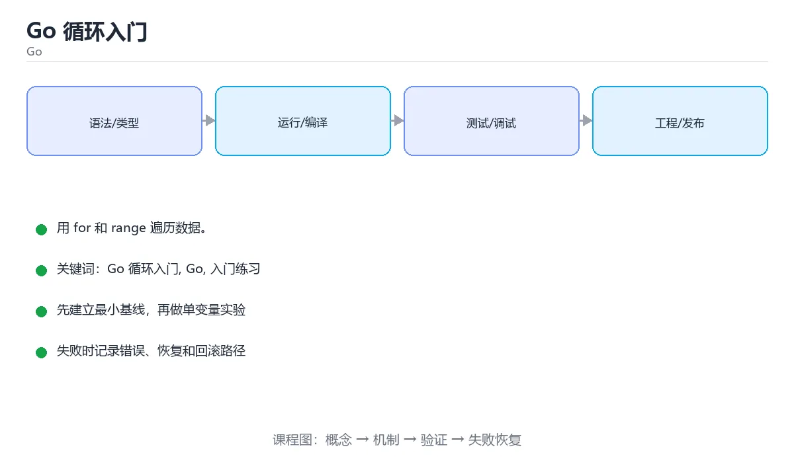

# Go 循环入门



> 内容更新时间：2026-10-03 · 学习阶段：入门 · 预计用时：15 分钟

## 学习目标

- 先认识「Go 循环入门」需要的工具、输入和输出。
- 按步骤运行最小示例，并记录结果与错误。
- 用一个边界输入验证自己是否真正掌握。

## 前置知识

- 会进行基本的文件或命令行操作。
- 不需要预先掌握「Go」的高级知识。

## 一句话入门

用 for 和 range 遍历数据。

## 最小示例

```go
package main

import "fmt"

func main() {
	total := 0
	for i := 1; i <= 5; i++ {
		total += i
	}
	fmt.Println("total =", total)
}
```

## 预期输出

```text
total = 15
```

## 常见错误

- 忽略函数返回的 error，导致错误被静默吞掉。
- 复制命令时遗漏空格、引号或必要参数。

## 动手练习

1. 原样运行最小示例，保存命令和输出。
2. 把数字 2 改成 10，预测并验证新结果。
3. 制造一个错误输入，写出错误信息和修复方法。

## 本课小结

- 入门阶段先保证能运行、能观察、能解释，再追求复杂功能。
- 每次只改一个变量，记录预测与实际结果。
- 遇到错误先看第一条错误信息，再回到最小示例。


## 代码实验：把示例跑成证据

这一节不引入新语法，而是把「Go 循环入门」的最小示例变成可以复现、可以对照的实验。每次只改变一个条件，先写预测，再运行，最后解释差异。

### 实验一：建立基线

```go
package main

import "fmt"

func main() {
	total := 0
	for i := 1; i <= 5; i++ {
		total += i
	}
	fmt.Println("total =", total)
}
```

先原样运行上面的代码，记录命令、完整输出和退出状态。然后把输出与正文的预期输出逐字对照，不要用“看起来差不多”代替核对；空格、大小写、换行和错误流向都可能暴露环境差异。

### 实验二：只改一个输入

从代码中选一个会影响结果的字面量、参数或输入，把它替换成边界值：数值可尝试 0、1、最大值和最小值，字符串可尝试空串和超长文本，集合可尝试空集合、单元素和重复元素。先写出预测，再运行并记录实际结果。

### 实验三：制造一个可控错误

声明一个局部变量却不使用，或者删除一个仍然被引用的导入。Go 会把它们当作编译错误；记录错误信息后再恢复。

| 实验 | 改动 | 预测 | 实际 | 结论 |
| --- | --- | --- | --- | --- |
| 基线 | 保持原样 |  |  |  |
| 边界 |  |  |  |  |
| 失败 |  |  |  |  |

### 实验四：用三句话复述

1. 输入是什么，哪些输入属于合法范围，哪些属于边界或非法范围？
2. 程序按什么顺序处理输入，在哪一步产生了状态变化或副作用？
3. 输出如何验证，失败时第一条可观察证据是什么？

## Go 语言基础机制速览

### 包、入口与工具链

Go 程序由包组成，`package main` 加 `func main()` 是可执行程序的入口。`go run` 编译并运行，`go build` 生成二进制，`go test` 运行测试，`go mod` 管理依赖。包名决定导入路径的最后一段，未使用的导入和局部变量会直接导致编译失败，这是 Go 有意保持代码整洁的设计。

### 变量、类型与零值

`var` 用于显式声明，`:=` 用于在函数内短声明并让编译器推断类型。Go 是静态类型语言，不同类型之间不会隐式转换，整数与浮点数、字符串与字节切片都需要显式转换。未初始化的变量会得到零值：数值为 0，字符串为空串，布尔为 false，指针和接口为 nil，切片、map、channel 也是 nil。零值让类型可以直接使用，但写入 nil map 会 panic，读取则返回零值。

### 函数、错误与资源管理

Go 函数可以返回多个值，最常用的组合是结果加 `error`。错误是普通值，调用方应显式检查，不要把错误丢掉或用 panic 代替可预期的失败。`defer` 把清理动作推迟到函数返回时执行，常用于关闭文件、释放锁和记录耗时；多个 defer 按后进先出执行。`panic` 只适合不可恢复的程序错误，`recover` 必须配合 defer 使用，不能把它当作常规异常控制流。

### 切片、map 与循环

数组长度固定且属于类型的一部分，切片是动态长度视图，包含指针、长度和容量。`append` 在容量不足时会分配新底层数组，因此原切片的修改不一定同步；需要独立副本时使用 `copy` 或 `slices.Clone`。map 的键必须可比较，遍历顺序不保证稳定。`range` 遍历切片时复制元素，修改元素要用下标；遍历 map 时可同时取得键和值，但不要依赖顺序。循环变量在旧版本中会被复用，闭包或 goroutine 捕获时要显式复制。

### 并发与上下文

goroutine 是轻量执行单元，channel 用于在 goroutine 之间传递数据。无缓冲 channel 需要发送和接收同时就绪，有缓冲 channel 在缓冲满或空时阻塞。`select` 可以在多个 channel 操作之间选择，配合 `context.Context` 传递取消、超时和请求范围的值。共享内存并发仍然需要 mutex 或原子操作；并发安全不等于业务原子性，复合操作要在同一临界区内完成。

## 本课自测清单与错误对照

下面把「Go 循环入门」最容易混淆的选项集中起来。不要只记正确答案，要能说明错误选项在什么条件下看似合理、又为什么不能满足题干。

本课测验以直接定义和步骤判断为主。请把每个错误选项改写成一句反例，
说明它在哪个输入、边界或前提变化下会失败。

### 完成标准

- [ ] 能用具体输入复现最小示例，并逐行解释输入、处理与输出。
- [ ] 能只改一个值完成边界实验，并让预测与实际结果一致。
- [ ] 能制造一个可控错误，读出第一条错误信息并完成修复。
- [ ] 能不看书说出本课至少两个易错点和对应的验证方法。

### 复盘记录

| 项目 | 记录 |
| --- | --- |
| 学到的核心机制 |  |
| 仍然不确定的问题 |  |
| 下一步验证动作 |  |


## 考点精讲：把测验题还原成判断过程

本课有 5 个判断点。先自己作答，再看「判断依据」；如果结论正确但理由不完整，回到正文对应章节补足概念。

### 考点 1：Go 提供了哪些循环关键字？

- **正确判断**：只有 for
- **判断依据**：Go 只有 for 一种循环语句，省略条件时就是无限循环，只写条件时等价于 while，配合 range 则实现遍历。这种设计减少了同义关键字，也让循环的退出条件更容易统一检查。课程摘要指出用 for 和 range 遍历数据，本课要判断的正是Go提供了哪些循环关键字。
- **迁移检查**：遮住选项，只根据定义复述一次答案，再回来看哪个选项与复述一致。

### 考点 2：示例中 for i := 1; i <= 5; i++ 累加后的输出是什么？

- **正确判断**：total = 15，循环累加 1 到 5 五个整数
- **判断依据**：正确答案是「total = 15，循环累加 1 到 5 五个整数」，这道题在问示例中fori:=1;i<=5;i++累加后的输出是什么，判断时要把题干限定的输入、边界与目标逐项对齐。i 依次取 1 到 5，每轮执行 total += i，得到 15。
- **迁移检查**：把题干里的一个条件换成边界值，原来的结论还成立吗？写出判断过程。

### 考点 3：Go 的 for range 遍历切片 for i, v := range items 会返回什么？

- **正确判断**：下标与元素副本，可以只用其中一个
- **判断依据**：正确答案是「下标与元素副本，可以只用其中一个」，这道题在问Go的forrange遍历切片fori,v:=rangeitems会返回什么，判断时要把题干限定的输入、边界与目标逐项对齐。range 对切片返回下标与元素副本，若只需要值可以写成 for , v := range items。
- **迁移检查**：遮住选项，只根据定义复述一次答案，再回来看哪个选项与复述一致。

### 考点 4：在 Go 循环中，break 与 continue 的作用是？

- **正确判断**：break 结束当前循环，continue 进入下一轮迭代
- **判断依据**：正确答案是「break 结束当前循环，continue 进入下一轮迭代」，这道题在问在Go循环中，break与continue的作用是，判断时要把题干限定的输入、边界与目标逐项对齐。break 让控制流离开最近一层的 for、switch 或 select。
- **迁移检查**：把题干里的一个条件换成边界值，原来的结论还成立吗？写出判断过程。

### 考点 5：填空：「Go 循环入门」术语速查中，表示「Go 程序由包组成，`____` 加 `func main()` 是可执行程序的入口。`go run` 编译并运行，`go build` 生成二进制，`go test` 运行测试，`go mod` 管理依赖。包名决定导入路径…」的术语是什么？

- **正确判断**：package main
- **判断依据**：正确答案是「package main」，这道题在问填空：Go循环入门术语速查中，表示Go程序由包组成，…管理依赖，包名决定导入路径…的术语是什么，判断时要把题干限定的输入、边界与目标逐项对齐。包名决定导入路径…的术语是什么。课程摘要指出用 for 和 range 遍历数据，本课要判断的正是填空：Go循环入门术语速查中，表示Go程序由包组成，…管理依赖，包名决定导入路径…的术语是什么。
- **迁移检查**：把答案换成另一种等价写法，是否仍然正确？说明依据。

### 补充考点 1：阅读「Go 循环入门」的代码片段，下面哪项判断是正确的？

- **正确判断**：只有 for
- **判断依据**：正确答案是「只有 for」。这段代码来自「Go 循环入门」的示例，判断时先看输入与输出，再检查条件、循环和边界。Go 只有 for 一种循环语句，省略条件时就是无限循环，只写条件时等价于 while，配合 range 则实现遍历。这种设计减少了同义关键字，也让循环的退出条件更容易统一检查。课程摘要指出用 for…在「Go 循环入门」中，如果只改一个条件，输出通常会随之改变，因此不能脱离代码前提作答。

## 本课复习清单

离开本课前，逐项确认：

- [ ] 不看解析，能说出「Go 提供了哪些循环关键字？」的判断依据。
- [ ] 不看解析，能说出「示例中 for i := 1; i <= 5; i++ 累加后的输出是什么？」的判断依据。
- [ ] 不看解析，能说出「Go 的 for range 遍历切片 for i, v := range it…」的判断依据。
- [ ] 不看解析，能说出「在 Go 循环中，break 与 continue 的作用是？」的判断依据。
- [ ] 不看解析，能说出「填空：「Go 循环入门」术语速查中，表示「Go 程序由包组成，`____` 加 …」的判断依据。
- [ ] 至少运行一次本课示例，记录输入、输出和一个边界情况。
- [ ] 把本课最容易混淆的两个概念写成一句话对照。

| 复盘项 | 记录 |
| --- | --- |
| 已经能独立解释的考点 |  |
| 仍然说不清的概念 |  |
| 下一步验证动作 |  |

## 逐节复习与自检

下面按正文顺序回顾每一节，并给出一个自检问题；说不清的地方回到原章节补课。

### 最小示例

```go
package main

import "fmt"

func main() {
	total := 0
	for i := 1; i <= 5; i++ {
		total += i
	}
	fmt.Println("total =", total)
}
```

自检：这一节与相邻主题的边界在哪里？

### 预期输出

```text
total = 15
```

自检：这一节与相邻主题的边界在哪里？

### 常见错误

忽略函数返回的 error，导致错误被静默吞掉。

自检：把这一节讲给没学过的人，最需要强调哪一点？

### 动手练习

把数字 2 改成 10，预测并验证新结果。制造一个错误输入，写出错误信息和修复方法。

自检：如果去掉这一节里的一个前提，结论会怎样变化？

## 术语速查

把本课反复出现的术语集中放在一起。复习时先遮住右列，尝试用自己的话解释，再回到正文核对。

| 术语 | 本课语境 |
| --- | --- |
| `package main` | Go 程序由包组成，`package main` 加 `func main()` 是可执行程序的入口。`go run` 编译并运行，`go build` 生成二进制，`go test` 运行测试，`go mod` 管理依… |
| `func main()` | Go 程序由包组成，`package main` 加 `func main()` 是可执行程序的入口。`go run` 编译并运行，`go build` 生成二进制，`go test` 运行测试，`go mod` 管理依… |
| `go run` | Go 程序由包组成，`package main` 加 `func main()` 是可执行程序的入口。`go run` 编译并运行，`go build` 生成二进制，`go test` 运行测试，`go mod` 管理依… |
| `go build` | Go 程序由包组成，`package main` 加 `func main()` 是可执行程序的入口。`go run` 编译并运行，`go build` 生成二进制，`go test` 运行测试，`go mod` 管理依… |
| `go test` | Go 程序由包组成，`package main` 加 `func main()` 是可执行程序的入口。`go run` 编译并运行，`go build` 生成二进制，`go test` 运行测试，`go mod` 管理依… |
| `go mod` | Go 程序由包组成，`package main` 加 `func main()` 是可执行程序的入口。`go run` 编译并运行，`go build` 生成二进制，`go test` 运行测试，`go mod` 管理依… |
| `var` | `var` 用于显式声明，`:=` 用于在函数内短声明并让编译器推断类型。Go 是静态类型语言，不同类型之间不会隐式转换，整数与浮点数、字符串与字节切片都需要显式转换。未初始化的变量会得到零值：数值为 0，字符串为空串，… |
| `:=` | `var` 用于显式声明，`:=` 用于在函数内短声明并让编译器推断类型。Go 是静态类型语言，不同类型之间不会隐式转换，整数与浮点数、字符串与字节切片都需要显式转换。未初始化的变量会得到零值：数值为 0，字符串为空串，… |
| `error` | Go 函数可以返回多个值，最常用的组合是结果加 `error`。错误是普通值，调用方应显式检查，不要把错误丢掉或用 panic 代替可预期的失败。`defer` 把清理动作推迟到函数返回时执行，常用于关闭文件、释放锁和记… |
| `defer` | Go 函数可以返回多个值，最常用的组合是结果加 `error`。错误是普通值，调用方应显式检查，不要把错误丢掉或用 panic 代替可预期的失败。`defer` 把清理动作推迟到函数返回时执行，常用于关闭文件、释放锁和记… |
| `panic` | Go 函数可以返回多个值，最常用的组合是结果加 `error`。错误是普通值，调用方应显式检查，不要把错误丢掉或用 panic 代替可预期的失败。`defer` 把清理动作推迟到函数返回时执行，常用于关闭文件、释放锁和记… |
| `recover` | Go 函数可以返回多个值，最常用的组合是结果加 `error`。错误是普通值，调用方应显式检查，不要把错误丢掉或用 panic 代替可预期的失败。`defer` 把清理动作推迟到函数返回时执行，常用于关闭文件、释放锁和记… |

## 面试问答与自测

下面把本课考点换成面试追问。先口述自己的答案，
再对照参考回答检查是否遗漏了前提、边界或失败路径。

### 追问 1：Go 提供了哪些循环关键字？

**参考回答**：Go 只有 for 一种循环语句，省略条件时就是无限循环，只写条件时等价于 while，配合 range 则实现遍历。这种设计减少了同义关键字，也让循环的退出条件更容易统一检查。课程摘要指出用 for 和 range 遍历数据，本课要判断的正是Go提供了哪些循环关键字。

### 追问 2：示例中 for i := 1; i <= 5; i++ 累加后的输出是什么？

**参考回答**：正确答案是「total = 15，循环累加 1 到 5 五个整数」，这道题在问示例中fori:=1;i<=5;i++累加后的输出是什么，判断时要把题干限定的输入、边界与目标逐项对齐。i 依次取 1 到 5，每轮执行 total += i，得到 15。

### 追问 3：Go 的 for range 遍历切片 for i, v := range items 会返回什么？

**参考回答**：正确答案是「下标与元素副本，可以只用其中一个」，这道题在问Go的forrange遍历切片fori,v:=rangeitems会返回什么，判断时要把题干限定的输入、边界与目标逐项对齐。range 对切片返回下标与元素副本，若只需要值可以写成 for , v := range items。

### 追问 4：在 Go 循环中，break 与 continue 的作用是？

**参考回答**：正确答案是「break 结束当前循环，continue 进入下一轮迭代」，这道题在问在Go循环中，break与continue的作用是，判断时要把题干限定的输入、边界与目标逐项对齐。break 让控制流离开最近一层的 for、switch 或 select。

### 追问 5：填空：「Go 循环入门」术语速查中，表示「Go 程序由包组成，`____` 加 `func main()` 是可执行程序的入口。`go run` 编译并运行，`go build` 生成二进制，`go test` 运行测试，`go mod` 管理依赖。包名决定导入路径…」的术语是什么？

**参考回答**：正确答案是「package main」，这道题在问填空：Go循环入门术语速查中，表示Go程序由包组成，…管理依赖，包名决定导入路径…的术语是什么，判断时要把题干限定的输入、边界与目标逐项对齐。包名决定导入路径…的术语是什么。课程摘要指出用 for 和 range 遍历数据，本课要判断的正是填空：Go循环入门术语速查中，表示Go程序由包组成，…管理依赖，包名决定导入路径…的术语是什么。

## English Overview

**Title:** Go Loops

**Summary:** Iterate with for and range.

**Category:** Go  
**Level:** 入门  
**Key terms:** Go 循环入门, Go, 入门练习

> The full tutorial is written in Chinese. This bilingual overview helps English readers identify the topic, scope and key terms before studying the detailed examples.

## 内容元数据

- 内容版本：v2.0
- 最后更新：2026-10-03
- 学习阶段：入门
- 适用环境：Go 1.24+
- 内容来源：内置结构化课程与工程实践整理
- 相关主题：Go 循环入门、Go、入门练习
- 质量版本：P0 测验标准 + P1 覆盖扩展 + P2 体验补全


## 参考资料与复核

- 最后复核：2026-10-04
- 下次复核：2027-04-04
- 复核范围：版本兼容、API 行为、安全建议与工程实践
- 来源性质：官方文档与标准；本课正文为离线教学重组，不复制原文

| 参考资料 | 本课用途 |
| --- | --- |
| [Go 官方文档](https://go.dev/doc/) | 语言、并发与工具链 |
| [Go 标准库](https://pkg.go.dev/std) | 标准库 API |

> 本课主题：用 for 和 range 遍历数据。

> App 完全离线展示文字链接，不会自动联网；需要延伸阅读时可复制链接到浏览器。
