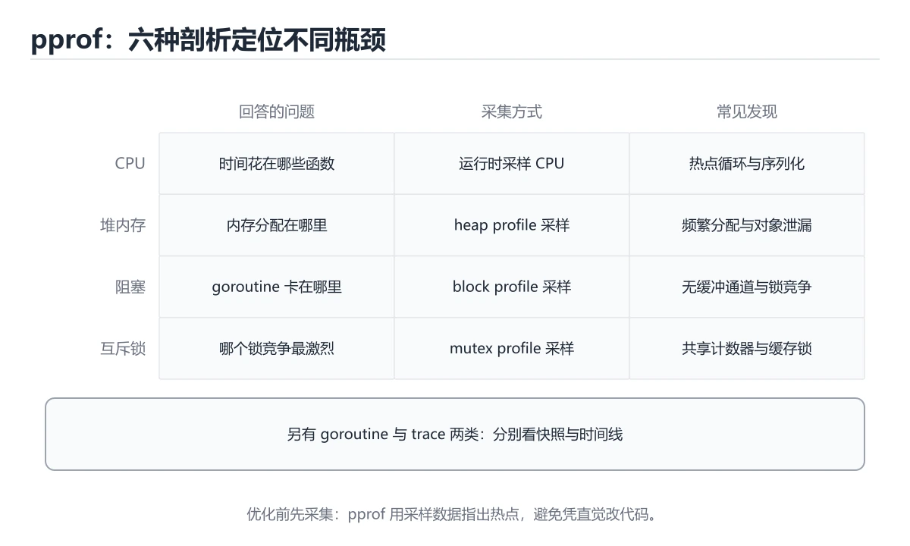
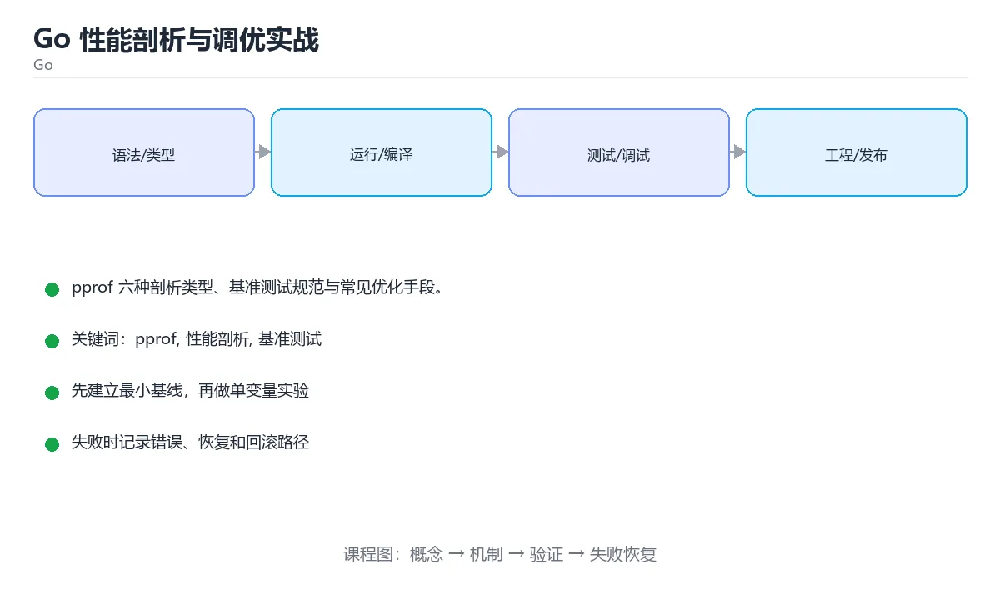

# Go 性能剖析与调优实战

> 内容更新时间：2026-10-06 · 学习阶段：进阶 · 预计用时：80 分钟





## 学习目标

- 能用自己的话解释Go 性能剖析与调优实战解决了什么问题，而不是只背术语。
- 能说清 「pprof」、「性能剖析」、「基准测试」、「benchstat」 之间的关系，并分别举出一个例子。
- 能把本课知识放回「Go」的知识体系，说明它和相邻主题的边界。
- 能完成本课练习，并用验收标准检查自己的结果。

> 一句话摘要：pprof 六种剖析类型、基准测试规范与常见优化手段。

## 前置知识

- 先完成上一课《Go 微服务与可观测》；如果已经掌握，可以直接用本课练习自测。
- 本课阶段：进阶。建议先掌握同一分类的基础课程，并能独立运行正文中的最小示例。
- 开始前先复习：pprof、性能剖析、基准测试。
- 如果某一步看不懂，先记录具体卡点，完成练习后再回头读一遍。

## 剖析类型速查

| 类型 | 采集方式 | 能回答的问题 |
| --- | --- | --- |
| CPU profile | 按频率采样调用栈 | 时间花在哪些函数 |
| Heap profile | 采样内存分配 | 谁在分配、谁在占用 |
| Goroutine profile | 抓取全部协程栈 | 是否泄漏、卡在哪里 |
| Block profile | 记录阻塞事件 | 锁与 channel 等待 |
| Mutex profile | 记录锁竞争 | 哪把锁最热 |
| Trace | 记录运行时事件 | 调度、GC、系统调用时间线 |

## 采集方式速查

```bash
# 基准测试采集
go test -run=^$ -bench=. -benchmem -cpuprofile=cpu.out -memprofile=mem.out ./...
go tool pprof -http=:8080 cpu.out

# 运行时采集（net/http/pprof，仅内网暴露）
go tool pprof http://localhost:6060/debug/pprof/profile?seconds=30
go tool pprof http://localhost:6060/debug/pprof/heap
go tool pprof http://localhost:6060/debug/pprof/goroutine

# 火焰图与版本对比
go tool pprof -top -cum cpu.out | head -20
go tool pprof -diff_base=old.out new.out
go test -bench=. -count=10 > new.txt && benchstat old.txt new.txt
```

```go
// 基准测试：报告内存分配并重置计时器，避免准备阶段污染数据
func BenchmarkParseConfig(b *testing.B) {
	raw := []byte(`{"name":"app","workers":8}`)
	b.ReportAllocs()
	b.ResetTimer()
	for i := 0; i < b.N; i++ {
		var cfg Config
		if err := json.Unmarshal(raw, &cfg); err != nil {
			b.Fatal(err)
		}
	}
}

// 用 sync.Pool 降低高频分配（仅用于可重建的临时对象）
var bufferPool = sync.Pool{New: func() any { return make([]byte, 0, 4096) }}

func encode(payload []byte) []byte {
	buf := bufferPool.Get().([]byte)
	defer bufferPool.Put(buf[:0])        // 归还前重置长度
	return append(buf, payload...)
}
```

## 常见优化手段速查

| 现象 | 手段 |
| --- | --- |
| 分配过多、GC 频繁 | 预分配容量、复用对象、减少接口装箱 |
| 字符串拼接耗时 | 用 `strings.Builder` 并预分配 |
| 切片扩容拷贝 | `make([]T, 0, n)` |
| 锁竞争 | 减小锁粒度、分片锁、原子操作 |
| 大量小 JSON | 流式解码或换更快的库 |
| 系统调用多 | 批量读写、`bufio` 缓冲 |
| goroutine 泄漏 | 检查 channel 阻塞与 context 取消 |
| 内存持续增长 | 看 heap profile 的 inuse_space |

## 常见错误与排查

| 容易踩的做法 | 实际现象 | 原因与正确做法 |
| --- | --- | --- |
| 不预热就直接压测 | 数据偏高 | 先跑几轮预热再采集 |
| 只看一次结果 | 噪声误导结论 | 多轮加 benchstat 对比 |
| 在生产公网暴露 pprof | 信息泄露与性能影响 | 只在内网或加鉴权 |
| 采样时间过短 | 热点没出现 | CPU 采样至少 30 秒 |
| 把 `sync.Pool` 当缓存用 | 对象随时消失，逻辑异常 | 只放可重建的临时对象 |
| 优化未测量的代码 | 复杂度上升但无收益 | 先 profile 再动手 |
| 只看 CPU 不看分配 | 漏掉 GC 压力 | 同时看 heap 与 alloc |
| 忽略 GC 指标 | 延迟抖动无法解释 | 观察 GC 停顿与内存上限 |

## 复习与自测

- [ ] 会用基准测试与 pprof 采集 CPU、内存、阻塞数据。
- [ ] 基准测试有预热、多次运行与 benchstat 对比。
- [ ] 能看懂 top、cum 与火焰图，定位真正热点。
- [ ] 会用预分配与对象复用降低 GC 压力。
- [ ] pprof 只在受控环境暴露。

## 零基础详解：pprof 性能剖析实战

### 一句话说清它是什么

pprof 是 Go 自带的性能剖析工具，能回答四个问题：
**CPU 花在哪、内存被谁占、goroutine 卡在哪、谁在等锁**。

### 用生活比喻理解

| Profile | 比喻 | 回答什么 |
| --- | --- | --- |
| CPU | 计时赛录像 | 时间花在哪些函数 |
| heap | 仓库盘点 | 谁占内存、谁在分配 |
| goroutine | 人员点名 | 有多少、卡在哪一行 |
| block | 堵车记录 | 谁在等锁或 channel |
| mutex | 锁竞争报告 | 哪把锁最抢手 |

### 三种采集方式

```go
// 方式一：HTTP 端点（最方便）
import (
    "net/http"
    _ "net/http/pprof"
)

go func() {
    // 只监听本机或内网，切勿暴露公网
    _ = http.ListenAndServe("127.0.0.1:6060", nil)
}()
```

```go
// 方式二：代码里手动采集（适合离线任务）
f, _ := os.Create("cpu.prof")
_ = pprof.StartCPUProfile(f)
defer pprof.StopCPUProfile()
doHeavyWork()

// 方式三：内存快照
f2, _ := os.Create("heap.prof")
defer f2.Close()
_ = pprof.WriteHeapProfile(f2)
```

### 分析命令

```bash
# 采集 30 秒 CPU 数据
go tool pprof http://127.0.0.1:6060/debug/pprof/profile?seconds=30

# 内存
go tool pprof http://127.0.0.1:6060/debug/pprof/heap

# goroutine（查泄漏最有用）
go tool pprof http://127.0.0.1:6060/debug/pprof/goroutine

# 进入交互界面后的常用命令
(pprof) top          # 按占用排序
(pprof) top -cum     # 按累计时间排序（找调用链上游）
(pprof) list 函数名  # 逐行显示耗时
(pprof) web          # 生成调用图（需要 graphviz）
```

### 看数据的两个要点

| 指标 | 含义 | 怎么用 |
| --- | --- | --- |
| `flat` | 函数自身消耗 | 找真正的热点 |
| `cum` | 含被调函数的累计 | 找调用链入口 |
| `alloc_objects` | 分配次数 | 找频繁小对象 |
| `inuse_space` | 当前占用 | 找内存大户 |

**技巧**：内存问题先看 `alloc_objects`（谁在频繁分配），再看 `inuse_space`（谁一直占着）。

### 四种常见的 pprof 结论与对策

| 现象 | 可能原因 | 对策 |
| --- | --- | --- |
| CPU 热点在 `runtime.mallocgc` | 分配太多 | 预分配、复用对象、`sync.Pool` |
| 热点在 `encoding/json` | 序列化频繁 | 换更快的库或减少字段 |
| goroutine 数持续增长 | 泄漏 | 检查退出条件与 context |
| block 里锁等待长 | 临界区太大 | 缩小加锁范围 |

### goroutine 泄漏排查四步

```text
1. 看曲线：goroutine 数是否随时间单调增长
2. 抓快照：go tool pprof .../goroutine
3. 看堆栈：top 与 list，找出共同的阻塞点
4. 回到代码：确认谁在等 channel、锁或网络，补上退出条件
```

常见泄漏原因：

| 原因 | 表现 |
| --- | --- |
| 向无人接收的 channel 发送 | 卡在 `chan send` |
| 等待永远不会关闭的 channel | 卡在 `chan receive` |
| 忘了取消 context | 卡在 `select` 或网络读 |
| 锁未释放 | 卡在 `sync.(*Mutex).Lock` |
| 无限起 goroutine | 数量持续增长 |

### 基准测试配合 pprof

```bash
# 跑基准并同时采集 CPU 与内存
go test -bench . -cpuprofile cpu.out -memprofile mem.out ./...

go tool pprof -top cpu.out
go tool pprof -alloc_objects -top mem.out
```

这样在本地就能复现并定位，不用上生产。

### 新手最容易踩的八个坑

| 坑 | 现象 | 正确做法 |
| --- | --- | --- |
| pprof 端点暴露公网 | 信息泄露、被滥用 | 只监听内网或加鉴权 |
| 采样时间太短 | 数据没有代表性 | 至少 30 秒或复现完整流程 |
| 只看 flat 不看 cum | 找不到调用链入口 | 两个都看 |
| 只采样一次就下结论 | 偶发噪声误导 | 多次采样对比 |
| 内存只看 inuse | 漏掉频繁小对象 | 同时看 alloc_objects |
| 忘了开 block/mutex 采样 | 采集不到等待数据 | `runtime.SetBlockProfileRate(1)` |
| 在生产直接 attach 长时间分析 | 影响线上性能 | 用低采样率或先灰度 |
| 改动后不复测 | 不知道是否真的变快 | 用同样的基准复测 |

### 手把手练习：定位一个内存热点

```go
var reportPool = sync.Pool{
    New: func() any { return new(bytes.Buffer) },
}

// 优化前：每次请求都新建 Buffer，alloc_objects 极高
func renderSlow(items []Item) string {
    buf := new(bytes.Buffer)
    for _, it := range items {
        fmt.Fprintf(buf, "%s=%d\n", it.Name, it.Value)
    }
    return buf.String()
}

// 优化后：从池里取，用完归还
func renderFast(items []Item) string {
    buf := reportPool.Get().(*bytes.Buffer)
    defer func() {
        buf.Reset()
        reportPool.Put(buf)
    }()
    for _, it := range items {
        fmt.Fprintf(buf, "%s=%d\n", it.Name, it.Value)
    }
    return buf.String()
}
```

配合 `go test -bench . -benchmem` 对比 `allocs/op` 是否下降。

### 学完自测

- [ ] 能说出四类 profile 各自回答什么问题。
- [ ] 知道 `flat` 与 `cum` 的区别。
- [ ] 能说出 goroutine 泄漏排查的四步。
- [ ] 知道内存问题为什么要同时看两个指标。
- [ ] 能说出 pprof 端点为什么不能暴露公网。

## 动手练习

> 本课练习重点：围绕「pprof、性能剖析、基准测试」完成复述、实验和交付，每个结果都要能被别人检查。

先写最小程序并用 go test 验证，再补 context、并发上限和错误传播。

### 练习 1：建立心智模型（10 分钟）

合上教程，用 3～5 句话回答：

1. Go 性能剖析与调优实战解决了什么问题？
2. 如果没有它，会出现什么具体后果？
3. 它和「性能剖析」是什么关系？

**验收标准**：至少出现一个本课关键词，并写出一个反例、边界条件或失效场景。

### 练习 2：做一次可控实验（20 分钟）

从正文中选一个最小示例，完成以下操作：

1. 先预测修改一个参数、输入或步骤后的结果。
2. 再实际执行或逐步推演，记录真实结果。
3. 如果结果与预测不同，写出差异原因。

**验收标准**：留下「原例 → 改动 → 预测 → 结果 → 原因」五步记录。

### 练习 3：交付一个小结果（30 分钟）

写一个可运行的小程序，并用 `go test` 或 `go vet` 验证结果。

任务要求：

- 结果必须能被别人检查，不能只写“我已经理解了”。
- 至少覆盖「pprof」和「性能剖析」两个关键词。
- 写出 1 个仍然不确定的问题，以及下一步如何验证。

> 提示：时间有限时优先做练习 1 和练习 2；练习 3 可以拆成两次完成。

## 本课小结

- 核心问题：Go 性能剖析与调优实战不是孤立术语，而是在「Go」中解决一类具体问题。
- 关键关系：先分清「pprof」与「性能剖析」的职责，再理解「基准测试」的适用边界。
- 判断标准：能解释正常场景、边界条件和失败场景，才算真正掌握。
- 下一步：完成练习后，用自己的话写下 3 条要点，再去做本课测验。

## 验证命令与预期输出

项目代码不能只看“能编译”，还要能按固定命令复现结果。下表给出最低验证集：

| 阶段 | 命令 | 预期输出 |
| --- | --- | --- |
| 格式化检查 | `gofmt -l .` | 没有文件需要格式化 |
| 静态检查 | `go vet ./...` | 没有 vet 报告 |
| 运行测试 | `go test ./... -count=1` | 所有包测试通过 |

### 验收证据

- [ ] 保存依赖安装和启动命令的完整输出。
- [ ] 至少运行 3 条测试，其中包含一条非法输入或失败路径。
- [ ] 重复执行同一操作两次，确认没有重复写入或副作用。
- [ ] 记录一次失败状态码、错误日志和恢复步骤。
- [ ] 在 README 中写明环境版本、启动方式和回滚方式。

### 回归与回滚

1. 先在一个可丢弃的目录或临时数据库执行，避免污染真实数据。
2. 修改一处逻辑后重跑全部验证命令，确认没有回归。
3. 若失败，回滚到上一个可运行版本并保留失败日志。
4. 定位原因后补一条自动化测试，再重新执行发布流程。
5. 把教训写入项目复盘或本课笔记，形成下一次的检查项。

## 可运行练习

### 任务 1：先跑通，再解释

```bash
# 采集 30 秒 CPU 数据
go tool pprof http://127.0.0.1:6060/debug/pprof/profile?seconds=30

# 内存
go tool pprof http://127.0.0.1:6060/debug/pprof/heap

# goroutine（查泄漏最有用）
go tool pprof http://127.0.0.1:6060/debug/pprof/goroutine

# 进入交互界面后的常用命令
(pprof) top          # 按占用排序
(pprof) top -cum     # 按累计时间排序（找调用链上游）
(pprof) list 函数名  # 逐行显示耗时
(pprof) web          # 生成调用图（需要 graphviz）
```

### 任务 2：只改一个条件

把「Go 性能剖析与调优实战」的最小示例复制一份，只改一个条件再跑一次：

- 改动点：只把pprof的输入换成空值、极值或错误输入，其余保持不变。
- 预测：先写下「Go 性能剖析与调优实战」在改动后的输出或错误信息，再运行。
- 记录：对照改动前后的结果，指出差异出在哪一步。
- 验收：换回原条件能复现原结果，改动只影响pprof。

### 任务 3：迁移到自己的数据

用同一套思路处理一组你自己的数据或场景，保持输出格式与任务 1 一致。

## 故障现场

### 现场 1：本课的 pprof 常规用例通过，但边界用例失败

**症状**：在本课的练习或生产场景里出现“本课的 pprof 常规用例通过，但边界用例失败”。

**复现**：准备一组最小输入，只保留触发“本课的 pprof 常规用例通过，但边界用例失败”的必要条件，连续运行两次确认结果稳定。

**定位**：围绕“pprof 的前置条件与取值边界没有写进代码，默认值掩盖了空值和极值”检查调用链、输入数据和环境配置，先验证假设再改代码。

**预防**：把“本课的 pprof 常规用例通过，但边界用例失败”写成一条自动化用例，并在本课的验收清单里保留对应检查项。

### 现场 2：本课的 性能剖析 结果在两次运行之间不一致

**症状**：在本课的练习或生产场景里出现“本课的 性能剖析 结果在两次运行之间不一致”。

**复现**：准备一组最小输入，只保留触发“本课的 性能剖析 结果在两次运行之间不一致”的必要条件，连续运行两次确认结果稳定。

**定位**：围绕“性能剖析 依赖了当前版本、执行顺序或共享状态，单次运行无法暴露差异”检查调用链、输入数据和环境配置，先验证假设再改代码。

**预防**：把“本课的 性能剖析 结果在两次运行之间不一致”写成一条自动化用例，并在本课的验收清单里保留对应检查项。

### 现场 3：本课的验证只在开发机通过

**症状**：在本课的练习或生产场景里出现“本课的验证只在开发机通过”。

**定位**：围绕“环境版本、配置和输入规模与目标环境不同，pprof 缺少可重复的验证记录”检查调用链、输入数据和环境配置，先验证假设再改代码。

## 版本与时效

- 升级前用 go vet、go test -race 与静态检查覆盖并发生命周期
- 模块校验、最小版本选择与供应链安全是生产升级的重点
- 官方发布说明：https://go.dev/doc/devel/release

### 升级检查清单

- 先固定当前版本，跑通全部示例与测验，再升级工具链。
- 只改一个版本变量，记录编译、测试、性能与产物体积的变化。
- 重点回归默认值、弃用警告、序列化格式、并发语义和错误信息。
- 升级完成后更新本课的“最后复核 / 下次复核”日期与版本说明。

## 本课复习清单

离开本课前，逐项确认：

- [ ] 不看解析，能说出「想知道「内存被谁占用」应该看哪种 profile？」的判断依据。
- [ ] 不看解析，能说出「写基准测试时，准备数据之后应该调用什么？」的判断依据。
- [ ] 不看解析，能说出「为什么生产环境的 pprof 端口不能暴露到公网？」的判断依据。
- [ ] 不看解析，能说出「关于 sync.Pool，正确的用法是？」的判断依据。
- [ ] 不看解析，能说出「对比优化前后的基准数据，推荐？」的判断依据。
- [ ] 不看解析，能说出的判断依据。
- [ ] 至少运行一次本课示例，记录输入、输出和一个边界情况。
- [ ] 把本课最容易混淆的两个概念写成一句话对照。

| 复盘项 | 记录 |
| --- | --- |
| 已经能独立解释的考点 |  |
| 仍然说不清的概念 |  |
| 下一步验证动作 |  |

## 术语速查

| 术语 | 一句话说明 |
| --- | --- |
| `strings.Builder` | \| 字符串拼接耗时 \| 用 `strings.Builder` 并预分配 \| |
| `make([]T, 0, n)` | \| 切片扩容拷贝 \| `make([]T, 0, n)` \| |
| `bufio` | \| 系统调用多 \| 批量读写、`bufio` 缓冲 \| |
| `sync.Pool` | \| 把 `sync.Pool` 当缓存用 \| 对象随时消失，逻辑异常 \| 只放可重建的临时对象 \| |
| `flat` | \| `flat` \| 函数自身消耗 \| 找真正的热点 \| |
| `cum` | \| `cum` \| 含被调函数的累计 \| 找调用链入口 \| |

## 考点精讲

### 考点 1：多选辨析·pprof

- **题目**：围绕“Go 性能剖析与调优实战”中的 pprof、性能剖析、基准测试，下列哪两项是本课强调的实践判断？
- **判断依据**：本课把Go 性能剖析与调优实战拆成概念、示例与故障现场三部分，因此判断 pprof 时必须同时交代输入、输出和失败路径，这使“学习 pprof 时要同时说明输入、输出和失败路径，不能只看正常流程”成立。在Go 性能剖析与调优实战里，判断 性能剖析 时要固定版本与边界输入，所以“验证 性能剖析 时要固定版本并覆盖边界输入，结论才可复现”才可复现。

### 考点 2：代码补全·pprof

- **题目**：下面这段代码摘自「Go 性能剖析与调优实战」的正文示例。关于这段代码，下面哪一项说法与实际内容相符？
- **判断依据**：题干的正确项是这段代码只做静态声明，没有循环、分支或可观察输出，在「Go 性能剖析与调优实战」里它只能证明pprof相关约束存在，不能替代真实运行证据。这段代码出自「Go 性能剖析与调优实战」的正文示例，围绕pprof、性能剖析、基准测试展开；把输入或边界换成空值、极值或失败情况后，结论要以「Go 性能剖析与调优实战」的实际运行结果为准。“下面这段代码摘自Go”与「Go 性能剖析与调优实战」的术语表相呼应，只有符合pprof、性能剖析、基准测试约束的“这段代码只做静态声明，没有循环”才是正文支持的结论。

### 考点 3：概念判断·pprof

- **题目**：为什么生产环境的 pprof 端口不能暴露到公网？
- **判断依据**：在「Go 性能剖析与调优实战」里，会泄露内部信息并可被用于性能攻击。pprof 能看到调用栈、函数名与大量运行时细节，属于敏感信息，且采集本身消耗资源。「Go 性能剖析与调优实战」要求先交代pprof、性能剖析、基准测试的前提再下结论，所以“会泄露内部信息并可被用于性能攻击”只在题干“为什么生产环境的 pprof 端口不能暴露到公网”给定的条件下成立。

### 考点 4：概念判断·pprof

- **题目**：关于 sync.Pool，正确的用法是？
- **判断依据**：在「Go 性能剖析与调优实战」里，结论应落在「只存放可随时重建的临时对象」。Pool 中的对象可能在任意 GC 时被清理，因此只能放可重建的临时缓冲。在「Go 性能剖析与调优实战」里，这道题要求区分概念与边界，「只存放可随时重建的临时对象」只有在题干给出的前提下才成立，而「用它替代数据库连接池」、「它保证对象不会被回收」缺少同一组条件。

### 考点 5：概念判断·pprof

- **题目**：对比优化前后的基准数据，推荐？
- **判断依据**：在「Go 性能剖析与调优实战」里，多次运行并用 benchstat 做统计对比。单次结果噪声大，benchstat 能给出统计意义上的差异与显著性。在「Go 性能剖析与调优实战」里判断这道题，要把pprof、性能剖析、基准测试的条件、过程与失败路径逐项对齐，换成“对比优化前后的基准数据”这个场景，只有满足前提的结论才成立。

### 考点 6：填空·b.____

- **题目**：补全代码：「Go 性能剖析与调优实战」示例中，下面这行代码缺少哪个关键字或函数名？请填入 ____。 `b.____`
- **判断依据**：在「Go 性能剖析与调优实战」里，ReportAllocs。在「Go 性能剖析与调优实战」里判断这道题，要把pprof、性能剖析、基准测试的条件、过程与失败路径逐项对齐，换成“补全代码”这个场景，只有满足前提的结论才成立。“性能剖析与调优实战示例中”与「Go 性能剖析与调优实战」的术语表相呼应，只有符合pprof、性能剖析、基准测试约束的“ReportAllocs”才是正文支持的结论。

## English Overview

**Title:** Profiling & Tuning in Go

**Summary:** pprof profiles, benchmarking and common optimizations.

**Category:** Go
**Level:** 进阶
**Key terms:** pprof, 性能剖析, 基准测试, benchstat, GC, 火焰图

## 内容元数据

- 内容版本：v2.0
- 最后更新：2026-10-06
- 学习阶段：进阶
- 适用环境：Go 1.24+
- 内容来源：内置结构化课程与工程实践整理
- 相关主题：pprof、性能剖析、基准测试、benchstat、GC、火焰图
- 质量版本：P0 测验标准 + P1 覆盖扩展 + P2 体验补全

## 项目专属规格：Go 性能剖析与调优实战

### 核心场景

pprof 六种剖析类型、基准测试规范与常见优化手段。 项目目标是把「pprof、性能剖析、基准测试、benchstat、GC、火焰图」落实为可运行、可测试、可回滚的交付物。

### 架构与数据流

```text
用户/输入 → 接口或命令 → 领域逻辑 → 存储/外部依赖 → 输出与监控
                         ↘ 失败分类 → 重试/补偿 → 回滚
```

### 最小数据模型

| 对象 | 关键字段 | 约束 |
| --- | --- | --- |
| 输入实体 | pprof、时间、来源 | 必填校验、长度限制、幂等键 |
| 任务实体 | 状态、优先级、创建时间 | 状态迁移合法、不可重复执行 |
| 结果实体 | 输出、错误码、耗时 | 可序列化、错误可解释 |
| 审计记录 | 操作者、动作、结果、时间 | 不可篡改、可查询、脱敏 |

### 验收场景

1. 正常路径：最小输入得到预期输出，并留下日志与指标。
2. 边界路径：空值、最大值、重复数据和超长内容得到明确处理。
3. 失败路径：依赖超时或不可用时能快速失败、重试或降级。
4. 幂等路径：同一请求执行两次不会产生重复副作用。
5. 回滚路径：回滚后数据一致，且能说明恢复时间和影响范围。

## 项目交付物

### 建议仓库结构

```text
cmd/app/
internal/domain/
internal/infra/
pkg/
go.mod
```

### 测试矩阵

| 层级 | 覆盖内容 | 最低数量 | 通过标准 |
| --- | --- | ---: | --- |
| 单元测试 | 领域规则、边界和错误分类 | 8 | 正常、边界、失败路径全部通过 |
| 集成测试 | 数据库、网络、文件或平台边界 | 3 | 使用真实边界且可重复运行 |
| 端到端测试 | 核心用户路径 | 1 | 从输入到输出完整跑通 |
| 手动验收 | 文档中列出的 5 个场景 | 5 | 有命令、输出和结论记录 |

### 验收数据

```json
{
  "project": "go_pprof",
  "input": {"case": "normal", "value": 5},
  "expected": {"ok": true, "result": 5},
  "failure_case": {"value": -1, "error": "validation_error"},
  "idempotency_key": "demo-001"
}
```

### 复盘模板

| 问题 | 记录 |
| --- | --- |
| 原目标是什么？ | 用一句话描述可验收目标 |
| 实际发生了什么？ | 时间线、指标和关键日志 |
| 哪个假设被推翻？ | 根因与促成因素 |
| 如何回滚？ | 步骤、耗时和数据校验 |
| 下一步做什么？ | 负责人、期限和验证方式 |

> 项目验收围绕「pprof、性能剖析、基准测试」：至少完成一次正常路径、一次边界输入、一次失败恢复和一次幂等检查。

## 参考资料与复核

- 最后复核：2026-10-04
- 下次复核：2027-04-04
- 复核范围：版本兼容、API 行为、安全建议与工程实践
- 来源性质：官方文档、标准或权威教材；正文为离线教学重组

| 参考资料 | 本课用途 |
| --- | --- |
| [Go pprof](https://pkg.go.dev/net/http/pprof) | 性能剖析与火焰图 |
| [Go 测试](https://go.dev/doc/tutorial/add-a-test) | 测试、基准与覆盖率 |
| [Go 标准库](https://pkg.go.dev/std) | 标准库 API |

> 「Go 性能剖析与调优实战」的链接用于离线阅读后的延伸核对；App 不会自动联网。
