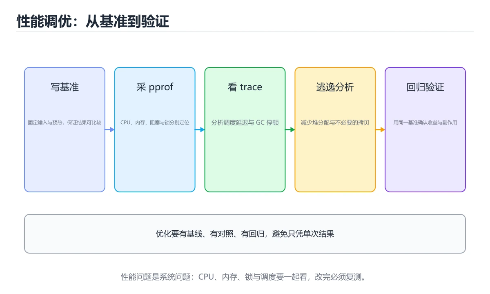

# Go 性能剖析与调优（进阶）

> 内容更新时间：2026-10-06 · 学习阶段：高级 · 预计用时：35 分钟




## 学习目标

- 能用自己的话解释：CPU profile 找热点，heap profile 找分配，block/mutex profile 找锁等待。
- 能用自己的话解释：trace 能观察调度、GC 和 goroutine 阻塞，适合解释延迟抖动。
- 能用自己的话解释：先建立稳定基准，再改变一个变量并用数据证明优化有效。
- 能把本课知识放回「Go」，并完成练习与测验。

## 前置知识

- 已完成「Go」的基础课程，能运行正文中的最小示例。
- 本课关键词：pprof、trace、基准测试、逃逸分析。
- 遇到不熟悉的术语先记录问题，完成练习后再回读。

## 核心知识

### 1. CPU profile 找热点，heap profile 找分配，block/mutex profile 找锁等待。

- 关键做法：先用最小示例建立基线，再逐步加入边界、失败和性能条件。
- 验证标准：结果可复现、错误可解释、边界有测试、失败能恢复。

### 2. trace 能观察调度、GC 和 goroutine 阻塞，适合解释延迟抖动。

把这条结论放回「Go 性能剖析与调优（进阶）」的完整流程里展开：

- 正文依据：能用自己的话解释：trace 能观察调度、GC 和 goroutine 阻塞，适合解释延迟抖动。
- 落地检查：把「2. trace 能观察调度、GC 和 goroutine 阻塞，适合解释延迟抖动。」改写成一条可执行的核对项，逐条验证输入、超时与失败路径。

### 3. 先建立稳定基准，再改变一个变量并用数据证明优化有效。

把这条结论放回「Go 性能剖析与调优（进阶）」的完整流程里展开：

- 正文依据：本课关键词：pprof、trace、基准测试、逃逸分析。
- 落地检查：把「3. 先建立稳定基准，再改变一个变量并用数据证明优化有效。」改写成一条可执行的核对项，逐条验证输入、超时与失败路径。

## 关键流程

```text
输入 → 校验 → 核心处理 → 验证 → 记录指标 → 失败恢复
```

## 实践路径

1. 用一句话复述本课要解决的问题。
2. 跑通正文中的最小示例并记录基线。
3. 只改变一个输入或参数，预测并验证结果。
4. 补一个失败路径，记录错误、恢复和指标。
5. 把结论写成可复现的笔记或测试。

## 常见误区

| 误区 | 后果 | 修正 |
| --- | --- | --- |
| 只记术语不做实验 | 遇到真实问题无法判断 | 用最小输入跑通并记录结果 |
| 只测正常路径 | 边界和故障上线才暴露 | 补空值、极值和依赖失败 |
| 没有基线就优化 | 无法证明改进有效 | 先测量再修改 |
| 忽略成本与安全 | 性能和风险失控 | 同时记录资源、权限与失败代价 |

## 动手练习

1. 合上教程，用 3～5 句话解释「Go 性能剖析与调优实战」。
2. 从正文选一个例子，改变一个条件并预测结果。
3. 设计一个失败场景，写出止损与恢复步骤。

**验收标准**：留下输入、命令、输出、差异和下一步问题。

## 本课小结

- 本课属于「Go」，核心关键词是 pprof、trace、基准测试、逃逸分析。
- 先保证正确与可复现，再讨论性能和扩展。
- 完成练习和测验后，把仍然不确定的问题写成下一轮验证清单。

> 本课由 P1 内容扩展生成，重点补充原有课程缺失的主题与工程边界。

## 验证命令与预期输出

项目代码不能只看“能编译”，还要能按固定命令复现结果。下表给出最低验证集：

| 阶段 | 命令 | 预期输出 |
| --- | --- | --- |
| 格式化检查 | `gofmt -l .` | 没有文件需要格式化 |
| 静态检查 | `go vet ./...` | 没有 vet 报告 |
| 运行测试 | `go test ./... -count=1` | 所有包测试通过 |

### 验收证据

- [ ] 保存依赖安装和启动命令的完整输出。
- [ ] 至少运行 3 条测试，其中包含一条非法输入或失败路径。
- [ ] 重复执行同一操作两次，确认没有重复写入或副作用。
- [ ] 记录一次失败状态码、错误日志和恢复步骤。
- [ ] 在 README 中写明环境版本、启动方式和回滚方式。

### 回归与回滚

1. 先在一个可丢弃的目录或临时数据库执行，避免污染真实数据。
2. 修改一处逻辑后重跑全部验证命令，确认没有回归。
3. 若失败，回滚到上一个可运行版本并保留失败日志。
4. 定位原因后补一条自动化测试，再重新执行发布流程。
5. 把教训写入项目复盘或本课笔记，形成下一次的检查项。

## 可运行练习

### 任务 1：先跑通，再解释

```json
{
  "project": "go_profiling_deep",
  "input": {"case": "normal", "value": 5},
  "expected": {"ok": true, "result": 5},
  "failure_case": {"value": -1, "error": "validation_error"},
  "idempotency_key": "demo-001"
}
```

### 任务 2：只改一个条件

把「Go 性能剖析与调优（进阶）」的最小示例复制一份，只改一个条件再跑一次：

- 改动点：只把pprof的输入换成空值、极值或错误输入，其余保持不变。
- 预测：先写下「Go 性能剖析与调优（进阶）」在改动后的输出或错误信息，再运行。
- 记录：对照改动前后的结果，指出差异出在哪一步。
- 验收：换回原条件能复现原结果，改动只影响pprof。

### 任务 3：迁移到自己的数据

用同一套思路处理一组你自己的数据或场景，保持输出格式与任务 1 一致。

## 故障现场

### 现场 1：本课的 pprof 常规用例通过，但边界用例失败

**症状**：在本课的练习或生产场景里出现“本课的 pprof 常规用例通过，但边界用例失败”。

**复现**：准备一组最小输入，只保留触发“本课的 pprof 常规用例通过，但边界用例失败”的必要条件，连续运行两次确认结果稳定。

**定位**：围绕“pprof 的前置条件与取值边界没有写进代码，默认值掩盖了空值和极值”检查调用链、输入数据和环境配置，先验证假设再改代码。

**预防**：把“本课的 pprof 常规用例通过，但边界用例失败”写成一条自动化用例，并在本课的验收清单里保留对应检查项。

### 现场 2：本课的 trace 结果在两次运行之间不一致

**症状**：在本课的练习或生产场景里出现“本课的 trace 结果在两次运行之间不一致”。

**复现**：准备一组最小输入，只保留触发“本课的 trace 结果在两次运行之间不一致”的必要条件，连续运行两次确认结果稳定。

**定位**：围绕“trace 依赖了当前版本、执行顺序或共享状态，单次运行无法暴露差异”检查调用链、输入数据和环境配置，先验证假设再改代码。

**预防**：把“本课的 trace 结果在两次运行之间不一致”写成一条自动化用例，并在本课的验收清单里保留对应检查项。

### 现场 3：本课的验证只在开发机通过

**症状**：在本课的练习或生产场景里出现“本课的验证只在开发机通过”。

**定位**：围绕“环境版本、配置和输入规模与目标环境不同，pprof 缺少可重复的验证记录”检查调用链、输入数据和环境配置，先验证假设再改代码。

## 版本与时效

- 升级前用 go vet、go test -race 与静态检查覆盖并发生命周期
- 模块校验、最小版本选择与供应链安全是生产升级的重点
- 官方发布说明：https://go.dev/doc/devel/release

### 升级检查清单

- 先固定当前版本，跑通全部示例与测验，再升级工具链。
- 只改一个版本变量，记录编译、测试、性能与产物体积的变化。
- 重点回归默认值、弃用警告、序列化格式、并发语义和错误信息。
- 升级完成后更新本课的“最后复核 / 下次复核”日期与版本说明。

## 本课复习清单

离开本课前，逐项确认：

- [ ] 不看解析，能说出「关于，下列说法正确的是？」的判断依据。
- [ ] 不看解析，能说出「「Go 性能剖析与调优实战」的核心学习目标是什么？」的判断依据。
- [ ] 不看解析，能说出「补全代码：「Go 性能剖析与调优实战」示例中，」的判断依据。
- [ ] 至少运行一次本课示例，记录输入、输出和一个边界情况。
- [ ] 把本课最容易混淆的两个概念写成一句话对照。

| 复盘项 | 记录 |
| --- | --- |
| 已经能独立解释的考点 |  |
| 仍然说不清的概念 |  |
| 下一步验证动作 |  |

## 术语速查

| 术语 | 本课语境 |
| --- | --- |
| `gofmt -l .` | \| 格式化检查 \| `gofmt -l .` \| 没有文件需要格式化 \| |
| `go vet ./...` | \| 静态检查 \| `go vet ./...` \| 没有 vet 报告 \| |
| `go test ./... -count=1` | \| 运行测试 \| `go test ./... -count=1` \| 所有包测试通过 \| |

## 零基础精讲：把「Go 性能剖析与调优实战」真正讲透

### 先建立一个直觉

把「Go 性能剖析与调优实战」看成一个有输入、处理、输出和失败边界的工程问题。先定义什么叫正确，再讨论性能和扩展。

本课的摘要可以当作一张地图：用 pprof、trace、基准和逃逸分析定位 CPU、内存、锁和调度问题。

### 逐步拆解

1. 澄清输入与目标。先写清「Go 性能剖析与调优（进阶）」要解决的问题、合法输入范围和成功标准，再进入后续步骤。
2. 描述处理过程。把「pprof、trace、基准测试、逃逸分析」映射到具体步骤，每步都要求能单独验证。
3. 定义输出。输出不仅包括正常结果，还包括错误码、日志、指标和资源释放状态。
4. 找出一条失败路径。让错误尽早暴露，并说明重试、降级、回滚或人工处理的边界。
5. 用一个小例子贯穿全过程。先手算或预测结果，再运行代码或实验，最后解释差异。

### 把正文串成一条执行链

- **1. CPU profile 找热点，heap profile 找分配，block/mutex profile 找锁等待。**：在「Go 性能剖析与调优（进阶）」里，「1. CPU profile 找热点，heap profile 找分配，block/mutex profile 找锁等待。」这一步要先写清输入与预期，再记录实际结果和差异；结果不符时回到对应小节核对前提。
- **2. trace 能观察调度、GC 和 goroutine 阻塞，适合解释延迟抖动。**：在「Go 性能剖析与调优（进阶）」里，「2. trace 能观察调度、GC 和 goroutine 阻塞，适合解释延迟抖动。」这一步要先写清输入与预期，再记录实际结果和差异；结果不符时回到对应小节核对前提。
- **3. 先建立稳定基准，再改变一个变量并用数据证明优化有效。**：在「Go 性能剖析与调优（进阶）」里，「3. 先建立稳定基准，再改变一个变量并用数据证明优化有效。」这一步要先写清输入与预期，再记录实际结果和差异；结果不符时回到对应小节核对前提。
- **验收证据**：- [ ] 保存依赖安装和启动命令的完整输出
- **回归与回滚**：1. 先在一个可丢弃的目录或临时数据库执行，避免污染真实数据
- **考点 1：关于，下列说法正确的是？**：针对「Go 性能剖析与调优（进阶）」，先自问「关于，下列说法正确的是」；作答后回到对应考点核对判断依据。

### 从测验反推易错点

**检查点 1：关于，下列说法正确的是？**

- 参考判断：CPU profile 找热点，heap profile 找分配
- 自问：如果去掉题干里的一个限定词，结论还成立吗？

**检查点 2：关于，下列说法正确的是？**

- 参考判断：trace 能观察调度，GC 和 goroutine 阻塞

**检查点 3：关于，下列说法正确的是？**

- 参考判断：先建立稳定基准，再改变一个变量并用数据证明优化有效。

**检查点 4：「Go 性能剖析与调优实战」的核心学习目标是什么？**

- 参考判断：用 pprof，trace，基准和逃逸分析定位 CPU，内存

- 参考判断：go_profiling_deep
- 解析：正确答案是「go_profiling_deep」，这道题在问补全代码：Go性能剖析与调优实战示例中，`"project":"____",`，判断时要把题干限定的输入、边界与目标逐项对齐。本课示例中还能看到 `"project": "go_profiling_deep",` 这样的用法，说明该关键字在本课代码中承担实际功能。

### 工程排错顺序

| 先查什么 | 要得到的证据 | 判断标准 |
| --- | --- | --- |
| 输入与前提是否满足 | 日志、输入样例、测试或指标 | 能复现并解释，才算定位 |
| 核心步骤是否产生了预期中间结果 | 日志、输入样例、测试或指标 | 能复现并解释，才算定位 |
| 失败路径是否可观测、可恢复 | 日志、输入样例、测试或指标 | 能复现并解释，才算定位 |
| 资源、权限与成本是否在预算内 | 日志、输入样例、测试或指标 | 能复现并解释，才算定位 |

### 变式训练

1. 把它放进一个只有单机、没有额外依赖的小项目，先保证正确，再考虑扩展。
2. 把输入规模扩大十倍，记录时间、内存和失败路径，找出第一个真正瓶颈。
3. 制造一次依赖超时或错误输入，要求系统给出可解释错误并且不留下半完成状态。
5. 删掉一个看似必要的步骤，观察哪个测试或指标先失败，用证据说明它为什么必要。
6. 把方案切换到低资源设备，重新评估默认参数、超时和降级策略。

### 本课自测

- [ ] 能用一句话解释「pprof」在本课中的角色与边界。
- [ ] 能举出一个正常例子和一个失败例子。
- [ ] 能说出最小验证步骤，以及需要记录的证据。
- [ ] 能用一句话解释「trace」在本课中的角色与边界。
- [ ] 能用一句话解释「基准测试」在本课中的角色与边界。
- [ ] 能用一句话解释「逃逸分析」在本课中的角色与边界。

### 迁移案例库

下面用不同约束重复同一套方法。每完成一轮，都把结论写进笔记，并只改变一个变量。

#### 迁移案例 1：围绕「pprof」做一次小实验

**目标**：在不改变课程主体的前提下，验证「Go 性能剖析与调优实战」中的一个关键判断。

**步骤**：
1. 复述当前方案对「pprof」的假设，写成一句可证伪的话。
2. 设计一个正常输入和一个边界输入，分别预测输出。
3. 运行或逐步演算，记录实际输出、耗时和失败信息。
4. 只调整一个参数，比较前后差异并解释原因。
5. 补充一条测试或复习卡，确保下次能更快复现。

**验收**：结论有证据、差异可解释、失败可恢复；如果做不到，说明还需要缩小问题范围。

#### 迁移案例 2：围绕「trace」做一次小实验

**步骤**：
1. 复述当前方案对「trace」的假设，写成一句可证伪的话。

#### 迁移案例 3：围绕「基准测试」做一次小实验

**步骤**：
1. 复述当前方案对「基准测试」的假设，写成一句可证伪的话。

#### 迁移案例 4：围绕「逃逸分析」做一次小实验

**步骤**：
1. 复述当前方案对「逃逸分析」的假设，写成一句可证伪的话。

#### 迁移案例 5：围绕「pprof」做一次小实验

**步骤**：

#### 迁移案例 6：围绕「trace」做一次小实验

**步骤**：

#### 迁移案例 7：围绕「基准测试」做一次小实验

**步骤**：

#### 迁移案例 8：围绕「逃逸分析」做一次小实验

**步骤**：

#### 迁移案例 9：围绕「pprof」做一次小实验

**步骤**：

#### 迁移案例 10：围绕「trace」做一次小实验

**步骤**：

#### 迁移案例 11：围绕「基准测试」做一次小实验

**步骤**：

#### 迁移案例 12：围绕「逃逸分析」做一次小实验

**步骤**：

#### 迁移案例 13：围绕「pprof」做一次小实验

**步骤**：

#### 迁移案例 14：围绕「trace」做一次小实验

**步骤**：

#### 迁移案例 15：围绕「基准测试」做一次小实验

**步骤**：

#### 迁移案例 16：围绕「逃逸分析」做一次小实验

**步骤**：

<!-- p0-depth-v2:end -->

## 考点精讲

### 考点 1：代码补全·pprof

- **题目**：这段 Go 代码是「Go 性能剖析与调优（进阶）」的示例片段，下面哪一项描述与它一致？
- **判断依据**：在「Go 性能剖析与调优（进阶）」里，这段代码会产生可观察的输出，运行后能看到结果。这段代码出自「Go 性能剖析与调优（进阶）」的正文示例，围绕pprof、trace、基准测试展开；把输入或边界换成空值、极值或失败情况后，结论要以「Go 性能剖析与调优（进阶）」的实际运行结果为准。

### 考点 2：概念判断·pprof

- **题目**：关于「trace 能观察调度，GC 和 goroutine 阻塞」，下列说法正确的是？
- **判断依据**：在「Go 性能剖析与调优（进阶）」里，trace 能观察调度，GC 和 goroutine 阻塞。「Go 性能剖析与调优（进阶）」要求先交代pprof、trace、基准测试的前提再下结论，所以“trace 能观察调度”只在题干“trace 能观察调度”给定的条件下成立。把“trace 能观察调度”代回「Go 性能剖析与调优（进阶）」里“trace 能观察调度”的例子核对，条件一旦改变，结论就要用pprof、trace、基准测试重新推导。

### 考点 3：多选辨析·pprof

- **题目**：围绕“Go 性能剖析与调优（进阶）”中的 pprof、trace、基准测试，下列哪两项是本课强调的实践判断？
- **判断依据**：本课把Go 性能剖析与调优（进阶）拆成概念、示例与故障现场三部分，因此判断 pprof 时必须同时交代输入、输出和失败路径，这使“学习 pprof 时要同时说明输入、输出和失败路径，不能只看正常流程”成立。在Go 性能剖析与调优（进阶）里，判断 trace 时要固定版本与边界输入，所以“验证 trace 时要固定版本并覆盖边界输入，结论才可复现”才可复现。

### 考点 4：概念判断·Go 性能剖析与调优实战

- **题目**：「Go 性能剖析与调优实战」的核心学习目标是什么？
- **判断依据**：在「Go 性能剖析与调优（进阶）」里，这道题要求区分概念与边界，用 pprof，trace，基准和逃逸分析定位 CPU，内存只有在题干给出的前提下才成立，而理解类型参数、约束、类型集合和泛型性能。在「Go 性能剖析与调优（进阶）」里，覆盖 mTLS、令牌、超时、限流、优雅关闭和安全配置。

### 考点 5：填空·"project": "____",

- **题目**：补全代码：「Go 性能剖析与调优实战」示例中，下面这行代码缺少哪个关键字或函数名？请填入 ____。 `"project": "____",`
- **判断依据**：空格应填写「go_profiling_deep」。「Go 性能剖析与调优（进阶）」要求先交代pprof、trace、基准测试的前提再下结论，所以“goprofilingdeep”只在题干“Go 性能剖析与调优实战示例中”给定的条件下成立。把“goprofilingdeep”代回「Go 性能剖析与调优（进阶）」里“Go 性能剖析与调优实战示例中”的例子核对，条件一旦改变，结论就要用pprof、trace、基准测试重新推导。

### 考点 6：顺序排列·Go 性能剖析与调优实战

- **题目**：按照「Go 性能剖析与调优实战」从概念到实践的讲解顺序排列下列主题。
- **判断依据**：结合pprof、trace来看，正确的执行顺序是「核心知识 → 关键流程 → 实践路径 → 常见误区」。在「Go 性能剖析与调优实战」中，正确顺序是：1. 核心知识 → 2. 关键流程 → 3. 实践路径 → 4. 常见误区。「Go 性能剖析与调优实战」先建立概念，再解释运行机制，随后进入代码与工程实践，最后处理失败路径。

## English Overview

**Title:** Go Profiling and Tuning in Practice

**Summary:** Use pprof, trace, benchmarks and escape analysis to find bottlenecks.

**Category:** Go
**Level:** 高级
**Key terms:** pprof, trace, 基准测试, 逃逸分析

## 内容元数据

- 内容版本：v2.0
- 最后更新：2026-10-06
- 学习阶段：高级
- 适用环境：Go 1.24+
- 内容来源：内置结构化课程与工程实践整理
- 相关主题：pprof、trace、基准测试、逃逸分析
- 质量版本：P0 测验标准 + P1 覆盖扩展 + P2 体验补全

## 项目专属规格：Go 性能剖析与调优实战

### 核心场景

用 pprof、trace、基准和逃逸分析定位 CPU、内存、锁和调度问题。 项目目标是把「pprof、trace、基准测试、逃逸分析」落实为可运行、可测试、可回滚的交付物。

### 架构与数据流

```text
用户/输入 → 接口或命令 → 领域逻辑 → 存储/外部依赖 → 输出与监控
                         ↘ 失败分类 → 重试/补偿 → 回滚
```

### 最小数据模型

| 对象 | 关键字段 | 约束 |
| --- | --- | --- |
| 输入实体 | pprof、时间、来源 | 必填校验、长度限制、幂等键 |
| 任务实体 | 状态、优先级、创建时间 | 状态迁移合法、不可重复执行 |
| 结果实体 | 输出、错误码、耗时 | 可序列化、错误可解释 |
| 审计记录 | 操作者、动作、结果、时间 | 不可篡改、可查询、脱敏 |

### 验收场景

1. 正常路径：最小输入得到预期输出，并留下日志与指标。
2. 边界路径：空值、最大值、重复数据和超长内容得到明确处理。
3. 失败路径：依赖超时或不可用时能快速失败、重试或降级。
4. 幂等路径：同一请求执行两次不会产生重复副作用。
5. 回滚路径：回滚后数据一致，且能说明恢复时间和影响范围。

## 最小可运行示例

下面示例用于验证「Go 性能剖析与调优实战」的最小输入、处理和输出。先原样运行，再只修改一个值：

```go
package main

import (
	"fmt"
	"testing"
)

func BenchmarkConcat(b *testing.B) {
	for i := 0; i < b.N; i++ {
		_ = fmt.Sprint("a", "b")
	}
}

func main() {
	result := testing.Benchmark(BenchmarkConcat)
	fmt.Println("rounds>0:", result.N > 0)
}
```

## 预期输出

```text
rounds>0: true
```

## 验证步骤

1. 记录运行环境、命令和真实输出。
2. 修改一个输入，先写预测再运行。
3. 制造一次错误输入，记录错误信息与修复方式。
4. 把结论写回本课笔记或测试用例。

## 项目交付物

### 建议仓库结构

```text
cmd/app/
internal/domain/
internal/infra/
pkg/
go.mod
```

### 测试矩阵

| 层级 | 覆盖内容 | 最低数量 | 通过标准 |
| --- | --- | ---: | --- |
| 单元测试 | 领域规则、边界和错误分类 | 8 | 正常、边界、失败路径全部通过 |
| 集成测试 | 数据库、网络、文件或平台边界 | 3 | 使用真实边界且可重复运行 |
| 端到端测试 | 核心用户路径 | 1 | 从输入到输出完整跑通 |
| 手动验收 | 文档中列出的 5 个场景 | 5 | 有命令、输出和结论记录 |

### 验收数据

```json
{
  "project": "go_profiling_deep",
  "input": {"case": "normal", "value": 5},
  "expected": {"ok": true, "result": 5},
  "failure_case": {"value": -1, "error": "validation_error"},
  "idempotency_key": "demo-001"
}
```

### 复盘模板

| 问题 | 记录 |
| --- | --- |
| 原目标是什么？ | 用一句话描述可验收目标 |
| 实际发生了什么？ | 时间线、指标和关键日志 |
| 哪个假设被推翻？ | 根因与促成因素 |
| 如何回滚？ | 步骤、耗时和数据校验 |
| 下一步做什么？ | 负责人、期限和验证方式 |

> 项目验收围绕「pprof、trace、基准测试」：至少完成一次正常路径、一次边界输入、一次失败恢复和一次幂等检查。

## 参考资料与复核

- 最后复核：2026-10-04
- 下次复核：2027-04-04
- 复核范围：版本兼容、API 行为、安全建议与工程实践
- 来源性质：官方文档、标准或权威教材；正文为离线教学重组

| 参考资料 | 本课用途 |
| --- | --- |
| [Go pprof](https://pkg.go.dev/net/http/pprof) | 性能剖析与火焰图 |
| [Effective Go](https://go.dev/doc/effective_go) | 惯用写法与接口设计 |
| [Go Modules](https://go.dev/doc/modules/) | 模块、版本与依赖 |

> 「Go 性能剖析与调优（进阶）」的链接用于离线阅读后的延伸核对；App 不会自动联网。
