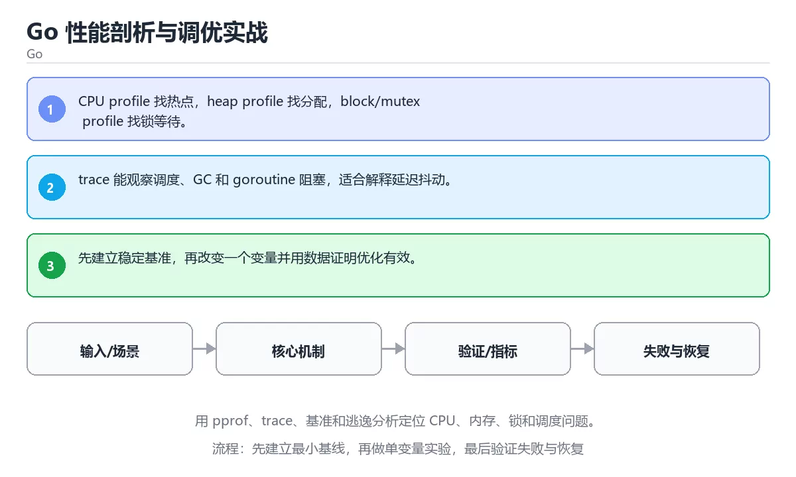

# Go 性能剖析与调优实战



> 内容更新时间：2026-10-03 · 学习阶段：高级 · 预计用时：25 分钟

## 学习目标

- 能用自己的话解释：CPU profile 找热点，heap profile 找分配，block/mutex profile 找锁等待。
- 能用自己的话解释：trace 能观察调度、GC 和 goroutine 阻塞，适合解释延迟抖动。
- 能用自己的话解释：先建立稳定基准，再改变一个变量并用数据证明优化有效。
- 能把本课知识放回「Go」，并完成练习与测验。

## 前置知识

- 已完成「Go」的基础课程，能运行正文中的最小示例。
- 本课关键词：pprof、trace、基准测试、逃逸分析。
- 遇到不熟悉的术语先记录问题，完成练习后再回读。

## 核心知识

### 1. CPU profile 找热点，heap profile 找分配，block/mutex profile 找锁等待。

- 它解决的问题：把「CPU profile 找热点，heap profile 找分配，block/mutex profile 找锁等待。」放回真实场景，说明不做它会带来什么后果。
- 关键做法：先用最小示例建立基线，再逐步加入边界、失败和性能条件。
- 验证标准：结果可复现、错误可解释、边界有测试、失败能恢复。

### 2. trace 能观察调度、GC 和 goroutine 阻塞，适合解释延迟抖动。

- 它解决的问题：把「trace 能观察调度、GC 和 goroutine 阻塞，适合解释延迟抖动。」放回真实场景，说明不做它会带来什么后果。
- 关键做法：先用最小示例建立基线，再逐步加入边界、失败和性能条件。
- 验证标准：结果可复现、错误可解释、边界有测试、失败能恢复。

### 3. 先建立稳定基准，再改变一个变量并用数据证明优化有效。

- 它解决的问题：把「先建立稳定基准，再改变一个变量并用数据证明优化有效。」放回真实场景，说明不做它会带来什么后果。
- 关键做法：先用最小示例建立基线，再逐步加入边界、失败和性能条件。
- 验证标准：结果可复现、错误可解释、边界有测试、失败能恢复。

## 关键流程

```text
输入 → 校验 → 核心处理 → 验证 → 记录指标 → 失败恢复
```

## 实践路径

1. 用一句话复述本课要解决的问题。
2. 跑通正文中的最小示例并记录基线。
3. 只改变一个输入或参数，预测并验证结果。
4. 补一个失败路径，记录错误、恢复和指标。
5. 把结论写成可复现的笔记或测试。

## 常见误区

| 误区 | 后果 | 修正 |
| --- | --- | --- |
| 只记术语不做实验 | 遇到真实问题无法判断 | 用最小输入跑通并记录结果 |
| 只测正常路径 | 边界和故障上线才暴露 | 补空值、极值和依赖失败 |
| 没有基线就优化 | 无法证明改进有效 | 先测量再修改 |
| 忽略成本与安全 | 性能和风险失控 | 同时记录资源、权限与失败代价 |

## 动手练习

1. 合上教程，用 3～5 句话解释「Go 性能剖析与调优实战」。
2. 从正文选一个例子，改变一个条件并预测结果。
3. 设计一个失败场景，写出止损与恢复步骤。

**验收标准**：留下输入、命令、输出、差异和下一步问题。

## 本课小结

- 本课属于「Go」，核心关键词是 pprof、trace、基准测试、逃逸分析。
- 先保证正确与可复现，再讨论性能和扩展。
- 完成练习和测验后，把仍然不确定的问题写成下一轮验证清单。

> 本课由 P1 内容扩展生成，重点补充原有课程缺失的主题与工程边界。

<!-- project-verification:v1 -->

## 验证命令与预期输出

项目代码不能只看“能编译”，还要能按固定命令复现结果。下表给出最低验证集：

| 阶段 | 命令 | 预期输出 |
| --- | --- | --- |
| 格式化检查 | `gofmt -l .` | 没有文件需要格式化 |
| 静态检查 | `go vet ./...` | 没有 vet 报告 |
| 运行测试 | `go test ./... -count=1` | 所有包测试通过 |

### 验收证据

- [ ] 保存依赖安装和启动命令的完整输出。
- [ ] 至少运行 3 条测试，其中包含一条非法输入或失败路径。
- [ ] 重复执行同一操作两次，确认没有重复写入或副作用。
- [ ] 记录一次失败状态码、错误日志和恢复步骤。
- [ ] 在 README 中写明环境版本、启动方式和回滚方式。

### 回归与回滚

1. 先在一个可丢弃的目录或临时数据库执行，避免污染真实数据。
2. 修改一处逻辑后重跑全部验证命令，确认没有回归。
3. 若失败，回滚到上一个可运行版本并保留失败日志。
4. 定位原因后补一条自动化测试，再重新执行发布流程。
5. 把教训写入项目复盘或本课笔记，形成下一次的检查项。

<!-- p2-enrichment:v1 -->

## English Overview

**Title:** Go Profiling and Tuning in Practice

**Summary:** Use pprof, trace, benchmarks and escape analysis to find bottlenecks.

**Category:** Go  
**Level:** 高级  
**Key terms:** pprof, trace, 基准测试, 逃逸分析

> The full tutorial is written in Chinese. This bilingual overview helps English readers identify the topic, scope and key terms before studying the detailed examples.

## 内容元数据

- 内容版本：v2.0
- 最后更新：2026-10-03
- 学习阶段：高级
- 适用环境：Go 1.24+
- 内容来源：内置结构化课程与工程实践整理
- 相关主题：pprof、trace、基准测试、逃逸分析
- 质量版本：P0 测验标准 + P1 覆盖扩展 + P2 体验补全

## 项目专属规格：Go 性能剖析与调优实战

### 核心场景

用 pprof、trace、基准和逃逸分析定位 CPU、内存、锁和调度问题。 项目目标是把「pprof、trace、基准测试、逃逸分析」落实为可运行、可测试、可回滚的交付物。

### 架构与数据流

```text
用户/输入 → 接口或命令 → 领域逻辑 → 存储/外部依赖 → 输出与监控
                         ↘ 失败分类 → 重试/补偿 → 回滚
```

### 最小数据模型

| 对象 | 关键字段 | 约束 |
| --- | --- | --- |
| 输入实体 | pprof、时间、来源 | 必填校验、长度限制、幂等键 |
| 任务实体 | 状态、优先级、创建时间 | 状态迁移合法、不可重复执行 |
| 结果实体 | 输出、错误码、耗时 | 可序列化、错误可解释 |
| 审计记录 | 操作者、动作、结果、时间 | 不可篡改、可查询、脱敏 |

### 验收场景

1. 正常路径：最小输入得到预期输出，并留下日志与指标。
2. 边界路径：空值、最大值、重复数据和超长内容得到明确处理。
3. 失败路径：依赖超时或不可用时能快速失败、重试或降级。
4. 幂等路径：同一请求执行两次不会产生重复副作用。
5. 回滚路径：回滚后数据一致，且能说明恢复时间和影响范围。

<!-- minimal-code:v1 -->

## 最小可运行示例

下面示例用于验证「Go 性能剖析与调优实战」的最小输入、处理和输出。先原样运行，再只修改一个值：

```python
print(bin(10), hex(255), 0b1010)
```

## 预期输出

```text
0b1010 0xff 10
```

## 验证步骤

1. 记录运行环境、命令和真实输出。
2. 修改一个输入，先写预测再运行。
3. 制造一次错误输入，记录错误信息与修复方式。
4. 把结论写回本课笔记或测试用例。

<!-- project-delivery:v1 -->

## 项目交付物

### 建议仓库结构

```text
cmd/app/
internal/domain/
internal/infra/
pkg/
go.mod
```

### 测试矩阵

| 层级 | 覆盖内容 | 最低数量 | 通过标准 |
| --- | --- | ---: | --- |
| 单元测试 | 领域规则、边界和错误分类 | 8 | 正常、边界、失败路径全部通过 |
| 集成测试 | 数据库、网络、文件或平台边界 | 3 | 使用真实边界且可重复运行 |
| 端到端测试 | 核心用户路径 | 1 | 从输入到输出完整跑通 |
| 手动验收 | 文档中列出的 5 个场景 | 5 | 有命令、输出和结论记录 |

### 验收数据

```json
{
  "project": "go_profiling_deep",
  "input": {"case": "normal", "value": 5},
  "expected": {"ok": true, "result": 5},
  "failure_case": {"value": -1, "error": "validation_error"},
  "idempotency_key": "demo-001"
}
```

### 复盘模板

| 问题 | 记录 |
| --- | --- |
| 原目标是什么？ | 用一句话描述可验收目标 |
| 实际发生了什么？ | 时间线、指标和关键日志 |
| 哪个假设被推翻？ | 根因与促成因素 |
| 如何回滚？ | 步骤、耗时和数据校验 |
| 下一步做什么？ | 负责人、期限和验证方式 |

> 项目验收围绕「pprof、trace、基准测试」：至少完成一次正常路径、一次边界输入、一次失败恢复和一次幂等检查。

<!-- top50-rewrite:v1 -->

## 课程专属精读：Go 性能剖析与调优实战

### 一、知识地图

- **1. CPU profile 找热点，heap profile 找分配，block/mutex profile 找锁等待。**：理解它的定义、输入、输出和失败边界。
- **2. trace 能观察调度、GC 和 goroutine 阻塞，适合解释延迟抖动。**：理解它的定义、输入、输出和失败边界。
- **3. 先建立稳定基准，再改变一个变量并用数据证明优化有效。**：理解它的定义、输入、输出和失败边界。
- **适用边界**：说明「Go 性能剖析与调优实战」在哪些输入、规模和环境下适用，什么时候应该换方案。
- **常见错误**：记录一个最容易犯的错误、错误信息和修复方式。
- **测试与验证**：用正常、边界、失败和恢复四类路径验证结果。

### 二、机制与验证

| 主题 | 需要回答的问题 | 验证方式 |
| --- | --- | --- |
| 1. CPU profile 找热点，heap profile 找分配，block/mutex profile 找锁等待。 | 它解决什么问题，输入和输出是什么？ | 最小示例、边界输入、日志或指标 |
| 2. trace 能观察调度、GC 和 goroutine 阻塞，适合解释延迟抖动。 | 它解决什么问题，输入和输出是什么？ | 最小示例、边界输入、日志或指标 |
| 3. 先建立稳定基准，再改变一个变量并用数据证明优化有效。 | 它解决什么问题，输入和输出是什么？ | 最小示例、边界输入、日志或指标 |
| 适用边界 | 它解决什么问题，输入和输出是什么？ | 最小示例、边界输入、日志或指标 |
| 常见错误 | 它解决什么问题，输入和输出是什么？ | 最小示例、边界输入、日志或指标 |
| 测试与验证 | 它解决什么问题，输入和输出是什么？ | 最小示例、边界输入、日志或指标 |

### 三、专属检查问题

1. 1. CPU profile 找热点，heap profile 找分配，block/mutex profile 找锁等待。 与相邻主题的边界是什么？
2. 2. trace 能观察调度、GC 和 goroutine 阻塞，适合解释延迟抖动。 与相邻主题的边界是什么？
3. 3. 先建立稳定基准，再改变一个变量并用数据证明优化有效。 与相邻主题的边界是什么？
4. 适用边界 与相邻主题的边界是什么？
5. 常见错误 与相邻主题的边界是什么？
6. 测试与验证 与相邻主题的边界是什么？

### 四、故障排查

1. 固定输入和环境，确认问题能复现。
2. 找到第一个异常状态，不从最终错误倒猜。
3. 只改变一个变量，记录预测和真实结果。
4. 修复后补边界、失败和重复执行测试。

## 专属复习题库

**问：1. CPU profile 找热点，heap profile 找分配，block/mutex profile 找锁等待。 的关键点是什么？**

答：理解它的定义、输入、输出和失败边界。 复习时要能用自己的话复述，并给出一个失败场景。

**问：2. trace 能观察调度、GC 和 goroutine 阻塞，适合解释延迟抖动。 的关键点是什么？**

答：理解它的定义、输入、输出和失败边界。 复习时要能用自己的话复述，并给出一个失败场景。

**问：3. 先建立稳定基准，再改变一个变量并用数据证明优化有效。 的关键点是什么？**

答：理解它的定义、输入、输出和失败边界。 复习时要能用自己的话复述，并给出一个失败场景。

**问：适用边界 的关键点是什么？**

答：说明「Go 性能剖析与调优实战」在哪些输入、规模和环境下适用，什么时候应该换方案。 复习时要能用自己的话复述，并给出一个失败场景。

**问：常见错误 的关键点是什么？**

答：记录一个最容易犯的错误、错误信息和修复方式。 复习时要能用自己的话复述，并给出一个失败场景。

**问：测试与验证 的关键点是什么？**

答：用正常、边界、失败和恢复四类路径验证结果。 复习时要能用自己的话复述，并给出一个失败场景。

<!-- p2-references:v1 -->

## 参考资料与复核

- 最后复核：2026-10-04
- 下次复核：2027-04-04
- 复核范围：版本兼容、API 行为、安全建议与工程实践
- 来源性质：官方文档与标准；本课正文为离线教学重组，不复制原文

| 参考资料 | 本课用途 |
| --- | --- |
| [Go 官方文档](https://go.dev/doc/) | 语言、并发与工具链 |
| [Go 标准库](https://pkg.go.dev/std) | 标准库 API |

> 本课主题：用 pprof、trace、基准和逃逸分析定位 CPU、内存、锁和调度问题。

> App 完全离线展示文字链接，不会自动联网；需要延伸阅读时可复制链接到浏览器。

