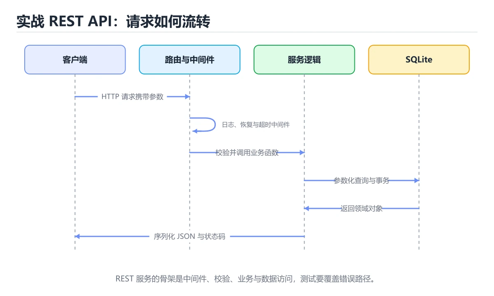
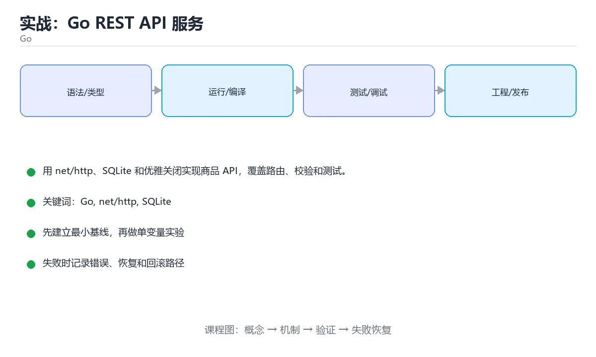

# 实战：Go REST API 服务





> 内容更新时间：2026-10-06 · 学习阶段：高级 · 预计用时：120 分钟

## 学习目标

- 能用标准库组织 handler、service 和 repository。
- 能实现超时、日志和优雅关闭。
- 能用 httptest 覆盖接口行为。

## 前置知识

- 已完成本分类的基础与进阶课程，能独立运行正文中的最小示例。
- 熟悉命令行、依赖管理、测试和 Git 基本操作。
- 本课涉及：Go、net/http、SQLite、优雅关闭、测试。

## 项目背景

一个商品服务需要支持创建、查询、更新和删除，使用标准库优先，二进制可直接部署，并在收到终止信号时优雅关闭。

一句话摘要：用 net/http、SQLite 和优雅关闭实现商品 API，覆盖路由、校验和测试。

## 技术栈

- Go 1.24
- net/http
- database/sql
- SQLite
- testing

## 架构与数据流

```text
输入 → 参数校验 → 业务处理 → 持久化/外部调用 → 结果输出 → 指标与日志
                 ↘ 失败分类 → 重试/回滚 → 错误响应
```

- 读路径要明确查询条件、分页方式和返回字段，避免一次加载全部数据。
- 写路径要明确事务边界、幂等键和失败补偿，不能留下半完成状态。
- 外部调用要设置超时、重试上限和降级策略。
- 每个关键阶段都要留下日志、指标或测试证据。

## 功能范围

- [ ] 商品 CRUD
- [ ] 分页查询
- [ ] 健康检查
- [ ] 请求超时与优雅关闭

## 示例数据与边界

| 场景 | 输入 | 期望结果 | 检查点 |
| --- | --- | --- | --- |
| 正常路径 | 合法的最小数据集 | 成功返回并写入正确数据 | 状态码、数据库记录、日志 |
| 边界值 | 最大值、最小值或空集合 | 明确成功或给出可理解错误 | 不崩溃、不越界、不写半条数据 |
| 非法输入 | 类型错误、缺字段、超长内容 | 返回校验错误并指出字段 | 错误结构统一且不泄露内部信息 |
| 依赖失败 | 数据库不可用、超时、网络抖动 | 重试、降级或快速失败 | 可恢复、可观测、无重复副作用 |

## 实施步骤

### 步骤 1：定义领域模型和错误

- 输入与产出：先写清本步依赖的配置、数据和最终产物，再开始编码。
- 验证方法：用最小请求、最小数据集或单元测试证明本步结果正确。
- 失败处理：记录错误类型、回滚动作和重试条件，避免把问题带到下一步。
- 证据留存：保留命令、输出、日志或截图，方便评审与复盘。

### 步骤 2：实现 SQLite 仓储

「实战：Go REST API 服务」的「步骤 2：实现 SQLite 仓储」一节补全如下：

- 定位：这一节说明步骤 2：实现 SQLite 仓储在「实战：Go REST API 服务」知识体系里的位置。
- 要点：熟悉命令行、依赖管理、测试和 Git 基本操作。
- 自检：能否用一个最小例子解释步骤 2：实现 SQLite 仓储？

### 步骤 3：编写 HTTP handler 与中间件

把这条结论放回「实战：Go REST API 服务」的完整流程里展开：

- 正文依据：本课涉及：Go、net/http、SQLite、优雅关闭、测试。
- 落地检查：把「步骤 3：编写 HTTP handler 与中间件」改写成一条可执行的核对项，逐条验证输入、超时与失败路径。

### 步骤 4：加入请求超时和结构化日志

「实战：Go REST API 服务」的「步骤 4：加入请求超时和结构化日志」一节补全如下：

- 定位：这一节说明步骤 4：加入请求超时和结构化日志在「实战：Go REST API 服务」知识体系里的位置。
- 要点：一个商品服务需要支持创建、查询、更新和删除，使用标准库优先，二进制可直接部署，并在收到终止信号时优雅关闭。
- 自检：能否用一个最小例子解释步骤 4：加入请求超时和结构化日志？

### 步骤 5：实现信号监听和优雅关闭

「实战：Go REST API 服务」的「步骤 5：实现信号监听和优雅关闭」一节补全如下：

- 定位：这一节说明步骤 5：实现信号监听和优雅关闭在「实战：Go REST API 服务」知识体系里的位置。
- 要点：一句话摘要：用 net/http、SQLite 和优雅关闭实现商品 API，覆盖路由、校验和测试。
- 自检：能否用一个最小例子解释步骤 5：实现信号监听和优雅关闭？

### 步骤 6：用 httptest 和基准测试验收

「实战：Go REST API 服务」的「步骤 6：用 httptest 和基准测试验收」一节补全如下：

- 定位：这一节说明步骤 6：用 httptest 和基准测试验收在「实战：Go REST API 服务」知识体系里的位置。
- 要点：验证方法：用最小请求、最小数据集或单元测试证明本步结果正确。
- 自检：能否用一个最小例子解释步骤 6：用 httptest 和基准测试验收？

## 关键代码

```go
func main() {
  mux := http.NewServeMux()
  mux.HandleFunc("GET /health", func(w http.ResponseWriter, r *http.Request) {
    w.Header().Set("Content-Type", "application/json")
    w.Write([]byte(`{"status":"ok"}`))
  })
  server := &http.Server{Addr: ":8080", Handler: mux, ReadHeaderTimeout: 2 * time.Second}
  log.Fatal(server.ListenAndServe())
}
```

## 验证命令与预期输出

```text
1. 安装依赖并启动项目
2. 执行至少 3 条自动化测试，其中包含 1 条失败路径
3. 用正常请求验证成功响应
4. 用非法输入验证错误响应
5. 重复执行一次，确认没有重复写入或副作用
```

## 建议目录结构

```text
src/
  entry/        启动与配置
  domain/       业务模型与规则
  service/      用例编排
  infra/        数据库、HTTP、消息等适配器
tests/          单元、集成与接口测试
```

## 质量门禁

- [ ] 格式化和静态检查通过，不遗留明显警告。
- [ ] 单元测试覆盖核心规则，集成测试覆盖数据库或外部边界。
- [ ] 错误响应不泄露堆栈、SQL 和密钥。
- [ ] 配置来自环境变量或配置文件，不硬编码敏感信息。
- [ ] README 写清启动、测试、配置和回滚步骤。

## 安全、成本与可观测性

- 权限遵循最小授权，数据库账号、云资源和接口令牌都不能使用管理员默认权限。
- 所有外部输入都要校验、限长并转义，错误信息不能泄露内部路径和 SQL。
- 密钥通过环境变量或密钥管理服务注入，并记录轮换方式。
- 为数据库连接、线程/协程、队列、文件和网络请求设置上限，避免资源耗尽。
- 至少记录请求量、错误率、P95/P99 延迟、资源使用和成本趋势。
- 出现异常时能从日志和指标还原时间线，而不是只看到一句“服务不可用”。

## 测试与验收

- 非法 ID 返回 400
- 不存在商品返回 404
- 并发请求下 SQLite 写入不损坏

### 验收记录表

| 检查项 | 证据 | 结果 | 备注 |
| --- | --- | --- | --- |
| 最小路径可运行 | 启动命令与输出 |  |  |
| 失败路径可恢复 | 错误日志与重试 |  |  |
| 自动化测试通过 | 测试报告 |  |  |
| 配置和密钥安全 | 配置检查 |  |  |

## 常见问题

| 问题 | 原因 | 解决 |
| --- | --- | --- |
| 忽略 http.Server 超时 | 慢连接耗尽资源 | 设置读写和空闲超时 |
| 错误直接写 500 | 客户端无法区分 | 定义领域错误到状态码映射 |
| 数据库句柄未关闭 | 连接泄漏 | defer db.Close 并管理生命周期 |
| goroutine 泄漏 | 进程无法退出 | 用 context 取消并等待 goroutine |

## 扩展任务

- 加入 JWT 认证
- 接入 Prometheus 指标
- 用容器和多阶段构建发布

## 性能、容量与故障演练

| 维度 | 基线 | 压测方法 | 失败信号 |
| --- | --- | --- | --- |
| 延迟 | 记录 P50/P95/P99 | 用固定数据集逐步增加并发 | P99 持续上升或超时率增加 |
| 吞吐 | 记录每秒处理量 | 逐步加压直到资源打满 | 队列积压、CPU/内存饱和 |
| 存储 | 记录数据增长与索引大小 | 导入 10 倍数据并观察查询 | 磁盘、连接或锁等待成为瓶颈 |
| 恢复 | 记录故障恢复时间 | 停止数据库、注入延迟或重复请求 | 数据不一致、重复副作用、无法回滚 |

## 实施记录与复盘

每完成一步，记录以下内容：

1. 本步的输入、命令和输出是什么？
2. 遇到的最小失败是什么，如何定位和修复？
3. 哪个假设被验证或推翻？
4. 下一步的风险是什么，如何回滚？
5. 如果数据量或并发扩大 10 倍，最先出现的瓶颈在哪里？

## 动手练习

### 练习 1：最小可运行版本（30 分钟）

只实现最核心的一条路径，确保能启动、能返回结果、能运行测试。

**验收标准**：留下启动命令、请求示例和成功输出。

### 练习 2：失败路径（30 分钟）

制造一次输入错误、依赖失败或超时，记录系统如何报错、如何恢复。

**验收标准**：错误信息清晰，且不会破坏已有数据。

### 练习 3：扩展一个功能（60 分钟）

从扩展任务中选一项实现，并补一条自动化测试。

**验收标准**：新功能通过测试，且原有测试不回归。

## 本课小结

- 项目课的核心不是堆功能，而是把输入、状态、错误和验收标准连接起来。
- 先跑通最小路径，再补失败处理、测试和文档，最后才做性能优化。
- 每个阶段都要留下可复现证据：命令、输出、测试和变更记录。
- 完成后用扩展任务检验迁移能力，而不是只复制示例代码。

## 完成标准

- [ ] 能从干净环境按 README 启动项目。
- [ ] 至少 3 条自动化测试通过，且包含一条失败路径。
- [ ] 能演示一次错误、一次恢复和一次回滚。
- [ ] 有一份资源或性能基线，能说明瓶颈在哪里。
- [ ] 能说清一个尚未解决的问题和下一步验证方法。

## 可运行练习

### 任务 1：先跑通，再解释

```json
{
  "project": "go_project_rest_api",
  "input": {"case": "normal", "value": 5},
  "expected": {"ok": true, "result": 5},
  "failure_case": {"value": -1, "error": "validation_error"},
  "idempotency_key": "demo-001"
}
```

### 任务 2：只改一个条件

把「实战：Go REST API 服务」的最小示例复制一份，只改一个条件再跑一次：

- 改动点：只把Go的输入换成空值、极值或错误输入，其余保持不变。
- 预测：先写下「实战：Go REST API 服务」在改动后的输出或错误信息，再运行。
- 记录：对照改动前后的结果，指出差异出在哪一步。
- 验收：换回原条件能复现原结果，改动只影响Go。

### 任务 3：迁移到自己的数据

用同一套思路处理一组你自己的数据或场景，保持输出格式与任务 1 一致。

## 故障现场

### 现场 1：本课的 Go 常规用例通过，但边界用例失败

**症状**：在本课的练习或生产场景里出现“本课的 Go 常规用例通过，但边界用例失败”。

**复现**：准备一组最小输入，只保留触发“本课的 Go 常规用例通过，但边界用例失败”的必要条件，连续运行两次确认结果稳定。

**定位**：围绕“Go 的前置条件与取值边界没有写进代码，默认值掩盖了空值和极值”检查调用链、输入数据和环境配置，先验证假设再改代码。

**预防**：把“本课的 Go 常规用例通过，但边界用例失败”写成一条自动化用例，并在本课的验收清单里保留对应检查项。

### 现场 2：本课的 net/http 结果在两次运行之间不一致

**症状**：在本课的练习或生产场景里出现“本课的 net/http 结果在两次运行之间不一致”。

**复现**：准备一组最小输入，只保留触发“本课的 net/http 结果在两次运行之间不一致”的必要条件，连续运行两次确认结果稳定。

**定位**：围绕“net/http 依赖了当前版本、执行顺序或共享状态，单次运行无法暴露差异”检查调用链、输入数据和环境配置，先验证假设再改代码。

**预防**：把“本课的 net/http 结果在两次运行之间不一致”写成一条自动化用例，并在本课的验收清单里保留对应检查项。

### 现场 3：本课的验证只在开发机通过

**症状**：在本课的练习或生产场景里出现“本课的验证只在开发机通过”。

**定位**：围绕“环境版本、配置和输入规模与目标环境不同，Go 缺少可重复的验证记录”检查调用链、输入数据和环境配置，先验证假设再改代码。

## 版本与时效

- 升级前用 go vet、go test -race 与静态检查覆盖并发生命周期
- 模块校验、最小版本选择与供应链安全是生产升级的重点
- 官方发布说明：https://go.dev/doc/devel/release

### 升级检查清单

- 先固定当前版本，跑通全部示例与测验，再升级工具链。
- 只改一个版本变量，记录编译、测试、性能与产物体积的变化。
- 重点回归默认值、弃用警告、序列化格式、并发语义和错误信息。
- 升级完成后更新本课的“最后复核 / 下次复核”日期与版本说明。

## 本课复习清单

离开本课前，逐项确认：

- [ ] 不看解析，能说出「为什么 http.Server 要设置超时？」的判断依据。
- [ ] 不看解析，能说出「优雅关闭的第一步是什么？」的判断依据。
- [ ] 不看解析，能说出「httptest 主要用于什么？」的判断依据。
- [ ] 不看解析，能说出「context 在服务中通常传递什么？」的判断依据。
- [ ] 不看解析，能说出「下面 HTTP 服务设置了 ReadHeaderTimeout，主要目的是什么？」的判断依据。
- [ ] 至少运行一次本课示例，记录输入、输出和一个边界情况。
- [ ] 把本课最容易混淆的两个概念写成一句话对照。

| 复盘项 | 记录 |
| --- | --- |
| 已经能独立解释的考点 |  |
| 仍然说不清的概念 |  |
| 下一步验证动作 |  |

## 术语速查

| 术语 | 本课语境 |
| --- | --- |
| `Go` | 用一句话说明「实战：Go REST API 服务」解决什么问题：用 net/http、SQLite 和优雅关闭实现商品 API，覆盖路由、校验和测试。 |
| `net/http` | 用一句话说明「实战：Go REST API 服务」解决什么问题：用 net/http、SQLite 和优雅关闭实现商品 API，覆盖路由、校验和测试。 |
| `SQLite` | 用一句话说明「实战：Go REST API 服务」解决什么问题：用 net/http、SQLite 和优雅关闭实现商品 API，覆盖路由、校验和测试。 |
| `优雅关闭` | 用 net/http、SQLite 和优雅关闭实现商品 API，覆盖路由、校验和测试。 |
| `测试` | 用 net/http、SQLite 和优雅关闭实现商品 API，覆盖路由、校验和测试。 |

## 考点精讲

### 考点 1：顺序排列·Go

- **题目**：按“实战：Go REST API 服务”中 Go、net/http、SQLite 的实践顺序，把四个步骤排成从准备到复盘的合理顺序。
- **判断依据**：题干的正确项是固定版本与证据，把“实战：Go REST API 服务”的结论写成可复现记录。在「实战：Go REST API 服务」里，在本课的练习里，顺序应当是：先明确 Go 的输入、输出与约束 → 写出最小示例并核对 net/http 的基线结果 → 只改一个变量，记录边界与失败路径的变化 → 固定版本与证据，把本课的结论写成可复现记录。这个顺序把 Go 的输入、输出和约束放在最前面，在实战：Go REST API 服务里避免概念没对齐就开始调参。第二步用 net/http 建立可核对的基线，在实战：Go REST API 服务里第三步才允许改变一个变量并观察失败路径。

### 考点 2：概念判断·Go

- **题目**：优雅关闭的第一步是什么？
- **判断依据**：在「实战：Go REST API 服务」里，监听终止信号并停止接收新请求。先停止接收，再等待在途请求完成，最后关闭资源。回到「实战：Go REST API 服务」的正文示例，用“优雅关闭的第一步是什么”走一遍Go、net/http、SQLite的完整流程，能复现的结论才可以保留。

### 考点 3：概念判断·Go

- **题目**：httptest 主要用于什么？
- **判断依据**：在「实战：Go REST API 服务」里，在不启动真实端口的情况下测试 handler。httptest 提供请求和响应记录器，适合稳定的 HTTP 单元测试。「实战：Go REST API 服务」要求先交代Go、net/http、SQLite的前提再下结论，所以“在不启动真实端口的情况下测试 handl”只在题干“httptest 主要用于什么”给定的条件下成立。

### 考点 4：概念判断·Go

- **题目**：context 在服务中通常传递什么？
- **判断依据**：context 让下游调用感知取消和截止时间。在「实战：Go REST API 服务」里，作答时，先用Go建立输入与输出的基线，再把取消、超时和请求范围数据代入边界条件核对，结论才能复现。在「实战：Go REST API 服务」里，这道题要求区分概念与边界，「取消、超时和请求范围数据」只有在题干给出的前提下才成立，而「磁盘容量（仅部分场景成立）」、「颜色」缺少同一组条件。

### 考点 5：代码补全·Go

- **题目**：下面 HTTP 服务设置了 ReadHeaderTimeout，主要目的是什么？
- **判断依据**：在「实战：Go REST API 服务」里，防止慢速请求长期占用连接。ReadHeaderTimeout 限制读取请求头的最长时间，可以缓解慢速连接和资源占用问题。它不负责响应体大小、压缩或日志级别，这些需要单独的中间件或服务器配置。这道题的关键在「实战：Go REST API 服务」的Go、net/http、SQLite：先确认题干“下面 HTTP 服务设置了 Read”问的是哪一步，再排除偷换前提的选项。

### 考点 6：多选辨析·Go

- **题目**：关于「实战：Go REST API 服务」，下列哪些说法是正确的？（多选）
- **判断依据**：在「实战：Go REST API 服务」里，避免慢连接占满资源。用 net/http、SQLite 和优雅关闭实现商品 API，覆盖路由、校验和测试。在「实战：Go REST API 服务」里，监听终止信号并停止接收新请求是否完整覆盖题干的输入、输出和失败路径，并排除只要记住术语，不需要理解输入和边界条件、改变一个前提不会影响结论，因此可以忽略条件这类相邻概念。

## English Overview

**Title:** Project: Go REST API Service

**Summary:** Build a Go REST API with SQLite and graceful shutdown.

**Category:** Go
**Level:** 高级
**Key terms:** Go, net/http, SQLite, 优雅关闭, 测试

## 内容元数据

- 内容版本：v2.0
- 最后更新：2026-10-06
- 学习阶段：高级
- 适用环境：Go 1.24+
- 内容来源：内置结构化课程与工程实践整理
- 相关主题：Go、net/http、SQLite、优雅关闭、测试
- 质量版本：P0 测验标准 + P1 覆盖扩展 + P2 体验补全

## 项目专属规格：实战：Go REST API 服务

### 核心场景

用 net/http、SQLite 和优雅关闭实现商品 API，覆盖路由、校验和测试。 项目目标是把「Go、net/http、SQLite、优雅关闭、测试」落实为可运行、可测试、可回滚的交付物。

### 架构与数据流

```text
用户/输入 → 接口或命令 → 领域逻辑 → 存储/外部依赖 → 输出与监控
                         ↘ 失败分类 → 重试/补偿 → 回滚
```

### 最小数据模型

| 对象 | 关键字段 | 约束 |
| --- | --- | --- |
| 输入实体 | Go、时间、来源 | 必填校验、长度限制、幂等键 |
| 任务实体 | 状态、优先级、创建时间 | 状态迁移合法、不可重复执行 |
| 结果实体 | 输出、错误码、耗时 | 可序列化、错误可解释 |
| 审计记录 | 操作者、动作、结果、时间 | 不可篡改、可查询、脱敏 |

### 验收场景

1. 正常路径：最小输入得到预期输出，并留下日志与指标。
2. 边界路径：空值、最大值、重复数据和超长内容得到明确处理。
3. 失败路径：依赖超时或不可用时能快速失败、重试或降级。
4. 幂等路径：同一请求执行两次不会产生重复副作用。
5. 回滚路径：回滚后数据一致，且能说明恢复时间和影响范围。

## 项目交付物

### 建议仓库结构

```text
cmd/app/
internal/domain/
internal/infra/
pkg/
go.mod
```

### 测试矩阵

| 层级 | 覆盖内容 | 最低数量 | 通过标准 |
| --- | --- | ---: | --- |
| 单元测试 | 领域规则、边界和错误分类 | 8 | 正常、边界、失败路径全部通过 |
| 集成测试 | 数据库、网络、文件或平台边界 | 3 | 使用真实边界且可重复运行 |
| 端到端测试 | 核心用户路径 | 1 | 从输入到输出完整跑通 |
| 手动验收 | 文档中列出的 5 个场景 | 5 | 有命令、输出和结论记录 |

### 验收数据

```json
{
  "project": "go_project_rest_api",
  "input": {"case": "normal", "value": 5},
  "expected": {"ok": true, "result": 5},
  "failure_case": {"value": -1, "error": "validation_error"},
  "idempotency_key": "demo-001"
}
```

### 复盘模板

| 问题 | 记录 |
| --- | --- |
| 原目标是什么？ | 用一句话描述可验收目标 |
| 实际发生了什么？ | 时间线、指标和关键日志 |
| 哪个假设被推翻？ | 根因与促成因素 |
| 如何回滚？ | 步骤、耗时和数据校验 |
| 下一步做什么？ | 负责人、期限和验证方式 |

> 项目验收围绕「Go、net/http、SQLite」：至少完成一次正常路径、一次边界输入、一次失败恢复和一次幂等检查。

## 参考资料与复核

- 最后复核：2026-10-04
- 下次复核：2027-04-04
- 复核范围：版本兼容、API 行为、安全建议与工程实践
- 来源性质：官方文档、标准或权威教材；正文为离线教学重组

| 参考资料 | 本课用途 |
| --- | --- |
| [net/http](https://pkg.go.dev/net/http) | HTTP 客户端与服务端 |
| [Go 测试](https://go.dev/doc/tutorial/add-a-test) | 测试、基准与覆盖率 |
| [Go 并发](https://go.dev/talks/2012/concurrency.slide) | goroutine 与 channel |

> 「实战：Go REST API 服务」的链接用于离线阅读后的延伸核对；App 不会自动联网。

## 复习与迁移

复习目标：把「实战：Go REST API 服务」的判断标准放回可复现的例子里。先自己作答，再对照依据；如果结论正确但理由不完整，回到正文补足前提。

### 概念复述

- 用一句话说明「实战：Go REST API 服务」解决什么问题：用 net/http、SQLite 和优雅关闭实现商品 API，覆盖路由、校验和测试。
- 写出Go、net/http、SQLite之间的关系，并各举一个例子。
- 说出本课最容易混淆的两个概念，以及区分它们的判据。

### 正文逐节复核

- **项目背景**：一个商品服务需要支持创建、查询、更新和删除，使用标准库优先，二进制可直接部署，并在收到终止信号时优雅关闭。
- **项目专属规格：实战：Go REST API 服务**：用 net/http、SQLite 和优雅关闭实现商品 API，覆盖路由、校验和测试。

### 测验回顾

1. 按“实战：Go REST API 服务”中 Go、net/http、SQLite 的实践顺序，把四个步骤排成从准备到复盘的合理顺序。
   - 依据：题干的正确项是固定版本与证据，把“实战：Go REST API 服务”的结论写成可复现记录。在「实战：Go REST API 服务」里，在本课的练习里，顺序应当是：先明确 Go 的输入、输出与约束 → 写出最小示例并核对 net/http 的基线结果 → 只改一个变量，记录边界与失败路径的变化 → 固定版本与证据，把本课的结论写成可复现记录。这个顺序把 Go 的输入、输出和约束放在最前面，在实战：Go REST API 服务里避免概念没对齐就开始调参。第二步用 net/http 建立可核对的基线，在实战：Go REST API 服务里第三步才允许改变一个变量并观察失败路径。
2. 优雅关闭的第一步是什么？
   - 依据：在「实战：Go REST API 服务」里，监听终止信号并停止接收新请求。先停止接收，再等待在途请求完成，最后关闭资源。回到「实战：Go REST API 服务」的正文示例，用“优雅关闭的第一步是什么”走一遍Go、net/http、SQLite的完整流程，能复现的结论才可以保留。
3. httptest 主要用于什么？
   - 依据：在「实战：Go REST API 服务」里，在不启动真实端口的情况下测试 handler。httptest 提供请求和响应记录器，适合稳定的 HTTP 单元测试。「实战：Go REST API 服务」要求先交代Go、net/http、SQLite的前提再下结论，所以“在不启动真实端口的情况下测试 handl”只在题干“httptest 主要用于什么”给定的条件下成立。
4. context 在服务中通常传递什么？
   - 依据：context 让下游调用感知取消和截止时间。在「实战：Go REST API 服务」里，作答时，先用Go建立输入与输出的基线，再把取消、超时和请求范围数据代入边界条件核对，结论才能复现。在「实战：Go REST API 服务」里，这道题要求区分概念与边界，「取消、超时和请求范围数据」只有在题干给出的前提下才成立，而「磁盘容量（仅部分场景成立）」、「颜色」缺少同一组条件。
5. 下面 HTTP 服务设置了 ReadHeaderTimeout，主要目的是什么？
   - 依据：在「实战：Go REST API 服务」里，防止慢速请求长期占用连接。ReadHeaderTimeout 限制读取请求头的最长时间，可以缓解慢速连接和资源占用问题。它不负责响应体大小、压缩或日志级别，这些需要单独的中间件或服务器配置。这道题的关键在「实战：Go REST API 服务」的Go、net/http、SQLite：先确认题干“下面 HTTP 服务设置了 Read”问的是哪一步，再排除偷换前提的选项。
6. 关于「实战：Go REST API 服务」，下列哪些说法是正确的？（多选）
   - 依据：在「实战：Go REST API 服务」里，避免慢连接占满资源。用 net/http、SQLite 和优雅关闭实现商品 API，覆盖路由、校验和测试。在「实战：Go REST API 服务」里，监听终止信号并停止接收新请求是否完整覆盖题干的输入、输出和失败路径，并排除只要记住术语，不需要理解输入和边界条件、改变一个前提不会影响结论，因此可以忽略条件这类相邻概念。

### 迁移练习

把「实战：Go REST API 服务」的结论迁移到相邻主题，每次迁移都写清预测与证据：

1. 换输入：用Go处理一组你自己的数据，对比教材示例的结果差异。
2. 换失败条件：制造一个net/http相关的错误，说明如何从错误信息定位根因。
3. 换规模：把数据量或并发度提高一个数量级，说明「实战：Go REST API 服务」的结论是否仍成立。
