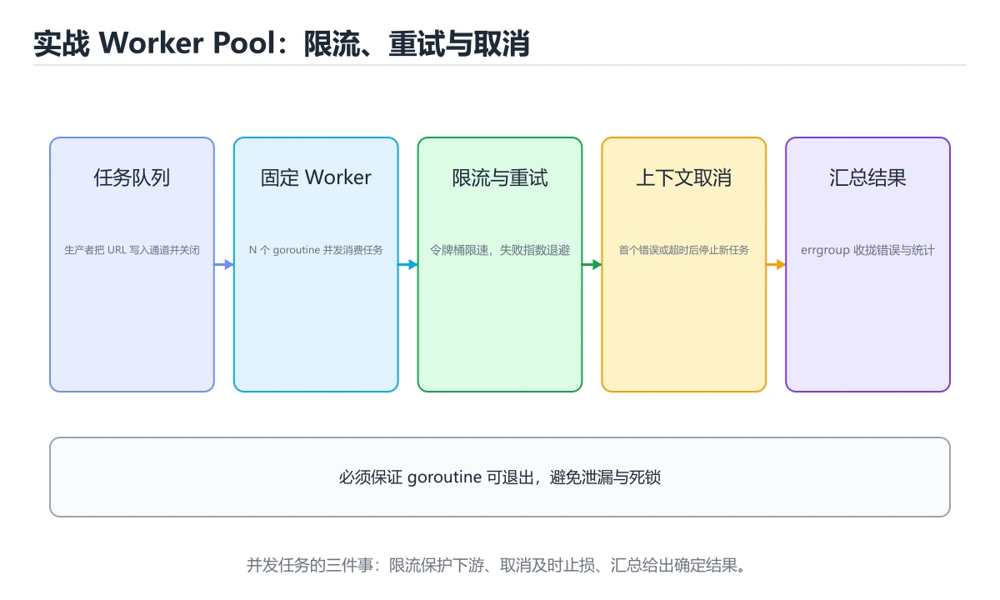
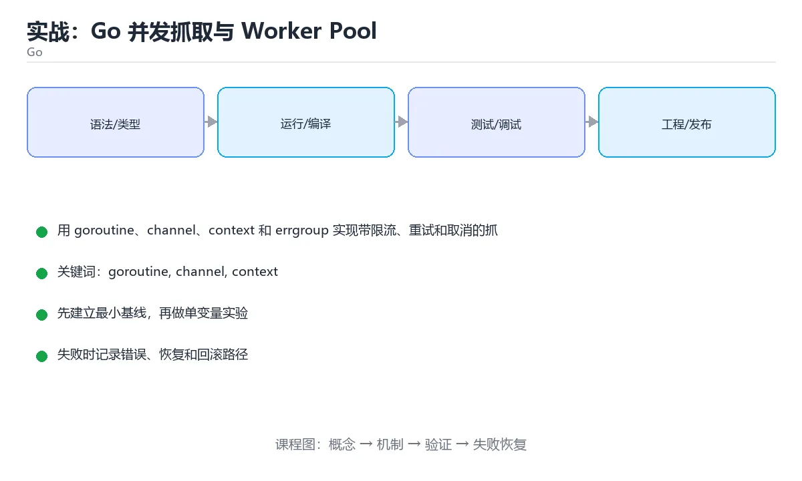

# 实战：Go 并发抓取与 Worker Pool





> 内容更新时间：2026-10-06 · 学习阶段：高级 · 预计用时：60 分钟

## 本节知识框架

**课程定位**：所属分类 `go`（Go），课程主题 `实战：Go 并发抓取与 Worker Pool`，学习阶段 高级，建议用时 70 分钟。

本课主线：用 goroutine、channel、context 和 errgroup 实现带限流、重试和取消的抓取任务。

**学完本课应当能够**
- 说清 `goroutine` 与 `errgroup` 的含义与区别，并各举一个正例和一个反例。
- 用本课示例验证 `有界并发` 的行为，记录输入、输出与失败条件。
- 遇到「无限制创建协程」这类问题时，能说出触发条件与修复顺序。

### 从概念到验证的学习链条

1. `goroutine`：先掌握 Go 的轻量协程，由运行时调度到系统线程；创建成本低，优选 channel 通信而非共享内存，再用它解释 `errgroup` 为什么会出现。
2. `errgroup`：先掌握 把一组 goroutine 的错误与取消统一管理，任何一个失败都可以整体取消，再用它解释 `有界并发` 为什么会出现。
3. `有界并发`：先掌握 用固定 worker 数或信号量限制同时运行的任务，防止内存与下游被打满，再用它解释 `任务取消` 为什么会出现。
4. `任务取消`：先掌握 通过 context 向下传递取消信号，让超时或用户中断时在途任务尽快退出，再用它解释 `Go` 为什么会出现。
5. `Go`：先掌握 谷歌开源的静态编译语言：goroutine 与 channel 原生支持并发，编译产物是单个二进制文件，再用它解释 本课示例的观察结果 为什么会出现。

**先修与衔接**：本课是「Go」分类的第 19 课。先修内容：《实战：Go REST API 服务》。《实战：Go REST API 服务》里的 `Go`、`优雅关闭` 是本课的前提。相关或后续课程：《Go 泛型深入与约束设计》。

### 完成判据

- **定义关**：不看正文也能说明 `goroutine` 是 Go 的轻量协程，由运行时调度到系统线程，创建成本低，优选 channel 通信而非共享内存，并指出一个反例。
- **机制关**：能按“输入 → 转换 → 输出 → 验证”复述 `实战：Go 并发抓取与 Worker Pool`，而不是只背结论。
- **示例关**：能运行或推演 `实战：Go 并发抓取与 Worker Pool` 的 `text` 示例，并说明一个真实出现的标识符或字面量。
- **证据关**：能从 `实战：Go 并发抓取与 Worker Pool` 的示例写出一个输入、处理、输出三元组，并说明它支持或反驳了本课的哪一条结论。
- **排错关**：能复现 无限制创建协程，记录现象并按 用固定大小的工作池与有界队列 修复。
- **迁移关**：能把 `goroutine`、`channel`、`context`、`worker pool` 放进一个与 `实战：Go 并发抓取与 Worker Pool` 不同的项目场景，并保持输入与验证条件可追踪。
- **复盘关**：学完 `实战：Go 并发抓取与 Worker Pool` 后，用一句话写下仍然不确定的结论，并列出下一次验证需要的输入、环境和成功判据。

### 复习清单

- [ ] 能不看正文复述本课核心术语，并指出一个边界或反例。
- [ ] 能运行或推演本课示例，记录输入、输出与失败现象。
- [ ] 能完成一次自测，并把错题对照错误表定位原因。

## 核心概念定义

| 术语 | 操作性定义 | 常见边界与风险 |
| --- | --- | --- |
| goroutine | Go 的轻量协程，由运行时调度到系统线程；创建成本低，优选 channel 通信而非共享内存。 | 共享状态与调度顺序会改变结论，单线程或串行测试通过不等于并发下成立。 |
| errgroup | 把一组 goroutine 的错误与取消统一管理，任何一个失败都可以整体取消。 | 只在「把一组 goroutine 的错误与取消统一管理，任何一个失败都可以整体取消」这一前提下成立，换输入或换环境要重新验证。 |
| 有界并发 | 用固定 worker 数或信号量限制同时运行的任务，防止内存与下游被打满。 | 越界、悬垂引用与释放顺序会破坏结论，必须在边界输入下复验。 |
| 任务取消 | 通过 context 向下传递取消信号，让超时或用户中断时在途任务尽快退出。 | 网络延迟、超时与版本协商会改变行为，只在真实链路或多版本客户端上验证才算数。 |
| Go | 谷歌开源的静态编译语言：goroutine 与 channel 原生支持并发，编译产物是单个二进制文件 | 共享状态与调度顺序会改变结论，单线程或串行测试通过不等于并发下成立。 |

## 原理与运行机制

### 机制总览

**教材衔接：技术栈**

- 版本提示：goroutine 的行为在最近几个大版本里有过调整，升级「实战：Go 并发抓取与 Worker Pool」前先用 HTTP 复现当前输出，再对照官方发布说明逐条核对。
- context
- errgroup
- net/http
- testing

**教材衔接：架构与数据流**

- 查询 channel 时限定字段与分页范围，把全表扫描留作最后手段。
- HTTP 的写入要以幂等键为准，失败后能补偿或安全重试。
- 外部调用要设置超时、重试上限和降级策略。
- 每个关键阶段都要留下日志、指标或测试证据。

**教材衔接：功能范围**

- [ ] 有界任务队列
- [ ] 并发上限和速率限制
- [ ] 失败重试与退避
- [ ] 超时取消和结果汇总

**教材衔接：实施步骤**

### 步骤 1：定义任务、结果和错误模型

- 输入与产出：先写清 goroutine 依赖的配置、数据和最终产物，再开始编码。
- 为 channel 补一个最小用例，明确通过标准再扩展规模。
- 为 HTTP 定义失败分类与重试上限，超出后走人工处理。
- 证据留存：保留命令、输出、日志或截图，方便评审与复盘。

### 步骤 2：创建任务与结果 channel

- 定位：这一节说明步骤 2：创建任务与结果 channel在「实战：Go 并发抓取与 Worker Pool」知识体系里的位置。
- 要点：本课涉及：goroutine、channel、context、worker pool、errgroup。
- 自检：能否用一个最小例子解释步骤 2：创建任务与结果 channel？

### 步骤 3：启动固定数量 worker

- 定位：这一节说明步骤 3：启动固定数量 worker在「实战：Go 并发抓取与 Worker Pool」知识体系里的位置。
- 要点：一句话摘要：用 goroutine、channel、context 和 errgroup 实现带限流、重试和取消的抓取任务。
- 自检：能否用一个最小例子解释步骤 3：启动固定数量 worker？

### 步骤 4：加入限流器和重试逻辑

- 定位：这一节说明步骤 4：加入限流器和重试逻辑在「实战：Go 并发抓取与 Worker Pool」知识体系里的位置。
- 检查点：用空值、极值和依赖失败各跑一次《实战：Go 并发抓取与 Worker Pool》，确认边界行为与正文一致。
- 自检：能否用一个最小例子解释步骤 4：加入限流器和重试逻辑？

### 步骤 5：用 errgroup 管理取消

- 定位：这一节说明步骤 5：用 errgroup 管理取消在「实战：Go 并发抓取与 Worker Pool」知识体系里的位置。
- 检查点：用空值、极值和依赖失败各跑一次《实战：Go 并发抓取与 Worker Pool》，确认边界行为与正文一致。
- 自检：能否用一个最小例子解释步骤 5：用 errgroup 管理取消？

### 步骤 6：压测并检查 goroutine 数量

- 定位：这一节说明步骤 6：压测并检查 goroutine 数量在「实战：Go 并发抓取与 Worker Pool」知识体系里的位置。
- 检查点：在《实战：Go 并发抓取与 Worker Pool》中用最小输入复现问题，逐项核对版本、边界和失败路径后再修改。
- 自检：能否用一个最小例子解释步骤 6：压测并检查 goroutine 数量？

**教材衔接：建议目录结构**

**教材衔接：质量门禁**

- [ ] 格式化和静态检查通过，不遗留明显警告。
- [ ] 单元测试覆盖 goroutine 的核心规则，集成测试覆盖数据库或外部边界。
- [ ] 错误响应不泄露堆栈、SQL 和密钥。
- [ ] 配置来自环境变量或配置文件，不硬编码敏感信息。
- [ ] README 写清启动、测试、配置和回滚步骤。

**教材衔接：安全、成本与可观测性**

- 为 channel 单独申请最小权限，并记录权限变更。
- 所有进入 goroutine 的外部输入都要校验、限长并转义，错误信息不能泄露内部路径。
- 密钥通过环境变量或密钥管理服务注入，并记录轮换方式。
- 给 channel 的资源使用设定配额，超出后降级而不是拖垮整个进程。
- 为 HTTP 建立四个指标：吞吐、错误率、尾延迟和资源占用。
- goroutine 出现异常时，要能从日志和指标还原时间线，而不是只看到「服务不可用」。

**教材衔接：扩展任务**

- 加入域名级限速
- 把结果写入 SQLite 或 CSV
- 接入 Prometheus 统计成功率

**教材衔接：实施记录与复盘**

每完成一步，记录以下内容：

1. 本步的输入、命令和输出是什么？
2. 遇到的最小失败是什么，如何定位和修复？
3. 哪个假设被验证或推翻？
4. 下一步的风险是什么，如何回滚？
5. 规模扩大 10 倍后，channel 会先成为瓶颈还是先暴露一致性风险？

**教材衔接：完成标准**

- [ ] 能从干净环境按 README 启动项目。
- [ ] 为 HTTP 补三条测试：正常、边界、失败各一条。
- [ ] 能演示一次错误、一次恢复和一次回滚。
- [ ] 有一份资源或性能基线，能说明瓶颈在哪里。
- [ ] 能说清一个尚未解决的问题和下一步验证方法。

**教材衔接：版本与时效**

- 升级前确认 goroutine 的兼容范围，把不可回退的改动单独拆成一次提交。
- 模块校验、最小版本选择与供应链安全是生产升级的重点
- 官方发布说明：https://go.dev/doc/devel/release

### 升级检查清单

- 先固定当前版本，跑通全部示例与测验，再升级工具链。
- 升级时只动一个依赖版本，用 HTTP 记录构建与运行结果。
- 升级后重点回归 goroutine 的默认值、警告信息与错误格式。
- 升级完成后记录 goroutine 的新旧版本差异，并据此调整下次复核时间。

**教材衔接：交付评审：评分表、决策记录与证据链**


### 四、「实战：Go 并发抓取与 Worker Pool」的验收指标

| 指标 | 目标值 | 测量方式 | 不达标时的动作 |
| --- | --- | --- | --- |
| 需要批量抓取 1000 个 URL，限制并发和速率，失败重试，整体超时后立即取消所有任务，并汇总成功、失败和耗时。 | 用本课正文给出的阈值，没有就写实测基线 | 固定环境重复三次取中位数 | 回到对应小节定位，先修原因再重测 |
| | 延迟 | 记录 P50/P95/P99 | 用固定数据集逐步增加并发 | P99 持续上升或超时率增加 | | 用本课正文给出的阈值，没有就写实测基线 | 固定环境重复三次取中位数 | 回到对应小节定位，先修原因再重测 |
| | 存储 | 记录数据增长与索引大小 | 导入 10 倍数据并观察查询 | 磁盘、连接或锁等待成为瓶颈 | | 用本课正文给出的阈值，没有就写实测基线 | 固定环境重复三次取中位数 | 回到对应小节定位，先修原因再重测 |

### 五、评审记录模板

| 记录项 | 填写要求 |
| --- | --- |
| 项目标识 | `go_project_worker_pool` |
| 本次范围 | 说明这一轮交付了「实战：Go 并发抓取与 Worker Pool」的哪些部分 |
| 未完成项 | 列出与 goroutine 相关但本轮未做的内容 |
| 证据位置 | 指向 evidence/ 目录下的具体文件 |
| 风险与回滚 | 写清剩余风险、回滚步骤和验证方式 |
| 结论 | 通过 / 有条件通过 / 不通过，三者选一 |

### 机制拆解：每一步的输入、动作与输出

#### 1. `goroutine`
- 输入：`goroutine`；本步把 Go 的轻量协程，由运行时调度到系统线程；创建成本低，优选 channel 通信而非共享内存 当作判断规则。
- 动作：围绕 `goroutine` 保留中间状态，并记录它与 `errgroup` 的对应关系。
- 输出：`errgroup`，它可以被下一段代码、测试或记录继续使用。
- `goroutine` 的失败条件：共享状态与调度顺序会改变结论，单线程或串行测试通过不等于并发下成立。

#### 2. `errgroup`
- 输入：`goroutine`；本步把 把一组 goroutine 的错误与取消统一管理，任何一个失败都可以整体取消 当作判断规则。
- 动作：围绕 `errgroup` 保留中间状态，并记录它与 `有界并发` 的对应关系。
- 输出：`有界并发`，它可以被下一段代码、测试或记录继续使用。
- `errgroup` 的失败条件：只在「把一组 goroutine 的错误与取消统一管理，任何一个失败都可以整体取消」这一前提下成立，换输入或换环境要重新验证。

#### 3. `有界并发`
- 输入：`errgroup`；本步把 用固定 worker 数或信号量限制同时运行的任务，防止内存与下游被打满 当作判断规则。
- 动作：围绕 `有界并发` 保留中间状态，并记录它与 `任务取消` 的对应关系。
- 输出：`任务取消`，它可以被下一段代码、测试或记录继续使用。
- `有界并发` 的失败条件：越界、悬垂引用与释放顺序会破坏结论，必须在边界输入下复验。

#### 4. `任务取消`
- 输入：`有界并发`；本步把 通过 context 向下传递取消信号，让超时或用户中断时在途任务尽快退出 当作判断规则。
- 动作：围绕 `任务取消` 保留中间状态，并记录它与 `Go` 的对应关系。
- 输出：`Go`，它可以被下一段代码、测试或记录继续使用。
- `任务取消` 的失败条件：网络延迟、超时与版本协商会改变行为，只在真实链路或多版本客户端上验证才算数。

#### 5. `Go`
- 输入：`任务取消`；本步把 谷歌开源的静态编译语言：goroutine 与 channel 原生支持并发，编译产物是单个二进制文件 当作判断规则。
- 动作：围绕 `Go` 保留中间状态，并记录它与 `本课示例的最终结果` 的对应关系。
- 输出：`本课示例的最终结果`，它可以被下一段代码、测试或记录继续使用。
- `Go` 的失败条件：共享状态与调度顺序会改变结论，单线程或串行测试通过不等于并发下成立。

### 复现实验记录

- 环境：`实战：Go 并发抓取与 Worker Pool` 使用 `text` 示例，固定 `goroutine`、`channel`、`context`、`worker pool` 作为第一组条件。
- 首轮输入：从示例中的第一个输入开始，预测 `goroutine` 会怎样变化。
- 基线观察：记录命令、输入、输出和错误原文，不用截图代替可复制的文本。
- 单变量修改：只改变 `goroutine`，观察 `Go` 是否仍满足定义。
- 失败注入：复现 无限制创建协程，确认现象是 内存暴涨，下游被打垮。
- 记录结论：把“修改前、修改后、预期变化、实际变化”写成四列表，这样复盘 `实战：Go 并发抓取与 Worker Pool` 时才能区分概念错误与实现错误。

## 典型应用场景

**教材衔接：项目背景**

需要批量抓取 1000 个 URL，限制并发和速率，失败重试，整体超时后立即取消所有任务，并汇总成功、失败和耗时。

一句话摘要：用 goroutine、channel、context 和 errgroup 实现带限流、重试和取消的抓取任务。

**教材衔接：项目交付物**

### 建议仓库结构

```text
cmd/app/
internal/domain/
internal/infra/
pkg/
go.mod
```


### 验收数据

```json
{
  "project": "go_project_worker_pool",
  "scenario": "goroutine的正常路径",
  "input": {"case": "normal", "value": "HTTP"},
  "expected": {"ok": true, "checks": ["goroutine可复现", "channel有记录"]},
  "failure_case": {"case": "channel越界或缺失", "error": "validation_error"},
  "idempotency_key": "go_project_worker_pool-001"
}
```

### 复盘模板

- **无限制创建协程**：典型现象是内存暴涨，下游被打垮；正确做法是用固定大小的工作池与有界队列。
- **取消信号不向下传递**：典型现象是退出后仍有任务在写数据；正确做法是用上下文传播取消，并等待全部协程退出。
- **结果收集不考虑顺序与重复**：典型现象是输出混乱或重复写入；正确做法是明确结果顺序，并在写入前去重。

### 最小验证场景

- 准备：保留 `text` 示例的原始输入，先记录 `实战：Go 并发抓取与 Worker Pool` 的基线输出和完整运行命令。
- 判定：新结果与 `实战：Go 并发抓取与 Worker Pool` 的基线不同不等于错误；只有当差异破坏了 `goroutine` 的定义或错误表中的约束，才判定为失败。

### 选择与边界

- 使用 `goroutine` 时，先满足它的定义：Go 的轻量协程，由运行时调度到系统线程；创建成本低，优选 channel 通信而非共享内存；共享状态与调度顺序会改变结论，单线程或串行测试通过不等于并发下成立。
- 使用 `errgroup` 时，先满足它的定义：把一组 goroutine 的错误与取消统一管理，任何一个失败都可以整体取消；只在「把一组 goroutine 的错误与取消统一管理，任何一个失败都可以整体取消」这一前提下成立，换输入或换环境要重新验证。
- 使用 `有界并发` 时，先满足它的定义：用固定 worker 数或信号量限制同时运行的任务，防止内存与下游被打满；越界、悬垂引用与释放顺序会破坏结论，必须在边界输入下复验。
- 使用 `任务取消` 时，先满足它的定义：通过 context 向下传递取消信号，让超时或用户中断时在途任务尽快退出；网络延迟、超时与版本协商会改变行为，只在真实链路或多版本客户端上验证才算数。
- 使用 `Go` 时，先满足它的定义：谷歌开源的静态编译语言：goroutine 与 channel 原生支持并发，编译产物是单个二进制文件；共享状态与调度顺序会改变结论，单线程或串行测试通过不等于并发下成立。

## 代码/协议/SQL 示例

### 最小可验证示例

**教材衔接：示例数据与边界**

**教材衔接：关键代码**

```go
func worker(ctx context.Context, jobs <-chan string, results chan<- Result, limiter *rate.Limiter) {
  for {
    select {
    case <-ctx.Done():
      return
    case url, ok := <-jobs:
      if !ok { return }
      _ = limiter.Wait(ctx)
      results <- fetch(url)
    }
  }
}
```

**教材衔接：验证命令与预期输出**

**教材衔接：测试与验收**

- 超时后所有 worker 能及时退出
- 并发数不超过配置上限
- 失败任务按次数重试并记录最终错误


### 示例精读：先找证据，再改一个条件

- 在 `实战：Go 并发抓取与 Worker Pool` 中与 `goroutine` 对照：示例必须能支持 Go 的轻量协程，由运行时调度到系统线程；创建成本低，优选 channel 通信而非共享内存，否则说明这一段还缺少实现或验证步骤。
- 在 `实战：Go 并发抓取与 Worker Pool` 中与 `errgroup` 对照：示例必须能支持 把一组 goroutine 的错误与取消统一管理，任何一个失败都可以整体取消，否则说明这一段还缺少实现或验证步骤。
- 在 `实战：Go 并发抓取与 Worker Pool` 中与 `有界并发` 对照：示例必须能支持 用固定 worker 数或信号量限制同时运行的任务，防止内存与下游被打满，否则说明这一段还缺少实现或验证步骤。
- 在 `实战：Go 并发抓取与 Worker Pool` 中与 `任务取消` 对照：示例必须能支持 通过 context 向下传递取消信号，让超时或用户中断时在途任务尽快退出，否则说明这一段还缺少实现或验证步骤。
- `实战：Go 并发抓取与 Worker Pool` 的示例没有抽取到函数调用或字面量；按行记录输入、控制流和输出，避免只背代码外形。

## 时间/空间复杂度或性能分析

**性能关注点（实战：Go 并发抓取与 Worker Pool）**：调度器与 GC 影响开销：记录 P99 延迟、协程数量与堆占用，优先用 pprof 采样。

**本课特有开销（实战：Go 并发抓取与 Worker Pool · goroutine）**：并发度提高后要观察是否出现拐点：延迟上升而吞吐不增，说明瓶颈已转移。

**测量方法**：以 `实战：Go 并发抓取与 Worker Pool` 的 `goroutine` 场景为对象，固定输入跑一遍记录基线，再把规模或并发度提高一个数量级复测；两次结果的差值与波动范围才是结论依据。

### 需要控制的变量与记录项

- `实战：Go 并发抓取与 Worker Pool` 的 `goroutine`：固定它的版本、输入范围和资源上限，分别记录速度、内存与失败率的变化。
- `实战：Go 并发抓取与 Worker Pool` 的 `channel`：固定它的版本、输入范围和资源上限，分别记录速度、内存与失败率的变化。
- `实战：Go 并发抓取与 Worker Pool` 的 `context`：固定它的版本、输入范围和资源上限，分别记录速度、内存与失败率的变化。
- `实战：Go 并发抓取与 Worker Pool` 的 `worker pool`：固定它的版本、输入范围和资源上限，分别记录速度、内存与失败率的变化。
- `实战：Go 并发抓取与 Worker Pool` 的 `errgroup`：固定它的版本、输入范围和资源上限，分别记录速度、内存与失败率的变化。
- `实战：Go 并发抓取与 Worker Pool` 中 `goroutine` 的边界：共享状态与调度顺序会改变结论，单线程或串行测试通过不等于并发下成立。达到边界时不要外推，必须重新测量。
- `实战：Go 并发抓取与 Worker Pool` 中 `errgroup` 的边界：只在「把一组 goroutine 的错误与取消统一管理，任何一个失败都可以整体取消」这一前提下成立，换输入或换环境要重新验证。达到边界时不要外推，必须重新测量。
- `实战：Go 并发抓取与 Worker Pool` 中 `有界并发` 的边界：越界、悬垂引用与释放顺序会破坏结论，必须在边界输入下复验。达到边界时不要外推，必须重新测量。
- `实战：Go 并发抓取与 Worker Pool` 中 `任务取消` 的边界：网络延迟、超时与版本协商会改变行为，只在真实链路或多版本客户端上验证才算数。达到边界时不要外推，必须重新测量。
- `实战：Go 并发抓取与 Worker Pool` 中 `Go` 的边界：共享状态与调度顺序会改变结论，单线程或串行测试通过不等于并发下成立。达到边界时不要外推，必须重新测量。

## 常见误区与易错点

| 容易写错的做法 | 实际现象 | 原因与正确做法 |
| --- | --- | --- |
| 无限制创建协程 | 内存暴涨，下游被打垮。 | 用固定大小的工作池与有界队列。 |
| 取消信号不向下传递 | 退出后仍有任务在写数据。 | 用上下文传播取消，并等待全部协程退出。 |
| 结果收集不考虑顺序与重复 | 输出混乱或重复写入。 | 明确结果顺序，并在写入前去重。 |

### 现场 1：无限制创建协程

**症状**：内存暴涨，下游被打垮。

**根因与修复**：用固定大小的工作池与有界队列。

**自检**：在本课示例里复现「无限制创建协程」，改成用固定大小的工作池与有界队列后重跑；如果症状消失且失败路径按预期变化，说明定位正确。

### 现场 2：取消信号不向下传递

**症状**：退出后仍有任务在写数据。

**根因与修复**：用上下文传播取消，并等待全部协程退出。

**自检**：在本课示例里复现「取消信号不向下传递」，改成用上下文传播取消，并等待全部协程退出后重跑；如果症状消失且失败路径按预期变化，说明定位正确。

### 现场 3：结果收集不考虑顺序与重复

**症状**：输出混乱或重复写入。

**根因与修复**：明确结果顺序，并在写入前去重。

**自检**：在本课示例里复现「结果收集不考虑顺序与重复」，改成明确结果顺序，并在写入前去重后重跑；如果症状消失且失败路径按预期变化，说明定位正确。

## 与其他知识点的关系

**教材衔接：复习与迁移**

### 概念复述

- 用一句话说明「实战：Go 并发抓取与 Worker Pool」解决什么问题：用 goroutine、channel、context 和 errgroup 实现带限流、重试和取消的抓取任务。
- 写出goroutine、channel、context之间的关系，并各举一个例子。
- 说出本课最容易混淆的两个概念，以及区分它们的判据。

### 正文逐节复核

- **项目背景**：一句话摘要：用 goroutine、channel、context 和 errgroup 实现带限流、重试和取消的抓取任务。
- **项目专属规格：实战：Go 并发抓取与 Worker Pool**：用 goroutine、channel、context 和 errgroup 实现带限流、重试和取消的抓取任务。

### 测验回顾

1. 围绕“实战：Go 并发抓取与 Worker Pool”中的 goroutine、channel、context，下列哪两项是本课强调的实践判断？
   - 依据：本课把实战：Go 并发抓取与 Worker Pool拆成概念、示例与故障现场三部分，因此判断 goroutine 时必须同时交代输入、输出和失败路径，这使“学习 goroutine 时要同时说明输入、输出和失败路径，不能只看正常流程”成立。在实战：Go 并发抓取与 Worker Pool里，判断 channel 时要固定版本与边界输入，所以“验证 channel 时要固定版本并覆盖边界输入，结论才可复现”才可复现。
2. context 在并发抓取中的作用是什么？
   - 依据：context 让所有子任务在父任务取消时及时退出。作答时，先用goroutine建立输入与输出的基线，再把传播取消和超时代入边界条件核对，结论才能复现。把“传播取消和超时”代回「实战：Go 并发抓取与 Worker Pool」里“context 在并发抓取中的作用是什么”的例子核对，条件一旦改变，结论就要用goroutine、channel、context重新推导。
3. 下面这段 Go 代码摘自「实战：Go 并发抓取与 Worker Pool」的正文示例。关于这段代码，下面哪一项说法与实际内容相符？
   - 依据：在「实战：Go 并发抓取与 Worker Pool」里，这段代码包含循环结构，同一段逻辑会被重复执行。这段代码出自「实战：Go 并发抓取与 Worker Pool」的正文示例，围绕goroutine、channel、context展开；把输入或边界换成空值、极值或失败情况后，结论要以「实战：Go 并发抓取与 Worker Pool」的实际运行结果为准。
4. 限流器解决了什么问题？
   - 依据：在「实战：Go 并发抓取与 Worker Pool」里，作答时，先用goroutine建立输入与输出的基线，再把控制请求速率保护下游代入边界条件核对，结论才能复现。在「实战：Go 并发抓取与 Worker Pool」里，这道题要求区分概念与边界，「控制请求速率保护下游」只有在题干给出的前提下才成立，而「替代重试」、「提升颜色」缺少同一组条件。
5. 如何检查 goroutine 泄漏？
   - 依据：在「实战：Go 并发抓取与 Worker Pool」里，运行前后比较 goroutine 数量并使用阻塞分析。goroutine 数量持续增长通常意味着阻塞或缺少取消。“如何检查”与「实战：Go 并发抓取与 Worker Pool」的术语表相呼应，只有符合goroutine、channel、context约束的“运行前后比较 goroutine 数量并”才是正文支持的结论。
6. 补全代码：「实战：Go 并发抓取与 Worker Pool」示例中，下面这行代码缺少哪个关键字或函数名？请填入 ____。

### 迁移练习

- **先修**：`实战：Go REST API 服务`。本课默认这些内容已经掌握。
- **相关或后续**：`Go 泛型深入与约束设计`。本课术语会在这些课程里继续使用。
- **术语归属**：`goroutine`、`errgroup`、`有界并发` 的定义以本课「核心概念定义」为准，换到其他课程时先确认定义是否被改写。
- 同一分类的《Go 基础》也涉及 `goroutine`；两课衔接时先确认这个术语的定义是否一致。
- 同一分类的《Go 并发：goroutine、channel 与 context》也涉及 `goroutine`；两课衔接时先确认这个术语的定义是否一致。

### 先修与后续术语接口

- `实战：Go REST API 服务`：共享术语 `Go`。
- `Go 泛型深入与约束设计`：两者通过本分类的学习顺序衔接，阅读时重点比较各自的输入与失败条件。

### 容易混淆的相邻概念

- `goroutine` 与 `errgroup`：前者强调 Go 的轻量协程，由运行时调度到系统线程；创建成本低，优选 channel 通信而非共享内存；后者强调 把一组 goroutine 的错误与取消统一管理，任何一个失败都可以整体取消。判断时分别检查两条定义的适用范围，不要只看名称相似就互换。
- `errgroup` 与 `有界并发`：前者强调 把一组 goroutine 的错误与取消统一管理，任何一个失败都可以整体取消；后者强调 用固定 worker 数或信号量限制同时运行的任务，防止内存与下游被打满。判断时分别检查两条定义的适用范围，不要只看名称相似就互换。
- `有界并发` 与 `任务取消`：前者强调 用固定 worker 数或信号量限制同时运行的任务，防止内存与下游被打满；后者强调 通过 context 向下传递取消信号，让超时或用户中断时在途任务尽快退出。判断时分别检查两条定义的适用范围，不要只看名称相似就互换。
- `任务取消` 与 `Go`：前者强调 通过 context 向下传递取消信号，让超时或用户中断时在途任务尽快退出；后者强调 谷歌开源的静态编译语言：goroutine 与 channel 原生支持并发，编译产物是单个二进制文件。判断时分别检查两条定义的适用范围，不要只看名称相似就互换。

## 自测题与参考答案

> 先独立作答，再对照参考答案；答案都能在本课正文、术语表或错误表里找到依据。

### 自测 1（概念复述）

不看正文，写出 `goroutine` 的操作性定义，并说明它与 `errgroup` 的区别。

**参考答案**：Go 的轻量协程，由运行时调度到系统线程；创建成本低，优选 channel 通信而非共享内存。

`errgroup` 的定位是：把一组 goroutine 的错误与取消统一管理，任何一个失败都可以整体取消；两者的差别要从适用对象与失败模式上说明。

### 自测 2（排错）

本课错误表记录了「无限制创建协程」这类做法。请写出它会出现的现象、根因，以及修复顺序。

**参考答案**：现象是内存暴涨，下游被打垮；正确做法是用固定大小的工作池与有界队列。修复时先复现现象并保留证据，再改动一处假设重跑，确认现象消失。

### 自测 3（动手验证）

运行本课的 `text` 示例，改动其中一个输入后重新运行，记录输出与错误信息。

**参考答案**：正常输入下 `text` 示例应当复现正文给出的结果；改动输入后，如果结果改变或报错，先核对它是否满足 `实战：Go 并发抓取与 Worker Pool` 中`goroutine` 的适用范围，再检查错误表里是否有同类现象。

### 自测 4（代码阅读）

阅读本课开头的 `text` 示例，说明它体现了`goroutine` 的哪一条性质，并指出改动哪个输入会让这条性质不再成立。

**参考答案**：`goroutine` 的定义是 Go 的轻量协程，由运行时调度到系统线程，创建成本低，优选 channel 通信而非共享内存，示例正是在实现这条定义。改动与 `goroutine` 有关的一个输入后，如果结果不再符合 `实战：Go 并发抓取与 Worker Pool` 的正文描述，就说明该性质只在当前前提成立。

### 自测 5（迁移）

把 `实战：Go 并发抓取与 Worker Pool` 的方法迁移到自己的项目：围绕 `goroutine` 写出一个与错误表同类的风险点，并说明触发条件和检验方式。

**参考答案**：例如「结果收集不考虑顺序与重复」，它会导致输出混乱或重复写入；检验方式是按明确结果顺序，并在写入前去重改一处再复现，确认现象消失且没有引入新的失败分支。

### 自测 6（对比）

用一个表格对比 `goroutine` 与 `errgroup`：各写一行适用场景、一行失败表现。

**参考答案**：`goroutine` 的定义是Go 的轻量协程，由运行时调度到系统线程；创建成本低，优选 channel 通信而非共享内存；`errgroup` 的定义是把一组 goroutine 的错误与取消统一管理，任何一个失败都可以整体取消。两者的失败表现分别对应本课错误表里与本术语相关的行。

### 自测 7（排错顺序）

面对「无限制创建协程」引发的问题，请把“复现 内存暴涨，下游被打垮 → 保留证据 → 用固定大小的工作池与有界队列 → 回归验证”四步写成可执行的检查清单。

**参考答案**：第一步按内存暴涨，下游被打垮复现；第二步记录输入、版本与完整报错；第三步按用固定大小的工作池与有界队列只改一处；第四步重跑并确认失败路径也按预期变化。

### 自测 8（边界判断）

针对 `Go`，分别写出“可以使用”的条件和“结论不再成立”的条件。

**参考答案**：共享状态与调度顺序会改变结论，单线程或串行测试通过不等于并发下成立。 同时要把 `Go` 的定义 谷歌开源的静态编译语言：goroutine 与 channel 原生支持并发，编译产物是单个二进制文件 与实际输入逐项对照。

### 自测 9（机制重建）

不看正文，按输入、转换、输出、验证四段重建 `goroutine` → `errgroup` → `有界并发` → `任务取消` 的作用链。

**参考答案**：起点是 `goroutine` 的定义 Go 的轻量协程，由运行时调度到系统线程；创建成本低，优选 channel 通信而非共享内存；中间每一步都保留可观察状态；终点由 `Go` 检查，失败时回到错误表定位第一个偏离定义的步骤。

### 自测 10（综合排错）

在 `实战：Go 并发抓取与 Worker Pool` 中，现象是 输出混乱或重复写入。请围绕 结果收集不考虑顺序与重复 写出最小复现、关键证据、修复动作和回归验证，并说明为什么不能只凭一次运行下结论。

**参考答案**：先复现 结果收集不考虑顺序与重复，记录输入与完整错误；再按 明确结果顺序，并在写入前去重 只改一处。回归时同时跑正常路径和边界路径，只有两次结果都可解释，才把修复视为完成。

### 自测 11（一分钟复述）

用每分钟约 200 字的速度复述 `实战：Go 并发抓取与 Worker Pool`：先给主问题，再按顺序说出 `goroutine`、`errgroup`、`有界并发`、`任务取消`，最后给一个失败案例。

**自评标准**：主问题必须对应 用 goroutine、channel、context 和 errgroup 实现带限流、重试和取消的抓取任务；每个术语都要能接上一句定义或边界；失败案例必须写成可观察现象，不能用“可能有风险”代替证据。

## 术语速查

| 术语 | 一句话说明 |
| --- | --- |
| `goroutine` | Go 的轻量协程，由运行时调度到系统线程；创建成本低，优选 channel 通信而非共享内存。 |
| `errgroup` | 把一组 goroutine 的错误与取消统一管理，任何一个失败都可以整体取消。 |
| `有界并发` | 用固定 worker 数或信号量限制同时运行的任务，防止内存与下游被打满。 |
| `任务取消` | 通过 context 向下传递取消信号，让超时或用户中断时在途任务尽快退出。 |
| `Go` | 谷歌开源的静态编译语言：goroutine 与 channel 原生支持并发，编译产物是单个二进制文件。 |

**术语关系**：`goroutine`（Go 的轻量协程） → `errgroup`（把一组 goroutine 的错误与取消统一管理） → `有界并发`（用固定 worker 数或信号量限制同时运行的任务） → `任务取消`（通过 context 向下传递取消信号）。

## 考点精讲

`实战：Go 并发抓取与 Worker Pool` 的题库有 6 道题，下面逐题给出题干、正确项与判断依据：先自己作答，再核对正确项，最后回到正文对应小节复核。

### 考点 1：第 1 题

- **题目**：围绕“实战：Go 并发抓取与 Worker Pool”中的 goroutine、channel、context，下列哪两项是本课强调的实践判断？
- **正确项**：验证 channel 时要固定版本并覆盖边界输入，结论才可复现；学习 goroutine 时要同时说明输入、输出和失败路径，不能只看正常流程
- **判断依据**：这道题落在术语 `goroutine` 上：Go 的轻量协程，由运行时调度到系统线程，创建成本低，优选 channel 通信而非共享内存。复习时把 `goroutine` 的定义、适用边界和一个反例一起说清楚，再回到「核心概念定义」核对原文。

### 考点 2：第 2 题

- **题目**：context 在并发抓取中的作用是什么？
- **正确项**：传播取消和超时
- **判断依据**：这道题检验本课主问题：用 goroutine、channel、context 和 errgroup 实现带限流、重试和取消的抓取任务。复习时先复述本课主问题，再举一个会让结论失效的输入。

### 考点 3：第 3 题

- **题目**：阅读 `实战：Go 并发抓取与 Worker Pool` 的 `goroutine` 示例。它服务于用 goroutine、channel、context 和 errgroup 实现带限流、重试和取消的抓取任务。代码中实际包含下列哪一项？
- **正确项**：这段示例用于说明本课术语 `errgroup` 的行为
- **判断依据**：这道题落在术语 `goroutine` 上：Go 的轻量协程，由运行时调度到系统线程，创建成本低，优选 channel 通信而非共享内存。复习时把 `goroutine` 的定义、适用边界和一个反例一起说清楚，再回到「核心概念定义」核对原文。

### 考点 4：第 4 题

- **题目**：限流器解决了什么问题？
- **正确项**：控制请求速率保护下游
- **判断依据**：这道题检验本课主问题：用 goroutine、channel、context 和 errgroup 实现带限流、重试和取消的抓取任务。复习时先复述本课主问题，再举一个会让结论失效的输入。

### 考点 5：第 5 题

- **题目**：如何检查 goroutine 泄漏？
- **正确项**：运行前后比较 goroutine 数量并使用阻塞分析
- **判断依据**：这道题落在术语 `goroutine` 上：Go 的轻量协程，由运行时调度到系统线程，创建成本低，优选 channel 通信而非共享内存。复习时把 `goroutine` 的定义、适用边界和一个反例一起说清楚，再回到「核心概念定义」核对原文。

### 考点 6：第 6 题

- **题目**：填空：补齐下面这段术语说明中的空缺。课程 `用 goroutine、channel、context 和 errgroup 实现带限流、重试和取消的抓取任务。`，这段说明是：`____`：谷歌开源的静态编译语言：goroutine 与 channel 原生支持并发，编译产物是单个二进制文件。空缺处应填哪个术语？
- **正确项**：Go
- **判断依据**：这道题落在术语 `goroutine` 上：Go 的轻量协程，由运行时调度到系统线程，创建成本低，优选 channel 通信而非共享内存。复习时把 `goroutine` 的定义、适用边界和一个反例一起说清楚，再回到「核心概念定义」核对原文。

### 考点 7：`goroutine`

- **要点**：Go 的轻量协程，由运行时调度到系统线程；创建成本低，优选 channel 通信而非共享内存。
- **goroutine 的边界**：共享状态与调度顺序会改变结论，单线程或串行测试通过不等于并发下成立。

### 考点 8：`errgroup`

- **要点**：把一组 goroutine 的错误与取消统一管理，任何一个失败都可以整体取消。
- **errgroup 的边界**：只在「把一组 goroutine 的错误与取消统一管理，任何一个失败都可以整体取消」这一前提下成立，换输入或换环境要重新验证。

### 考点 9：`有界并发`

- **要点**：用固定 worker 数或信号量限制同时运行的任务，防止内存与下游被打满。
- **有界并发 的边界**：越界、悬垂引用与释放顺序会破坏结论，必须在边界输入下复验。

### 考点 10：`任务取消`

- **要点**：通过 context 向下传递取消信号，让超时或用户中断时在途任务尽快退出。
- **任务取消 的边界**：网络延迟、超时与版本协商会改变行为，只在真实链路或多版本客户端上验证才算数。

### 考点 11：`Go`

- **要点**：谷歌开源的静态编译语言：goroutine 与 channel 原生支持并发，编译产物是单个二进制文件
- **Go 的边界**：共享状态与调度顺序会改变结论，单线程或串行测试通过不等于并发下成立。

### 考点 12：排错——无限制创建协程

- **现象**：内存暴涨，下游被打垮。
- **处理**：用固定大小的工作池与有界队列。

### 考点 13：排错——取消信号不向下传递

- **现象**：退出后仍有任务在写数据。
- **处理**：用上下文传播取消，并等待全部协程退出。

### 考点 14：综合辨析——`goroutine` 与 `Go`

- **辨析点**：`goroutine` 的定义是 Go 的轻量协程，由运行时调度到系统线程；创建成本低，优选 channel 通信而非共享内存；`Go` 的定义是 谷歌开源的静态编译语言：goroutine 与 channel 原生支持并发，编译产物是单个二进制文件。
- **答题要求**：面对 `实战：Go 并发抓取与 Worker Pool` 的题目，先判断描述的是 `goroutine` 还是 `Go`，再归到对应定义，最后写出一个会让该定义失效的边界输入。

### 考点 15：排错评分点

- **现象分**：能写出 内存暴涨，下游被打垮，而不是只写“程序有错”。
- **证据分**：保留触发 无限制创建协程 的输入、版本和错误原文。
- **修复分**：按 用固定大小的工作池与有界队列 只改一处，并同时回归正常路径与边界路径。

## 内容元数据

- 内容版本：v2.0
- 最后更新：2026-10-06
- 学习阶段：高级
- 适用环境：Go 1.24+；本课聚焦 goroutine。
- 内容来源：内置结构化课程与工程实践整理
- 相关主题：goroutine、channel、context、worker pool、errgroup
- 质量版本：P0 测验标准 + P1 覆盖扩展 + P2 体验补全

## 参考资料与复核

- 最后复核：2026-10-04
- 下次复核：2027-04-10
- 复核范围：版本兼容、API 行为、安全建议与工程实践
- 来源性质：官方文档、标准或权威教材；本课核对关键词：goroutine、channel、context、worker pool、errgroup。

| 参考资料 | 本课用途 |
| --- | --- |
| [Go 并发](https://go.dev/talks/2012/concurrency.slide) | goroutine 与 channel |
| [Effective Go](https://go.dev/doc/effective_go) | 惯用写法与接口设计 |
| [Go 标准库](https://pkg.go.dev/std) | 标准库 API |

| [本课术语索引：实战：Go 并发抓取与 Worker Pool](#核心概念定义) | 按本课输入、术语边界和错误表现逐项核对 |
> 「实战：Go 并发抓取与 Worker Pool」的链接用于离线阅读后的延伸核对；App 不会自动联网。