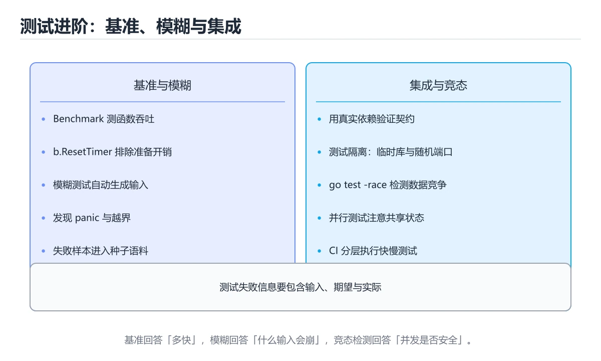
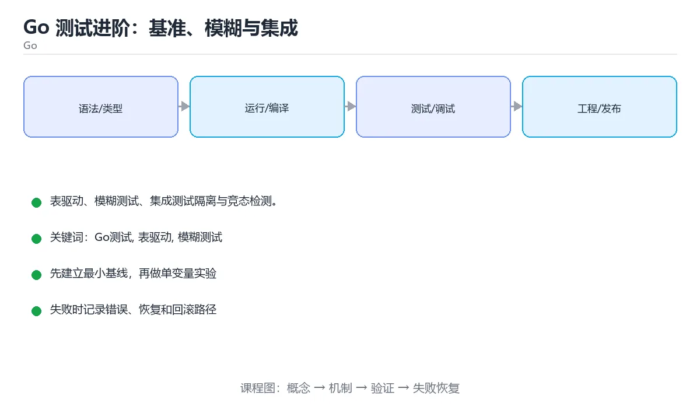

# Go 测试进阶：基准、模糊与集成

> 内容更新时间：2026-10-03





## 学习目标

- 能用自己的话解释Go 测试进阶：基准、模糊与集成解决了什么问题，而不是只背术语。
- 能说清 「Go测试」、「表驱动」、「模糊测试」、「集成测试」 之间的关系，并分别举出一个例子。
- 能把本课知识放回「Go」的知识体系，说明它和相邻主题的边界。
- 能完成本课练习，并用验收标准检查自己的结果。

> 一句话摘要：表驱动、模糊测试、集成测试隔离与竞态检测。

## 前置知识

- 先完成上一课《Go 并发模式与 errgroup》；如果已经掌握，可以直接用本课练习自测。
- 本课阶段：进阶。建议先掌握同一分类的基础课程，并能独立运行正文中的最小示例。
- 开始前先复习：Go测试、表驱动、模糊测试。
- 如果某一步看不懂，先记录具体卡点，完成练习后再回头读一遍。

## 测试类型速查

| 类型 | 触发方式 | 用途 |
| --- | --- | --- |
| 单元测试 | `go test ./...` | 验证函数与包行为 |
| 基准测试 | `-bench=.` | 度量性能与分配 |
| 模糊测试 | `-fuzz=FuzzX` | 用随机输入找崩溃与边界 |
| 示例测试 | `ExampleX` 带 `// Output:` | 既是文档也是测试 |
| 竞态检测 | `-race` | 发现数据竞争 |
| 集成测试 | 构建标签或短模式区分 | 依赖数据库或容器 |

## 常用写法速查

| 目的 | 写法 |
| --- | --- |
| 表驱动 | `tests := []struct{...}` 加 `t.Run` |
| 并行 | `t.Parallel()` |
| 临时目录 | `t.TempDir()` |
| 超时 | `go test -timeout=60s` |
| 跳过短模式 | `if testing.Short() { t.Skip() }` |
| 构建标签 | `//go:build integration` |
| 覆盖率 | `-coverprofile=cover.out` |
| 竞态 | `-race` |

```go
// 表驱动 + 并行 + 边界与错误分支
func TestParseAmount(t *testing.T) {
	t.Parallel()
	tests := []struct {
		name    string
		input   string
		want    int
		wantErr bool
	}{
		{name: "正常", input: "100", want: 100},
		{name: "空字符串", input: "", wantErr: true},
		{name: "负数", input: "-1", wantErr: true},
		{name: "带空格", input: " 42 ", want: 42},
	}
	for _, tt := range tests {
		tt := tt
		t.Run(tt.name, func(t *testing.T) {
			t.Parallel()
			got, err := ParseAmount(tt.input)
			if (err != nil) != tt.wantErr {
				t.Fatalf("err=%v wantErr=%v", err, tt.wantErr)
			}
			if got != tt.want {
				t.Errorf("got=%d want=%d", got, tt.want)
			}
		})
	}
}

// 模糊测试：不需要手写用例，由引擎探索输入空间
func FuzzParseAmount(f *testing.F) {
	f.Add("100")
	f.Add("-1")
	f.Fuzz(func(t *testing.T, input string) {
		value, err := ParseAmount(input)
		if err == nil && value < 0 {
			t.Fatalf("解析成功却得到负数：%d", value)
		}
	})
}

// 集成测试：用构建标签与真实依赖隔离
//go:build integration

func TestRepositoryWithRealDB(t *testing.T) {
	if testing.Short() {
		t.Skip("短模式跳过集成测试")
	}
	ctx := context.Background()
	pool, cleanup := setupTestPostgres(t)      // 启动容器并建表
	defer cleanup()
	repo := NewRepository(pool)
	if err := repo.Save(ctx, sampleOrder()); err != nil {
		t.Fatalf("保存失败：%v", err)
	}
}
```

## 替身与依赖处理

| 依赖 | 替身方式 | 说明 |
| --- | --- | --- |
| 数据库 | 接口替身或测试容器 | 逻辑测试用替身，集成测试用真库 |
| 外部 HTTP | `httptest.Server` | 真实 HTTP 行为，可控响应 |
| 时间 | 注入 Clock 接口 | 避免 sleep 与时间不确定 |
| 随机数 | 注入种子 | 保证可复现 |
| 文件系统 | `t.TempDir()` | 每个用例独立目录 |

## 常见错误对照表

| 容易踩的做法 | 实际现象 | 原因与正确做法 |
| --- | --- | --- |
| 测试之间共享可变状态 | 单独跑通过、一起跑失败 | 每个用例自建数据 |
| 用 `time.Sleep` 等异步结果 | 偶发失败 | 用 channel 或轮询直到满足条件 |
| 不跑 `-race` | 竞态潜伏到线上 | CI 加 `go test -race` |
| 只用 `_test` 断言不检查错误 | 失败原因不明 | 用 `t.Fatalf` 带上下文 |
| 集成测试默认执行 | 本地慢、CI 需外部依赖 | 用构建标签或短模式隔离 |
| 基准测试不 `ResetTimer` | 数据包含准备时间 | 准备后重置 |
| 忘记 `t.Parallel` 与循环变量复制 | 用例互相干扰或结果错 | 复制变量并谨慎使用并行 |

## 自测清单

- [ ] 单元测试采用表驱动并覆盖错误分支。
- [ ] 会用模糊测试探索边界输入。
- [ ] 集成测试与单元测试通过标签或短模式隔离。
- [ ] CI 运行 `-race` 与覆盖率统计。
- [ ] 外部依赖使用替身或测试容器，时间与随机可注入。

## 零基础详解：Go 测试的高级用法

### 一句话说清它是什么

Go 的测试工具链是标准库自带的：`go test` 一个命令就包含单元测试、基准测试、示例测试与模糊测试。
写好测试的关键是**表驱动 + 子测试 + 可替换的接口**。

### 用生活比喻理解

| 类型 | 比喻 | 回答什么问题 |
| --- | --- | --- |
| 单元测试 | 零件检验 | 这个函数对不对 |
| 基准测试 | 计时赛 | 它有多快、分配了多少内存 |
| 示例测试 | 说明书示例 | 用法是否和文档一致 |
| 模糊测试 | 随机压力 | 有没有边界崩溃 |
| 集成测试 | 装配检验 | 多个组件配合是否正常 |

### 单元测试：表驱动与子测试

```go
func TestDivide(t *testing.T) {
    cases := []struct {
        name    string
        a, b    int
        want    int
        wantErr error
    }{
        {"正常", 10, 2, 5, nil},
        {"整除有余", 7, 2, 3, nil},
        {"除零", 1, 0, 0, ErrDivideByZero},
    }

    for _, c := range cases {
        t.Run(c.name, func(t *testing.T) {
            got, err := Divide(c.a, c.b)
            if !errors.Is(err, c.wantErr) {
                t.Fatalf("错误 = %v，期望 %v", err, c.wantErr)
            }
            if err == nil && got != c.want {
                t.Errorf("结果 = %d，期望 %d", got, c.want)
            }
        })
    }
}
```

### HTTP 处理函数测试：用 httptest

```go
func TestListHandler(t *testing.T) {
    req := httptest.NewRequest(http.MethodGet, "/users?page=1", nil)
    rec := httptest.NewRecorder()

    ListHandler(rec, req)

    if rec.Code != http.StatusOK {
        t.Fatalf("状态码 = %d，期望 200", rec.Code)
    }
    var body []User
    if err := json.Unmarshal(rec.Body.Bytes(), &body); err != nil {
        t.Fatalf("解析响应失败：%v", err)
    }
    if len(body) == 0 {
        t.Error("响应为空")
    }
}
```

`httptest` 让你不用真的起服务器就能测处理逻辑，速度极快。

### 基准测试：把「觉得慢」变成数字

```go
func BenchmarkParseJSON(b *testing.B) {
    data := []byte(`{"id":1,"name":"小明","tags":["a","b"]}`)
    b.ReportAllocs()
    b.ResetTimer()
    for i := 0; i < b.N; i++ {
        var u User
        if err := json.Unmarshal(data, &u); err != nil {
            b.Fatal(err)
        }
    }
}
```

```bash
go test -bench . -benchmem -count=5
```

### 示例测试：文档即测试

```go
func ExampleDivide() {
    result, _ := Divide(10, 2)
    fmt.Println(result)
    // Output: 5
}
```

只要注释里写了 `// Output:`，`go test` 就会真的执行并比对输出——**文档永远不会过时**。

### 模糊测试：让机器找边界

```go
func FuzzParseAge(f *testing.F) {
    f.Add("18")
    f.Add("-1")

    f.Fuzz(func(t *testing.T, input string) {
        age, err := ParseAge(input)
        if err != nil {
            return                  // 允许报错，但不能 panic
        }
        if age < 0 || age > 150 {
            t.Fatalf("返回了不可能的年龄：%d", age)
        }
    })
}
```

```bash
go test -fuzz FuzzParseAge -fuzztime 30s
```

### 测试覆盖率与 CI

```bash
go test -coverprofile=cover.out ./...
go tool cover -html=cover.out              # 浏览器查看哪些行没覆盖
go test -race -cover ./...                 # CI 里的标准组合
```

```yaml
# GitHub Actions 片段
- run: go vet ./...
- run: go test -race -cover ./...
- run: go build ./...
```

### 新手最容易踩的八个坑

| 坑 | 现象 | 正确做法 |
| --- | --- | --- |
| 用 `t.Log` 代替失败 | 测试永远通过 | 用 `t.Errorf` / `t.Fatalf` |
| 子测试名字重复 | 输出难区分 | 用描述性名字 |
| 测试依赖真实网络 | 慢且不稳定 | 用 `httptest` 或接口替换 |
| 忘了 `b.ResetTimer` | 基准结果不准 | 准备数据后再计时 |
| 并行测试共享数据 | 结果随机失败 | 每个用例独立数据 |
| 只测成功路径 | 异常分支无人管 | 补错误用例 |
| 覆盖率当成目标 | 断言很弱 | 关注分支与断言质量 |
| CI 不跑 `-race` | 数据竞争漏到线上 | 加进流水线 |

### 手把手练习：给解析函数写全套测试

```go
// parse.go
package parse

import (
    "errors"
    "strconv"
    "strings"
)

var ErrEmpty = errors.New("输入为空")

func Age(text string) (int, error) {
    trimmed := strings.TrimSpace(text)
    if trimmed == "" {
        return 0, ErrEmpty
    }
    n, err := strconv.Atoi(trimmed)
    if err != nil {
        return 0, err
    }
    if n < 0 || n > 150 {
        return 0, errors.New("年龄超出范围")
    }
    return n, nil
}
```

```go
// parse_test.go
package parse

import (
    "errors"
    "testing"
)

func TestAge(t *testing.T) {
    cases := []struct {
        name    string
        in      string
        want    int
        wantErr error
    }{
        {"正常", " 18 ", 18, nil},
        {"边界 0", "0", 0, nil},
        {"边界 150", "150", 150, nil},
        {"空输入", "   ", 0, ErrEmpty},
        {"非数字", "abc", 0, nil},
    }
    for _, c := range cases {
        t.Run(c.name, func(t *testing.T) {
            got, err := Age(c.in)
            if c.wantErr != nil && !errors.Is(err, c.wantErr) {
                t.Fatalf("期望错误 %v，实际 %v", c.wantErr, err)
            }
            if c.wantErr == nil && c.name != "非数字" && got != c.want {
                t.Errorf("结果 = %d，期望 %d", got, c.want)
            }
        })
    }
}
```

### 学完自测

- [ ] 能写出带子测试的表驱动测试。
- [ ] 知道 `httptest` 解决什么问题。
- [ ] 能说出 `-benchmem` 输出里三个指标的含义。
- [ ] 知道示例测试如何保证文档不过时。
- [ ] 能说出 CI 里 `go vet` 与 `-race` 的作用。

## 动手练习

> 本课练习重点：围绕「Go测试、表驱动、模糊测试」完成复述、实验和交付，每个结果都要能被别人检查。

先写最小程序并用 go test 验证，再补 context、并发上限和错误传播。

### 练习 1：建立心智模型（10 分钟）

合上教程，用 3～5 句话回答：

1. Go 测试进阶：基准、模糊与集成解决了什么问题？
2. 如果没有它，会出现什么具体后果？
3. 它和「表驱动」是什么关系？

**验收标准**：至少出现一个本课关键词，并写出一个反例、边界条件或失效场景。

### 练习 2：做一次可控实验（20 分钟）

从正文中选一个最小示例，完成以下操作：

1. 先预测修改一个参数、输入或步骤后的结果。
2. 再实际执行或逐步推演，记录真实结果。
3. 如果结果与预测不同，写出差异原因。

**验收标准**：留下「原例 → 改动 → 预测 → 结果 → 原因」五步记录。

### 练习 3：交付一个小结果（30 分钟）

写一个可运行的小程序，并用 `go test` 或 `go vet` 验证结果。

任务要求：

- 结果必须能被别人检查，不能只写“我已经理解了”。
- 至少覆盖「Go测试」和「表驱动」两个关键词。
- 写出 1 个仍然不确定的问题，以及下一步如何验证。

> 提示：时间有限时优先做练习 1 和练习 2；练习 3 可以拆成两次完成。

## 本课小结

- 核心问题：Go 测试进阶：基准、模糊与集成不是孤立术语，而是在「Go」中解决一类具体问题。
- 关键关系：先分清「Go测试」与「表驱动」的职责，再理解「模糊测试」的适用边界。
- 判断标准：能解释正常场景、边界条件和失败场景，才算真正掌握。
- 下一步：完成练习后，用自己的话写下 3 条要点，再去做本课测验。

## 实践任务

本节围绕Go 测试进阶：基准、模糊与集成安排 3 个可交付任务，每个任务都要求留下可以复查的记录。

### 任务 1：用自己的话画出结构

不看书，用一张图说清「Go 测试进阶：基准、模糊与集成」的结构，画完再对照骨架：

- 主干：测试类型速查 → 常用写法速查 → 替身与依赖处理 → 零基础详解：Go 测试的高级用法
- 连接线：在每条边上标出输入、输出与失败路径。
- 自检：能否用一句话说明Go测试与表驱动的关系？

### 任务 2：做一次对比实验

**验收标准**：表格里两个方案的结论不能完全一样；写下“在什么条件下应该换方案”。

### 任务 3：迁移到自己的场景

**验收标准**：至少有一个可复现的命令、代码片段或数据样例；结论能被别人独立检查。

## 故障现场

### 现场 1：本课的 Go测试 常规用例通过，但边界用例失败

**症状**：在本课的练习或生产场景里出现“本课的 Go测试 常规用例通过，但边界用例失败”。

**复现**：准备一组最小输入，只保留触发“本课的 Go测试 常规用例通过，但边界用例失败”的必要条件，连续运行两次确认结果稳定。

**定位**：围绕“Go测试 的前置条件与取值边界没有写进代码，默认值掩盖了空值和极值”检查调用链、输入数据和环境配置，先验证假设再改代码。

**预防**：把“本课的 Go测试 常规用例通过，但边界用例失败”写成一条自动化用例，并在本课的验收清单里保留对应检查项。

### 现场 2：本课的 表驱动 结果在两次运行之间不一致

**症状**：在本课的练习或生产场景里出现“本课的 表驱动 结果在两次运行之间不一致”。

**复现**：准备一组最小输入，只保留触发“本课的 表驱动 结果在两次运行之间不一致”的必要条件，连续运行两次确认结果稳定。

**定位**：围绕“表驱动 依赖了当前版本、执行顺序或共享状态，单次运行无法暴露差异”检查调用链、输入数据和环境配置，先验证假设再改代码。

**预防**：把“本课的 表驱动 结果在两次运行之间不一致”写成一条自动化用例，并在本课的验收清单里保留对应检查项。

### 现场 3：本课的验证只在开发机通过

**症状**：在本课的练习或生产场景里出现“本课的验证只在开发机通过”。

**定位**：围绕“环境版本、配置和输入规模与目标环境不同，Go测试 缺少可重复的验证记录”检查调用链、输入数据和环境配置，先验证假设再改代码。

## 版本与时效

- 升级前用 go vet、go test -race 与静态检查覆盖并发生命周期
- 模块校验、最小版本选择与供应链安全是生产升级的重点
- 官方发布说明：https://go.dev/doc/devel/release

### 升级检查清单

- 先固定当前版本，跑通全部示例与测验，再升级工具链。
- 只改一个版本变量，记录编译、测试、性能与产物体积的变化。
- 重点回归默认值、弃用警告、序列化格式、并发语义和错误信息。
- 升级完成后更新本课的“最后复核 / 下次复核”日期与版本说明。

## 本课复习清单

离开本课前，逐项确认：

- [ ] 不看解析，能说出「模糊测试（fuzzing）最适合用来发现？」的判断依据。
- [ ] 不看解析，能说出「集成测试与单元测试如何隔离？」的判断依据。
- [ ] 不看解析，能说出「测试里等待异步结果，推荐做法是？」的判断依据。
- [ ] 不看解析，能说出「发现偶发的数据竞争，应该用什么工具？」的判断依据。
- [ ] 不看解析，能说出「表驱动测试的主要好处是？」的判断依据。
- [ ] 不看解析，能说出的判断依据。
- [ ] 至少运行一次本课示例，记录输入、输出和一个边界情况。
- [ ] 把本课最容易混淆的两个概念写成一句话对照。

| 复盘项 | 记录 |
| --- | --- |
| 已经能独立解释的考点 |  |
| 仍然说不清的概念 |  |
| 下一步验证动作 |  |

## 术语速查

| 术语 | 本课语境 |
| --- | --- |
| `go test ./...` | \| 单元测试 \| `go test ./...` \| 验证函数与包行为 \| |
| `-bench=.` | \| 基准测试 \| `-bench=.` \| 度量性能与分配 \| |
| `-fuzz=FuzzX` | \| 模糊测试 \| `-fuzz=FuzzX` \| 用随机输入找崩溃与边界 \| |
| `ExampleX` | \| 示例测试 \| `ExampleX` 带 `// Output:` \| 既是文档也是测试 \| |
| `// Output:` | \| 示例测试 \| `ExampleX` 带 `// Output:` \| 既是文档也是测试 \| |
| `-race` | \| 竞态检测 \| `-race` \| 发现数据竞争 \| |

## 考点精讲

### 考点 1：概念判断·Go测试

- **题目**：模糊测试（fuzzing）最适合用来发现？
- **判断依据**：在「Go 测试进阶：基准、模糊与集成」里，边界输入导致的崩溃与断言失败。模糊测试由引擎自动生成输入并持续变异，擅长挖出解析器、校验逻辑的边界缺陷。「Go 测试进阶：基准、模糊与集成」要求先交代Go测试、表驱动、模糊测试的前提再下结论，所以“边界输入导致的崩溃与断言失败”只在题干“模糊测试（fuzzing）最适合用来发现”给定的条件下成立。

### 考点 2：代码补全·Go测试

- **题目**：下面这段 Go 代码摘自「Go 测试进阶：基准、模糊与集成」的正文示例。关于这段代码，下面哪一项说法与实际内容相符？
- **判断依据**：在「Go 测试进阶：基准、模糊与集成」里，这段代码包含循环结构，同一段逻辑会被重复执行。这段代码出自「Go 测试进阶：基准、模糊与集成」的正文示例，围绕Go测试、表驱动、模糊测试展开；把输入或边界换成空值、极值或失败情况后，结论要以「Go 测试进阶：基准、模糊与集成」的实际运行结果为准。

### 考点 3：概念判断·Go测试

- **题目**：测试里等待异步结果，推荐做法是？
- **判断依据**：在「Go 测试进阶：基准、模糊与集成」里，通过 channel 或轮询条件直到满足（带超时）。基于条件等待既快又稳，超时可避免挂死。“测试里等待异步结果”与「Go 测试进阶：基准、模糊与集成」的术语表相呼应，只有符合Go测试、表驱动、模糊测试约束的“通过 channel 或轮询条件直到满足”才是正文支持的结论。

### 考点 4：多选辨析·Go测试

- **题目**：围绕“Go 测试进阶：基准、模糊与集成”中的 Go测试、表驱动、模糊测试，下列哪两项是本课强调的实践判断？
- **判断依据**：结论应落在学习 Go测试 时要同时说明输入、输出和失败路径。本课把Go 测试进阶：基准、模糊与集成拆成概念、示例与故障现场三部分，因此判断 Go测试 时必须同时交代输入、输出和失败路径，这使“学习 Go测试 时要同时说明输入、输出和失败路径，不能只看正常流程”成立。在Go 测试进阶：基准、模糊与集成里，判断 表驱动 时要固定版本与边界输入，所以“验证 表驱动 时要固定版本并覆盖边界输入，结论才可复现”才可复现。

### 考点 5：概念判断·Go测试

- **题目**：表驱动测试的主要好处是？
- **判断依据**：在「Go 测试进阶：基准、模糊与集成」里，一份逻辑覆盖多组输入。表驱动把用例与逻辑分离，补充边界只需加一行数据。这道题的关键在「Go 测试进阶：基准、模糊与集成」的Go测试、表驱动、模糊测试：先确认题干“表驱动测试的主要好处是”问的是哪一步，再排除偷换前提的选项。

### 考点 6：填空·Go测试

- **题目**：补全代码：「Go 测试进阶：基准、模糊与集成」示例中，下面这行代码缺少哪个关键字或函数名？请填入 ____。 `go test -____=cover.out ./...`
- **判断依据**：在「Go 测试进阶：基准、模糊与集成」里，coverprofile。这道题的关键在「Go 测试进阶：基准、模糊与集成」的Go测试、表驱动、模糊测试：先确认题干“补全代码”问的是哪一步，再排除偷换前提的选项。回到Go测试、表驱动、模糊测试本身再看一遍：只有“coverprofile”与题干“测试进阶”的前提一致，结论才成立。

## English Overview

**Title:** Advanced Testing in Go

**Summary:** Table-driven tests, fuzzing, integration isolation and race detection.

**Category:** Go
**Level:** 进阶
**Key terms:** Go测试, 表驱动, 模糊测试, 集成测试, race, 覆盖率

## 内容元数据

- 内容版本：v2.0
- 最后更新：2026-10-03
- 学习阶段：进阶
- 适用环境：Go 1.24+
- 内容来源：内置结构化课程与工程实践整理
- 相关主题：Go测试、表驱动、模糊测试、集成测试、race、覆盖率
- 质量版本：P0 测验标准 + P1 覆盖扩展 + P2 体验补全

## 参考资料与复核

- 最后复核：2026-10-04
- 下次复核：2027-04-04
- 复核范围：版本兼容、API 行为、安全建议与工程实践
- 来源性质：官方文档、标准或权威教材；正文为离线教学重组

| 参考资料 | 本课用途 |
| --- | --- |
| [Go 测试](https://go.dev/doc/tutorial/add-a-test) | 测试、基准与覆盖率 |
| [Effective Go](https://go.dev/doc/effective_go) | 惯用写法与接口设计 |
| [Go 官方教程](https://go.dev/tour/) | 语言基础与并发入门 |

> 「Go 测试进阶：基准、模糊与集成」的链接用于离线阅读后的延伸核对；App 不会自动联网。
