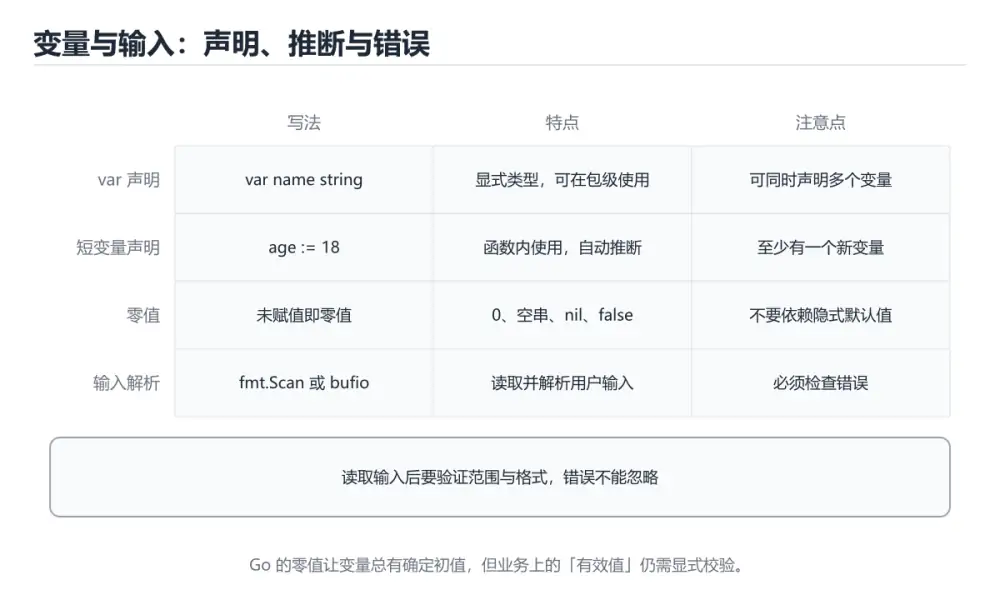
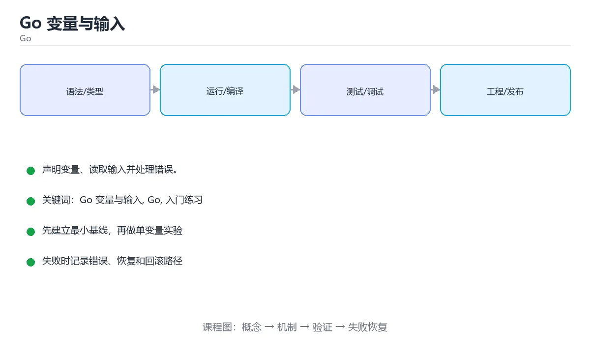

# Go 变量与输入

> 内容更新时间：2026-10-06 · 学习阶段：入门 · 预计用时：40 分钟





## 本节知识框架

**课程定位**：所属分类 `go`（Go），课程主题 `Go 变量与输入`，学习阶段 入门，建议用时 50 分钟。

本课主线：声明变量、读取输入并处理错误。

**学完本课应当能够**
- 说清 `静态类型` 与 `fmt.Scan` 的含义与区别，并各举一个正例和一个反例。
- 用本课示例验证 `零值` 的行为，记录输入、输出与失败条件。
- 遇到「短变量声明意外遮蔽外层变量」这类问题时，能说出触发条件与修复顺序。

### 从概念到验证的学习链条

1. `静态类型`：先掌握 变量类型在编译期确定，不同类型之间需要显式转换，再用它解释 `fmt.Scan` 为什么会出现。
2. `fmt.Scan`：先掌握 从标准输入按空白分隔读取数据，参数要传变量地址，再用它解释 `零值` 为什么会出现。
3. `零值`：先掌握 变量声明后自动得到该类型的零值，如 0、""、nil，再用它解释 `类型转换` 为什么会出现。
4. `类型转换`：先掌握 用 int(x) 这类显式转换，Go 不做隐式类型提升，再用它解释 `错误` 为什么会出现。
5. `错误`：先掌握 错误是普通值，调用方应显式检查，不要把错误丢掉或用 panic 代替可预期的失败，再用它解释 `切片` 为什么会出现。
6. `切片`：先掌握 数组长度固定且属于类型的一部分，切片是动态长度视图，包含指针、长度和容量，再用它解释 本课示例的观察结果 为什么会出现。

**先修与衔接**：本课是「Go」分类的第 2 课。先修内容：《Go 第一个程序》。《Go 第一个程序》里的 `package main`、`func main` 是本课的前提。相关或后续课程：《Go 条件判断》。

### 完成判据

- **定义关**：不看正文也能说明 `静态类型` 是 变量类型在编译期确定，不同类型之间需要显式转换，并指出一个反例。
- **机制关**：能按“输入 → 转换 → 输出 → 验证”复述 `Go 变量与输入`，而不是只背结论。
- **示例关**：能运行或推演 `Go 变量与输入` 的 `go` 示例，并说明一个真实出现的标识符或字面量。
- **证据关**：能指出 `Go 变量与输入` 示例里的 调用了 `main()`，并说明它支持或反驳了本课的哪一条结论。
- **排错关**：能复现 短变量声明意外遮蔽外层变量，记录现象并按 注意短声明的作用域与复用规则 修复。
- **迁移关**：能把 `Go 变量与输入`、`Go`、`入门练习` 放进一个与 `Go 变量与输入` 不同的项目场景，并保持输入与验证条件可追踪。
- **复盘关**：学完 `Go 变量与输入` 后，用一句话写下仍然不确定的结论，并列出下一次验证需要的输入、环境和成功判据。

### 复习清单

- [ ] 能不看正文复述本课核心术语，并指出一个边界或反例。
- [ ] 能运行或推演本课示例，记录输入、输出与失败现象。
- [ ] 能完成一次自测，并把错题对照错误表定位原因。

## 核心概念定义

| 术语 | 操作性定义 | 常见边界与风险 |
| --- | --- | --- |
| 静态类型 | 变量类型在编译期确定，不同类型之间需要显式转换。 | 静态检查只在编译期成立，运行期输入仍需校验。 |
| fmt.Scan | 从标准输入按空白分隔读取数据，参数要传变量地址。 | 结果依赖数据分布、模型版本与算力预算，换数据集或换硬件都要重新评估。 |
| 零值 | 变量声明后自动得到该类型的零值，如 0、""、nil。 | 静态检查只在编译期成立，运行期输入仍需校验。 |
| 类型转换 | 用 int(x) 这类显式转换，Go 不做隐式类型提升。 | 静态检查只在编译期成立，运行期输入仍需校验。 |
| 错误 | 错误是普通值，调用方应显式检查，不要把错误丢掉或用 panic 代替可预期的失败 | 易错：非法输入被当成默认值；正确做法是检查解析错误并提示用户重新输入。 |
| 切片 | 数组长度固定且属于类型的一部分，切片是动态长度视图，包含指针、长度和容量 | 静态检查只在编译期成立，运行期输入仍需校验。 |
| 核心结论 | Go 用 := 在函数内快速声明变量，用 var 声明包级变量；读取输入要处理换行符，转换字符串要显式调用 strconv。 | 只在「Go 用 := 在函数内快速声明变量，用 var 声明包级变量；读取输入要处理换行符，转换字符串要显式调用 strconv」这一前提下成立，换输入或换环境要重新验证。 |
| 最少要写的代码 | `package main` | 只在「`package main`」这一前提下成立，换输入或换环境要重新验证。 |
| 正确做法 | 输入 18 并回车，ReadString 返回带换行的字符串。 | 只在「输入 18 并回车，ReadString 返回带换行的字符串」这一前提下成立，换输入或换环境要重新验证。 |
| 最常见的错误 | 忘记 TrimSpace：Atoi 会因换行字符转换失败，返回错误。 | 只在「忘记 TrimSpace：Atoi 会因换行字符转换失败，返回错误」这一前提下成立，换输入或换环境要重新验证。 |
| 出错先查什么 | 先读第一条报错信息，再回到最小示例只改一个地方 | 只在「先读第一条报错信息，再回到最小示例只改一个地方」这一前提下成立，换输入或换环境要重新验证。 |
| 怎么确认学会了 | 输入 18、abc、空行，观察三种情况下的输出差异。 | 只在「输入 18、abc、空行，观察三种情况下的输出差异」这一前提下成立，换输入或换环境要重新验证。 |
| 和别的知识点的关系 | 本课打下的语法与思维方式会被后面每一课反复用到 | 只在「本课打下的语法与思维方式会被后面每一课反复用到」这一前提下成立，换输入或换环境要重新验证。 |
| 接下来做什么 | 合上教程，凭记忆把上面的最小代码重写一遍再运行 | 只在「合上教程，凭记忆把上面的最小代码重写一遍再运行」这一前提下成立，换输入或换环境要重新验证。 |

## 原理与运行机制

### 机制总览

| 阶段 | 关注对象 | 失败时应检查 |
| --- | --- | --- |
| 输入 | 静态类型 | 类型、范围、编码、版本或前置状态是否满足定义。 |
| 处理 | fmt.Scan | 顺序、可见性、锁、路由、事务或调度规则是否被破坏。 |
| 输出 | 零值 | 结果是否可复现，错误是否被正确传播而不是被吞掉。 |

**教材衔接：一句话入门**

声明变量、读取输入并处理错误。

**教材衔接：Go 语言基础机制速览**

### 包、入口与工具链

Go 程序由包组成，`package main` 加 `func main()` 是可执行程序的入口。`go run` 编译并运行，`go build` 生成二进制，`go test` 运行测试，`go mod` 管理依赖。包名决定导入路径的最后一段，未使用的导入和局部变量会直接导致编译失败，这是 Go 有意保持代码整洁的设计。

### 变量、类型与零值

`var` 用于显式声明，`:=` 用于在函数内短声明并让编译器推断类型。Go 是静态类型语言，不同类型之间不会隐式转换，整数与浮点数、字符串与字节切片都需要显式转换。未初始化的变量会得到零值：数值为 0，字符串为空串，布尔为 false，指针和接口为 nil，切片、map、channel 也是 nil。零值让类型可以直接使用，但写入 nil map 会 panic，读取则返回零值。

### 函数、错误与资源管理

Go 函数可以返回多个值，最常用的组合是结果加 `error`。错误是普通值，调用方应显式检查，不要把错误丢掉或用 panic 代替可预期的失败。`defer` 把清理动作推迟到函数返回时执行，常用于关闭文件、释放锁和记录耗时；多个 defer 按后进先出执行。`panic` 只适合不可恢复的程序错误，`recover` 必须配合 defer 使用，不能把它当作常规异常控制流。

### 切片、map 与循环

数组长度固定且属于类型的一部分，切片是动态长度视图，包含指针、长度和容量。`append` 在容量不足时会分配新底层数组，因此原切片的修改不一定同步；需要独立副本时使用 `copy` 或 `slices.Clone`。map 的键必须可比较，遍历顺序不保证稳定。`range` 遍历切片时复制元素，修改元素要用下标；遍历 map 时可同时取得键和值，但不要依赖顺序。循环变量在旧版本中会被复用，闭包或 goroutine 捕获时要显式复制。

### 并发与上下文

goroutine 是轻量执行单元，channel 用于在 goroutine 之间传递数据。无缓冲 channel 需要发送和接收同时就绪，有缓冲 channel 在缓冲满或空时阻塞。`select` 可以在多个 channel 操作之间选择，配合 `context.Context` 传递取消、超时和请求范围的值。共享内存并发仍然需要 mutex 或原子操作；并发安全不等于业务原子性，复合操作要在同一临界区内完成。

**教材衔接：版本与时效**

- 升级前先用 package 建立基线：记录版本、命令和输出，升级后只比较这些可观察量。
- 模块校验、最小版本选择与供应链安全是生产升级的重点
- 官方发布说明：https://go.dev/doc/devel/release

### 升级检查清单

- 先固定当前版本，跑通全部示例与测验，再升级工具链。
- 一次只改一个版本条件，把 Go 变量与输入 相关的差异单独记成一条结论。
- 升级后重点回归 Go 变量与输入 的默认值、警告信息与错误格式。
- 升级后把 package 的实测版本写进「内容元数据」，再更新复核日期。

### 机制拆解：每一步的输入、动作与输出

#### 1. `静态类型`
- 输入：`Go 变量与输入`；本步把 变量类型在编译期确定，不同类型之间需要显式转换 当作判断规则。
- 动作：围绕 `静态类型` 保留中间状态，并记录它与 `fmt.Scan` 的对应关系。
- 输出：`fmt.Scan`，它可以被下一段代码、测试或记录继续使用。
- `静态类型` 的失败条件：静态检查只在编译期成立，运行期输入仍需校验。

#### 2. `fmt.Scan`
- 输入：`静态类型`；本步把 从标准输入按空白分隔读取数据，参数要传变量地址 当作判断规则。
- 动作：围绕 `fmt.Scan` 保留中间状态，并记录它与 `零值` 的对应关系。
- 输出：`零值`，它可以被下一段代码、测试或记录继续使用。
- `fmt.Scan` 的失败条件：结果依赖数据分布、模型版本与算力预算，换数据集或换硬件都要重新评估。

#### 3. `零值`
- 输入：`fmt.Scan`；本步把 变量声明后自动得到该类型的零值，如 0、""、nil 当作判断规则。
- 动作：围绕 `零值` 保留中间状态，并记录它与 `类型转换` 的对应关系。
- 输出：`类型转换`，它可以被下一段代码、测试或记录继续使用。
- `零值` 的失败条件：静态检查只在编译期成立，运行期输入仍需校验。

#### 4. `类型转换`
- 输入：`零值`；本步把 用 int(x) 这类显式转换，Go 不做隐式类型提升 当作判断规则。
- 动作：围绕 `类型转换` 保留中间状态，并记录它与 `错误` 的对应关系。
- 输出：`错误`，它可以被下一段代码、测试或记录继续使用。
- `类型转换` 的失败条件：静态检查只在编译期成立，运行期输入仍需校验。

#### 5. `错误`
- 输入：`类型转换`；本步把 错误是普通值，调用方应显式检查，不要把错误丢掉或用 panic 代替可预期的失败 当作判断规则。
- 动作：围绕 `错误` 保留中间状态，并记录它与 `切片` 的对应关系。
- 输出：`切片`，它可以被下一段代码、测试或记录继续使用。
- `错误` 的失败条件：当解析输入忽略错误时，会出现非法输入被当成默认值。

#### 6. `切片`
- 输入：`错误`；本步把 数组长度固定且属于类型的一部分，切片是动态长度视图，包含指针、长度和容量 当作判断规则。
- 动作：围绕 `切片` 保留中间状态，并记录它与 `main` 的对应关系。
- 输出：`main`，它可以被下一段代码、测试或记录继续使用。
- `切片` 的失败条件：静态检查只在编译期成立，运行期输入仍需校验。

### 示例中的可观察事实

1. 调用了 `main()`；它对应的课程主题是 `Go 变量与输入`。
2. 调用了 `NewReader()`；它对应的课程主题是 `Go 变量与输入`。
3. 调用了 `Print()`；它对应的课程主题是 `Go 变量与输入`。
4. 调用了 `ReadString()`；它对应的课程主题是 `Go 变量与输入`。
5. 调用了 `TrimSpace()`；它对应的课程主题是 `Go 变量与输入`。
6. 调用了 `Atoi()`；它对应的课程主题是 `Go 变量与输入`。
7. 调用了 `Println()`；它对应的课程主题是 `Go 变量与输入`。
8. 调用了 `Printf()`；它对应的课程主题是 `Go 变量与输入`。

### 复现实验记录

- 环境：`Go 变量与输入` 使用 `go` 示例，固定 `Go 变量与输入`、`Go`、`入门练习` 作为第一组条件。
- 首轮输入：先确认 调用了 `main()`，预测 `静态类型` 会怎样变化。
- 基线观察：记录命令、输入、输出和错误原文，不用截图代替可复制的文本。
- 单变量修改：只改变 `Go 变量与输入`，观察 `切片` 是否仍满足定义。
- 失败注入：复现 短变量声明意外遮蔽外层变量，确认现象是 外层变量没有被赋值。
- 记录结论：把“修改前、修改后、预期变化、实际变化”写成四列表，这样复盘 `Go 变量与输入` 时才能区分概念错误与实现错误。

## 典型应用场景

| 场景 | 典型输入或前提 | 期望产物 |
| --- | --- | --- |
| 学习验证 | 使用本课最小示例和 Go 变量与输入、Go | 能复现正文结论，并解释每一步。 |
| 工程落地 | 把「Go 变量与输入」放入真实模块或服务边界 | 输出可观测、失败可定位、参数可配置。 |
| 故障排查 | 只改一个版本、规模、输入或依赖条件 | 能区分概念错误、实现错误和环境差异。 |

**教材衔接：代码实验：把示例跑成证据**

### 实验一：建立基线

```go
package main

import "fmt"

func main() {
	name := "Ada"
	var year int = 1815
	fmt.Printf("%s born in %d\n", name, year)
}
```

### 实验二：只改一个输入

沿用「Go 变量与输入」的最小示例做一次单变量实验：

做完后用一句话写出「Go 变量与输入」的结论：输入怎么变，结果才怎么变。

### 实验三：制造一个可控错误

声明一个局部变量却不使用，或者删除一个仍然被引用的导入。Go 会把它们当作编译错误；记录错误信息后再恢复。

### 实验四：用三句话复述

1. Go 变量与输入 的输入是什么，哪些取值合法，哪些属于边界或非法范围？
2. package 的执行顺序里，哪一步会写数据或产生外部副作用？
3. 输出如何验证，失败时第一条可观察证据是什么？

- **短变量声明意外遮蔽外层变量**：典型现象是外层变量没有被赋值；正确做法是注意短声明的作用域与复用规则。
- **用字符串拼接大量数据**：典型现象是反复分配导致开销上升；正确做法是改用字符串构建器。
- **解析输入忽略错误**：典型现象是非法输入被当成默认值；正确做法是检查解析错误并提示用户重新输入。

### 最小验证场景

- 准备：保留 `go` 示例的原始输入，先记录 `Go 变量与输入` 的基线输出和完整运行命令。
- 观察：先核对 调用了 `main()`，再改变一个与 `静态类型` 相关的条件。
- 判定：新结果与 `Go 变量与输入` 的基线不同不等于错误；只有当差异破坏了 `静态类型` 的定义或错误表中的约束，才判定为失败。

### 选择与边界

- 使用 `静态类型` 时，先满足它的定义：变量类型在编译期确定，不同类型之间需要显式转换；静态检查只在编译期成立，运行期输入仍需校验。
- 使用 `fmt.Scan` 时，先满足它的定义：从标准输入按空白分隔读取数据，参数要传变量地址；结果依赖数据分布、模型版本与算力预算，换数据集或换硬件都要重新评估。
- 使用 `零值` 时，先满足它的定义：变量声明后自动得到该类型的零值，如 0、""、nil；静态检查只在编译期成立，运行期输入仍需校验。
- 使用 `类型转换` 时，先满足它的定义：用 int(x) 这类显式转换，Go 不做隐式类型提升；静态检查只在编译期成立，运行期输入仍需校验。
- 使用 `错误` 时，先满足它的定义：错误是普通值，调用方应显式检查，不要把错误丢掉或用 panic 代替可预期的失败；易错：非法输入被当成默认值；正确做法是检查解析错误并提示用户重新输入。

## 代码/协议/SQL 示例

### 最小可验证示例

**教材衔接：最小示例**

**教材衔接：预期输出**

```text
Ada born in 1815
```

**运行方式**：运行 `Go 变量与输入` 的示例时，用 `go run 文件名.go` 运行；模块依赖由 `go mod` 管理。

### 示例精读：先找证据，再改一个条件

1. 调用了 `main()`；它出现在 `Go 变量与输入` 的示例中，阅读时先确认它前后各发生了什么。
2. 调用了 `NewReader()`；它出现在 `Go 变量与输入` 的示例中，阅读时先确认它前后各发生了什么。
3. 调用了 `Print()`；它出现在 `Go 变量与输入` 的示例中，阅读时先确认它前后各发生了什么。
4. 调用了 `ReadString()`；它出现在 `Go 变量与输入` 的示例中，阅读时先确认它前后各发生了什么。
5. 调用了 `TrimSpace()`；它出现在 `Go 变量与输入` 的示例中，阅读时先确认它前后各发生了什么。
6. 调用了 `Atoi()`；它出现在 `Go 变量与输入` 的示例中，阅读时先确认它前后各发生了什么。
7. 调用了 `Println()`；它出现在 `Go 变量与输入` 的示例中，阅读时先确认它前后各发生了什么。
8. 调用了 `Printf()`；它出现在 `Go 变量与输入` 的示例中，阅读时先确认它前后各发生了什么。
- 在 `Go 变量与输入` 中与 `静态类型` 对照：示例必须能支持 变量类型在编译期确定，不同类型之间需要显式转换，否则说明这一段还缺少实现或验证步骤。
- 在 `Go 变量与输入` 中与 `fmt.Scan` 对照：示例必须能支持 从标准输入按空白分隔读取数据，参数要传变量地址，否则说明这一段还缺少实现或验证步骤。
- 在 `Go 变量与输入` 中与 `零值` 对照：示例必须能支持 变量声明后自动得到该类型的零值，如 0、""、nil，否则说明这一段还缺少实现或验证步骤。
- 在 `Go 变量与输入` 中与 `类型转换` 对照：示例必须能支持 用 int(x) 这类显式转换，Go 不做隐式类型提升，否则说明这一段还缺少实现或验证步骤。

## 时间/空间复杂度或性能分析

**性能关注点（Go 变量与输入）**：调度器与 GC 影响开销：记录 P99 延迟、协程数量与堆占用，优先用 pprof 采样。

**本课特有开销（Go 变量与输入 · Go 变量与输入）**：小文件看元数据开销，大文件看吞吐，两者要分别测量。

**测量方法**：以 `Go 变量与输入` 的 `Go 变量与输入` 场景为对象，固定输入跑一遍记录基线，再把规模或并发度提高一个数量级复测；两次结果的差值与波动范围才是结论依据。

### 需要控制的变量与记录项

- `Go 变量与输入` 的 `Go 变量与输入`：固定它的版本、输入范围和资源上限，分别记录速度、内存与失败率的变化。
- `Go 变量与输入` 的 `Go`：固定它的版本、输入范围和资源上限，分别记录速度、内存与失败率的变化。
- `Go 变量与输入` 的 `入门练习`：固定它的版本、输入范围和资源上限，分别记录速度、内存与失败率的变化。
- `Go 变量与输入` 中 `静态类型` 的边界：静态检查只在编译期成立，运行期输入仍需校验。达到边界时不要外推，必须重新测量。
- `Go 变量与输入` 中 `fmt.Scan` 的边界：结果依赖数据分布、模型版本与算力预算，换数据集或换硬件都要重新评估。达到边界时不要外推，必须重新测量。
- `Go 变量与输入` 中 `零值` 的边界：静态检查只在编译期成立，运行期输入仍需校验。达到边界时不要外推，必须重新测量。
- `Go 变量与输入` 中 `类型转换` 的边界：静态检查只在编译期成立，运行期输入仍需校验。达到边界时不要外推，必须重新测量。
- `Go 变量与输入` 中 `错误` 的边界：易错：非法输入被当成默认值；正确做法是检查解析错误并提示用户重新输入。达到边界时不要外推，必须重新测量。
- `Go 变量与输入` 的代码证据：先验证 调用了 `main()`，再记录该路径的输入规模与耗时；只看代码行数不能推出复杂度。

## 常见误区与易错点

| 容易写错的做法 | 实际现象 | 原因与正确做法 |
| --- | --- | --- |
| 短变量声明意外遮蔽外层变量 | 外层变量没有被赋值。 | 注意短声明的作用域与复用规则。 |
| 用字符串拼接大量数据 | 反复分配导致开销上升。 | 改用字符串构建器。 |
| 解析输入忽略错误 | 非法输入被当成默认值。 | 检查解析错误并提示用户重新输入。 |

### 现场 1：短变量声明意外遮蔽外层变量

**症状**：外层变量没有被赋值。

**根因与修复**：注意短声明的作用域与复用规则。

**自检**：在本课示例里复现「短变量声明意外遮蔽外层变量」，改成注意短声明的作用域与复用规则后重跑；如果症状消失且失败路径按预期变化，说明定位正确。

### 现场 2：用字符串拼接大量数据

**症状**：反复分配导致开销上升。

**根因与修复**：改用字符串构建器。

**自检**：在本课示例里复现「用字符串拼接大量数据」，改成改用字符串构建器后重跑；如果症状消失且失败路径按预期变化，说明定位正确。

### 现场 3：解析输入忽略错误

**症状**：非法输入被当成默认值。

**根因与修复**：检查解析错误并提示用户重新输入。

**自检**：在本课示例里复现「解析输入忽略错误」，改成检查解析错误并提示用户重新输入后重跑；如果症状消失且失败路径按预期变化，说明定位正确。

## 与其他知识点的关系

**教材衔接：复习与迁移**

### 概念复述

- 用一句话说明「Go 变量与输入」解决什么问题：声明变量、读取输入并处理错误。
- 写出Go 变量与输入、Go、入门练习之间的关系，并各举一个例子。
- 说出本课最容易混淆的两个概念，以及区分它们的判据。

### 正文逐节复核

- **Go 语言基础机制速览**：Go 程序由包组成，`package main` 加 `func main()` 是可执行程序的入口。
- **实践任务**：本节围绕Go 变量与输入安排 3 个可交付任务，每个任务都要求留下可以复查的记录。


### 迁移练习

把「Go 变量与输入」的结论迁移到相邻主题，每次迁移都写清预测与证据：

1. 换输入：用Go 变量与输入处理一组你自己的数据，对比教材示例的结果差异。
2. 换失败条件：制造一个Go相关的错误，说明如何从错误信息定位根因。
3. 换规模：把数据量或并发度提高一个数量级，说明「Go 变量与输入」的结论是否仍成立。

- **先修**：`Go 第一个程序`。本课默认这些内容已经掌握。
- **相关或后续**：`Go 条件判断`。本课术语会在这些课程里继续使用。
- **术语归属**：`静态类型`、`fmt.Scan`、`零值` 的定义以本课「核心概念定义」为准，换到其他课程时先确认定义是否被改写。
- 同一分类的《Go 第一个程序》也涉及 `Go`；两课衔接时先确认这个术语的定义是否一致。
- 同一分类的《Go 条件判断》也涉及 `Go`；两课衔接时先确认这个术语的定义是否一致。

### 先修与后续术语接口

- `Go 第一个程序`：共享术语 `零值`，共同关键词 `Go`、`入门练习`。
- `Go 条件判断`：共同关键词 `Go`、`入门练习`。

### 容易混淆的相邻概念

- `静态类型` 与 `fmt.Scan`：前者强调 变量类型在编译期确定，不同类型之间需要显式转换；后者强调 从标准输入按空白分隔读取数据，参数要传变量地址。判断时分别检查两条定义的适用范围，不要只看名称相似就互换。
- `fmt.Scan` 与 `零值`：前者强调 从标准输入按空白分隔读取数据，参数要传变量地址；后者强调 变量声明后自动得到该类型的零值，如 0、""、nil。判断时分别检查两条定义的适用范围，不要只看名称相似就互换。
- `零值` 与 `类型转换`：前者强调 变量声明后自动得到该类型的零值，如 0、""、nil；后者强调 用 int(x) 这类显式转换，Go 不做隐式类型提升。判断时分别检查两条定义的适用范围，不要只看名称相似就互换。
- `类型转换` 与 `错误`：前者强调 用 int(x) 这类显式转换，Go 不做隐式类型提升；后者强调 错误是普通值，调用方应显式检查，不要把错误丢掉或用 panic 代替可预期的失败。判断时分别检查两条定义的适用范围，不要只看名称相似就互换。
- `错误` 与 `切片`：前者强调 错误是普通值，调用方应显式检查，不要把错误丢掉或用 panic 代替可预期的失败；后者强调 数组长度固定且属于类型的一部分，切片是动态长度视图，包含指针、长度和容量。判断时分别检查两条定义的适用范围，不要只看名称相似就互换。

## 自测题与参考答案

> 先独立作答，再对照参考答案；答案都能在本课正文、术语表或错误表里找到依据。

### 自测 1（概念复述）

不看正文，写出 `静态类型` 的操作性定义，并说明它与 `fmt.Scan` 的区别。

**参考答案**：变量类型在编译期确定，不同类型之间需要显式转换。

`fmt.Scan` 的定位是：从标准输入按空白分隔读取数据，参数要传变量地址；两者的差别要从适用对象与失败模式上说明。

### 自测 2（排错）

本课错误表记录了「短变量声明意外遮蔽外层变量」这类做法。请写出它会出现的现象、根因，以及修复顺序。

**参考答案**：现象是外层变量没有被赋值；正确做法是注意短声明的作用域与复用规则。修复时先复现现象并保留证据，再改动一处假设重跑，确认现象消失。

### 自测 3（动手验证）

运行本课的 `go` 示例，把其中的 `"bufio"` 换成一个边界值后重新运行，记录输出与错误信息。

**参考答案**：正常输入下 `go` 示例应当复现正文给出的结果；把 `"bufio"` 换成边界值后，如果结果改变或报错，先核对它是否满足 `Go 变量与输入` 中`静态类型` 的适用范围，再检查错误表里是否有同类现象。

### 自测 4（代码阅读）

阅读本课开头的 `go` 示例，说明它体现了`静态类型` 的哪一条性质，并指出改动哪个输入会让这条性质不再成立。

**参考答案**：`静态类型` 的定义是 变量类型在编译期确定，不同类型之间需要显式转换，示例正是在实现这条定义。改动与 `静态类型` 有关的一个输入后，如果结果不再符合 `Go 变量与输入` 的正文描述，就说明该性质只在当前前提成立。

### 自测 5（迁移）

把 `Go 变量与输入` 的方法迁移到自己的项目：围绕 `静态类型` 写出一个与错误表同类的风险点，并说明触发条件和检验方式。

**参考答案**：例如「解析输入忽略错误」，它会导致非法输入被当成默认值；检验方式是按检查解析错误并提示用户重新输入改一处再复现，确认现象消失且没有引入新的失败分支。

### 自测 6（对比）

用一个表格对比 `静态类型` 与 `fmt.Scan`：各写一行适用场景、一行失败表现。

**参考答案**：`静态类型` 的定义是变量类型在编译期确定，不同类型之间需要显式转换；`fmt.Scan` 的定义是从标准输入按空白分隔读取数据，参数要传变量地址。两者的失败表现分别对应本课错误表里与本术语相关的行。

### 自测 7（排错顺序）

面对「短变量声明意外遮蔽外层变量」引发的问题，请把“复现 外层变量没有被赋值 → 保留证据 → 注意短声明的作用域与复用规则 → 回归验证”四步写成可执行的检查清单。

**参考答案**：第一步按外层变量没有被赋值复现；第二步记录输入、版本与完整报错；第三步按注意短声明的作用域与复用规则只改一处；第四步重跑并确认失败路径也按预期变化。

### 自测 8（边界判断）

针对 `切片`，分别写出“可以使用”的条件和“结论不再成立”的条件。

**参考答案**：静态检查只在编译期成立，运行期输入仍需校验。 同时要把 `切片` 的定义 数组长度固定且属于类型的一部分，切片是动态长度视图，包含指针、长度和容量 与实际输入逐项对照。

### 自测 9（机制重建）

不看正文，按输入、转换、输出、验证四段重建 `静态类型` → `fmt.Scan` → `零值` → `类型转换` 的作用链。

**参考答案**：起点是 `静态类型` 的定义 变量类型在编译期确定，不同类型之间需要显式转换；中间每一步都保留可观察状态；终点由 `切片` 检查，失败时回到错误表定位第一个偏离定义的步骤。

### 自测 10（综合排错）

在 `Go 变量与输入` 中，现象是 非法输入被当成默认值。请围绕 解析输入忽略错误 写出最小复现、关键证据、修复动作和回归验证，并说明为什么不能只凭一次运行下结论。

**参考答案**：先复现 解析输入忽略错误，记录输入与完整错误；再按 检查解析错误并提示用户重新输入 只改一处。回归时同时跑正常路径和边界路径，只有两次结果都可解释，才把修复视为完成。

### 自测 11（一分钟复述）

用每分钟约 200 字的速度复述 `Go 变量与输入`：先给主问题，再按顺序说出 `静态类型`、`fmt.Scan`、`零值`、`类型转换`，最后给一个失败案例。

**自评标准**：主问题必须对应 声明变量、读取输入并处理错误；每个术语都要能接上一句定义或边界；失败案例必须写成可观察现象，不能用“可能有风险”代替证据。

## 术语速查

| 术语 | 一句话说明 |
| --- | --- |
| `静态类型` | 变量类型在编译期确定，不同类型之间需要显式转换。 |
| `fmt.Scan` | 从标准输入按空白分隔读取数据，参数要传变量地址。 |
| `零值` | 变量声明后自动得到该类型的零值，如 0、""、nil。 |
| `类型转换` | 用 int(x) 这类显式转换，Go 不做隐式类型提升。 |
| `错误` | 错误是普通值，调用方应显式检查，不要把错误丢掉或用 panic 代替可预期的失败。 |
| `切片` | 数组长度固定且属于类型的一部分，切片是动态长度视图，包含指针、长度和容量。 |

**术语关系**：`静态类型`（变量类型在编译期确定） → `fmt.Scan`（从标准输入按空白分隔读取数据） → `零值`（变量声明后自动得到该类型的零值） → `类型转换`（用 int(x) 这类显式转换）。

## 考点精讲

`Go 变量与输入` 的题库有 6 道题，下面逐题给出题干、正确项与判断依据：先自己作答，再核对正确项，最后回到正文对应小节复核。

### 考点 1：第 1 题

- **题目**：围绕“Go 变量与输入”中的 Go 变量与输入、Go、入门练习，下列哪两项是本课强调的实践判断？
- **正确项**：验证 Go 时要固定版本并覆盖边界输入，结论才可复现；学习 Go 变量与输入 时要同时说明输入、输出和失败路径，不能只看正常流程
- **判断依据**：这道题检验本课主问题：声明变量、读取输入并处理错误。复习时先复述本课主问题，再举一个会让结论失效的输入。

### 考点 2：第 2 题

- **题目**：Go 中声明 var count int 后，count 的初始值是什么？
- **正确项**：0，Go 会为数值类型赋予零值
- **判断依据**：这道题落在术语 `零值` 上：变量声明后自动得到该类型的零值，如 0、""、nil。复习时把 `零值` 的定义、适用边界和一个反例一起说清楚，再回到「核心概念定义」核对原文。

### 考点 3：第 3 题

- **题目**：Go 中读取输入的函数通常会返回什么，为什么不能忽略？
- **正确项**：返回读取数量与 error，忽略 error 会掩盖输入失败
- **判断依据**：这道题检验本课主问题：声明变量、读取输入并处理错误。复习时先复述本课主问题，再举一个会让结论失效的输入。

### 考点 4：第 4 题

- **题目**：示例中 name 与 year 的输出结果是什么？
- **正确项**：Ada born in 1815，按格式串依次替换两个变量
- **判断依据**：这道题检验本课主问题：声明变量、读取输入并处理错误。复习时先复述本课主问题，再举一个会让结论失效的输入。

### 考点 5：第 5 题

- **题目**：填空：补齐下面这段术语说明中的空缺。课程 `声明变量、读取输入并处理错误。`，这段说明是：`____`：用 int(x) 这类显式转换，Go 不做隐式类型提升。空缺处应填哪个术语？
- **正确项**：类型转换
- **判断依据**：这道题落在术语 `类型转换` 上：用 int(x) 这类显式转换，Go 不做隐式类型提升。复习时把 `类型转换` 的定义、适用边界和一个反例一起说清楚，再回到「核心概念定义」核对原文。

### 考点 6：第 6 题

- **题目**：`Go 变量与输入` 的示例代码服务于“声明变量、读取输入并处理错误。”。哪一条判断是正确的？
- **正确项**：:= 只能在函数内使用并自动推断类型，var 可用于包级
- **判断依据**：这道题落在术语 `错误` 上：错误是普通值，调用方应显式检查，不要把错误丢掉或用 panic 代替可预期的失败。复习时把 `错误` 的定义、适用边界和一个反例一起说清楚，再回到「核心概念定义」核对原文。

### 考点 7：`静态类型`

- **要点**：变量类型在编译期确定，不同类型之间需要显式转换。
- **静态类型 的边界**：静态检查只在编译期成立，运行期输入仍需校验。

### 考点 8：`fmt.Scan`

- **要点**：从标准输入按空白分隔读取数据，参数要传变量地址。
- **fmt.Scan 的边界**：结果依赖数据分布、模型版本与算力预算，换数据集或换硬件都要重新评估。

### 考点 9：`零值`

- **要点**：变量声明后自动得到该类型的零值，如 0、""、nil。
- **零值 的边界**：静态检查只在编译期成立，运行期输入仍需校验。

### 考点 10：`类型转换`

- **要点**：用 int(x) 这类显式转换，Go 不做隐式类型提升。
- **类型转换 的边界**：静态检查只在编译期成立，运行期输入仍需校验。

### 考点 11：`错误`

- **要点**：错误是普通值，调用方应显式检查，不要把错误丢掉或用 panic 代替可预期的失败
- **错误 的边界**：易错：非法输入被当成默认值；正确做法是检查解析错误并提示用户重新输入。

### 考点 12：`切片`

- **要点**：数组长度固定且属于类型的一部分，切片是动态长度视图，包含指针、长度和容量
- **切片 的边界**：静态检查只在编译期成立，运行期输入仍需校验。

### 考点 13：排错——短变量声明意外遮蔽外层变量

- **现象**：外层变量没有被赋值。
- **处理**：注意短声明的作用域与复用规则。

### 考点 14：排错——用字符串拼接大量数据

- **现象**：反复分配导致开销上升。
- **处理**：改用字符串构建器。

### 考点 15：综合辨析——`静态类型` 与 `切片`

- **辨析点**：`静态类型` 的定义是 变量类型在编译期确定，不同类型之间需要显式转换；`切片` 的定义是 数组长度固定且属于类型的一部分，切片是动态长度视图，包含指针、长度和容量。
- **答题要求**：面对 `Go 变量与输入` 的题目，先判断描述的是 `静态类型` 还是 `切片`，再归到对应定义，最后写出一个会让该定义失效的边界输入。

### 考点 16：排错评分点

- **现象分**：能写出 外层变量没有被赋值，而不是只写“程序有错”。
- **证据分**：保留触发 短变量声明意外遮蔽外层变量 的输入、版本和错误原文。
- **修复分**：按 注意短声明的作用域与复用规则 只改一处，并同时回归正常路径与边界路径。

## 内容元数据

- 内容版本：v2.0
- 最后更新：2026-10-06
- 学习阶段：入门
- 适用环境：Go 1.24+；本课聚焦 Go 变量与输入。
- 内容来源：内置结构化课程与工程实践整理
- 相关主题：Go 变量与输入、Go、入门练习
- 质量版本：P0 测验标准 + P1 覆盖扩展 + P2 体验补全

## 参考资料与复核

- 最后复核：2026-10-04
- 下次复核：2027-04-10
- 复核范围：版本兼容、API 行为、安全建议与工程实践
- 来源性质：官方文档、标准或权威教材；本课核对关键词：Go 变量与输入、Go、入门练习。

| 参考资料 | 本课用途 |
| --- | --- |
| [Effective Go](https://go.dev/doc/effective_go) | 惯用写法与接口设计 |
| [Go 并发](https://go.dev/talks/2012/concurrency.slide) | goroutine 与 channel |
| [net/http](https://pkg.go.dev/net/http) | HTTP 客户端与服务端 |

| [本课术语索引：Go 变量与输入](#核心概念定义) | 按本课输入、术语边界和错误表现逐项核对 |
> 「Go 变量与输入」的链接用于离线阅读后的延伸核对；App 不会自动联网。