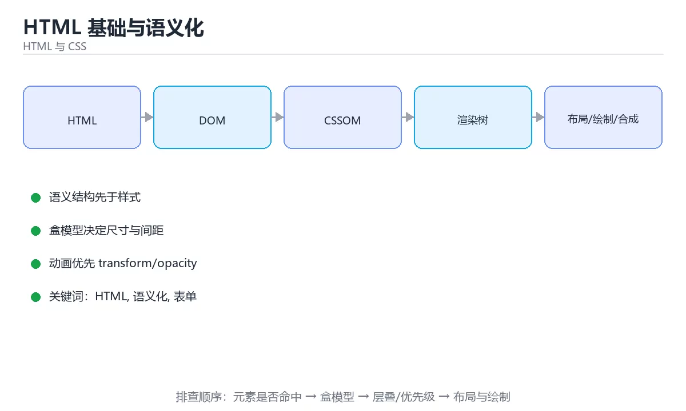

# HTML 基础与语义化



> 内容更新时间：2026-10-03 · 学习阶段：入门 · 预计用时：15 分钟

## 学习目标

- 能用自己的话解释「HTML 基础与语义化」解决了什么问题，而不是只背术语。
- 能说清 「HTML」、「语义化」、「表单」、「可访问性」 之间的关系，并分别举出一个例子。
- 能把本课知识放回「HTML 与 CSS」的知识体系，说明它和相邻主题的边界。
- 能完成本课练习，并用验收标准检查自己的结果。

> 一句话摘要：文档结构、语义标签、表单与可访问性。

## 前置知识

- 会进行基本的文件、命令行或浏览器操作；遇到不熟悉的术语先查本课关键词。
- 本课阶段：入门。只需要基本计算机操作，不要求编程经验。
- 开始前先复习：HTML、语义化、表单。
- 如果某一步看不懂，先记录具体卡点，完成练习后再回头读一遍。


## 文档结构

```text
<!doctype html>
<html lang="zh-CN">
  <head> meta charset / viewport / title / link </head>
  <body> 页面内容 </body>
</html>
```

`lang` 影响屏幕阅读器与拼写检查；`viewport` 是移动端适配的前提；`charset=utf-8` 必须在 head 前 1024 字节内声明，否则中文可能乱码。

## 语义化标签

| 标签 | 用途 |
| --- | --- |
| header / footer / nav / main | 页面结构与导航 |
| section / article / aside | 内容分区与独立文章 |
| h1~h6 | 标题层级，一篇页面通常只有一个 h1 |
| figure / figcaption | 插图与说明 |
| button / a | 按钮用 button，跳转用 a（可键盘操作、可被辅助技术识别） |

用 `div` 堆页面叫"div 汤"：语义化标签能带来更好的可访问性、SEO 与代码可读性。

## 常用元素与属性

列表 `ul/ol/dl`、表格 `table/thead/tbody/th`、表单 `form/input/label/select/textarea`、多媒体 `img/audio/video/source`。要点：`img` 必须写 `alt`（装饰性图片写空 alt）；`label` 关联 `for` 与 `id`；`required`/`type`/`inputmode` 提升移动端体验。

## 可访问性基础

1. 用语义标签而非只靠 CSS 表达结构。
2. 所有交互元素可键盘操作（Tab 顺序、:focus 可见）。
3. 图片有 alt、表单有 label、颜色对比度 ≥ 4.5:1。
4. 需要时用 ARIA 补充（优先用原生语义，ARIA 是补丁不是替代）。

## 常用标签速查与骨架

一张典型页面的最小骨架：`<!doctype html>` → `<html lang="zh-CN">` → `<head>`（charset、viewport、title、description、link）→ `<body>`（header/nav/main/section/footer）。

| 需求 | 标签 | 关键属性 |
| --- | --- | --- |
| 跳转链接 | a | href、target、rel="noopener" |
| 图片 | img | src、alt、width/height、loading="lazy" |
| 表单输入 | input | type、name、required、placeholder、autocomplete |
| 下拉选择 | select + option | multiple、disabled |
| 多行文本 | textarea | rows、maxlength |
| 按钮 | button | type="button/submit"（默认 submit 易误触发表单） |
| 折叠内容 | details + summary | open |
| 语义容器 | header/main/section/article/nav/footer | 无 |

易错点：`label` 的 `for` 必须等于输入框 `id`；同一表单里多个 submit 按钮要用 `formaction` 区分；`img` 不给宽高会导致布局抖动（CLS）。

## 本课小结
HTML 的核心是**语义与结构**：正确的标签本身就在描述内容，CSS 负责外观、JS 负责行为，三者职责不要混淆。

<!-- appendix:v1 -->

## 语义标签速查

| 标签 | 用途 | 注意 |
| --- | --- | --- |
| `header` / `footer` | 页头与页脚 | 可出现在 section 内 |
| `nav` | 导航链接区 | 主要导航用一次为主 |
| `main` | 页面唯一主体 | 一页只应有一个 |
| `section` | 有主题的内容块 | 通常带标题 |
| `article` | 可独立分发的内容 | 文章、卡片、评论 |
| `aside` | 侧边或补充内容 | 与主体相关但可独立 |
| `figure` / `figcaption` | 图与说明 | 图片加题注的标准写法 |
| `button` | 可点击操作 | 非跳转一律用按钮 |
| `a` | 跳转链接 | 必须有有效 `href` |

## 表单与可访问性速查

| 需求 | 写法 |
| --- | --- |
| 关联标签 | `<label for="email">邮箱</label><input id="email">` |
| 输入类型 | `type="email"`、`tel`、`number`、`date` |
| 必填与校验 | `required`、`minlength`、`pattern` |
| 提示说明 | `aria-describedby` 指向说明元素 |
| 错误提示 | `aria-invalid` 与错误文本容器 |
| 图片替代文本 | `alt` 描述内容；纯装饰用 `alt=""` |
| 按钮语义 | `<button type="button">` 避免误提交 |
| 跳过导航 | 页首提供「跳到主内容」链接 |
| 键盘可达 | 保留可见焦点样式，不设 `outline: none` |

```html
<!DOCTYPE html>
<html lang="zh-CN">
  <head>
    <meta charset="utf-8" />
    <meta name="viewport" content="width=device-width, initial-scale=1" />
    <title>课程详情</title>
    <meta name="description" content="离线可用的计算机与编程学习课程" />
  </head>
  <body>
    <a class="skip-link" href="#main">跳到主内容</a>
    <header>
      <nav aria-label="主导航">
        <a href="/">首页</a>
        <a href="/learn" aria-current="page">学习</a>
      </nav>
    </header>
    <main id="main">
      <article>
        <h1>Flutter 基础</h1>
        <figure>
          
          <figcaption>Widget 树结构示意</figcaption>
        </figure>
        <form>
          <label for="note">学习笔记</label>
          <textarea id="note" name="note" aria-describedby="note-hint"></textarea>
          <p id="note-hint">最多 200 字，保存在本机。</p>
          <button type="submit">保存</button>
        </form>
      </article>
    </main>
    <footer><p>© 2025 计算机与编程学习</p></footer>
  </body>
</html>
```

## 常见错误对照表

| 容易踩的做法 | 实际现象 | 原因与正确做法 |
| --- | --- | --- |
| 用 `div` 做所有结构 | 屏幕阅读器无法理解 | 用语义标签 |
| 用 `<a href="#">` 当按钮 | 键盘与语义异常 | 用 `<button>` |
| 图片不写 `alt` | 无障碍不达标 | 内容图描述，装饰图留空 |
| 多个 `<h1>` 或跳级标题 | 结构混乱 | 按层级递进，一页一个主标题 |
| 缺少 `lang` 属性 | 朗读与断词异常 | `<html lang="zh-CN">` |
| 忘记 `viewport` | 移动端缩放异常 | 加标准 viewport meta |
| 表单元素没有 `label` | 点击区域小、可访问性差 | 用 `for` 关联 |
| `outline: none` 去焦点 | 键盘用户无法定位 | 保留或用 `:focus-visible` 自定义 |
| 用表格做布局 | 语义错误、响应式差 | 用 Flex 或 Grid |
| 纯图标按钮无 `aria-label` | 读屏无法识别 | 加可访问名称 |

## 自测清单

- [ ] 页面结构使用语义标签，`main` 唯一。
- [ ] 所有表单控件都有 `label`。
- [ ] 图片有恰当的 `alt`。
- [ ] 键盘可完整操作且焦点可见。
- [ ] 有 `lang`、`viewport`、`title` 与 `description`。

## 动手练习

<!-- practice-diversified:v1 -->

> 本课练习重点：围绕「HTML、语义化、表单」完成复述、实验和交付，每个结果都要能被别人检查。

先写最小语义结构，再调整布局与样式，最后检查键盘、窄屏和对比度。

### 练习 1：建立心智模型（10 分钟）

合上教程，用 3～5 句话回答：

1. 「HTML 基础与语义化」解决了什么问题？
2. 如果没有它，会出现什么具体后果？
3. 它和「语义化」是什么关系？

**验收标准**：至少出现一个本课关键词，并写出一个反例、边界条件或失效场景。

### 练习 2：做一次可控实验（20 分钟）

从正文中选一个最小示例，完成以下操作：

1. 先预测修改一个参数、输入或步骤后的结果。
2. 再实际执行或逐步推演，记录真实结果。
3. 如果结果与预测不同，写出差异原因。

**验收标准**：留下「原例 → 改动 → 预测 → 结果 → 原因」五步记录。

### 练习 3：交付一个小结果（30 分钟）

做一个只有标题、卡片和按钮的最小页面，并用浏览器设备模式检查窄屏。

任务要求：

- 结果必须能被别人检查，不能只写“我已经理解了”。
- 至少覆盖「HTML」和「语义化」两个关键词。
- 写出 1 个仍然不确定的问题，以及下一步如何验证。

> 提示：时间有限时优先做练习 1 和练习 2；练习 3 可以拆成两次完成。

<!-- scaffold:v1 -->

<!-- p2-enrichment:v1 -->

## English Overview

**Title:** HTML & Semantics

**Summary:** Structure, semantic tags, forms and a11y.

**Category:** HTML & CSS  
**Level:** 入门  
**Key terms:** HTML, 语义化, 表单, 可访问性

> The full tutorial is written in Chinese. This bilingual overview helps English readers identify the topic, scope and key terms before studying the detailed examples.

## 内容元数据

- 内容版本：v2.0
- 最后更新：2026-10-03
- 学习阶段：入门
- 适用环境：现代浏览器（Chrome/Firefox/Safari）
- 内容来源：内置结构化课程与工程实践整理
- 相关主题：HTML、语义化、表单、可访问性
- 质量版本：P0 测验标准 + P1 覆盖扩展 + P2 体验补全

<!-- top50-rewrite:v1 -->

## 课程专属精读：HTML 基础与语义化

### 一、知识地图

| 主题 | 核心要点 | 验证方式 |
| --- | --- | --- |
| 文档结构 | <!doctype html> <html lang="zh-CN"> <head> meta charset / viewport / title / link </head… | 运行示例 + 换一个边界输入 |
| 语义化标签 | 用 div 堆页面叫"div 汤"：语义化标签能带来更好的可访问性、SEO 与代码可读性。 | 复述要点 + 举一个反例 |
| 常用元素与属性 | 列表 ul/ol/dl、表格 table/thead/tbody/th、表单 form/input/label/select/textarea、多媒体 img/audio/vi… | 复述要点 + 举一个反例 |
| 可访问性基础 | 用语义标签而非只靠 CSS 表达结构。 | 复述要点 + 举一个反例 |

### 二、机制与验证

1. **文档结构**：<!doctype html> <html lang="zh-CN"> <head> meta charset / viewport / title / link </head… 验证方式：先原样运行示例，再把输入换成边界值，对照输出差异。
2. **语义化标签**：用 div 堆页面叫"div 汤"：语义化标签能带来更好的可访问性、SEO 与代码可读性。 验证方式：先复述要点，再举一个反例说明边界。
3. **常用元素与属性**：列表 ul/ol/dl、表格 table/thead/tbody/th、表单 form/input/label/select/textarea、多媒体 img/audio/vi… 验证方式：先复述要点，再举一个反例说明边界。
4. **可访问性基础**：用语义标签而非只靠 CSS 表达结构。 验证方式：先复述要点，再举一个反例说明边界。

### 三、专属检查问题

1. 「文档结构」要解决什么问题？请用一句话说明，并给出一个具体例子。
2. 「语义化标签」的输入和输出分别是什么？
3. 「常用元素与属性」最常见的失败方式是什么？如何定位？
4. 「可访问性基础」的适用边界在哪里？什么情况下不该使用？

### 四、故障排查

1. 固定输入和环境，确认问题能稳定复现。
2. 找到第一个异常状态，不从最终错误倒推。
3. 每次只改一个变量，记录预测和真实结果。
4. 修复后补边界、失败与重复执行三类测试。

## 专属复习题库

**问：文档结构的核心要点是什么？**

答：<!doctype html> <html lang="zh-CN"> <head> meta charset / viewport / title / link </head…

**问：语义化标签的核心要点是什么？**

答：用 div 堆页面叫"div 汤"：语义化标签能带来更好的可访问性、SEO 与代码可读性。

**问：常用元素与属性的核心要点是什么？**

答：列表 ul/ol/dl、表格 table/thead/tbody/th、表单 form/input/label/select/textarea、多媒体 img/audio/vi…

**问：可访问性基础的核心要点是什么？**

答：用语义标签而非只靠 CSS 表达结构。

## 逐步练习：HTML 基础与语义化

### 练习 1：文档结构

1. 不看原文，用自己的话复述：<!doctype html> <html lang="zh-CN"> <head> meta charset / viewport / title / link </head…
2. 跑通本课示例，再把其中一个输入换成边界值，记录输出差异。
3. 把结论写成两行笔记：一行结论，一行验证方式。

### 练习 2：语义化标签

1. 不看原文，用自己的话复述：用 div 堆页面叫"div 汤"：语义化标签能带来更好的可访问性、SEO 与代码可读性。
2. 举一个正例和一个反例，说明边界在哪里。
3. 把结论写成两行笔记：一行结论，一行验证方式。

### 练习 3：常用元素与属性

1. 不看原文，用自己的话复述：列表 ul/ol/dl、表格 table/thead/tbody/th、表单 form/input/label/select/textarea、多媒体 img/audio/vi…
2. 举一个正例和一个反例，说明边界在哪里。
3. 把结论写成两行笔记：一行结论，一行验证方式。

### 练习 4：可访问性基础

1. 不看原文，用自己的话复述：用语义标签而非只靠 CSS 表达结构。
2. 举一个正例和一个反例，说明边界在哪里。
3. 把结论写成两行笔记：一行结论，一行验证方式。

## 故障排查手册：HTML 基础与语义化

| 现象 | 优先检查 | 修复动作 |
| --- | --- | --- |
| 「文档结构」的结果与预期不符 | 输入、环境、依赖版本、日志里的第一条错误 | 固定最小复现，只改一个变量并回归 |
| 「语义化标签」的结果与预期不符 | 输入、环境、依赖版本、日志里的第一条错误 | 固定最小复现，只改一个变量并回归 |
| 「常用元素与属性」的结果与预期不符 | 输入、环境、依赖版本、日志里的第一条错误 | 固定最小复现，只改一个变量并回归 |
| 「可访问性基础」的结果与预期不符 | 输入、环境、依赖版本、日志里的第一条错误 | 固定最小复现，只改一个变量并回归 |

## 自测与面试：HTML 基础与语义化

1. 「文档结构」的输入和输出分别是什么？
2. 「语义化标签」最常见的失败方式是什么？如何定位？
3. 「常用元素与属性」的适用边界在哪里？什么情况下不该使用？
4. 「可访问性基础」和相邻主题相比，最关键的差别是什么？

## 专属进阶任务 5：HTML 基础与语义化

把本课 4 个主题串成一个小练习：选其中一个主题做出可运行的例子，再为另外两个主题各写一条边界用例，最后用一句话说明你的验证结论。

### 验收标准

- 例子可以独立运行，输出与预期一致。
- 两条边界用例都说清了输入、预期与实际结果。
- 验证结论用一句话写清，不依赖“感觉正确”。

<!-- p2-references:v1 -->
## 参考资料与复核

- 最后复核：2026-10-04
- 下次复核：2027-04-04
- 复核范围：版本兼容、API 行为、安全建议与工程实践
- 来源性质：官方文档与标准；本课正文为离线教学重组，不复制原文

| 参考资料 | 本课用途 |
| --- | --- |
| [MDN Web Docs](https://developer.mozilla.org/docs/Web) | HTML、CSS 与浏览器行为 |
| [W3C Standards](https://www.w3.org/TR/) | Web 标准与可访问性规范 |

> 本课主题：文档结构、语义标签、表单与可访问性。

> App 完全离线展示文字链接，不会自动联网；需要延伸阅读时可复制链接到浏览器。

