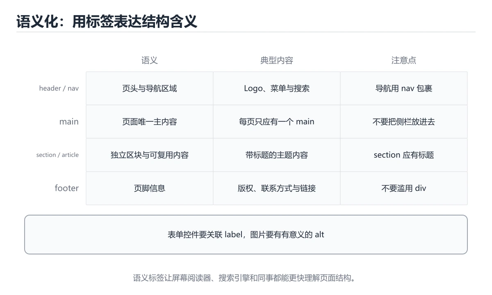

# HTML 基础与语义化

> 内容更新时间：2026-10-06 · 学习阶段：入门 · 预计用时：40 分钟




## 本节知识框架

**课程定位**：所属分类为「HTML 与 CSS」，课程主题为「HTML 基础与语义化」，学习阶段为「入门」，建议用时 40 分钟。

**本课要解决的主问题**：文档结构、语义标签、表单与可访问性。

| 学习层次 | 要回答的问题 | 完成判据 |
| --- | --- | --- |
| 概念层 | 「HTML 基础与语义化」有哪些必须区分的对象与术语？ | 能用自己的话定义核心术语，并各举一个正例和一个反例。 |
| 机制层 | 这些对象按什么顺序发生作用，输入如何变成输出？ | 能画出或写出机制步骤，并说明每一步的失败条件。 |
| 应用层 | 什么场景适合使用「HTML 基础与语义化」，什么场景不适合？ | 能给出一个真实场景、一个最小示例和一个边界案例。 |
| 性能层 | 时间、空间、吞吐或延迟受哪些量影响？ | 能说出复杂度或性能瓶颈的证据来源；没有证据时明确写“材料未提供”。 |
| 复习层 | 怎样确认自己不是只记住了结论？ | 能独立完成本课自测，并把错误定位到概念、机制、示例或边界。 |

### 阅读路线

1. 先读「核心概念定义」，建立「HTML」等对象的精确定义。
2. 再读「原理与运行机制」，把定义串成可重复的过程。
3. 用「代码/协议/SQL 示例」验证过程，并只改一个条件观察结果变化。
4. 最后检查性能、易错点、知识关系与自测题，形成可复习的证据链。

**前置知识**：没有硬性先修课；仍建议先具备本分类的基础阅读与操作能力。

**学习位置**：本课位于《HTML 标签入门》之后；如果前一课的自测不能通过，应先回补再继续。

**后续衔接**：下一课《CSS 基础：选择器与盒模型》会继续使用本课术语，学完后建议立即完成一次自测。

**教材衔接：学习目标**

- 能用自己的话解释HTML 基础与语义化解决了什么问题，而不是只背术语。
- 能说清 「HTML」、「语义化」、「表单」、「可访问性」 之间的关系，并分别举出一个例子。
- 能把 HTML 放回「HTML 基础与语义化」的知识体系，说明它和 语义化 的边界。
- 能完成本课练习，并用验收标准检查自己的结果。

> 一句话摘要：文档结构、语义标签、表单与可访问性。

**教材衔接：前置知识**

- 会进行基本的文件、命令行或浏览器操作；遇到不熟悉的术语先查 HTML 的词条。
- 本课阶段：入门。只需要基本计算机操作，不要求编程经验。
- 开始前先复习：HTML、语义化、表单。
- 看不懂就直接缩小例子：只保留 HTML 相关的两行输入，跑通后再加回其余部分。

**教材衔接：本课小结**

HTML 的核心是**语义与结构**：正确的标签本身就在描述内容，CSS 负责外观、JS 负责行为，三者职责不要混淆。

## 核心概念定义

> 阅读约定：本课先给「HTML 基础与语义化」相关术语的操作性定义与适用边界；正文里的口语化说法与定义冲突时，以定义和可复现示例为准。

| 术语 | 操作性定义 | 本课中的边界 |
| --- | --- | --- |
| HTML | 用标签描述网页结构和语义的标记语言。 | 仅在「HTML 基础与语义化」明确给出的输入、版本与资源条件下成立。 |
| 语义化 | 用 HTML 标签和命名表达内容含义，使机器、辅助技术与人更容易理解。 | 仅在「HTML 基础与语义化」明确给出的输入、版本与资源条件下成立。 |
| 表单 | 按“HTML 基础与语义化”中 HTML、语义化、表单 的实践顺序，把四个步骤排成从准备到复盘的合理顺序。 | 仅在「HTML 基础与语义化」明确给出的输入、版本与资源条件下成立。 |
| 可访问性 | 让不同能力、设备和辅助技术的用户都能理解并操作界面。 | 仅在「HTML 基础与语义化」明确给出的输入、版本与资源条件下成立。 |

### 定义如何使用

在「HTML 基础与语义化」中判断一个说法是否成立，先确认它使用的是哪个对象的定义，再检查输入规模、运行环境与失败路径。定义不是口号，而是后续推导、代码示例和自测题共享的约束。

## 原理与运行机制

### 机制总览

1. **建立输入**：把「HTML」按本课定义整理成可观察、可重复的输入条件。
2. **执行转换**：围绕「语义化」执行本课的核心步骤；每一步都记录中间状态，避免只看最终输出。
3. **产生输出**：得到「表单」后，用正文示例或协议/SQL 结果核对输出是否符合预期。
4. **改变一个条件**：只替换一个边界条件或环境参数，观察「HTML 基础与语义化」的结论是否仍然成立。

| 阶段 | 关注对象 | 失败时应检查 |
| --- | --- | --- |
| 输入 | HTML | 类型、范围、编码、版本或前置状态是否满足定义。 |
| 处理 | 语义化 | 顺序、可见性、锁、路由、事务或调度规则是否被破坏。 |
| 输出 | 表单 | 结果是否可复现，错误是否被正确传播而不是被吞掉。 |

本课的机制结论要用「HTML 基础与语义化」自己的示例验证。「HTML 基础与语义化」没有给出某个数量级、吞吐或内存数据时，本课把该判断标为“材料未提供”，不从相邻主题外推。

**教材衔接：文档结构**

```text
<!doctype html>
<html lang="zh-CN">
  <head> meta charset / viewport / title / link </head>
  <body> 页面内容 </body>
</html>
```

`lang` 影响屏幕阅读器与拼写检查；`viewport` 是移动端适配的前提；`charset=utf-8` 必须在 head 前 1024 字节内声明，否则中文可能乱码。

**教材衔接：语义化标签**

| 标签 | 用途 |
| --- | --- |
| header / footer / nav / main | 页面结构与导航 |
| section / article / aside | 内容分区与独立文章 |
| h1~h6 | 标题层级，一篇页面通常只有一个 h1 |
| figure / figcaption | 插图与说明 |
| button / a | 按钮用 button，跳转用 a（可键盘操作、可被辅助技术识别） |

用 `div` 堆页面叫"div 汤"：语义化标签能带来更好的可访问性、SEO 与代码可读性。

**教材衔接：常用元素与属性**

列表 `ul/ol/dl`、表格 `table/thead/tbody/th`、表单 `form/input/label/select/textarea`、多媒体 `img/audio/video/source`。要点：`img` 必须写 `alt`（装饰性图片写空 alt）；`label` 关联 `for` 与 `id`；`required`/`type`/`inputmode` 提升移动端体验。

**教材衔接：可访问性基础**

1. 用语义标签而非只靠 CSS 表达结构。
2. 所有交互元素可键盘操作（Tab 顺序、:focus 可见）。
3. 图片有 alt、表单有 label、颜色对比度 ≥ 4.5:1。
4. 需要时用 ARIA 补充（优先用原生语义，ARIA 是补丁不是替代）。

**教材衔接：常用标签速查与骨架**

一张典型页面的最小骨架：`<!doctype html>` → `<html lang="zh-CN">` → `<head>`（charset、viewport、title、description、link）→ `<body>`（header/nav/main/section/footer）。

| 需求 | 标签 | 关键属性 |
| --- | --- | --- |
| 跳转链接 | a | href、target、rel="noopener" |
| 图片 | img | src、alt、width/height、loading="lazy" |
| 表单输入 | input | type、name、required、placeholder、autocomplete |
| 下拉选择 | select + option | multiple、disabled |
| 多行文本 | textarea | rows、maxlength |
| 按钮 | button | type="button/submit"（默认 submit 易误触发表单） |
| 折叠内容 | details + summary | open |
| 语义容器 | header/main/section/article/nav/footer | 无 |

易错点：`label` 的 `for` 必须等于输入框 `id`；同一表单里多个 submit 按钮要用 `formaction` 区分；`img` 不给宽高会导致布局抖动（CLS）。

**教材衔接：语义标签速查**

| 标签 | 用途 | 注意 |
| --- | --- | --- |
| `header` / `footer` | 页头与页脚 | 可出现在 section 内 |
| `nav` | 导航链接区 | 主要导航用一次为主 |
| `main` | 页面唯一主体 | 一页只应有一个 |
| `section` | 有主题的内容块 | 通常带标题 |
| `article` | 可独立分发的内容 | 文章、卡片、评论 |
| `aside` | 侧边或补充内容 | 与主体相关但可独立 |
| `figure` / `figcaption` | 图与说明 | 图片加题注的标准写法 |
| `button` | 可点击操作 | 非跳转一律用按钮 |
| `a` | 跳转链接 | 必须有有效 `href` |

## 典型应用场景

| 场景 | 典型输入或前提 | 期望产物 |
| --- | --- | --- |
| 学习验证 | 使用本课最小示例和 HTML、语义化 | 能复现正文结论，并解释每一步。 |
| 工程落地 | 把「HTML 基础与语义化」放入真实模块或服务边界 | 输出可观测、失败可定位、参数可配置。 |
| 故障排查 | 只改一个版本、规模、输入或依赖条件 | 能区分概念错误、实现错误和环境差异。 |

判断「HTML 基础与语义化」的场景是否成立，标准是能否写出输入、处理、输出和失败路径；材料中没有出现的数据在本课标注为“材料未提供”，不用推测替代证据。

## 代码/协议/SQL 示例

### 最小可验证示例

下面保留《HTML 基础与语义化》原文中的最小示例。先预测《HTML 基础与语义化》示例的输出，再按正文步骤运行或推演；示例依赖外部环境时，同时记录版本与输入。

```text
<!doctype html>
<html lang="zh-CN">
  <head> meta charset / viewport / title / link </head>
  <body> 页面内容 </body>
</html>
```

**教材衔接：表单与可访问性速查**

| 需求 | 写法 |
| --- | --- |
| 关联标签 | `<label for="email">邮箱</label><input id="email">` |
| 输入类型 | `type="email"`、`tel`、`number`、`date` |
| 必填与校验 | `required`、`minlength`、`pattern` |
| 提示说明 | `aria-describedby` 指向说明元素 |
| 错误提示 | `aria-invalid` 与错误文本容器 |
| 图片替代文本 | `alt` 描述内容；纯装饰用 `alt=""` |
| 按钮语义 | `<button type="button">` 避免误提交 |
| 跳过导航 | 页首提供「跳到主内容」链接 |
| 键盘可达 | 保留可见焦点样式，不设 `outline: none` |

```html
<!DOCTYPE html>
<html lang="zh-CN">
  <head>
    <meta charset="utf-8" />
    <meta name="viewport" content="width=device-width, initial-scale=1" />
    <title>课程详情</title>
    <meta name="description" content="离线可用的计算机与编程学习课程" />
  </head>
  <body>
    <a class="skip-link" href="#main">跳到主内容</a>
    <header>
      <nav aria-label="主导航">
        <a href="/">首页</a>
        <a href="/learn" aria-current="page">学习</a>
      </nav>
    </header>
    <main id="main">
      <article>
        <h1>Flutter 基础</h1>
        <figure>
          
          <figcaption>Widget 树结构示意</figcaption>
        </figure>
        <form>
          <label for="note">学习笔记</label>
          <textarea id="note" name="note" aria-describedby="note-hint"></textarea>
          <p id="note-hint">最多 200 字，保存在本机。</p>
          <button type="submit">保存</button>
        </form>
      </article>
    </main>
    <footer><p>© 2025 计算机与编程学习</p></footer>
  </body>
</html>
```

## 时间/空间复杂度或性能分析

**复杂度证据**：「HTML 基础与语义化」的现有材料没有给出渐近时间或空间复杂度的明确结论，本课只做定性检查，不补写未经验证的 $O$ 记号。

| 维度 | 本课关注点 | 判断依据 |
| --- | --- | --- |
| 时间/延迟 | 「HTML 基础与语义化」的主要步骤是否会随输入规模、并发度或网络往返增长。 | 以正文复杂度、基准数据或可重复测量为准。 |
| 空间/内存 | 中间状态、缓存、副本、连接或索引是否随规模增长。 | 记录峰值内存与数据副本，不只看最终结果。 |
| 吞吐/资源 | 版本、调度、锁、IO、序列化或协议开销是否成为瓶颈。 | 固定环境做对照实验，改变一个变量。 |

评估「HTML 基础与语义化」时要区分“正确性成立”和“性能达标”两件事；材料没有给出基准时，本课只保留量级来源与测量方法，不写不可验证的绝对数字。

## 常见误区与易错点

> 复核《HTML 基础与语义化》的易错点时，优先保留原文的错误表、故障现场与排错路径；每条修正都要能用本课示例复验。

| 易错点 | 常见表现 | 正确做法 |
| --- | --- | --- |
| 只背结论 | 能复述「HTML 基础与语义化」的定义，却说不清输入、输出与边界。 | 回到机制步骤，用最小示例逐一验证。 |
| 混淆相邻概念 | 把本课对象与相邻主题的对象当成同一类。 | 先比较定义、资源归属、生命周期和失败模式。 |
| 忽略版本与环境 | 在开发机通过后直接外推到生产环境。 | 固定版本、输入和资源条件，再记录可复现结果。 |

**教材衔接：常见错误与排查**

| 容易踩的做法 | 实际现象 | 原因与正确做法 |
| --- | --- | --- |
| 用 `div` 做所有结构 | 屏幕阅读器无法理解 | 用语义标签 |
| 用 `<a href="#">` 当按钮 | 键盘与语义异常 | 用 `<button>` |
| 图片不写 `alt` | 无障碍不达标 | 内容图描述，装饰图留空 |
| 多个 `<h1>` 或跳级标题 | 结构混乱 | 按层级递进，一页一个主标题 |
| 缺少 `lang` 属性 | 朗读与断词异常 | `<html lang="zh-CN">` |
| 忘记 `viewport` | 移动端缩放异常 | 加标准 viewport meta |
| 表单元素没有 `label` | 点击区域小、可访问性差 | 用 `for` 关联 |
| `outline: none` 去焦点 | 键盘用户无法定位 | 保留或用 `:focus-visible` 自定义 |
| 用表格做布局 | 语义错误、响应式差 | 用 Flex 或 Grid |
| 纯图标按钮无 `aria-label` | 读屏无法识别 | 加可访问名称 |

**教材衔接：故障现场**

### 现场 1：用 <a href="#"> 当按钮

**症状**：在《HTML 基础与语义化》的复现场景中，键盘与语义异常。

**根因**：触发点是把“用 <a href="#"> 当按钮”当成安全做法。它没有满足《HTML 基础与语义化》要求的前提，因此先表现为“键盘与语义异常”；排查时先完整复现这一段，再核对输入、配置与依赖。

**修复**：针对《HTML 基础与语义化》的问题，用 <button>。

**验证**：保留《HTML 基础与语义化》里触发“键盘与语义异常”的输入、版本和日志，按“用 <button>”完成修改后原样重放；只有失败现象消失且相邻场景仍可解释，才保留改动。

### 现场 2：图片不写 alt

**症状**：在《HTML 基础与语义化》的复现场景中，无障碍不达标。

**根因**：触发点是把“图片不写 alt”当成安全做法。它没有满足《HTML 基础与语义化》要求的前提，因此先表现为“无障碍不达标”；排查时先完整复现这一段，再核对输入、配置与依赖。

**修复**：针对《HTML 基础与语义化》的问题，内容图描述，装饰图留空。

**验证**：先在《HTML 基础与语义化》中记录“图片不写 alt”留下的失败证据，再执行“内容图描述，装饰图留空”并重放；确认错误路径变为明确结果，且修复没有掩盖同类故障。

### 现场 3：缺少 lang 属性

**症状**：在《HTML 基础与语义化》的复现场景中，朗读与断词异常。

**根因**：“朗读与断词异常”只是表层结果。向上追溯会落到“缺少 lang 属性”这一步，因为它省略了《HTML 基础与语义化》的约束，使实现行为和预期模型发生了偏离。

**修复**：针对《HTML 基础与语义化》的问题，<html lang="zh-CN">。

**验证**：在《HTML 基础与语义化》中按“<html lang="zh-CN">”调整后，从“缺少 lang 属性”的触发条件重放同一条路径，确认“朗读与断词异常”不再出现，并补一个相邻边界用例检查没有引入新问题。

## 与其他知识点的关系

| 关系 | 课程 | 为什么 |
| --- | --- | --- |
| 关联 | 《CSS 基础：选择器与盒模型》 | 用于横向比较或把本课结论迁移到相邻主题。 |
| 前置顺序 | 《HTML 标签入门》 | 同分类中安排在本课之前，建议先完成其自测。 |
| 后续顺序 | 《CSS 基础：选择器与盒模型》 | 同分类中安排在本课之后，会继续使用本课术语。 |

把「HTML 基础与语义化」放回知识体系时，不只要记住“前面学过什么”，还要说明两个主题在输入、机制、资源边界和失败模式上的差异。这样才能把单课知识迁移到项目、排障和后续课程。

**教材衔接：复习与迁移**

复习目标：把「HTML 基础与语义化」的判断标准放回可复现的例子里。先自己作答，再对照依据；如果结论正确但理由不完整，回到正文补足前提。

### 概念复述

- 用一句话说明「HTML 基础与语义化」解决什么问题：文档结构、语义标签、表单与可访问性。
- 写出HTML、语义化、表单之间的关系，并各举一个例子。
- 说出本课最容易混淆的两个概念，以及区分它们的判据。

### 正文逐节复核

- **语义化标签**：用 `div` 堆页面叫"div 汤"：语义化标签能带来更好的可访问性、SEO 与代码可读性。
- **常用元素与属性**：列表 `ul/ol/dl`、表格 `table/thead/tbody/th`、表单 `form/input/label/select/textarea`、多媒体 `img/audio/video/source`。
- **常用标签速查与骨架**：易错点：`label` 的 `for` 必须等于输入框 `id`；同一表单里多个 submit 按钮要用 `formaction` 区分；`img` 不给宽高会导致布局抖动（CLS）。
- **实践任务**：本节围绕HTML 基础与语义化安排 3 个可交付任务，每个任务都要求留下可以复查的记录。

### 测验回顾

1. 下面这段代码摘自「HTML 基础与语义化」的正文示例。关于这段代码，下面哪一项说法与实际内容相符？
   - 依据：题干的正确项是这段代码包含循环结构，同一段逻辑会被重复执行，在「HTML 基础与语义化」里循环次数与HTML的输入规模直接相关。这段代码出自「HTML 基础与语义化」的正文示例，围绕HTML、语义化、表单展开；把输入或边界换成空值、极值或失败情况后，结论要以「HTML 基础与语义化」的实际运行结果为准。这道题的关键在「HTML 基础与语义化」的HTML、语义化、表单：先确认题干“下面这段代码摘自HTML 基础与”问的是哪一步，再排除偷换前提的选项。
2. 页面上的可点击操作（非跳转）应该用？
   - 依据：在「HTML 基础与语义化」里，button 元素。button 天然可聚焦、可键盘触发，可访问性更好。doctype html> → <html lang="zh-CN"> → <head>（charset、viewport、title、description、link）→ <body>（header/nav/main/section/footer）。
3. meta viewport 的作用是？
   - 依据：在「HTML 基础与语义化」里，移动端页面适配的前提。缺少它移动端会按桌面宽度渲染并缩小整页。doctype html> → <html lang="zh-CN"> → <head>（charset、viewport、title、description、link）→ <body>（header/nav/main/section/footer）。
4. 按“HTML 基础与语义化”中 HTML、语义化、表单 的实践顺序，把四个步骤排成从准备到复盘的合理顺序。
   - 依据：在「HTML 基础与语义化」里，在本课的练习里，顺序应当是：先明确 HTML 的输入、输出与约束 → 写出最小示例并核对 语义化 的基线结果 → 只改一个变量，记录边界与失败路径的变化 → 固定版本与证据，把本课的结论写成可复现记录。这个顺序把 HTML 的输入、输出和约束放在最前面，在HTML 基础与语义化里避免概念没对齐就开始调参。第二步用 语义化 建立可核对的基线，在HTML 基础与语义化里第三步才允许改变一个变量并观察失败路径。
5. 表单里 label 的 for 属性作用是？
   - 依据：在「HTML 基础与语义化」里，关联对应控件。for 与控件的 id 对应，扩大点击热区，也让读屏软件正确播报标签。在「HTML 基础与语义化」里判断这道题，要把HTML、语义化、表单的条件、过程与失败路径逐项对齐，换成“表单里 label 的 for 属性”这个场景，只有满足前提的结论才成立。
6. 关于「HTML 基础与语义化」，下列哪些说法是正确的？（多选）
   - 依据：在「HTML 基础与语义化」里，题干的正确项是button 元素。在「HTML 基础与语义化」里，图片无法显示时展示是否完整覆盖题干的输入、输出和失败路径，并排除只要记住术语，不需要理解输入和边界条件、改变一个前提不会影响结论，因此可以忽略条件这类相邻概念。这道题的关键在「HTML 基础与语义化」的HTML、语义化、表单：先确认题干“关于HTML 基础与语义化”问的是哪一步，再排除偷换前提的选项。

### 迁移练习

把「HTML 基础与语义化」的结论迁移到相邻主题，每次迁移都写清预测与证据：

1. 换输入：用HTML处理一组你自己的数据，对比教材示例的结果差异。
2. 换失败条件：制造一个语义化相关的错误，说明如何从错误信息定位根因。
3. 换规模：把数据量或并发度提高一个数量级，说明「HTML 基础与语义化」的结论是否仍成立。

## 自测题与参考答案

> 先独立作答《HTML 基础与语义化》的自测题，再对照答案与解析；每处判断都要能在本课正文或示例中找到依据。

### 自测 1

下面这段代码摘自「HTML 基础与语义化」的正文示例。关于这段代码，下面哪一项说法与实际内容相符？

```html
<!DOCTYPE html>
<html lang="zh-CN">
  <head>
    <meta charset="utf-8" />
    <meta name="viewport" content="width=device-width, initial-scale=1" />
    <title>课程详情</title>
    <meta name="description" content="离线可用的计算机与编程学习课程" />
  </head>
  <body>
    <a class="skip-link" href="#main">跳到主内容</a>
    <header>
      <nav aria-label="主导航">
        <a href="/">首页</a>
        <a href="/learn" aria-current="page">学习</a>
      </nav>
    </header>
    <main id="main">
      <article>
        <h1>Flutter 基础</h1>
        <figure>
          
          <figcaption>Widget 树结构示意</figcaption>
        </figure>
        <form>
          <label for="note">学习笔记</label>
          <textarea id="note" name="note" aria-describedby="note-hint"></textarea>
          <p id="note-hint">最多 200 字，保存在本机。</p>
          <button type="submit">保存</button>
        </form>
      </article>
    </main>
    <footer><p>© 2025 计算机与编程学习</p></footer>
  </body>
</html>
```

A. 这段代码包含循环结构，同一段逻辑会被重复执行。
B. 这段代码包含条件分支，不同输入会走不同的执行路径。
C. 这段代码把主要逻辑封装在函数或方法里，需要被调用才会执行。
D. 这段代码包含异常处理分支，失败时会走专门的补救路径。

**参考答案**：这段代码包含循环结构，同一段逻辑会被重复执行。

**解析**：题干的正确项是这段代码包含循环结构，同一段逻辑会被重复执行，在「HTML 基础与语义化」里循环次数与HTML的输入规模直接相关。这段代码出自「HTML 基础与语义化」的正文示例，围绕HTML、语义化、表单展开；把输入或边界换成空值、极值或失败情况后，结论要以「HTML 基础与语义化」的实际运行结果为准。这道题的关键在「HTML 基础与语义化」的HTML、语义化、表单：先确认题干“下面这段代码摘自HTML 基础与”问的是哪一步，再排除偷换前提的选项。

### 自测 2

页面上的可点击操作（非跳转）应该用？

A. div 加 onclick
B. button 元素
C. span
D. a 无 href

**参考答案**：button 元素

**解析**：在「HTML 基础与语义化」里，button 元素。button 天然可聚焦、可键盘触发，可访问性更好。doctype html> → <html lang="zh-CN"> → <head>（charset、viewport、title、description、link）→ <body>（header/nav/main/section/footer）。

### 自测 3

按“HTML 基础与语义化”中 HTML、语义化、表单 的实践顺序，把四个步骤排成从准备到复盘的合理顺序。

A. 先明确 HTML 的输入、输出与约束
B. 写出最小示例并核对 语义化 的基线结果
C. 只改一个变量，记录边界与失败路径的变化
D. 固定版本与证据，把“HTML 基础与语义化”的结论写成可复现记录

**参考答案**：先明确 HTML 的输入、输出与约束 → 写出最小示例并核对 语义化 的基线结果 → 只改一个变量，记录边界与失败路径的变化 → 固定版本与证据，把“HTML 基础与语义化”的结论写成可复现记录

**解析**：在「HTML 基础与语义化」里，在本课的练习里，顺序应当是：先明确 HTML 的输入、输出与约束 → 写出最小示例并核对 语义化 的基线结果 → 只改一个变量，记录边界与失败路径的变化 → 固定版本与证据，把本课的结论写成可复现记录。这个顺序把 HTML 的输入、输出和约束放在最前面，在HTML 基础与语义化里避免概念没对齐就开始调参。第二步用 语义化 建立可核对的基线，在HTML 基础与语义化里第三步才允许改变一个变量并观察失败路径。

**教材衔接：复习与自测**

- [ ] 页面结构使用语义标签，`main` 唯一。
- [ ] 所有表单控件都有 `label`。
- [ ] 图片有恰当的 `alt`。
- [ ] 键盘可完整操作且焦点可见。
- [ ] 有 `lang`、`viewport`、`title` 与 `description`。

**教材衔接：动手练习**

> 本课练习重点：围绕「HTML、语义化、表单」完成复述、实验和交付，每个结果都要能被别人检查。

从语义出发完成 文档结构，最后统一检查可访问性。

### 练习 1：建立心智模型（10 分钟）

合上教程，用 3～5 句话回答：

1. HTML 基础与语义化解决了什么问题？
2. 如果没有它，会出现什么具体后果？
3. 它和「语义化」是什么关系？

验收标准：用自己的话解释 HTML，并给出一个它不成立的反例。

### 练习 2：做一次可控实验（20 分钟）

从正文中选一个最小示例，完成以下操作：

1. 先预测修改一个参数、输入或步骤后的结果。
2. 再实际执行或逐步推演，记录真实结果。
3. 如果结果与预测不同，写出差异原因。

**验收标准**：用 DOCTYPE 复现原例后，把语义化改成边界值，五步记录缺一不可，其中「原因」一栏要写明「HTML 基础与语义化」里哪条规则被触发。

### 练习 3：交付一个小结果（30 分钟）

用最少的结构演示 DOCTYPE，再在窄屏下确认没有溢出。

任务要求：

- 结果必须能被别人检查，不能只写“我已经理解了”。
- 至少覆盖「HTML」和「语义化」两个关键词。
- 写出 1 个仍然不确定的问题，以及下一步如何验证。

> 提示：时间有限时优先做练习 1 和练习 2；练习 3 可以拆成两次完成。

**教材衔接：可运行练习**

本节围绕HTML 基础与语义化安排 3 个可交付任务，每个任务都要求留下可以复查的记录。

### 任务 1：用自己的话画出结构

不看书，用一张图说清「HTML 基础与语义化」的结构，画完再对照骨架：

- 主干：文档结构 → 语义化标签 → 常用元素与属性 → 可访问性基础
- 连接线：在每条边上标出输入、输出与失败路径。
- 自检：能否用一句话说明HTML与语义化的关系？

### 任务 2：做一次对比实验

**验收标准**：写出换方案的触发条件——当语义化的规模、精度或资源上限变化到什么程度时，「文档结构」里的结论不再成立。

### 任务 3：迁移到自己的场景

**验收标准**：结论要附带 DOCTYPE 的可复现记录，并说明 HTML 在「文档结构」里的位置。

**教材衔接：本课复习清单**

离开本课前，逐项确认：

- [ ] 不看解析，能说出「img 标签的 alt 属性作用是？」的判断依据。
- [ ] 不看解析，能说出「页面上的可点击操作（非跳转）应该用？」的判断依据。
- [ ] 不看解析，能说出「meta viewport 的作用是？」的判断依据。
- [ ] 不看解析，能说出「<main> 标签在一个页面中应该出现几次？」的判断依据。
- [ ] 不看解析，能说出「表单里 label 的 for 属性作用是？」的判断依据。
- [ ] 用 HTML 构造一个正常输入和一个边界输入，分别记录输出与判断依据。
- [ ] 把本课最容易混淆的两个概念写成一句话对照。

| 复盘项 | 记录 |
| --- | --- |
| 已经能独立解释的考点 |  |
| 仍然说不清的概念 |  |
| 下一步验证动作 |  |

---

## 术语速查

把「HTML 基础与语义化」里反复出现的术语集中放在一起。复习时先遮住右列，尝试用自己的话解释，再回到正文核对。

| 术语 | 一句话说明 |
| --- | --- |
| `HTML` | 用标签描述网页结构和语义的标记语言。 |
| `语义化` | 用 HTML 标签和命名表达内容含义，使机器、辅助技术与人更容易理解。 |
| `表单` | 按“HTML 基础与语义化”中 HTML、语义化、表单 的实践顺序，把四个步骤排成从准备到复盘的合理顺序。 |
| `可访问性` | 让不同能力、设备和辅助技术的用户都能理解并操作界面。 |

## 考点精讲

### 考点 1：代码补全·HTML

- **题目**：下面这段代码摘自「HTML 基础与语义化」的正文示例。关于这段代码，下面哪一项说法与实际内容相符？
- **判断依据**：题干的正确项是这段代码包含循环结构，同一段逻辑会被重复执行，在「HTML 基础与语义化」里循环次数与HTML的输入规模直接相关。这段代码出自「HTML 基础与语义化」的正文示例，围绕HTML、语义化、表单展开；把输入或边界换成空值、极值或失败情况后，结论要以「HTML 基础与语义化」的实际运行结果为准。这道题的关键在「HTML 基础与语义化」的HTML、语义化、表单：先确认题干“下面这段代码摘自HTML 基础与”问的是哪一步，再排除偷换前提的选项。

### 考点 2：概念判断·HTML

- **题目**：页面上的可点击操作（非跳转）应该用？
- **判断依据**：在「HTML 基础与语义化」里，button 元素。button 天然可聚焦、可键盘触发，可访问性更好。doctype html> → <html lang="zh-CN"> → <head>（charset、viewport、title、description、link）→ <body>（header/nav/main/section/footer）。

### 考点 3：概念判断·HTML

- **题目**：meta viewport 的作用是？
- **判断依据**：在「HTML 基础与语义化」里，移动端页面适配的前提。缺少它移动端会按桌面宽度渲染并缩小整页。doctype html> → <html lang="zh-CN"> → <head>（charset、viewport、title、description、link）→ <body>（header/nav/main/section/footer）。

### 考点 4：顺序排列·HTML

- **题目**：按“HTML 基础与语义化”中 HTML、语义化、表单 的实践顺序，把四个步骤排成从准备到复盘的合理顺序。
- **判断依据**：在「HTML 基础与语义化」里，在本课的练习里，顺序应当是：先明确 HTML 的输入、输出与约束 → 写出最小示例并核对 语义化 的基线结果 → 只改一个变量，记录边界与失败路径的变化 → 固定版本与证据，把本课的结论写成可复现记录。这个顺序把 HTML 的输入、输出和约束放在最前面，在HTML 基础与语义化里避免概念没对齐就开始调参。第二步用 语义化 建立可核对的基线，在HTML 基础与语义化里第三步才允许改变一个变量并观察失败路径。

### 考点 5：概念判断·HTML

- **题目**：表单里 label 的 for 属性作用是？
- **判断依据**：在「HTML 基础与语义化」里，关联对应控件。for 与控件的 id 对应，扩大点击热区，也让读屏软件正确播报标签。在「HTML 基础与语义化」里判断这道题，要把HTML、语义化、表单的条件、过程与失败路径逐项对齐，换成“表单里 label 的 for 属性”这个场景，只有满足前提的结论才成立。

### 考点 6：多选辨析·HTML

- **题目**：关于「HTML 基础与语义化」，下列哪些说法是正确的？（多选）
- **判断依据**：在「HTML 基础与语义化」里，题干的正确项是button 元素。在「HTML 基础与语义化」里，图片无法显示时展示是否完整覆盖题干的输入、输出和失败路径，并排除只要记住术语，不需要理解输入和边界条件、改变一个前提不会影响结论，因此可以忽略条件这类相邻概念。这道题的关键在「HTML 基础与语义化」的HTML、语义化、表单：先确认题干“关于HTML 基础与语义化”问的是哪一步，再排除偷换前提的选项。

## English Overview

**Title:** HTML & Semantics

**Summary:** Structure, semantic tags, forms and a11y.

**Category:** HTML & CSS
**Level:** 入门
**Key terms:** HTML, 语义化, 表单, 可访问性

## 内容元数据

- 内容版本：v2.0
- 最后更新：2026-10-06
- 学习阶段：入门
- 适用环境：现代浏览器（Chrome/Firefox/Safari）；本课聚焦 HTML。
- 内容来源：内置结构化课程与工程实践整理
- 相关主题：HTML、语义化、表单、可访问性
- 质量版本：P0 测验标准 + P1 覆盖扩展 + P2 体验补全

## 参考资料与复核

- 最后复核：2026-10-04
- 下次复核：2027-08-17
- 复核范围：版本兼容、API 行为、安全建议与工程实践
- 来源性质：官方文档、标准或权威教材；正文为离线教学重组

| 参考资料 | 本课用途 |
| --- | --- |
| [MDN HTML](https://developer.mozilla.org/docs/Web/HTML) | HTML 语义与文档结构 |
| [MDN 无障碍](https://developer.mozilla.org/docs/Web/Accessibility) | 可访问性与语义 |
| [MDN DOM](https://developer.mozilla.org/docs/Web/API/Document_Object_Model) | DOM 树与浏览器 API |

> 「HTML 基础与语义化」的链接用于离线阅读后的延伸核对；App 不会自动联网。
