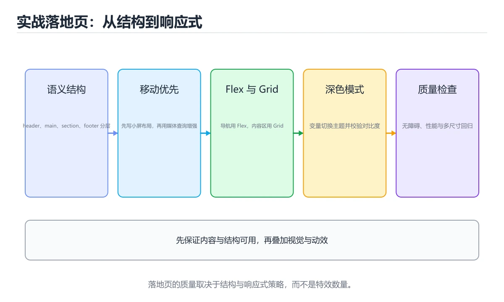
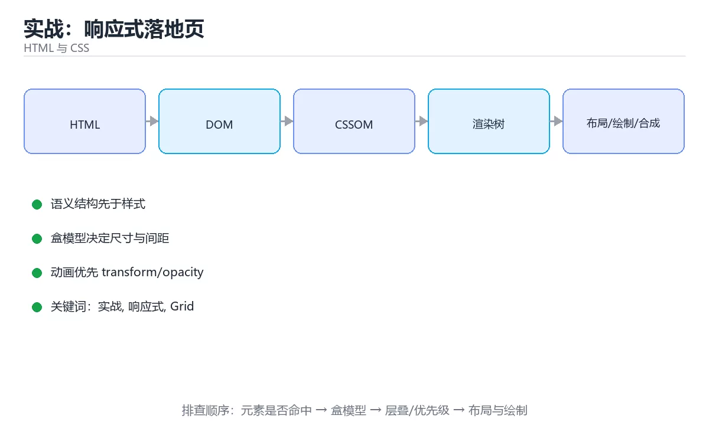

# 实战：响应式落地页





> 内容更新时间：2026-10-03 · 学习阶段：高级 · 预计用时：17 分钟

## 学习目标

- 能用自己的话解释实战：响应式落地页解决了什么问题，而不是只背术语。
- 能说清 「实战」、「响应式」、「Grid」、「可访问性」 之间的关系，并分别举出一个例子。
- 能把本课知识放回「HTML 与 CSS」的知识体系，说明它和相邻主题的边界。
- 能完成本课练习，并用验收标准检查自己的结果。

> 一句话摘要：语义结构、Flex/Grid 布局、深色模式与质量检查。

## 前置知识

- 先完成上一课《CSS 进阶：变量、伪类与现代特性》；如果已经掌握，可以直接用本课练习自测。
- 开始前先复习：实战、响应式、Grid。
- 如果某一步看不懂，先记录具体卡点，完成练习后再回头读一遍。

## 目标与验收

用纯 HTML + CSS（不依赖框架）做一个产品落地页，要求：语义化结构、移动优先响应式、深色模式、可访问性达标、无布局抖动（CLS < 0.1）。

## 结构规划

```text
header（logo + nav）
main
  section.hero（主标题 + 说明 + CTA 按钮）
  section.features（卡片网格）
  section.pricing（三档价格对比）
  section.faq（details/summary 折叠）
footer（链接与版权）
```

用 header/nav/main/section/footer 等语义标签，标题层级从 h1 递进；所有图片写 alt，所有交互元素可键盘到达。

## 布局要点

1. 全局 `box-sizing: border-box` 与 CSS 变量（颜色、间距、圆角）。
2. 导航用 Flex（`justify-content: space-between`），移动端折叠为汉堡菜单（可用 `<details>` 或 checkbox hack）。
3. 特性卡片用 Grid：`repeat(auto-fill, minmax(260px, 1fr))` + `gap`。
4. 定价表在小屏堆叠、大屏三列（媒体查询或 Grid 自适应）。
5. Hero 用 `clamp()` 控制字号，避免小屏溢出。

## 深色模式与动效

用 `prefers-color-scheme` 覆盖变量实现深色主题；用 `prefers-reduced-motion` 关闭动画；CTA 按钮加 `:hover`/`:focus-visible` 状态反馈。动画只改 transform/opacity，时长 150~250ms。

## 质量检查清单

| 检查项 | 标准 |
| --- | --- |
| 响应式 | 360 / 768 / 1440 三个宽度无横向滚动、无文字溢出 |
| 可访问性 | 键盘可完整操作、焦点可见、对比度 ≥ 4.5:1 |
| 性能 | 图片有 width/height 或 aspect-ratio 防抖动；Lighthouse 性能 ≥ 90 |
| 兼容 | 主流浏览器表现一致，必要时加渐进增强 |

## 交付与自测流程

完成页面后按这张清单自测：

| 检查项 | 手段 | 通过标准 |
| --- | --- | --- |
| 结构语义 | 关掉 CSS 看内容是否仍可读 | 标题层级正常、列表/表单语义正确 |
| 响应式 | DevTools 切 360 / 768 / 1440 | 无横向滚动、无文字溢出或遮挡 |
| 可访问性 | 只用键盘 Tab 走完全流程 | 焦点可见、顺序合理、可触发所有操作 |
| 对比度 | DevTools 对比度检查器 | 正文 ≥ 4.5:1，大字 ≥ 3:1 |
| 性能 | Lighthouse | 性能与可访问性均 ≥ 90，CLS < 0.1 |
| 深色模式 | 系统切换深色 | 无刺眼白块、对比度仍达标 |

交付物建议：单一 HTML 文件或 index.html + styles.css 两文件结构、一份 README 说明断点与变量约定、三张不同宽度的截图。**能复现的工程习惯比页面本身更重要**。

## 本课小结
这个实战把 **语义化 HTML + 盒模型 + Flex/Grid + 响应式 + 变量主题** 串起来；把三个断点都调通，HTML/CSS 的基础就算过关。

## 页面结构速查

| 区块 | 语义 | 要点 |
| --- | --- | --- |
| 页头 | `header` | 品牌、主导航、语言切换 |
| 主体内容 | `main` | 唯一，包含各 section |
| 特性区 | `section` | 每块有标题与简短说明 |
| 价格或方案 | `section` + 列表 | 用列表而非表格表达选项 |
| 行动号召 | `section` + 按钮 | 主按钮唯一且明显 |
| 页脚 | `footer` | 版权、链接、备案信息 |

## 样式组织速查

| 组织方式 | 适用 |
| --- | --- |
| 按层（reset、base、components、utilities） | 中大型项目 |
| 按组件文件 | 组件库与设计系统 |
| 命名约定（BEM 或语义化类名） | 避免样式冲突 |
| 变量集中定义 | 主题与间距统一 |
| 工具类辅助 | 局部微调，不替代组件样式 |

```css
/* 落地页骨架：响应式特性网格 + 深色模式支持 */
:root {
  --brand: #2563eb;
  --bg: #ffffff;
  --fg: #0f172a;
  --muted: #64748b;
  --card: #f8fafc;
  --radius: 8px;
  --space: clamp(1rem, 3vw, 2rem);
}

@media (prefers-color-scheme: dark) {
  :root {
    --bg: #0b1220;
    --fg: #e5e7eb;
    --muted: #94a3b8;
    --card: #111c31;
  }
}

body {
  margin: 0;
  background: var(--bg);
  color: var(--fg);
  font-family: system-ui, sans-serif;
  line-height: 1.6;
}

.container {
  max-width: 72rem;
  margin-inline: auto;
  padding-inline: var(--space);
}

.features {
  display: grid;
  gap: var(--space);
  grid-template-columns: repeat(auto-fit, minmax(240px, 1fr));
}

.feature {
  background: var(--card);
  border-radius: var(--radius);
  padding: var(--space);
}

.cta {
  display: inline-flex;
  align-items: center;
  gap: 0.5rem;
  padding: 0.75rem 1.25rem;
  border-radius: var(--radius);
  background: var(--brand);
  color: #ffffff;
  text-decoration: none;
  font-weight: 600;
}

.cta:focus-visible {
  outline: 2px solid var(--fg);
  outline-offset: 3px;
}
```

## 常见错误对照表

| 容易踩的做法 | 实际现象 | 原因与正确做法 |
| --- | --- | --- |
| 用 div 堆砌所有区块 | 结构无语义、SEO 差 | 用语义标签 |
| 大小屏共用固定宽度 | 小屏溢出 | `max-width` + 网格自适应 |
| 深色模式只改背景色 | 文字看不清 | 变量统一改文字与边框 |
| 图片直接放原图 | 加载慢、浪费流量 | 响应式图片 + 懒加载 |
| 无对比度检查 | 无障碍不达标 | 用工具检查对比度 |
| 焦点样式被移除 | 键盘不可用 | 保留 `:focus-visible` |
| 文案写死在多处 | 改文案要改多处 | 集中管理或使用变量 |
| 不测长文本 | 多语言溢出 | 用弹性布局与截断 |
| 只测 Chrome | 其他浏览器布局错乱 | 多浏览器验证 |
| 忽略首屏关键样式 | 首屏闪烁 | 内联关键 CSS 并延迟其余 |

## 自测清单

- [ ] 页面使用语义结构且标题层级正确。
- [ ] 320px 到宽屏均无横向滚动与溢出。
- [ ] 深色模式下对比度达标。
- [ ] 图片响应式并启用懒加载，首屏无偏移。
- [ ] 键盘可完整操作，焦点可见。

## 动手练习

> 本课练习重点：围绕「实战、响应式、Grid」完成复述、实验和交付，每个结果都要能被别人检查。

先写最小语义结构，再调整布局与样式，最后检查键盘、窄屏和对比度。

### 练习 1：建立心智模型（10 分钟）

合上教程，用 3～5 句话回答：

1. 实战：响应式落地页解决了什么问题？
2. 如果没有它，会出现什么具体后果？
3. 它和「响应式」是什么关系？

**验收标准**：至少出现一个本课关键词，并写出一个反例、边界条件或失效场景。

### 练习 2：做一次可控实验（20 分钟）

从正文中选一个最小示例，完成以下操作：

1. 先预测修改一个参数、输入或步骤后的结果。
2. 再实际执行或逐步推演，记录真实结果。
3. 如果结果与预测不同，写出差异原因。

**验收标准**：留下「原例 → 改动 → 预测 → 结果 → 原因」五步记录。

### 练习 3：交付一个小结果（30 分钟）

做一个只有标题、卡片和按钮的最小页面，并用浏览器设备模式检查窄屏。

任务要求：

- 结果必须能被别人检查，不能只写“我已经理解了”。
- 至少覆盖「实战」和「响应式」两个关键词。
- 写出 1 个仍然不确定的问题，以及下一步如何验证。

> 提示：时间有限时优先做练习 1 和练习 2；练习 3 可以拆成两次完成。

## 验证命令与预期输出

项目代码不能只看“能编译”，还要能按固定命令复现结果。下表给出最低验证集：

| 阶段 | 命令 | 预期输出 |
| --- | --- | --- |
| 安装依赖 | `python -m pip install -r requirements.txt` | 依赖安装完成，没有版本冲突 |
| 语法检查 | `python -m compileall .` | 所有模块编译通过 |
| 运行测试 | `python -m pytest -q` | 测试全部通过，失败用例数为 0 |
| 启动示例 | `python main.py` | 服务启动并输出监听地址 |

### 验收证据

- [ ] 保存依赖安装和启动命令的完整输出。
- [ ] 至少运行 3 条测试，其中包含一条非法输入或失败路径。
- [ ] 重复执行同一操作两次，确认没有重复写入或副作用。
- [ ] 记录一次失败状态码、错误日志和恢复步骤。
- [ ] 在 README 中写明环境版本、启动方式和回滚方式。

### 回归与回滚

1. 先在一个可丢弃的目录或临时数据库执行，避免污染真实数据。
2. 修改一处逻辑后重跑全部验证命令，确认没有回归。
3. 若失败，回滚到上一个可运行版本并保留失败日志。
4. 定位原因后补一条自动化测试，再重新执行发布流程。
5. 把教训写入项目复盘或本课笔记，形成下一次的检查项。

## 可运行练习

### 任务 1：先跑通，再解释

```json
{
  "project": "html_css_project",
  "input": {"case": "normal", "value": 5},
  "expected": {"ok": true, "result": 5},
  "failure_case": {"value": -1, "error": "validation_error"},
  "idempotency_key": "demo-001"
}
```

### 任务 2：只改一个条件

把「实战：响应式落地页」的最小示例复制一份，只改一个条件再跑一次：

- 改动点：只把实战的输入换成空值、极值或错误输入，其余保持不变。
- 预测：先写下「实战：响应式落地页」在改动后的输出或错误信息，再运行。
- 记录：对照改动前后的结果，指出差异出在哪一步。
- 验收：换回原条件能复现原结果，改动只影响实战。

### 任务 3：迁移到自己的数据

用同一套思路处理一组你自己的数据或场景，保持输出格式与任务 1 一致。

## 故障现场

### 现场 1：本课的 实战 常规用例通过，但边界用例失败

**症状**：在本课的练习或生产场景里出现“本课的 实战 常规用例通过，但边界用例失败”。

**复现**：准备一组最小输入，只保留触发“本课的 实战 常规用例通过，但边界用例失败”的必要条件，连续运行两次确认结果稳定。

**定位**：围绕“实战 的前置条件与取值边界没有写进代码，默认值掩盖了空值和极值”检查调用链、输入数据和环境配置，先验证假设再改代码。

**预防**：把“本课的 实战 常规用例通过，但边界用例失败”写成一条自动化用例，并在本课的验收清单里保留对应检查项。

### 现场 2：本课的 响应式 结果在两次运行之间不一致

**症状**：在本课的练习或生产场景里出现“本课的 响应式 结果在两次运行之间不一致”。

**复现**：准备一组最小输入，只保留触发“本课的 响应式 结果在两次运行之间不一致”的必要条件，连续运行两次确认结果稳定。

**定位**：围绕“响应式 依赖了当前版本、执行顺序或共享状态，单次运行无法暴露差异”检查调用链、输入数据和环境配置，先验证假设再改代码。

**预防**：把“本课的 响应式 结果在两次运行之间不一致”写成一条自动化用例，并在本课的验收清单里保留对应检查项。

### 现场 3：本课的验证只在开发机通过

**症状**：在本课的练习或生产场景里出现“本课的验证只在开发机通过”。

**定位**：围绕“环境版本、配置和输入规模与目标环境不同，实战 缺少可重复的验证记录”检查调用链、输入数据和环境配置，先验证假设再改代码。

## 本课复习清单

离开本课前，逐项确认：

- [ ] 不看解析，能说出「移动优先的写法是？」的判断依据。
- [ ] 不看解析，能说出「特性卡片网格推荐用？」的判断依据。
- [ ] 不看解析，能说出「为防止累积布局偏移（CLS），图片应该？」的判断依据。
- [ ] 不看解析，能说出「想让页面跟随系统深色模式，应该用哪个媒体查询？」的判断依据。
- [ ] 不看解析，能说出「Lighthouse / axe 这类工具在项目中的主要用途是？」的判断依据。
- [ ] 至少运行一次本课示例，记录输入、输出和一个边界情况。
- [ ] 把本课最容易混淆的两个概念写成一句话对照。

| 复盘项 | 记录 |
| --- | --- |
| 已经能独立解释的考点 |  |
| 仍然说不清的概念 |  |
| 下一步验证动作 |  |

## 术语速查

把「实战：响应式落地页」里反复出现的术语集中放在一起。复习时先遮住右列，尝试用自己的话解释，再回到正文核对。

| 术语 | 本课语境 |
| --- | --- |
| `实战` | 围绕“环境版本、配置和输入规模与目标环境不同，实战 缺少可重复的验证记录”检查调用链、输入数据和环境配置，先验证假设再改代码。 |
| `响应式` | 这个实战把 语义化 HTML + 盒模型 + Flex/Grid + 响应式 + 变量主题 串起来；把三个断点都调通，HTML/CSS 的基础就算过关。 |
| `Grid` | 这个实战把 语义化 HTML + 盒模型 + Flex/Grid + 响应式 + 变量主题 串起来；把三个断点都调通，HTML/CSS 的基础就算过关。 |
| `可访问性` | 它在「实战：响应式落地页」里是理解「可访问性」的关键术语，用来解释定义、适用条件与失败路径；它与实战、响应式共同决定这一节的判断边界。复习时回到正文示例核对输入、输出和验证方式。 |
| `CLS` | 用纯 HTML + CSS（不依赖框架）做一个产品落地页，要求：语义化结构、移动优先响应式、深色模式、可访问性达标、无布局抖动（CLS < 0.1）。 |

## 考点精讲

### 考点 1：多选辨析·实战

- **题目**：围绕“实战：响应式落地页”中的 实战、响应式、Grid，下列哪两项是本课强调的实践判断？
- **判断依据**：在「实战：响应式落地页」里，学习 实战 时要同时说明输入、输出和失败路径，不能只看正常流程。在实战：响应式落地页里，判断 响应式 时要固定版本与边界输入，所以“验证 响应式 时要固定版本并覆盖边界输入，结论才可复现”才可复现。回到「实战：响应式落地页」的正文示例，用“围绕实战”走一遍实战、响应式、Grid的完整流程，能复现的结论才可以保留。

### 考点 2：代码补全·实战

- **题目**：这段代码代码是「实战：响应式落地页」的示例片段，下面哪一项描述与它一致？
- **判断依据**：题干的正确项是这段代码把主要逻辑封装在函数或方法里，需要被调用才会执行，在「实战：响应式落地页」里封装边界决定实战从哪一步开始生效。这段代码出自「实战：响应式落地页」的正文示例，围绕实战、响应式、Grid展开；把输入或边界换成空值、极值或失败情况后，结论要以「实战：响应式落地页」的实际运行结果为准。在「实战：响应式落地页」里判断这道题，要把实战、响应式、Grid的条件、过程与失败路径逐项对齐，换成“这段代码代码是实战”这个场景，只有满足前提的结论才成立。

### 考点 3：概念判断·实战

- **题目**：为防止累积布局偏移（CLS），图片应该？
- **判断依据**：在「实战：响应式落地页」里，同时设 width/height 或用 aspect-ratio 占位。在「实战：响应式落地页」里判断这道题，要把实战、响应式、Grid的条件、过程与失败路径逐项对齐，换成“为防止累积布局偏移（CLS）”这个场景，只有满足前提的结论才成立。“为防止累积布局偏移（CLS）”与「实战：响应式落地页」的术语表相呼应，只有符合实战、响应式、Grid约束的“同时设 width/height 或用”才是正文支持的结论。

### 考点 4：概念判断·实战

- **题目**：想让页面跟随系统深色模式，应该用哪个媒体查询？
- **判断依据**：在「实战：响应式落地页」里，prefers-color-scheme: dark 可读取系统主题偏好，据此覆盖 CSS 变量实现深色模式。在「实战：响应式落地页」里，其他选项：min-width 控制断点，print 针对打印，orientation（仅部分场景成立） 针对横竖屏。在「实战：响应式落地页」里，这道题要求区分概念与边界，「prefers-color-scheme」只有在题干给出的前提下才成立，而「print」、「orientation（仅部分场景成立）」缺少同一组条件。

### 考点 5：概念判断·实战

- **题目**：Lighthouse / axe 这类工具在项目中的主要用途是？
- **判断依据**：在「实战：响应式落地页」里，自动检测性能。它们给出可执行的审计报告（对比度、语义、加载指标），适合接入 CI 做回归。在「实战：响应式落地页」里判断这道题，要把实战、响应式、Grid的条件、过程与失败路径逐项对齐，换成“Lighthouse / axe 这”这个场景，只有满足前提的结论才成立。

### 考点 6：填空·"project": "____",

- **题目**：补全代码：「实战：响应式落地页」示例中，下面这行代码缺少哪个关键字或函数名？请填入 ____。 `"project": "____",`
- **判断依据**：空格应填写「html_css_project」。在「实战：响应式落地页」里判断这道题，要把实战、响应式、Grid的条件、过程与失败路径逐项对齐，换成“补全代码”这个场景，只有满足前提的结论才成立。回到「实战：响应式落地页」的正文示例，用“补全代码”走一遍实战、响应式、Grid的完整流程，能复现的结论才可以保留。

## English Overview

**Title:** Project: Responsive Landing Page

**Summary:** Semantics, layout, dark mode and quality checks.

**Category:** HTML & CSS
**Level:** 高级
**Key terms:** 实战, 响应式, Grid, 可访问性, CLS

## 内容元数据

- 内容版本：v2.0
- 最后更新：2026-10-03
- 学习阶段：高级
- 适用环境：现代浏览器（Chrome/Firefox/Safari）
- 内容来源：内置结构化课程与工程实践整理
- 相关主题：实战、响应式、Grid、可访问性、CLS
- 质量版本：P0 测验标准 + P1 覆盖扩展 + P2 体验补全

## 项目专属规格：实战：响应式落地页

### 核心场景

语义结构、Flex/Grid 布局、深色模式与质量检查。 项目目标是把「实战、响应式、Grid、可访问性、CLS」落实为可运行、可测试、可回滚的交付物。

### 架构与数据流

```text
用户/输入 → 接口或命令 → 领域逻辑 → 存储/外部依赖 → 输出与监控
                         ↘ 失败分类 → 重试/补偿 → 回滚
```

### 最小数据模型

| 对象 | 关键字段 | 约束 |
| --- | --- | --- |
| 输入实体 | 实战、时间、来源 | 必填校验、长度限制、幂等键 |
| 任务实体 | 状态、优先级、创建时间 | 状态迁移合法、不可重复执行 |
| 结果实体 | 输出、错误码、耗时 | 可序列化、错误可解释 |
| 审计记录 | 操作者、动作、结果、时间 | 不可篡改、可查询、脱敏 |

### 验收场景

1. 正常路径：最小输入得到预期输出，并留下日志与指标。
2. 边界路径：空值、最大值、重复数据和超长内容得到明确处理。
3. 失败路径：依赖超时或不可用时能快速失败、重试或降级。
4. 幂等路径：同一请求执行两次不会产生重复副作用。
5. 回滚路径：回滚后数据一致，且能说明恢复时间和影响范围。

## 项目交付物

### 建议仓库结构

```text
src/
tests/
docs/
README.md
```

### 测试矩阵

| 层级 | 覆盖内容 | 最低数量 | 通过标准 |
| --- | --- | ---: | --- |
| 单元测试 | 领域规则、边界和错误分类 | 8 | 正常、边界、失败路径全部通过 |
| 集成测试 | 数据库、网络、文件或平台边界 | 3 | 使用真实边界且可重复运行 |
| 端到端测试 | 核心用户路径 | 1 | 从输入到输出完整跑通 |
| 手动验收 | 文档中列出的 5 个场景 | 5 | 有命令、输出和结论记录 |

### 验收数据

```json
{
  "project": "html_css_project",
  "input": {"case": "normal", "value": 5},
  "expected": {"ok": true, "result": 5},
  "failure_case": {"value": -1, "error": "validation_error"},
  "idempotency_key": "demo-001"
}
```

### 复盘模板

| 问题 | 记录 |
| --- | --- |
| 原目标是什么？ | 用一句话描述可验收目标 |
| 实际发生了什么？ | 时间线、指标和关键日志 |
| 哪个假设被推翻？ | 根因与促成因素 |
| 如何回滚？ | 步骤、耗时和数据校验 |
| 下一步做什么？ | 负责人、期限和验证方式 |

> 项目验收围绕「实战、响应式、Grid」：至少完成一次正常路径、一次边界输入、一次失败恢复和一次幂等检查。

## 参考资料与复核

- 最后复核：2026-10-04
- 下次复核：2027-04-04
- 复核范围：版本兼容、API 行为、安全建议与工程实践
- 来源性质：官方文档、标准或权威教材；正文为离线教学重组

| 参考资料 | 本课用途 |
| --- | --- |
| [MDN HTML](https://developer.mozilla.org/docs/Web/HTML) | HTML 语义与文档结构 |
| [MDN 无障碍](https://developer.mozilla.org/docs/Web/Accessibility) | 可访问性与语义 |
| [W3C Web 标准](https://www.w3.org/TR/) | HTML、CSS 与 Web 标准 |

> 「实战：响应式落地页」的链接用于离线阅读后的延伸核对；App 不会自动联网。
