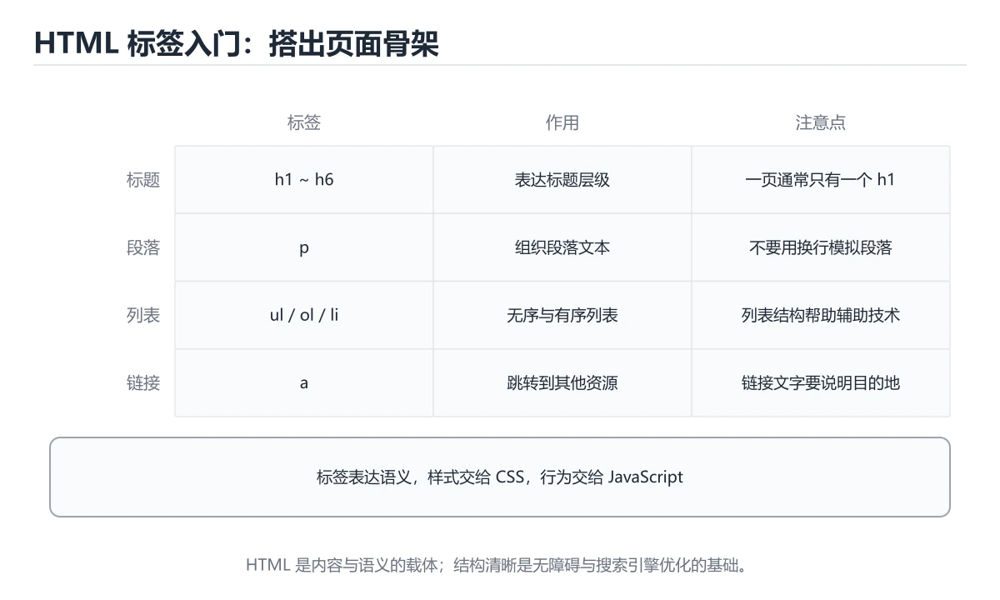
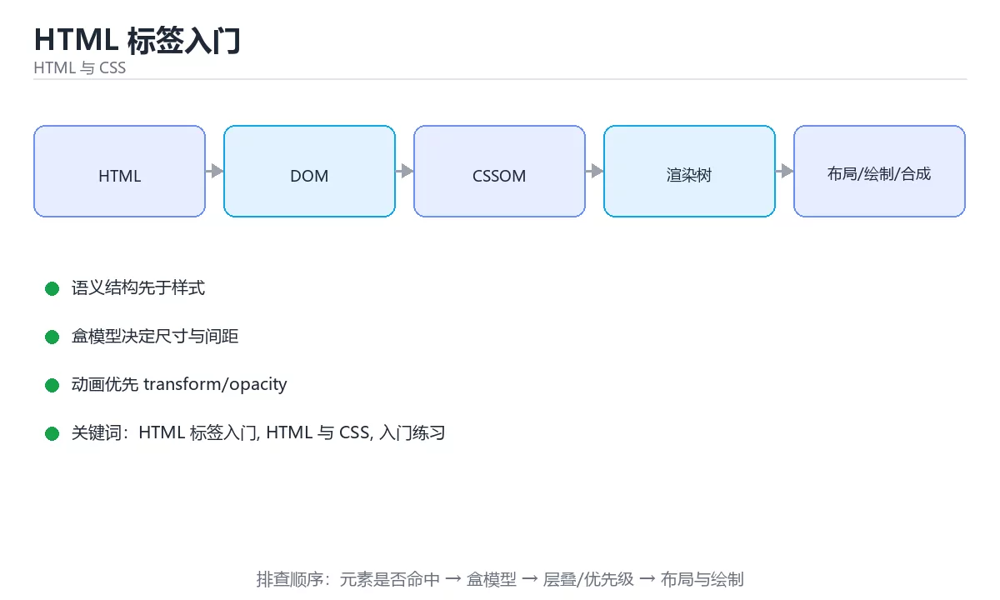

# HTML 标签入门





> 内容更新时间：2026-10-03 · 学习阶段：入门 · 预计用时：15 分钟

## 学习目标

- 先认识「HTML 标签入门」需要的工具、输入和输出。
- 按步骤运行最小示例，并记录结果与错误。
- 用一个边界输入验证自己是否真正掌握。

## 前置知识

- 会进行基本的文件或命令行操作。
- 不需要预先掌握「HTML 与 CSS」的高级知识。

## 一句话入门

用标题、段落、列表和链接组织页面。

## 最小示例

```html
<h1>学习笔记</h1>
<p>今天完成了第一个 HTML 页面。</p>
<ul>
  <li>标题</li>
  <li>段落</li>
</ul>
```

## 预期输出

```text
页面显示一级标题“学习笔记”、一段文字和一个两项列表。
```

## 常见错误

- 输入或环境与示例不一致，导致结果不符合预期。
- 复制命令时遗漏空格、引号或必要参数。

## 动手练习

1. 原样运行最小示例，保存命令和输出。
2. 把数字 2 改成 10，预测并验证新结果。
3. 制造一个错误输入，写出错误信息和修复方法。

## 本课小结

- 入门阶段先保证能运行、能观察、能解释，再追求复杂功能。
- 每次只改一个变量，记录预测与实际结果。
- 遇到错误先看第一条错误信息，再回到最小示例。


## 标签的语义与文档结构

HTML 标签不仅决定“看起来是什么”，更决定内容的语义。`h1`～`h6` 表示标题层级，`p` 表示段落，`ul` 和 `ol` 表示无序与有序列表，`a` 表示链接，`img` 表示图片，`button` 表示可操作按钮。浏览器、搜索引擎、屏幕阅读器和自动化工具都依赖这些语义来理解页面。如果把所有元素都写成 `div`，再靠 CSS 模拟外观，页面能显示，但键盘操作、朗读顺序和表单行为都会变差。

一个基本文档包含 `<!DOCTYPE html>`、`html`、`head` 和 `body`。`head` 放元信息，例如字符集、视口、标题、描述和样式引用；`body` 放用户可见内容。字符集通常使用 UTF-8，移动端要设置 `viewport`，否则页面会按桌面宽度缩放。标题层级应按内容结构递进，不要为了字号跳级；页面通常只保留一个主要一级标题。

标签还有嵌套和闭合规则。块级元素不能随意放在只允许短语内容的位置，列表项必须直接位于列表容器内，交互元素不要嵌套另一个交互元素。属性值要用引号包起来，布尔属性只写属性名即可。`img` 必须提供有意义的 `alt`：图片传达信息时描述信息，纯装饰图片使用空 `alt`，避免屏幕阅读器重复朗读无关内容。

## 可访问性与有效性

表单控件要有关联的 `label`，这样点击文字也能聚焦输入框，屏幕阅读器也能读出字段含义。按钮要使用 `button` 或 `input type="button"`，不要用 `div` 模拟点击；如果确实需要自定义控件，必须补齐键盘事件、焦点样式和 ARIA 角色。链接用于导航，按钮用于触发动作，混用会让用户预期落空。

页面语言要明确声明，例如 `lang="zh-CN"`；视频提供字幕，音频提供文字稿，颜色不能作为唯一的信息载体。键盘用户应该能按 Tab 顺序访问所有交互元素，并清楚看到焦点位置。响应式设计则要保证文本可缩放、图片有尺寸、布局不因窄屏而横向溢出。

验证 HTML 可以从三件事开始：用浏览器开发者工具检查 DOM 结构，用键盘走一遍所有交互，用验证器检查标签嵌套和属性错误。再关闭 CSS 查看内容顺序是否仍然合理。语义正确的页面通常更易维护、更易测试，也更适合不同能力的用户。

## 代码实验：把示例跑成证据

这一节不引入新语法，而是把「HTML 标签入门」的最小示例变成可以复现、可以对照的实验。每次只改变一个条件，先写预测，再运行，最后解释差异。

### 实验一：建立基线

```html
<h1>学习笔记</h1>
<p>今天完成了第一个 HTML 页面。</p>
<ul>
  <li>标题</li>
  <li>段落</li>
</ul>
```

先原样运行上面的代码，记录命令、完整输出和退出状态。然后把输出与正文的预期输出逐字对照，不要用“看起来差不多”代替核对；空格、大小写、换行和错误流向都可能暴露环境差异。

### 实验二：只改一个输入

从代码中选一个会影响结果的字面量、参数或输入，把它替换成边界值：数值可尝试 0、1、最大值和最小值，字符串可尝试空串和超长文本，集合可尝试空集合、单元素和重复元素。先写出预测，再运行并记录实际结果。

### 实验三：制造一个可控错误

删掉一个闭合标签、把类名写错，或者让选择器优先级被另一条规则覆盖。用开发者工具确认实际命中的元素和计算样式。

| 实验 | 改动 | 预测 | 实际 | 结论 |
| --- | --- | --- | --- | --- |
| 基线 | 保持原样 |  |  |  |
| 边界 |  |  |  |  |
| 失败 |  |  |  |  |

### 实验四：用三句话复述

1. 输入是什么，哪些输入属于合法范围，哪些属于边界或非法范围？
2. 程序按什么顺序处理输入，在哪一步产生了状态变化或副作用？
3. 输出如何验证，失败时第一条可观察证据是什么？

## 考点精讲：把测验题还原成判断过程

本课有 5 个判断点。先自己作答，再看「判断依据」；如果结论正确但理由不完整，回到正文对应章节补足概念。

### 考点 1：无序列表和有序列表分别对应哪组标签？

- **正确判断**：无序列表用 ul，有序列表用 ol
- **判断依据**：正确答案是「无序列表用 ul，有序列表用 ol」，本课在「标签的语义与文档结构」中说明：h1～h6 表示标题层级，p 表示段落，ul 和 ol 表示无序与有序列表，a 表示链接，img 表示图片，button 表示可操作按钮。ul 表示 unordered list，默认显示为项目符号。本课还在「标签的语义与文档结构」中说明：HTML 标签不仅决定“看起来是什么”，更决定内容的语义。本课还在「标签的语义与文档结构」中说明：一个基本文档包含 <!DOCTYPE html>、html、head 和 body。
- **迁移检查**：遮住选项，只根据定义复述一次答案，再回来看哪个选项与复述一致。

### 考点 2：给页面标题使用 h1 而不用 div 加样式，主要好处是？

- **正确判断**：向浏览器和辅助技术表达标题的语义层级
- **判断依据**：正确答案是「向浏览器和辅助技术表达标题的语义层级」，本课在「标签的语义与文档结构」中说明：浏览器、搜索引擎、屏幕阅读器和自动化工具都依赖这些语义来理解页面。h1 到 h6 表达的是文档的标题层级，屏幕阅读器、搜索引擎和浏览器都会据此理解页面结构，这类信息被称为语义。本课还在「标签的语义与文档结构」中说明：字符集通常使用 UTF-8，移动端要设置 viewport，否则页面会按桌面宽度缩放。本课还在「可访问性与有效性」中说明：验证 HTML 可以从三件事开始：用浏览器开发者工具检查 DOM 结构，用键盘走一遍所有交互，用验证器检查标签嵌套和属性错误。
- **迁移检查**：遮住选项，只根据定义复述一次答案，再回来看哪个选项与复述一致。

### 考点 3：要创建一个指向 https://example.com 的链接，正确写法是？

- **正确判断**：把地址写在 a 标签的 href 属性里
- **判断依据**：正确答案是「把地址写在 a 标签的 href 属性里」，本课在「标签的语义与文档结构」中说明：属性值要用引号包起来，布尔属性只写属性名即可。a 元素通过 href 属性描述链接目标，用户点击后跳转。本课还在「可访问性与有效性」中说明：链接用于导航，按钮用于触发动作，混用会让用户预期落空。
- **迁移检查**：把题干里的一个条件换成边界值，原来的结论还成立吗？写出判断过程。

### 考点 4：本课最小示例渲染出的页面包含哪些内容？

- **正确判断**：一级标题、一段文字和一个两项列表
- **判断依据**：正确答案是「一级标题、一段文字和一个两项列表」，本课在「可访问性与有效性」中说明：表单控件要有关联的 label，这样点击文字也能聚焦输入框，屏幕阅读器也能读出字段含义。示例依次使用 h1 写出「学习笔记」、使用 p 写出一段说明文字、使用 ul 和两个 li 写出两项列表，因此渲染结果是标题、段落和列表的组合。本课还在「可访问性与有效性」中说明：语义正确的页面通常更易维护、更易测试，也更适合不同能力的用户。
- **迁移检查**：如果给某个错误选项去掉一个限定词，它会不会变成正确？说明理由。

### 考点 5：填空：「HTML 标签入门」术语速查中，表示「HTML 标签不仅决定“看起来是什么”，更决定内容的语义。`____`～`h6` 表示标题层级，`p` 表示段落，`ul` 和 `ol` 表示无序与有序列表，`a` 表示链接，`img` 表示图片，`button` 表示可操作按钮。浏览器、搜索…」的术语是什么？

- **正确判断**：h1
- **判断依据**：h1～h6 表示标题层级，p 表示段落，ul 和 ol 表示无序与有序列表，a 表示链接，img 表示图片，button 表示可操作按钮。针对「填空：HTML 标签入门术语速查中，表示HTML…」，本课在「标签的语义与文档结构」中说明：HTML 标签不仅决定“看起来是什么”，更决定内容的语义。本课还在「标签的语义与文档结构」中说明：标题层级应按内容结构递进，不要为了字号跳级。
- **迁移检查**：如果填成相近的另一个函数或关键字，程序会在哪一步出错？

### 补充考点 1：关于「HTML 标签入门」，下列哪些说法是正确的？（多选）

- **正确判断**：无序列表用 ul，有序列表用 ol；向浏览器和辅助技术表达标题的语义层级
- **判断依据**：正确答案是「无序列表用 ul，有序列表用 ol；向浏览器和辅助技术表达标题的语义层级」。本课的两个判断点可以互相印证：正确答案是「无序列表用 ul，有序列表用 ol」，本课在「标签的语义与文档结构」中说明：h1～h6 表示标题层级，p 表示段落，ul 和 ol 表示无序与有序列表，a 表示链接，i…；用标题、段落、列表和链接组织页面。。在「HTML 标签入门」中，多选时不能只凭一个关键词选答案，要逐项核对题干限定的对象和边界。

## 本课复习清单

离开本课前，逐项确认：

- [ ] 不看解析，能说出「无序列表和有序列表分别对应哪组标签？」的判断依据。
- [ ] 不看解析，能说出「给页面标题使用 h1 而不用 div 加样式，主要好处是？」的判断依据。
- [ ] 不看解析，能说出「要创建一个指向 https://example.com 的链接，正确写法是？」的判断依据。
- [ ] 不看解析，能说出「本课最小示例渲染出的页面包含哪些内容？」的判断依据。
- [ ] 不看解析，能说出「填空：「HTML 标签入门」术语速查中，表示「HTML 标签不仅决定“看起来是什…」的判断依据。
- [ ] 至少运行一次本课示例，记录输入、输出和一个边界情况。
- [ ] 把本课最容易混淆的两个概念写成一句话对照。

| 复盘项 | 记录 |
| --- | --- |
| 已经能独立解释的考点 |  |
| 仍然说不清的概念 |  |
| 下一步验证动作 |  |

## 逐节复习与自检

下面按正文顺序回顾每一节，并给出一个自检问题；说不清的地方回到原章节补课。

### 最小示例

```html
<h1>学习笔记</h1>
<p>今天完成了第一个 HTML 页面。</p>
<ul>
  <li>标题</li>
  <li>段落</li>
</ul>
```

自检：这一节与相邻主题的边界在哪里？

### 预期输出

```text
页面显示一级标题“学习笔记”、一段文字和一个两项列表。
```

自检：这一节与相邻主题的边界在哪里？

### 常见错误

输入或环境与示例不一致，导致结果不符合预期。

自检：把这一节讲给没学过的人，最需要强调哪一点？

### 动手练习

把数字 2 改成 10，预测并验证新结果。制造一个错误输入，写出错误信息和修复方法。

自检：如果去掉这一节里的一个前提，结论会怎样变化？

### 标签的语义与文档结构

HTML 标签不仅决定“看起来是什么”，更决定内容的语义。`h1`～`h6` 表示标题层级，`p` 表示段落，`ul` 和 `ol` 表示无序与有序列表，`a` 表示链接，`img` 表示图片，`button` 表示可操作按钮。

自检：这一节最常见的失败方式是什么？第一条可观察证据是什么？

### 可访问性与有效性

表单控件要有关联的 `label`，这样点击文字也能聚焦输入框，屏幕阅读器也能读出字段含义。按钮要使用 `button` 或 `input type="button"`，不要用 `div` 模拟点击；如果确实需要自定义控件，必须补齐键盘事件、焦点样式和 ARIA 角色。

自检：把这一节讲给没学过的人，最需要强调哪一点？

## 术语速查

把本课反复出现的术语集中放在一起。复习时先遮住右列，尝试用自己的话解释，再回到正文核对。

| 术语 | 本课语境 |
| --- | --- |
| `h1` | HTML 标签不仅决定“看起来是什么”，更决定内容的语义。`h1`～`h6` 表示标题层级，`p` 表示段落，`ul` 和 `ol` 表示无序与有序列表，`a` 表示链接，`img` 表示图片，`button` 表示可操… |
| `h6` | HTML 标签不仅决定“看起来是什么”，更决定内容的语义。`h1`～`h6` 表示标题层级，`p` 表示段落，`ul` 和 `ol` 表示无序与有序列表，`a` 表示链接，`img` 表示图片，`button` 表示可操… |
| `表示段落，` | HTML 标签不仅决定“看起来是什么”，更决定内容的语义。`h1`～`h6` 表示标题层级，`p` 表示段落，`ul` 和 `ol` 表示无序与有序列表，`a` 表示链接，`img` 表示图片，`button` 表示可操… |
| `和` | HTML 标签不仅决定“看起来是什么”，更决定内容的语义。`h1`～`h6` 表示标题层级，`p` 表示段落，`ul` 和 `ol` 表示无序与有序列表，`a` 表示链接，`img` 表示图片，`button` 表示可操… |
| `表示无序与有序列表，` | HTML 标签不仅决定“看起来是什么”，更决定内容的语义。`h1`～`h6` 表示标题层级，`p` 表示段落，`ul` 和 `ol` 表示无序与有序列表，`a` 表示链接，`img` 表示图片，`button` 表示可操… |
| `表示链接，` | HTML 标签不仅决定“看起来是什么”，更决定内容的语义。`h1`～`h6` 表示标题层级，`p` 表示段落，`ul` 和 `ol` 表示无序与有序列表，`a` 表示链接，`img` 表示图片，`button` 表示可操… |
| `表示图片，` | HTML 标签不仅决定“看起来是什么”，更决定内容的语义。`h1`～`h6` 表示标题层级，`p` 表示段落，`ul` 和 `ol` 表示无序与有序列表，`a` 表示链接，`img` 表示图片，`button` 表示可操… |
| `div` | HTML 标签不仅决定“看起来是什么”，更决定内容的语义。`h1`～`h6` 表示标题层级，`p` 表示段落，`ul` 和 `ol` 表示无序与有序列表，`a` 表示链接，`img` 表示图片，`button` 表示可操… |
| `<!DOCTYPE html>` | 一个基本文档包含 `<!DOCTYPE html>`、`html`、`head` 和 `body`。`head` 放元信息，例如字符集、视口、标题、描述和样式引用；`body` 放用户可见内容。字符集通常使用 UTF-8… |
| `html` | 一个基本文档包含 `<!DOCTYPE html>`、`html`、`head` 和 `body`。`head` 放元信息，例如字符集、视口、标题、描述和样式引用；`body` 放用户可见内容。字符集通常使用 UTF-8… |
| `head` | 一个基本文档包含 `<!DOCTYPE html>`、`html`、`head` 和 `body`。`head` 放元信息，例如字符集、视口、标题、描述和样式引用；`body` 放用户可见内容。字符集通常使用 UTF-8… |
| `body` | 一个基本文档包含 `<!DOCTYPE html>`、`html`、`head` 和 `body`。`head` 放元信息，例如字符集、视口、标题、描述和样式引用；`body` 放用户可见内容。字符集通常使用 UTF-8… |

## 面试问答与自测

下面把本课考点换成面试追问。先口述自己的答案，
再对照参考回答检查是否遗漏了前提、边界或失败路径。

### 追问 1：无序列表和有序列表分别对应哪组标签？

**参考回答**：正确答案是「无序列表用 ul，有序列表用 ol」，本课在「标签的语义与文档结构」中说明：h1～h6 表示标题层级，p 表示段落，ul 和 ol 表示无序与有序列表，a 表示链接，img 表示图片，button 表示可操作按钮。ul 表示 unordered list，默认显示为项目符号。本课还在「标签的语义与文档结构」中说明：HTML 标签不仅决定“看起来是什么”，更决定内容的语义。本课还在「标签的语义与文档结构」中说明：一个基本文档包含 <!DOCTYPE html>、html、head 和 body。

### 追问 2：给页面标题使用 h1 而不用 div 加样式，主要好处是？

**参考回答**：正确答案是「向浏览器和辅助技术表达标题的语义层级」，本课在「标签的语义与文档结构」中说明：浏览器、搜索引擎、屏幕阅读器和自动化工具都依赖这些语义来理解页面。h1 到 h6 表达的是文档的标题层级，屏幕阅读器、搜索引擎和浏览器都会据此理解页面结构，这类信息被称为语义。本课还在「标签的语义与文档结构」中说明：字符集通常使用 UTF-8，移动端要设置 viewport，否则页面会按桌面宽度缩放。本课还在「可访问性与有效性」中说明：验证 HTML 可以从三件事开始：用浏览器开发者工具检查 DOM 结构，用键盘走一遍所有交互，用验证器检查标签嵌套和属性错误。

### 追问 3：要创建一个指向 https://example.com 的链接，正确写法是？

**参考回答**：正确答案是「把地址写在 a 标签的 href 属性里」，本课在「标签的语义与文档结构」中说明：属性值要用引号包起来，布尔属性只写属性名即可。a 元素通过 href 属性描述链接目标，用户点击后跳转。本课还在「可访问性与有效性」中说明：链接用于导航，按钮用于触发动作，混用会让用户预期落空。

### 追问 4：本课最小示例渲染出的页面包含哪些内容？

**参考回答**：正确答案是「一级标题、一段文字和一个两项列表」，本课在「可访问性与有效性」中说明：表单控件要有关联的 label，这样点击文字也能聚焦输入框，屏幕阅读器也能读出字段含义。示例依次使用 h1 写出「学习笔记」、使用 p 写出一段说明文字、使用 ul 和两个 li 写出两项列表，因此渲染结果是标题、段落和列表的组合。本课还在「可访问性与有效性」中说明：语义正确的页面通常更易维护、更易测试，也更适合不同能力的用户。

### 追问 5：填空：「HTML 标签入门」术语速查中，表示「HTML 标签不仅决定“看起来是什么”，更决定内容的语义。`____`～`h6` 表示标题层级，`p` 表示段落，`ul` 和 `ol` 表示无序与有序列表，`a` 表示链接，`img` 表示图片，`button` 表示可操作按钮。浏览器、搜索…」的术语是什么？

**参考回答**：h1～h6 表示标题层级，p 表示段落，ul 和 ol 表示无序与有序列表，a 表示链接，img 表示图片，button 表示可操作按钮。针对「填空：HTML 标签入门术语速查中，表示HTML…」，本课在「标签的语义与文档结构」中说明：HTML 标签不仅决定“看起来是什么”，更决定内容的语义。本课还在「标签的语义与文档结构」中说明：标题层级应按内容结构递进，不要为了字号跳级。

## English Overview

**Title:** HTML Tags Basics

**Summary:** Organize pages with headings, lists and links.

**Category:** HTML & CSS  
**Level:** 入门  
**Key terms:** HTML 标签入门, HTML 与 CSS, 入门练习

> The full tutorial is written in Chinese. This bilingual overview helps English readers identify the topic, scope and key terms before studying the detailed examples.

## 内容元数据

- 内容版本：v2.0
- 最后更新：2026-10-03
- 学习阶段：入门
- 适用环境：现代浏览器（Chrome/Firefox/Safari）
- 内容来源：内置结构化课程与工程实践整理
- 相关主题：HTML 标签入门、HTML 与 CSS、入门练习
- 质量版本：P0 测验标准 + P1 覆盖扩展 + P2 体验补全


## 参考资料与复核

- 最后复核：2026-10-04
- 下次复核：2027-04-04
- 复核范围：版本兼容、API 行为、安全建议与工程实践
- 来源性质：官方文档与标准；本课正文为离线教学重组，不复制原文

| 参考资料 | 本课用途 |
| --- | --- |
| [MDN Web Docs](https://developer.mozilla.org/docs/Web) | HTML、CSS 与浏览器行为 |
| [W3C Standards](https://www.w3.org/TR/) | Web 标准与可访问性规范 |

> 本课主题：用标题、段落、列表和链接组织页面。

> App 完全离线展示文字链接，不会自动联网；需要延伸阅读时可复制链接到浏览器。
