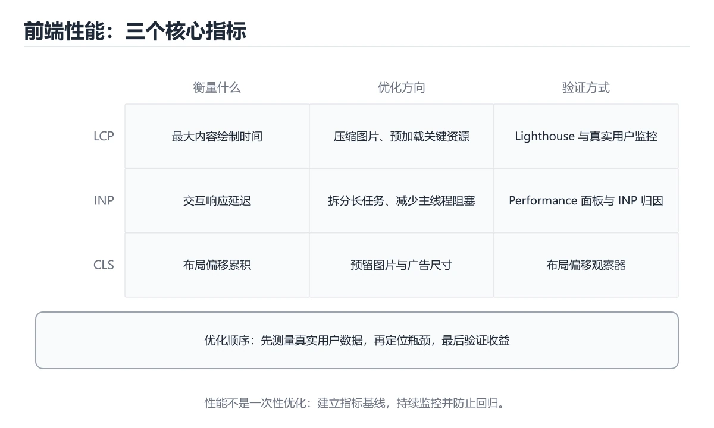
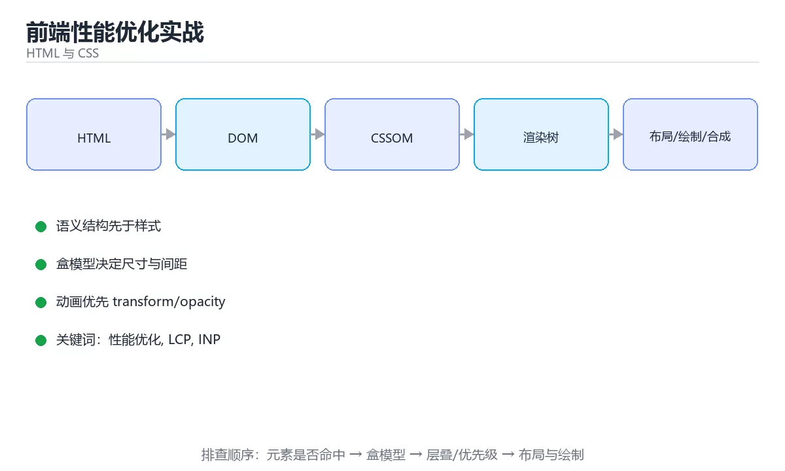

# 前端性能优化实战





> 内容更新时间：2026-10-06 · 学习阶段：高级 · 预计用时：60 分钟

## 学习目标

- 能用自己的话解释前端性能优化实战解决了什么问题，而不是只背术语。
- 能说清 「性能优化」、「LCP」、「INP」、「CLS」 之间的关系，并分别举出一个例子。
- 能把本课知识放回「HTML 与 CSS」的知识体系，说明它和相邻主题的边界。
- 能完成本课练习，并用验收标准检查自己的结果。

> 一句话摘要：LCP/INP/CLS 三指标、加载与运行时优化、排查流程。

## 前置知识

- 先完成上一课《实战：响应式落地页》；如果已经掌握，可以直接用本课练习自测。
- 开始前先复习：性能优化、LCP、INP。
- 如果某一步看不懂，先记录具体卡点，完成练习后再回头读一遍。

## 三个核心指标

| 指标 | 含义 | 良好阈值 | 主要优化手段 |
| --- | --- | --- | --- |
| LCP | 最大内容绘制（首屏主要内容出现） | < 2.5s | 优化关键资源、图片懒加载与压缩、CDN、服务端渲染 |
| INP | 交互到下一次绘制（响应性） | < 200ms | 拆长任务、减少 JS 执行、事件处理去抖、Web Worker |
| CLS | 累积布局偏移 | < 0.1 | 图片与广告预留尺寸、字体 font-display、避免动态插入内容 |

测量方式：实验室用 Lighthouse/Performance 面板，真实用户用 CrUX 或自建 RUM（`PerformanceObserver` 采集上报）。

## 加载优化清单

1. **关键路径**：首屏 CSS 内联，非关键 JS 用 `defer`/`async`，路由级代码分割。
2. **资源体积**：开启 Brotli/gzip、图片转 WebP/AVIF、按需加载字体子集、移除未用 CSS（PurgeCSS）。
3. **网络**：静态资源走 CDN、开启 HTTP/2 或 HTTP/3、避免域名分片、预连接关键域名（`preconnect`）。
4. **缓存**：带哈希的静态资源用 `immutable` 长缓存，HTML 用协商缓存。
5. **渲染**：首屏骨架屏、图片用 `loading="lazy"` 与 `decoding="async"`、避免布局抖动。

## 运行时优化清单

| 问题 | 手段 |
| --- | --- |
| 长任务阻塞交互 | 拆分任务（`scheduler.yield`、`requestIdleCallback`）、Web Worker 处理重计算 |
| 频繁重渲染（框架） | 记忆化、虚拟列表、状态下推、避免在渲染中创建新对象 |
| 内存泄漏 | 清理定时器与监听器、避免全局缓存无上限 |
| 大量 DOM 节点 | 虚拟滚动、分页、减少嵌套层级 |

## 排查流程

1. 先用 Lighthouse 定位是加载问题还是运行时问题。
2. 打开 Performance 面板录制用户操作，找长任务（红色三角）与强制同步布局（紫色）。
3. 用 Coverage 面板看未使用的 JS/CSS 占比。
4. 优化后**用同一环境复测并记录前后数据**，避免凭感觉判断。

## 本课小结

前端性能优化围绕三个指标展开：**LCP 管加载、INP 管响应、CLS 管稳定**；先测量定位瓶颈，再按"资源体积 → 网络 → 渲染 → 运行时"的顺序逐项优化。

## Core Web Vitals 速查

| 指标 | 含义 | 良好阈值 |
| --- | --- | --- |
| LCP | 最大内容绘制（加载体验） | 小于 2.5 秒 |
| INP | 交互到下一次绘制（响应性） | 小于 200 毫秒 |
| CLS | 累计布局偏移（视觉稳定性） | 小于 0.1 |

辅助指标：

| 指标 | 含义 | 目标 |
| --- | --- | --- |
| TTFB | 首字节时间 | 小于 800 毫秒 |
| FCP | 首次内容绘制 | 小于 1.8 秒 |
| TBT | 总阻塞时间（实验室） | 尽量低 |

## 优化清单速查

| 方向 | 手段 |
| --- | --- |
| 减少请求 | 合并关键资源、HTTP/2 多路复用、内联关键 CSS |
| 减小体积 | 代码分割、tree shaking、压缩（brotli/gzip）、图片转 WebP/AVIF |
| 提前加载 | `preload` 关键资源、`preconnect` 关键域名、`fetchpriority="high"` |
| 延迟非关键 | 非首屏图片懒加载、第三方脚本延迟、`defer`/`async` |
| 减少主线程工作 | 拆分长任务、`requestIdleCallback`、Web Worker |
| 缓存 | 强缓存 + 指纹、协商缓存 `ETag` |
| 字体 | `font-display: swap`、子集化、预加载 |
| 布局稳定 | 预留尺寸、`aspect-ratio`、避免动态插入顶栏 |

```html
<!-- 关键资源与首屏图片：明确优先级，避免抢占带宽 -->
<link rel="preconnect" href="https://cdn.example.com" crossorigin />
<link rel="preload" href="/fonts/main.woff2" as="font" type="font/woff2" crossorigin />
<link rel="stylesheet" href="/critical.css" />
<link rel="stylesheet" href="/non-critical.css" media="print" onload="this.media='all'" />

<!-- 首屏图片：高优先级 + 明确尺寸，避免布局偏移 -->


<!-- 非首屏图片：懒加载 -->

```

```javascript
// 把长任务拆成小块，避免阻塞交互（INP 优化）
async function processInChunks(items, handle, chunkSize = 200) {
  for (let index = 0; index < items.length; index += chunkSize) {
    const slice = items.slice(index, index + chunkSize);
    slice.forEach(handle);
    // 让出主线程，给渲染与输入事件机会
    await new Promise((resolve) => setTimeout(resolve, 0));
  }
}

// 观察真实用户指标并上报
function reportWebVitals() {
  const observer = new PerformanceObserver((list) => {
    for (const entry of list.getEntries()) {
      if (entry.entryType === "largest-contentful-paint") {
        console.info("LCP", Math.round(entry.startTime));
      }
      if (entry.entryType === "layout-shift" && !entry.hadRecentInput) {
        console.info("CLS 增量", entry.value.toFixed(4));
      }
    }
  });
  observer.observe({ type: "largest-contentful-paint", buffered: true });
  observer.observe({ type: "layout-shift", buffered: true });
}
```

## 排查流程速查

| 步骤 | 工具 | 关注 |
| --- | --- | --- |
| 1 现状 | Lighthouse、CrUX | 三项指标是否达标 |
| 2 加载 | Network 面板 | 关键路径、体积、串行请求 |
| 3 渲染 | Performance 面板 | LCP 元素、长任务、布局偏移 |
| 4 交互 | Performance 录制 | 输入延迟、事件处理耗时 |
| 5 真实用户 | 字段数据上报 | P75 指标与设备分布 |
| 6 优化验证 | 前后对比 | 同口径、同网络条件 |

## 常见错误与排查

| 容易踩的做法 | 实际现象 | 原因与正确做法 |
| --- | --- | --- |
| 只看实验室数据 | 与真实用户体验脱节 | 结合字段数据（P75） |
| 用平均分代替分布 | 长尾被掩盖 | 看 P75 与低端设备 |
| 首屏加载大量 JS | LCP 与 INP 双差 | 代码分割 + 关键路径优先 |
| 图片不设尺寸 | CLS 超标 | 写宽高或用 `aspect-ratio` |
| 所有图片都懒加载 | 首屏图延迟 | 首屏图高优先级，其余懒加载 |
| 第三方脚本同步加载 | 阻塞渲染 | `defer` / `async` 或延迟加载 |
| 长任务不拆分 | INP 超标 | 分片处理或放进 Worker |
| 无缓存策略 | 重复下载 | 强缓存 + 指纹 |
| 字体未做子集与预加载 | 文字闪烁、延迟 | 子集化 + 预加载 + `swap` |
| 优化不验证 | 收益不明甚至回退 | 前后对比同口径指标 |

## 复习与自测

- [ ] 三项核心指标都有真实用户数据（P75）。
- [ ] 首屏关键资源明确优先级，非关键资源延迟。
- [ ] 图片与媒体预留尺寸，CLS 达标。
- [ ] 长任务拆分，INP 达标。
- [ ] 每次优化都有前后对比数据。

## 动手练习

> 本课练习重点：围绕「性能优化、LCP、INP」完成复述、实验和交付，每个结果都要能被别人检查。

先写最小语义结构，再调整布局与样式，最后检查键盘、窄屏和对比度。

### 练习 1：建立心智模型（10 分钟）

合上教程，用 3～5 句话回答：

1. 前端性能优化实战解决了什么问题？
2. 如果没有它，会出现什么具体后果？
3. 它和「LCP」是什么关系？

**验收标准**：至少出现一个本课关键词，并写出一个反例、边界条件或失效场景。

### 练习 2：做一次可控实验（20 分钟）

从正文中选一个最小示例，完成以下操作：

1. 先预测修改一个参数、输入或步骤后的结果。
2. 再实际执行或逐步推演，记录真实结果。
3. 如果结果与预测不同，写出差异原因。

**验收标准**：留下「原例 → 改动 → 预测 → 结果 → 原因」五步记录。

### 练习 3：交付一个小结果（30 分钟）

做一个只有标题、卡片和按钮的最小页面，并用浏览器设备模式检查窄屏。

任务要求：

- 结果必须能被别人检查，不能只写“我已经理解了”。
- 至少覆盖「性能优化」和「LCP」两个关键词。
- 写出 1 个仍然不确定的问题，以及下一步如何验证。

> 提示：时间有限时优先做练习 1 和练习 2；练习 3 可以拆成两次完成。

## 验证命令与预期输出

项目代码不能只看“能编译”，还要能按固定命令复现结果。下表给出最低验证集：

| 阶段 | 命令 | 预期输出 |
| --- | --- | --- |
| 安装依赖 | `python -m pip install -r requirements.txt` | 依赖安装完成，没有版本冲突 |
| 语法检查 | `python -m compileall .` | 所有模块编译通过 |
| 运行测试 | `python -m pytest -q` | 测试全部通过，失败用例数为 0 |
| 启动示例 | `python main.py` | 服务启动并输出监听地址 |

### 验收证据

- [ ] 保存依赖安装和启动命令的完整输出。
- [ ] 至少运行 3 条测试，其中包含一条非法输入或失败路径。
- [ ] 重复执行同一操作两次，确认没有重复写入或副作用。
- [ ] 记录一次失败状态码、错误日志和恢复步骤。
- [ ] 在 README 中写明环境版本、启动方式和回滚方式。

### 回归与回滚

1. 先在一个可丢弃的目录或临时数据库执行，避免污染真实数据。
2. 修改一处逻辑后重跑全部验证命令，确认没有回归。
3. 若失败，回滚到上一个可运行版本并保留失败日志。
4. 定位原因后补一条自动化测试，再重新执行发布流程。
5. 把教训写入项目复盘或本课笔记，形成下一次的检查项。

## 可运行练习

### 任务 1：先跑通，再解释

```javascript
// 把长任务拆成小块，避免阻塞交互（INP 优化）
async function processInChunks(items, handle, chunkSize = 200) {
  for (let index = 0; index < items.length; index += chunkSize) {
    const slice = items.slice(index, index + chunkSize);
    slice.forEach(handle);
    // 让出主线程，给渲染与输入事件机会
    await new Promise((resolve) => setTimeout(resolve, 0));
  }
}

// 观察真实用户指标并上报
function reportWebVitals() {
  const observer = new PerformanceObserver((list) => {
    for (const entry of list.getEntries()) {
      if (entry.entryType === "largest-contentful-paint") {
        console.info("LCP", Math.round(entry.startTime));
      }
      if (entry.entryType === "layout-shift" && !entry.hadRecentInput) {
        console.info("CLS 增量", entry.value.toFixed(4));
      }
    }
  });
  observer.observe({ type: "largest-contentful-paint", buffered: true });
  observer.observe({ type: "layout-shift", buffered: true });
}
```

### 任务 2：只改一个条件

把「前端性能优化实战」的最小示例复制一份，只改一个条件再跑一次：

- 改动点：只把性能优化的输入换成空值、极值或错误输入，其余保持不变。
- 预测：先写下「前端性能优化实战」在改动后的输出或错误信息，再运行。
- 记录：对照改动前后的结果，指出差异出在哪一步。
- 验收：换回原条件能复现原结果，改动只影响性能优化。

### 任务 3：迁移到自己的数据

用同一套思路处理一组你自己的数据或场景，保持输出格式与任务 1 一致。

## 故障现场

### 现场 1：本课的 性能优化 常规用例通过，但边界用例失败

**症状**：在本课的练习或生产场景里出现“本课的 性能优化 常规用例通过，但边界用例失败”。

**复现**：准备一组最小输入，只保留触发“本课的 性能优化 常规用例通过，但边界用例失败”的必要条件，连续运行两次确认结果稳定。

**定位**：围绕“性能优化 的前置条件与取值边界没有写进代码，默认值掩盖了空值和极值”检查调用链、输入数据和环境配置，先验证假设再改代码。

**预防**：把“本课的 性能优化 常规用例通过，但边界用例失败”写成一条自动化用例，并在本课的验收清单里保留对应检查项。

### 现场 2：本课的 LCP 结果在两次运行之间不一致

**症状**：在本课的练习或生产场景里出现“本课的 LCP 结果在两次运行之间不一致”。

**复现**：准备一组最小输入，只保留触发“本课的 LCP 结果在两次运行之间不一致”的必要条件，连续运行两次确认结果稳定。

**定位**：围绕“LCP 依赖了当前版本、执行顺序或共享状态，单次运行无法暴露差异”检查调用链、输入数据和环境配置，先验证假设再改代码。

**预防**：把“本课的 LCP 结果在两次运行之间不一致”写成一条自动化用例，并在本课的验收清单里保留对应检查项。

### 现场 3：本课的验证只在开发机通过

**症状**：在本课的练习或生产场景里出现“本课的验证只在开发机通过”。

**定位**：围绕“环境版本、配置和输入规模与目标环境不同，性能优化 缺少可重复的验证记录”检查调用链、输入数据和环境配置，先验证假设再改代码。

## 本课复习清单

离开本课前，逐项确认：

- [ ] 不看解析，能说出「三个核心 Web 指标的对应关系是？」的判断依据。
- [ ] 不看解析，能说出「为减少布局偏移（CLS），图片应该？」的判断依据。
- [ ] 不看解析，能说出「发现长任务阻塞交互时，优先考虑？」的判断依据。
- [ ] 不看解析，能说出「preload 与 prefetch 的区别是？」的判断依据。
- [ ] 不看解析，能说出「减小 JS 体积最常用的组合手段是？」的判断依据。
- [ ] 不看解析，能说出「把前端性能优化实战中「排查流程」的步骤调整为正确顺序。」的判断依据。
- [ ] 至少运行一次本课示例，记录输入、输出和一个边界情况。
- [ ] 把本课最容易混淆的两个概念写成一句话对照。

| 复盘项 | 记录 |
| --- | --- |
| 已经能独立解释的考点 |  |
| 仍然说不清的概念 |  |
| 下一步验证动作 |  |

## 术语速查

| 术语 | 本课语境 |
| --- | --- |
| `PerformanceObserver` | 测量方式：实验室用 Lighthouse/Performance 面板，真实用户用 CrUX 或自建 RUM（`PerformanceObserver` 采集上报）。 |
| `defer` | 关键路径**：首屏 CSS 内联，非关键 JS 用 `defer`/`async`，路由级代码分割。 |
| `async` | 关键路径**：首屏 CSS 内联，非关键 JS 用 `defer`/`async`，路由级代码分割。 |
| `preconnect` | 网络**：静态资源走 CDN、开启 HTTP/2 或 HTTP/3、避免域名分片、预连接关键域名（`preconnect`）。 |
| `immutable` | 缓存**：带哈希的静态资源用 `immutable` 长缓存，HTML 用协商缓存。 |
| `loading="lazy"` | 渲染**：首屏骨架屏、图片用 `loading="lazy"` 与 `decoding="async"`、避免布局抖动。 |

## 考点精讲

### 考点 1：概念判断·性能优化

- **题目**：三个核心 Web 指标的对应关系是？
- **判断依据**：在「前端性能优化实战」里，LCP 管加载、INP 管响应、CLS 管稳定。LCP 是最大内容绘制、INP 是交互响应、CLS 是布局偏移。这道题的关键在「前端性能优化实战」的性能优化、LCP、INP：先确认题干“三个核心 Web 指标的对应关系是”问的是哪一步，再排除偷换前提的选项。

### 考点 2：代码补全·性能优化

- **题目**：下面这段 JavaScript 代码摘自「前端性能优化实战」的正文示例。关于这段代码，下面哪一项说法与实际内容相符？
- **判断依据**：在「前端性能优化实战」里，题干的正确项是这段代码包含循环结构，同一段逻辑会被重复执行，在「前端性能优化实战」里循环次数与性能优化的输入规模直接相关。把输入或边界换成空值、极值或失败情况后，结论要以「前端性能优化实战」的实际运行结果为准。「前端性能优化实战」要求先交代性能优化、LCP、INP的前提再下结论，所以“这段代码包含循环结构”只在题干“下面这段 JavaScript 代码摘自前端性能优化实战的正”给定的条件下成立。

### 考点 3：多选辨析·性能优化

- **题目**：围绕“前端性能优化实战”中的 性能优化、LCP、INP，下列哪两项是本课强调的实践判断？
- **判断依据**：本课把前端性能优化实战拆成概念、示例与故障现场三部分，因此判断 性能优化 时必须同时交代输入、输出和失败路径，这使“学习 性能优化 时要同时说明输入、输出和失败路径，不能只看正常流程”成立。在前端性能优化实战里，判断 LCP 时要固定版本与边界输入，所以“验证 LCP 时要固定版本并覆盖边界输入，结论才可复现”才可复现。

### 考点 4：概念判断·性能优化

- **题目**：preload 与 prefetch 的区别是？
- **判断依据**：在「前端性能优化实战」里，结论应落在「preload 提前加载当前页面马上要用的资源」。preload 提升当前页关键资源优先级。在「前端性能优化实战」里，这道题要求区分概念与边界，「preload 提前加载当前页面马上要用的资源」只有在题干给出的前提下才成立，而「preload 用于图片，prefetch 用于字体」、「两者等价，只是写法不同」缺少同一组条件。

### 考点 5：概念判断·性能优化

- **题目**：减小 JS 体积最常用的组合手段是？
- **判断依据**：在「前端性能优化实战」里，代码分割 + tree shaking + 压缩（gzip/br）。按路由拆包、剔除未用导出、传输层压缩，三者叠加才有效果。“体积最常用的组合手段是”与「前端性能优化实战」的术语表相呼应，只有符合性能优化、LCP、INP约束的“代码分割 + tree shaking”才是正文支持的结论。

### 考点 6：顺序排列·性能优化

- **题目**：把「前端性能优化实战」中「排查流程」的步骤调整为正确顺序。
- **判断依据**：在「前端性能优化实战」里，正确的执行顺序是「先用 Lighthouse 定位是加载问题还是运行时问题」 → 「打开 Performance 面板录制用户操作，找长任务（红色三角）与强制同步布局（紫色）」 → 「用 Coverage 面板看未使用的 JS/CSS 占比」 → 「优化后用同一环境复测并记录前后数据，避免凭感觉判断」。

## English Overview

**Title:** Web Performance

**Summary:** Core Web Vitals, loading/runtime optimization and profiling.

**Category:** HTML & CSS
**Level:** 高级
**Key terms:** 性能优化, LCP, INP, CLS, Lighthouse

## 内容元数据

- 内容版本：v2.0
- 最后更新：2026-10-06
- 学习阶段：高级
- 适用环境：现代浏览器（Chrome/Firefox/Safari）
- 内容来源：内置结构化课程与工程实践整理
- 相关主题：性能优化、LCP、INP、CLS、Lighthouse
- 质量版本：P0 测验标准 + P1 覆盖扩展 + P2 体验补全

## 项目专属规格：前端性能优化实战

### 核心场景

LCP/INP/CLS 三指标、加载与运行时优化、排查流程。 项目目标是把「性能优化、LCP、INP、CLS、Lighthouse」落实为可运行、可测试、可回滚的交付物。

### 架构与数据流

```text
用户/输入 → 接口或命令 → 领域逻辑 → 存储/外部依赖 → 输出与监控
                         ↘ 失败分类 → 重试/补偿 → 回滚
```

### 最小数据模型

| 对象 | 关键字段 | 约束 |
| --- | --- | --- |
| 输入实体 | 性能优化、时间、来源 | 必填校验、长度限制、幂等键 |
| 任务实体 | 状态、优先级、创建时间 | 状态迁移合法、不可重复执行 |
| 结果实体 | 输出、错误码、耗时 | 可序列化、错误可解释 |
| 审计记录 | 操作者、动作、结果、时间 | 不可篡改、可查询、脱敏 |

### 验收场景

1. 正常路径：最小输入得到预期输出，并留下日志与指标。
2. 边界路径：空值、最大值、重复数据和超长内容得到明确处理。
3. 失败路径：依赖超时或不可用时能快速失败、重试或降级。
4. 幂等路径：同一请求执行两次不会产生重复副作用。
5. 回滚路径：回滚后数据一致，且能说明恢复时间和影响范围。

## 项目交付物

### 建议仓库结构

```text
src/
tests/
docs/
README.md
```

### 测试矩阵

| 层级 | 覆盖内容 | 最低数量 | 通过标准 |
| --- | --- | ---: | --- |
| 单元测试 | 领域规则、边界和错误分类 | 8 | 正常、边界、失败路径全部通过 |
| 集成测试 | 数据库、网络、文件或平台边界 | 3 | 使用真实边界且可重复运行 |
| 端到端测试 | 核心用户路径 | 1 | 从输入到输出完整跑通 |
| 手动验收 | 文档中列出的 5 个场景 | 5 | 有命令、输出和结论记录 |

### 验收数据

```json
{
  "project": "web_performance",
  "input": {"case": "normal", "value": 5},
  "expected": {"ok": true, "result": 5},
  "failure_case": {"value": -1, "error": "validation_error"},
  "idempotency_key": "demo-001"
}
```

### 复盘模板

| 问题 | 记录 |
| --- | --- |
| 原目标是什么？ | 用一句话描述可验收目标 |
| 实际发生了什么？ | 时间线、指标和关键日志 |
| 哪个假设被推翻？ | 根因与促成因素 |
| 如何回滚？ | 步骤、耗时和数据校验 |
| 下一步做什么？ | 负责人、期限和验证方式 |

> 项目验收围绕「性能优化、LCP、INP」：至少完成一次正常路径、一次边界输入、一次失败恢复和一次幂等检查。

## 参考资料与复核

- 最后复核：2026-10-04
- 下次复核：2027-04-04
- 复核范围：版本兼容、API 行为、安全建议与工程实践
- 来源性质：官方文档、标准或权威教材；正文为离线教学重组

| 参考资料 | 本课用途 |
| --- | --- |
| [web.dev 学习平台](https://web.dev/learn/) | 现代 Web 性能与最佳实践 |
| [MDN DOM](https://developer.mozilla.org/docs/Web/API/Document_Object_Model) | DOM 树与浏览器 API |
| [MDN 无障碍](https://developer.mozilla.org/docs/Web/Accessibility) | 可访问性与语义 |

> 「前端性能优化实战」的链接用于离线阅读后的延伸核对；App 不会自动联网。
