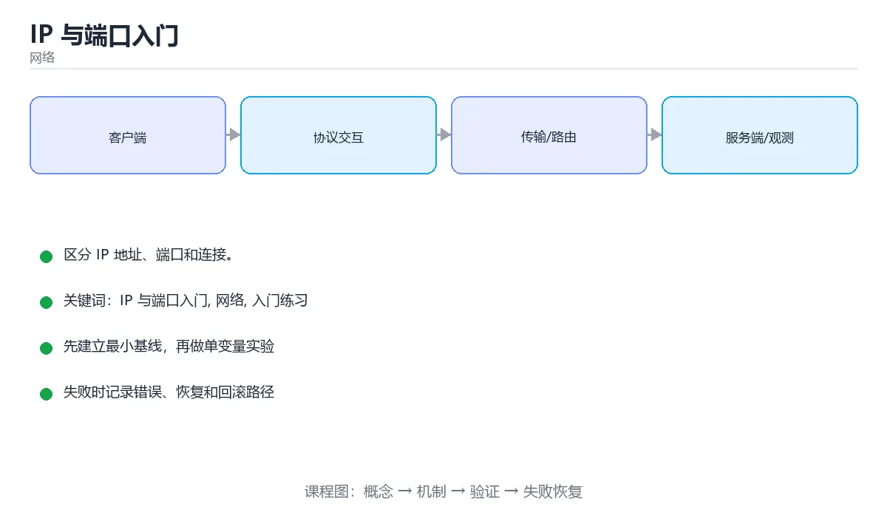

# IP 与端口入门



> 内容更新时间：2026-10-03 · 学习阶段：入门 · 预计用时：15 分钟

## 学习目标

- 先认识「IP 与端口入门」需要的工具、输入和输出。
- 按步骤运行最小示例，并记录结果与错误。
- 用一个边界输入验证自己是否真正掌握。

## 前置知识

- 会进行基本的文件或命令行操作。
- 不需要预先掌握「网络」的高级知识。

## 一句话入门

区分 IP 地址、端口和连接。

## 最小示例

```bash
python3 -m http.server 8000 --bind 127.0.0.1 >/dev/null 2>&1 &
server_pid=$!
sleep 1
curl -s -o /dev/null -w "%{http_code}\n" http://127.0.0.1:8000/
kill "$server_pid"
```

## 预期输出

```text
200
```

## 常见错误

- 输入或环境与示例不一致，导致结果不符合预期。
- 复制命令时遗漏空格、引号或必要参数。

## 动手练习

1. 原样运行最小示例，保存命令和输出。
2. 把数字 2 改成 10，预测并验证新结果。
3. 制造一个错误输入，写出错误信息和修复方法。

## 本课小结

- 入门阶段先保证能运行、能观察、能解释，再追求复杂功能。
- 每次只改一个变量，记录预测与实际结果。
- 遇到错误先看第一条错误信息，再回到最小示例。


## IP 地址与端口分别在定位什么

IP 地址定位网络中的一台主机或一个网络接口，端口号定位这台主机上的一个进程或服务。完整的 TCP 连接由源 IP、源端口、目标 IP、目标端口四元组唯一标识；即使两个请求访问同一个服务器端口，只要客户端端口或地址不同，它们仍是不同连接。IPv4 地址是 32 位，常用点分十进制表示；IPv6 是 128 位，用十六进制和冒号分组表示。端口号是 16 位，范围 0～65535，其中 0～1023 是知名端口，通常需要特权才能绑定。

客户端发起连接时，操作系统会分配一个临时端口；服务器通常监听固定端口，例如 HTTP 的 80、HTTPS 的 443、SSH 的 22。`127.0.0.1` 是回环地址，只在当前主机内部有效；`0.0.0.0` 作为监听地址表示绑定所有网卡，作为目标地址则表示“本机默认路由”。把服务绑定到 `127.0.0.1` 时，局域网中的其他机器无法访问；绑定到 `0.0.0.0` 时，还要同时考虑防火墙和认证，不能把“能监听”误认为“应该暴露”。

域名最终要解析成 IP，但一个域名可以对应多个地址，一个地址也可以承载多个域名，这就是虚拟主机和负载均衡的基础。NAT 让多个内网设备共享公网地址，路由器通过端口映射维护连接状态；因此外部主动连接内网设备通常需要端口转发，而内网设备主动访问外网则不需要。理解 NAT 后，就能解释“本机服务正常、外网访问失败”的常见现象。

## NAT、回环与常见连接问题

排查连接问题可以按四步走：先确认服务是否真的在监听，再确认监听地址是否正确，然后确认端口是否被防火墙放行，最后从客户端用 `curl`、`telnet` 或 `nc` 验证连通性。`Connection refused` 通常表示目标地址可达但端口没有服务或主动拒绝；`timeout` 更可能是防火墙丢包、路由不可达或服务无响应；`address already in use` 表示端口已被占用。

临时端口用尽、TIME_WAIT 过多、DNS 解析慢和 IPv4/IPv6 双栈选择错误，也都可能表现为“网络不稳定”。分析时要同时看客户端和服务端的连接状态、端口分布和超时时间，不要只凭一条错误信息下结论。对服务端来说，合理设置连接超时、backlog、文件描述符上限和健康检查，往往比盲目增加重试更有效。

练习时可以在本机启动一个最小 HTTP 服务，分别绑定 `127.0.0.1` 和 `0.0.0.0`，从本机与另一台设备访问，记录成功与失败的结果。再用 `ss` 或 `netstat` 查看监听地址和连接状态，把抽象概念对应到真实输出。

## 代码实验：把示例跑成证据

这一节不引入新语法，而是把「IP 与端口入门」的最小示例变成可以复现、可以对照的实验。每次只改变一个条件，先写预测，再运行，最后解释差异。

### 实验一：建立基线

```bash
python3 -m http.server 8000 --bind 127.0.0.1 >/dev/null 2>&1 &
server_pid=$!
sleep 1
curl -s -o /dev/null -w "%{http_code}\n" http://127.0.0.1:8000/
kill "$server_pid"
```

先原样运行上面的代码，记录命令、完整输出和退出状态。然后把输出与正文的预期输出逐字对照，不要用“看起来差不多”代替核对；空格、大小写、换行和错误流向都可能暴露环境差异。

### 实验二：只改一个输入

从代码中选一个会影响结果的字面量、参数或输入，把它替换成边界值：数值可尝试 0、1、最大值和最小值，字符串可尝试空串和超长文本，集合可尝试空集合、单元素和重复元素。先写出预测，再运行并记录实际结果。

### 实验三：制造一个可控错误

去掉变量展开外的引号，或者让管道中的前一段命令失败。记录退出码、标准错误和最终输出，确认错误是否被掩盖。

| 实验 | 改动 | 预测 | 实际 | 结论 |
| --- | --- | --- | --- | --- |
| 基线 | 保持原样 |  |  |  |
| 边界 |  |  |  |  |
| 失败 |  |  |  |  |

### 实验四：用三句话复述

1. 输入是什么，哪些输入属于合法范围，哪些属于边界或非法范围？
2. 程序按什么顺序处理输入，在哪一步产生了状态变化或副作用？
3. 输出如何验证，失败时第一条可观察证据是什么？

## 考点精讲：把测验题还原成判断过程

本课有 4 个判断点。先自己作答，再看「判断依据」；如果结论正确但理由不完整，回到正文对应章节补足概念。

### 考点 1：在网络通信中，IP 地址与端口分别定位什么？

- **正确判断**：IP 定位主机，端口定位该主机上的具体进程或服务
- **判断依据**：IP 地址把数据送到目标主机，端口号在同一主机上区分不同服务或连接端点，因此完整的通信地址通常写成「IP:端口」。操作系统根据端口把数据交给对应进程。理解这一分工，可以解释为什么同一台机器能同时运行网站、数据库与远程登录服务，也能帮助排查端口占用与连接被拒绝的问题。
- **迁移检查**：如果给某个错误选项去掉一个限定词，它会不会变成正确？说明理由。

### 考点 2：127.0.0.1 这个地址表示什么？

- **正确判断**：本机环回地址，数据不会离开当前设备
- **判断依据**：127.0.0.1 属于环回地址范围，访问它会直接由本机协议栈处理，不经过网卡与外部网络；localhost 通常解析到它。常用于本地开发与测试，因此服务绑定到它时只能本机访问，若要让其他设备访问需要绑定 0.0.0.0 或具体网卡地址，同时注意安全风险。
- **迁移检查**：把题干里的一个条件换成边界值，原来的结论还成立吗？写出判断过程。

### 考点 3：示例中 curl 输出的 200 表示什么？

- **正确判断**：HTTP 请求成功，服务器返回了正常响应
- **判断依据**：HTTP 状态码 200 表示请求已被成功处理；3xx 表示重定向，4xx 多为客户端问题，5xx 表示服务端错误。示例用 -w "%{http_code}" 只输出状态码，便于脚本判断服务是否可用。若服务未启动，curl 通常会输出连接失败错误而不是状态码。
- **迁移检查**：遮住选项，只根据定义复述一次答案，再回来看哪个选项与复述一致。

### 考点 4：关于端口号的使用，下列说法正确的是？

- **正确判断**：同一主机上同一端口同一时刻只能被一个进程监听
- **判断依据**：端口用于区分同一主机上的不同服务，同一传输协议下同一端口同时只能由一个进程监听，否则会提示地址已被占用；端口范围是 0 到 65535，其中 1024 以下通常需要特权。客户端连接时会由系统分配临时端口。若需要多个进程共享端口，通常要借助反向代理或套接字复用选项。
- **迁移检查**：把题干里的一个条件换成边界值，原来的结论还成立吗？写出判断过程。

## 本课复习清单

离开本课前，逐项确认：

- [ ] 不看解析，能说出「在网络通信中，IP 地址与端口分别定位什么？」的判断依据。
- [ ] 不看解析，能说出「127.0.0.1 这个地址表示什么？」的判断依据。
- [ ] 不看解析，能说出「示例中 curl 输出的 200 表示什么？」的判断依据。
- [ ] 不看解析，能说出「关于端口号的使用，下列说法正确的是？」的判断依据。
- [ ] 至少运行一次本课示例，记录输入、输出和一个边界情况。
- [ ] 把本课最容易混淆的两个概念写成一句话对照。

| 复盘项 | 记录 |
| --- | --- |
| 已经能独立解释的考点 |  |
| 仍然说不清的概念 |  |
| 下一步验证动作 |  |

## 逐节复习与自检

下面按正文顺序回顾每一节，并给出一个自检问题；说不清的地方回到原章节补课。

### 最小示例

```bash
python3 -m http.server 8000 --bind 127.0.0.1 >/dev/null 2>&1 &
server_pid=$!
sleep 1
curl -s -o /dev/null -w "%{http_code}\n" http://127.0.0.1:8000/
kill "$server_pid"
```

自检：这一节与相邻主题的边界在哪里？

### 预期输出

```text
200
```

自检：这一节与相邻主题的边界在哪里？

### 常见错误

输入或环境与示例不一致，导致结果不符合预期。

自检：把这一节讲给没学过的人，最需要强调哪一点？

### 动手练习

把数字 2 改成 10，预测并验证新结果。制造一个错误输入，写出错误信息和修复方法。

自检：如果去掉这一节里的一个前提，结论会怎样变化？

### IP 地址与端口分别在定位什么

IP 地址定位网络中的一台主机或一个网络接口，端口号定位这台主机上的一个进程或服务。完整的 TCP 连接由源 IP、源端口、目标 IP、目标端口四元组唯一标识；即使两个请求访问同一个服务器端口，只要客户端端口或地址不同，它们仍是不同连接。

自检：用自己的话复述这一节，并举一个反例。

### NAT、回环与常见连接问题

排查连接问题可以按四步走：先确认服务是否真的在监听，再确认监听地址是否正确，然后确认端口是否被防火墙放行，最后从客户端用 `curl`、`telnet` 或 `nc` 验证连通性。`Connection refused` 通常表示目标地址可达但端口没有服务或主动拒绝；`timeout` 更可能是防火墙丢包、路由不可达或服务无响应；`address already in use` 表示端口已被占用。

自检：这一节的关键输入与输出分别是什么？

## 术语速查

| 术语 | 本课语境 |
| --- | --- |
| `127.0.0.1` | 客户端发起连接时，操作系统会分配一个临时端口；服务器通常监听固定端口，例如 HTTP 的 80、HTTPS 的 443、SSH 的 22。`127.0.0.1` 是回环地址，只在当前主机内部有效；`0.0.0.0` 作为监听地址表示绑定所有… |
| `0.0.0.0` | 客户端发起连接时，操作系统会分配一个临时端口；服务器通常监听固定端口，例如 HTTP 的 80、HTTPS 的 443、SSH 的 22。`127.0.0.1` 是回环地址，只在当前主机内部有效；`0.0.0.0` 作为监听地址表示绑定所有… |
| `curl` | 排查连接问题可以按四步走：先确认服务是否真的在监听，再确认监听地址是否正确，然后确认端口是否被防火墙放行，最后从客户端用 `curl`、`telnet` 或 `nc` 验证连通性。`Connection refused` 通常表示目标地址可… |
| `telnet` | 排查连接问题可以按四步走：先确认服务是否真的在监听，再确认监听地址是否正确，然后确认端口是否被防火墙放行，最后从客户端用 `curl`、`telnet` 或 `nc` 验证连通性。`Connection refused` 通常表示目标地址可… |
| `nc` | 排查连接问题可以按四步走：先确认服务是否真的在监听，再确认监听地址是否正确，然后确认端口是否被防火墙放行，最后从客户端用 `curl`、`telnet` 或 `nc` 验证连通性。`Connection refused` 通常表示目标地址可… |
| `Connection refused` | 排查连接问题可以按四步走：先确认服务是否真的在监听，再确认监听地址是否正确，然后确认端口是否被防火墙放行，最后从客户端用 `curl`、`telnet` 或 `nc` 验证连通性。`Connection refused` 通常表示目标地址可… |
| `timeout` | 排查连接问题可以按四步走：先确认服务是否真的在监听，再确认监听地址是否正确，然后确认端口是否被防火墙放行，最后从客户端用 `curl`、`telnet` 或 `nc` 验证连通性。`Connection refused` 通常表示目标地址可… |
| `address already in use` | 排查连接问题可以按四步走：先确认服务是否真的在监听，再确认监听地址是否正确，然后确认端口是否被防火墙放行，最后从客户端用 `curl`、`telnet` 或 `nc` 验证连通性。`Connection refused` 通常表示目标地址可… |
| `ss` | 练习时可以在本机启动一个最小 HTTP 服务，分别绑定 `127.0.0.1` 和 `0.0.0.0`，从本机与另一台设备访问，记录成功与失败的结果。再用 `ss` 或 `netstat` 查看监听地址和连接状态，把抽象概念对应到真实输出。 |
| `netstat` | 练习时可以在本机启动一个最小 HTTP 服务，分别绑定 `127.0.0.1` 和 `0.0.0.0`，从本机与另一台设备访问，记录成功与失败的结果。再用 `ss` 或 `netstat` 查看监听地址和连接状态，把抽象概念对应到真实输出。 |

## English Overview

**Title:** IP and Ports Basics

**Summary:** Distinguish IP addresses, ports and connections.

**Category:** Networking  
**Level:** 入门  
**Key terms:** IP 与端口入门, 网络, 入门练习

> The full tutorial is written in Chinese. This bilingual overview helps English readers identify the topic, scope and key terms before studying the detailed examples.

## 内容元数据

- 内容版本：v2.0
- 最后更新：2026-10-03
- 学习阶段：入门
- 适用环境：TCP/IP、HTTP/2、HTTP/3 与现代网络栈
- 内容来源：内置结构化课程与工程实践整理
- 相关主题：IP 与端口入门、网络、入门练习
- 质量版本：P0 测验标准 + P1 覆盖扩展 + P2 体验补全


## 参考资料与复核

- 最后复核：2026-10-04
- 下次复核：2027-04-04
- 复核范围：版本兼容、API 行为、安全建议与工程实践
- 来源性质：官方文档与标准；本课正文为离线教学重组，不复制原文

| 参考资料 | 本课用途 |
| --- | --- |
| [RFC Editor](https://www.rfc-editor.org/) | 互联网协议标准 |
| [MDN HTTP](https://developer.mozilla.org/docs/Web/HTTP) | HTTP 语义与浏览器行为 |

> 本课主题：区分 IP 地址、端口和连接。

> App 完全离线展示文字链接，不会自动联网；需要延伸阅读时可复制链接到浏览器。
