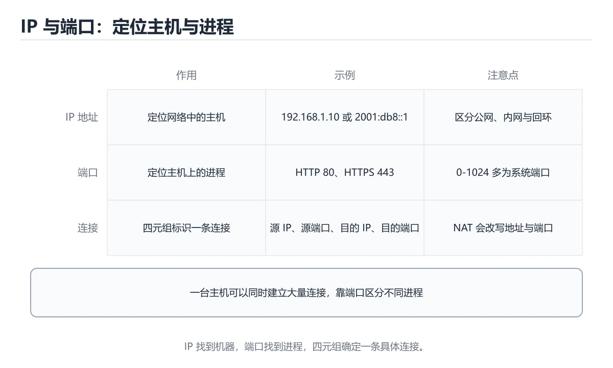

# IP 与端口入门

> 内容更新时间：2026-10-06 · 学习阶段：基础 · 预计用时：35 分钟




## 本节知识框架

**课程定位**：所属分类 `network`（网络），课程主题 `IP 与端口入门`，学习阶段 基础，建议用时 45 分钟。

本课主线：区分 IP 地址、端口和连接。

**学完本课应当能够**
- 说清 `IP 地址` 与 `子网与掩码` 的含义与区别，并各举一个正例和一个反例。
- 用本课示例验证 `端口` 的行为，记录输入、输出与失败条件。
- 遇到「混淆地址与端口的职责」这类问题时，能说出触发条件与修复顺序。

### 从概念到验证的学习链条

1. `IP 地址`：先掌握 标识网络中一台主机的地址，IPv4 为 32 位，IPv6 为 128 位，再用它解释 `子网与掩码` 为什么会出现。
2. `子网与掩码`：先掌握 掩码划分网络号与主机号，决定哪些地址在同一网段，再用它解释 `端口` 为什么会出现。
3. `端口`：先掌握 同一主机上区分不同服务的编号，0~1023 多为知名端口，再用它解释 `客户端与服务器` 为什么会出现。
4. `客户端与服务器`：先掌握 客户端主动发起连接，服务器在固定端口上监听，再用它解释 `NAT` 为什么会出现。
5. `NAT`：先掌握 把内网地址转换成公网地址，让多台设备共享一个出口 IP，再用它解释 本课示例的观察结果 为什么会出现。

**先修与衔接**：本课是「网络」分类的第 3 课。先修内容：《网络分层入门》。《网络分层入门》里的 `分层模型`、`封装与解封装` 是本课的前提。

### 完成判据

- **定义关**：不看正文也能说明 `IP 地址` 是 标识网络中一台主机的地址，IPv4 为 32 位，IPv6 为 128 位，并指出一个反例。
- **机制关**：能按“输入 → 转换 → 输出 → 验证”复述 `IP 与端口入门`，而不是只背结论。
- **示例关**：能运行或推演 `IP 与端口入门` 的 `bash` 示例，并说明一个真实出现的标识符或字面量。
- **证据关**：能指出 `IP 与端口入门` 示例里的 出现字面量 `$server_pid`，并说明它支持或反驳了本课的哪一条结论。
- **排错关**：能复现 混淆地址与端口的职责，记录现象并按 地址定位主机，端口定位主机上的进程 修复。
- **迁移关**：能把 `IP 与端口入门`、`网络`、`入门练习` 放进一个与 `IP 与端口入门` 不同的项目场景，并保持输入与验证条件可追踪。
- **复盘关**：学完 `IP 与端口入门` 后，用一句话写下仍然不确定的结论，并列出下一次验证需要的输入、环境和成功判据。

### 复习清单

- [ ] 能不看正文复述本课核心术语，并指出一个边界或反例。
- [ ] 能运行或推演本课示例，记录输入、输出与失败现象。
- [ ] 能完成一次自测，并把错题对照错误表定位原因。

## 核心概念定义

| 术语 | 操作性定义 | 常见边界与风险 |
| --- | --- | --- |
| IP 地址 | 标识网络中一台主机的地址，IPv4 为 32 位，IPv6 为 128 位。 | 网络延迟、超时与版本协商会改变行为，只在真实链路或多版本客户端上验证才算数。 |
| 子网与掩码 | 掩码划分网络号与主机号，决定哪些地址在同一网段。 | 网络延迟、超时与版本协商会改变行为，只在真实链路或多版本客户端上验证才算数。 |
| 端口 | 同一主机上区分不同服务的编号，0~1023 多为知名端口。 | 易错：以为换端口能解决地址冲突；正确做法是地址定位主机，端口定位主机上的进程。 |
| 客户端与服务器 | 客户端主动发起连接，服务器在固定端口上监听。 | 只在「客户端主动发起连接，服务器在固定端口上监听」这一前提下成立，换输入或换环境要重新验证。 |
| NAT | 把内网地址转换成公网地址，让多台设备共享一个出口 IP。 | 共享状态与调度顺序会改变结论，单线程或串行测试通过不等于并发下成立。 |

## 原理与运行机制

### 机制总览

**教材衔接：一句话入门**

区分 IP 地址、端口和连接。

**教材衔接：IP 地址与端口分别在定位什么**

IP 地址定位网络中的一台主机或一个网络接口，端口号定位这台主机上的一个进程或服务。完整的 TCP 连接由源 IP、源端口、目标 IP、目标端口四元组唯一标识；即使两个请求访问同一个服务器端口，只要客户端端口或地址不同，它们仍是不同连接。IPv4 地址是 32 位，常用点分十进制表示；IPv6 是 128 位，用十六进制和冒号分组表示。端口号是 16 位，范围 0～65535，其中 0～1023 是知名端口，通常需要特权才能绑定。

客户端发起连接时，操作系统会分配一个临时端口；服务器通常监听固定端口，例如 HTTP 的 80、HTTPS 的 443、SSH 的 22。`127.0.0.1` 是回环地址，只在当前主机内部有效；`0.0.0.0` 作为监听地址表示绑定所有网卡，作为目标地址则表示“本机默认路由”。把服务绑定到 `127.0.0.1` 时，局域网中的其他机器无法访问；绑定到 `0.0.0.0` 时，还要同时考虑防火墙和认证，不能把“能监听”误认为“应该暴露”。

域名最终要解析成 IP，但一个域名可以对应多个地址，一个地址也可以承载多个域名，这就是虚拟主机和负载均衡的基础。NAT 让多个内网设备共享公网地址，路由器通过端口映射维护连接状态；因此外部主动连接内网设备通常需要端口转发，而内网设备主动访问外网则不需要。理解 NAT 后，就能解释“本机服务正常、外网访问失败”的常见现象。

**教材衔接：NAT、回环与常见连接问题**

排查连接问题可以按四步走：先确认服务是否真的在监听，再确认监听地址是否正确，然后确认端口是否被防火墙放行，最后从客户端用 `curl`、`telnet` 或 `nc` 验证连通性。`Connection refused` 通常表示目标地址可达但端口没有服务或主动拒绝；`timeout` 更可能是防火墙丢包、路由不可达或服务无响应；`address already in use` 表示端口已被占用。

临时端口用尽、TIME_WAIT 过多、DNS 解析慢和 IPv4/IPv6 双栈选择错误，也都可能表现为“网络不稳定”。分析时要同时看客户端和服务端的连接状态、端口分布和超时时间，不要只凭一条错误信息下结论。对服务端来说，合理设置连接超时、backlog、文件描述符上限和健康检查，往往比盲目增加重试更有效。

练习时可以在本机启动一个最小 HTTP 服务，分别绑定 `127.0.0.1` 和 `0.0.0.0`，从本机与另一台设备访问，记录成功与失败的结果。再用 `ss` 或 `netstat` 查看监听地址和连接状态，把抽象概念对应到真实输出。

**教材衔接：深入补充：IP 与端口入门 的取舍与边界**


### 机制拆解：每一步的输入、动作与输出

#### 1. `IP 地址`
- 输入：`IP 与端口入门`；本步把 标识网络中一台主机的地址，IPv4 为 32 位，IPv6 为 128 位 当作判断规则。
- 动作：围绕 `IP 地址` 保留中间状态，并记录它与 `子网与掩码` 的对应关系。
- 输出：`子网与掩码`，它可以被下一段代码、测试或记录继续使用。
- `IP 地址` 的失败条件：网络延迟、超时与版本协商会改变行为，只在真实链路或多版本客户端上验证才算数。

#### 2. `子网与掩码`
- 输入：`IP 地址`；本步把 掩码划分网络号与主机号，决定哪些地址在同一网段 当作判断规则。
- 动作：围绕 `子网与掩码` 保留中间状态，并记录它与 `端口` 的对应关系。
- 输出：`端口`，它可以被下一段代码、测试或记录继续使用。
- `子网与掩码` 的失败条件：网络延迟、超时与版本协商会改变行为，只在真实链路或多版本客户端上验证才算数。

#### 3. `端口`
- 输入：`子网与掩码`；本步把 同一主机上区分不同服务的编号，0~1023 多为知名端口 当作判断规则。
- 动作：围绕 `端口` 保留中间状态，并记录它与 `客户端与服务器` 的对应关系。
- 输出：`客户端与服务器`，它可以被下一段代码、测试或记录继续使用。
- `端口` 的失败条件：当混淆地址与端口的职责时，会出现以为换端口能解决地址冲突。

#### 4. `客户端与服务器`
- 输入：`端口`；本步把 客户端主动发起连接，服务器在固定端口上监听 当作判断规则。
- 动作：围绕 `客户端与服务器` 保留中间状态，并记录它与 `NAT` 的对应关系。
- 输出：`NAT`，它可以被下一段代码、测试或记录继续使用。
- `客户端与服务器` 的失败条件：只在「客户端主动发起连接，服务器在固定端口上监听」这一前提下成立，换输入或换环境要重新验证。

#### 5. `NAT`
- 输入：`客户端与服务器`；本步把 把内网地址转换成公网地址，让多台设备共享一个出口 IP 当作判断规则。
- 动作：围绕 `NAT` 保留中间状态，并记录它与 `$server_pid` 的对应关系。
- 输出：`$server_pid`，它可以被下一段代码、测试或记录继续使用。
- `NAT` 的失败条件：共享状态与调度顺序会改变结论，单线程或串行测试通过不等于并发下成立。

### 示例中的可观察事实

1. 出现字面量 `$server_pid`；它对应的课程主题是 `IP 与端口入门`。

### 复现实验记录

- 环境：`IP 与端口入门` 使用 `bash` 示例，固定 `IP 与端口入门`、`网络`、`入门练习` 作为第一组条件。
- 首轮输入：先确认 出现字面量 `$server_pid`，预测 `IP 地址` 会怎样变化。
- 基线观察：记录命令、输入、输出和错误原文，不用截图代替可复制的文本。
- 单变量修改：只改变 `IP 与端口入门`，观察 `NAT` 是否仍满足定义。
- 失败注入：复现 混淆地址与端口的职责，确认现象是 以为换端口能解决地址冲突。
- 记录结论：把“修改前、修改后、预期变化、实际变化”写成四列表，这样复盘 `IP 与端口入门` 时才能区分概念错误与实现错误。

## 典型应用场景

**教材衔接：代码实验：把示例跑成证据**

### 实验一：建立基线

```bash
python3 -m http.server 8000 --bind 127.0.0.1 >/dev/null 2>&1 &
server_pid=$!
sleep 1
curl -s -o /dev/null -w "%{http_code}\n" http://127.0.0.1:8000/
kill "$server_pid"
```

### 实验二：只改一个输入

沿用「IP 与端口入门」的最小示例做一次单变量实验：

做完后用一句话写出「IP 与端口入门」的结论：输入怎么变，结果才怎么变。

### 实验三：制造一个可控错误

在 IP 与端口入门 相关命令里去掉引号或让管道前段失败，记录退出码与标准错误，确认错误是否被掩盖。

### 实验四：用三句话复述

1. IP 与端口入门 的输入是什么，哪些取值合法，哪些属于边界或非法范围？
2. 在 IP 地址与端口分别在定位什么 里，网络 的状态是在什么条件下被改变的？
3. 输出如何验证，失败时第一条可观察证据是什么？

- **混淆地址与端口的职责**：典型现象是以为换端口能解决地址冲突；正确做法是地址定位主机，端口定位主机上的进程。
- **把端口当成可以随意重复绑定**：典型现象是服务启动时报端口占用；正确做法是确认监听状态与释放时机，避免重复绑定。
- **忽略私有地址与公网地址的区别**：典型现象是内网地址无法被外部直接访问；正确做法是区分地址类型，并配置映射或反向代理。

### 最小验证场景

- 准备：保留 `bash` 示例的原始输入，先记录 `IP 与端口入门` 的基线输出和完整运行命令。
- 观察：先核对 出现字面量 `$server_pid`，再改变一个与 `IP 地址` 相关的条件。
- 判定：新结果与 `IP 与端口入门` 的基线不同不等于错误；只有当差异破坏了 `IP 地址` 的定义或错误表中的约束，才判定为失败。

### 选择与边界

- 使用 `IP 地址` 时，先满足它的定义：标识网络中一台主机的地址，IPv4 为 32 位，IPv6 为 128 位；网络延迟、超时与版本协商会改变行为，只在真实链路或多版本客户端上验证才算数。
- 使用 `子网与掩码` 时，先满足它的定义：掩码划分网络号与主机号，决定哪些地址在同一网段；网络延迟、超时与版本协商会改变行为，只在真实链路或多版本客户端上验证才算数。
- 使用 `端口` 时，先满足它的定义：同一主机上区分不同服务的编号，0~1023 多为知名端口；易错：以为换端口能解决地址冲突；正确做法是地址定位主机，端口定位主机上的进程。
- 使用 `客户端与服务器` 时，先满足它的定义：客户端主动发起连接，服务器在固定端口上监听；只在「客户端主动发起连接，服务器在固定端口上监听」这一前提下成立，换输入或换环境要重新验证。
- 使用 `NAT` 时，先满足它的定义：把内网地址转换成公网地址，让多台设备共享一个出口 IP；共享状态与调度顺序会改变结论，单线程或串行测试通过不等于并发下成立。

## 代码/协议/SQL 示例

### 最小可验证示例

**教材衔接：最小示例**

**教材衔接：预期输出**

```text
200
```

**运行方式**：运行 `IP 与端口入门` 的示例时，用 `bash 文件名.sh` 运行；先 `bash -n` 做语法检查更稳妥。

### 示例精读：先找证据，再改一个条件

1. 出现字面量 `$server_pid`；它出现在 `IP 与端口入门` 的示例中，阅读时先确认它前后各发生了什么。
- 在 `IP 与端口入门` 中与 `IP 地址` 对照：示例必须能支持 标识网络中一台主机的地址，IPv4 为 32 位，IPv6 为 128 位，否则说明这一段还缺少实现或验证步骤。
- 在 `IP 与端口入门` 中与 `子网与掩码` 对照：示例必须能支持 掩码划分网络号与主机号，决定哪些地址在同一网段，否则说明这一段还缺少实现或验证步骤。
- 在 `IP 与端口入门` 中与 `端口` 对照：示例必须能支持 同一主机上区分不同服务的编号，0~1023 多为知名端口，否则说明这一段还缺少实现或验证步骤。
- 在 `IP 与端口入门` 中与 `客户端与服务器` 对照：示例必须能支持 客户端主动发起连接，服务器在固定端口上监听，否则说明这一段还缺少实现或验证步骤。

## 时间/空间复杂度或性能分析

**性能关注点（IP 与端口入门）**：往返延迟与带宽是主要成本：记录 RTT、吞吐与重传率，区分局域网与真实链路。

**本课特有开销（IP 与端口入门 · IP 与端口入门）**：小文件看元数据开销，大文件看吞吐，两者要分别测量。

**测量方法**：以 `IP 与端口入门` 的 `IP 与端口入门` 场景为对象，固定输入跑一遍记录基线，再把规模或并发度提高一个数量级复测；两次结果的差值与波动范围才是结论依据。

### 需要控制的变量与记录项

- `IP 与端口入门` 的 `IP 与端口入门`：固定它的版本、输入范围和资源上限，分别记录速度、内存与失败率的变化。
- `IP 与端口入门` 的 `网络`：固定它的版本、输入范围和资源上限，分别记录速度、内存与失败率的变化。
- `IP 与端口入门` 的 `入门练习`：固定它的版本、输入范围和资源上限，分别记录速度、内存与失败率的变化。
- `IP 与端口入门` 中 `IP 地址` 的边界：网络延迟、超时与版本协商会改变行为，只在真实链路或多版本客户端上验证才算数。达到边界时不要外推，必须重新测量。
- `IP 与端口入门` 中 `子网与掩码` 的边界：网络延迟、超时与版本协商会改变行为，只在真实链路或多版本客户端上验证才算数。达到边界时不要外推，必须重新测量。
- `IP 与端口入门` 中 `端口` 的边界：易错：以为换端口能解决地址冲突；正确做法是地址定位主机，端口定位主机上的进程。达到边界时不要外推，必须重新测量。
- `IP 与端口入门` 中 `客户端与服务器` 的边界：只在「客户端主动发起连接，服务器在固定端口上监听」这一前提下成立，换输入或换环境要重新验证。达到边界时不要外推，必须重新测量。
- `IP 与端口入门` 中 `NAT` 的边界：共享状态与调度顺序会改变结论，单线程或串行测试通过不等于并发下成立。达到边界时不要外推，必须重新测量。
- `IP 与端口入门` 的代码证据：先验证 出现字面量 `$server_pid`，再记录该路径的输入规模与耗时；只看代码行数不能推出复杂度。

## 常见误区与易错点

| 容易写错的做法 | 实际现象 | 原因与正确做法 |
| --- | --- | --- |
| 混淆地址与端口的职责 | 以为换端口能解决地址冲突。 | 地址定位主机，端口定位主机上的进程。 |
| 把端口当成可以随意重复绑定 | 服务启动时报端口占用。 | 确认监听状态与释放时机，避免重复绑定。 |
| 忽略私有地址与公网地址的区别 | 内网地址无法被外部直接访问。 | 区分地址类型，并配置映射或反向代理。 |

### 现场 1：混淆地址与端口的职责

**症状**：以为换端口能解决地址冲突。

**根因与修复**：地址定位主机，端口定位主机上的进程。

**自检**：在本课示例里复现「混淆地址与端口的职责」，改成地址定位主机，端口定位主机上的进程后重跑；如果症状消失且失败路径按预期变化，说明定位正确。

### 现场 2：把端口当成可以随意重复绑定

**症状**：服务启动时报端口占用。

**根因与修复**：确认监听状态与释放时机，避免重复绑定。

**自检**：在本课示例里复现「把端口当成可以随意重复绑定」，改成确认监听状态与释放时机，避免重复绑定后重跑；如果症状消失且失败路径按预期变化，说明定位正确。

### 现场 3：忽略私有地址与公网地址的区别

**症状**：内网地址无法被外部直接访问。

**根因与修复**：区分地址类型，并配置映射或反向代理。

**自检**：在本课示例里复现「忽略私有地址与公网地址的区别」，改成区分地址类型，并配置映射或反向代理后重跑；如果症状消失且失败路径按预期变化，说明定位正确。

## 与其他知识点的关系

**教材衔接：复习与迁移**

### 概念复述

- 用一句话说明「IP 与端口入门」解决什么问题：区分 IP 地址、端口和连接。
- 写出IP 与端口入门、网络、入门练习之间的关系，并各举一个例子。
- 说出本课最容易混淆的两个概念，以及区分它们的判据。

### 正文逐节复核

- **IP 地址与端口分别在定位什么**：IP 地址定位网络中的一台主机或一个网络接口，端口号定位这台主机上的一个进程或服务。
- **NAT、回环与常见连接问题**：临时端口用尽、TIME_WAIT 过多、DNS 解析慢和 IPv4/IPv6 双栈选择错误，也都可能表现为“网络不稳定”。
- **实践任务**：本节围绕IP 与端口入门安排 3 个可交付任务，每个任务都要求留下可以复查的记录。
- **深入补充：IP 与端口入门 的取舍与边界**：学习IP 与端口入门时，最容易只记住结论而忽略前提。
- **逐节复习与自检**：IP 地址定位网络中的一台主机或一个网络接口，端口号定位这台主机上的一个进程或服务。


### 迁移练习

把「IP 与端口入门」的结论迁移到相邻主题，每次迁移都写清预测与证据：

- **先修**：`网络分层入门`。本课默认这些内容已经掌握。
- **术语归属**：`IP 地址`、`子网与掩码`、`端口` 的定义以本课「核心概念定义」为准，换到其他课程时先确认定义是否被改写。
- 同一分类的《网络分层入门》也涉及 `网络`；两课衔接时先确认这个术语的定义是否一致。

### 先修与后续术语接口

- `网络分层入门`：共同关键词 `网络`、`入门练习`。

### 容易混淆的相邻概念

- `IP 地址` 与 `子网与掩码`：前者强调 标识网络中一台主机的地址，IPv4 为 32 位，IPv6 为 128 位；后者强调 掩码划分网络号与主机号，决定哪些地址在同一网段。判断时分别检查两条定义的适用范围，不要只看名称相似就互换。
- `子网与掩码` 与 `端口`：前者强调 掩码划分网络号与主机号，决定哪些地址在同一网段；后者强调 同一主机上区分不同服务的编号，0~1023 多为知名端口。判断时分别检查两条定义的适用范围，不要只看名称相似就互换。
- `端口` 与 `客户端与服务器`：前者强调 同一主机上区分不同服务的编号，0~1023 多为知名端口；后者强调 客户端主动发起连接，服务器在固定端口上监听。判断时分别检查两条定义的适用范围，不要只看名称相似就互换。
- `客户端与服务器` 与 `NAT`：前者强调 客户端主动发起连接，服务器在固定端口上监听；后者强调 把内网地址转换成公网地址，让多台设备共享一个出口 IP。判断时分别检查两条定义的适用范围，不要只看名称相似就互换。

## 自测题与参考答案

> 先独立作答，再对照参考答案；答案都能在本课正文、术语表或错误表里找到依据。

### 自测 1（概念复述）

不看正文，写出 `IP 地址` 的操作性定义，并说明它与 `子网与掩码` 的区别。

**参考答案**：标识网络中一台主机的地址，IPv4 为 32 位，IPv6 为 128 位。

`子网与掩码` 的定位是：掩码划分网络号与主机号，决定哪些地址在同一网段；两者的差别要从适用对象与失败模式上说明。

### 自测 2（排错）

本课错误表记录了「混淆地址与端口的职责」这类做法。请写出它会出现的现象、根因，以及修复顺序。

**参考答案**：现象是以为换端口能解决地址冲突；正确做法是地址定位主机，端口定位主机上的进程。修复时先复现现象并保留证据，再改动一处假设重跑，确认现象消失。

### 自测 3（动手验证）

运行本课的 `bash` 示例，把其中的 `"%{http_code}\n"` 换成一个边界值后重新运行，记录输出与错误信息。

**参考答案**：正常输入下 `bash` 示例应当复现正文给出的结果；把 `"%{http_code}\n"` 换成边界值后，如果结果改变或报错，先核对它是否满足 `IP 与端口入门` 中`IP 地址` 的适用范围，再检查错误表里是否有同类现象。

### 自测 4（代码阅读）

阅读本课开头的 `bash` 示例，说明它体现了`IP 地址` 的哪一条性质，并指出改动哪个输入会让这条性质不再成立。

**参考答案**：`IP 地址` 的定义是 标识网络中一台主机的地址，IPv4 为 32 位，IPv6 为 128 位，示例正是在实现这条定义。改动与 `IP 地址` 有关的一个输入后，如果结果不再符合 `IP 与端口入门` 的正文描述，就说明该性质只在当前前提成立。

### 自测 5（迁移）

把 `IP 与端口入门` 的方法迁移到自己的项目：围绕 `IP 地址` 写出一个与错误表同类的风险点，并说明触发条件和检验方式。

**参考答案**：例如「忽略私有地址与公网地址的区别」，它会导致内网地址无法被外部直接访问；检验方式是按区分地址类型，并配置映射或反向代理改一处再复现，确认现象消失且没有引入新的失败分支。

### 自测 6（对比）

用一个表格对比 `IP 地址` 与 `子网与掩码`：各写一行适用场景、一行失败表现。

**参考答案**：`IP 地址` 的定义是标识网络中一台主机的地址，IPv4 为 32 位，IPv6 为 128 位；`子网与掩码` 的定义是掩码划分网络号与主机号，决定哪些地址在同一网段。两者的失败表现分别对应本课错误表里与本术语相关的行。

### 自测 7（排错顺序）

面对「混淆地址与端口的职责」引发的问题，请把“复现 以为换端口能解决地址冲突 → 保留证据 → 地址定位主机，端口定位主机上的进程 → 回归验证”四步写成可执行的检查清单。

**参考答案**：第一步按以为换端口能解决地址冲突复现；第二步记录输入、版本与完整报错；第三步按地址定位主机，端口定位主机上的进程只改一处；第四步重跑并确认失败路径也按预期变化。

### 自测 8（边界判断）

针对 `NAT`，分别写出“可以使用”的条件和“结论不再成立”的条件。

**参考答案**：共享状态与调度顺序会改变结论，单线程或串行测试通过不等于并发下成立。 同时要把 `NAT` 的定义 把内网地址转换成公网地址，让多台设备共享一个出口 IP 与实际输入逐项对照。

### 自测 9（机制重建）

不看正文，按输入、转换、输出、验证四段重建 `IP 地址` → `子网与掩码` → `端口` → `客户端与服务器` 的作用链。

**参考答案**：起点是 `IP 地址` 的定义 标识网络中一台主机的地址，IPv4 为 32 位，IPv6 为 128 位；中间每一步都保留可观察状态；终点由 `NAT` 检查，失败时回到错误表定位第一个偏离定义的步骤。

### 自测 10（综合排错）

在 `IP 与端口入门` 中，现象是 内网地址无法被外部直接访问。请围绕 忽略私有地址与公网地址的区别 写出最小复现、关键证据、修复动作和回归验证，并说明为什么不能只凭一次运行下结论。

**参考答案**：先复现 忽略私有地址与公网地址的区别，记录输入与完整错误；再按 区分地址类型，并配置映射或反向代理 只改一处。回归时同时跑正常路径和边界路径，只有两次结果都可解释，才把修复视为完成。

### 自测 11（一分钟复述）

用每分钟约 200 字的速度复述 `IP 与端口入门`：先给主问题，再按顺序说出 `IP 地址`、`子网与掩码`、`端口`、`客户端与服务器`，最后给一个失败案例。

**自评标准**：主问题必须对应 区分 IP 地址、端口和连接；每个术语都要能接上一句定义或边界；失败案例必须写成可观察现象，不能用“可能有风险”代替证据。

## 术语速查

| 术语 | 一句话说明 |
| --- | --- |
| `IP 地址` | 标识网络中一台主机的地址，IPv4 为 32 位，IPv6 为 128 位。 |
| `子网与掩码` | 掩码划分网络号与主机号，决定哪些地址在同一网段。 |
| `端口` | 同一主机上区分不同服务的编号，0~1023 多为知名端口。 |
| `客户端与服务器` | 客户端主动发起连接，服务器在固定端口上监听。 |
| `NAT` | 把内网地址转换成公网地址，让多台设备共享一个出口 IP。 |

**术语关系**：`IP 地址`（标识网络中一台主机的地址） → `子网与掩码`（掩码划分网络号与主机号） → `端口`（同一主机上区分不同服务的编号） → `客户端与服务器`（客户端主动发起连接）。

## 考点精讲

`IP 与端口入门` 的题库有 6 道题，下面逐题给出题干、正确项与判断依据：先自己作答，再核对正确项，最后回到正文对应小节复核。

### 考点 1：第 1 题

- **题目**：在网络通信中，IP 地址与端口分别定位什么？
- **正确项**：IP 定位主机，端口定位该主机上的具体进程或服务
- **判断依据**：这道题落在术语 `IP 地址` 上：标识网络中一台主机的地址，IPv4 为 32 位，IPv6 为 128 位。复习时把 `IP 地址` 的定义、适用边界和一个反例一起说清楚，再回到「核心概念定义」核对原文。

### 考点 2：第 2 题

- **题目**：127.0.0.1 这个地址表示什么？
- **正确项**：本机环回地址，数据不会离开当前设备
- **判断依据**：这道题检验本课主问题：区分 IP 地址、端口和连接。复习时先复述本课主问题，再举一个会让结论失效的输入。

### 考点 3：第 3 题

- **题目**：围绕“IP 与端口入门”中的 IP 与端口入门、网络、入门练习，下列哪两项是本课强调的实践判断？
- **正确项**：学习 IP 与端口入门 时要同时说明输入、输出和失败路径，不能只看正常流程；验证 网络 时要固定版本并覆盖边界输入，结论才可复现
- **判断依据**：这道题落在术语 `端口` 上：同一主机上区分不同服务的编号，0~1023 多为知名端口。复习时把 `端口` 的定义、适用边界和一个反例一起说清楚，再回到「核心概念定义」核对原文。

### 考点 4：第 4 题

- **题目**：关于端口号的使用，下列说法正确的是？
- **正确项**：同一主机上同一端口同一时刻只能被一个进程监听
- **判断依据**：这道题落在术语 `端口` 上：同一主机上区分不同服务的编号，0~1023 多为知名端口。复习时把 `端口` 的定义、适用边界和一个反例一起说清楚，再回到「核心概念定义」核对原文。

### 考点 5：第 5 题

- **题目**：填空：补齐下面这段术语说明中的空缺。课程 `区分 IP 地址、端口和连接。`，这段说明是：`____`：客户端主动发起连接，服务器在固定端口上监听。空缺处应填哪个术语？
- **正确项**：客户端与服务器
- **判断依据**：这道题落在术语 `IP 地址` 上：标识网络中一台主机的地址，IPv4 为 32 位，IPv6 为 128 位。复习时把 `IP 地址` 的定义、适用边界和一个反例一起说清楚，再回到「核心概念定义」核对原文。

### 考点 6：第 6 题

- **题目**：结合 `IP 与端口入门` 中围绕 `IP 地址` 的代码，哪一项说法与“区分 IP 地址、端口和连接。”一致？
- **正确项**：IP 定位主机，端口定位该主机上的具体进程或服务
- **判断依据**：这道题落在术语 `IP 地址` 上：标识网络中一台主机的地址，IPv4 为 32 位，IPv6 为 128 位。复习时把 `IP 地址` 的定义、适用边界和一个反例一起说清楚，再回到「核心概念定义」核对原文。

### 考点 7：`IP 地址`

- **要点**：标识网络中一台主机的地址，IPv4 为 32 位，IPv6 为 128 位。
- **IP 地址 的边界**：网络延迟、超时与版本协商会改变行为，只在真实链路或多版本客户端上验证才算数。

### 考点 8：`子网与掩码`

- **要点**：掩码划分网络号与主机号，决定哪些地址在同一网段。
- **子网与掩码 的边界**：网络延迟、超时与版本协商会改变行为，只在真实链路或多版本客户端上验证才算数。

### 考点 9：`端口`

- **要点**：同一主机上区分不同服务的编号，0~1023 多为知名端口。
- **端口 的边界**：易错：以为换端口能解决地址冲突；正确做法是地址定位主机，端口定位主机上的进程。

### 考点 10：`客户端与服务器`

- **要点**：客户端主动发起连接，服务器在固定端口上监听。
- **客户端与服务器 的边界**：只在「客户端主动发起连接，服务器在固定端口上监听」这一前提下成立，换输入或换环境要重新验证。

### 考点 11：`NAT`

- **要点**：把内网地址转换成公网地址，让多台设备共享一个出口 IP。
- **NAT 的边界**：共享状态与调度顺序会改变结论，单线程或串行测试通过不等于并发下成立。

### 考点 12：排错——混淆地址与端口的职责

- **现象**：以为换端口能解决地址冲突。
- **处理**：地址定位主机，端口定位主机上的进程。

### 考点 13：排错——把端口当成可以随意重复绑定

- **现象**：服务启动时报端口占用。
- **处理**：确认监听状态与释放时机，避免重复绑定。

### 考点 14：综合辨析——`IP 地址` 与 `NAT`

- **辨析点**：`IP 地址` 的定义是 标识网络中一台主机的地址，IPv4 为 32 位，IPv6 为 128 位；`NAT` 的定义是 把内网地址转换成公网地址，让多台设备共享一个出口 IP。
- **答题要求**：面对 `IP 与端口入门` 的题目，先判断描述的是 `IP 地址` 还是 `NAT`，再归到对应定义，最后写出一个会让该定义失效的边界输入。

### 考点 15：排错评分点

- **现象分**：能写出 以为换端口能解决地址冲突，而不是只写“程序有错”。
- **证据分**：保留触发 混淆地址与端口的职责 的输入、版本和错误原文。
- **修复分**：按 地址定位主机，端口定位主机上的进程 只改一处，并同时回归正常路径与边界路径。

## 内容元数据

- 内容版本：v2.0
- 最后更新：2026-10-06
- 学习阶段：基础
- 适用环境：主流网络栈；本课讨论 server_pid 在其中的位置。
- 内容来源：内置结构化课程与工程实践整理
- 相关主题：IP 与端口入门、网络、入门练习
- 质量版本：P0 测验标准 + P1 覆盖扩展 + P2 体验补全

## 参考资料与复核

- 最后复核：2026-10-04
- 下次复核：2027-06-24
- 复核范围：版本兼容、API 行为、安全建议与工程实践
- 来源性质：官方文档、标准或权威教材；本课核对关键词：IP 与端口入门、网络、入门练习。

| 参考资料 | 本课用途 |
| --- | --- |
| [IANA 协议注册表](https://www.iana.org/protocols) | 端口、协议号与参数 |
| [RFC 9112 HTTP/1.1](https://www.rfc-editor.org/rfc/rfc9112) | HTTP/1.1 报文与连接 |
| [RFC 1035 DNS](https://www.rfc-editor.org/rfc/rfc1035) | DNS 报文与解析 |

| [本课术语索引：IP 与端口入门](#核心概念定义) | 按本课输入、术语边界和错误表现逐项核对 |
> 「IP 与端口入门」的链接用于离线阅读后的延伸核对；App 不会自动联网。