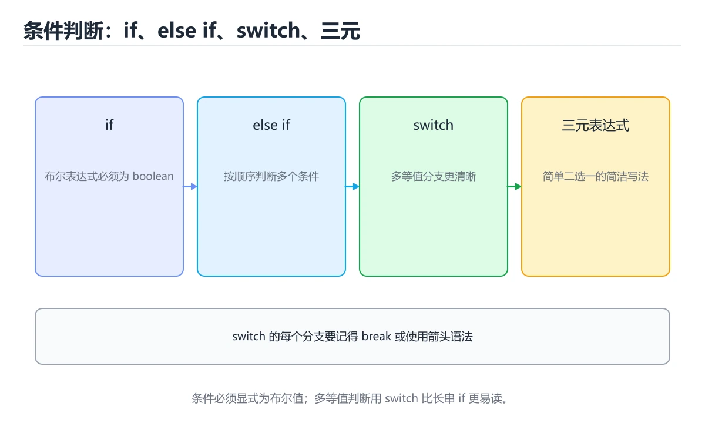
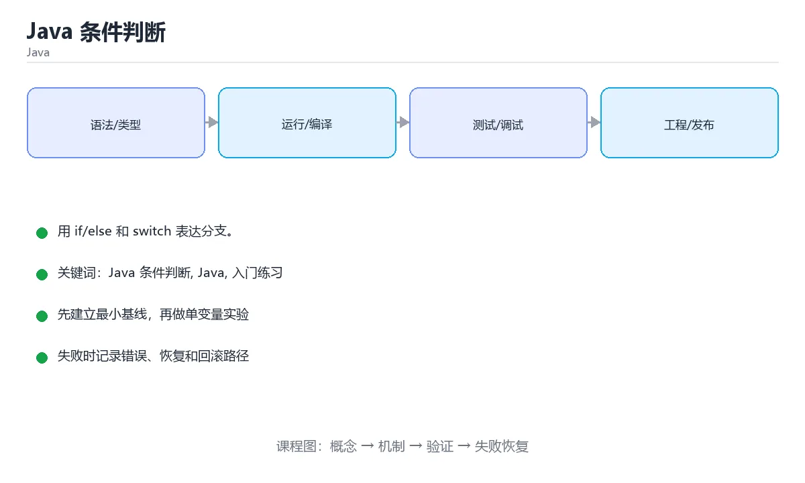

# 本课主题

> 内容更新时间：2026-10-03





## 学习目标

- 先认识本课主题需要的工具、输入和输出。
- 按步骤运行最小示例，并记录结果与错误。
- 用一个边界输入验证自己是否真正掌握。

## 前置知识

- 会进行基本的文件或命令行操作。
- 不需要预先掌握「Java」的高级知识。

## 一句话入门

用 if/else 和 switch 表达分支。

## 最小示例

```java
public class Main {
    public static void main(String[] args) {
        int temperature = 31;
        System.out.println(temperature > 30 ? "hot" : "normal");
    }
}
```

## 预期输出

```text
hot
```

## 常见错误

- 类名与文件名不一致，导致编译失败。
- 复制命令时遗漏空格、引号或必要参数。

## 动手练习

1. 原样运行最小示例，保存命令和输出。
2. 把数字 2 改成 10，预测并验证新结果。
3. 制造一个错误输入，写出错误信息和修复方法。

## 本课小结

- 入门阶段先保证能运行、能观察、能解释，再追求复杂功能。
- 每次只改一个变量，记录预测与实际结果。
- 遇到错误先看第一条错误信息，再回到最小示例。

## 代码实验：把示例跑成证据

### 实验一：建立基线

```java
public class Main {
    public static void main(String[] args) {
        int temperature = 31;
        System.out.println(temperature > 30 ? "hot" : "normal");
    }
}
```

### 实验二：只改一个输入

### 实验三：制造一个可控错误

把变量声明成不兼容的类型，或者删除一个必要的分号。记录编译器给出的类型错误与位置，修复后确认输出没有变化。

| 实验 | 改动 | 预测 | 实际 | 结论 |
| --- | --- | --- | --- | --- |
| 基线 | 保持原样 |  |  |  |
| 边界 |  |  |  |  |
| 失败 |  |  |  |  |

### 实验四：用三句话复述

1. 输入是什么，哪些输入属于合法范围，哪些属于边界或非法范围？
2. 程序按什么顺序处理输入，在哪一步产生了状态变化或副作用？
3. 输出如何验证，失败时第一条可观察证据是什么？

## Java 基础机制速览

### JDK、JVM 与字节码

Java 源码编译成平台无关的字节码，JVM 负责加载、验证、解释和即时编译。JDK 包含编译器和工具，JRE 只包含运行环境。类加载器按委托模型加载类，`main` 方法是程序入口。理解编译期与运行期的区别，能定位“编译通过但运行时找不到类”和“类型擦除导致的行为差异”。

### 类、对象与静态成员

类是对象的模板，对象保存实例字段，方法定义行为。`static` 成员属于类而不是实例，静态方法不能直接访问实例字段。构造器初始化对象，`this` 指向当前实例，`super` 调用父类成员。封装通过访问修饰符实现，继承表达“是一个”，组合表达“有一个”；优先使用组合降低耦合。`equals`、`hashCode` 和 `toString` 要根据值语义一致地重写。

### 类型、装箱与字符串

Java 有基本类型和引用类型，泛型不能直接使用基本类型，需要装箱成包装类。自动装箱方便但会增加对象分配，比较包装类应使用 `equals` 而不是 `==`。字符串不可变，拼接会产生新对象，循环中应使用 `StringBuilder`。`final` 表示引用不可重新赋值，不代表对象内容不可变。

### 集合、泛型与函数式接口

`List`、`Set`、`Map` 是集合接口，`ArrayList`、`HashSet`、`HashMap` 是常见实现。泛型在编译期提供类型检查，运行时发生类型擦除，因此不能创建泛型数组，也不能依赖运行时泛型信息。Stream 提供声明式的筛选、映射和聚合，但要注意惰性、短路和并行流的线程安全。Lambda 和函数式接口让行为可以作为参数传递。

### 异常、资源与并发

受检异常必须在签名中声明或捕获，非受检异常通常表示编程错误。`try-with-resources` 自动关闭实现 AutoCloseable 的资源。线程共享堆内存，必须使用同步、锁、原子类或并发集合保护共享状态；线程池避免频繁创建线程，但要合理设置队列、拒绝策略和超时。虚拟线程降低了高并发 I/O 的线程成本，但不会自动消除数据竞争。

## 本课自测清单与错误对照

本课测验以直接定义和步骤判断为主。请把每个错误选项改写成一句反例，
说明它在哪个输入、边界或前提变化下会失败。

### 完成标准

- [ ] 能用具体输入复现最小示例，并逐行解释输入、处理与输出。
- [ ] 能只改一个值完成边界实验，并让预测与实际结果一致。
- [ ] 能制造一个可控错误，读出第一条错误信息并完成修复。
- [ ] 能不看书说出本课至少两个易错点和对应的验证方法。

### 复盘记录

| 项目 | 记录 |
| --- | --- |
| 学到的核心机制 |  |
| 仍然不确定的问题 |  |
| 下一步验证动作 |  |

## 实践任务

本节围绕本课主题安排 3 个可交付任务，每个任务都要求留下可以复查的记录。

### 任务 1：用自己的话画出结构

### 任务 2：做一次对比实验

**验收标准**：表格里两个方案的结论不能完全一样；写下“在什么条件下应该换方案”。

### 任务 3：迁移到自己的场景

**验收标准**：至少有一个可复现的命令、代码片段或数据样例；结论能被别人独立检查。

## 故障现场

### 现场 1：本课的 本课主题 常规用例通过，但边界用例失败

### 现场 2：本课的 Java 结果在两次运行之间不一致

**症状**：在本课的练习或生产场景里出现“本课的 Java 结果在两次运行之间不一致”。

**复现**：准备一组最小输入，只保留触发“本课的 Java 结果在两次运行之间不一致”的必要条件，连续运行两次确认结果稳定。

**定位**：围绕“Java 依赖了当前版本、执行顺序或共享状态，单次运行无法暴露差异”检查调用链、输入数据和环境配置，先验证假设再改代码。

**预防**：把“本课的 Java 结果在两次运行之间不一致”写成一条自动化用例，并在本课的验收清单里保留对应检查项。

### 现场 3：本课的验证只在开发机通过

**症状**：在本课的练习或生产场景里出现“本课的验证只在开发机通过”。

## 版本与时效

- Java 25 是当前 LTS，Java 21 仍是大量生产系统的基线
- 虚拟线程、记录模式、结构化并发与分代 ZGC 是升级收益最大的部分
- 升级前重点检查反射、字节码增强、序列化与第三方框架兼容性

### 升级检查清单

- 先固定当前版本，跑通全部示例与测验，再升级工具链。
- 只改一个版本变量，记录编译、测试、性能与产物体积的变化。
- 重点回归默认值、弃用警告、序列化格式、并发语义和错误信息。
- 升级完成后更新本课的“最后复核 / 下次复核”日期与版本说明。

## 本课复习清单

离开本课前，逐项确认：

- [ ] 不看解析，能说出「表达式 temperature > 30 ? "hot" : "normal" …」的判断依据。
- [ ] 不看解析，能说出「Java 中比较两个字符串内容是否相同，应该使用哪个方法？」的判断依据。
- [ ] 不看解析，能说出「switch 语句中，多个 case 共享同一段处理逻辑的常见写法是？」的判断依据。
- [ ] 不看解析，能说出「条件判断中的浮点数比较，为什么要格外小心？」的判断依据。
- [ ] 不看解析，能说出「填空：本课主题术语速查中，表示「Java 源码编译成平台无关的字节…」的判断依据。
- [ ] 至少运行一次本课示例，记录输入、输出和一个边界情况。
- [ ] 把本课最容易混淆的两个概念写成一句话对照。

| 复盘项 | 记录 |
| --- | --- |
| 已经能独立解释的考点 |  |
| 仍然说不清的概念 |  |
| 下一步验证动作 |  |

## 逐节复习与自检

下面按正文顺序回顾每一节，并给出一个自检问题；说不清的地方回到原章节补课。

### 一句话入门

自检：这一节的关键输入与输出分别是什么？

### 最小示例

```java
public class Main {
    public static void main(String[] args) {
        int temperature = 31;
        System.out.println(temperature > 30 ? "hot" : "normal");
    }
}
```

自检：这一节与相邻主题的边界在哪里？

### 预期输出

```text
hot
```

### 动手练习

自检：如果去掉这一节里的一个前提，结论会怎样变化？

## 术语速查

| 术语 | 本课语境 |
| --- | --- |
| `main` | Java 源码编译成平台无关的字节码，JVM 负责加载、验证、解释和即时编译。JDK 包含编译器和工具，JRE 只包含运行环境。类加载器按委托模型加载类，`main` 方法是程序入口。理解编译期与运行期的区别，能定位“编… |
| `static` | 类是对象的模板，对象保存实例字段，方法定义行为。`static` 成员属于类而不是实例，静态方法不能直接访问实例字段。构造器初始化对象，`this` 指向当前实例，`super` 调用父类成员。封装通过访问修饰符实现，继… |
| `this` | 类是对象的模板，对象保存实例字段，方法定义行为。`static` 成员属于类而不是实例，静态方法不能直接访问实例字段。构造器初始化对象，`this` 指向当前实例，`super` 调用父类成员。封装通过访问修饰符实现，继… |
| `super` | 类是对象的模板，对象保存实例字段，方法定义行为。`static` 成员属于类而不是实例，静态方法不能直接访问实例字段。构造器初始化对象，`this` 指向当前实例，`super` 调用父类成员。封装通过访问修饰符实现，继… |
| `equals` | 类是对象的模板，对象保存实例字段，方法定义行为。`static` 成员属于类而不是实例，静态方法不能直接访问实例字段。构造器初始化对象，`this` 指向当前实例，`super` 调用父类成员。封装通过访问修饰符实现，继… |
| `hashCode` | 类是对象的模板，对象保存实例字段，方法定义行为。`static` 成员属于类而不是实例，静态方法不能直接访问实例字段。构造器初始化对象，`this` 指向当前实例，`super` 调用父类成员。封装通过访问修饰符实现，继… |
| `toString` | 类是对象的模板，对象保存实例字段，方法定义行为。`static` 成员属于类而不是实例，静态方法不能直接访问实例字段。构造器初始化对象，`this` 指向当前实例，`super` 调用父类成员。封装通过访问修饰符实现，继… |
| `==` | Java 有基本类型和引用类型，泛型不能直接使用基本类型，需要装箱成包装类。自动装箱方便但会增加对象分配，比较包装类应使用 `equals` 而不是 `==`。字符串不可变，拼接会产生新对象，循环中应使用 `String… |
| `StringBuilder` | Java 有基本类型和引用类型，泛型不能直接使用基本类型，需要装箱成包装类。自动装箱方便但会增加对象分配，比较包装类应使用 `equals` 而不是 `==`。字符串不可变，拼接会产生新对象，循环中应使用 `String… |
| `final` | Java 有基本类型和引用类型，泛型不能直接使用基本类型，需要装箱成包装类。自动装箱方便但会增加对象分配，比较包装类应使用 `equals` 而不是 `==`。字符串不可变，拼接会产生新对象，循环中应使用 `String… |
| `List` | `List`、`Set`、`Map` 是集合接口，`ArrayList`、`HashSet`、`HashMap` 是常见实现。泛型在编译期提供类型检查，运行时发生类型擦除，因此不能创建泛型数组，也不能依赖运行时泛型信息。… |
| `Set` | `List`、`Set`、`Map` 是集合接口，`ArrayList`、`HashSet`、`HashMap` 是常见实现。泛型在编译期提供类型检查，运行时发生类型擦除，因此不能创建泛型数组，也不能依赖运行时泛型信息。… |

## 考点精讲

### 考点 1：下面这段 Java 代码复现了“Java 条件判断”中 Java 条件判断、Java、入门练习 相关的一个常见故障，哪一项最准确地解释了问题？

- **判断依据**：正确答案是「== 比较的是两个 String 对象的引用，不是内容；应使用 a.equals(b)」（java_conditions 第 1 题）。正确答案是== 比较的是两个 String 对象的引用，不是内容。应使用 a.equals(b)（java_conditions 第 1 题）。应使用 a.equals(b)（javaconditions 第 1 题）。

### 考点 2：Java 中比较两个字符串内容是否相同，应该使用哪个方法？

- **判断依据**：本题应选「使用 equals()，它比较字符序列的内容是否一致」。== 比较的是引用是否指向同一对象，字符串常量池可能让部分比较意外为真，但运行时拼接出的字符串往往不等于字面量。解题的关键不是记住孤立术语，而是确认「使用 equals()，它比较字符序列的内容是否一致」是否完整覆盖题干的输入、输出和失败路径，并排除「使用 ==，它比较两个对象的内容是否一致」、「使用 compareTo()，返回布尔值表示是否相等」这类相邻概念。

### 考点 3：围绕“Java 条件判断”中的 Java 条件判断、Java、入门练习，下列哪两项是本课强调的实践判断？

- **判断依据**：正确答案包括「学习 Java 条件判断 时要同时说明输入、输出和失败路径，不能只看正常流程」、「验证 Java 时要固定版本并覆盖边界输入，结论才可复现」。符合题干条件的是学习 本课主题 时要同时说明输入、输出和失败路径（javaconditions 第 3 题）。正确的判断需要逐项核对定义、版本和适用条件（javaconditions 第 3 题）。

### 考点 4：条件判断中的浮点数比较，为什么要格外小心？

- **判断依据**：结论应落在「二进制浮点存在表示误差，相等比较可能不符合直觉」。0.1 这类十进制小数无法用二进制精确表示，运算后可能出现极小误差，因此 a == b 在数学上应当相等时也可能为 false。这道题要求区分概念与边界，「二进制浮点存在表示误差，相等比较可能不符合直觉」只有在题干给出的前提下才成立，而「Java 的 double 只能表示整数部分」、「浮点数不能用 if 语句判断，只能用于循环」缺少同一组条件。

### 考点 5：填空：「Java 条件判断」术语速查中，表示「Java 源码编译成平台无关的字节码，JVM 负责加载、验证、解释和即时编译。JDK 包含编译器和工具，JRE 只包含运行环境。类加载器按委托模型加载类，`____` 方法是程序入口。理解编译期与运行期的区别，能定位“编译通过但运行时找不到…」的术语是什么？

- **判断依据**：结合本课主题、Java来看，判断这类题时，要把「main」放回题干限定的对象、输入和边界， 等说法虽然包含相关术语，但范围或前提与本题不一致。围绕 填空：本课主题术语速查中，表示Java 源码编译成平… 作答时，先用本课主题建立输入与输出的基线，再把main代入边界条件核对，结论才能复现。

## English Overview

**Title:** Java Conditionals

**Summary:** Express branches with if/else and switch.

**Category:** Java
**Level:** 入门
**Key terms:** 本课主题, Java, 入门练习

## 内容元数据

- 内容版本：v2.0
- 最后更新：2026-10-03
- 学习阶段：入门
- 适用环境：Java 21+ / Maven 或 Gradle
- 内容来源：内置结构化课程与工程实践整理
- 相关主题：本课主题、Java、入门练习
- 质量版本：P0 测验标准 + P1 覆盖扩展 + P2 体验补全


## 参考资料与复核

- 最后复核：2026-10-04
- 下次复核：2027-04-04
- 复核范围：版本兼容、API 行为、安全建议与工程实践
- 来源性质：官方文档、标准或权威教材；正文为离线教学重组

| 参考资料 | 本课用途 |
| --- | --- |
| [Gradle 文档](https://docs.gradle.org/current/userguide/userguide.html) | 构建脚本与依赖管理 |
| [Java 并发教程](https://docs.oracle.com/javase/tutorial/essential/concurrency/) | 线程、同步与并发工具 |
| [Java 语言规范](https://docs.oracle.com/javase/specs/jls/se21/html/index.html) | 语言语义与类型规则 |

> 「Java 条件判断」的链接用于离线阅读后的延伸核对；App 不会自动联网。

## 复习与迁移

- 围绕「下面这段 Java 代码复现了本课主题中 本课主题、Java、入门练习 相关的一个常见…」做迁移时，先记录输入、边界和预期，再观察本课主题对结果的影响，并用「== 比较的是两个 String 对象的引用，不是内容；应使用 a.equals(b…」解释正常与失败路径。
- 把Java放进最小实验：固定版本和输入，只改变一个条件，记录输出差异，并说明「使用 equals()，它比较字符序列的内容是否一致」在什么前提下成立。
- 复习「围绕本课主题中的 本课主题、Java、入门练习，下列哪两项是本课强调的实践判断？」时，不要只背结论；用入门练习的边界值复现一次，再把现象、原因和修复写成三步记录。
- 如果把本课主题换成空值、极值或并发输入，「二进制浮点存在表示误差，相等比较可能不符合直觉」是否仍然成立？写出验证命令和观察到的结果。
- 围绕「填空：本课主题术语速查中，表示「Java 源码编译成平台无关的字节码，JVM 负责加载、验证、解…」做迁移时，先记录输入、边界和预期，再观察Java对结果的影响，并用「main」解释正常与失败路径。
- 把入门练习放进最小实验：固定版本和输入，只改变一个条件，记录输出差异，并说明「== 比较的是两个 String 对象的引用，不是内容；应使用 a.equals(b…」在什么前提下成立。
- 复习「Java 中比较两个字符串内容是否相同，应该使用哪个方法？」时，不要只背结论；用本课主题的边界值复现一次，再把现象、原因和修复写成三步记录。
- 如果把Java换成空值、极值或并发输入，「学习 本课主题 时要同时说明输入、输出和失败路径，不能只看正常流程；验证 …」是否仍然成立？写出验证命令和观察到的结果。

<!-- p0p1-review:start -->
## 复习与迁移

- 围绕「下面这段 Java 代码复现了本课主题中 本课主题、Java、入门练习 相关的一个常见故障，哪一…」做迁移时，先记录输入、边界和预期，再观察本课主题对结果的影响，并用「== 比较的是两个 String 对象的引用，不是内容；应使用 a.equals(b…」解释正常与失败路径。
- 把Java放进最小实验：固定版本和输入，只改变一个条件，记录输出差异，并说明「使用 equals()，它比较字符序列的内容是否一致」在什么前提下成立。
- 复习「围绕本课主题中的 本课主题、Java、入门练习，下列哪两项是本课强调的实践判断？」时，不要只背结论；用入门练习的边界值复现一次，再把现象、原因和修复写成三步记录。
- 如果把本课主题换成空值、极值或并发输入，「二进制浮点存在表示误差，相等比较可能不符合直觉」是否仍然成立？写出验证命令和观察到的结果。
- 围绕「填空：本课主题术语速查中，表示「Java 源码编译成平台无关的字节码，JVM 负责加载、验证、解…」做迁移时，先记录输入、边界和预期，再观察Java对结果的影响，并用「main」解释正常与失败路径。
- 把入门练习放进最小实验：固定版本和输入，只改变一个条件，记录输出差异，并说明「== 比较的是两个 String 对象的引用，不是内容；应使用 a.equals(b…」在什么前提下成立。
- 复习「Java 中比较两个字符串内容是否相同，应该使用哪个方法？」时，不要只背结论；用本课主题的边界值复现一次，再把现象、原因和修复写成三步记录。
- 如果把Java换成空值、极值或并发输入，「学习 本课主题 时要同时说明输入、输出和失败路径，不能只看正常流程；验证 Java …」是否仍然成立？写出验证命令和观察到的结果。
- 围绕「条件判断中的浮点数比较，为什么要格外小心？」做迁移时，先记录输入、边界和预期，再观察入门练习对结果的影响，并用「二进制浮点存在表示误差，相等比较可能不符合直觉」解释正常与失败路径。
- 把本课主题放进最小实验：固定版本和输入，只改变一个条件，记录输出差异，并说明「main」在什么前提下成立。
- 复习「下面这段 Java 代码复现了本课主题中 本课主题、Java、入门练习 相关的一个常见故障，哪一…」时，不要只背结论；用Java的边界值复现一次，再把现象、原因和修复写成三步记录。
- 如果把入门练习换成空值、极值或并发输入，「使用 equals()，它比较字符序列的内容是否一致」是否仍然成立？写出验证命令和观察到的结果。
- 围绕「围绕本课主题中的 本课主题、Java、入门练习，下列哪两项是本课强调的实践判断？」做迁移时，先记录输入、边界和预期，再观察本课主题对结果的影响，并用「学习 本课主题 时要同时说明输入、输出和失败路径，不能只看正常流程；验证 Java …」解释正常与失败路径。
- 把Java放进最小实验：固定版本和输入，只改变一个条件，记录输出差异，并说明「二进制浮点存在表示误差，相等比较可能不符合直觉」在什么前提下成立。
- 复习「填空：本课主题术语速查中，表示「Java 源码编译成平台无关的字节码，JVM 负责加载、验证、解…」时，不要只背结论；用入门练习的边界值复现一次，再把现象、原因和修复写成三步记录。
- 如果把本课主题换成空值、极值或并发输入，「== 比较的是两个 String 对象的引用，不是内容；应使用 a.equals(b…」是否仍然成立？写出验证命令和观察到的结果。
- 围绕「Java 中比较两个字符串内容是否相同，应该使用哪个方法？」做迁移时，先记录输入、边界和预期，再观察Java对结果的影响，并用「使用 equals()，它比较字符序列的内容是否一致」解释正常与失败路径。
<!-- p0p1-review:end -->
