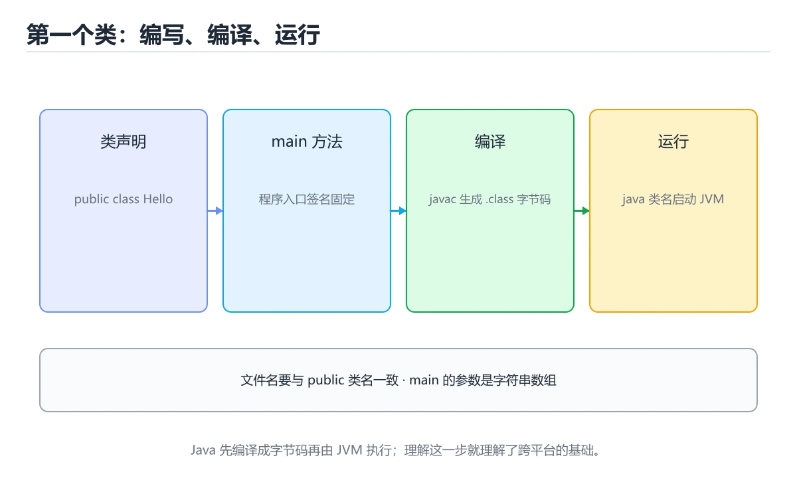
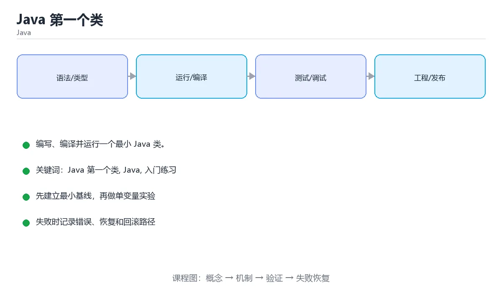

# Java 第一个类

> 内容更新时间：2026-10-06 · 学习阶段：入门 · 预计用时：40 分钟





## 本节知识框架

**课程定位**：所属分类 `java`（Java），课程主题 `Java 第一个类`，学习阶段 入门，建议用时 50 分钟。

本课主线：编写、编译并运行一个最小 Java 类。

**学完本课应当能够**
- 说清 `class` 与 `main 方法` 的含义与区别，并各举一个正例和一个反例。
- 用本课示例验证 `System.out.println` 的行为，记录输入、输出与失败条件。
- 遇到「文件名与公共类名不一致」这类问题时，能说出触发条件与修复顺序。

### 从概念到验证的学习链条

1. `class`：先掌握 Java 的基本组织单位，一个文件可以定义多个类，公开类名要与文件名一致，再用它解释 `main 方法` 为什么会出现。
2. `main 方法`：先掌握 入口方法，签名固定为 public static void main(String[] args)，再用它解释 `System.out.println` 为什么会出现。
3. `System.out.println`：先掌握 向标准输出打印一行文本并换行，再用它解释 `javac 与 java` 为什么会出现。
4. `javac 与 java`：先掌握 先用 javac 编译成字节码，再用 java 在 JVM 上运行，再用它解释 `JVM` 为什么会出现。
5. `JVM`：先掌握 执行字节码的虚拟机，让同一份字节码可以跨平台运行，再用它解释 `字符串` 为什么会出现。
6. `字符串`：先掌握 字符串不可变，拼接会产生新对象，循环中应使用 StringBuilder，再用它解释 本课示例的观察结果 为什么会出现。

**先修与衔接**：本课是「Java」分类的第 1 课。相关或后续课程：《Java 变量与输出》。

### 完成判据

- **定义关**：不看正文也能说明 `class` 是 Java 的基本组织单位，一个文件可以定义多个类，公开类名要与文件名一致，并指出一个反例。
- **机制关**：能按“输入 → 转换 → 输出 → 验证”复述 `Java 第一个类`，而不是只背结论。
- **示例关**：能运行或推演 `Java 第一个类` 的 `java` 示例，并说明一个真实出现的标识符或字面量。
- **证据关**：能指出 `Java 第一个类` 示例里的 调用了 `main()`，并说明它支持或反驳了本课的哪一条结论。
- **排错关**：能复现 文件名与公共类名不一致，记录现象并按 保持文件名与公共类名一致 修复。
- **迁移关**：能把 `Java 第一个类`、`Java`、`入门练习` 放进一个与 `Java 第一个类` 不同的项目场景，并保持输入与验证条件可追踪。
- **复盘关**：学完 `Java 第一个类` 后，用一句话写下仍然不确定的结论，并列出下一次验证需要的输入、环境和成功判据。

### 复习清单

- [ ] 能不看正文复述本课核心术语，并指出一个边界或反例。
- [ ] 能运行或推演本课示例，记录输入、输出与失败现象。
- [ ] 能完成一次自测，并把错题对照错误表定位原因。

## 核心概念定义

| 术语 | 操作性定义 | 常见边界与风险 |
| --- | --- | --- |
| class | Java 的基本组织单位，一个文件可以定义多个类，公开类名要与文件名一致。 | 隔离级别与并发事务会影响可见性，换级别或换存储引擎后要重新验证。 |
| main 方法 | 入口方法，签名固定为 public static void main(String[] args)。 | 只在「入口方法，签名固定为 public static void main(String[] args)」这一前提下成立，换输入或换环境要重新验证。 |
| System.out.println | 向标准输出打印一行文本并换行。 | 只在「向标准输出打印一行文本并换行」这一前提下成立，换输入或换环境要重新验证。 |
| javac 与 java | 先用 javac 编译成字节码，再用 java 在 JVM 上运行。 | 换编码、换字节序或换平台都可能改变结果，处理前先固定输入编码。 |
| JVM | 执行字节码的虚拟机，让同一份字节码可以跨平台运行。 | 换编码、换字节序或换平台都可能改变结果，处理前先固定输入编码。 |
| 字符串 | 字符串不可变，拼接会产生新对象，循环中应使用 StringBuilder | 只在「字符串不可变，拼接会产生新对象，循环中应使用 StringBuilder」这一前提下成立，换输入或换环境要重新验证。 |

## 原理与运行机制

### 机制总览

**教材衔接：一句话入门**

编写、编译并运行一个最小 Java 类。

**教材衔接：Java 基础机制速览**

### JDK、JVM 与字节码

Java 源码编译成平台无关的字节码，JVM 负责加载、验证、解释和即时编译。JDK 包含编译器和工具，JRE 只包含运行环境。类加载器按委托模型加载类，`main` 方法是程序入口。理解编译期与运行期的区别，能定位“编译通过但运行时找不到类”和“类型擦除导致的行为差异”。

### 类、对象与静态成员

类是对象的模板，对象保存实例字段，方法定义行为。`static` 成员属于类而不是实例，静态方法不能直接访问实例字段。构造器初始化对象，`this` 指向当前实例，`super` 调用父类成员。封装通过访问修饰符实现，继承表达“是一个”，组合表达“有一个”；优先使用组合降低耦合。`equals`、`hashCode` 和 `toString` 要根据值语义一致地重写。

### 类型、装箱与字符串

Java 有基本类型和引用类型，泛型不能直接使用基本类型，需要装箱成包装类。自动装箱方便但会增加对象分配，比较包装类应使用 `equals` 而不是 `==`。字符串不可变，拼接会产生新对象，循环中应使用 `StringBuilder`。`final` 表示引用不可重新赋值，不代表对象内容不可变。

### 集合、泛型与函数式接口

`List`、`Set`、`Map` 是集合接口，`ArrayList`、`HashSet`、`HashMap` 是常见实现。泛型在编译期提供类型检查，运行时发生类型擦除，因此不能创建泛型数组，也不能依赖运行时泛型信息。Stream 提供声明式的筛选、映射和聚合，但要注意惰性、短路和并行流的线程安全。Lambda 和函数式接口让行为可以作为参数传递。

### 异常、资源与并发

受检异常必须在签名中声明或捕获，非受检异常通常表示编程错误。`try-with-resources` 自动关闭实现 AutoCloseable 的资源。线程共享堆内存，必须使用同步、锁、原子类或并发集合保护共享状态；线程池避免频繁创建线程，但要合理设置队列、拒绝策略和超时。虚拟线程降低了高并发 I/O 的线程成本，但不会自动消除数据竞争。

**教材衔接：版本与时效**

- 版本基线会影响 Java 第一个类 的可用 API，升级前先用编译与测试验证。
- 若 System 依赖线程或 GC 行为，升级时要重点验证并发与停顿指标。
- 升级前确认 Java 第一个类 的兼容范围，把不可回退的改动单独拆成一次提交。

### 升级检查清单

- 先固定当前版本，跑通全部示例与测验，再升级工具链。
- 一次只改一个版本条件，把 Java 第一个类 相关的差异单独记成一条结论。
- 先回归 Java 第一个类 与 Java 的默认行为和错误信息，再扩大测试范围。
- 升级完成后更新本课「最后复核 / 下次复核」日期，并记录 Java 第一个类 的版本变化。

### 机制拆解：每一步的输入、动作与输出

#### 1. `class`
- 输入：`Java 第一个类`；本步把 Java 的基本组织单位，一个文件可以定义多个类，公开类名要与文件名一致 当作判断规则。
- 动作：围绕 `class` 保留中间状态，并记录它与 `main 方法` 的对应关系。
- 输出：`main 方法`，它可以被下一段代码、测试或记录继续使用。
- `class` 的失败条件：隔离级别与并发事务会影响可见性，换级别或换存储引擎后要重新验证。

#### 2. `main 方法`
- 输入：`class`；本步把 入口方法，签名固定为 public static void main(String[] args) 当作判断规则。
- 动作：围绕 `main 方法` 保留中间状态，并记录它与 `System.out.println` 的对应关系。
- 输出：`System.out.println`，它可以被下一段代码、测试或记录继续使用。
- `main 方法` 的失败条件：只在「入口方法，签名固定为 public static void main(String[] args)」这一前提下成立，换输入或换环境要重新验证。

#### 3. `System.out.println`
- 输入：`main 方法`；本步把 向标准输出打印一行文本并换行 当作判断规则。
- 动作：围绕 `System.out.println` 保留中间状态，并记录它与 `javac 与 java` 的对应关系。
- 输出：`javac 与 java`，它可以被下一段代码、测试或记录继续使用。
- `System.out.println` 的失败条件：只在「向标准输出打印一行文本并换行」这一前提下成立，换输入或换环境要重新验证。

#### 4. `javac 与 java`
- 输入：`System.out.println`；本步把 先用 javac 编译成字节码，再用 java 在 JVM 上运行 当作判断规则。
- 动作：围绕 `javac 与 java` 保留中间状态，并记录它与 `JVM` 的对应关系。
- 输出：`JVM`，它可以被下一段代码、测试或记录继续使用。
- `javac 与 java` 的失败条件：换编码、换字节序或换平台都可能改变结果，处理前先固定输入编码。

#### 5. `JVM`
- 输入：`javac 与 java`；本步把 执行字节码的虚拟机，让同一份字节码可以跨平台运行 当作判断规则。
- 动作：围绕 `JVM` 保留中间状态，并记录它与 `字符串` 的对应关系。
- 输出：`字符串`，它可以被下一段代码、测试或记录继续使用。
- `JVM` 的失败条件：换编码、换字节序或换平台都可能改变结果，处理前先固定输入编码。

#### 6. `字符串`
- 输入：`JVM`；本步把 字符串不可变，拼接会产生新对象，循环中应使用 StringBuilder 当作判断规则。
- 动作：围绕 `字符串` 保留中间状态，并记录它与 `main` 的对应关系。
- 输出：`main`，它可以被下一段代码、测试或记录继续使用。
- `字符串` 的失败条件：只在「字符串不可变，拼接会产生新对象，循环中应使用 StringBuilder」这一前提下成立，换输入或换环境要重新验证。

### 示例中的可观察事实

1. 调用了 `main()`；它对应的课程主题是 `Java 第一个类`。
2. 调用了 `println()`；它对应的课程主题是 `Java 第一个类`。
3. 出现字面量 `hello from Java`；它对应的课程主题是 `Java 第一个类`。

### 复现实验记录

- 环境：`Java 第一个类` 使用 `java` 示例，固定 `Java 第一个类`、`Java`、`入门练习` 作为第一组条件。
- 首轮输入：先确认 调用了 `main()`，预测 `class` 会怎样变化。
- 基线观察：记录命令、输入、输出和错误原文，不用截图代替可复制的文本。
- 单变量修改：只改变 `Java 第一个类`，观察 `字符串` 是否仍满足定义。
- 失败注入：复现 文件名与公共类名不一致，确认现象是 编译直接失败。
- 记录结论：把“修改前、修改后、预期变化、实际变化”写成四列表，这样复盘 `Java 第一个类` 时才能区分概念错误与实现错误。

## 典型应用场景

**教材衔接：代码实验：把示例跑成证据**

### 实验一：建立基线

```java
public class Main {
    public static void main(String[] args) {
        System.out.println("hello from Java");
    }
}
```

### 实验二：只改一个输入

沿用「Java 第一个类」的最小示例做一次单变量实验：

做完后用一句话写出「Java 第一个类」的结论：输入怎么变，结果才怎么变。

### 实验三：制造一个可控错误

把 Java 第一个类 的输入从正常值改成越界值，记录程序是报错、降级还是静默出错；「Java 第一个类」要求三者区分对待。

### 实验四：用三句话复述

1. Java 第一个类 的输入是什么，哪些取值合法，哪些属于边界或非法范围？
2. Java 第一个类 按什么顺序处理输入，在哪一步产生了状态变化或副作用？
3. 输出如何验证，失败时第一条可观察证据是什么？

- **文件名与公共类名不一致**：典型现象是编译直接失败；正确做法是保持文件名与公共类名一致。
- **入口方法签名不标准**：典型现象是运行时提示找不到主类；正确做法是使用标准入口签名并核对参数类型。
- **混淆静态成员与实例成员**：典型现象是编译错误或逻辑错乱；正确做法是明确成员是否依赖实例状态。

### 最小验证场景

- 准备：保留 `java` 示例的原始输入，先记录 `Java 第一个类` 的基线输出和完整运行命令。
- 观察：先核对 调用了 `main()`，再改变一个与 `class` 相关的条件。
- 判定：新结果与 `Java 第一个类` 的基线不同不等于错误；只有当差异破坏了 `class` 的定义或错误表中的约束，才判定为失败。

### 选择与边界

- 使用 `class` 时，先满足它的定义：Java 的基本组织单位，一个文件可以定义多个类，公开类名要与文件名一致；隔离级别与并发事务会影响可见性，换级别或换存储引擎后要重新验证。
- 使用 `main 方法` 时，先满足它的定义：入口方法，签名固定为 public static void main(String[] args)；只在「入口方法，签名固定为 public static void main(String[] args)」这一前提下成立，换输入或换环境要重新验证。
- 使用 `System.out.println` 时，先满足它的定义：向标准输出打印一行文本并换行；只在「向标准输出打印一行文本并换行」这一前提下成立，换输入或换环境要重新验证。
- 使用 `javac 与 java` 时，先满足它的定义：先用 javac 编译成字节码，再用 java 在 JVM 上运行；换编码、换字节序或换平台都可能改变结果，处理前先固定输入编码。
- 使用 `JVM` 时，先满足它的定义：执行字节码的虚拟机，让同一份字节码可以跨平台运行；换编码、换字节序或换平台都可能改变结果，处理前先固定输入编码。

## 代码/协议/SQL 示例

### 最小可验证示例

**教材衔接：最小示例**

**教材衔接：预期输出**

```text
hello from Java
```

**教材衔接：零基础通俗讲：Java 第一个类**

### 一句话说清它是什么

Java 程序由类组织，main 方法是程序入口；类名 Main 必须和文件名 Main.java 完全一致。

### 用生活比喻理解

把类想成一个抽屉，方法就是抽屉里的工具。main 是抽屉上唯一被贴了「启动」标签的工具，运行程序就是拉开这个抽屉、按一下启动键。

### 完整可运行代码

```java
public class Main {
    public static void main(String[] args) {
        System.out.println("你好，Java");
    }
}
```

### 逐行拆开看

- `public class Main` 定义一个公开的类，类名首字母大写；文件名必须是 `Main.java`，否则编译直接失败。
- `public static void main(String[] args)` 是 Java 规定的入口方法签名，少一个关键字 JVM 都找不到入口。
- `public` 表示任何地方都能访问，`static` 表示不用先创建对象就能调用，`void` 表示不返回值。
- `String[] args` 接收命令行参数，不传参数时它是空数组，但必须写在签名里。
- `System.out.println(...)` 把括号里的内容输出到标准输出并换行；`System` 是类，`out` 是它的静态字段，`println` 是方法。
- 每条语句结尾的分号不能省，这是 Java 和 Python 最明显的区别之一。

### 把程序跑一遍

- 编译：`javac Main.java`，成功后同目录生成 `Main.class` 字节码文件。
- 运行：`java Main`，注意这里写的是类名，不加 `.class` 后缀。
- JVM 加载 Main 类，找到 main 方法并执行。
- 屏幕输出「你好，Java」并换行，程序结束。

### 新手最容易踩的坑

- 文件名和类名不一致：`Main` 类存成 `main.java`，javac 会报「类名与文件名不符」。
- 写成 `public static void main()`：参数列表不能省略，否则 JVM 找不到入口。
- 把 `main` 拼成 `Main` 或 `mian`：Java 区分大小写，方法名必须是全小写 main。
- 运行时报 `NoClassDefFoundError`：通常是 javac 编译失败后仍去运行，或者当前目录不对。
- 把 `println` 写成 `printIn`：字母 l 和 I 长得像，编译器会提示找不到符号。

### 动手练一练

- 把输出文字改成自己的名字，重新编译运行，观察必须重新 javac 才能生效。
- 加一条 `System.out.println` 输出第二行，注意分号。
- 故意把类名改成 Demo 而不改文件名，记录完整报错。

### 本课速查卡

把下面八行抄进自己的笔记，复习时只看这一页就能回忆整课：

| 复习项 | 本课要点 |
| --- | --- |
| 核心结论 | Java 程序由类组织，main 方法是程序入口；类名 Main 必须和文件名 Main.java 完全一致。 |
| 最少要写的代码 | `public class Main {` |
| 正确做法 | 编译：`javac Main.java`，成功后同目录生成 `Main.class` 字节码文件。 |
| 最常见的错误 | 文件名和类名不一致：`Main` 类存成 `main.java`，javac 会报「类名与文件名不符」。 |
| 出错先查什么 | 先读第一条报错信息，再回到最小示例只改一个地方 |
| 怎么确认学会了 | 把输出文字改成自己的名字，重新编译运行，观察必须重新 javac 才能生效。 |
| 和别的知识点的关系 | 本课打下的语法与思维方式会被后面每一课反复用到 |
| 接下来做什么 | 合上教程，凭记忆把上面的最小代码重写一遍再运行 |

**运行方式**：运行 `Java 第一个类` 的示例时，保存为 `.java` 后用 `javac` 编译、`java` 运行；注意类名与文件名一致。

### 示例精读：先找证据，再改一个条件

1. 调用了 `main()`；它出现在 `Java 第一个类` 的示例中，阅读时先确认它前后各发生了什么。
2. 调用了 `println()`；它出现在 `Java 第一个类` 的示例中，阅读时先确认它前后各发生了什么。
3. 出现字面量 `hello from Java`；它出现在 `Java 第一个类` 的示例中，阅读时先确认它前后各发生了什么。
- 在 `Java 第一个类` 中与 `class` 对照：示例必须能支持 Java 的基本组织单位，一个文件可以定义多个类，公开类名要与文件名一致，否则说明这一段还缺少实现或验证步骤。
- 在 `Java 第一个类` 中与 `main 方法` 对照：示例必须能支持 入口方法，签名固定为 public static void main(String[] args)，否则说明这一段还缺少实现或验证步骤。
- 在 `Java 第一个类` 中与 `System.out.println` 对照：示例必须能支持 向标准输出打印一行文本并换行，否则说明这一段还缺少实现或验证步骤。
- 在 `Java 第一个类` 中与 `javac 与 java` 对照：示例必须能支持 先用 javac 编译成字节码，再用 java 在 JVM 上运行，否则说明这一段还缺少实现或验证步骤。

## 时间/空间复杂度或性能分析

**性能关注点（Java 第一个类）**：JVM 预热与 GC 影响测量：记录吞吐、P99 延迟与堆占用，先跑预热再采样。

**本课特有开销（Java 第一个类 · Java 第一个类）**：小文件看元数据开销，大文件看吞吐，两者要分别测量。

**测量方法**：以 `Java 第一个类` 的 `Java 第一个类` 场景为对象，固定输入跑一遍记录基线，再把规模或并发度提高一个数量级复测；两次结果的差值与波动范围才是结论依据。

### 需要控制的变量与记录项

- `Java 第一个类` 的 `Java 第一个类`：固定它的版本、输入范围和资源上限，分别记录速度、内存与失败率的变化。
- `Java 第一个类` 的 `Java`：固定它的版本、输入范围和资源上限，分别记录速度、内存与失败率的变化。
- `Java 第一个类` 的 `入门练习`：固定它的版本、输入范围和资源上限，分别记录速度、内存与失败率的变化。
- `Java 第一个类` 中 `class` 的边界：隔离级别与并发事务会影响可见性，换级别或换存储引擎后要重新验证。达到边界时不要外推，必须重新测量。
- `Java 第一个类` 中 `main 方法` 的边界：只在「入口方法，签名固定为 public static void main(String[] args)」这一前提下成立，换输入或换环境要重新验证。达到边界时不要外推，必须重新测量。
- `Java 第一个类` 中 `System.out.println` 的边界：只在「向标准输出打印一行文本并换行」这一前提下成立，换输入或换环境要重新验证。达到边界时不要外推，必须重新测量。
- `Java 第一个类` 中 `javac 与 java` 的边界：换编码、换字节序或换平台都可能改变结果，处理前先固定输入编码。达到边界时不要外推，必须重新测量。
- `Java 第一个类` 中 `JVM` 的边界：换编码、换字节序或换平台都可能改变结果，处理前先固定输入编码。达到边界时不要外推，必须重新测量。
- `Java 第一个类` 的代码证据：先验证 调用了 `main()`，再记录该路径的输入规模与耗时；只看代码行数不能推出复杂度。

## 常见误区与易错点

| 容易写错的做法 | 实际现象 | 原因与正确做法 |
| --- | --- | --- |
| 文件名与公共类名不一致 | 编译直接失败。 | 保持文件名与公共类名一致。 |
| 入口方法签名不标准 | 运行时提示找不到主类。 | 使用标准入口签名并核对参数类型。 |
| 混淆静态成员与实例成员 | 编译错误或逻辑错乱。 | 明确成员是否依赖实例状态。 |

### 现场 1：文件名与公共类名不一致

**症状**：编译直接失败。

**根因与修复**：保持文件名与公共类名一致。

**自检**：在本课示例里复现「文件名与公共类名不一致」，改成保持文件名与公共类名一致后重跑；如果症状消失且失败路径按预期变化，说明定位正确。

### 现场 2：入口方法签名不标准

**症状**：运行时提示找不到主类。

**根因与修复**：使用标准入口签名并核对参数类型。

**自检**：在本课示例里复现「入口方法签名不标准」，改成使用标准入口签名并核对参数类型后重跑；如果症状消失且失败路径按预期变化，说明定位正确。

### 现场 3：混淆静态成员与实例成员

**症状**：编译错误或逻辑错乱。

**根因与修复**：明确成员是否依赖实例状态。

**自检**：在本课示例里复现「混淆静态成员与实例成员」，改成明确成员是否依赖实例状态后重跑；如果症状消失且失败路径按预期变化，说明定位正确。

## 与其他知识点的关系

**教材衔接：复习与迁移**

### 概念复述

- 用一句话说明「Java 第一个类」解决什么问题：编写、编译并运行一个最小 Java 类。
- 写出Java 第一个类、Java、入门练习之间的关系，并各举一个例子。
- 说出本课最容易混淆的两个概念，以及区分它们的判据。

### 正文逐节复核

- **Java 基础机制速览**：Java 源码编译成平台无关的字节码，JVM 负责加载、验证、解释和即时编译。
- **实践任务**：本节围绕Java 第一个类安排 3 个可交付任务，每个任务都要求留下可以复查的记录。


### 迁移练习

把「Java 第一个类」的结论迁移到相邻主题，每次迁移都写清预测与证据：

- **相关或后续**：`Java 变量与输出`。本课术语会在这些课程里继续使用。
- **术语归属**：`class`、`main 方法`、`System.out.println` 的定义以本课「核心概念定义」为准，换到其他课程时先确认定义是否被改写。
- 同一分类的《Java 变量与输出》也涉及 `Java`；两课衔接时先确认这个术语的定义是否一致。
- 同一分类的《Java 条件判断》也涉及 `Java`；两课衔接时先确认这个术语的定义是否一致。

### 先修与后续术语接口

- `Java 变量与输出`：共享术语 `JVM`，共同关键词 `Java`、`入门练习`。

### 容易混淆的相邻概念

- `class` 与 `main 方法`：前者强调 Java 的基本组织单位，一个文件可以定义多个类，公开类名要与文件名一致；后者强调 入口方法，签名固定为 public static void main(String[] args)。判断时分别检查两条定义的适用范围，不要只看名称相似就互换。
- `main 方法` 与 `System.out.println`：前者强调 入口方法，签名固定为 public static void main(String[] args)；后者强调 向标准输出打印一行文本并换行。判断时分别检查两条定义的适用范围，不要只看名称相似就互换。
- `System.out.println` 与 `javac 与 java`：前者强调 向标准输出打印一行文本并换行；后者强调 先用 javac 编译成字节码，再用 java 在 JVM 上运行。判断时分别检查两条定义的适用范围，不要只看名称相似就互换。
- `javac 与 java` 与 `JVM`：前者强调 先用 javac 编译成字节码，再用 java 在 JVM 上运行；后者强调 执行字节码的虚拟机，让同一份字节码可以跨平台运行。判断时分别检查两条定义的适用范围，不要只看名称相似就互换。
- `JVM` 与 `字符串`：前者强调 执行字节码的虚拟机，让同一份字节码可以跨平台运行；后者强调 字符串不可变，拼接会产生新对象，循环中应使用 StringBuilder。判断时分别检查两条定义的适用范围，不要只看名称相似就互换。

## 自测题与参考答案

> 先独立作答，再对照参考答案；答案都能在本课正文、术语表或错误表里找到依据。

### 自测 1（概念复述）

不看正文，写出 `class` 的操作性定义，并说明它与 `main 方法` 的区别。

**参考答案**：Java 的基本组织单位，一个文件可以定义多个类，公开类名要与文件名一致。

`main 方法` 的定位是：入口方法，签名固定为 public static void main(String[] args)；两者的差别要从适用对象与失败模式上说明。

### 自测 2（排错）

本课错误表记录了「文件名与公共类名不一致」这类做法。请写出它会出现的现象、根因，以及修复顺序。

**参考答案**：现象是编译直接失败；正确做法是保持文件名与公共类名一致。修复时先复现现象并保留证据，再改动一处假设重跑，确认现象消失。

### 自测 3（动手验证）

运行本课的 `java` 示例，把其中的 `"hello from Java"` 换成一个边界值后重新运行，记录输出与错误信息。

**参考答案**：正常输入下 `java` 示例应当复现正文给出的结果；把 `"hello from Java"` 换成边界值后，如果结果改变或报错，先核对它是否满足 `Java 第一个类` 中`class` 的适用范围，再检查错误表里是否有同类现象。

### 自测 4（代码阅读）

阅读本课开头的 `java` 示例，说明它体现了`class` 的哪一条性质，并指出改动哪个输入会让这条性质不再成立。

**参考答案**：`class` 的定义是 Java 的基本组织单位，一个文件可以定义多个类，公开类名要与文件名一致，示例正是在实现这条定义。改动与 `class` 有关的一个输入后，如果结果不再符合 `Java 第一个类` 的正文描述，就说明该性质只在当前前提成立。

### 自测 5（迁移）

把 `Java 第一个类` 的方法迁移到自己的项目：围绕 `class` 写出一个与错误表同类的风险点，并说明触发条件和检验方式。

**参考答案**：例如「混淆静态成员与实例成员」，它会导致编译错误或逻辑错乱；检验方式是按明确成员是否依赖实例状态改一处再复现，确认现象消失且没有引入新的失败分支。

### 自测 6（对比）

用一个表格对比 `class` 与 `main 方法`：各写一行适用场景、一行失败表现。

**参考答案**：`class` 的定义是Java 的基本组织单位，一个文件可以定义多个类，公开类名要与文件名一致；`main 方法` 的定义是入口方法，签名固定为 public static void main(String[] args)。两者的失败表现分别对应本课错误表里与本术语相关的行。

### 自测 7（排错顺序）

面对「文件名与公共类名不一致」引发的问题，请把“复现 编译直接失败 → 保留证据 → 保持文件名与公共类名一致 → 回归验证”四步写成可执行的检查清单。

**参考答案**：第一步按编译直接失败复现；第二步记录输入、版本与完整报错；第三步按保持文件名与公共类名一致只改一处；第四步重跑并确认失败路径也按预期变化。

### 自测 8（边界判断）

针对 `字符串`，分别写出“可以使用”的条件和“结论不再成立”的条件。

**参考答案**：只在「字符串不可变，拼接会产生新对象，循环中应使用 StringBuilder」这一前提下成立，换输入或换环境要重新验证。 同时要把 `字符串` 的定义 字符串不可变，拼接会产生新对象，循环中应使用 StringBuilder 与实际输入逐项对照。

### 自测 9（机制重建）

不看正文，按输入、转换、输出、验证四段重建 `class` → `main 方法` → `System.out.println` → `javac 与 java` 的作用链。

**参考答案**：起点是 `class` 的定义 Java 的基本组织单位，一个文件可以定义多个类，公开类名要与文件名一致；中间每一步都保留可观察状态；终点由 `字符串` 检查，失败时回到错误表定位第一个偏离定义的步骤。

### 自测 10（综合排错）

在 `Java 第一个类` 中，现象是 编译错误或逻辑错乱。请围绕 混淆静态成员与实例成员 写出最小复现、关键证据、修复动作和回归验证，并说明为什么不能只凭一次运行下结论。

**参考答案**：先复现 混淆静态成员与实例成员，记录输入与完整错误；再按 明确成员是否依赖实例状态 只改一处。回归时同时跑正常路径和边界路径，只有两次结果都可解释，才把修复视为完成。

### 自测 11（一分钟复述）

用每分钟约 200 字的速度复述 `Java 第一个类`：先给主问题，再按顺序说出 `class`、`main 方法`、`System.out.println`、`javac 与 java`，最后给一个失败案例。

**自评标准**：主问题必须对应 编写、编译并运行一个最小 Java 类；每个术语都要能接上一句定义或边界；失败案例必须写成可观察现象，不能用“可能有风险”代替证据。

## 术语速查

| 术语 | 一句话说明 |
| --- | --- |
| `class` | Java 的基本组织单位，一个文件可以定义多个类，公开类名要与文件名一致。 |
| `main 方法` | 入口方法，签名固定为 public static void main(String[] args)。 |
| `System.out.println` | 向标准输出打印一行文本并换行。 |
| `javac 与 java` | 先用 javac 编译成字节码，再用 java 在 JVM 上运行。 |
| `JVM` | 执行字节码的虚拟机，让同一份字节码可以跨平台运行。 |
| `字符串` | 字符串不可变，拼接会产生新对象，循环中应使用 StringBuilder。 |

**术语关系**：`class`（Java 的基本组织单位） → `main 方法`（入口方法） → `System.out.println`（向标准输出打印一行文本并换行） → `javac 与 java`（先用 javac 编译成字节码）。

## 考点精讲

`Java 第一个类` 的题库有 5 道题，下面逐题给出题干、正确项与判断依据：先自己作答，再核对正确项，最后回到正文对应小节复核。

### 考点 1：第 1 题

- **题目**：围绕“Java 第一个类”中的 Java 第一个类、Java、入门练习，下列哪两项是本课强调的实践判断？
- **正确项**：验证 Java 时要固定版本并覆盖边界输入，结论才可复现；学习 Java 第一个类 时要同时说明输入、输出和失败路径，不能只看正常流程
- **判断依据**：这道题检验本课主问题：编写、编译并运行一个最小 Java 类。复习时先复述本课主问题，再举一个会让结论失效的输入。

### 考点 2：第 2 题

- **题目**：public static void main(String[] args) 中 static 的作用是？
- **正确项**：让 JVM 无需创建对象就能直接调用这个入口方法
- **判断依据**：这道题落在术语 `JVM` 上：执行字节码的虚拟机，让同一份字节码可以跨平台运行。复习时把 `JVM` 的定义、适用边界和一个反例一起说清楚，再回到「核心概念定义」核对原文。

### 考点 3：第 3 题

- **题目**：这段 `java` 代码对应 `Java 第一个类` 的 `class`。课程要解决的是编写、编译并运行一个最小 Java 类。关于代码内容，哪一项说法准确？
- **正确项**：出现字面量 `hello from Java`
- **判断依据**：这道题落在术语 `class` 上：Java 的基本组织单位，一个文件可以定义多个类，公开类名要与文件名一致。复习时把 `class` 的定义、适用边界和一个反例一起说清楚，再回到「核心概念定义」核对原文。

### 考点 4：第 4 题

- **题目**：System.out.println("hello from Java") 的输出行为是？
- **正确项**：把文本写到标准输出，并在末尾追加换行
- **判断依据**：这道题落在术语 `System.out.println` 上：向标准输出打印一行文本并换行。复习时把 `System.out.println` 的定义、适用边界和一个反例一起说清楚，再回到「核心概念定义」核对原文。

### 考点 5：第 5 题

- **题目**：填空：补齐下面这段术语说明中的空缺。课程 `编写、编译并运行一个最小 Java 类。`，这段说明是：`____`：先用 javac 编译成字节码，再用 java 在 JVM 上运行。空缺处应填哪个术语？
- **正确项**：javac 与 java
- **判断依据**：这道题落在术语 `javac 与 java` 上：先用 javac 编译成字节码，再用 java 在 JVM 上运行。复习时把 `javac 与 java` 的定义、适用边界和一个反例一起说清楚，再回到「核心概念定义」核对原文。

### 考点 6：`class`

- **要点**：Java 的基本组织单位，一个文件可以定义多个类，公开类名要与文件名一致。
- **class 的边界**：隔离级别与并发事务会影响可见性，换级别或换存储引擎后要重新验证。

### 考点 7：`main 方法`

- **要点**：入口方法，签名固定为 public static void main(String[] args)。
- **main 方法 的边界**：只在「入口方法，签名固定为 public static void main(String[] args)」这一前提下成立，换输入或换环境要重新验证。

### 考点 8：`System.out.println`

- **要点**：向标准输出打印一行文本并换行。
- **System.out.println 的边界**：只在「向标准输出打印一行文本并换行」这一前提下成立，换输入或换环境要重新验证。

### 考点 9：`javac 与 java`

- **要点**：先用 javac 编译成字节码，再用 java 在 JVM 上运行。
- **javac 与 java 的边界**：换编码、换字节序或换平台都可能改变结果，处理前先固定输入编码。

### 考点 10：`JVM`

- **要点**：执行字节码的虚拟机，让同一份字节码可以跨平台运行。
- **JVM 的边界**：换编码、换字节序或换平台都可能改变结果，处理前先固定输入编码。

### 考点 11：`字符串`

- **要点**：字符串不可变，拼接会产生新对象，循环中应使用 StringBuilder
- **字符串 的边界**：只在「字符串不可变，拼接会产生新对象，循环中应使用 StringBuilder」这一前提下成立，换输入或换环境要重新验证。

### 考点 12：排错——文件名与公共类名不一致

- **现象**：编译直接失败。
- **处理**：保持文件名与公共类名一致。

### 考点 13：排错——入口方法签名不标准

- **现象**：运行时提示找不到主类。
- **处理**：使用标准入口签名并核对参数类型。

### 考点 14：综合辨析——`class` 与 `字符串`

- **辨析点**：`class` 的定义是 Java 的基本组织单位，一个文件可以定义多个类，公开类名要与文件名一致；`字符串` 的定义是 字符串不可变，拼接会产生新对象，循环中应使用 StringBuilder。
- **答题要求**：面对 `Java 第一个类` 的题目，先判断描述的是 `class` 还是 `字符串`，再归到对应定义，最后写出一个会让该定义失效的边界输入。

### 考点 15：排错评分点

- **现象分**：能写出 编译直接失败，而不是只写“程序有错”。
- **证据分**：保留触发 文件名与公共类名不一致 的输入、版本和错误原文。
- **修复分**：按 保持文件名与公共类名一致 只改一处，并同时回归正常路径与边界路径。

## 内容元数据

- 内容版本：v2.0
- 最后更新：2026-10-06
- 学习阶段：入门
- 适用环境：Java 21+ / Maven 或 Gradle；本课聚焦 Java 第一个类。
- 内容来源：内置结构化课程与工程实践整理
- 相关主题：Java 第一个类、Java、入门练习
- 质量版本：P0 测验标准 + P1 覆盖扩展 + P2 体验补全

## 参考资料与复核

- 最后复核：2026-10-04
- 下次复核：2027-02-24
- 复核范围：版本兼容、API 行为、安全建议与工程实践
- 来源性质：官方文档、标准或权威教材；本课核对关键词：Java 第一个类、Java、入门练习。

| 参考资料 | 本课用途 |
| --- | --- |
| [dev.java 学习](https://dev.java/learn/) | 现代 Java 官方教程 |
| [JVM 规范](https://docs.oracle.com/javase/specs/jvms/se21/html/index.html) | 字节码与运行时行为 |
| [Java SE API](https://docs.oracle.com/en/java/javase/21/docs/api/) | 标准库 API |

| [本课术语索引：Java 第一个类](#核心概念定义) | 按本课输入、术语边界和错误表现逐项核对 |
> 「Java 第一个类」的链接用于离线阅读后的延伸核对；App 不会自动联网。