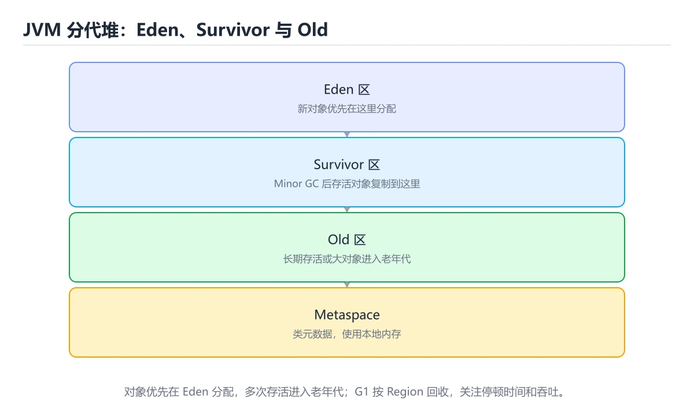
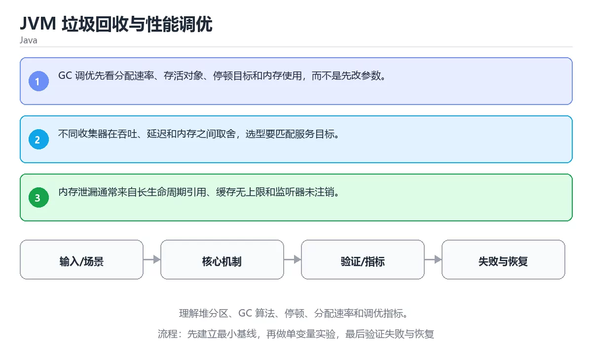

# JVM 垃圾回收与性能调优





> 内容更新时间：2026-10-06 · 学习阶段：高级 · 预计用时：35 分钟

## 本节知识框架

**课程定位**：所属分类 `java`（Java），课程主题 `JVM 垃圾回收与性能调优`，学习阶段 高级，建议用时 40 分钟。

本课主线：理解堆分区、GC 算法、停顿、分配速率和调优指标。

**学完本课应当能够**
- 说清 `GC` 与 `堆` 的含义与区别，并各举一个正例和一个反例。
- 用本课示例验证 `停顿` 的行为，记录输入、输出与失败条件。
- 遇到「只盯着吞吐量」这类问题时，能说出触发条件与修复顺序。

### 从概念到验证的学习链条

1. `GC`：先掌握 JVM 的垃圾回收器：按分代回收不可达对象；G1、ZGC 等实现决定吞吐与停顿的取舍，再用它解释 `堆` 为什么会出现。
2. `堆`：先掌握 JVM 用于存放对象实例的内存区域，分代收集器会按年龄把对象移动到不同区域，再用它解释 `停顿` 为什么会出现。
3. `停顿`：先掌握 GC 期间应用线程被挂起的时间；调优目标通常是缩短单次停顿并控制 P99 分布，再用它解释 `调优` 为什么会出现。
4. `调优`：先掌握 基于测量结果调整参数、数据结构或资源分配，在目标指标上获得可复现改善，再用它解释 本课示例的观察结果 为什么会出现。

**先修与衔接**：本课是「Java」分类的第 21 课。先修内容：《Java 虚拟线程与结构化并发》。《Java 虚拟线程与结构化并发》里的 `虚拟线程`、`结构化并发` 是本课的前提。相关或后续课程：《Java 第一个类》。

### 完成判据

- **定义关**：不看正文也能说明 `GC` 是 JVM 的垃圾回收器：按分代回收不可达对象，G1、ZGC 等实现决定吞吐与停顿的取舍，并指出一个反例。
- **机制关**：能按“输入 → 转换 → 输出 → 验证”复述 `JVM 垃圾回收与性能调优`，而不是只背结论。
- **示例关**：能运行或推演 `JVM 垃圾回收与性能调优` 的 `text` 示例，并说明一个真实出现的标识符或字面量。
- **证据关**：能指出 `JVM 垃圾回收与性能调优` 示例里的 调用了 `main()`，并说明它支持或反驳了本课的哪一条结论。
- **排错关**：能复现 只盯着吞吐量，记录现象并按 同时看吞吐、停顿分布与分配速率 修复。
- **迁移关**：能把 `GC`、`堆`、`停顿`、`调优` 放进一个与 `JVM 垃圾回收与性能调优` 不同的项目场景，并保持输入与验证条件可追踪。
- **复盘关**：学完 `JVM 垃圾回收与性能调优` 后，用一句话写下仍然不确定的结论，并列出下一次验证需要的输入、环境和成功判据。

### 复习清单

- [ ] 能不看正文复述本课核心术语，并指出一个边界或反例。
- [ ] 能运行或推演本课示例，记录输入、输出与失败现象。
- [ ] 能完成一次自测，并把错题对照错误表定位原因。

## 核心概念定义

| 术语 | 操作性定义 | 常见边界与风险 |
| --- | --- | --- |
| GC | JVM 的垃圾回收器：按分代回收不可达对象；G1、ZGC 等实现决定吞吐与停顿的取舍。 | 结论随输入规模变化，小规模成立不代表大规模成立，需要重新测量。 |
| 堆 | JVM 用于存放对象实例的内存区域，分代收集器会按年龄把对象移动到不同区域。 | 越界、悬垂引用与释放顺序会破坏结论，必须在边界输入下复验。 |
| 停顿 | GC 期间应用线程被挂起的时间；调优目标通常是缩短单次停顿并控制 P99 分布。 | 易错：停顿时间被忽略，用户仍感到卡顿；正确做法是同时看吞吐、停顿分布与分配速率。 |
| 调优 | 基于测量结果调整参数、数据结构或资源分配，在目标指标上获得可复现改善。 | 结果依赖数据分布、模型版本与算力预算，换数据集或换硬件都要重新评估。 |

## 原理与运行机制

### 机制总览

| 阶段 | 关注对象 | 失败时应检查 |
| --- | --- | --- |
| 输入 | GC | 类型、范围、编码、版本或前置状态是否满足定义。 |
| 处理 | 堆 | 顺序、可见性、锁、路由、事务或调度规则是否被破坏。 |
| 输出 | 停顿 | 结果是否可复现，错误是否被正确传播而不是被吞掉。 |

**教材衔接：核心知识**

### 1. GC 调优先看分配速率、存活对象、停顿目标和内存使用，而不是先改参数。

- 关键做法：基线只保留 堆 必需的部分，其余条件一次加一个。
- 验证标准：堆 的异常路径有明确错误信息与恢复动作。

### 2. 不同收集器在吞吐、延迟和内存之间取舍，选型要匹配服务目标。

把这条结论放回「JVM 垃圾回收与性能调优」的完整流程里展开：

- 正文依据：能用自己的话解释：GC 调优先看分配速率、存活对象、停顿目标和内存使用，而不是先改参数。
- 落地检查：把「2. 不同收集器在吞吐、延迟和内存之间取舍，选型要匹配服务目标。」改写成一条可执行的核对项，逐条验证输入、超时与失败路径。

### 3. 内存泄漏通常来自长生命周期引用、缓存无上限和监听器未注销。

把这条结论放回「JVM 垃圾回收与性能调优」的完整流程里展开：

- 正文依据：合上教程，用 3～5 句话解释JVM 垃圾回收与性能调优。
- 落地检查：把「3. 内存泄漏通常来自长生命周期引用、缓存无上限和监听器未注销。」改写成一条可执行的核对项，逐条验证输入、超时与失败路径。

**教材衔接：关键流程**

**教材衔接：实践路径**

**教材衔接：版本与时效**

- 先确认运行环境是 Java 21 还是 25，再决定 getRuntime 能否使用新语法。
- 若 getRuntime 依赖线程或 GC 行为，升级时要重点验证并发与停顿指标。
- 升级「JVM 垃圾回收与性能调优」涉及的依赖前，先用 getRuntime 复现当前行为，再逐项核对版本说明与破坏性变更。

### 升级检查清单

- 先固定当前版本，跑通全部示例与测验，再升级工具链。
- 一次只改一个版本条件，把 GC 相关的差异单独记成一条结论。
- 先回归 GC 与 堆 的默认行为和错误信息，再扩大测试范围。
- 升级完成后记录 GC 的新旧版本差异，并据此调整下次复核时间。

**教材衔接：验证步骤**

### 机制拆解：每一步的输入、动作与输出

#### 1. `GC`
- 输入：`GC`；本步把 JVM 的垃圾回收器：按分代回收不可达对象；G1、ZGC 等实现决定吞吐与停顿的取舍 当作判断规则。
- 动作：围绕 `GC` 保留中间状态，并记录它与 `堆` 的对应关系。
- 输出：`堆`，它可以被下一段代码、测试或记录继续使用。
- `GC` 的失败条件：结论随输入规模变化，小规模成立不代表大规模成立，需要重新测量。

#### 2. `堆`
- 输入：`GC`；本步把 JVM 用于存放对象实例的内存区域，分代收集器会按年龄把对象移动到不同区域 当作判断规则。
- 动作：围绕 `堆` 保留中间状态，并记录它与 `停顿` 的对应关系。
- 输出：`停顿`，它可以被下一段代码、测试或记录继续使用。
- `堆` 的失败条件：当盲目调大堆内存时，会出现单次停顿反而更长。

#### 3. `停顿`
- 输入：`堆`；本步把 GC 期间应用线程被挂起的时间；调优目标通常是缩短单次停顿并控制 P99 分布 当作判断规则。
- 动作：围绕 `停顿` 保留中间状态，并记录它与 `调优` 的对应关系。
- 输出：`调优`，它可以被下一段代码、测试或记录继续使用。
- `停顿` 的失败条件：当只盯着吞吐量时，会出现停顿时间被忽略，用户仍感到卡顿。

#### 4. `调优`
- 输入：`停顿`；本步把 基于测量结果调整参数、数据结构或资源分配，在目标指标上获得可复现改善 当作判断规则。
- 动作：围绕 `调优` 保留中间状态，并记录它与 `main` 的对应关系。
- 输出：`main`，它可以被下一段代码、测试或记录继续使用。
- `调优` 的失败条件：结果依赖数据分布、模型版本与算力预算，换数据集或换硬件都要重新评估。

### 示例中的可观察事实

1. 调用了 `main()`；它对应的课程主题是 `JVM 垃圾回收与性能调优`。
2. 调用了 `getRuntime()`；它对应的课程主题是 `JVM 垃圾回收与性能调优`。
3. 调用了 `println()`；它对应的课程主题是 `JVM 垃圾回收与性能调优`。
4. 调用了 `maxMemory()`；它对应的课程主题是 `JVM 垃圾回收与性能调优`。
5. 出现字面量 `heap>0: `；它对应的课程主题是 `JVM 垃圾回收与性能调优`。

### 复现实验记录

- 环境：`JVM 垃圾回收与性能调优` 使用 `text` 示例，固定 `GC`、`堆`、`停顿`、`调优` 作为第一组条件。
- 首轮输入：先确认 调用了 `main()`，预测 `GC` 会怎样变化。
- 基线观察：记录命令、输入、输出和错误原文，不用截图代替可复制的文本。
- 单变量修改：只改变 `GC`，观察 `调优` 是否仍满足定义。
- 失败注入：复现 只盯着吞吐量，确认现象是 停顿时间被忽略，用户仍感到卡顿。
- 记录结论：把“修改前、修改后、预期变化、实际变化”写成四列表，这样复盘 `JVM 垃圾回收与性能调优` 时才能区分概念错误与实现错误。

## 典型应用场景

| 场景 | 典型输入或前提 | 期望产物 |
| --- | --- | --- |
| 学习验证 | 使用本课最小示例和 GC、堆 | 能复现正文结论，并解释每一步。 |
| 工程落地 | 把「JVM 垃圾回收与性能调优」放入真实模块或服务边界 | 输出可观测、失败可定位、参数可配置。 |
| 故障排查 | 只改一个版本、规模、输入或依赖条件 | 能区分概念错误、实现错误和环境差异。 |

- **只盯着吞吐量**：典型现象是停顿时间被忽略，用户仍感到卡顿；正确做法是同时看吞吐、停顿分布与分配速率。
- **盲目调大堆内存**：典型现象是单次停顿反而更长；正确做法是先定位分配热点与存活对象，再调整堆与回收器。
- **手动触发回收**：典型现象是打乱回收节奏，掩盖真实问题；正确做法是从减少分配和缩短对象生命周期入手。

### 最小验证场景

- 准备：保留 `text` 示例的原始输入，先记录 `JVM 垃圾回收与性能调优` 的基线输出和完整运行命令。
- 观察：先核对 调用了 `main()`，再改变一个与 `GC` 相关的条件。
- 判定：新结果与 `JVM 垃圾回收与性能调优` 的基线不同不等于错误；只有当差异破坏了 `GC` 的定义或错误表中的约束，才判定为失败。

### 选择与边界

- 使用 `GC` 时，先满足它的定义：JVM 的垃圾回收器：按分代回收不可达对象；G1、ZGC 等实现决定吞吐与停顿的取舍；结论随输入规模变化，小规模成立不代表大规模成立，需要重新测量。
- 使用 `堆` 时，先满足它的定义：JVM 用于存放对象实例的内存区域，分代收集器会按年龄把对象移动到不同区域；越界、悬垂引用与释放顺序会破坏结论，必须在边界输入下复验。
- 使用 `停顿` 时，先满足它的定义：GC 期间应用线程被挂起的时间；调优目标通常是缩短单次停顿并控制 P99 分布；易错：停顿时间被忽略，用户仍感到卡顿；正确做法是同时看吞吐、停顿分布与分配速率。
- 使用 `调优` 时，先满足它的定义：基于测量结果调整参数、数据结构或资源分配，在目标指标上获得可复现改善；结果依赖数据分布、模型版本与算力预算，换数据集或换硬件都要重新评估。

## 代码/协议/SQL 示例

### 最小可验证示例

**教材衔接：最小可运行示例**

先用下面的示例确认 GC 的基线，再只改一个与 堆 相关的值：

```java
public class Main {
    public static void main(String[] args) {
        Runtime runtime = Runtime.getRuntime();
        System.out.println("heap>0: " + (runtime.maxMemory() > 0));
    }
}
```

**教材衔接：预期输出**

```text
heap>0: true
```

### 示例精读：先找证据，再改一个条件

1. 调用了 `main()`；它出现在 `JVM 垃圾回收与性能调优` 的示例中，阅读时先确认它前后各发生了什么。
2. 调用了 `getRuntime()`；它出现在 `JVM 垃圾回收与性能调优` 的示例中，阅读时先确认它前后各发生了什么。
3. 调用了 `println()`；它出现在 `JVM 垃圾回收与性能调优` 的示例中，阅读时先确认它前后各发生了什么。
4. 调用了 `maxMemory()`；它出现在 `JVM 垃圾回收与性能调优` 的示例中，阅读时先确认它前后各发生了什么。
5. 出现字面量 `heap>0: `；它出现在 `JVM 垃圾回收与性能调优` 的示例中，阅读时先确认它前后各发生了什么。
- 在 `JVM 垃圾回收与性能调优` 中与 `GC` 对照：示例必须能支持 JVM 的垃圾回收器：按分代回收不可达对象；G1、ZGC 等实现决定吞吐与停顿的取舍，否则说明这一段还缺少实现或验证步骤。
- 在 `JVM 垃圾回收与性能调优` 中与 `堆` 对照：示例必须能支持 JVM 用于存放对象实例的内存区域，分代收集器会按年龄把对象移动到不同区域，否则说明这一段还缺少实现或验证步骤。
- 在 `JVM 垃圾回收与性能调优` 中与 `停顿` 对照：示例必须能支持 GC 期间应用线程被挂起的时间；调优目标通常是缩短单次停顿并控制 P99 分布，否则说明这一段还缺少实现或验证步骤。
- 在 `JVM 垃圾回收与性能调优` 中与 `调优` 对照：示例必须能支持 基于测量结果调整参数、数据结构或资源分配，在目标指标上获得可复现改善，否则说明这一段还缺少实现或验证步骤。

## 时间/空间复杂度或性能分析

- **1. GC 调优先看分配速率、存活对象、停顿目标和内存使用，而不是先改参数。**：在「JVM 垃圾回收与性能调优」里，「1. GC 调优先看分配速率、存活对象、停顿目标和内存使用，而不是先改参数。」这一步要先写清输入与预期，再记录实际结果和差异；结果不符时回到对应小节核对前提。
- **2. 不同收集器在吞吐、延迟和内存之间取舍，选型要匹配服务目标。**：在「JVM 垃圾回收与性能调优」里，「2. 不同收集器在吞吐、延迟和内存之间取舍，选型要匹配服务目标。」这一步要先写清输入与预期，再记录实际结果和差异；结果不符时回到对应小节核对前提。
- **3. 内存泄漏通常来自长生命周期引用、缓存无上限和监听器未注销。**：在「JVM 垃圾回收与性能调优」里，「3. 内存泄漏通常来自长生命周期引用、缓存无上限和监听器未注销。」这一步要先写清输入与预期，再记录实际结果和差异；结果不符时回到对应小节核对前提。
- **考点 1：按“JVM 垃圾回收与性能调优”中 GC、堆、停顿 的实践顺序，把四个步骤排成从准备到复盘的合理顺序。**：先独立作答，再回到本课对应小节核对判断依据；答错时记录是哪一个前提被忽略。
- **考点 2：核心知识 的代码阅读题**：先独立作答，再回到本课正文核对 getRuntime 的执行路径；答错时记录是哪一个前提被忽略。
- **考点 3：关于「内存泄漏通常来自长生命周期引用、缓存无上限和监听器未注销。」，下列说法正确的是？**：先独立作答，再回到本课对应小节核对判断依据；答错时记录是哪一个前提被忽略。

- 参考判断：GC 调优先看分配速率、存活对象、停顿目标和内存使用，而不是先改参数。
- 自问：如果去掉题干里的一个限定词，结论还成立吗？

- 参考判断：不同收集器在吞吐、延迟和内存之间取舍，选型要匹配服务目标。

- 参考判断：内存泄漏通常来自长生命周期引用、缓存无上限和监听器未注销。

1. 先用一个单文件示例验证 getRuntime，确认正确性后再引入框架或分布式组件。
2. 把 GC 的输入规模扩大十倍，记录时间、内存和失败路径，找出第一个瓶颈。
3. 制造一次 GC 相关的依赖超时或错误输入，要求错误可解释且不留半完成状态。
5. 删掉一个看似必要的步骤（例如 GC 相关的校验），观察哪个测试或指标先失败，用证据说明它为什么不能省。
6. 把 GC 的方案切换到低资源设备，重新评估默认参数、超时和降级策略。

**测量方法**：以 `JVM 垃圾回收与性能调优` 的 `GC` 场景为对象，固定输入跑一遍记录基线，再把规模或并发度提高一个数量级复测；两次结果的差值与波动范围才是结论依据。

### 需要控制的变量与记录项

- `JVM 垃圾回收与性能调优` 的 `GC`：固定它的版本、输入范围和资源上限，分别记录速度、内存与失败率的变化。
- `JVM 垃圾回收与性能调优` 的 `堆`：固定它的版本、输入范围和资源上限，分别记录速度、内存与失败率的变化。
- `JVM 垃圾回收与性能调优` 的 `停顿`：固定它的版本、输入范围和资源上限，分别记录速度、内存与失败率的变化。
- `JVM 垃圾回收与性能调优` 的 `调优`：固定它的版本、输入范围和资源上限，分别记录速度、内存与失败率的变化。
- `JVM 垃圾回收与性能调优` 中 `GC` 的边界：结论随输入规模变化，小规模成立不代表大规模成立，需要重新测量。达到边界时不要外推，必须重新测量。
- `JVM 垃圾回收与性能调优` 中 `堆` 的边界：越界、悬垂引用与释放顺序会破坏结论，必须在边界输入下复验。达到边界时不要外推，必须重新测量。
- `JVM 垃圾回收与性能调优` 中 `停顿` 的边界：易错：停顿时间被忽略，用户仍感到卡顿；正确做法是同时看吞吐、停顿分布与分配速率。达到边界时不要外推，必须重新测量。
- `JVM 垃圾回收与性能调优` 中 `调优` 的边界：结果依赖数据分布、模型版本与算力预算，换数据集或换硬件都要重新评估。达到边界时不要外推，必须重新测量。
- `JVM 垃圾回收与性能调优` 的代码证据：先验证 调用了 `main()`，再记录该路径的输入规模与耗时；只看代码行数不能推出复杂度。

## 常见误区与易错点

| 容易写错的做法 | 实际现象 | 原因与正确做法 |
| --- | --- | --- |
| 只盯着吞吐量 | 停顿时间被忽略，用户仍感到卡顿。 | 同时看吞吐、停顿分布与分配速率。 |
| 盲目调大堆内存 | 单次停顿反而更长。 | 先定位分配热点与存活对象，再调整堆与回收器。 |
| 手动触发回收 | 打乱回收节奏，掩盖真实问题。 | 从减少分配和缩短对象生命周期入手。 |

### 现场 1：只盯着吞吐量

**症状**：停顿时间被忽略，用户仍感到卡顿。

**根因与修复**：同时看吞吐、停顿分布与分配速率。

**自检**：在本课示例里复现「只盯着吞吐量」，改成同时看吞吐、停顿分布与分配速率后重跑；如果症状消失且失败路径按预期变化，说明定位正确。

### 现场 2：盲目调大堆内存

**症状**：单次停顿反而更长。

**根因与修复**：先定位分配热点与存活对象，再调整堆与回收器。

**自检**：在本课示例里复现「盲目调大堆内存」，改成先定位分配热点与存活对象，再调整堆与回收器后重跑；如果症状消失且失败路径按预期变化，说明定位正确。

### 现场 3：手动触发回收

**症状**：打乱回收节奏，掩盖真实问题。

**根因与修复**：从减少分配和缩短对象生命周期入手。

**自检**：在本课示例里复现「手动触发回收」，改成从减少分配和缩短对象生命周期入手后重跑；如果症状消失且失败路径按预期变化，说明定位正确。

## 与其他知识点的关系

| 关系 | 课程 | 为什么 |
| --- | --- | --- |
| 先修 | 《Java 虚拟线程与结构化并发》 | 本课会直接使用它的概念或操作前提。 |
| 关联 | 《Java 第一个类》 | 用于横向比较或把本课结论迁移到相邻主题。 |
| 前置顺序 | 《Java 虚拟线程与结构化并发》 | 同分类中安排在本课之前，建议先完成其自测。 |

**教材衔接：复习与迁移**

### 概念复述

- 用一句话说明「JVM 垃圾回收与性能调优」解决什么问题：理解堆分区、GC 算法、停顿、分配速率和调优指标。
- 写出GC、堆、停顿之间的关系，并各举一个例子。
- 说出本课最容易混淆的两个概念，以及区分它们的判据。

### 正文逐节复核

- **实践任务**：本节围绕JVM 垃圾回收与性能调优安排 3 个可交付任务，每个任务都要求留下可以复查的记录。
- **零基础精讲：把JVM 垃圾回收与性能调优真正讲透**：本课的摘要可以当作一张地图：理解堆分区、GC 算法、停顿、分配速率和调优指标。


### 迁移练习

1. 换输入：用GC处理一组你自己的数据，对比教材示例的结果差异。
2. 换失败条件：制造一个堆相关的错误，说明如何从错误信息定位根因。
3. 换规模：把数据量或并发度提高一个数量级，说明「JVM 垃圾回收与性能调优」的结论是否仍成立。

- **先修**：`Java 虚拟线程与结构化并发`。本课默认这些内容已经掌握。
- **相关或后续**：`Java 第一个类`。本课术语会在这些课程里继续使用。
- **术语归属**：`GC`、`堆`、`停顿` 的定义以本课「核心概念定义」为准，换到其他课程时先确认定义是否被改写。

### 先修与后续术语接口

- `Java 第一个类`：两者通过本分类的学习顺序衔接，阅读时重点比较各自的输入与失败条件。
- `Java 虚拟线程与结构化并发`：两者通过本分类的学习顺序衔接，阅读时重点比较各自的输入与失败条件。

### 容易混淆的相邻概念

- `GC` 与 `堆`：前者强调 JVM 的垃圾回收器：按分代回收不可达对象；G1、ZGC 等实现决定吞吐与停顿的取舍；后者强调 JVM 用于存放对象实例的内存区域，分代收集器会按年龄把对象移动到不同区域。判断时分别检查两条定义的适用范围，不要只看名称相似就互换。
- `堆` 与 `停顿`：前者强调 JVM 用于存放对象实例的内存区域，分代收集器会按年龄把对象移动到不同区域；后者强调 GC 期间应用线程被挂起的时间；调优目标通常是缩短单次停顿并控制 P99 分布。判断时分别检查两条定义的适用范围，不要只看名称相似就互换。
- `停顿` 与 `调优`：前者强调 GC 期间应用线程被挂起的时间；调优目标通常是缩短单次停顿并控制 P99 分布；后者强调 基于测量结果调整参数、数据结构或资源分配，在目标指标上获得可复现改善。判断时分别检查两条定义的适用范围，不要只看名称相似就互换。

## 自测题与参考答案

> 先独立作答，再对照参考答案；答案都能在本课正文、术语表或错误表里找到依据。

### 自测 1（概念复述）

不看正文，写出 `GC` 的操作性定义，并说明它与 `堆` 的区别。

**参考答案**：JVM 的垃圾回收器：按分代回收不可达对象；G1、ZGC 等实现决定吞吐与停顿的取舍。

`堆` 的定位是：JVM 用于存放对象实例的内存区域，分代收集器会按年龄把对象移动到不同区域；两者的差别要从适用对象与失败模式上说明。

### 自测 2（排错）

本课错误表记录了「只盯着吞吐量」这类做法。请写出它会出现的现象、根因，以及修复顺序。

**参考答案**：现象是停顿时间被忽略，用户仍感到卡顿；正确做法是同时看吞吐、停顿分布与分配速率。修复时先复现现象并保留证据，再改动一处假设重跑，确认现象消失。

### 自测 3（动手验证）

运行本课的 `text` 示例，改动其中一个输入后重新运行，记录输出与错误信息。

**参考答案**：正常输入下 `text` 示例应当复现正文给出的结果；改动输入后，如果结果改变或报错，先核对它是否满足 `JVM 垃圾回收与性能调优` 中`GC` 的适用范围，再检查错误表里是否有同类现象。

### 自测 4（代码阅读）

阅读本课开头的 `text` 示例，说明它体现了`GC` 的哪一条性质，并指出改动哪个输入会让这条性质不再成立。

**参考答案**：`GC` 的定义是 JVM 的垃圾回收器：按分代回收不可达对象，G1、ZGC 等实现决定吞吐与停顿的取舍，示例正是在实现这条定义。改动与 `GC` 有关的一个输入后，如果结果不再符合 `JVM 垃圾回收与性能调优` 的正文描述，就说明该性质只在当前前提成立。

### 自测 5（迁移）

把 `JVM 垃圾回收与性能调优` 的方法迁移到自己的项目：围绕 `GC` 写出一个与错误表同类的风险点，并说明触发条件和检验方式。

**参考答案**：例如「手动触发回收」，它会导致打乱回收节奏，掩盖真实问题；检验方式是按从减少分配和缩短对象生命周期入手改一处再复现，确认现象消失且没有引入新的失败分支。

### 自测 6（对比）

用一个表格对比 `GC` 与 `堆`：各写一行适用场景、一行失败表现。

**参考答案**：`GC` 的定义是JVM 的垃圾回收器：按分代回收不可达对象；G1、ZGC 等实现决定吞吐与停顿的取舍；`堆` 的定义是JVM 用于存放对象实例的内存区域，分代收集器会按年龄把对象移动到不同区域。两者的失败表现分别对应本课错误表里与本术语相关的行。

### 自测 7（排错顺序）

面对「只盯着吞吐量」引发的问题，请把“复现 停顿时间被忽略，用户仍感到卡顿 → 保留证据 → 同时看吞吐、停顿分布与分配速率 → 回归验证”四步写成可执行的检查清单。

**参考答案**：第一步按停顿时间被忽略，用户仍感到卡顿复现；第二步记录输入、版本与完整报错；第三步按同时看吞吐、停顿分布与分配速率只改一处；第四步重跑并确认失败路径也按预期变化。

### 自测 8（边界判断）

针对 `调优`，分别写出“可以使用”的条件和“结论不再成立”的条件。

**参考答案**：结果依赖数据分布、模型版本与算力预算，换数据集或换硬件都要重新评估。 同时要把 `调优` 的定义 基于测量结果调整参数、数据结构或资源分配，在目标指标上获得可复现改善 与实际输入逐项对照。

### 自测 9（机制重建）

不看正文，按输入、转换、输出、验证四段重建 `GC` → `堆` → `停顿` → `调优` 的作用链。

**参考答案**：起点是 `GC` 的定义 JVM 的垃圾回收器：按分代回收不可达对象；G1、ZGC 等实现决定吞吐与停顿的取舍；中间每一步都保留可观察状态；终点由 `调优` 检查，失败时回到错误表定位第一个偏离定义的步骤。

### 自测 10（综合排错）

在 `JVM 垃圾回收与性能调优` 中，现象是 打乱回收节奏，掩盖真实问题。请围绕 手动触发回收 写出最小复现、关键证据、修复动作和回归验证，并说明为什么不能只凭一次运行下结论。

**参考答案**：先复现 手动触发回收，记录输入与完整错误；再按 从减少分配和缩短对象生命周期入手 只改一处。回归时同时跑正常路径和边界路径，只有两次结果都可解释，才把修复视为完成。

### 自测 11（一分钟复述）

用每分钟约 200 字的速度复述 `JVM 垃圾回收与性能调优`：先给主问题，再按顺序说出 `GC`、`堆`、`停顿`、`调优`，最后给一个失败案例。

**自评标准**：主问题必须对应 理解堆分区、GC 算法、停顿、分配速率和调优指标；每个术语都要能接上一句定义或边界；失败案例必须写成可观察现象，不能用“可能有风险”代替证据。

## 术语速查

| 术语 | 一句话说明 |
| --- | --- |
| `GC` | JVM 的垃圾回收器：按分代回收不可达对象；G1、ZGC 等实现决定吞吐与停顿的取舍。 |
| `堆` | JVM 用于存放对象实例的内存区域，分代收集器会按年龄把对象移动到不同区域。 |
| `停顿` | GC 期间应用线程被挂起的时间；调优目标通常是缩短单次停顿并控制 P99 分布。 |
| `调优` | 基于测量结果调整参数、数据结构或资源分配，在目标指标上获得可复现改善。 |

**术语关系**：`GC`（JVM 的垃圾回收器：按分代回收不可达对象） → `堆`（JVM 用于存放对象实例的内存区域） → `停顿`（GC 期间应用线程被挂起的时间） → `调优`（基于测量结果调整参数、数据结构或资源分配）。

## 考点精讲

`JVM 垃圾回收与性能调优` 的题库有 5 道题，下面逐题给出题干、正确项与判断依据：先自己作答，再核对正确项，最后回到正文对应小节复核。

### 考点 1：第 1 题

- **题目**：按“JVM 垃圾回收与性能调优”中 GC、堆、停顿 的实践顺序，把四个步骤排成从准备到复盘的合理顺序。
- **正确项**：先明确 GC 的输入、输出与约束 → 写出最小示例并核对 堆 的基线结果 → 只改一个变量，记录边界与失败路径的变化 → 固定版本与证据，把“JVM 垃圾回收与性能调优”的结论写成可复现记录
- **判断依据**：这道题落在术语 `GC` 上：JVM 的垃圾回收器：按分代回收不可达对象，G1、ZGC 等实现决定吞吐与停顿的取舍。复习时把 `GC` 的定义、适用边界和一个反例一起说清楚，再回到「核心概念定义」核对原文。

### 考点 2：第 2 题

- **题目**：代码语言为 `java`，选自 `JVM 垃圾回收与性能调优` 的 `GC` 部分。课程问题为理解堆分区、GC 算法、停顿、分配速率和调优指标。哪一项描述与代码一致？
- **正确项**：调用了 `getRuntime()`
- **判断依据**：这道题落在术语 `GC` 上：JVM 的垃圾回收器：按分代回收不可达对象，G1、ZGC 等实现决定吞吐与停顿的取舍。复习时把 `GC` 的定义、适用边界和一个反例一起说清楚，再回到「核心概念定义」核对原文。

### 考点 3：第 3 题

- **题目**：在 `JVM 垃圾回收与性能调优` 里，与 `GC` 有关的说法中，哪一项最符合理解堆分区、GC 算法、停顿、分配速率和调优指标。？
- **正确项**：内存泄漏通常来自长生命周期引用、缓存无上限和监听器未注销。
- **判断依据**：这道题落在术语 `GC` 上：JVM 的垃圾回收器：按分代回收不可达对象，G1、ZGC 等实现决定吞吐与停顿的取舍。复习时把 `GC` 的定义、适用边界和一个反例一起说清楚，再回到「核心概念定义」核对原文。

### 考点 4：第 4 题

- **题目**：`JVM 垃圾回收与性能调优` 的主线是：理解堆分区、GC 算法、停顿、分配速率和调优指标。下面哪一项与这条主线一致？
- **正确项**：理解堆分区、GC 算法、停顿、分配速率和调优指标。
- **判断依据**：这道题落在术语 `GC` 上：JVM 的垃圾回收器：按分代回收不可达对象，G1、ZGC 等实现决定吞吐与停顿的取舍。复习时把 `GC` 的定义、适用边界和一个反例一起说清楚，再回到「核心概念定义」核对原文。

### 考点 5：第 5 题

- **题目**：课程 `理解堆分区、GC 算法、停顿、分配速率和调优指标。`。在 `JVM 垃圾回收与性能调优` 里，`GC`、`堆` 与下面哪些选项属于同一层概念？（多选）
- **正确项**：GC；停顿
- **判断依据**：这道题落在术语 `GC` 上：JVM 的垃圾回收器：按分代回收不可达对象，G1、ZGC 等实现决定吞吐与停顿的取舍。复习时把 `GC` 的定义、适用边界和一个反例一起说清楚，再回到「核心概念定义」核对原文。

### 考点 6：`GC`

- **要点**：JVM 的垃圾回收器：按分代回收不可达对象；G1、ZGC 等实现决定吞吐与停顿的取舍。
- **GC 的边界**：结论随输入规模变化，小规模成立不代表大规模成立，需要重新测量。

### 考点 7：`堆`

- **要点**：JVM 用于存放对象实例的内存区域，分代收集器会按年龄把对象移动到不同区域。
- **堆 的边界**：越界、悬垂引用与释放顺序会破坏结论，必须在边界输入下复验。

### 考点 8：`停顿`

- **要点**：GC 期间应用线程被挂起的时间；调优目标通常是缩短单次停顿并控制 P99 分布。
- **停顿 的边界**：易错：停顿时间被忽略，用户仍感到卡顿；正确做法是同时看吞吐、停顿分布与分配速率。

### 考点 9：`调优`

- **要点**：基于测量结果调整参数、数据结构或资源分配，在目标指标上获得可复现改善。
- **调优 的边界**：结果依赖数据分布、模型版本与算力预算，换数据集或换硬件都要重新评估。

### 考点 10：排错——只盯着吞吐量

- **现象**：停顿时间被忽略，用户仍感到卡顿。
- **处理**：同时看吞吐、停顿分布与分配速率。

### 考点 11：排错——盲目调大堆内存

- **现象**：单次停顿反而更长。
- **处理**：先定位分配热点与存活对象，再调整堆与回收器。

### 考点 12：综合辨析——`GC` 与 `调优`

- **辨析点**：`GC` 的定义是 JVM 的垃圾回收器：按分代回收不可达对象；G1、ZGC 等实现决定吞吐与停顿的取舍；`调优` 的定义是 基于测量结果调整参数、数据结构或资源分配，在目标指标上获得可复现改善。
- **答题要求**：面对 `JVM 垃圾回收与性能调优` 的题目，先判断描述的是 `GC` 还是 `调优`，再归到对应定义，最后写出一个会让该定义失效的边界输入。

### 考点 13：排错评分点

- **现象分**：能写出 停顿时间被忽略，用户仍感到卡顿，而不是只写“程序有错”。
- **证据分**：保留触发 只盯着吞吐量 的输入、版本和错误原文。
- **修复分**：按 同时看吞吐、停顿分布与分配速率 只改一处，并同时回归正常路径与边界路径。

## 内容元数据

- 内容版本：v2.0
- 最后更新：2026-10-06
- 学习阶段：高级
- 适用环境：Java 21+ / Maven 或 Gradle；本课聚焦 GC。
- 内容来源：内置结构化课程与工程实践整理
- 相关主题：GC、堆、停顿、调优
- 质量版本：P0 测验标准 + P1 覆盖扩展 + P2 体验补全

## 参考资料与复核

- 最后复核：2026-10-04
- 下次复核：2027-02-24
- 复核范围：版本兼容、API 行为、安全建议与工程实践
- 来源性质：官方文档、标准或权威教材；本课核对关键词：GC、堆、停顿、调优。

| 参考资料 | 本课用途 |
| --- | --- |
| [Java GC 调优](https://docs.oracle.com/en/java/javase/21/gctuning/) | 垃圾回收与性能调优 |
| [Java SE API](https://docs.oracle.com/en/java/javase/21/docs/api/) | 标准库 API |
| [dev.java 学习](https://dev.java/learn/) | 现代 Java 官方教程 |

| [本课术语索引：JVM 垃圾回收与性能调优](#核心概念定义) | 按本课输入、术语边界和错误表现逐项核对 |
> 「JVM 垃圾回收与性能调优」的链接用于离线阅读后的延伸核对；App 不会自动联网。