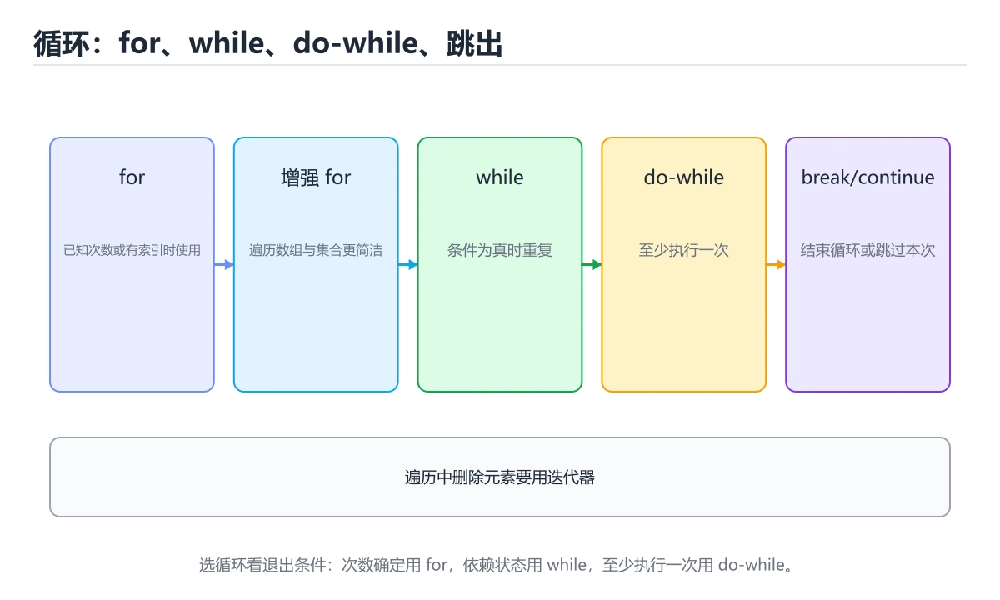
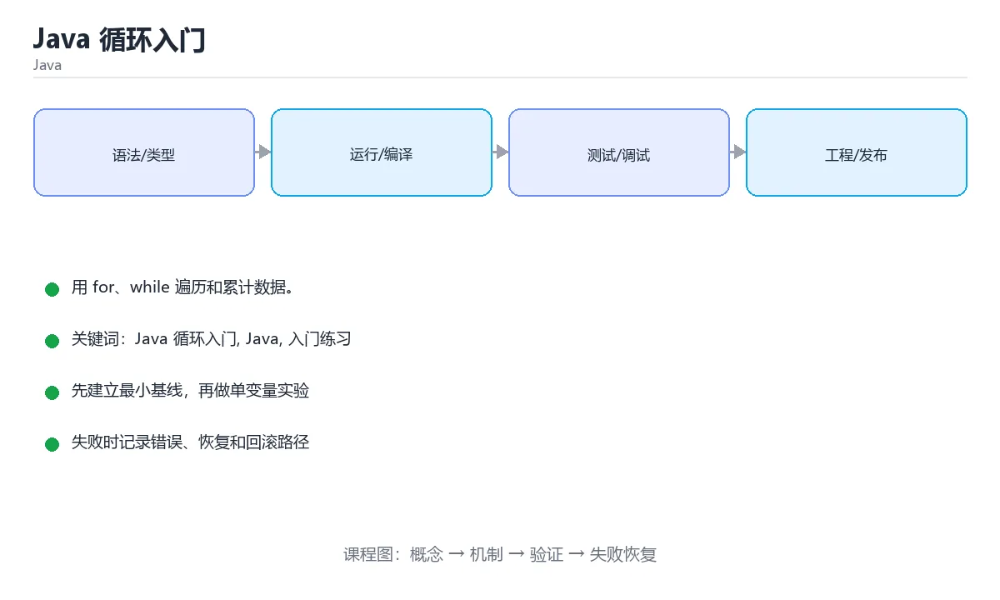

# Java 循环入门

> 内容更新时间：2026-10-06 · 学习阶段：入门 · 预计用时：40 分钟





## 学习目标

- 先认识Java 循环入门需要的工具、输入和输出。
- 按步骤运行最小示例，并记录结果与错误。
- 用一个边界输入验证自己是否真正掌握。

## 前置知识

- 会进行基本的文件或命令行操作。
- 不需要预先掌握「Java」的高级知识。

## 一句话入门

用 for、while 遍历和累计数据。

## 最小示例

```java
public class Main {
    public static void main(String[] args) {
        int total = 0;
        for (int i = 1; i <= 5; i++) {
            total += i;
        }
        System.out.println("total=" + total);
    }
}
```

## 预期输出

```text
total=15
```

## 常见错误与排查

> 说明：本表由《Java 循环入门》的核心知识整理（2026-10-07），人工复核进度见 docs/content_review_batches.md。

| 易错点 | 容易踩的做法 | 正确结论 |
| --- | --- | --- |
| 循环里拼接字符串 | 产生大量临时对象 | 改用 StringBuilder 并在循环外创建 |
| 边遍历边删除集合元素 | 抛出并发修改异常 | 用迭代器删除，或先收集再统一处理 |
| 下标边界差一 | 越界异常或漏掉元素 | 用增强 for，或写清区间开闭 |

## 动手练习

1. 原样运行最小示例，保存命令和输出。
2. 把数字 2 改成 10，预测并验证新结果。
3. 制造一个错误输入，写出错误信息和修复方法。

## 本课小结

- 入门阶段先保证能运行、能观察、能解释，再追求复杂功能。
- 每次只改一个变量，记录预测与实际结果。
- 遇到错误先看第一条错误信息，再回到最小示例。

## 代码实验：把示例跑成证据

### 实验一：建立基线

```java
public class Main {
    public static void main(String[] args) {
        int total = 0;
        for (int i = 1; i <= 5; i++) {
            total += i;
        }
        System.out.println("total=" + total);
    }
}
```

### 实验二：只改一个输入

沿用「Java 循环入门」的最小示例做一次单变量实验：

| 实验 | 改动 | 预测 | 实际 | 结论 |
| --- | --- | --- | --- | --- |
| 基线 | 保持「Java 循环入门」示例原样 |  |  |  |
| 边界 | 把Java 循环入门换成空值或极值 |  |  |  |
| 失败 | 给Java传入非法输入 |  |  |  |

做完后用一句话写出「Java 循环入门」的结论：输入怎么变，结果才怎么变。

### 实验三：制造一个可控错误

把 System 的一个参数换成不兼容的类型，先预测报错位置再实际运行；预测与实际的差异就是本课的考点。

| 实验 | 改动 | 预测 | 实际 | 结论 |
| --- | --- | --- | --- | --- |
| 基线 | 保持原样 |  |  |  |
| 边界 |  |  |  |  |
| 失败 |  |  |  |  |

### 实验四：用三句话复述

1. Java 循环入门 的输入是什么，哪些取值合法，哪些属于边界或非法范围？
2. Java 循环入门 按什么顺序处理输入，在哪一步产生了状态变化或副作用？
3. 输出如何验证，失败时第一条可观察证据是什么？

## Java 基础机制速览

### JDK、JVM 与字节码

Java 源码编译成平台无关的字节码，JVM 负责加载、验证、解释和即时编译。JDK 包含编译器和工具，JRE 只包含运行环境。类加载器按委托模型加载类，`main` 方法是程序入口。理解编译期与运行期的区别，能定位“编译通过但运行时找不到类”和“类型擦除导致的行为差异”。

### 类、对象与静态成员

类是对象的模板，对象保存实例字段，方法定义行为。`static` 成员属于类而不是实例，静态方法不能直接访问实例字段。构造器初始化对象，`this` 指向当前实例，`super` 调用父类成员。封装通过访问修饰符实现，继承表达“是一个”，组合表达“有一个”；优先使用组合降低耦合。`equals`、`hashCode` 和 `toString` 要根据值语义一致地重写。

### 类型、装箱与字符串

Java 有基本类型和引用类型，泛型不能直接使用基本类型，需要装箱成包装类。自动装箱方便但会增加对象分配，比较包装类应使用 `equals` 而不是 `==`。字符串不可变，拼接会产生新对象，循环中应使用 `StringBuilder`。`final` 表示引用不可重新赋值，不代表对象内容不可变。

### 集合、泛型与函数式接口

`List`、`Set`、`Map` 是集合接口，`ArrayList`、`HashSet`、`HashMap` 是常见实现。泛型在编译期提供类型检查，运行时发生类型擦除，因此不能创建泛型数组，也不能依赖运行时泛型信息。Stream 提供声明式的筛选、映射和聚合，但要注意惰性、短路和并行流的线程安全。Lambda 和函数式接口让行为可以作为参数传递。

### 异常、资源与并发

受检异常必须在签名中声明或捕获，非受检异常通常表示编程错误。`try-with-resources` 自动关闭实现 AutoCloseable 的资源。线程共享堆内存，必须使用同步、锁、原子类或并发集合保护共享状态；线程池避免频繁创建线程，但要合理设置队列、拒绝策略和超时。虚拟线程降低了高并发 I/O 的线程成本，但不会自动消除数据竞争。

## 复习与自测

本课测验检验 System 的判断依据。请把每个错误选项改写成一句反例，
说明它在哪个输入、边界或前提变化下会失败。

### 完成标准

- [ ] 能把 System 的输入换成自己的数据，并说明输出差异。
- [ ] 能说明 Java 在哪一个取值上开始失效。
- [ ] 能复现 Java 的异常并说明恢复步骤。
- [ ] 能列出 Java 的两个失败场景与验证步骤。

### 复盘记录

| 项目 | 记录 |
| --- | --- |
| 学到的核心机制 |  |
| 仍然不确定的问题 |  |
| 下一步验证动作 |  |
对照 代码实验：把示例跑成证据 复述本课结论，答不上来的部分回到 System 的示例重跑一次。

### 最小示例

```java
public class Main {
    public static void main(String[] args) {
        int total = 0;
        for (int i = 1; i <= 5; i++) {
            total += i;
        }
        System.out.println("total=" + total);
    }
}
```

自检：这一节与相邻主题的边界在哪里？

### 预期输出

```text
total=15
```

### 动手练习

自检：如果去掉这一节里的一个前提，结论会怎样变化？

## 可运行练习

本节围绕Java 循环入门安排 3 个可交付任务，每个任务都要求留下可以复查的记录。

### 任务 1：用自己的话画出结构

不看书，用一张图说清「Java 循环入门」的结构，画完再对照骨架：

- 主干：Java 循环入门 的定义 → 最小示例 → 预期输出 → 常见错误
- 连接线：在每条边上标出输入、输出与失败路径。
- 自检：能否用一句话说明Java 循环入门与Java的关系？

### 任务 2：做一次对比实验

**验收标准**：两个方案至少在一个输入上给出不同结果；把差异归因到Java 循环入门，而不是笼统地写「性能更好」。

### 任务 3：迁移到自己的场景

**验收标准**：至少给出一个命令或数据样例，让读者能独立复现 Java 的结论。

## 故障现场

### 现场 1：循环里拼接字符串

**症状**：在《Java 循环入门》的复现场景中，产生大量临时对象。

**根因**：“产生大量临时对象”只是表层结果。向上追溯会落到“循环里拼接字符串”这一步，因为它省略了《Java 循环入门》的约束，使实现行为和预期模型发生了偏离。

**修复**：针对《Java 循环入门》的问题，改用 StringBuilder 并在循环外创建。

**验证**：先在《Java 循环入门》中记录“循环里拼接字符串”留下的失败证据，再执行“改用 StringBuilder 并在循环外创建”并重放；确认错误路径变为明确结果，且修复没有掩盖同类故障。

### 现场 2：边遍历边删除集合元素

**症状**：在《Java 循环入门》的复现场景中，抛出并发修改异常。

**根因**：“抛出并发修改异常”只是表层结果。向上追溯会落到“边遍历边删除集合元素”这一步，因为它省略了《Java 循环入门》的约束，使实现行为和预期模型发生了偏离。

**修复**：针对《Java 循环入门》的问题，用迭代器删除，或先收集再统一处理。

**验证**：保留《Java 循环入门》里触发“抛出并发修改异常”的输入、版本和日志，按“用迭代器删除，或先收集再统一处理”完成修改后原样重放；只有失败现象消失且相邻场景仍可解释，才保留改动。

### 现场 3：下标边界差一

**症状**：在《Java 循环入门》的复现场景中，越界异常或漏掉元素。

**根因**：触发点是把“下标边界差一”当成安全做法。它没有满足《Java 循环入门》要求的前提，因此先表现为“越界异常或漏掉元素”；排查时先完整复现这一段，再核对输入、配置与依赖。

**修复**：针对《Java 循环入门》的问题，用增强 for，或写清区间开闭。

**验证**：在《Java 循环入门》中按“用增强 for，或写清区间开闭”调整后，从“下标边界差一”的触发条件重放同一条路径，确认“越界异常或漏掉元素”不再出现，并补一个相邻边界用例检查没有引入新问题。

## 版本与时效

- 版本基线会影响 Java 循环入门 的可用 API，升级前先用编译与测试验证。
- 升级收益集中在并发与内存模型；Java 相关代码需要单独回归。
- 升级「Java 循环入门」涉及的依赖前，先用 System 复现当前行为，再逐项核对版本说明与破坏性变更。

### 升级检查清单

- 先固定当前版本，跑通全部示例与测验，再升级工具链。
- 一次只改一个版本条件，把 Java 循环入门 相关的差异单独记成一条结论。
- 先回归 Java 循环入门 与 Java 的默认行为和错误信息，再扩大测试范围。
- 升级完成后记录 Java 循环入门 的新旧版本差异，并据此调整下次复核时间。

## 本课复习清单

离开本课前，逐项确认：

- [ ] 不看解析，能说出「在循环中，break 与 continue 的语义分别是？」的判断依据。
- [ ] 不看解析，能说出「while (true) 循环中最需要注意的风险是？」的判断依据。
- [ ] 不看解析，能说出「填空：Java 循环入门术语速查中，表示的判断依据。
- [ ] 用 Java 循环入门 构造一个正常输入和一个边界输入，分别记录输出与判断依据。
- [ ] 把本课最容易混淆的两个概念写成一句话对照。

| 复盘项 | 记录 |
| --- | --- |
| 已经能独立解释的考点 |  |
| 仍然说不清的概念 |  |
| 下一步验证动作 |  |

## 术语速查

把「Java 循环入门」里反复出现的术语集中放在一起。复习时先遮住右列，尝试用自己的话解释，再回到正文核对。

| 术语 | 一句话说明 |
| --- | --- |
| `for 循环` | 把初始化、条件、更新写在一行，适合次数确定的循环。 |
| `while 循环` | 条件为真就执行，适合次数取决于运行状态的循环。 |
| `do-while` | 先执行一次再判断条件，循环体至少执行一次。 |
| `增强 for` | for (元素 : 集合) 形式，直接遍历数组或集合，不需要下标。 |
| `break 与 continue` | break 结束整个循环，continue 跳过本轮剩余语句。 |
| `JVM` | Java 源码编译成平台无关的字节码，JVM 负责加载、验证、解释和即时编译 |

## 考点精讲

### 考点 1：代码补全·Java 循环入门

- **题目**：下面这段 Java 代码摘自「Java 循环入门」的正文示例。关于这段代码，下面哪一项说法与实际内容相符？
- **判断依据**：在「Java 循环入门」里，题干的正确项是这段代码包含循环结构，同一段逻辑会被重复执行，在「Java 循环入门」里循环次数与Java 循环入门的输入规模直接相关。把输入或边界换成空值、极值或失败情况后，结论要以「Java 循环入门」的实际运行结果为准。在「Java 循环入门」里判断这道题，要把Java 循环入门、Java、入门练习的条件、过程与失败路径逐项对齐，换成“下面这段 Java 代码摘自Java”这个场景，只有满足前提的结论才成立。

### 考点 2：概念判断·Java 循环入门

- **题目**：Java 的增强 for 循环 for (int value : numbers) 适合什么场景？
- **判断依据**：在「Java 循环入门」里，依次访问数组或集合中的每个元素。增强 for 语法把遍历细节交给编译器，代码更简洁，适合只读访问全部元素。把“依次访问数组或集合中的每个元素”代回「Java 循环入门」里“Java 的增强 for 循环 for (int value”的例子核对，条件一旦改变，结论就要用Java 循环入门、Java、入门练习重新推导。

### 考点 3：多选辨析·Java 循环入门

- **题目**：围绕“Java 循环入门”中的 Java 循环入门、Java、入门练习，下列哪两项是本课强调的实践判断？
- **判断依据**：题干的正确项是学习 Java 循环入门 时要同时说明输入、输出和失败路径，不能只看正常流程；验证 Java 时要固定版本并覆盖边界输入，结论才可复现。「Java 循环入门」要求先交代Java 循环入门、Java、入门练习的前提再下结论，所以“学习 Java 循环入门 时要同时说明输”只在题干“围绕Java 循环入门中的 Java 循环入门、Java、入”给定的条件下成立。

### 考点 4：概念判断·Java 循环入门

- **题目**：while (true) 循环中最需要注意的风险是？
- **判断依据**：在「Java 循环入门」里，结论应落在「必须存在可到达的退出条件，否则线程会一直占用」。条件恒真的循环本身合法，常用于事件循环或服务主循环，但必须保证存在 break、return 或抛异常等退出路径，否则线程会一直运行并可能无法正常关闭。在「Java 循环入门」里，这道题要求区分概念与边界，「必须存在可到达的退出条件，否则线程会一直占用」只有在题干给出的前提下才成立，而「Java 不允许把 true 写成循环条件」、「每次循环都会自动创建新的线程」缺少同一组条件。

### 考点 5：填空·____

- **题目**：填空：在「Java 循环入门」的术语速查里，「Java 源码编译成平台无关的字节码，JVM 负责加载、验证、解释和即时编译。JDK 包含编译器和工具，JRE 只包含运行环境。类加载器按委托模型加载类，`____` 方法是程序入口。理解编译期与运行期的区别，能定位“编译通过但运行时找不到」描述的是哪个术语？
- **判断依据**：在「Java 循环入门」里，main。这道题的关键在「Java 循环入门」的Java 循环入门、Java、入门练习：先确认题干“填空”问的是哪一步，再排除偷换前提的选项。这道题的关键在Java 循环入门、Java、入门练习：先确认题干“在Java”问的是哪一步，再排除偷换前提的选项。

## English Overview

**Title:** Java Loops

**Summary:** Iterate and accumulate with loops.

**Category:** Java
**Level:** 入门
**Key terms:** Java 循环入门, Java, 入门练习

## 内容元数据

- 内容版本：v2.0
- 最后更新：2026-10-06
- 学习阶段：入门
- 适用环境：Java 21+ / Maven 或 Gradle；本课聚焦 Java 循环入门。
- 内容来源：内置结构化课程与工程实践整理
- 相关主题：Java 循环入门、Java、入门练习
- 质量版本：P0 测验标准 + P1 覆盖扩展 + P2 体验补全

## 参考资料与复核

- 最后复核：2026-10-04
- 下次复核：2027-01-10
- 复核范围：版本兼容、API 行为、安全建议与工程实践
- 来源性质：官方文档、标准或权威教材；正文为离线教学重组

| 参考资料 | 本课用途 |
| --- | --- |
| [Gradle 文档](https://docs.gradle.org/current/userguide/userguide.html) | 构建脚本与依赖管理 |
| [Java 并发教程](https://docs.oracle.com/javase/tutorial/essential/concurrency/) | 线程、同步与并发工具 |
| [Maven 指南](https://maven.apache.org/guides/) | 依赖、生命周期与构建 |

> 「Java 循环入门」的链接用于离线阅读后的延伸核对；App 不会自动联网。

## 复习与迁移

复习目标：把「Java 循环入门」的判断标准放回可复现的例子里。先自己作答，再对照依据；如果结论正确但理由不完整，回到正文补足前提。

### 概念复述

- 用一句话说明「Java 循环入门」解决什么问题：用 for、while 遍历和累计数据。
- 写出Java 循环入门、Java、入门练习之间的关系，并各举一个例子。
- 说出本课最容易混淆的两个概念，以及区分它们的判据。

### 正文逐节复核

- **Java 基础机制速览**：Java 源码编译成平台无关的字节码，JVM 负责加载、验证、解释和即时编译。
- **实践任务**：本节围绕Java 循环入门安排 3 个可交付任务，每个任务都要求留下可以复查的记录。

### 测验回顾

1. 下面这段 Java 代码摘自「Java 循环入门」的正文示例。关于这段代码，下面哪一项说法与实际内容相符？
   - 依据：在「Java 循环入门」里，题干的正确项是这段代码包含循环结构，同一段逻辑会被重复执行，在「Java 循环入门」里循环次数与Java 循环入门的输入规模直接相关。把输入或边界换成空值、极值或失败情况后，结论要以「Java 循环入门」的实际运行结果为准。在「Java 循环入门」里判断这道题，要把Java 循环入门、Java、入门练习的条件、过程与失败路径逐项对齐，换成“下面这段 Java 代码摘自Java”这个场景，只有满足前提的结论才成立。
2. Java 的增强 for 循环 for (int value : numbers) 适合什么场景？
   - 依据：在「Java 循环入门」里，依次访问数组或集合中的每个元素，不需要下标。增强 for 语法把遍历细节交给编译器，代码更简洁，适合只读访问全部元素。把“依次访问数组或集合中的每个元素”代回「Java 循环入门」里“Java 的增强 for 循环 for (int value”的例子核对，条件一旦改变，结论就要用Java 循环入门、Java、入门练习重新推导。
3. 围绕“Java 循环入门”中的 Java 循环入门、Java、入门练习，下列哪两项是本课强调的实践判断？
   - 依据：题干的正确项是学习 Java 循环入门 时要同时说明输入、输出和失败路径，不能只看正常流程；验证 Java 时要固定版本并覆盖边界输入，结论才可复现。「Java 循环入门」要求先交代Java 循环入门、Java、入门练习的前提再下结论，所以“学习 Java 循环入门 时要同时说明输”只在题干“围绕Java 循环入门中的 Java 循环入门、Java、入”给定的条件下成立。
4. while (true) 循环中最需要注意的风险是？
   - 依据：在「Java 循环入门」里，结论应落在「必须存在可到达的退出条件，否则线程会一直占用」。条件恒真的循环本身合法，常用于事件循环或服务主循环，但必须保证存在 break、return 或抛异常等退出路径，否则线程会一直运行并可能无法正常关闭。在「Java 循环入门」里，这道题要求区分概念与边界，「必须存在可到达的退出条件，否则线程会一直占用」只有在题干给出的前提下才成立，而「Java 不允许把 true 写成循环条件」、「每次循环都会自动创建新的线程」缺少同一组条件。
5. 填空：在「Java 循环入门」的术语速查里，「Java 源码编译成平台无关的字节码，JVM 负责加载、验证、解释和即时编译。JDK 包含编译器和工具，JRE 只包含运行环境。类加载器按委托模型加载类，`____` 方法是程序入口。理解编译期与运行期的区别，能定位“编译通过但运行时找不到」描述的是哪个术语？
   - 依据：在「Java 循环入门」里，main。这道题的关键在「Java 循环入门」的Java 循环入门、Java、入门练习：先确认题干“填空”问的是哪一步，再排除偷换前提的选项。这道题的关键在Java 循环入门、Java、入门练习：先确认题干“在Java”问的是哪一步，再排除偷换前提的选项。

### 迁移练习

把「Java 循环入门」的结论迁移到相邻主题，每次迁移都写清预测与证据：

1. 换输入：用Java 循环入门处理一组你自己的数据，对比教材示例的结果差异。
2. 换失败条件：制造一个Java相关的错误，说明如何从错误信息定位根因。
3. 换规模：把数据量或并发度提高一个数量级，说明「Java 循环入门」的结论是否仍成立。

## 工程化精练：决策、失败与验证

这一章把「Java 循环入门」从“看懂”推进到“能判断、能验证、能排错”。所有判断都围绕Java 循环入门、Java与入门练习展开，并与前文的示例、测验和失败现场互相对照。

### 一、Java 循环入门 的判断算法

| 步骤 | 要回答的问题 | 判断依据 | 记录什么 |
| --- | --- | --- | --- |
| 1. 定目标 | 「Java 循环入门」这一步要解决什么问题？ | 把Java 循环入门的目标写成一句可验证的结论 | 输入、约束、成功标准 |
| 2. 找边界 | Java在什么条件下失效？ | 先列空值、极值、重复和失败路径 | 反例与触发条件 |
| 3. 跑基线 | 原始示例的真实输出是什么？ | 命令、版本和环境必须可复现 | 命令、输出、耗时 |
| 4. 只改一处 | 把入门练习换成另一种取值会怎样？ | 预测写在运行之前 | 预测与实际的差异 |
| 5. 回写结论 | 结论能否被他人复现？ | 把判断写成清单或测试 | 结论、证据、遗留问题 |

这张表的用法不是从上到下浏览，而是每次只填一行：先用「Java 循环入门」前文的示例验证第 3 行，再故意破坏一个条件验证第 2 行。当你能在不看解析的情况下说出Java 循环入门的判断依据，才算真正掌握本课。

- 先从Java 循环入门入手：把它写成“输入是什么、输出是什么、哪一步最容易出错”。如果这三句话中有一句说不清，说明对「Java 循环入门」的理解还停留在术语层面，需要回到正文的最小示例重新观察一次。

- 再把Java当成对照实验的变量：固定其他条件，只改变它的取值，记录输出是否变化。结论“变”或“不变”都要写出理由，并说明这个理由能否被他人独立复现。

- 针对入门练习做一次失败演练：故意给出空值、极值或错误类型，观察「Java 循环入门」的报错位置和处理方式。错误信息只是入口，真正要定位的是哪一层假设被破坏。

- 把「Java 循环入门」的结论压缩成一条可执行清单：先检查输入，再检查版本与环境，然后跑最小用例，最后才扩大规模。顺序颠倒会让排错范围成倍增加。

- 如果结论依赖时间或规模，就把数据量提高一个数量级再跑一次。在「Java 循环入门」里，小样本成立不代表大样本成立，复杂度、资源占用和失败率都要重新记录。

- 如果结论依赖并发或共享状态，就固定输入并连续运行多次。结果不一致时，优先怀疑「Java 循环入门」中Java 循环入门相关步骤的隐藏状态，而不是先改代码。

- 把「Java 循环入门」的判断写成测试：一个正常用例、一个边界用例、一个失败用例。测试通过只是起点，还要确认失败用例确实以预期方式失败。

- 把本课与相邻主题连起来：Java 循环入门解决的是“怎么做”，Java回答“什么时候不适用”。两者都答得出来，迁移才算完成。

> 第 2 轮复核「Java 循环入门」：把上面的结论逐条改写为可验证的问题，并记录仍不确定的部分。

- 先从Java 循环入门入手：把它写成“输入是什么、输出是什么、哪一步最容易出错”。如果这三句话中有一句说不清，说明对「Java 循环入门」的理解还停留在术语层面，需要回到正文的最小示例重新观察一次。

- 再把Java当成对照实验的变量：固定其他条件，只改变它的取值，记录输出是否变化。结论“变”或“不变”都要写出理由，并说明这个理由能否被他人独立复现。

- 针对入门练习做一次失败演练：故意给出空值、极值或错误类型，观察「Java 循环入门」的报错位置和处理方式。错误信息只是入口，真正要定位的是哪一层假设被破坏。

- 把「Java 循环入门」的结论压缩成一条可执行清单：先检查输入，再检查版本与环境，然后跑最小用例，最后才扩大规模。顺序颠倒会让排错范围成倍增加。

- 如果结论依赖时间或规模，就把数据量提高一个数量级再跑一次。在「Java 循环入门」里，小样本成立不代表大样本成立，复杂度、资源占用和失败率都要重新记录。

- 如果结论依赖并发或共享状态，就固定输入并连续运行多次。结果不一致时，优先怀疑「Java 循环入门」中Java 循环入门相关步骤的隐藏状态，而不是先改代码。

- 把「Java 循环入门」的判断写成测试：一个正常用例、一个边界用例、一个失败用例。测试通过只是起点，还要确认失败用例确实以预期方式失败。

- 把本课与相邻主题连起来：Java 循环入门解决的是“怎么做”，Java回答“什么时候不适用”。两者都答得出来，迁移才算完成。

> 第 3 轮复核「Java 循环入门」：把上面的结论逐条改写为可验证的问题，并记录仍不确定的部分。

- 先从Java 循环入门入手：把它写成“输入是什么、输出是什么、哪一步最容易出错”。如果这三句话中有一句说不清，说明对「Java 循环入门」的理解还停留在术语层面，需要回到正文的最小示例重新观察一次。

- 再把Java当成对照实验的变量：固定其他条件，只改变它的取值，记录输出是否变化。结论“变”或“不变”都要写出理由，并说明这个理由能否被他人独立复现。

- 针对入门练习做一次失败演练：故意给出空值、极值或错误类型，观察「Java 循环入门」的报错位置和处理方式。错误信息只是入口，真正要定位的是哪一层假设被破坏。

- 把「Java 循环入门」的结论压缩成一条可执行清单：先检查输入，再检查版本与环境，然后跑最小用例，最后才扩大规模。顺序颠倒会让排错范围成倍增加。

- 如果结论依赖时间或规模，就把数据量提高一个数量级再跑一次。在「Java 循环入门」里，小样本成立不代表大样本成立，复杂度、资源占用和失败率都要重新记录。

- 如果结论依赖并发或共享状态，就固定输入并连续运行多次。结果不一致时，优先怀疑「Java 循环入门」中Java 循环入门相关步骤的隐藏状态，而不是先改代码。

- 把「Java 循环入门」的判断写成测试：一个正常用例、一个边界用例、一个失败用例。测试通过只是起点，还要确认失败用例确实以预期方式失败。

- 把本课与相邻主题连起来：Java 循环入门解决的是“怎么做”，Java回答“什么时候不适用”。两者都答得出来，迁移才算完成。

> 第 4 轮复核「Java 循环入门」：把上面的结论逐条改写为可验证的问题，并记录仍不确定的部分。

- 先从Java 循环入门入手：把它写成“输入是什么、输出是什么、哪一步最容易出错”。如果这三句话中有一句说不清，说明对「Java 循环入门」的理解还停留在术语层面，需要回到正文的最小示例重新观察一次。

- 再把Java当成对照实验的变量：固定其他条件，只改变它的取值，记录输出是否变化。结论“变”或“不变”都要写出理由，并说明这个理由能否被他人独立复现。

- 针对入门练习做一次失败演练：故意给出空值、极值或错误类型，观察「Java 循环入门」的报错位置和处理方式。错误信息只是入口，真正要定位的是哪一层假设被破坏。

- 把「Java 循环入门」的结论压缩成一条可执行清单：先检查输入，再检查版本与环境，然后跑最小用例，最后才扩大规模。顺序颠倒会让排错范围成倍增加。

- 如果结论依赖时间或规模，就把数据量提高一个数量级再跑一次。在「Java 循环入门」里，小样本成立不代表大样本成立，复杂度、资源占用和失败率都要重新记录。

- 如果结论依赖并发或共享状态，就固定输入并连续运行多次。结果不一致时，优先怀疑「Java 循环入门」中Java 循环入门相关步骤的隐藏状态，而不是先改代码。

- 把「Java 循环入门」的判断写成测试：一个正常用例、一个边界用例、一个失败用例。测试通过只是起点，还要确认失败用例确实以预期方式失败。

- 把本课与相邻主题连起来：Java 循环入门解决的是“怎么做”，Java回答“什么时候不适用”。两者都答得出来，迁移才算完成。

> 第 5 轮复核「Java 循环入门」：把上面的结论逐条改写为可验证的问题，并记录仍不确定的部分。

- 先从Java 循环入门入手：把它写成“输入是什么、输出是什么、哪一步最容易出错”。如果这三句话中有一句说不清，说明对「Java 循环入门」的理解还停留在术语层面，需要回到正文的最小示例重新观察一次。

- 再把Java当成对照实验的变量：固定其他条件，只改变它的取值，记录输出是否变化。结论“变”或“不变”都要写出理由，并说明这个理由能否被他人独立复现。

- 针对入门练习做一次失败演练：故意给出空值、极值或错误类型，观察「Java 循环入门」的报错位置和处理方式。错误信息只是入口，真正要定位的是哪一层假设被破坏。

- 把「Java 循环入门」的结论压缩成一条可执行清单：先检查输入，再检查版本与环境，然后跑最小用例，最后才扩大规模。顺序颠倒会让排错范围成倍增加。

- 如果结论依赖时间或规模，就把数据量提高一个数量级再跑一次。在「Java 循环入门」里，小样本成立不代表大样本成立，复杂度、资源占用和失败率都要重新记录。

- 如果结论依赖并发或共享状态，就固定输入并连续运行多次。结果不一致时，优先怀疑「Java 循环入门」中Java 循环入门相关步骤的隐藏状态，而不是先改代码。

- 把「Java 循环入门」的判断写成测试：一个正常用例、一个边界用例、一个失败用例。测试通过只是起点，还要确认失败用例确实以预期方式失败。

- 把本课与相邻主题连起来：Java 循环入门解决的是“怎么做”，Java回答“什么时候不适用”。两者都答得出来，迁移才算完成。

> 第 6 轮复核「Java 循环入门」：把上面的结论逐条改写为可验证的问题，并记录仍不确定的部分。

- 先从Java 循环入门入手：把它写成“输入是什么、输出是什么、哪一步最容易出错”。如果这三句话中有一句说不清，说明对「Java 循环入门」的理解还停留在术语层面，需要回到正文的最小示例重新观察一次。

- 再把Java当成对照实验的变量：固定其他条件，只改变它的取值，记录输出是否变化。结论“变”或“不变”都要写出理由，并说明这个理由能否被他人独立复现。

- 针对入门练习做一次失败演练：故意给出空值、极值或错误类型，观察「Java 循环入门」的报错位置和处理方式。错误信息只是入口，真正要定位的是哪一层假设被破坏。

### 二、Java 循环入门 的机制拆解与自测

把本课考点还原成可回答的问题，再逐题写出依据：

**问题 1**：下面这段 Java 代码摘自「Java 循环入门」的正文示例。关于这段代码，下面哪一项说法与实际内容相符？

- 关联术语：Java 循环入门
- 判断依据：回到「Java 循环入门」正文对应小节，先用最小示例验证再下结论。
- 追问：如果把Java 循环入门的条件换成边界值，这个结论是否仍然成立？

**问题 2**：Java 的增强 for 循环 for (int value : numbers) 适合什么场景？

- 关联术语：Java
- 判断依据：依次访问数组或集合中的每个元素，不需要下标
- 追问：如果把Java的条件换成边界值，这个结论是否仍然成立？

**问题 3**：围绕“Java 循环入门”中的 Java 循环入门、Java、入门练习，下列哪两项是本课强调的实践判断？

- 关联术语：入门练习
- 判断依据：学习 Java 循环入门 时要同时说明输入、输出和失败路径，不能只看正常流程
- 追问：当 System 的输入越过合法范围时，本课结论还成立吗？

**问题 4**：while (true) 循环中最需要注意的风险是？

- 关联术语：Java 循环入门
- 判断依据：必须存在可到达的退出条件，否则线程会一直占用
- 追问：如果把Java 循环入门的条件换成边界值，这个结论是否仍然成立？

**问题 5**：填空：在「Java 循环入门」的术语速查里，「Java 源码编译成平台无关的字节码，JVM 负责加载、验证、解释和即时编译。JDK 包含编译器和工具，JRE 只包含运行环境。类加载器按委托模型加载类，`____` 方法是程序入口。理解编译期与运行期的区别，能定位“编译通过但运行时找不到」描述的是哪个术语？

- 关联术语：Java
- 判断依据：回到「Java 循环入门」正文对应小节，先用最小示例验证再下结论。
- 追问：如果把Java的条件换成边界值，这个结论是否仍然成立？

### 三、失败模式与修复顺序

| 失败信号 | 常见根因 | 先做什么 | 修复后如何确认 |
| --- | --- | --- | --- |
| 「Java 循环入门」中 Java 循环入门 相关步骤报错 | 输入、版本或前置条件与示例不一致 | 保留第一条错误信息，回到最小输入 | 用依次访问数组或集合中的每个元素，不需要下标复跑，确认输出可复现 |
| 「Java 循环入门」中 Java 相关步骤报错 | 输入、版本或前置条件与示例不一致 | 保留第一条错误信息，回到最小输入 | 用学习 Java 循环入门 时要同时说明输入、输出和失败路径，不能只看正常流程复跑，确认输出可复现 |
| 「Java 循环入门」中 入门练习 相关步骤报错 | 输入、版本或前置条件与示例不一致 | 保留第一条错误信息，回到最小输入 | 用必须存在可到达的退出条件，否则线程会一直占用复跑，确认输出可复现 |
- 检查点：固定版本与输入重跑《Java 循环入门》，记录两次差异并定位不稳定条件。
| 单次结果正确但规模一大就失效 | 只测了正常路径，没有覆盖边界 | 把数据量或并发度提高一个数量级 | 记录边界值、耗时与失败率 |

排错顺序固定为：先复现，再缩小输入，然后只改一个条件，最后把结论写成回归用例。对「Java 循环入门」来说，任何不能复现的“修好了”都不算完成。

### 四、离开本课前的验证清单

| 检查项 | 通过标准 | 证据 |
| --- | --- | --- |
| 能复述 | 用三句话说明「Java 循环入门」解决什么问题、边界在哪 | 不看解析写出的结论 |
| 能运行 | 最小示例在本机跑通 | 命令、输出与版本 |
| 能改条件 | 只改一个输入并解释差异 | 预测与实际的对照 |
| 能排错 | 至少制造并修复一个失败 | 错误信息与修复步骤 |
| 能迁移 | 把Java 循环入门、Java、入门练习用到新场景 | 一个自选练习的结论 |

完成标准：能不看解析说清「Java 循环入门」全部自测题的依据，并且至少有一条Java 循环入门相关的结论经过真实运行验证。如果某一步只停留在“感觉懂了”，就把它写成下一轮针对「Java 循环入门」的最小验证任务。

### 五、把结论写成可检查的证据

学习「Java 循环入门」时，最容易出现的情况是“听过、看懂了，但换一个输入就说不清”。下面把Java 循环入门与Java放进一条可检查的证据链：每一句结论都要能回答“从哪里来、在什么条件下成立、失败时怎么发现”。

| 证据类型 | 本课要求 | 不合格的表现 |
| --- | --- | --- |
| 概念证据 | 用一句话说明Java 循环入门的定义与适用场景 | 只背术语，说不出它解决什么问题 |
| 运行证据 | 能复现「Java 循环入门」的最小示例 | 输出与记录对不上，或换机器就不一致 |
| 对照证据 | 只改一个条件，说明差异来自哪里 | 一次改多个变量，无法归因 |
| 失败证据 | 故意制造错误并记录恢复步骤 | 只测正常路径，失败时靠猜 |
| 迁移证据 | 把Java用到自选场景 | 换一个例子就完全套不上 |

举例：依次访问数组或集合中的每个元素，不需要下标。把这个结论代回「Java 循环入门」的正文，找出它对应的输入、处理步骤与输出；再换掉其中一个条件，观察结论是否仍然成立。能完成这一步，才说明这条知识已经从“记忆”变成“可用的判断”。

最后留一个自检问题：如果只能保留三条笔记，你会写下哪三句？把答案限定为「Java 循环入门」中的可验证结论，并给每条结论配一个反例。这三句加上对应反例，就是本课最值得带入后续课程的复习材料。

