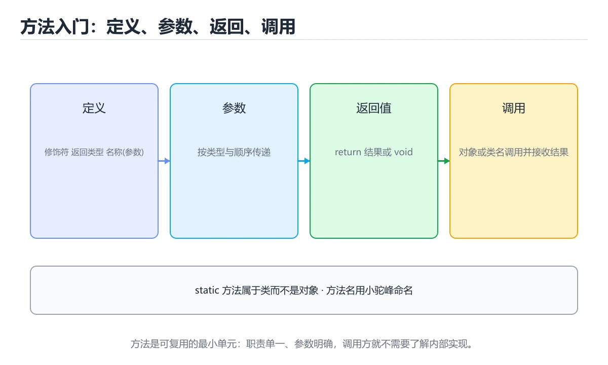
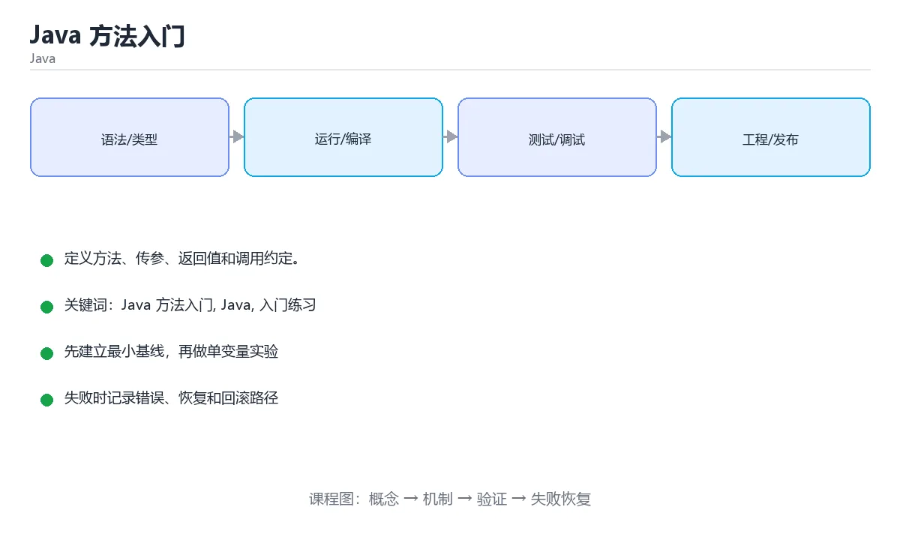

# Java 方法入门





> 内容更新时间：2026-10-03 · 学习阶段：入门 · 预计用时：15 分钟

## 学习目标

- 先认识「Java 方法入门」需要的工具、输入和输出。
- 按步骤运行最小示例，并记录结果与错误。
- 用一个边界输入验证自己是否真正掌握。

## 前置知识

- 会进行基本的文件或命令行操作。
- 不需要预先掌握「Java」的高级知识。

## 一句话入门

定义方法、传参、返回值和调用约定。

## 最小示例

```java
public class Main {
    static int square(int n) {
        return n * n;
    }

    public static void main(String[] args) {
        System.out.println("square(7)=" + square(7));
    }
}
```

## 预期输出

```text
square(7)=49
```

## 常见错误

- 类名与文件名不一致，导致编译失败。
- 复制命令时遗漏空格、引号或必要参数。

## 动手练习

1. 原样运行最小示例，保存命令和输出。
2. 把数字 2 改成 10，预测并验证新结果。
3. 制造一个错误输入，写出错误信息和修复方法。

## 本课小结

- 入门阶段先保证能运行、能观察、能解释，再追求复杂功能。
- 每次只改一个变量，记录预测与实际结果。
- 遇到错误先看第一条错误信息，再回到最小示例。


## 代码实验：把示例跑成证据

这一节不引入新语法，而是把「Java 方法入门」的最小示例变成可以复现、可以对照的实验。每次只改变一个条件，先写预测，再运行，最后解释差异。

### 实验一：建立基线

```java
public class Main {
    static int square(int n) {
        return n * n;
    }

    public static void main(String[] args) {
        System.out.println("square(7)=" + square(7));
    }
}
```

先原样运行上面的代码，记录命令、完整输出和退出状态。然后把输出与正文的预期输出逐字对照，不要用“看起来差不多”代替核对；空格、大小写、换行和错误流向都可能暴露环境差异。

### 实验二：只改一个输入

从代码中选一个会影响结果的字面量、参数或输入，把它替换成边界值：数值可尝试 0、1、最大值和最小值，字符串可尝试空串和超长文本，集合可尝试空集合、单元素和重复元素。先写出预测，再运行并记录实际结果。

### 实验三：制造一个可控错误

把变量声明成不兼容的类型，或者删除一个必要的分号。记录编译器给出的类型错误与位置，修复后确认输出没有变化。

| 实验 | 改动 | 预测 | 实际 | 结论 |
| --- | --- | --- | --- | --- |
| 基线 | 保持原样 |  |  |  |
| 边界 |  |  |  |  |
| 失败 |  |  |  |  |

### 实验四：用三句话复述

1. 输入是什么，哪些输入属于合法范围，哪些属于边界或非法范围？
2. 程序按什么顺序处理输入，在哪一步产生了状态变化或副作用？
3. 输出如何验证，失败时第一条可观察证据是什么？

## Java 基础机制速览

### JDK、JVM 与字节码

Java 源码编译成平台无关的字节码，JVM 负责加载、验证、解释和即时编译。JDK 包含编译器和工具，JRE 只包含运行环境。类加载器按委托模型加载类，`main` 方法是程序入口。理解编译期与运行期的区别，能定位“编译通过但运行时找不到类”和“类型擦除导致的行为差异”。

### 类、对象与静态成员

类是对象的模板，对象保存实例字段，方法定义行为。`static` 成员属于类而不是实例，静态方法不能直接访问实例字段。构造器初始化对象，`this` 指向当前实例，`super` 调用父类成员。封装通过访问修饰符实现，继承表达“是一个”，组合表达“有一个”；优先使用组合降低耦合。`equals`、`hashCode` 和 `toString` 要根据值语义一致地重写。

### 类型、装箱与字符串

Java 有基本类型和引用类型，泛型不能直接使用基本类型，需要装箱成包装类。自动装箱方便但会增加对象分配，比较包装类应使用 `equals` 而不是 `==`。字符串不可变，拼接会产生新对象，循环中应使用 `StringBuilder`。`final` 表示引用不可重新赋值，不代表对象内容不可变。

### 集合、泛型与函数式接口

`List`、`Set`、`Map` 是集合接口，`ArrayList`、`HashSet`、`HashMap` 是常见实现。泛型在编译期提供类型检查，运行时发生类型擦除，因此不能创建泛型数组，也不能依赖运行时泛型信息。Stream 提供声明式的筛选、映射和聚合，但要注意惰性、短路和并行流的线程安全。Lambda 和函数式接口让行为可以作为参数传递。

### 异常、资源与并发

受检异常必须在签名中声明或捕获，非受检异常通常表示编程错误。`try-with-resources` 自动关闭实现 AutoCloseable 的资源。线程共享堆内存，必须使用同步、锁、原子类或并发集合保护共享状态；线程池避免频繁创建线程，但要合理设置队列、拒绝策略和超时。虚拟线程降低了高并发 I/O 的线程成本，但不会自动消除数据竞争。

## 本课自测清单与错误对照

下面把「Java 方法入门」最容易混淆的选项集中起来。不要只记正确答案，要能说明错误选项在什么条件下看似合理、又为什么不能满足题干。

本课测验以直接定义和步骤判断为主。请把每个错误选项改写成一句反例，
说明它在哪个输入、边界或前提变化下会失败。

### 完成标准

- [ ] 能用具体输入复现最小示例，并逐行解释输入、处理与输出。
- [ ] 能只改一个值完成边界实验，并让预测与实际结果一致。
- [ ] 能制造一个可控错误，读出第一条错误信息并完成修复。
- [ ] 能不看书说出本课至少两个易错点和对应的验证方法。

### 复盘记录

| 项目 | 记录 |
| --- | --- |
| 学到的核心机制 |  |
| 仍然不确定的问题 |  |
| 下一步验证动作 |  |


## 实践任务

本节围绕“Java 方法入门”安排 3 个可交付任务，每个任务都要求留下可以复查的记录。

### 任务 1：用自己的话画出结构

合上教程，用 5 句话说明“Java 方法入门”解决什么问题、输入是什么、输出是什么、失败时会怎样、与相邻概念的边界在哪里。画一张流程图或状态图，把每个节点标注成“输入 / 处理 / 输出 / 失败路径”之一。

**验收标准**：图里至少有 5 个节点和 1 条失败路径；每个节点都能在正文中找到依据。

### 任务 2：做一次对比实验

从正文里选两个差异最小的方案，列成 4 列表格：方案、前提、代价、适用边界。然后只改变一个条件（数据规模、并发度、精度或资源上限），记录结果变化。

**验收标准**：表格里两个方案的结论不能完全一样；写下“在什么条件下应该换方案”。

### 任务 3：迁移到自己的场景

把“Java 方法入门”的核心方法用到你熟悉的一个真实场景，写出一份 300 字以内的实施记录：目标、步骤、验证方式、仍然不确定的问题。

**验收标准**：至少有一个可复现的命令、代码片段或数据样例；结论能被别人独立检查。


## 故障现场

这一节把“Java 方法入门”最常见的失败方式还原成现场记录，练习时按“症状 → 复现 → 定位 → 修复 → 预防”的顺序排查。

### 现场 1：“Java 方法入门”的 Java 方法入门 常规用例通过，但边界用例失败

**症状**：在“Java 方法入门”的练习或生产场景里出现““Java 方法入门”的 Java 方法入门 常规用例通过，但边界用例失败”。

**复现**：准备一组最小输入，只保留触发““Java 方法入门”的 Java 方法入门 常规用例通过，但边界用例失败”的必要条件，连续运行两次确认结果稳定。

**定位**：围绕“Java 方法入门 的前置条件与取值边界没有写进代码，默认值掩盖了空值和极值”检查调用链、输入数据和环境配置，先验证假设再改代码。

**修复**：为“Java 方法入门”补一条空值或极值用例，把前置条件写成断言，并让失败信息直接指出是哪个输入越界

**预防**：把““Java 方法入门”的 Java 方法入门 常规用例通过，但边界用例失败”写成一条自动化用例，并在“Java 方法入门”的验收清单里保留对应检查项。


### 现场 2：“Java 方法入门”的 Java 结果在两次运行之间不一致

**症状**：在“Java 方法入门”的练习或生产场景里出现““Java 方法入门”的 Java 结果在两次运行之间不一致”。

**复现**：准备一组最小输入，只保留触发““Java 方法入门”的 Java 结果在两次运行之间不一致”的必要条件，连续运行两次确认结果稳定。

**定位**：围绕“Java 依赖了当前版本、执行顺序或共享状态，单次运行无法暴露差异”检查调用链、输入数据和环境配置，先验证假设再改代码。

**修复**：固定“Java 方法入门”使用的版本与随机种子，记录两次运行的完整输入和输出，再逐项消除非确定性来源

**预防**：把““Java 方法入门”的 Java 结果在两次运行之间不一致”写成一条自动化用例，并在“Java 方法入门”的验收清单里保留对应检查项。


### 现场 3：“Java 方法入门”的验证只在开发机通过

**症状**：在“Java 方法入门”的练习或生产场景里出现““Java 方法入门”的验证只在开发机通过”。

**复现**：准备一组最小输入，只保留触发““Java 方法入门”的验证只在开发机通过”的必要条件，连续运行两次确认结果稳定。

**定位**：围绕“环境版本、配置和输入规模与目标环境不同，Java 方法入门 缺少可重复的验证记录”检查调用链、输入数据和环境配置，先验证假设再改代码。

**修复**：把“Java 方法入门”的运行环境、输入样本和预期输出写成清单，并在另一套环境复跑同一条命令

**预防**：把““Java 方法入门”的验证只在开发机通过”写成一条自动化用例，并在“Java 方法入门”的验收清单里保留对应检查项。


## 版本与时效

这一节记录“Java 方法入门”涉及的版本基线与升级检查点，避免把某个版本的默认行为当成永久结论。

- Java 25 是当前 LTS，Java 21 仍是大量生产系统的基线
- 虚拟线程、记录模式、结构化并发与分代 ZGC 是升级收益最大的部分
- 升级前重点检查反射、字节码增强、序列化与第三方框架兼容性
- 官方发布说明：https://www.oracle.com/java/technologies/javase/

### 升级检查清单

- 先固定当前版本，跑通全部示例与测验，再升级工具链。
- 只改一个版本变量，记录编译、测试、性能与产物体积的变化。
- 重点回归默认值、弃用警告、序列化格式、并发语义和错误信息。
- 升级完成后更新本课的“最后复核 / 下次复核”日期与版本说明。


## 考点精讲：把测验题还原成判断过程

本课有 5 个判断点。先自己作答，再看「判断依据」；如果结论正确但理由不完整，回到正文对应章节补足概念。

### 考点 1：示例中的 square 方法为什么可以不加 static 修饰就被 main 直接调用？

- **正确判断**：因为它写了 static，属于类而不依赖具体对象
- **判断依据**：正确答案是「因为它写了 static，属于类而不依赖具体对象」，这道题在问示例中的square方法为什么可以不加static修饰就被main直接调用，判断时要把题干限定的输入、边界与目标逐项对齐。main 是静态方法，运行时没有对象实例，所以它只能直接调用同样是静态的成员。
- **迁移检查**：遮住选项，只根据定义复述一次答案，再回来看哪个选项与复述一致。

### 考点 2：Java 方法的参数传递方式是？

- **正确判断**：一律按值传递，对象传递的是引用的副本
- **判断依据**：正确答案是「一律按值传递，对象传递的是引用的副本」，这道题在问Java方法的参数传递方式是，判断时要把题干限定的输入、边界与目标逐项对齐。Java 只有值传递：基本类型复制数值，引用类型复制的是指向对象的引用。课程摘要指出定义方法，传参，返回值和调用约定，本课要判断的正是Java方法的参数传递方式是。
- **迁移检查**：把题干里的一个条件换成边界值，原来的结论还成立吗？写出判断过程。

### 考点 3：方法签名（signature）通常由哪些部分构成？

- **正确判断**：方法名和参数列表，返回类型不参与区分重载
- **判断依据**：正确答案是「方法名和参数列表，返回类型不参与区分重载」，这道题在问方法签名（signature）通常由哪些部分构成，判断时要把题干限定的输入、边界与目标逐项对齐。Java 用方法名加参数类型列表来区分重载，两个方法只差返回类型属于重复定义，编译无法通过。方法签名（signature）通常由哪些部分构成。
- **迁移检查**：如果给某个错误选项去掉一个限定词，它会不会变成正确？说明理由。

### 考点 4：void 方法中使用 return; 语句的含义是？

- **正确判断**：立即结束方法执行，把控制权交回调用方
- **判断依据**：正确答案是「立即结束方法执行，把控制权交回调用方」，这道题在问void方法中使用return;语句的含义是，判断时要把题干限定的输入、边界与目标逐项对齐。void 表示没有返回值，return; 只用于提前退出，常出现在参数校验失败等分支里。void 方法中使用 return; 语句的含义是。
- **迁移检查**：如果给某个错误选项去掉一个限定词，它会不会变成正确？说明理由。

### 考点 5：填空：「Java 方法入门」术语速查中，表示「Java 源码编译成平台无关的字节码，JVM 负责加载、验证、解释和即时编译。JDK 包含编译器和工具，JRE 只包含运行环境。类加载器按委托模型加载类，`____` 方法是程序入口。理解编译期与运行期的区别，能定位“编译通过但运行时找不到…」的术语是什么？

- **正确判断**：main
- **判断依据**：正确答案是「main」，这道题在问填空：Java方法入门术语速查中，表示Java源码编…位“编译通过但运行时找不到…的术语是什么，判断时要把题干限定的输入、边界与目标逐项对齐。课程摘要指出定义方法，传参，返回值和调用约定，本课要判断的正是填空：Java方法入门术语速查中，表示Java源码编…位“编译通过但运行时找不到…的术语是什么。
- **迁移检查**：把答案换成另一种等价写法，是否仍然正确？说明依据。

### 补充自测（2 题）

1. 围绕“Java 方法入门”中的 Java 方法入门、Java、入门练习，下列哪两项是本课强调的实践判断？
2. 下面这段 Java 代码复现了“Java 方法入门”中 Java 方法入门、Java、入门练习 相关的一个常见故障，哪一项最准确地解释了问题？

这些题按“先定位概念、再排除边界错误、最后核对答案”的顺序作答；每题解析都给出了判断依据。


## 本课复习清单

离开本课前，逐项确认：

- [ ] 不看解析，能说出「示例中的 square 方法为什么可以不加 static 修饰就被 main 直…」的判断依据。
- [ ] 不看解析，能说出「Java 方法的参数传递方式是？」的判断依据。
- [ ] 不看解析，能说出「方法签名（signature）通常由哪些部分构成？」的判断依据。
- [ ] 不看解析，能说出「void 方法中使用 return; 语句的含义是？」的判断依据。
- [ ] 不看解析，能说出「填空：「Java 方法入门」术语速查中，表示「Java 源码编译成平台无关的字节…」的判断依据。
- [ ] 至少运行一次本课示例，记录输入、输出和一个边界情况。
- [ ] 把本课最容易混淆的两个概念写成一句话对照。

| 复盘项 | 记录 |
| --- | --- |
| 已经能独立解释的考点 |  |
| 仍然说不清的概念 |  |
| 下一步验证动作 |  |

## 逐节复习与自检

下面按正文顺序回顾每一节，并给出一个自检问题；说不清的地方回到原章节补课。

### 最小示例

```java
public class Main {
    static int square(int n) {
        return n * n;
    }

    public static void main(String[] args) {
        System.out.println("square(7)=" + square(7));
    }
}
```

自检：这一节与相邻主题的边界在哪里？

### 预期输出

```text
square(7)=49
```

自检：这一节与相邻主题的边界在哪里？

### 动手练习

把数字 2 改成 10，预测并验证新结果。制造一个错误输入，写出错误信息和修复方法。

自检：如果去掉这一节里的一个前提，结论会怎样变化？

## 术语速查

把本课反复出现的术语集中放在一起。复习时先遮住右列，尝试用自己的话解释，再回到正文核对。

| 术语 | 本课语境 |
| --- | --- |
| `main` | Java 源码编译成平台无关的字节码，JVM 负责加载、验证、解释和即时编译。JDK 包含编译器和工具，JRE 只包含运行环境。类加载器按委托模型加载类，`main` 方法是程序入口。理解编译期与运行期的区别，能定位“编… |
| `static` | 类是对象的模板，对象保存实例字段，方法定义行为。`static` 成员属于类而不是实例，静态方法不能直接访问实例字段。构造器初始化对象，`this` 指向当前实例，`super` 调用父类成员。封装通过访问修饰符实现，继… |
| `this` | 类是对象的模板，对象保存实例字段，方法定义行为。`static` 成员属于类而不是实例，静态方法不能直接访问实例字段。构造器初始化对象，`this` 指向当前实例，`super` 调用父类成员。封装通过访问修饰符实现，继… |
| `super` | 类是对象的模板，对象保存实例字段，方法定义行为。`static` 成员属于类而不是实例，静态方法不能直接访问实例字段。构造器初始化对象，`this` 指向当前实例，`super` 调用父类成员。封装通过访问修饰符实现，继… |
| `equals` | 类是对象的模板，对象保存实例字段，方法定义行为。`static` 成员属于类而不是实例，静态方法不能直接访问实例字段。构造器初始化对象，`this` 指向当前实例，`super` 调用父类成员。封装通过访问修饰符实现，继… |
| `hashCode` | 类是对象的模板，对象保存实例字段，方法定义行为。`static` 成员属于类而不是实例，静态方法不能直接访问实例字段。构造器初始化对象，`this` 指向当前实例，`super` 调用父类成员。封装通过访问修饰符实现，继… |
| `toString` | 类是对象的模板，对象保存实例字段，方法定义行为。`static` 成员属于类而不是实例，静态方法不能直接访问实例字段。构造器初始化对象，`this` 指向当前实例，`super` 调用父类成员。封装通过访问修饰符实现，继… |
| `==` | Java 有基本类型和引用类型，泛型不能直接使用基本类型，需要装箱成包装类。自动装箱方便但会增加对象分配，比较包装类应使用 `equals` 而不是 `==`。字符串不可变，拼接会产生新对象，循环中应使用 `String… |
| `StringBuilder` | Java 有基本类型和引用类型，泛型不能直接使用基本类型，需要装箱成包装类。自动装箱方便但会增加对象分配，比较包装类应使用 `equals` 而不是 `==`。字符串不可变，拼接会产生新对象，循环中应使用 `String… |
| `final` | Java 有基本类型和引用类型，泛型不能直接使用基本类型，需要装箱成包装类。自动装箱方便但会增加对象分配，比较包装类应使用 `equals` 而不是 `==`。字符串不可变，拼接会产生新对象，循环中应使用 `String… |
| `List` | `List`、`Set`、`Map` 是集合接口，`ArrayList`、`HashSet`、`HashMap` 是常见实现。泛型在编译期提供类型检查，运行时发生类型擦除，因此不能创建泛型数组，也不能依赖运行时泛型信息。… |
| `Set` | `List`、`Set`、`Map` 是集合接口，`ArrayList`、`HashSet`、`HashMap` 是常见实现。泛型在编译期提供类型检查，运行时发生类型擦除，因此不能创建泛型数组，也不能依赖运行时泛型信息。… |

## 面试问答与自测

下面把本课考点换成面试追问。先口述自己的答案，
再对照参考回答检查是否遗漏了前提、边界或失败路径。

### 追问 1：示例中的 square 方法为什么可以不加 static 修饰就被 main 直接调用？

**参考回答**：正确答案是「因为它写了 static，属于类而不依赖具体对象」，这道题在问示例中的square方法为什么可以不加static修饰就被main直接调用，判断时要把题干限定的输入、边界与目标逐项对齐。main 是静态方法，运行时没有对象实例，所以它只能直接调用同样是静态的成员。

### 追问 2：Java 方法的参数传递方式是？

**参考回答**：正确答案是「一律按值传递，对象传递的是引用的副本」，这道题在问Java方法的参数传递方式是，判断时要把题干限定的输入、边界与目标逐项对齐。Java 只有值传递：基本类型复制数值，引用类型复制的是指向对象的引用。课程摘要指出定义方法，传参，返回值和调用约定，本课要判断的正是Java方法的参数传递方式是。

### 追问 3：方法签名（signature）通常由哪些部分构成？

**参考回答**：正确答案是「方法名和参数列表，返回类型不参与区分重载」，这道题在问方法签名（signature）通常由哪些部分构成，判断时要把题干限定的输入、边界与目标逐项对齐。Java 用方法名加参数类型列表来区分重载，两个方法只差返回类型属于重复定义，编译无法通过。方法签名（signature）通常由哪些部分构成。

### 追问 4：void 方法中使用 return; 语句的含义是？

**参考回答**：正确答案是「立即结束方法执行，把控制权交回调用方」，这道题在问void方法中使用return;语句的含义是，判断时要把题干限定的输入、边界与目标逐项对齐。void 表示没有返回值，return; 只用于提前退出，常出现在参数校验失败等分支里。void 方法中使用 return; 语句的含义是。

### 追问 5：填空：「Java 方法入门」术语速查中，表示「Java 源码编译成平台无关的字节码，JVM 负责加载、验证、解释和即时编译。JDK 包含编译器和工具，JRE 只包含运行环境。类加载器按委托模型加载类，`____` 方法是程序入口。理解编译期与运行期的区别，能定位“编译通过但运行时找不到…」的术语是什么？

**参考回答**：正确答案是「main」，这道题在问填空：Java方法入门术语速查中，表示Java源码编…位“编译通过但运行时找不到…的术语是什么，判断时要把题干限定的输入、边界与目标逐项对齐。课程摘要指出定义方法，传参，返回值和调用约定，本课要判断的正是填空：Java方法入门术语速查中，表示Java源码编…位“编译通过但运行时找不到…的术语是什么。

## English Overview

**Title:** Java Methods

**Summary:** Define methods with parameters and return values.

**Category:** Java  
**Level:** 入门  
**Key terms:** Java 方法入门, Java, 入门练习

> The full tutorial is written in Chinese. This bilingual overview helps English readers identify the topic, scope and key terms before studying the detailed examples.

## 内容元数据

- 内容版本：v2.0
- 最后更新：2026-10-03
- 学习阶段：入门
- 适用环境：Java 21+ / Maven 或 Gradle
- 内容来源：内置结构化课程与工程实践整理
- 相关主题：Java 方法入门、Java、入门练习
- 质量版本：P0 测验标准 + P1 覆盖扩展 + P2 体验补全


## 参考资料与复核

- 最后复核：2026-10-04
- 下次复核：2027-04-04
- 复核范围：版本兼容、API 行为、安全建议与工程实践
- 来源性质：官方文档与标准；本课正文为离线教学重组，不复制原文

| 参考资料 | 本课用途 |
| --- | --- |
| [Java SE API](https://docs.oracle.com/en/java/javase/) | 语言、标准库与 JVM |
| [dev.java](https://dev.java/learn/) | 现代 Java 官方教程 |

> 本课主题：定义方法、传参、返回值和调用约定。

> App 完全离线展示文字链接，不会自动联网；需要延伸阅读时可复制链接到浏览器。

<!-- code-practice:v1:start -->

## 代码练习（6 题）

下面题目与课程测验同源：覆盖代码输出、排错与场景判断。建议先自己写出答案，再到「测验」里核对成绩。

### 练习 1 · 代码输出

在 Java 课程“Java 方法入门”的边界实验里，这段代码运行后输出什么？

```java
public class Main {
    static int doubleValue(int value) {
        return value * 2;
    }

    public static void main(String[] args) {
        System.out.println(doubleValue(4));
    }
}
```

- A. 16
- B. 7
- C. 8
- D. 9

**参考答案**：C. 8
**参考输出**：`8`

**解析**

在 Java 课程“Java 方法入门”的边界代码实验里，程序先完成赋值、循环或函数调用，再把结果写到标准输出，因此正确结果是 8。
判断 Java 课程“Java 方法入门”的代码输出时，要把“源码写了什么”和“运行时实际打印什么”分开；变量值和循环边界都会直接改变最终结果。
把 8 当作基线后，可以只改一个输入或一个边界，再观察 Java 课程“Java 方法入门”的输出如何变化，这就是验证掌握程度的方法。

### 练习 2 · 代码输出

在 Java 课程“Java 方法入门”的错误处理实验里，这段代码运行后输出什么？

```java
public class Main {
    public static void main(String[] args) {
        int x = 4;
        System.out.println(x);
    }
}
```

- A. 4
- B. 3
- C. 5
- D. 8

**参考答案**：A. 4
**参考输出**：`4`

**解析**

在 Java 课程“Java 方法入门”的错误处理代码实验里，程序先完成赋值、循环或函数调用，再把结果写到标准输出，因此正确结果是 4。
判断 Java 课程“Java 方法入门”的代码输出时，要把“源码写了什么”和“运行时实际打印什么”分开；变量值和循环边界都会直接改变最终结果。
把 4 当作基线后，可以只改一个输入或一个边界，再观察 Java 课程“Java 方法入门”的输出如何变化，这就是验证掌握程度的方法。

### 练习 3 · 代码输出

在 Java 课程“Java 方法入门”的输入输出实验里，这段代码运行后输出什么？

```java
public class Main {
    public static void main(String[] args) {
        int total = 0;
        for (int i = 1; i <= 4; i++) {
            total += i;
        }
        System.out.println(total);
    }
}
```

- A. 20
- B. 9
- C. 11
- D. 10

**参考答案**：D. 10
**参考输出**：`10`

**解析**

在 Java 课程“Java 方法入门”的输入输出代码实验里，程序先完成赋值、循环或函数调用，再把结果写到标准输出，因此正确结果是 10。
判断 Java 课程“Java 方法入门”的代码输出时，要把“源码写了什么”和“运行时实际打印什么”分开；变量值和循环边界都会直接改变最终结果。
把 10 当作基线后，可以只改一个输入或一个边界，再观察 Java 课程“Java 方法入门”的输出如何变化，这就是验证掌握程度的方法。

### 练习 4 · 代码排错

Java 课程“Java 方法入门”的下面这段代码无法运行，最可能的修复是什么？

```java
public class Main {
    public static void main(String[] args) {
        int x = 4
        System.out.println(x);
    }
}
```

- A. 重新安装运行时并清空所有缓存
- B. 在 int x = 4 这一行末尾补上分号
- C. 把变量名改成另一个单词即可
- D. 把输出语句整段删除，代码就会自动修复

**参考答案**：B. 在 int x = 4 这一行末尾补上分号

**解析**

Java 课程“Java 方法入门”里的这段代码无法通过编译或解析，关键原因是缺少了必要语法结构，正确修复是在 int x = 4 这一行末尾补上分号。
在 Java 课程“Java 方法入门”中，错误信息通常会指出出错行和期望符号；先读第一条错误，再检查这一行的括号、冒号、分号或花括号。
修复后还要重新运行 Java 课程“Java 方法入门”的最小示例，确认输出恢复，并记录这次问题属于语法错误而不是逻辑错误。

### 练习 5 · 代码排错

Java 课程“Java 方法入门”的这段代码结果偏小，应该怎样修改？

```java
public class Main {
    public static void main(String[] args) {
        int total = 0;
        for (int i = 1; i < 4; i++) {
            total += i;
        }
        System.out.println(total);
    }
}
```

- A. 把循环条件 i < 4 改成 i <= 4
- B. 把循环变量从 1 改成 0，其余保持不变
- C. 把输出语句移到循环体内部
- D. 把累加操作改成减法操作

**参考答案**：A. 把循环条件 i < 4 改成 i <= 4
**修复后输出**：`10`

**解析**

Java 课程“Java 方法入门”里的循环边界少算了最后一项，当前输出是 6，而完整求和应为 10。
正确修复是把循环条件 i < 4 改成 i <= 4；这类错误属于边界问题，代码能运行但结果偏离，所以比语法错误更隐蔽。
验证 Java 课程“Java 方法入门”时至少选择首项、中间值和末尾值三个输入，比较手算结果与程序输出，才能发现类似偏差。

### 练习 6 · 概念判断

在 Java 课程“Java 方法入门”的学习或项目场景中，哪种做法最有助于得到可验证、可迁移的结果？

- A. 只背下「Java 方法入门」的结论，遇到新输入时凭感觉修改代码
- B. 一次改完所有变量和依赖，再统一观察是否报错
- C. 跳过错误信息，直接复制另一段代码直到能运行
- D. 先围绕「Java 方法入门」写最小可运行示例，再用边界输入验证“Java 方法入门”的结果

**参考答案**：D. 先围绕「Java 方法入门」写最小可运行示例，再用边界输入验证“Java 方法入门”的结果

**解析**

在 Java 课程“Java 方法入门”里，Java 方法入门不是孤立的名词，而是一组可以用输入、过程、输出和边界验证的行为。
对 Java 课程“Java 方法入门”来说，先写最小可运行示例，再逐步增加边界输入，能把“感觉会了”转化成可以重复的证据。
如果只背结论或一次改很多变量，出错时就无法判断是哪一步破坏了 Java 课程“Java 方法入门”的预期；先把变化隔离出来才容易定位。

<!-- code-practice:v1:end -->
