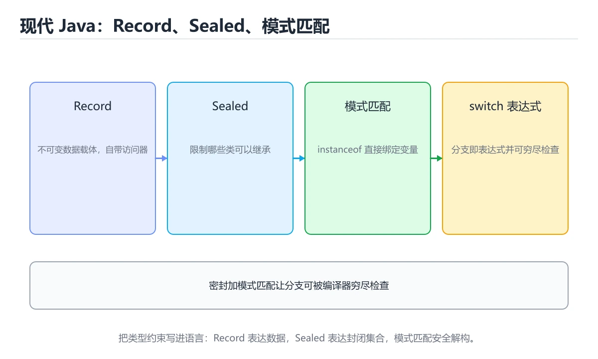
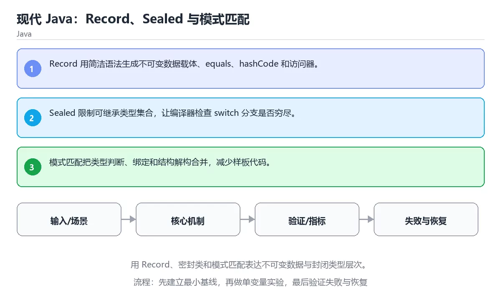

# 现代 Java：Record、Sealed 与模式匹配

> 内容更新时间：2026-10-06 · 学习阶段：高级 · 预计用时：30 分钟





## 学习目标

- 能用自己的话解释：Record 用简洁语法生成不可变数据载体、equals、hashCode 和访问器。
- 能用自己的话解释：Sealed 限制可继承类型集合，让编译器检查 switch 分支是否穷尽。
- 能用自己的话解释：模式匹配把类型判断、绑定和结构解构合并，减少样板代码。
- 能把本课知识放回「Java」，并完成练习与测验。

## 前置知识

- 能运行 default 所在的示例环境，并读懂报错信息。
- 本课关键词：Record、Sealed、模式匹配、不可变。
- 遇到不熟悉的术语先记录问题，完成练习后再回读。

## 核心知识

### 1. Record 用简洁语法生成不可变数据载体、equals、hashCode 和访问器。

- 关键做法：先用 default 建立 Record 的基线，再逐步加入边界与失败条件。
- 验证标准：default 的输出能被他人复现，边界输入有对应用例。

### 2. Sealed 限制可继承类型集合，让编译器检查 switch 分支是否穷尽。

把这条结论放回「现代 Java：Record、Sealed 与模式匹配」的完整流程里展开：

- 正文依据：能用自己的话解释：Record 用简洁语法生成不可变数据载体、equals、hashCode 和访问器。
- 落地检查：把「2. Sealed 限制可继承类型集合，让编译器检查 switch 分支是否穷尽。」改写成一条可执行的核对项，逐条验证输入、超时与失败路径。

### 3. 模式匹配把类型判断、绑定和结构解构合并，减少样板代码。

把这条结论放回「现代 Java：Record、Sealed 与模式匹配」的完整流程里展开：

- 正文依据：能用自己的话解释：Sealed 限制可继承类型集合，让编译器检查 switch 分支是否穷尽。
- 落地检查：把「3. 模式匹配把类型判断、绑定和结构解构合并，减少样板代码。」改写成一条可执行的核对项，逐条验证输入、超时与失败路径。

## 关键流程

```text
输入 → 校验 → 核心处理 → 验证 → 记录指标 → 失败恢复
```

## 实践路径

1. 用一句话复述本课要解决的问题。
2. 跑通正文中的最小示例并记录基线。
3. 只改变一个输入或参数，预测并验证结果。
4. 补一个失败路径，记录错误、恢复和指标。
5. 把结论写成可复现的笔记或测试。

## 常见错误与排查

> 说明：本表由《现代 Java：Record、Sealed 与模式匹配》的核心知识整理（2026-10-07），人工复核进度见 docs/content_review_batches.md。

| 易错点 | 容易踩的做法 | 正确结论 |
| --- | --- | --- |
| 在 record 里放可变字段 | 值语义被破坏，比较结果不符合预期 | record 保持不可变，用紧凑构造器做校验 |
| sealed 子类分散或遗漏 | 模式匹配无法穷尽，编译告警被忽略 | 把子类集中在同一模块，并让分支穷尽 |
| 模式匹配顺序颠倒 | 宽泛模式吞掉具体分支 | 从具体到宽泛排列模式 |

## 动手练习

1. 合上教程，用 3～5 句话解释现代 Java：Record、Sealed 与模式匹配。
2. 从正文选一个例子，改变一个条件并预测结果。
3. 设计一个失败场景，写出止损与恢复步骤。

**验收标准**：留下输入、命令、输出、差异和下一步问题。

## 本课小结

- 本课围绕 Record、Sealed、模式匹配、不可变 展开，复习时重点核对它们的输入、输出和失败路径。
- 把还不确定的 default 行为写成一条可执行验证，再进入下一课。


## 可运行练习

本节围绕现代 Java：Record、Sealed 与模式匹配安排 3 个可交付任务，每个任务都要求留下可以复查的记录。

### 任务 1：用自己的话画出结构

不看书，用一张图说清「现代 Java：Record、Sealed 与模式匹配」的结构，画完再对照骨架：

- 主干：Record 的核心知识 → 关键流程 → 实践路径 → 常见误区
- 连接线：在每条边上标出输入、输出与失败路径。
- 自检：能否用一句话说明Record与Sealed的关系？

### 任务 2：做一次对比实验

**验收标准**：两个方案的差异必须落在「现代 Java：Record、Sealed 与模式匹配」的实际约束上；写清当Record越过哪条边界时应该换方案。

### 任务 3：迁移到自己的场景

**验收标准**：至少给出一个命令或数据样例，让读者能独立复现 Sealed 的结论。

## 故障现场

### 现场 1：在 record 里放可变字段

**症状**：在《现代 Java：Record、Sealed 与模式匹配》的复现场景中，值语义被破坏，比较结果不符合预期。

**根因**：当出现“在 record 里放可变字段”时，执行路径已经绕过了《现代 Java：Record、Sealed 与模式匹配》的关键约束，最终以“值语义被破坏，比较结果不符合预期”暴露出来；修复前必须先确认约束在哪里失效。

**修复**：针对《现代 Java：Record、Sealed 与模式匹配》的问题，record 保持不可变，用紧凑构造器做校验。

**验证**：保留《现代 Java：Record、Sealed 与模式匹配》里触发“值语义被破坏，比较结果不符合预期”的输入、版本和日志，按“record 保持不可变，用紧凑构造器做校验”完成修改后原样重放；只有失败现象消失且相邻场景仍可解释，才保留改动。

### 现场 2：sealed 子类分散或遗漏

**症状**：在《现代 Java：Record、Sealed 与模式匹配》的复现场景中，模式匹配无法穷尽，编译告警被忽略。

**根因**：触发点是把“sealed 子类分散或遗漏”当成安全做法。它没有满足《现代 Java：Record、Sealed 与模式匹配》要求的前提，因此先表现为“模式匹配无法穷尽，编译告警被忽略”；排查时先完整复现这一段，再核对输入、配置与依赖。

**修复**：针对《现代 Java：Record、Sealed 与模式匹配》的问题，把子类集中在同一模块，并让分支穷尽。

**验证**：保留《现代 Java：Record、Sealed 与模式匹配》里触发“模式匹配无法穷尽，编译告警被忽略”的输入、版本和日志，按“把子类集中在同一模块，并让分支穷尽”完成修改后原样重放；只有失败现象消失且相邻场景仍可解释，才保留改动。

### 现场 3：模式匹配顺序颠倒

**症状**：在《现代 Java：Record、Sealed 与模式匹配》的复现场景中，宽泛模式吞掉具体分支。

**根因**：触发点是把“模式匹配顺序颠倒”当成安全做法。它没有满足《现代 Java：Record、Sealed 与模式匹配》要求的前提，因此先表现为“宽泛模式吞掉具体分支”；排查时先完整复现这一段，再核对输入、配置与依赖。

**修复**：针对《现代 Java：Record、Sealed 与模式匹配》的问题，从具体到宽泛排列模式。

**验证**：先在《现代 Java：Record、Sealed 与模式匹配》中记录“模式匹配顺序颠倒”留下的失败证据，再执行“从具体到宽泛排列模式”并重放；确认错误路径变为明确结果，且修复没有掩盖同类故障。

## 版本与时效

- Java 25 是当前 LTS，Java 21 仍是大量生产系统的基线；Record 的写法要按目标版本选择。
- 若 default 依赖线程或 GC 行为，升级时要重点验证并发与停顿指标。
- 升级前确认 Record 的兼容范围，把不可回退的改动单独拆成一次提交。

### 升级检查清单

- 先固定当前版本，跑通全部示例与测验，再升级工具链。
- 只改 Record 的版本变量，记录编译、测试与产物体积的变化。
- 回归范围锁定 default 的默认行为，并确认弃用警告是否出现在构建输出里。
- 升级后把 default 的实测版本写进「内容元数据」，再更新复核日期。

## 本课复习清单


离开本课前，逐项确认：

- [ ] 不看解析，能说出「关于「Sealed 限制可继承类型集合」，下列说法正确的是？」的判断依据。
- [ ] 不看解析，能说出「关于「模式匹配把类型判断、绑定和结构解构合并，减少样板代码。」，下列说法正确的是？」的判断依据。
- [ ] 不看解析，能说出「「现代 Java：Record、Sealed 与模式匹配」的核心学习目标是什么？」的判断依据。
- [ ] 至少运行一次《现代 Java：Record、Sealed 与模式匹配》的示例，记录输入、输出和一个边界情况。
- [ ] 把本课最容易混淆的两个概念写成一句话对照。

| 复盘项 | 记录 |
| --- | --- |
| 已经能独立解释的考点 |  |
| 仍然说不清的概念 |  |
| 下一步验证动作 |  |

## 复习与自测

对照 核心知识 复述本课结论，答不上来的部分回到 default 的示例重跑一次。

### 核心知识

自检：这一节与相邻主题的边界在哪里？

### 动手练习

自检：如果去掉这一节里的一个前提，结论会怎样变化？

### 最小可运行示例

```java
record Point(int x, int y) {}

public class Main {
    public static void main(String[] args) {
        Object value = new Point(2, 3);
        String label = switch (value) {
            case Point(int x, int y) when x == 0 && y == 0 -> "origin";
            case Point(int x, int y) -> "point " + x + "," + y;
            default -> "unknown";
        };
        System.out.println(label);
    }
}
```

自检：把这一节讲给没学过的人，最需要强调哪一点？

### 预期输出

```text
point 2,3
```

### 验证步骤

制造一次错误输入，记录错误信息与修复方式。

## 术语速查

| 术语 | 一句话说明 |
| --- | --- |
| `Record` | 按“现代 Java：Record、Sealed 与模式匹配”中 Record、Sealed、模式匹配 的实践顺序，把四个步骤排成从准备到复盘的合理顺序。 |
| `Sealed` | Summary: Use records, sealed types and pattern matching for immutable data.。 |
| `不可变` | 对象创建后状态不再改变，更新时生成新对象，从而减少共享状态和并发错误。 |
| `任务 1：用自己的话画出结构` | 不看书，用一张图说清「现代 Java：Record、Sealed 与模式匹配」的结构，画完再对照骨架。 |

## 深度拓展与实战

这一节把「现代 Java：Record、Sealed 与模式匹配」正文里的定义、代码和失败模式串成一条可操作的复习路线。

### 机制拆解

- **1. Record 用简洁语法生成不可变数据载体、equals、hashCode 和访问器。**：在「现代 Java：Record、Sealed 与模式匹配」里，「1. Record 用简洁语法生成不可变数据载体、equals、hashCode 和访问器。」这一步要先写清输入与预期，再记录实际结果和差异；结果不符时回到对应小节核对前提。
- **2. Sealed 限制可继承类型集合，让编译器检查 switch 分支是否穷尽。**：在「现代 Java：Record、Sealed 与模式匹配」里，「2. Sealed 限制可继承类型集合，让编译器检查 switch 分支是否穷尽。」这一步要先写清输入与预期，再记录实际结果和差异；结果不符时回到对应小节核对前提。
- **3. 模式匹配把类型判断、绑定和结构解构合并，减少样板代码。**：在「现代 Java：Record、Sealed 与模式匹配」里，「3. 模式匹配把类型判断、绑定和结构解构合并，减少样板代码。」这一步要先写清输入与预期，再记录实际结果和差异；结果不符时回到对应小节核对前提。
- **考点 1：按“现代 Java：Record、Sealed 与模式匹配”中 Record、Sealed、模式匹配 的实践顺序，把四个步骤排成从准备到复盘的合理顺序。**：先独立作答，再回到本课对应小节核对判断依据；答错时记录是哪一个前提被忽略。
- **考点 2：关于「Sealed 限制可继承类型集合」，下列说法正确的是？**：先独立作答，再回到本课对应小节核对判断依据；答错时记录是哪一个前提被忽略。

### 边界条件与常见反例

「现代 Java：Record、Sealed 与模式匹配」的边界不只包括最大最小值，还要覆盖空、重复和失败：

| 条件 | 常见反例 | 处理方式 |
| --- | --- | --- |
| 空输入 | Record 没有任何取值 | 先判空，给出明确错误而不是继续执行 |
| 边界值 | Sealed 取最小或最大 | 用最小值、最大值和越界值各跑一次 |
| 重复执行 | 同一输入被执行两次 | 保证结果可重复，必要时加锁或去重 |
| 失败路径 | Record 相关步骤报错 | 保留原始错误，确认回滚或重试行为 |

### 工程检查表

- [ ] 能否用自己的话说明现代 Java：Record、Sealed 与模式匹配解决什么问题，以及它不负责什么？
- [ ] 能否说明 Record 的正常输出，以及失败时留下的错误信息？
- [ ] 能否解释本课关键词在真实项目中的边界与取舍？
- [ ] 能否说明 Sealed 在新场景下需要补充什么前提？

### 迁移练习

1. 保持正文示例不变，写出它的输入、处理步骤和预期输出。
2. 固定其他输入，只调整 default 的一个参数，先写预测再验证。
3. 结合Record、Sealed、模式匹配、不可变，写出一个真实项目中的使用场景。
4. 写下一个反例，说明它在什么条件下会使朴素做法失效。

## 考点精讲

### 考点 1：顺序排列·Record

- **题目**：按“现代 Java：Record、Sealed 与模式匹配”中 Record、Sealed、模式匹配 的实践顺序，把四个步骤排成从准备到复盘的合理顺序。
- **判断依据**：在「现代 Java：Record、Sealed 与模式匹配」里，在本课的练习里，顺序应当是：先明确 Record 的输入、输出与约束 → 写出最小示例并核对 Sealed 的基线结果 → 只改一个变量，记录边界与失败路径的变化 → 固定版本与证据，把本课的结论写成可复现记录。这个顺序把 Record 的输入、输出和约束放在最前面，在现代 Java：Record、Sealed 与模式匹配里避免概念没对齐就开始调参。第二步用 Sealed 建立可核对的基线，在现代 Java：Record、Sealed 与模式匹配里第三步才允许改变一个变量并观察失败路径。

### 考点 2：概念判断·Sealed 限制可继承类型集合

- **题目**：关于「Sealed 限制可继承类型集合」，下列说法正确的是？
- **判断依据**：在「现代 Java：Record、Sealed 与模式匹配」里，Sealed 限制可继承类型集合。「现代 Java：Record、Sealed 与模式匹配」要求先交代Record、Sealed、模式匹配的前提再下结论，所以“Sealed 限制可继承类型集合”只在题干“Sealed 限制可继承类型集合”给定的条件下成立。

### 考点 3：概念判断·Record

- **题目**：关于「模式匹配把类型判断、绑定和结构解构合并，减少样板代码。」，下列说法正确的是？
- **判断依据**：在「现代 Java：Record、Sealed 与模式匹配」里，模式匹配把类型判断、绑定和结构解构合并，减少样板代码。在「现代 Java：Record、Sealed 与模式匹配」里判断这道题，要把Record、Sealed、模式匹配的条件、过程与失败路径逐项对齐，换成“关于模式匹配把类型判断、绑定和结构解”这个场景，只有满足前提的结论才成立。

### 考点 4：概念判断·Record

- **题目**：「现代 Java：Record、Sealed 与模式匹配」的核心学习目标是什么？
- **判断依据**：在「现代 Java：Record、Sealed 与模式匹配」里，结论应落在「用 Record、密封类和模式匹配表达不可变数据与封闭类型层次」。在「现代 Java：Record、Sealed 与模式匹配」里，结论应落在用 Record、密封类和模式匹配表达不可变数据与封闭类型层次。在「现代 Java：Record、Sealed 与模式匹配」里，这道题要求区分概念与边界，用 Record、密封类和模式匹配表达不可变数据与封闭类型层次。

### 考点 5：多选辨析·Record

- **题目**：以下哪些术语与「现代 Java：Record、Sealed 与模式匹配」直接相关？（多选）
- **判断依据**：在「现代 Java：Record、Sealed 与模式匹配」里，Record。Sealed代入边界条件核对，结论才能复现。“以下哪些术语与现代”与「现代 Java：Record、Sealed 与模式匹配」的术语表相呼应，只有符合Record、Sealed、模式匹配约束的“Record”才是正文支持的结论。

### 考点 6：排错·Record

- **题目**：阅读「现代 Java：Record、Sealed 与模式匹配」的代码片段，下面哪项判断是正确的？
- **判断依据**：在「现代 Java：Record、Sealed 与模式匹配」里，Record 用简洁语法生成不可变数据载体，equals。回到「现代 Java：Record、Sealed 与模式匹配」的正文示例，用“阅读现代 Java”走一遍Record、Sealed、模式匹配的完整流程，能复现的结论才可以保留。

## English Overview

**Title:** Modern Java: Records, Sealed Types and Pattern Matching

**Summary:** Use records, sealed types and pattern matching for immutable data.

**Category:** Java
**Level:** 高级
**Key terms:** Record, Sealed, 模式匹配, 不可变

## 内容元数据

- 内容版本：v2.0
- 最后更新：2026-10-06
- 学习阶段：高级
- 适用环境：Java 21+ / Maven 或 Gradle；本课聚焦 Record。
- 内容来源：内置结构化课程与工程实践整理
- 相关主题：Record、Sealed、模式匹配、不可变
- 质量版本：P0 测验标准 + P1 覆盖扩展 + P2 体验补全

## 最小可运行示例

先用下面的示例确认 Record 的基线，再只改一个与 Sealed 相关的值：

```java
record Point(int x, int y) {}

public class Main {
    public static void main(String[] args) {
        Object value = new Point(2, 3);
        String label = switch (value) {
            case Point(int x, int y) when x == 0 && y == 0 -> "origin";
            case Point(int x, int y) -> "point " + x + "," + y;
            default -> "unknown";
        };
        System.out.println(label);
    }
}
```

## 预期输出

```text
point 2,3
```

## 验证步骤

1. 记录运行环境、命令和真实输出。
2. 修改一个输入，先写预测再运行。
4. 把结论写回本课笔记或测试用例。

## 参考资料与复核

- 最后复核：2026-10-04
- 下次复核：2027-01-10
- 复核范围：版本兼容、API 行为、安全建议与工程实践
- 来源性质：官方文档、标准或权威教材；正文为离线教学重组

| 参考资料 | 本课用途 |
| --- | --- |
| [dev.java 学习](https://dev.java/learn/) | 现代 Java 官方教程 |
| [Gradle 文档](https://docs.gradle.org/current/userguide/userguide.html) | 构建脚本与依赖管理 |
| [Maven 指南](https://maven.apache.org/guides/) | 依赖、生命周期与构建 |

> 「现代 Java：Record、Sealed 与模式匹配」的链接用于离线阅读后的延伸核对；App 不会自动联网。

## 复习与迁移

复习目标：把「现代 Java：Record、Sealed 与模式匹配」的判断标准放回可复现的例子里。先自己作答，再对照依据；如果结论正确但理由不完整，回到正文补足前提。

### 概念复述

- 用一句话说明「现代 Java：Record、Sealed 与模式匹配」解决什么问题：用 Record、密封类和模式匹配表达不可变数据与封闭类型层次。
- 写出Record、Sealed、模式匹配之间的关系，并各举一个例子。
- 说出本课最容易混淆的两个概念，以及区分它们的判据。

### 正文逐节复核

- **实践任务**：本节围绕现代 Java：Record、Sealed 与模式匹配安排 3 个可交付任务，每个任务都要求留下可以复查的记录。

### 测验回顾

1. 按“现代 Java：Record、Sealed 与模式匹配”中 Record、Sealed、模式匹配 的实践顺序，把四个步骤排成从准备到复盘的合理顺序。
   - 依据：在「现代 Java：Record、Sealed 与模式匹配」里，在本课的练习里，顺序应当是：先明确 Record 的输入、输出与约束 → 写出最小示例并核对 Sealed 的基线结果 → 只改一个变量，记录边界与失败路径的变化 → 固定版本与证据，把本课的结论写成可复现记录。这个顺序把 Record 的输入、输出和约束放在最前面，在现代 Java：Record、Sealed 与模式匹配里避免概念没对齐就开始调参。第二步用 Sealed 建立可核对的基线，在现代 Java：Record、Sealed 与模式匹配里第三步才允许改变一个变量并观察失败路径。
2. 关于「Sealed 限制可继承类型集合」，下列说法正确的是？
   - 依据：在「现代 Java：Record、Sealed 与模式匹配」里，Sealed 限制可继承类型集合。「现代 Java：Record、Sealed 与模式匹配」要求先交代Record、Sealed、模式匹配的前提再下结论，所以“Sealed 限制可继承类型集合”只在题干“Sealed 限制可继承类型集合”给定的条件下成立。
3. 关于「模式匹配把类型判断、绑定和结构解构合并，减少样板代码。」，下列说法正确的是？
   - 依据：在「现代 Java：Record、Sealed 与模式匹配」里，模式匹配把类型判断、绑定和结构解构合并，减少样板代码。在「现代 Java：Record、Sealed 与模式匹配」里判断这道题，要把Record、Sealed、模式匹配的条件、过程与失败路径逐项对齐，换成“关于模式匹配把类型判断、绑定和结构解”这个场景，只有满足前提的结论才成立。
4. 「现代 Java：Record、Sealed 与模式匹配」的核心学习目标是什么？
   - 依据：在「现代 Java：Record、Sealed 与模式匹配」里，结论应落在「用 Record、密封类和模式匹配表达不可变数据与封闭类型层次」。在「现代 Java：Record、Sealed 与模式匹配」里，结论应落在用 Record、密封类和模式匹配表达不可变数据与封闭类型层次。在「现代 Java：Record、Sealed 与模式匹配」里，这道题要求区分概念与边界，用 Record、密封类和模式匹配表达不可变数据与封闭类型层次。
5. 以下哪些术语与「现代 Java：Record、Sealed 与模式匹配」直接相关？（多选）
   - 依据：在「现代 Java：Record、Sealed 与模式匹配」里，Record。Sealed代入边界条件核对，结论才能复现。“以下哪些术语与现代”与「现代 Java：Record、Sealed 与模式匹配」的术语表相呼应，只有符合Record、Sealed、模式匹配约束的“Record”才是正文支持的结论。
6. 阅读「现代 Java：Record、Sealed 与模式匹配」的代码片段，下面哪项判断是正确的？
   - 依据：在「现代 Java：Record、Sealed 与模式匹配」里，Record 用简洁语法生成不可变数据载体，equals。回到「现代 Java：Record、Sealed 与模式匹配」的正文示例，用“阅读现代 Java”走一遍Record、Sealed、模式匹配的完整流程，能复现的结论才可以保留。

### 迁移练习

把「现代 Java：Record、Sealed 与模式匹配」的结论迁移到相邻主题，每次迁移都写清预测与证据：

1. 换输入：用Record处理一组你自己的数据，对比教材示例的结果差异。
2. 换失败条件：制造一个Sealed相关的错误，说明如何从错误信息定位根因。
3. 换规模：把数据量或并发度提高一个数量级，说明「现代 Java：Record、Sealed 与模式匹配」的结论是否仍成立。
