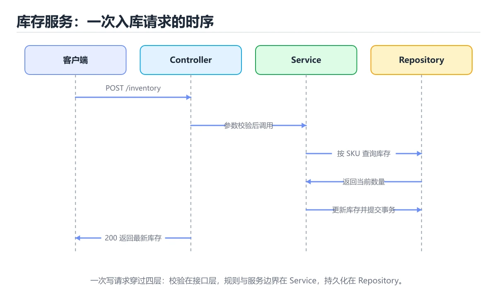
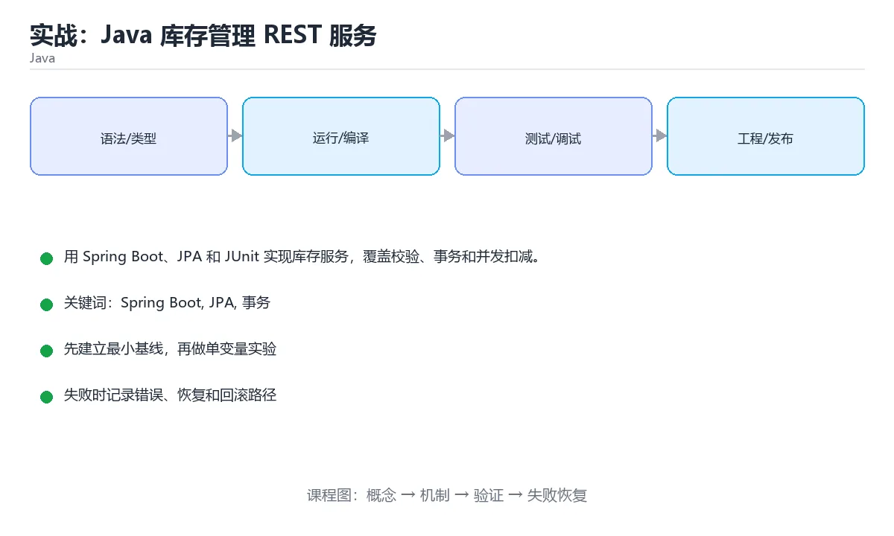

# 实战：Java 库存管理 REST 服务





> 内容更新时间：2026-10-06 · 学习阶段：高级 · 预计用时：60 分钟

## 本节知识框架

**课程定位**：所属分类 `java`（Java），课程主题 `实战：Java 库存管理 REST 服务`，学习阶段 高级，建议用时 70 分钟。

本课主线：用 Spring Boot、JPA 和 JUnit 实现库存服务，覆盖校验、事务和并发扣减。

**学完本课应当能够**
- 说清 `Spring Boot` 与 `事务` 的含义与区别，并各举一个正例和一个反例。
- 用本课示例验证 `库存` 的行为，记录输入、输出与失败条件。
- 遇到「业务逻辑堆在控制器里」这类问题时，能说出触发条件与修复顺序。

### 从概念到验证的学习链条

1. `Spring Boot`：先掌握 基于 Spring 的快速开发框架：约定优于配置、内嵌容器，起步依赖即可跑起 Web 服务，再用它解释 `事务` 为什么会出现。
2. `事务`：先掌握 一组要么全部成功要么全部回滚的数据库操作，再用它解释 `库存` 为什么会出现。
3. `库存`：先掌握 用 Spring Boot、JPA 和 JUnit 实现库存服务，覆盖校验、事务和并发扣减，再用它解释 `乐观锁` 为什么会出现。
4. `乐观锁`：先掌握 更新时带上版本号条件，冲突就重试而不是提前加锁，适合读多写少的场景，再用它解释 `可观测性` 为什么会出现。
5. `可观测性`：先掌握 由日志、指标与链路追踪组成，能在不重启、不改代码的前提下问出新问题，再用它解释 `JUnit` 为什么会出现。
6. `JUnit`：先掌握 Java 常用的单元测试框架，用注解声明测试、断言和生命周期，再用它解释 本课示例的观察结果 为什么会出现。

**先修与衔接**：本课是「Java」分类的第 17 课。先修内容：《实战：Spring Boot REST API》。《实战：Spring Boot REST API》里的 `record`、`实战` 是本课的前提。相关或后续课程：《实战：Java 并发订单处理服务》。

### 完成判据

- **定义关**：不看正文也能说明 `Spring Boot` 是 基于 Spring 的快速开发框架：约定优于配置、内嵌容器，起步依赖即可跑起 Web 服务，并指出一个反例。
- **机制关**：能按“输入 → 转换 → 输出 → 验证”复述 `实战：Java 库存管理 REST 服务`，而不是只背结论。
- **示例关**：能运行或推演 `实战：Java 库存管理 REST 服务` 的 `text` 示例，并说明一个真实出现的标识符或字面量。
- **证据关**：能从 `实战：Java 库存管理 REST 服务` 的示例写出一个输入、处理、输出三元组，并说明它支持或反驳了本课的哪一条结论。
- **排错关**：能复现 业务逻辑堆在控制器里，记录现象并按 拆出服务与仓储层，控制器只处理参数与响应 修复。
- **迁移关**：能把 `Spring Boot`、`JPA`、`事务`、`JUnit` 放进一个与 `实战：Java 库存管理 REST 服务` 不同的项目场景，并保持输入与验证条件可追踪。
- **复盘关**：学完 `实战：Java 库存管理 REST 服务` 后，用一句话写下仍然不确定的结论，并列出下一次验证需要的输入、环境和成功判据。

### 复习清单

- [ ] 能不看正文复述本课核心术语，并指出一个边界或反例。
- [ ] 能运行或推演本课示例，记录输入、输出与失败现象。
- [ ] 能完成一次自测，并把错题对照错误表定位原因。

## 核心概念定义

| 术语 | 操作性定义 | 常见边界与风险 |
| --- | --- | --- |
| Spring Boot | 基于 Spring 的快速开发框架：约定优于配置、内嵌容器，起步依赖即可跑起 Web 服务。 | 不同版本与依赖组合的行为可能不同，升级或换环境前要按官方变更说明重新验证。 |
| 事务 | 一组要么全部成功要么全部回滚的数据库操作。 | 隔离级别与并发事务会影响可见性，换级别或换存储引擎后要重新验证。 |
| 库存 | 用 Spring Boot、JPA 和 JUnit 实现库存服务，覆盖校验、事务和并发扣减。 | 共享状态与调度顺序会改变结论，单线程或串行测试通过不等于并发下成立。 |
| 乐观锁 | 更新时带上版本号条件，冲突就重试而不是提前加锁，适合读多写少的场景。 | 不同版本与依赖组合的行为可能不同，升级或换环境前要按官方变更说明重新验证。 |
| 可观测性 | 由日志、指标与链路追踪组成，能在不重启、不改代码的前提下问出新问题 | 只在「由日志、指标与链路追踪组成，能在不重启、不改代码的前提下问出新问题」这一前提下成立，换输入或换环境要重新验证。 |
| JUnit | Java 常用的单元测试框架，用注解声明测试、断言和生命周期 | 越界、悬垂引用与释放顺序会破坏结论，必须在边界输入下复验。 |

## 原理与运行机制

### 机制总览

| 阶段 | 关注对象 | 失败时应检查 |
| --- | --- | --- |
| 输入 | Spring Boot | 类型、范围、编码、版本或前置状态是否满足定义。 |
| 处理 | 事务 | 顺序、可见性、锁、路由、事务或调度规则是否被破坏。 |
| 输出 | 库存 | 结果是否可复现，错误是否被正确传播而不是被吞掉。 |

**教材衔接：技术栈**

- Java 21
- Spring Boot
- Spring Data JPA
- H2/PostgreSQL
- JUnit 5

**教材衔接：架构与数据流**

- 查询 JPA 时限定字段与分页范围，把全表扫描留作最后手段。
- IllegalArgumentException 的写入要以幂等键为准，失败后能补偿或安全重试。
- 外部调用要设置超时、重试上限和降级策略。
- 每个关键阶段都要留下日志、指标或测试证据。

**教材衔接：功能范围**

- [ ] 商品入库并记录流水
- [ ] 出库校验可用库存
- [ ] 分页查询库存与流水
- [ ] 低于阈值时返回告警标记

**教材衔接：实施步骤**

### 步骤 1：建立商品与库存流水实体

- 输入与产出：先写清 Spring Boot 依赖的配置、数据和最终产物，再开始编码。
- 为 JPA 补一个最小用例，明确通过标准再扩展规模。
- 为 IllegalArgumentException 定义失败分类与重试上限，超出后走人工处理。
- 证据留存：保留命令、输出、日志或截图，方便评审与复盘。

### 步骤 2：实现仓储接口和事务服务

- 定位：这一节说明步骤 2：实现仓储接口和事务服务在「实战：Java 库存管理 REST 服务」知识体系里的位置。
- 要点：本课涉及：Spring Boot、JPA、事务、JUnit、库存。
- 自检：能否用一个最小例子解释步骤 2：实现仓储接口和事务服务？

### 步骤 3：暴露入库、出库、查询接口

- 定位：这一节说明步骤 3：暴露入库、出库、查询接口在「实战：Java 库存管理 REST 服务」知识体系里的位置。
- 要点：仓库需要管理商品库存：入库、出库、查询和低库存告警。多个请求可能同时扣减同一商品，必须避免超卖并保留完整审计记录。
- 自检：能否用一个最小例子解释步骤 3：暴露入库、出库、查询接口？

### 步骤 4：用条件更新或乐观锁处理并发

- 定位：这一节说明步骤 4：用条件更新或乐观锁处理并发在「实战：Java 库存管理 REST 服务」知识体系里的位置。
- 要点：一句话摘要：用 Spring Boot、JPA 和 JUnit 实现库存服务，覆盖校验、事务和并发扣减。
- 自检：能否用一个最小例子解释步骤 4：用条件更新或乐观锁处理并发？

### 步骤 5：加入统一异常与参数校验

- 定位：这一节说明步骤 5：加入统一异常与参数校验在「实战：Java 库存管理 REST 服务」知识体系里的位置。
- 要点：写路径要明确事务边界、幂等键和失败补偿，不能留下半完成状态。
- 自检：能否用一个最小例子解释步骤 5：加入统一异常与参数校验？

### 步骤 6：用 MockMvc 和数据库集成测试验收

把这条结论放回「实战：Java 库存管理 REST 服务」的完整流程里展开：

- 检查点：用空值、极值和依赖失败各跑一次《实战：Java 库存管理 REST 服务》，确认边界行为与正文一致。
- 落地检查：把「步骤 6：用 MockMvc 和数据库集成测试验收」改写成一条可执行的核对项，逐条验证输入、超时与失败路径。

**教材衔接：建议目录结构**

**教材衔接：质量门禁**

- [ ] 格式化和静态检查通过，不遗留明显警告。
- [ ] 单元测试覆盖 Spring Boot 的核心规则，集成测试覆盖数据库或外部边界。
- [ ] 错误响应不泄露堆栈、SQL 和密钥。
- [ ] 配置来自环境变量或配置文件，不硬编码敏感信息。
- [ ] README 写清启动、测试、配置和回滚步骤。

**教材衔接：安全、成本与可观测性**

- 为 JPA 单独申请最小权限，并记录权限变更。
- 所有进入 Spring Boot 的外部输入都要校验、限长并转义，错误信息不能泄露内部路径。
- 密钥通过环境变量或密钥管理服务注入，并记录轮换方式。
- 给 JPA 的资源使用设定配额，超出后降级而不是拖垮整个进程。
- 为 IllegalArgumentException 建立四个指标：吞吐、错误率、尾延迟和资源占用。
- Spring Boot 出现异常时，要能从日志和指标还原时间线，而不是只看到「服务不可用」。

**教材衔接：扩展任务**

- 加入 Redis 缓存和库存预热
- 接入消息队列异步写审计流水
- 增加低库存定时任务

**教材衔接：实施记录与复盘**

每完成一步，记录以下内容：

1. 本步的输入、命令和输出是什么？
2. 遇到的最小失败是什么，如何定位和修复？
3. 哪个假设被验证或推翻？
4. 下一步的风险是什么，如何回滚？
5. 规模扩大 10 倍后，JPA 会先成为瓶颈还是先暴露一致性风险？

**教材衔接：完成标准**

- [ ] 能从干净环境按 README 启动项目。
- [ ] 为 IllegalArgumentException 补三条测试：正常、边界、失败各一条。
- [ ] 能演示一次错误、一次恢复和一次回滚。
- [ ] 有一份资源或性能基线，能说明瓶颈在哪里。
- [ ] 能说清一个尚未解决的问题和下一步验证方法。

**教材衔接：版本与时效**

- 版本基线会影响 Spring Boot 的可用 API，升级前先用编译与测试验证。
- 若 IllegalArgumentException 依赖线程或 GC 行为，升级时要重点验证并发与停顿指标。
- 升级「实战：Java 库存管理 REST 服务」涉及的依赖前，先用 IllegalArgumentException 复现当前行为，再逐项核对版本说明与破坏性变更。

### 升级检查清单

- 先固定当前版本，跑通全部示例与测验，再升级工具链。
- 升级时只动一个依赖版本，用 IllegalArgumentException 记录构建与运行结果。
- 升级后重点回归 Spring Boot 的默认值、警告信息与错误格式。
- 升级完成后记录 Spring Boot 的新旧版本差异，并据此调整下次复核时间。

**教材衔接：交付评审：评分表、决策记录与证据链**


### 四、「实战：Java 库存管理 REST 服务」的验收指标

| 指标 | 目标值 | 测量方式 | 不达标时的动作 |
| --- | --- | --- | --- |
| | 延迟 | 记录 P50/P95/P99 | 用固定数据集逐步增加并发 | P99 持续上升或超时率增加 | | 用本课正文给出的阈值，没有就写实测基线 | 固定环境重复三次取中位数 | 回到对应小节定位，先修原因再重测 |
| | 存储 | 记录数据增长与索引大小 | 导入 10 倍数据并观察查询 | 磁盘、连接或锁等待成为瓶颈 | | 用本课正文给出的阈值，没有就写实测基线 | 固定环境重复三次取中位数 | 回到对应小节定位，先修原因再重测 |

### 五、评审记录模板

| 记录项 | 填写要求 |
| --- | --- |
| 项目标识 | `java_project_inventory` |
| 本次范围 | 说明这一轮交付了「实战：Java 库存管理 REST 服务」的哪些部分 |
| 未完成项 | 列出与 Spring Boot 相关但本轮未做的内容 |
| 证据位置 | 指向 evidence/ 目录下的具体文件 |
| 风险与回滚 | 写清剩余风险、回滚步骤和验证方式 |
| 结论 | 通过 / 有条件通过 / 不通过，三者选一 |

### 机制拆解：每一步的输入、动作与输出

#### 1. `Spring Boot`
- 输入：`Spring Boot`；本步把 基于 Spring 的快速开发框架：约定优于配置、内嵌容器，起步依赖即可跑起 Web 服务 当作判断规则。
- 动作：围绕 `Spring Boot` 保留中间状态，并记录它与 `事务` 的对应关系。
- 输出：`事务`，它可以被下一段代码、测试或记录继续使用。
- `Spring Boot` 的失败条件：不同版本与依赖组合的行为可能不同，升级或换环境前要按官方变更说明重新验证。

#### 2. `事务`
- 输入：`Spring Boot`；本步把 一组要么全部成功要么全部回滚的数据库操作 当作判断规则。
- 动作：围绕 `事务` 保留中间状态，并记录它与 `库存` 的对应关系。
- 输出：`库存`，它可以被下一段代码、测试或记录继续使用。
- `事务` 的失败条件：隔离级别与并发事务会影响可见性，换级别或换存储引擎后要重新验证。

#### 3. `库存`
- 输入：`事务`；本步把 用 Spring Boot、JPA 和 JUnit 实现库存服务，覆盖校验、事务和并发扣减 当作判断规则。
- 动作：围绕 `库存` 保留中间状态，并记录它与 `乐观锁` 的对应关系。
- 输出：`乐观锁`，它可以被下一段代码、测试或记录继续使用。
- `库存` 的失败条件：共享状态与调度顺序会改变结论，单线程或串行测试通过不等于并发下成立。

#### 4. `乐观锁`
- 输入：`库存`；本步把 更新时带上版本号条件，冲突就重试而不是提前加锁，适合读多写少的场景 当作判断规则。
- 动作：围绕 `乐观锁` 保留中间状态，并记录它与 `可观测性` 的对应关系。
- 输出：`可观测性`，它可以被下一段代码、测试或记录继续使用。
- `乐观锁` 的失败条件：不同版本与依赖组合的行为可能不同，升级或换环境前要按官方变更说明重新验证。

#### 5. `可观测性`
- 输入：`乐观锁`；本步把 由日志、指标与链路追踪组成，能在不重启、不改代码的前提下问出新问题 当作判断规则。
- 动作：围绕 `可观测性` 保留中间状态，并记录它与 `JUnit` 的对应关系。
- 输出：`JUnit`，它可以被下一段代码、测试或记录继续使用。
- `可观测性` 的失败条件：只在「由日志、指标与链路追踪组成，能在不重启、不改代码的前提下问出新问题」这一前提下成立，换输入或换环境要重新验证。

#### 6. `JUnit`
- 输入：`可观测性`；本步把 Java 常用的单元测试框架，用注解声明测试、断言和生命周期 当作判断规则。
- 动作：围绕 `JUnit` 保留中间状态，并记录它与 `本课示例的最终结果` 的对应关系。
- 输出：`本课示例的最终结果`，它可以被下一段代码、测试或记录继续使用。
- `JUnit` 的失败条件：越界、悬垂引用与释放顺序会破坏结论，必须在边界输入下复验。

### 复现实验记录

- 环境：`实战：Java 库存管理 REST 服务` 使用 `text` 示例，固定 `Spring Boot`、`JPA`、`事务`、`JUnit` 作为第一组条件。
- 首轮输入：从示例中的第一个输入开始，预测 `Spring Boot` 会怎样变化。
- 基线观察：记录命令、输入、输出和错误原文，不用截图代替可复制的文本。
- 单变量修改：只改变 `Spring Boot`，观察 `JUnit` 是否仍满足定义。
- 失败注入：复现 业务逻辑堆在控制器里，确认现象是 难测试，接口改动牵一发动全身。
- 记录结论：把“修改前、修改后、预期变化、实际变化”写成四列表，这样复盘 `实战：Java 库存管理 REST 服务` 时才能区分概念错误与实现错误。

## 典型应用场景

**教材衔接：项目背景**

仓库需要管理商品库存：入库、出库、查询和低库存告警。多个请求可能同时扣减同一商品，必须避免超卖并保留完整审计记录。

一句话摘要：用 Spring Boot、JPA 和 JUnit 实现库存服务，覆盖校验、事务和并发扣减。

**教材衔接：项目专属规格：实战：Java 库存管理 REST 服务**

### 核心场景

用 Spring Boot、JPA 和 JUnit 实现库存服务，覆盖校验、事务和并发扣减。 项目目标是把「Spring Boot、JPA、事务、JUnit、库存」落实为可运行、可测试、可回滚的交付物。


### 验收场景

1. 正常路径：最小输入得到预期输出，并留下日志与指标。
2. 边界路径：把 IllegalArgumentException 的输入推到上下限，确认返回结果可解释。
3. 失败路径：依赖超时或不可用时能快速失败、重试或降级。
4. 幂等路径：同一请求执行两次不会产生重复副作用。
5. 回滚路径：JPA 的失败能按预案恢复，并记录影响范围。

**教材衔接：项目交付物**

### 建议仓库结构

```text
src/main/java/
src/main/resources/
src/test/java/
pom.xml
README.md
```


### 验收数据

```json
{
  "project": "java_project_inventory",
  "scenario": "Spring Boot的正常路径",
  "input": {"case": "normal", "value": "IllegalArgumentException"},
  "expected": {"ok": true, "checks": ["Spring Boot可复现", "JPA有记录"]},
  "failure_case": {"case": "JPA越界或缺失", "error": "validation_error"},
  "idempotency_key": "java_project_inventory-001"
}
```

### 复盘模板

- **业务逻辑堆在控制器里**：典型现象是难测试，接口改动牵一发动全身；正确做法是拆出服务与仓储层，控制器只处理参数与响应。
- **SQL 用字符串拼接**：典型现象是留下注入风险；正确做法是使用参数化查询并校验输入。
- **异常被统一吞掉**：典型现象是出错后没有可追踪信息；正确做法是统一异常处理，记录上下文并返回可读错误。

### 最小验证场景

- 准备：保留 `text` 示例的原始输入，先记录 `实战：Java 库存管理 REST 服务` 的基线输出和完整运行命令。
- 判定：新结果与 `实战：Java 库存管理 REST 服务` 的基线不同不等于错误；只有当差异破坏了 `Spring Boot` 的定义或错误表中的约束，才判定为失败。

### 选择与边界

- 使用 `Spring Boot` 时，先满足它的定义：基于 Spring 的快速开发框架：约定优于配置、内嵌容器，起步依赖即可跑起 Web 服务；不同版本与依赖组合的行为可能不同，升级或换环境前要按官方变更说明重新验证。
- 使用 `事务` 时，先满足它的定义：一组要么全部成功要么全部回滚的数据库操作；隔离级别与并发事务会影响可见性，换级别或换存储引擎后要重新验证。
- 使用 `库存` 时，先满足它的定义：用 Spring Boot、JPA 和 JUnit 实现库存服务，覆盖校验、事务和并发扣减；共享状态与调度顺序会改变结论，单线程或串行测试通过不等于并发下成立。
- 使用 `乐观锁` 时，先满足它的定义：更新时带上版本号条件，冲突就重试而不是提前加锁，适合读多写少的场景；不同版本与依赖组合的行为可能不同，升级或换环境前要按官方变更说明重新验证。
- 使用 `可观测性` 时，先满足它的定义：由日志、指标与链路追踪组成，能在不重启、不改代码的前提下问出新问题；只在「由日志、指标与链路追踪组成，能在不重启、不改代码的前提下问出新问题」这一前提下成立，换输入或换环境要重新验证。

## 代码/协议/SQL 示例

### 最小可验证示例

**教材衔接：示例数据与边界**

**教材衔接：关键代码**

```java
@Transactional
public void deduct(Long skuId, int quantity) {
    if (quantity <= 0) throw new IllegalArgumentException("quantity must be positive");
    int updated = stockRepository.deductIfEnough(skuId, quantity);
    if (updated == 0) throw new IllegalStateException("insufficient stock");
    flowRepository.save(new StockFlow(skuId, -quantity));
}
```

**教材衔接：验证命令与预期输出**

**教材衔接：测试与验收**

- 库存不足时出库失败且流水不写入
- 并发 100 次扣减不会出现负数库存
- 分页查询返回稳定顺序


### 示例精读：先找证据，再改一个条件

- 在 `实战：Java 库存管理 REST 服务` 中与 `Spring Boot` 对照：示例必须能支持 基于 Spring 的快速开发框架：约定优于配置、内嵌容器，起步依赖即可跑起 Web 服务，否则说明这一段还缺少实现或验证步骤。
- 在 `实战：Java 库存管理 REST 服务` 中与 `事务` 对照：示例必须能支持 一组要么全部成功要么全部回滚的数据库操作，否则说明这一段还缺少实现或验证步骤。
- 在 `实战：Java 库存管理 REST 服务` 中与 `库存` 对照：示例必须能支持 用 Spring Boot、JPA 和 JUnit 实现库存服务，覆盖校验、事务和并发扣减，否则说明这一段还缺少实现或验证步骤。
- 在 `实战：Java 库存管理 REST 服务` 中与 `乐观锁` 对照：示例必须能支持 更新时带上版本号条件，冲突就重试而不是提前加锁，适合读多写少的场景，否则说明这一段还缺少实现或验证步骤。
- `实战：Java 库存管理 REST 服务` 的示例没有抽取到函数调用或字面量；按行记录输入、控制流和输出，避免只背代码外形。

## 时间/空间复杂度或性能分析

**性能关注点（实战：Java 库存管理 REST 服务）**：JVM 预热与 GC 影响测量：记录吞吐、P99 延迟与堆占用，先跑预热再采样。

**本课特有开销（实战：Java 库存管理 REST 服务 · Spring Boot）**：长事务会放大锁等待，记录事务持续时间与锁冲突次数。

**测量方法**：以 `实战：Java 库存管理 REST 服务` 的 `Spring Boot` 场景为对象，固定输入跑一遍记录基线，再把规模或并发度提高一个数量级复测；两次结果的差值与波动范围才是结论依据。

### 需要控制的变量与记录项

- `实战：Java 库存管理 REST 服务` 的 `Spring Boot`：固定它的版本、输入范围和资源上限，分别记录速度、内存与失败率的变化。
- `实战：Java 库存管理 REST 服务` 的 `JPA`：固定它的版本、输入范围和资源上限，分别记录速度、内存与失败率的变化。
- `实战：Java 库存管理 REST 服务` 的 `事务`：固定它的版本、输入范围和资源上限，分别记录速度、内存与失败率的变化。
- `实战：Java 库存管理 REST 服务` 的 `JUnit`：固定它的版本、输入范围和资源上限，分别记录速度、内存与失败率的变化。
- `实战：Java 库存管理 REST 服务` 的 `库存`：固定它的版本、输入范围和资源上限，分别记录速度、内存与失败率的变化。
- `实战：Java 库存管理 REST 服务` 中 `Spring Boot` 的边界：不同版本与依赖组合的行为可能不同，升级或换环境前要按官方变更说明重新验证。达到边界时不要外推，必须重新测量。
- `实战：Java 库存管理 REST 服务` 中 `事务` 的边界：隔离级别与并发事务会影响可见性，换级别或换存储引擎后要重新验证。达到边界时不要外推，必须重新测量。
- `实战：Java 库存管理 REST 服务` 中 `库存` 的边界：共享状态与调度顺序会改变结论，单线程或串行测试通过不等于并发下成立。达到边界时不要外推，必须重新测量。
- `实战：Java 库存管理 REST 服务` 中 `乐观锁` 的边界：不同版本与依赖组合的行为可能不同，升级或换环境前要按官方变更说明重新验证。达到边界时不要外推，必须重新测量。
- `实战：Java 库存管理 REST 服务` 中 `可观测性` 的边界：只在「由日志、指标与链路追踪组成，能在不重启、不改代码的前提下问出新问题」这一前提下成立，换输入或换环境要重新验证。达到边界时不要外推，必须重新测量。

## 常见误区与易错点

| 容易写错的做法 | 实际现象 | 原因与正确做法 |
| --- | --- | --- |
| 业务逻辑堆在控制器里 | 难测试，接口改动牵一发动全身。 | 拆出服务与仓储层，控制器只处理参数与响应。 |
| SQL 用字符串拼接 | 留下注入风险。 | 使用参数化查询并校验输入。 |
| 异常被统一吞掉 | 出错后没有可追踪信息。 | 统一异常处理，记录上下文并返回可读错误。 |

### 现场 1：业务逻辑堆在控制器里

**症状**：难测试，接口改动牵一发动全身。

**根因与修复**：拆出服务与仓储层，控制器只处理参数与响应。

**自检**：在本课示例里复现「业务逻辑堆在控制器里」，改成拆出服务与仓储层，控制器只处理参数与响应后重跑；如果症状消失且失败路径按预期变化，说明定位正确。

### 现场 2：SQL 用字符串拼接

**症状**：留下注入风险。

**根因与修复**：使用参数化查询并校验输入。

**自检**：在本课示例里复现「SQL 用字符串拼接」，改成使用参数化查询并校验输入后重跑；如果症状消失且失败路径按预期变化，说明定位正确。

### 现场 3：异常被统一吞掉

**症状**：出错后没有可追踪信息。

**根因与修复**：统一异常处理，记录上下文并返回可读错误。

**自检**：在本课示例里复现「异常被统一吞掉」，改成统一异常处理，记录上下文并返回可读错误后重跑；如果症状消失且失败路径按预期变化，说明定位正确。

## 与其他知识点的关系

**教材衔接：复习与迁移**

### 概念复述

- 用一句话说明「实战：Java 库存管理 REST 服务」解决什么问题：用 Spring Boot、JPA 和 JUnit 实现库存服务，覆盖校验、事务和并发扣减。
- 写出Spring Boot、JPA、事务之间的关系，并各举一个例子。
- 说出本课最容易混淆的两个概念，以及区分它们的判据。

### 正文逐节复核

- **项目背景**：仓库需要管理商品库存：入库、出库、查询和低库存告警。
- **项目专属规格：实战：Java 库存管理 REST 服务**：用 Spring Boot、JPA 和 JUnit 实现库存服务，覆盖校验、事务和并发扣减。


### 迁移练习

- **先修**：`实战：Spring Boot REST API`。本课默认这些内容已经掌握。
- **相关或后续**：`实战：Java 并发订单处理服务`。本课术语会在这些课程里继续使用。
- **术语归属**：`Spring Boot`、`事务`、`库存` 的定义以本课「核心概念定义」为准，换到其他课程时先确认定义是否被改写。
- 同一分类的《构建、测试与生态》也涉及 `JUnit`；两课衔接时先确认这个术语的定义是否一致。
- 同一分类的《实战：Spring Boot REST API》也涉及 `Spring Boot`；两课衔接时先确认这个术语的定义是否一致。

### 先修与后续术语接口

- `实战：Spring Boot REST API`：共同关键词 `Spring Boot`。
- `实战：Java 并发订单处理服务`：两者通过本分类的学习顺序衔接，阅读时重点比较各自的输入与失败条件。

### 容易混淆的相邻概念

- `Spring Boot` 与 `事务`：前者强调 基于 Spring 的快速开发框架：约定优于配置、内嵌容器，起步依赖即可跑起 Web 服务；后者强调 一组要么全部成功要么全部回滚的数据库操作。判断时分别检查两条定义的适用范围，不要只看名称相似就互换。
- `事务` 与 `库存`：前者强调 一组要么全部成功要么全部回滚的数据库操作；后者强调 用 Spring Boot、JPA 和 JUnit 实现库存服务，覆盖校验、事务和并发扣减。判断时分别检查两条定义的适用范围，不要只看名称相似就互换。
- `库存` 与 `乐观锁`：前者强调 用 Spring Boot、JPA 和 JUnit 实现库存服务，覆盖校验、事务和并发扣减；后者强调 更新时带上版本号条件，冲突就重试而不是提前加锁，适合读多写少的场景。判断时分别检查两条定义的适用范围，不要只看名称相似就互换。
- `乐观锁` 与 `可观测性`：前者强调 更新时带上版本号条件，冲突就重试而不是提前加锁，适合读多写少的场景；后者强调 由日志、指标与链路追踪组成，能在不重启、不改代码的前提下问出新问题。判断时分别检查两条定义的适用范围，不要只看名称相似就互换。
- `可观测性` 与 `JUnit`：前者强调 由日志、指标与链路追踪组成，能在不重启、不改代码的前提下问出新问题；后者强调 Java 常用的单元测试框架，用注解声明测试、断言和生命周期。判断时分别检查两条定义的适用范围，不要只看名称相似就互换。

## 自测题与参考答案

> 先独立作答，再对照参考答案；答案都能在本课正文、术语表或错误表里找到依据。

### 自测 1（概念复述）

不看正文，写出 `Spring Boot` 的操作性定义，并说明它与 `事务` 的区别。

**参考答案**：基于 Spring 的快速开发框架：约定优于配置、内嵌容器，起步依赖即可跑起 Web 服务。

`事务` 的定位是：一组要么全部成功要么全部回滚的数据库操作；两者的差别要从适用对象与失败模式上说明。

### 自测 2（排错）

本课错误表记录了「业务逻辑堆在控制器里」这类做法。请写出它会出现的现象、根因，以及修复顺序。

**参考答案**：现象是难测试，接口改动牵一发动全身；正确做法是拆出服务与仓储层，控制器只处理参数与响应。修复时先复现现象并保留证据，再改动一处假设重跑，确认现象消失。

### 自测 3（动手验证）

运行本课的 `text` 示例，改动其中一个输入后重新运行，记录输出与错误信息。

**参考答案**：正常输入下 `text` 示例应当复现正文给出的结果；改动输入后，如果结果改变或报错，先核对它是否满足 `实战：Java 库存管理 REST 服务` 中`Spring Boot` 的适用范围，再检查错误表里是否有同类现象。

### 自测 4（代码阅读）

阅读本课开头的 `text` 示例，说明它体现了`Spring Boot` 的哪一条性质，并指出改动哪个输入会让这条性质不再成立。

**参考答案**：`Spring Boot` 的定义是 基于 Spring 的快速开发框架：约定优于配置、内嵌容器，起步依赖即可跑起 Web 服务，示例正是在实现这条定义。改动与 `Spring Boot` 有关的一个输入后，如果结果不再符合 `实战：Java 库存管理 REST 服务` 的正文描述，就说明该性质只在当前前提成立。

### 自测 5（迁移）

把 `实战：Java 库存管理 REST 服务` 的方法迁移到自己的项目：围绕 `Spring Boot` 写出一个与错误表同类的风险点，并说明触发条件和检验方式。

**参考答案**：例如「异常被统一吞掉」，它会导致出错后没有可追踪信息；检验方式是按统一异常处理，记录上下文并返回可读错误改一处再复现，确认现象消失且没有引入新的失败分支。

### 自测 6（对比）

用一个表格对比 `Spring Boot` 与 `事务`：各写一行适用场景、一行失败表现。

**参考答案**：`Spring Boot` 的定义是基于 Spring 的快速开发框架：约定优于配置、内嵌容器，起步依赖即可跑起 Web 服务；`事务` 的定义是一组要么全部成功要么全部回滚的数据库操作。两者的失败表现分别对应本课错误表里与本术语相关的行。

### 自测 7（排错顺序）

面对「业务逻辑堆在控制器里」引发的问题，请把“复现 难测试，接口改动牵一发动全身 → 保留证据 → 拆出服务与仓储层，控制器只处理参数与响应 → 回归验证”四步写成可执行的检查清单。

**参考答案**：第一步按难测试，接口改动牵一发动全身复现；第二步记录输入、版本与完整报错；第三步按拆出服务与仓储层，控制器只处理参数与响应只改一处；第四步重跑并确认失败路径也按预期变化。

### 自测 8（边界判断）

针对 `JUnit`，分别写出“可以使用”的条件和“结论不再成立”的条件。

**参考答案**：越界、悬垂引用与释放顺序会破坏结论，必须在边界输入下复验。 同时要把 `JUnit` 的定义 Java 常用的单元测试框架，用注解声明测试、断言和生命周期 与实际输入逐项对照。

### 自测 9（机制重建）

不看正文，按输入、转换、输出、验证四段重建 `Spring Boot` → `事务` → `库存` → `乐观锁` 的作用链。

**参考答案**：起点是 `Spring Boot` 的定义 基于 Spring 的快速开发框架：约定优于配置、内嵌容器，起步依赖即可跑起 Web 服务；中间每一步都保留可观察状态；终点由 `JUnit` 检查，失败时回到错误表定位第一个偏离定义的步骤。

### 自测 10（综合排错）

在 `实战：Java 库存管理 REST 服务` 中，现象是 出错后没有可追踪信息。请围绕 异常被统一吞掉 写出最小复现、关键证据、修复动作和回归验证，并说明为什么不能只凭一次运行下结论。

**参考答案**：先复现 异常被统一吞掉，记录输入与完整错误；再按 统一异常处理，记录上下文并返回可读错误 只改一处。回归时同时跑正常路径和边界路径，只有两次结果都可解释，才把修复视为完成。

### 自测 11（一分钟复述）

用每分钟约 200 字的速度复述 `实战：Java 库存管理 REST 服务`：先给主问题，再按顺序说出 `Spring Boot`、`事务`、`库存`、`乐观锁`，最后给一个失败案例。

**自评标准**：主问题必须对应 用 Spring Boot、JPA 和 JUnit 实现库存服务，覆盖校验、事务和并发扣减；每个术语都要能接上一句定义或边界；失败案例必须写成可观察现象，不能用“可能有风险”代替证据。

## 术语速查

| 术语 | 一句话说明 |
| --- | --- |
| `Spring Boot` | 基于 Spring 的快速开发框架：约定优于配置、内嵌容器，起步依赖即可跑起 Web 服务。 |
| `事务` | 一组要么全部成功要么全部回滚的数据库操作。 |
| `库存` | 用 Spring Boot、JPA 和 JUnit 实现库存服务，覆盖校验、事务和并发扣减。 |
| `乐观锁` | 更新时带上版本号条件，冲突就重试而不是提前加锁，适合读多写少的场景。 |
| `可观测性` | 由日志、指标与链路追踪组成，能在不重启、不改代码的前提下问出新问题。 |
| `JUnit` | Java 常用的单元测试框架，用注解声明测试、断言和生命周期。 |

**术语关系**：`Spring Boot`（基于 Spring 的快速开发框架：约定优于配置、内嵌容器） → `事务`（一组要么全部成功要么全部回滚的数据库操作） → `库存`（用 Spring Boot、JPA 和 JUnit 实现库存服务） → `乐观锁`（更新时带上版本号条件）。

## 考点精讲

`实战：Java 库存管理 REST 服务` 的题库有 6 道题，下面逐题给出题干、正确项与判断依据：先自己作答，再核对正确项，最后回到正文对应小节复核。

### 考点 1：第 1 题

- **题目**：Spring 中哪个注解声明事务边界？
- **正确项**：@Transactional
- **判断依据**：这道题落在术语 `事务` 上：一组要么全部成功要么全部回滚的数据库操作。复习时把 `事务` 的定义、适用边界和一个反例一起说清楚，再回到「核心概念定义」核对原文。

### 考点 2：第 2 题

- **题目**：为什么接口要使用 DTO？
- **正确项**：隔离外部契约和内部实体
- **判断依据**：这道题检验本课主问题：用 Spring Boot、JPA 和 JUnit 实现库存服务，覆盖校验、事务和并发扣减。复习时先复述本课主问题，再举一个会让结论失效的输入。

### 考点 3：第 3 题

- **题目**：围绕“实战：Java 库存管理 REST 服务”中的 Spring Boot、JPA、事务，下列哪两项是本课强调的实践判断？
- **正确项**：学习 Spring Boot 时要同时说明输入、输出和失败路径，不能只看正常流程；验证 JPA 时要固定版本并覆盖边界输入，结论才可复现
- **判断依据**：这道题落在术语 `Spring Boot` 上：基于 Spring 的快速开发框架：约定优于配置、内嵌容器，起步依赖即可跑起 Web 服务。复习时把 `Spring Boot` 的定义、适用边界和一个反例一起说清楚，再回到「核心概念定义」核对原文。

### 考点 4：第 4 题

- **题目**：集成测试相比单元测试多覆盖了什么？
- **正确项**：数据库映射、事务和约束
- **判断依据**：这道题落在术语 `事务` 上：一组要么全部成功要么全部回滚的数据库操作。复习时把 `事务` 的定义、适用边界和一个反例一起说清楚，再回到「核心概念定义」核对原文。

### 考点 5：第 5 题

- **题目**：当库存不足时，下面这段扣减方法会怎样？
- **正确项**：条件更新影响 0 行，抛出异常并回滚事务
- **判断依据**：这道题落在术语 `事务` 上：一组要么全部成功要么全部回滚的数据库操作。复习时把 `事务` 的定义、适用边界和一个反例一起说清楚，再回到「核心概念定义」核对原文。

### 考点 6：第 6 题

- **题目**：下面几项都与 `Spring Boot` 有关，请按 `实战：Java 库存管理 REST 服务` 的正文顺序排列；该课主线是用 Spring Boot、JPA 和 JUnit 实现库存服务，覆盖校验、事务和并发扣减。
- **正确项**：项目背景 → 技术栈 → 架构与数据流 → 功能范围
- **判断依据**：这道题落在术语 `Spring Boot` 上：基于 Spring 的快速开发框架：约定优于配置、内嵌容器，起步依赖即可跑起 Web 服务。复习时把 `Spring Boot` 的定义、适用边界和一个反例一起说清楚，再回到「核心概念定义」核对原文。

### 考点 7：`Spring Boot`

- **要点**：基于 Spring 的快速开发框架：约定优于配置、内嵌容器，起步依赖即可跑起 Web 服务。
- **Spring Boot 的边界**：不同版本与依赖组合的行为可能不同，升级或换环境前要按官方变更说明重新验证。

### 考点 8：`事务`

- **要点**：一组要么全部成功要么全部回滚的数据库操作。
- **事务 的边界**：隔离级别与并发事务会影响可见性，换级别或换存储引擎后要重新验证。

### 考点 9：`库存`

- **要点**：用 Spring Boot、JPA 和 JUnit 实现库存服务，覆盖校验、事务和并发扣减。
- **库存 的边界**：共享状态与调度顺序会改变结论，单线程或串行测试通过不等于并发下成立。

### 考点 10：`乐观锁`

- **要点**：更新时带上版本号条件，冲突就重试而不是提前加锁，适合读多写少的场景。
- **乐观锁 的边界**：不同版本与依赖组合的行为可能不同，升级或换环境前要按官方变更说明重新验证。

### 考点 11：`可观测性`

- **要点**：由日志、指标与链路追踪组成，能在不重启、不改代码的前提下问出新问题
- **可观测性 的边界**：只在「由日志、指标与链路追踪组成，能在不重启、不改代码的前提下问出新问题」这一前提下成立，换输入或换环境要重新验证。

### 考点 12：`JUnit`

- **要点**：Java 常用的单元测试框架，用注解声明测试、断言和生命周期
- **JUnit 的边界**：越界、悬垂引用与释放顺序会破坏结论，必须在边界输入下复验。

### 考点 13：排错——业务逻辑堆在控制器里

- **现象**：难测试，接口改动牵一发动全身。
- **处理**：拆出服务与仓储层，控制器只处理参数与响应。

### 考点 14：排错——SQL 用字符串拼接

- **现象**：留下注入风险。
- **处理**：使用参数化查询并校验输入。

### 考点 15：综合辨析——`Spring Boot` 与 `JUnit`

- **辨析点**：`Spring Boot` 的定义是 基于 Spring 的快速开发框架：约定优于配置、内嵌容器，起步依赖即可跑起 Web 服务；`JUnit` 的定义是 Java 常用的单元测试框架，用注解声明测试、断言和生命周期。
- **答题要求**：面对 `实战：Java 库存管理 REST 服务` 的题目，先判断描述的是 `Spring Boot` 还是 `JUnit`，再归到对应定义，最后写出一个会让该定义失效的边界输入。

### 考点 16：排错评分点

- **现象分**：能写出 难测试，接口改动牵一发动全身，而不是只写“程序有错”。
- **证据分**：保留触发 业务逻辑堆在控制器里 的输入、版本和错误原文。
- **修复分**：按 拆出服务与仓储层，控制器只处理参数与响应 只改一处，并同时回归正常路径与边界路径。

## 内容元数据

- 内容版本：v2.0
- 最后更新：2026-10-06
- 学习阶段：高级
- 适用环境：Java 21+ / Maven 或 Gradle；本课聚焦 Spring Boot。
- 内容来源：内置结构化课程与工程实践整理
- 相关主题：Spring Boot、JPA、事务、JUnit、库存
- 质量版本：P0 测验标准 + P1 覆盖扩展 + P2 体验补全

## 参考资料与复核

- 最后复核：2026-10-04
- 下次复核：2027-02-24
- 复核范围：版本兼容、API 行为、安全建议与工程实践
- 来源性质：官方文档、标准或权威教材；本课核对关键词：Spring Boot、JPA、事务、JUnit、库存。

| 参考资料 | 本课用途 |
| --- | --- |
| [JUnit 用户指南](https://junit.org/junit5/docs/current/user-guide/) | 自动化测试与断言 |
| [JDBC 教程](https://docs.oracle.com/javase/tutorial/jdbc/) | 数据库连接与事务 |
| [Java GC 调优](https://docs.oracle.com/en/java/javase/21/gctuning/) | 垃圾回收与性能调优 |

| [本课术语索引：实战：Java 库存管理 REST 服务](#核心概念定义) | 按本课输入、术语边界和错误表现逐项核对 |
> 「实战：Java 库存管理 REST 服务」的链接用于离线阅读后的延伸核对；App 不会自动联网。