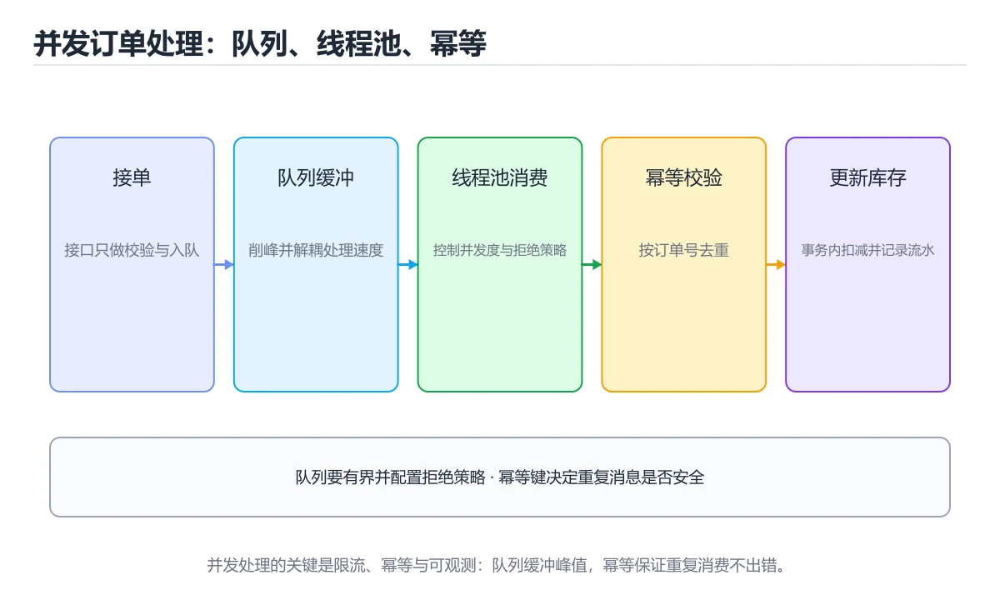
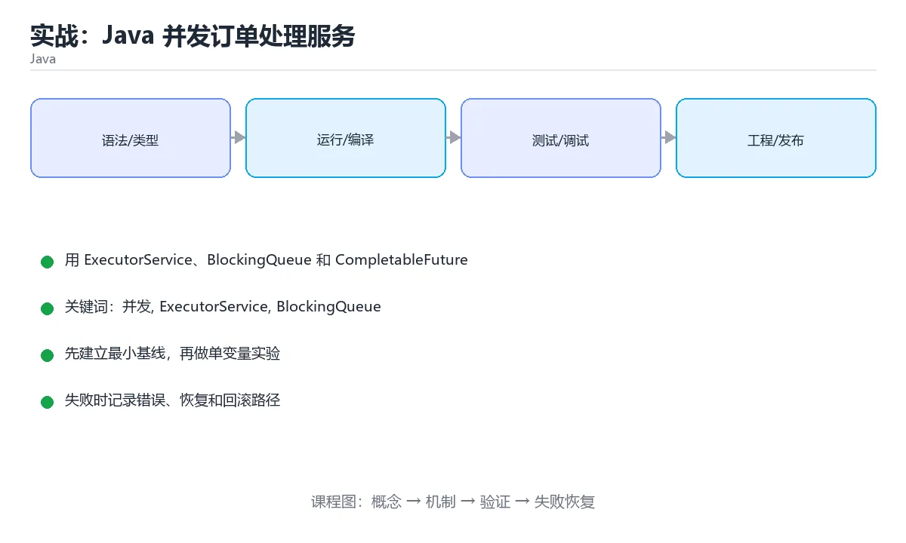

# 实战：Java 并发订单处理服务





> 内容更新时间：2026-10-06 · 学习阶段：高级 · 预计用时：60 分钟

## 本节知识框架

**课程定位**：所属分类 `java`（Java），课程主题 `实战：Java 并发订单处理服务`，学习阶段 高级，建议用时 70 分钟。

本课主线：用 ExecutorService、BlockingQueue 和 CompletableFuture 处理订单，覆盖限流、超时和重试。

**学完本课应当能够**
- 说清 `并发` 与 `ExecutorService` 的含义与区别，并各举一个正例和一个反例。
- 用本课示例验证 `超时` 的行为，记录输入、输出与失败条件。
- 遇到「共享可变状态不加同步」这类问题时，能说出触发条件与修复顺序。

### 从概念到验证的学习链条

1. `并发`：先掌握 多个任务在重叠时间窗口内推进，关注共享状态、同步与调度，再用它解释 `ExecutorService` 为什么会出现。
2. `ExecutorService`：先掌握 线程池接口：提交任务、批量执行并获取 Future；需按业务设置队列与拒绝策略，再用它解释 `超时` 为什么会出现。
3. `超时`：先掌握 本课涉及：并发、ExecutorService、BlockingQueue、CompletableFuture、超时，再用它解释 `指数退避` 为什么会出现。
4. `指数退避`：先掌握 重试间隔按 2 的幂增长并加随机抖动，避免下游故障时被重试打垮，再用它解释 `线程池` 为什么会出现。
5. `线程池`：先掌握 复用固定数量线程处理任务，避免频繁创建销毁，并需要定义队列和拒绝策略，再用它解释 本课示例的观察结果 为什么会出现。

**先修与衔接**：本课是「Java」分类的第 18 课。先修内容：《实战：Java 库存管理 REST 服务》。《实战：Java 库存管理 REST 服务》里的 `Spring Boot`、`事务` 是本课的前提。相关或后续课程：《现代 Java：Record、Sealed 与模式匹配》。

### 完成判据

- **定义关**：不看正文也能说明 `并发` 是 多个任务在重叠时间窗口内推进，关注共享状态、同步与调度，并指出一个反例。
- **机制关**：能按“输入 → 转换 → 输出 → 验证”复述 `实战：Java 并发订单处理服务`，而不是只背结论。
- **示例关**：能运行或推演 `实战：Java 并发订单处理服务` 的 `text` 示例，并说明一个真实出现的标识符或字面量。
- **证据关**：能从 `实战：Java 并发订单处理服务` 的示例写出一个输入、处理、输出三元组，并说明它支持或反驳了本课的哪一条结论。
- **排错关**：能复现 共享可变状态不加同步，记录现象并按 用不可变对象，或加锁与原子类型保护 修复。
- **迁移关**：能把 `并发`、`ExecutorService`、`BlockingQueue`、`CompletableFuture` 放进一个与 `实战：Java 并发订单处理服务` 不同的项目场景，并保持输入与验证条件可追踪。
- **复盘关**：学完 `实战：Java 并发订单处理服务` 后，用一句话写下仍然不确定的结论，并列出下一次验证需要的输入、环境和成功判据。

### 复习清单

- [ ] 能不看正文复述本课核心术语，并指出一个边界或反例。
- [ ] 能运行或推演本课示例，记录输入、输出与失败现象。
- [ ] 能完成一次自测，并把错题对照错误表定位原因。

## 核心概念定义

| 术语 | 操作性定义 | 常见边界与风险 |
| --- | --- | --- |
| 并发 | 多个任务在重叠时间窗口内推进，关注共享状态、同步与调度。 | 易错：并发下数据错乱；正确做法是用不可变对象，或加锁与原子类型保护。 |
| ExecutorService | 线程池接口：提交任务、批量执行并获取 Future；需按业务设置队列与拒绝策略。 | 共享状态与调度顺序会改变结论，单线程或串行测试通过不等于并发下成立。 |
| 超时 | 本课涉及：并发、ExecutorService、BlockingQueue、CompletableFuture、超时。 | 共享状态与调度顺序会改变结论，单线程或串行测试通过不等于并发下成立。 |
| 指数退避 | 重试间隔按 2 的幂增长并加随机抖动，避免下游故障时被重试打垮。 | 只在「重试间隔按 2 的幂增长并加随机抖动，避免下游故障时被重试打垮」这一前提下成立，换输入或换环境要重新验证。 |
| 线程池 | 复用固定数量线程处理任务，避免频繁创建销毁，并需要定义队列和拒绝策略 | 易错：任务堆积导致内存暴涨；正确做法是设置有界队列与拒绝策略。 |

## 原理与运行机制

### 机制总览

**教材衔接：技术栈**

- Java 21
- ExecutorService
- BlockingQueue
- CompletableFuture
- JUnit 5

**教材衔接：架构与数据流**

- 读路径要明确 并发 的查询条件、分页方式和返回字段，避免一次加载全部数据。
- 写路径要明确 并发 的事务边界、幂等键和失败补偿，不能留下半完成状态。
- 外部调用要设置超时、重试上限和降级策略。
- 每个关键阶段都要留下日志、指标或测试证据。

**教材衔接：功能范围**

- [ ] 批量提交订单任务
- [ ] 有界队列限制内存
- [ ] 超时后取消任务
- [ ] 汇总成功、失败和重试次数

**教材衔接：实施步骤**

### 步骤 1：定义任务和结果模型

- 输入与产出：先写清 并发 依赖的配置、数据和最终产物，再开始编码。
- 验证方法：用最小请求或单元测试证明 并发 这一步的结果正确。
- 失败处理：记录 并发 的错误类型、回滚动作和重试条件，避免把问题带到下一步。
- 证据留存：保留命令、输出、日志或截图，方便评审与复盘。

### 步骤 2：创建固定线程池与有界队列

- 定位：这一节说明步骤 2：创建固定线程池与有界队列在「实战：Java 并发订单处理服务」知识体系里的位置。
- 要点：本课涉及：并发、ExecutorService、BlockingQueue、CompletableFuture、超时。
- 自检：能否用一个最小例子解释步骤 2：创建固定线程池与有界队列？

### 步骤 3：封装带超时的支付查询

- 定位：这一节说明步骤 3：封装带超时的支付查询在「实战：Java 并发订单处理服务」知识体系里的位置。
- 要点：订单系统需要批量处理支付回调：每个订单调用外部支付查询，失败要重试，整体任务有超时，单个订单失败不能阻塞其他订单。
- 自检：能否用一个最小例子解释步骤 3：封装带超时的支付查询？

### 步骤 4：实现有限次数的指数退避重试

- 定位：这一节说明步骤 4：实现有限次数的指数退避重试在「实战：Java 并发订单处理服务」知识体系里的位置。
- 要点：一句话摘要：用 ExecutorService、BlockingQueue 和 CompletableFuture 处理订单，覆盖限流、超时和重试。
- 自检：能否用一个最小例子解释步骤 4：实现有限次数的指数退避重试？

### 步骤 5：汇总结果并关闭线程池

- 定位：这一节说明步骤 5：汇总结果并关闭线程池在「实战：Java 并发订单处理服务」知识体系里的位置。
- 要点：如果数据量或并发扩大 10 倍，最先出现的瓶颈在哪里？
- 自检：能否用一个最小例子解释步骤 5：汇总结果并关闭线程池？

### 步骤 6：用并发测试验证取消和异常路径

- 定位：这一节说明步骤 6：用并发测试验证取消和异常路径在「实战：Java 并发订单处理服务」知识体系里的位置。
- 要点：制造一次输入错误、依赖失败或超时，记录系统如何报错、如何恢复。
- 自检：能否用一个最小例子解释步骤 6：用并发测试验证取消和异常路径？

**教材衔接：建议目录结构**

**教材衔接：质量门禁**

- [ ] 格式化和静态检查通过，不遗留明显警告。
- [ ] 单元测试覆盖 并发 的核心规则，集成测试覆盖数据库或外部边界。
- [ ] 错误响应不泄露堆栈、SQL 和密钥。
- [ ] 配置来自环境变量或配置文件，不硬编码敏感信息。
- [ ] README 写清启动、测试、配置和回滚步骤。

**教材衔接：安全、成本与可观测性**

- 权限遵循最小授权：并发 用到的数据库账号、云资源和令牌都不能使用管理员默认权限。
- ExecutorService 的参数先校验再使用，错误响应里不出现堆栈或 SQL。
- 密钥通过环境变量或密钥管理服务注入，并记录轮换方式。
- ExecutorService 的并发度要有上限，并在达到上限时给出可解释的拒绝。
- 为 ExecutorService 建立四个指标：吞吐、错误率、尾延迟和资源占用。
- 把 ExecutorService 的日志与指标对齐到同一时间轴，便于事后复盘。

**教材衔接：扩展任务**

- 用虚拟线程改造 I/O 密集任务
- 接入指标输出吞吐和 P99
- 把任务持久化到数据库支持恢复

**教材衔接：实施记录与复盘**

每完成一步，记录以下内容：

1. 本步的输入、命令和输出是什么？
2. 遇到的最小失败是什么，如何定位和修复？
3. 哪个假设被验证或推翻？
4. 下一步的风险是什么，如何回滚？
5. 规模扩大 10 倍后，ExecutorService 会先成为瓶颈还是先暴露一致性风险？

**教材衔接：完成标准**

- [ ] 能从干净环境按 README 启动项目。
- [ ] 至少 3 条 并发 相关自动化测试通过，其中一条覆盖失败路径。
- [ ] 能演示一次错误、一次恢复和一次回滚。
- [ ] 有一份资源或性能基线，能说明瓶颈在哪里。
- [ ] 能说清一个尚未解决的问题和下一步验证方法。

**教材衔接：版本与时效**

- 先确认运行环境是 Java 21 还是 25，再决定 ExecutorService 能否使用新语法。
- 若 ExecutorService 依赖线程或 GC 行为，升级时要重点验证并发与停顿指标。
- 升级前确认 并发 的兼容范围，把不可回退的改动单独拆成一次提交。

### 升级检查清单

- 先固定当前版本，跑通全部示例与测验，再升级工具链。
- 只改 并发 的版本变量，记录编译、测试与产物体积的变化。
- 升级后重点回归 并发 的默认值、警告信息与错误格式。
- 升级完成后更新本课「最后复核 / 下次复核」日期，并记录 并发 的版本变化。

**教材衔接：交付评审：评分表、决策记录与证据链**


### 四、「实战：Java 并发订单处理服务」的验收指标

| 指标 | 目标值 | 测量方式 | 不达标时的动作 |
| --- | --- | --- | --- |
| 接入指标输出吞吐和 P99 | 用本课正文给出的阈值，没有就写实测基线 | 固定环境重复三次取中位数 | 回到对应小节定位，先修原因再重测 |
| | 延迟 | 记录 P50/P95/P99 | 用固定数据集逐步增加并发 | P99 持续上升或超时率增加 | | 用本课正文给出的阈值，没有就写实测基线 | 固定环境重复三次取中位数 | 回到对应小节定位，先修原因再重测 |
| | 存储 | 记录数据增长与索引大小 | 导入 10 倍数据并观察查询 | 磁盘、连接或锁等待成为瓶颈 | | 用本课正文给出的阈值，没有就写实测基线 | 固定环境重复三次取中位数 | 回到对应小节定位，先修原因再重测 |

### 五、评审记录模板

| 记录项 | 填写要求 |
| --- | --- |
| 项目标识 | `java_project_order_concurrency` |
| 本次范围 | 说明这一轮交付了「实战：Java 并发订单处理服务」的哪些部分 |
| 未完成项 | 列出与 并发 相关但本轮未做的内容 |
| 证据位置 | 指向 evidence/ 目录下的具体文件 |
| 风险与回滚 | 写清剩余风险、回滚步骤和验证方式 |
| 结论 | 通过 / 有条件通过 / 不通过，三者选一 |

### 机制拆解：每一步的输入、动作与输出

#### 1. `并发`
- 输入：`并发`；本步把 多个任务在重叠时间窗口内推进，关注共享状态、同步与调度 当作判断规则。
- 动作：围绕 `并发` 保留中间状态，并记录它与 `ExecutorService` 的对应关系。
- 输出：`ExecutorService`，它可以被下一段代码、测试或记录继续使用。
- `并发` 的失败条件：当共享可变状态不加同步时，会出现并发下数据错乱。

#### 2. `ExecutorService`
- 输入：`并发`；本步把 线程池接口：提交任务、批量执行并获取 Future；需按业务设置队列与拒绝策略 当作判断规则。
- 动作：围绕 `ExecutorService` 保留中间状态，并记录它与 `超时` 的对应关系。
- 输出：`超时`，它可以被下一段代码、测试或记录继续使用。
- `ExecutorService` 的失败条件：共享状态与调度顺序会改变结论，单线程或串行测试通过不等于并发下成立。

#### 3. `超时`
- 输入：`ExecutorService`；本步把 本课涉及：并发、ExecutorService、BlockingQueue、CompletableFuture、超时 当作判断规则。
- 动作：围绕 `超时` 保留中间状态，并记录它与 `指数退避` 的对应关系。
- 输出：`指数退避`，它可以被下一段代码、测试或记录继续使用。
- `超时` 的失败条件：共享状态与调度顺序会改变结论，单线程或串行测试通过不等于并发下成立。

#### 4. `指数退避`
- 输入：`超时`；本步把 重试间隔按 2 的幂增长并加随机抖动，避免下游故障时被重试打垮 当作判断规则。
- 动作：围绕 `指数退避` 保留中间状态，并记录它与 `线程池` 的对应关系。
- 输出：`线程池`，它可以被下一段代码、测试或记录继续使用。
- `指数退避` 的失败条件：只在「重试间隔按 2 的幂增长并加随机抖动，避免下游故障时被重试打垮」这一前提下成立，换输入或换环境要重新验证。

#### 5. `线程池`
- 输入：`指数退避`；本步把 复用固定数量线程处理任务，避免频繁创建销毁，并需要定义队列和拒绝策略 当作判断规则。
- 动作：围绕 `线程池` 保留中间状态，并记录它与 `本课示例的最终结果` 的对应关系。
- 输出：`本课示例的最终结果`，它可以被下一段代码、测试或记录继续使用。
- `线程池` 的失败条件：当线程池使用无界队列时，会出现任务堆积导致内存暴涨。

### 复现实验记录

- 环境：`实战：Java 并发订单处理服务` 使用 `text` 示例，固定 `并发`、`ExecutorService`、`BlockingQueue`、`CompletableFuture` 作为第一组条件。
- 首轮输入：从示例中的第一个输入开始，预测 `并发` 会怎样变化。
- 基线观察：记录命令、输入、输出和错误原文，不用截图代替可复制的文本。
- 单变量修改：只改变 `并发`，观察 `线程池` 是否仍满足定义。
- 失败注入：复现 共享可变状态不加同步，确认现象是 并发下数据错乱。
- 记录结论：把“修改前、修改后、预期变化、实际变化”写成四列表，这样复盘 `实战：Java 并发订单处理服务` 时才能区分概念错误与实现错误。

## 典型应用场景

**教材衔接：项目背景**

订单系统需要批量处理支付回调：每个订单调用外部支付查询，失败要重试，整体任务有超时，单个订单失败不能阻塞其他订单。

一句话摘要：用 ExecutorService、BlockingQueue 和 CompletableFuture 处理订单，覆盖限流、超时和重试。

**教材衔接：项目交付物**

### 建议仓库结构

```text
src/main/java/
src/main/resources/
src/test/java/
pom.xml
README.md
```


### 验收数据

```json
{
  "project": "java_project_order_concurrency",
  "scenario": "并发的正常路径",
  "input": {"case": "normal", "value": "ExecutorService"},
  "expected": {"ok": true, "checks": ["并发可复现", "ExecutorService有记录"]},
  "failure_case": {"case": "ExecutorService越界或缺失", "error": "validation_error"},
  "idempotency_key": "java_project_order_concurrency-001"
}
```

### 复盘模板

- **共享可变状态不加同步**：典型现象是并发下数据错乱；正确做法是用不可变对象，或加锁与原子类型保护。
- **线程池使用无界队列**：典型现象是任务堆积导致内存暴涨；正确做法是设置有界队列与拒绝策略。
- **忽略事务边界与幂等**：典型现象是重试产生重复订单；正确做法是用唯一键与幂等设计，并明确事务范围。

### 最小验证场景

- 准备：保留 `text` 示例的原始输入，先记录 `实战：Java 并发订单处理服务` 的基线输出和完整运行命令。
- 判定：新结果与 `实战：Java 并发订单处理服务` 的基线不同不等于错误；只有当差异破坏了 `并发` 的定义或错误表中的约束，才判定为失败。

### 选择与边界

- 使用 `并发` 时，先满足它的定义：多个任务在重叠时间窗口内推进，关注共享状态、同步与调度；易错：并发下数据错乱；正确做法是用不可变对象，或加锁与原子类型保护。
- 使用 `ExecutorService` 时，先满足它的定义：线程池接口：提交任务、批量执行并获取 Future；需按业务设置队列与拒绝策略；共享状态与调度顺序会改变结论，单线程或串行测试通过不等于并发下成立。
- 使用 `超时` 时，先满足它的定义：本课涉及：并发、ExecutorService、BlockingQueue、CompletableFuture、超时；共享状态与调度顺序会改变结论，单线程或串行测试通过不等于并发下成立。
- 使用 `指数退避` 时，先满足它的定义：重试间隔按 2 的幂增长并加随机抖动，避免下游故障时被重试打垮；只在「重试间隔按 2 的幂增长并加随机抖动，避免下游故障时被重试打垮」这一前提下成立，换输入或换环境要重新验证。
- 使用 `线程池` 时，先满足它的定义：复用固定数量线程处理任务，避免频繁创建销毁，并需要定义队列和拒绝策略；易错：任务堆积导致内存暴涨；正确做法是设置有界队列与拒绝策略。

## 代码/协议/SQL 示例

### 最小可验证示例

**教材衔接：示例数据与边界**

| 场景 | 输入 | 期望结果 | 检查点 |
| --- | --- | --- | --- |
| 正常路径 | 合法的最小数据集 | 成功返回并写入正确数据 | 状态码、数据库记录、日志 |
| 边界值 | 最大值、最小值或空集合 | 明确成功或给出可理解错误 | 不崩溃、不越界、不写半条数据 |
| 非法输入 | 类型错误、缺字段、超长内容 | 返回校验错误并指出字段 | 错误结构统一且不泄露内部信息 |
| 依赖失败 | 数据库不可用、超时、网络抖动 | 重试、降级或快速失败 | 可恢复、可观测、无重复副作用 |

**教材衔接：关键代码**

```java
ExecutorService pool = Executors.newFixedThreadPool(8);
CompletableFuture<Result> future = CompletableFuture
    .supplyAsync(() -> queryPayment(orderId), pool)
    .orTimeout(2, TimeUnit.SECONDS)
    .exceptionally(error -> Result.failed(orderId, error));
Result result = future.join();
```

**教材衔接：验证命令与预期输出**

**教材衔接：测试与验收**

- 慢任务超时后不会阻塞其他订单
- 队列满时返回明确拒绝而不是 OOM
- 线程池关闭后不再接受新任务


### 示例精读：先找证据，再改一个条件

- 在 `实战：Java 并发订单处理服务` 中与 `并发` 对照：示例必须能支持 多个任务在重叠时间窗口内推进，关注共享状态、同步与调度，否则说明这一段还缺少实现或验证步骤。
- 在 `实战：Java 并发订单处理服务` 中与 `ExecutorService` 对照：示例必须能支持 线程池接口：提交任务、批量执行并获取 Future；需按业务设置队列与拒绝策略，否则说明这一段还缺少实现或验证步骤。
- 在 `实战：Java 并发订单处理服务` 中与 `超时` 对照：示例必须能支持 本课涉及：并发、ExecutorService、BlockingQueue、CompletableFuture、超时，否则说明这一段还缺少实现或验证步骤。
- 在 `实战：Java 并发订单处理服务` 中与 `指数退避` 对照：示例必须能支持 重试间隔按 2 的幂增长并加随机抖动，避免下游故障时被重试打垮，否则说明这一段还缺少实现或验证步骤。
- `实战：Java 并发订单处理服务` 的示例没有抽取到函数调用或字面量；按行记录输入、控制流和输出，避免只背代码外形。

## 时间/空间复杂度或性能分析

**性能关注点（实战：Java 并发订单处理服务）**：JVM 预热与 GC 影响测量：记录吞吐、P99 延迟与堆占用，先跑预热再采样。

**本课特有开销（实战：Java 并发订单处理服务 · 并发）**：并发度提高后要观察是否出现拐点：延迟上升而吞吐不增，说明瓶颈已转移。

**测量方法**：以 `实战：Java 并发订单处理服务` 的 `并发` 场景为对象，固定输入跑一遍记录基线，再把规模或并发度提高一个数量级复测；两次结果的差值与波动范围才是结论依据。

### 需要控制的变量与记录项

- `实战：Java 并发订单处理服务` 的 `并发`：固定它的版本、输入范围和资源上限，分别记录速度、内存与失败率的变化。
- `实战：Java 并发订单处理服务` 的 `ExecutorService`：固定它的版本、输入范围和资源上限，分别记录速度、内存与失败率的变化。
- `实战：Java 并发订单处理服务` 的 `BlockingQueue`：固定它的版本、输入范围和资源上限，分别记录速度、内存与失败率的变化。
- `实战：Java 并发订单处理服务` 的 `CompletableFuture`：固定它的版本、输入范围和资源上限，分别记录速度、内存与失败率的变化。
- `实战：Java 并发订单处理服务` 的 `超时`：固定它的版本、输入范围和资源上限，分别记录速度、内存与失败率的变化。
- `实战：Java 并发订单处理服务` 中 `并发` 的边界：易错：并发下数据错乱；正确做法是用不可变对象，或加锁与原子类型保护。达到边界时不要外推，必须重新测量。
- `实战：Java 并发订单处理服务` 中 `ExecutorService` 的边界：共享状态与调度顺序会改变结论，单线程或串行测试通过不等于并发下成立。达到边界时不要外推，必须重新测量。
- `实战：Java 并发订单处理服务` 中 `超时` 的边界：共享状态与调度顺序会改变结论，单线程或串行测试通过不等于并发下成立。达到边界时不要外推，必须重新测量。
- `实战：Java 并发订单处理服务` 中 `指数退避` 的边界：只在「重试间隔按 2 的幂增长并加随机抖动，避免下游故障时被重试打垮」这一前提下成立，换输入或换环境要重新验证。达到边界时不要外推，必须重新测量。
- `实战：Java 并发订单处理服务` 中 `线程池` 的边界：易错：任务堆积导致内存暴涨；正确做法是设置有界队列与拒绝策略。达到边界时不要外推，必须重新测量。

## 常见误区与易错点

| 容易写错的做法 | 实际现象 | 原因与正确做法 |
| --- | --- | --- |
| 共享可变状态不加同步 | 并发下数据错乱。 | 用不可变对象，或加锁与原子类型保护。 |
| 线程池使用无界队列 | 任务堆积导致内存暴涨。 | 设置有界队列与拒绝策略。 |
| 忽略事务边界与幂等 | 重试产生重复订单。 | 用唯一键与幂等设计，并明确事务范围。 |

### 现场 1：共享可变状态不加同步

**症状**：并发下数据错乱。

**根因与修复**：用不可变对象，或加锁与原子类型保护。

**自检**：在本课示例里复现「共享可变状态不加同步」，改成用不可变对象，或加锁与原子类型保护后重跑；如果症状消失且失败路径按预期变化，说明定位正确。

### 现场 2：线程池使用无界队列

**症状**：任务堆积导致内存暴涨。

**根因与修复**：设置有界队列与拒绝策略。

**自检**：在本课示例里复现「线程池使用无界队列」，改成设置有界队列与拒绝策略后重跑；如果症状消失且失败路径按预期变化，说明定位正确。

### 现场 3：忽略事务边界与幂等

**症状**：重试产生重复订单。

**根因与修复**：用唯一键与幂等设计，并明确事务范围。

**自检**：在本课示例里复现「忽略事务边界与幂等」，改成用唯一键与幂等设计，并明确事务范围后重跑；如果症状消失且失败路径按预期变化，说明定位正确。

## 与其他知识点的关系

**教材衔接：复习与迁移**

### 概念复述

- 用一句话说明「实战：Java 并发订单处理服务」解决什么问题：用 ExecutorService、BlockingQueue 和 CompletableFuture 处理订单，覆盖限流、超时和重试。
- 写出并发、ExecutorService、BlockingQueue之间的关系，并各举一个例子。
- 说出本课最容易混淆的两个概念，以及区分它们的判据。

### 正文逐节复核

- **项目背景**：订单系统需要批量处理支付回调：每个订单调用外部支付查询，失败要重试，整体任务有超时，单个订单失败不能阻塞其他订单。
- **项目专属规格：实战：Java 并发订单处理服务**：用 ExecutorService、BlockingQueue 和 CompletableFuture 处理订单，覆盖限流、超时和重试。


### 迁移练习

1. 换输入：用并发处理一组你自己的数据，对比教材示例的结果差异。
2. 换失败条件：制造一个ExecutorService相关的错误，说明如何从错误信息定位根因。
3. 换规模：把数据量或并发度提高一个数量级，说明「实战：Java 并发订单处理服务」的结论是否仍成立。

- **先修**：`实战：Java 库存管理 REST 服务`。本课默认这些内容已经掌握。
- **相关或后续**：`现代 Java：Record、Sealed 与模式匹配`。本课术语会在这些课程里继续使用。
- **术语归属**：`并发`、`ExecutorService`、`超时` 的定义以本课「核心概念定义」为准，换到其他课程时先确认定义是否被改写。

### 先修与后续术语接口

- `实战：Java 库存管理 REST 服务`：两者通过本分类的学习顺序衔接，阅读时重点比较各自的输入与失败条件。
- `现代 Java：Record、Sealed 与模式匹配`：两者通过本分类的学习顺序衔接，阅读时重点比较各自的输入与失败条件。

### 容易混淆的相邻概念

- `并发` 与 `ExecutorService`：前者强调 多个任务在重叠时间窗口内推进，关注共享状态、同步与调度；后者强调 线程池接口：提交任务、批量执行并获取 Future；需按业务设置队列与拒绝策略。判断时分别检查两条定义的适用范围，不要只看名称相似就互换。
- `ExecutorService` 与 `超时`：前者强调 线程池接口：提交任务、批量执行并获取 Future；需按业务设置队列与拒绝策略；后者强调 本课涉及：并发、ExecutorService、BlockingQueue、CompletableFuture、超时。判断时分别检查两条定义的适用范围，不要只看名称相似就互换。
- `超时` 与 `指数退避`：前者强调 本课涉及：并发、ExecutorService、BlockingQueue、CompletableFuture、超时；后者强调 重试间隔按 2 的幂增长并加随机抖动，避免下游故障时被重试打垮。判断时分别检查两条定义的适用范围，不要只看名称相似就互换。
- `指数退避` 与 `线程池`：前者强调 重试间隔按 2 的幂增长并加随机抖动，避免下游故障时被重试打垮；后者强调 复用固定数量线程处理任务，避免频繁创建销毁，并需要定义队列和拒绝策略。判断时分别检查两条定义的适用范围，不要只看名称相似就互换。

## 自测题与参考答案

> 先独立作答，再对照参考答案；答案都能在本课正文、术语表或错误表里找到依据。

### 自测 1（概念复述）

不看正文，写出 `并发` 的操作性定义，并说明它与 `ExecutorService` 的区别。

**参考答案**：多个任务在重叠时间窗口内推进，关注共享状态、同步与调度。

`ExecutorService` 的定位是：线程池接口：提交任务、批量执行并获取 Future；需按业务设置队列与拒绝策略；两者的差别要从适用对象与失败模式上说明。

### 自测 2（排错）

本课错误表记录了「共享可变状态不加同步」这类做法。请写出它会出现的现象、根因，以及修复顺序。

**参考答案**：现象是并发下数据错乱；正确做法是用不可变对象，或加锁与原子类型保护。修复时先复现现象并保留证据，再改动一处假设重跑，确认现象消失。

### 自测 3（动手验证）

运行本课的 `text` 示例，改动其中一个输入后重新运行，记录输出与错误信息。

**参考答案**：正常输入下 `text` 示例应当复现正文给出的结果；改动输入后，如果结果改变或报错，先核对它是否满足 `实战：Java 并发订单处理服务` 中`并发` 的适用范围，再检查错误表里是否有同类现象。

### 自测 4（代码阅读）

阅读本课开头的 `text` 示例，说明它体现了`并发` 的哪一条性质，并指出改动哪个输入会让这条性质不再成立。

**参考答案**：`并发` 的定义是 多个任务在重叠时间窗口内推进，关注共享状态、同步与调度，示例正是在实现这条定义。改动与 `并发` 有关的一个输入后，如果结果不再符合 `实战：Java 并发订单处理服务` 的正文描述，就说明该性质只在当前前提成立。

### 自测 5（迁移）

把 `实战：Java 并发订单处理服务` 的方法迁移到自己的项目：围绕 `并发` 写出一个与错误表同类的风险点，并说明触发条件和检验方式。

**参考答案**：例如「忽略事务边界与幂等」，它会导致重试产生重复订单；检验方式是按用唯一键与幂等设计，并明确事务范围改一处再复现，确认现象消失且没有引入新的失败分支。

### 自测 6（对比）

用一个表格对比 `并发` 与 `ExecutorService`：各写一行适用场景、一行失败表现。

**参考答案**：`并发` 的定义是多个任务在重叠时间窗口内推进，关注共享状态、同步与调度；`ExecutorService` 的定义是线程池接口：提交任务、批量执行并获取 Future；需按业务设置队列与拒绝策略。两者的失败表现分别对应本课错误表里与本术语相关的行。

### 自测 7（排错顺序）

面对「共享可变状态不加同步」引发的问题，请把“复现 并发下数据错乱 → 保留证据 → 用不可变对象，或加锁与原子类型保护 → 回归验证”四步写成可执行的检查清单。

**参考答案**：第一步按并发下数据错乱复现；第二步记录输入、版本与完整报错；第三步按用不可变对象，或加锁与原子类型保护只改一处；第四步重跑并确认失败路径也按预期变化。

### 自测 8（边界判断）

针对 `线程池`，分别写出“可以使用”的条件和“结论不再成立”的条件。

**参考答案**：易错：任务堆积导致内存暴涨；正确做法是设置有界队列与拒绝策略。 同时要把 `线程池` 的定义 复用固定数量线程处理任务，避免频繁创建销毁，并需要定义队列和拒绝策略 与实际输入逐项对照。

### 自测 9（机制重建）

不看正文，按输入、转换、输出、验证四段重建 `并发` → `ExecutorService` → `超时` → `指数退避` 的作用链。

**参考答案**：起点是 `并发` 的定义 多个任务在重叠时间窗口内推进，关注共享状态、同步与调度；中间每一步都保留可观察状态；终点由 `线程池` 检查，失败时回到错误表定位第一个偏离定义的步骤。

### 自测 10（综合排错）

在 `实战：Java 并发订单处理服务` 中，现象是 重试产生重复订单。请围绕 忽略事务边界与幂等 写出最小复现、关键证据、修复动作和回归验证，并说明为什么不能只凭一次运行下结论。

**参考答案**：先复现 忽略事务边界与幂等，记录输入与完整错误；再按 用唯一键与幂等设计，并明确事务范围 只改一处。回归时同时跑正常路径和边界路径，只有两次结果都可解释，才把修复视为完成。

### 自测 11（一分钟复述）

用每分钟约 200 字的速度复述 `实战：Java 并发订单处理服务`：先给主问题，再按顺序说出 `并发`、`ExecutorService`、`超时`、`指数退避`，最后给一个失败案例。

**自评标准**：主问题必须对应 用 ExecutorService、BlockingQueue 和 CompletableFuture 处理订单，覆盖限流、超时和重试；每个术语都要能接上一句定义或边界；失败案例必须写成可观察现象，不能用“可能有风险”代替证据。

## 术语速查

| 术语 | 一句话说明 |
| --- | --- |
| `并发` | 多个任务在重叠时间窗口内推进，关注共享状态、同步与调度。 |
| `ExecutorService` | 线程池接口：提交任务、批量执行并获取 Future；需按业务设置队列与拒绝策略。 |
| `超时` | 本课涉及：并发、ExecutorService、BlockingQueue、CompletableFuture、超时。 |
| `指数退避` | 重试间隔按 2 的幂增长并加随机抖动，避免下游故障时被重试打垮。 |
| `线程池` | 复用固定数量线程处理任务，避免频繁创建销毁，并需要定义队列和拒绝策略。 |

**术语关系**：`并发`（多个任务在重叠时间窗口内推进） → `ExecutorService`（线程池接口：提交任务、批量执行并获取 Future） → `超时`（本课涉及：并发、ExecutorService、BlockingQueue、CompletableFuture、超时） → `指数退避`（重试间隔按 2 的幂增长并加随机抖动）。

## 考点精讲

`实战：Java 并发订单处理服务` 的题库有 6 道题，下面逐题给出题干、正确项与判断依据：先自己作答，再核对正确项，最后回到正文对应小节复核。

### 考点 1：第 1 题

- **题目**：无界队列的主要风险是什么？
- **正确项**：内存持续增长
- **判断依据**：这道题检验本课主问题：用 ExecutorService、BlockingQueue 和 CompletableFuture 处理订单，覆盖限流、超时和重试。复习时先复述本课主问题，再举一个会让结论失效的输入。

### 考点 2：第 2 题

- **题目**：围绕“实战：Java 并发订单处理服务”中的 并发、ExecutorService、BlockingQueue，下列哪两项是本课强调的实践判断？
- **正确项**：验证 ExecutorService 时要固定版本并覆盖边界输入，结论才可复现；学习 并发 时要同时说明输入、输出和失败路径，不能只看正常流程
- **判断依据**：这道题落在术语 `并发` 上：多个任务在重叠时间窗口内推进，关注共享状态、同步与调度。复习时把 `并发` 的定义、适用边界和一个反例一起说清楚，再回到「核心概念定义」核对原文。

### 考点 3：第 3 题

- **题目**：重试为什么需要退避？
- **正确项**：避免故障时放大流量
- **判断依据**：这道题检验本课主问题：用 ExecutorService、BlockingQueue 和 CompletableFuture 处理订单，覆盖限流、超时和重试。复习时先复述本课主问题，再举一个会让结论失效的输入。

### 考点 4：第 4 题

- **题目**：线程池关闭前应该做什么？
- **正确项**：停止接收新任务并等待已提交任务
- **判断依据**：这道题落在术语 `线程池` 上：复用固定数量线程处理任务，避免频繁创建销毁，并需要定义队列和拒绝策略。复习时把 `线程池` 的定义、适用边界和一个反例一起说清楚，再回到「核心概念定义」核对原文。

### 考点 5：第 5 题

- **题目**：下面代码在支付查询超过 2 秒时会发生什么？
- **正确项**：future 以超时异常完成并进入 exceptionally 分支
- **判断依据**：这道题落在术语 `超时` 上：本课涉及：并发、ExecutorService、BlockingQueue、CompletableFuture、超时。复习时把 `超时` 的定义、适用边界和一个反例一起说清楚，再回到「核心概念定义」核对原文。

### 考点 6：第 6 题

- **题目**：下面几项都与 `并发` 有关，请按 `实战：Java 并发订单处理服务` 的正文顺序排列；该课主线是用 ExecutorService、BlockingQueue 和 CompletableFuture 处理订单，覆盖限流、超时和重试。
- **正确项**：项目背景 → 技术栈 → 架构与数据流 → 功能范围
- **判断依据**：这道题落在术语 `并发` 上：多个任务在重叠时间窗口内推进，关注共享状态、同步与调度。复习时把 `并发` 的定义、适用边界和一个反例一起说清楚，再回到「核心概念定义」核对原文。

### 考点 7：`并发`

- **要点**：多个任务在重叠时间窗口内推进，关注共享状态、同步与调度。
- **并发 的边界**：易错：并发下数据错乱；正确做法是用不可变对象，或加锁与原子类型保护。

### 考点 8：`ExecutorService`

- **要点**：线程池接口：提交任务、批量执行并获取 Future；需按业务设置队列与拒绝策略。
- **ExecutorService 的边界**：共享状态与调度顺序会改变结论，单线程或串行测试通过不等于并发下成立。

### 考点 9：`超时`

- **要点**：本课涉及：并发、ExecutorService、BlockingQueue、CompletableFuture、超时。
- **超时 的边界**：共享状态与调度顺序会改变结论，单线程或串行测试通过不等于并发下成立。

### 考点 10：`指数退避`

- **要点**：重试间隔按 2 的幂增长并加随机抖动，避免下游故障时被重试打垮。
- **指数退避 的边界**：只在「重试间隔按 2 的幂增长并加随机抖动，避免下游故障时被重试打垮」这一前提下成立，换输入或换环境要重新验证。

### 考点 11：`线程池`

- **要点**：复用固定数量线程处理任务，避免频繁创建销毁，并需要定义队列和拒绝策略
- **线程池 的边界**：易错：任务堆积导致内存暴涨；正确做法是设置有界队列与拒绝策略。

### 考点 12：排错——共享可变状态不加同步

- **现象**：并发下数据错乱。
- **处理**：用不可变对象，或加锁与原子类型保护。

### 考点 13：排错——线程池使用无界队列

- **现象**：任务堆积导致内存暴涨。
- **处理**：设置有界队列与拒绝策略。

### 考点 14：综合辨析——`并发` 与 `线程池`

- **辨析点**：`并发` 的定义是 多个任务在重叠时间窗口内推进，关注共享状态、同步与调度；`线程池` 的定义是 复用固定数量线程处理任务，避免频繁创建销毁，并需要定义队列和拒绝策略。
- **答题要求**：面对 `实战：Java 并发订单处理服务` 的题目，先判断描述的是 `并发` 还是 `线程池`，再归到对应定义，最后写出一个会让该定义失效的边界输入。

### 考点 15：排错评分点

- **现象分**：能写出 并发下数据错乱，而不是只写“程序有错”。
- **证据分**：保留触发 共享可变状态不加同步 的输入、版本和错误原文。
- **修复分**：按 用不可变对象，或加锁与原子类型保护 只改一处，并同时回归正常路径与边界路径。

## 内容元数据

- 内容版本：v2.0
- 最后更新：2026-10-06
- 学习阶段：高级
- 适用环境：Java 21+ / Maven 或 Gradle；本课聚焦 并发。
- 内容来源：内置结构化课程与工程实践整理
- 相关主题：并发、ExecutorService、BlockingQueue、CompletableFuture、超时
- 质量版本：P0 测验标准 + P1 覆盖扩展 + P2 体验补全

## 参考资料与复核

- 最后复核：2026-10-04
- 下次复核：2027-02-24
- 复核范围：版本兼容、API 行为、安全建议与工程实践
- 来源性质：官方文档、标准或权威教材；本课核对关键词：并发、ExecutorService、BlockingQueue、CompletableFuture、超时。

| 参考资料 | 本课用途 |
| --- | --- |
| [Java 并发教程](https://docs.oracle.com/javase/tutorial/essential/concurrency/) | 线程、同步与并发工具 |
| [Java GC 调优](https://docs.oracle.com/en/java/javase/21/gctuning/) | 垃圾回收与性能调优 |
| [Java SE API](https://docs.oracle.com/en/java/javase/21/docs/api/) | 标准库 API |

| [本课术语索引：实战：Java 并发订单处理服务](#核心概念定义) | 按本课输入、术语边界和错误表现逐项核对 |
> 「实战：Java 并发订单处理服务」的链接用于离线阅读后的延伸核对；App 不会自动联网。