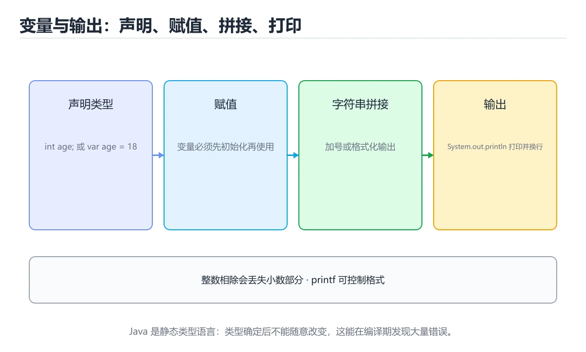
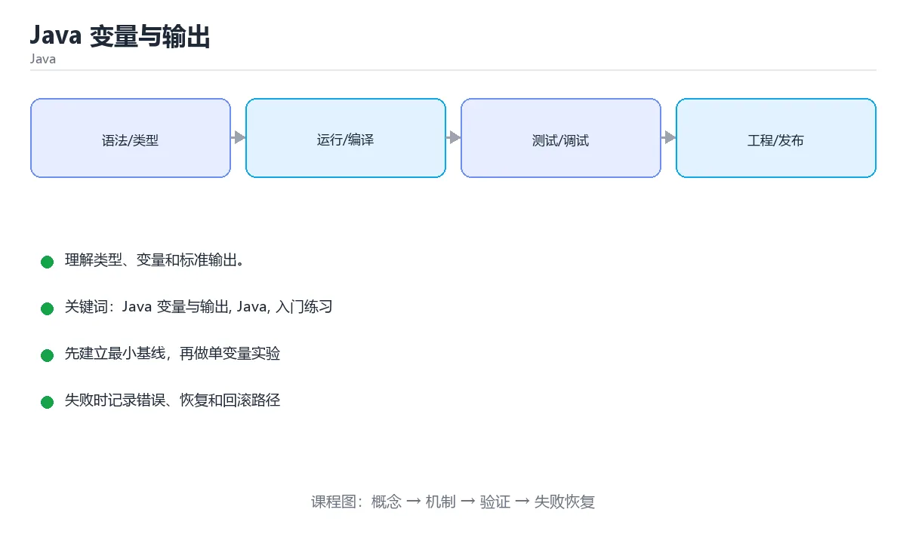

# Java 变量与输出

> 内容更新时间：2026-10-06 · 学习阶段：入门 · 预计用时：30 分钟





## 学习目标

- 先认识Java 变量与输出需要的工具、输入和输出。
- 按步骤运行最小示例，并记录结果与错误。
- 用一个边界输入验证自己是否真正掌握。

## 前置知识

- 会进行基本的文件或命令行操作。
- 不需要预先掌握「Java」的高级知识。

## 一句话入门

理解类型、变量和标准输出。

## 最小示例

```java
public class Main {
    public static void main(String[] args) {
        String name = "Ada";
        int year = 1815;
        System.out.printf("%s born in %d%n", name, year);
    }
}
```

## 预期输出

```text
Ada born in 1815
```

## 常见错误与排查

> 说明：本表由《Java 变量与输出》的核心知识整理（2026-10-07），人工复核进度见 docs/content_review_batches.md。

| 易错点 | 容易踩的做法 | 正确结论 |
| --- | --- | --- |
| 整数除法丢小数 | 结果与预期不符 | 需要小数时先转成浮点或高精度类型 |
| 用等号比较包装类型 | 超出缓存范围后结果不一致 | 用 equals 比较，或先拆箱再比较 |
| 字符串拼接与运算顺序混淆 | 得到拼接结果而不是计算结果 | 用括号明确运算顺序 |

## 动手练习

1. 原样运行最小示例，保存命令和输出。
2. 把数字 2 改成 10，预测并验证新结果。
3. 制造一个错误输入，写出错误信息和修复方法。

## 本课小结

- 入门阶段先保证能运行、能观察、能解释，再追求复杂功能。
- 每次只改一个变量，记录预测与实际结果。
- 遇到错误先看第一条错误信息，再回到最小示例。

## 代码实验：把示例跑成证据

### 实验一：建立基线

```java
public class Main {
    public static void main(String[] args) {
        String name = "Ada";
        int year = 1815;
        System.out.printf("%s born in %d%n", name, year);
    }
}
```

### 实验二：只改一个输入

沿用「Java 变量与输出」的最小示例做一次单变量实验：

| 实验 | 改动 | 预测 | 实际 | 结论 |
| --- | --- | --- | --- | --- |
| 基线 | 保持「Java 变量与输出」示例原样 |  |  |  |
| 边界 | 把Java 变量与输出换成空值或极值 |  |  |  |
| 失败 | 给Java传入非法输入 |  |  |  |

做完后用一句话写出「Java 变量与输出」的结论：输入怎么变，结果才怎么变。

### 实验三：制造一个可控错误

给 Java 一个非法输入，说明它属于哪一类失败并给出修复方向。

| 实验 | 改动 | 预测 | 实际 | 结论 |
| --- | --- | --- | --- | --- |
| 基线 | 保持原样 |  |  |  |
| 边界 |  |  |  |  |
| 失败 |  |  |  |  |

### 实验四：用三句话复述

1. 在「Java 变量与输出」里，System 接受哪些输入，非法输入应该在哪里被挡住？
2. Java 变量与输出 按什么顺序处理输入，在哪一步产生了状态变化或副作用？
3. 输出如何验证，失败时第一条可观察证据是什么？

## Java 基础机制速览

### JDK、JVM 与字节码

Java 源码编译成平台无关的字节码，JVM 负责加载、验证、解释和即时编译。JDK 包含编译器和工具，JRE 只包含运行环境。类加载器按委托模型加载类，`main` 方法是程序入口。理解编译期与运行期的区别，能定位“编译通过但运行时找不到类”和“类型擦除导致的行为差异”。

### 类、对象与静态成员

类是对象的模板，对象保存实例字段，方法定义行为。`static` 成员属于类而不是实例，静态方法不能直接访问实例字段。构造器初始化对象，`this` 指向当前实例，`super` 调用父类成员。封装通过访问修饰符实现，继承表达“是一个”，组合表达“有一个”；优先使用组合降低耦合。`equals`、`hashCode` 和 `toString` 要根据值语义一致地重写。

### 类型、装箱与字符串

Java 有基本类型和引用类型，泛型不能直接使用基本类型，需要装箱成包装类。自动装箱方便但会增加对象分配，比较包装类应使用 `equals` 而不是 `==`。字符串不可变，拼接会产生新对象，循环中应使用 `StringBuilder`。`final` 表示引用不可重新赋值，不代表对象内容不可变。

### 集合、泛型与函数式接口

`List`、`Set`、`Map` 是集合接口，`ArrayList`、`HashSet`、`HashMap` 是常见实现。泛型在编译期提供类型检查，运行时发生类型擦除，因此不能创建泛型数组，也不能依赖运行时泛型信息。Stream 提供声明式的筛选、映射和聚合，但要注意惰性、短路和并行流的线程安全。Lambda 和函数式接口让行为可以作为参数传递。

### 异常、资源与并发

受检异常必须在签名中声明或捕获，非受检异常通常表示编程错误。`try-with-resources` 自动关闭实现 AutoCloseable 的资源。线程共享堆内存，必须使用同步、锁、原子类或并发集合保护共享状态；线程池避免频繁创建线程，但要合理设置队列、拒绝策略和超时。虚拟线程降低了高并发 I/O 的线程成本，但不会自动消除数据竞争。

## 复习与自测

「Java 变量与输出」的测验以定义与步骤判断为主。请把每个错误选项改写成一句反例，
说明它在哪个输入、边界或前提变化下会失败。

### 完成标准

- [ ] 能用具体输入复现 Java 变量与输出 的最小示例，并逐行解释输入、处理与输出。
- [ ] 能说明 Java 在哪一个取值上开始失效。
- [ ] 能复现 Java 的异常并说明恢复步骤。
- [ ] 能说出 System 的两个常见误用，并各配一个检查方法。

### 复盘记录

| 项目 | 记录 |
| --- | --- |
| 学到的核心机制 |  |
| 仍然不确定的问题 |  |
| 下一步验证动作 |  |
下面按正文顺序回顾「Java 变量与输出」的每一节；说不清的地方回到 代码实验：把示例跑成证据 补课。

### 最小示例

```java
public class Main {
    public static void main(String[] args) {
        String name = "Ada";
        int year = 1815;
        System.out.printf("%s born in %d%n", name, year);
    }
}
```

自检：这一节与相邻主题的边界在哪里？

### 预期输出

```text
Ada born in 1815
```

### 动手练习

自检：如果去掉这一节里的一个前提，结论会怎样变化？

## 可运行练习

本节围绕Java 变量与输出安排 3 个可交付任务，每个任务都要求留下可以复查的记录。

### 任务 1：用自己的话画出结构

不看书，用一张图说清「Java 变量与输出」的结构，画完再对照骨架：

- 主干：System 的输入 → 处理 → 输出 → 失败路径
- 连接线：在每条边上标出输入、输出与失败路径。
- 自检：能否用一句话说明Java 变量与输出与Java的关系？

### 任务 2：做一次对比实验

**验收标准**：对照表两列都要有证据（命令、输出或数据），并注明Java 变量与输出与Java哪一个才是决定性变量。

### 任务 3：迁移到自己的场景

**验收标准**：至少给出一个命令或数据样例，让读者能独立复现 Java 的结论。

## 故障现场

### 现场 1：整数除法丢小数

**症状**：在《Java 变量与输出》的复现场景中，结果与预期不符。

**根因**：当出现“整数除法丢小数”时，执行路径已经绕过了《Java 变量与输出》的关键约束，最终以“结果与预期不符”暴露出来；修复前必须先确认约束在哪里失效。

**修复**：针对《Java 变量与输出》的问题，需要小数时先转成浮点或高精度类型。

**验证**：先在《Java 变量与输出》中记录“整数除法丢小数”留下的失败证据，再执行“需要小数时先转成浮点或高精度类型”并重放；确认错误路径变为明确结果，且修复没有掩盖同类故障。

### 现场 2：用等号比较包装类型

**症状**：在《Java 变量与输出》的复现场景中，超出缓存范围后结果不一致。

**根因**：当出现“用等号比较包装类型”时，执行路径已经绕过了《Java 变量与输出》的关键约束，最终以“超出缓存范围后结果不一致”暴露出来；修复前必须先确认约束在哪里失效。

**修复**：针对《Java 变量与输出》的问题，用 equals 比较，或先拆箱再比较。

**验证**：先在《Java 变量与输出》中记录“用等号比较包装类型”留下的失败证据，再执行“用 equals 比较，或先拆箱再比较”并重放；确认错误路径变为明确结果，且修复没有掩盖同类故障。

### 现场 3：字符串拼接与运算顺序混淆

**症状**：在《Java 变量与输出》的复现场景中，得到拼接结果而不是计算结果。

**根因**：触发点是把“字符串拼接与运算顺序混淆”当成安全做法。它没有满足《Java 变量与输出》要求的前提，因此先表现为“得到拼接结果而不是计算结果”；排查时先完整复现这一段，再核对输入、配置与依赖。

**修复**：针对《Java 变量与输出》的问题，用括号明确运算顺序。

**验证**：在《Java 变量与输出》中按“用括号明确运算顺序”调整后，从“字符串拼接与运算顺序混淆”的触发条件重放同一条路径，确认“得到拼接结果而不是计算结果”不再出现，并补一个相邻边界用例检查没有引入新问题。

## 版本与时效

- 先确认运行环境是 Java 21 还是 25，再决定 System 能否使用新语法。
- 若 System 依赖线程或 GC 行为，升级时要重点验证并发与停顿指标。
- 升级「Java 变量与输出」涉及的依赖前，先用 System 复现当前行为，再逐项核对版本说明与破坏性变更。

### 升级检查清单

- 先固定当前版本，跑通全部示例与测验，再升级工具链。
- 升级时只动一个依赖版本，用 System 记录构建与运行结果。
- 回归范围锁定 System 的默认行为，并确认弃用警告是否出现在构建输出里。
- 升级完成后记录 Java 变量与输出 的新旧版本差异，并据此调整下次复核时间。

## 本课复习清单

离开本课前，逐项确认：

- [ ] 不看解析，能说出「Java 中 String 与 int 这两种类型的关键差别是？」的判断依据。
- [ ] 不看解析，能说出「关于变量声明 String name = "Ada"; 下列说法正确的是？」的判断依据。
- [ ] 不看解析，能说出「下面代码想计算 5 除以 2 的小数结果，但输出为 2。问题在哪里？」的判断依据。
- [ ] 至少运行一次 System 的示例，记录输入、输出和 Java 变量与输出 的边界情况。
- [ ] 把本课最容易混淆的两个概念写成一句话对照。

| 复盘项 | 记录 |
| --- | --- |
| 已经能独立解释的考点 |  |
| 仍然说不清的概念 |  |
| 下一步验证动作 |  |

## 术语速查

把「Java 变量与输出」里反复出现的术语集中放在一起。复习时先遮住右列，尝试用自己的话解释，再回到正文核对。

| 术语 | 一句话说明 |
| --- | --- |
| `基本类型` | int、double、boolean、char 等直接存值的类型，共八种。 |
| `变量声明与初始化` | 先声明类型和名字，再赋初值，局部变量使用前必须赋值。 |
| `String` | 不可变的字符串类型，属于引用类型，用 + 可以拼接。 |
| `类型转换` | 小范围到大范围自动提升，反向需要显式强制转换。 |
| `格式化输出` | printf 或 String.format 用 %d、%s 控制输出格式。 |

## 零基础精讲：把Java 变量与输出真正讲透

### 先建立一个直觉

本课的摘要可以当作一张地图：理解类型、变量和标准输出。

### 逐步拆解

1. 澄清输入与目标。先写清「Java 变量与输出」要解决的问题、合法输入范围和成功标准，再进入后续步骤。
2. 描述处理过程。把「Java 变量与输出、Java、入门练习」映射到具体步骤，每步都要求能单独验证。
3. 定义输出。Java 变量与输出 的输出不仅包括正常结果，还包括错误码、日志和资源释放状态。
4. 构造一次Java 变量与输出越界，记录系统是拒绝、降级还是静默出错；三者对应的修复策略完全不同。
5. 把「代码实验：把示例跑成证据」里的最小示例抄成 System 一行的输入，先手算结果再执行，确认两者一致。

### 把正文串成一条执行链

- **实验一：建立基线**：先原样运行 System 所在的示例，记录版本、命令、完整输出与退出状态。
- **实验三：制造一个可控错误**：在「Java 变量与输出」里，「实验三：制造一个可控错误」这一步要先写清输入与预期，再记录实际结果和差异；结果不符时回到对应小节核对前提。
- **JDK、JVM 与字节码**：在「Java 变量与输出」里，「JDK、JVM 与字节码」这一步要先写清输入与预期，再记录实际结果和差异；结果不符时回到对应小节核对前提。
- **类、对象与静态成员**：类是对象的模板，对象保存实例字段，方法定义行为

### 从测验反推易错点

**检查点 1：Java 中 String 与 int 这两种类型的关键差别是？**

- 参考判断：String 是引用类型，int 是基本类型，默认值和比较方式不同
- 自问：如果去掉题干里的一个限定词，结论还成立吗？

- 参考判断：%s 输出字符串，%d 输出十进制整数，顺序与参数一致

**检查点 3：关于变量声明 String name = "Ada"; 下列说法正确的是？**

- 参考判断：声明引用变量 name，并让它指向字符串字面量 Ada

**检查点 4：下面代码想计算 5 除以 2 的小数结果，但输出为 2。问题在哪里？**

- 参考判断：两个操作数都是 int，应按 double 计算

### 工程排错顺序

| 先查什么 | 要得到的证据 | 判断标准 |
| --- | --- | --- |
| 输入与前提是否满足 | 日志、输入样例、测试或指标 | 能复现并解释，才算定位 |
| 核心步骤是否产生了预期中间结果 | 日志、输入样例、测试或指标 | 能复现并解释，才算定位 |
| 失败路径是否可观测、可恢复 | 日志、输入样例、测试或指标 | 能复现并解释，才算定位 |
| 资源、权限与成本是否在预算内 | 日志、输入样例、测试或指标 | 能复现并解释，才算定位 |

### 变式训练

1. 把 Java 变量与输出 的实现压缩到一个进程内，去掉所有外部依赖后再谈扩展。
2. 扩大 Java 的规模，记录本课结论在哪一个量级开始不成立。
3. 让 System 的外部依赖超时，确认系统能回滚或补偿，而不是留下脏数据。
5. 把 Java 变量与输出 的一个前提改成不成立，说明本课哪条结论先失效。
6. 限制 CPU 与内存上限后重跑 System，观察哪一项参数需要重新设定。

### 本课自测

- [ ] 能用一句话解释Java 变量与输出在本课中的角色与边界。
- [ ] 能举出一个正常例子和一个失败例子。
- [ ] 能说出最小验证步骤，以及需要记录的证据。
- [ ] 能用一句话解释「Java」在本课中的角色与边界。
- [ ] 能说出 Java 与相邻概念的边界。

### 迁移案例库

下面用不同约束重复同一套方法，每轮只改变 Java 变量与输出 的一个取值并记录结论。

#### 迁移案例 1：围绕Java 变量与输出做一次小实验

**目标**：在不改变课程主体的前提下，验证Java 变量与输出中的一个关键判断。

**步骤**：
1. 复述当前方案对本课的假设，写成一句可证伪的话。
2. 设计一个正常输入和一个边界输入，分别预测输出。
3. 运行或逐步演算，记录实际输出、耗时和失败信息。
4. 只调整一个参数，比较前后差异并解释原因。
5. 补充一条测试或复习卡，确保下次能更快复现。

**验收**：结论要能追溯到正文的具体小节与代码位置，并记录Java相关的指标变化。

#### 迁移案例 2：围绕「Java」做一次小实验

**步骤**：
1. 复述当前方案对「Java」的假设，写成一句可证伪的话。

#### 迁移案例 3：围绕「入门练习」做一次小实验

**步骤**：
1. 写出 Java 在新场景下必须成立的一个前提。

#### 迁移案例 4：围绕Java 变量与输出做一次小实验

**步骤**：

#### 迁移案例 5：围绕「Java」做一次小实验

**步骤**：

#### 迁移案例 6：围绕「入门练习」做一次小实验

**步骤**：

#### 迁移案例 7：围绕Java 变量与输出做一次小实验

**步骤**：

#### 迁移案例 8：围绕「Java」做一次小实验

**步骤**：

#### 迁移案例 9：围绕「入门练习」做一次小实验

**步骤**：

#### 迁移案例 10：围绕Java 变量与输出做一次小实验

**步骤**：

#### 迁移案例 11：围绕「Java」做一次小实验

**步骤**：

#### 迁移案例 12：围绕「入门练习」做一次小实验

**步骤**：

#### 迁移案例 13：围绕Java 变量与输出做一次小实验

**步骤**：

#### 迁移案例 14：围绕「Java」做一次小实验

**步骤**：

#### 迁移案例 15：围绕「入门练习」做一次小实验

**步骤**：

#### 迁移案例 16：围绕Java 变量与输出做一次小实验

**步骤**：

<!-- p0-depth-v2:end -->

## 考点精讲

### 考点 1：多选辨析·Java 变量与输出

- **题目**：围绕“Java 变量与输出”中的 Java 变量与输出、Java、入门练习，下列哪两项是本课强调的实践判断？
- **判断依据**：题干的正确项是学习 Java 变量与输出 时要同时说明输入、输出和失败路径，不能只看正常流程；在「Java 变量与输出」里，验证 Java 时要固定版本并覆盖边界输入，结论才可复现。在「Java 变量与输出」里判断这道题，要把Java 变量与输出、Java、入门练习的条件、过程与失败路径逐项对齐，换成“围绕Java 变量与输出中的 Jav”这个场景，只有满足前提的结论才成立。

### 考点 2：顺序排列·Java 变量与输出

- **题目**：按“Java 变量与输出”中 Java 变量与输出、Java、入门练习 的实践顺序，把四个步骤排成从准备到复盘的合理顺序。
- **判断依据**：在「Java 变量与输出」里，题干的正确项是写出最小示例并核对 Java 的基线结果。这个顺序把 Java 变量与输出 的输入、输出和约束放在最前面，在Java 变量与输出里避免概念没对齐就开始调参。第二步用 Java 建立可核对的基线，在Java 变量与输出里第三步才允许改变一个变量并观察失败路径。回到正文示例，用“按Java”走一遍Java 变量与输出、Java、入门练习的完整流程，能复现的结论才可以保留。

### 考点 3：概念判断·Java 变量与输出

- **题目**：关于变量声明 String name = "Ada"; 下列说法正确的是？
- **判断依据**：在「Java 变量与输出」里，声明引用变量 name，并让它指向字符串字面量 Ada。下列说法正确的是，判断时要把题干限定的输入、边界与目标逐项对齐。Java 的字符串是不可变对象，字面量 "Ada" 存放在字符串常量池中，name 只是指向它的引用。回到「Java 变量与输出」的正文示例，用“关于变量声明 String name”走一遍Java 变量与输出、Java、入门练习的完整流程，能复现的结论才可以保留。

### 考点 4：排错·Java 变量与输出

- **题目**：下面代码想计算 5 除以 2 的小数结果，但输出为 2。问题在哪里？
- **判断依据**：在「Java 变量与输出」里，结论应落在「两个操作数都是 int，应按 double 计算」。Java 的 / 运算符在左右操作数都是整数时执行整数除法，结果 2 会直接截断小数部分。在「Java 变量与输出」里，这道题要求区分概念与边界，「两个操作数都是 int，应按 double 计算」只有在题干给出的前提下才成立，而「println 不会输出小数」、「变量名不能是 a」缺少同一组条件。

### 考点 5：填空·Java 变量与输出

- **题目**：补全代码：保存带小数点的价格，应使用 ____ 类型，例如 double price = 9.9;。
- **判断依据**：double 是 Java 的 64 位双精度浮点类型，可以保存带小数点的数值。Java 变量与输出 的正文说明，整数默认是 int，浮点字面量默认是 double；用 int 保存 9.9 会被截断成 9，要保留小数必须声明为 double，或者声明 float 并给字面量加上后缀 f。

## English Overview

**Title:** Java Variables and Output

**Summary:** Understand types, variables and standard output.

**Category:** Java
**Level:** 入门
**Key terms:** Java 变量与输出, Java, 入门练习

## 内容元数据

- 内容版本：v2.0
- 最后更新：2026-10-06
- 学习阶段：入门
- 适用环境：Java 21+ / Maven 或 Gradle
；本课聚焦 Java 变量与输出。
- 内容来源：内置结构化课程与工程实践整理
- 相关主题：Java 变量与输出、Java、入门练习
- 质量版本：P0 测验标准 + P1 覆盖扩展 + P2 体验补全

## 参考资料与复核

- 最后复核：2026-10-04
- 下次复核：2027-01-10
- 复核范围：版本兼容、API 行为、安全建议与工程实践
- 来源性质：官方文档、标准或权威教材；正文为离线教学重组

| 参考资料 | 本课用途 |
| --- | --- |
| [dev.java 学习](https://dev.java/learn/) | 现代 Java 官方教程 |
| [Java GC 调优](https://docs.oracle.com/en/java/javase/21/gctuning/) | 垃圾回收与性能调优 |
| [Java 并发教程](https://docs.oracle.com/javase/tutorial/essential/concurrency/) | 线程、同步与并发工具 |

> 「Java 变量与输出」的链接用于离线阅读后的延伸核对；App 不会自动联网。

## 复习与迁移

复习目标：把「Java 变量与输出」的判断标准放回可复现的例子里。先自己作答，再对照依据；如果结论正确但理由不完整，回到正文补足前提。

### 概念复述

- 用一句话说明「Java 变量与输出」解决什么问题：理解类型、变量和标准输出。
- 写出Java 变量与输出、Java、入门练习之间的关系，并各举一个例子。
- 说出本课最容易混淆的两个概念，以及区分它们的判据。

### 正文逐节复核

- **Java 基础机制速览**：Java 源码编译成平台无关的字节码，JVM 负责加载、验证、解释和即时编译。
- **实践任务**：本节围绕Java 变量与输出安排 3 个可交付任务，每个任务都要求留下可以复查的记录。

### 测验回顾

1. 围绕“Java 变量与输出”中的 Java 变量与输出、Java、入门练习，下列哪两项是本课强调的实践判断？
   - 依据：题干的正确项是学习 Java 变量与输出 时要同时说明输入、输出和失败路径，不能只看正常流程；在「Java 变量与输出」里，验证 Java 时要固定版本并覆盖边界输入，结论才可复现。在「Java 变量与输出」里判断这道题，要把Java 变量与输出、Java、入门练习的条件、过程与失败路径逐项对齐，换成“围绕Java 变量与输出中的 Jav”这个场景，只有满足前提的结论才成立。
2. 按“Java 变量与输出”中 Java 变量与输出、Java、入门练习 的实践顺序，把四个步骤排成从准备到复盘的合理顺序。
   - 依据：在「Java 变量与输出」里，题干的正确项是写出最小示例并核对 Java 的基线结果。这个顺序把 Java 变量与输出 的输入、输出和约束放在最前面，在Java 变量与输出里避免概念没对齐就开始调参。第二步用 Java 建立可核对的基线，在Java 变量与输出里第三步才允许改变一个变量并观察失败路径。回到正文示例，用“按Java”走一遍Java 变量与输出、Java、入门练习的完整流程，能复现的结论才可以保留。
3. 关于变量声明 String name = "Ada"; 下列说法正确的是？
   - 依据：在「Java 变量与输出」里，声明引用变量 name，并让它指向字符串字面量 Ada。下列说法正确的是，判断时要把题干限定的输入、边界与目标逐项对齐。Java 的字符串是不可变对象，字面量 "Ada" 存放在字符串常量池中，name 只是指向它的引用。回到「Java 变量与输出」的正文示例，用“关于变量声明 String name”走一遍Java 变量与输出、Java、入门练习的完整流程，能复现的结论才可以保留。
4. 下面代码想计算 5 除以 2 的小数结果，但输出为 2。问题在哪里？
   - 依据：在「Java 变量与输出」里，结论应落在「两个操作数都是 int，应按 double 计算」。Java 的 / 运算符在左右操作数都是整数时执行整数除法，结果 2 会直接截断小数部分。在「Java 变量与输出」里，这道题要求区分概念与边界，「两个操作数都是 int，应按 double 计算」只有在题干给出的前提下才成立，而「println 不会输出小数」、「变量名不能是 a」缺少同一组条件。

### 迁移练习

把「Java 变量与输出」的结论迁移到相邻主题，每次迁移都写清预测与证据：

1. 换输入：用Java 变量与输出处理一组你自己的数据，对比教材示例的结果差异。
2. 换失败条件：制造一个Java相关的错误，说明如何从错误信息定位根因。
3. 换规模：把数据量或并发度提高一个数量级，说明「Java 变量与输出」的结论是否仍成立。
