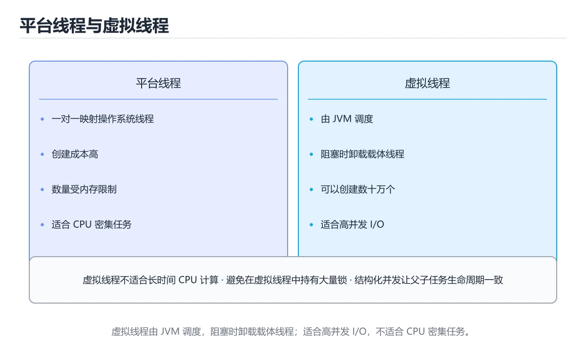
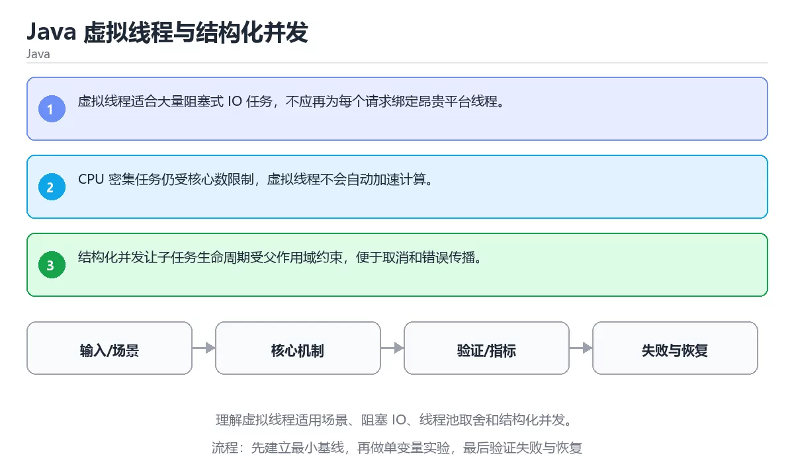

# Java 虚拟线程与结构化并发

> 内容更新时间：2026-10-06 · 学习阶段：高级 · 预计用时：30 分钟





## 学习目标

- 能用自己的话解释：虚拟线程适合大量阻塞式 IO 任务，不应再为每个请求绑定昂贵平台线程。
- 能用自己的话解释：CPU 密集任务仍受核心数限制，虚拟线程不会自动加速计算。
- 能用自己的话解释：结构化并发让子任务生命周期受父作用域约束，便于取消和错误传播。
- 能把本课知识放回「Java」，并完成练习与测验。

## 前置知识

- 已完成本分类的基础课程，能独立运行 虚拟线程 的最小示例。
- 本课关键词：虚拟线程、结构化并发、阻塞IO、线程池。
- 遇到不熟悉的术语先记录问题，完成练习后再回读。

## 核心知识

### 1. 虚拟线程适合大量阻塞式 IO 任务，不应再为每个请求绑定昂贵平台线程。

- 关键做法：先让 虚拟线程 的最小示例可复现，再加入并发或规模条件。
- 验证标准：结构化并发 的异常路径有明确错误信息与恢复动作。

### 2. CPU 密集任务仍受核心数限制，虚拟线程不会自动加速计算。

把这条结论放回「Java 虚拟线程与结构化并发」的完整流程里展开：

- 正文依据：能用自己的话解释：虚拟线程适合大量阻塞式 IO 任务，不应再为每个请求绑定昂贵平台线程。
- 落地检查：把「2. CPU 密集任务仍受核心数限制，虚拟线程不会自动加速计算。」改写成一条可执行的核对项，逐条验证输入、超时与失败路径。

### 3. 结构化并发让子任务生命周期受父作用域约束，便于取消和错误传播。

把这条结论放回「Java 虚拟线程与结构化并发」的完整流程里展开：

- 正文依据：能用自己的话解释：CPU 密集任务仍受核心数限制，虚拟线程不会自动加速计算。
- 落地检查：把「3. 结构化并发让子任务生命周期受父作用域约束，便于取消和错误传播。」改写成一条可执行的核对项，逐条验证输入、超时与失败路径。

## 关键流程

```text
输入 → 校验 → 核心处理 → 验证 → 记录指标 → 失败恢复
```

## 实践路径

1. 用一句话复述本课要解决的问题。
2. 跑通正文中的最小示例并记录基线。
3. 只改变一个输入或参数，预测并验证结果。
4. 补一个失败路径，记录错误、恢复和指标。
5. 把结论写成可复现的笔记或测试。

## 常见错误与排查

> 说明：本表由《Java 虚拟线程与结构化并发》的核心知识整理（2026-10-07），人工复核进度见 docs/content_review_batches.md。

| 易错点 | 容易踩的做法 | 正确结论 |
| --- | --- | --- |
| 在虚拟线程里长时间持锁 | 载体线程被占用，扩展性消失 | 缩小临界区，必要时改用可重入锁 |
| 把虚拟线程当线程池复用 | 语义不符，收益有限 | 每个任务创建虚拟线程，用结构化并发组织 |
| 忽略阻塞式本地调用 | 载体线程仍被占满 | 识别真正的阻塞点，改用异步 API 或独立线程池 |

## 动手练习

1. 合上教程，用 3～5 句话解释Java 虚拟线程与结构化并发。
2. 从正文选一个例子，改变一个条件并预测结果。
3. 设计一个失败场景，写出止损与恢复步骤。

**验收标准**：留下输入、命令、输出、差异和下一步问题。

## 本课小结

- 本课围绕 虚拟线程、结构化并发、阻塞IO、线程池 展开，复习时重点核对它们的输入、输出和失败路径。
- 完成练习和测验后，把 虚拟线程 上仍然不确定的问题写成下一轮验证清单。


## 可运行练习

本节围绕Java 虚拟线程与结构化并发安排 3 个可交付任务，每个任务都要求留下可以复查的记录。

### 任务 1：用自己的话画出结构

不看书，用一张图说清「Java 虚拟线程与结构化并发」的结构，画完再对照骨架：

- 主干：newVirtualThreadPerTaskExecutor 的原理 → 操作步骤 → 验证方法 → 易错点
- 连接线：在每条边上标出输入、输出与失败路径。
- 自检：能否用一句话说明虚拟线程与结构化并发的关系？

### 任务 2：做一次对比实验

**验收标准**：对照表两列都要有证据（命令、输出或数据），并注明虚拟线程与结构化并发哪一个才是决定性变量。

### 任务 3：迁移到自己的场景

**验收标准**：结论要能追溯到「核心知识」的具体段落，并说明它和 结构化并发 的边界。

## 故障现场

### 现场 1：在虚拟线程里长时间持锁

**症状**：在《Java 虚拟线程与结构化并发》的复现场景中，载体线程被占用，扩展性消失。

**根因**：触发点是把“在虚拟线程里长时间持锁”当成安全做法。它没有满足《Java 虚拟线程与结构化并发》要求的前提，因此先表现为“载体线程被占用，扩展性消失”；排查时先完整复现这一段，再核对输入、配置与依赖。

**修复**：针对《Java 虚拟线程与结构化并发》的问题，缩小临界区，必要时改用可重入锁。

**验证**：先在《Java 虚拟线程与结构化并发》中记录“在虚拟线程里长时间持锁”留下的失败证据，再执行“缩小临界区，必要时改用可重入锁”并重放；确认错误路径变为明确结果，且修复没有掩盖同类故障。

### 现场 2：把虚拟线程当线程池复用

**症状**：在《Java 虚拟线程与结构化并发》的复现场景中，语义不符，收益有限。

**根因**：触发点是把“把虚拟线程当线程池复用”当成安全做法。它没有满足《Java 虚拟线程与结构化并发》要求的前提，因此先表现为“语义不符，收益有限”；排查时先完整复现这一段，再核对输入、配置与依赖。

**修复**：针对《Java 虚拟线程与结构化并发》的问题，每个任务创建虚拟线程，用结构化并发组织。

**验证**：在《Java 虚拟线程与结构化并发》中按“每个任务创建虚拟线程，用结构化并发组织”调整后，从“把虚拟线程当线程池复用”的触发条件重放同一条路径，确认“语义不符，收益有限”不再出现，并补一个相邻边界用例检查没有引入新问题。

### 现场 3：忽略阻塞式本地调用

**症状**：在《Java 虚拟线程与结构化并发》的复现场景中，载体线程仍被占满。

**根因**：触发点是把“忽略阻塞式本地调用”当成安全做法。它没有满足《Java 虚拟线程与结构化并发》要求的前提，因此先表现为“载体线程仍被占满”；排查时先完整复现这一段，再核对输入、配置与依赖。

**修复**：针对《Java 虚拟线程与结构化并发》的问题，识别真正的阻塞点，改用异步 API 或独立线程池。

**验证**：在《Java 虚拟线程与结构化并发》中按“识别真正的阻塞点，改用异步 API 或独立线程池”调整后，从“忽略阻塞式本地调用”的触发条件重放同一条路径，确认“载体线程仍被占满”不再出现，并补一个相邻边界用例检查没有引入新问题。

## 版本与时效

- 先确认运行环境是 Java 21 还是 25，再决定 newVirtualThreadPerTaskExecutor 能否使用新语法。
- 升级收益集中在并发与内存模型；结构化并发 相关代码需要单独回归。
- 升级「Java 虚拟线程与结构化并发」涉及的依赖前，先用 newVirtualThreadPerTaskExecutor 复现当前行为，再逐项核对版本说明与破坏性变更。

### 升级检查清单

- 先固定当前版本，跑通全部示例与测验，再升级工具链。
- 升级时只动一个依赖版本，用 newVirtualThreadPerTaskExecutor 记录构建与运行结果。
- 先回归 虚拟线程 与 结构化并发 的默认行为和错误信息，再扩大测试范围。
- 升级完成后更新本课「最后复核 / 下次复核」日期，并记录 虚拟线程 的版本变化。

## 本课复习清单


离开本课前，逐项确认：

- [ ] 不看解析，能说出「围绕“Java 虚拟线程与结构化并发”中的 虚拟线程、结构化并发、阻塞IO，下列哪两项是本课强调的实践判断？」的判断依据。
- [ ] 不看解析，能说出「阅读「Java 虚拟线程与结构化并发」正文里的这段 Java 代码，下面哪一项判断是正确的？」的判断依据。
- [ ] 不看解析，能说出「关于「结构化并发让子任务生命周期受父作用域约束，便于取消和错误传播。」，下列说法正确的是？」的判断依据。
- [ ] 至少运行一次《Java 虚拟线程与结构化并发》的示例，记录输入、输出和一个边界情况。
- [ ] 把本课最容易混淆的两个概念写成一句话对照。

| 复盘项 | 记录 |
| --- | --- |
| 已经能独立解释的考点 |  |
| 仍然说不清的概念 |  |
| 下一步验证动作 |  |

## 复习与自测

下面按正文顺序回顾「Java 虚拟线程与结构化并发」的每一节；说不清的地方回到 核心知识 补课。

### 核心知识

自检：这一节与相邻主题的边界在哪里？

### 动手练习

自检：如果去掉这一节里的一个前提，结论会怎样变化？

### 最小可运行示例

```java
import java.util.concurrent.Executors;

public class Main {
    public static void main(String[] args) throws Exception {
        try (var executor = Executors.newVirtualThreadPerTaskExecutor()) {
            var future = executor.submit(() -> "virtual-thread-ok");
            System.out.println(future.get());
        }
    }
}
```

自检：把这一节讲给没学过的人，最需要强调哪一点？

### 预期输出

```text
virtual-thread-ok
```

### 验证步骤

制造一次错误输入，记录错误信息与修复方式。
### 追问 1：关于「虚拟线程适合大量阻塞式 IO 任务，不应再为每个请求绑定昂贵平台线程。」，下列说法正确的是？

- 先写下判断，再对照：虚拟线程适合大量阻塞式 IO 任务，不应再为每个请求绑定昂贵平台线程。
- 检查点：如果 虚拟线程 的输入换成边界值，这个结论还需要补充哪个前提？

### 追问 2：关于「CPU 密集任务仍受核心数限制，虚拟线程不会自动加速计算。」，下列说法正确的是？

- 先写下判断，再对照：CPU 密集任务仍受核心数限制，虚拟线程不会自动加速计算。

## 术语速查

| 术语 | 一句话说明 |
| --- | --- |
| `虚拟线程` | JVM 管理的轻量线程，大量阻塞任务可由少量平台线程承载。 |
| `结构化并发` | 结构化并发让子任务生命周期受父作用域约束，便于取消和错误传播。 |
| `阻塞IO` | 调用线程在 I/O 完成前一直等待，简单直观但会占用线程资源。 |
| `线程池` | 复用固定数量线程处理任务，避免频繁创建销毁，并需要定义队列和拒绝策略。 |

## 零基础精讲：把Java 虚拟线程与结构化并发真正讲透

### 先建立一个直觉

本课的摘要可以当作一张地图：理解虚拟线程适用场景、阻塞 IO、线程池取舍和结构化并发。

### 逐步拆解

1. 澄清输入与目标。先写清「Java 虚拟线程与结构化并发」要解决的问题、合法输入范围和成功标准，再进入后续步骤。
2. 描述处理过程。把「虚拟线程、结构化并发、阻塞IO、线程池」映射到具体步骤，每步都要求能单独验证。
3. 定义输出。把 newVirtualThreadPerTaskExecutor 的返回值、日志和失败信号都写清楚，缺一项都不算完整。
4. 先预测虚拟线程会怎样失败，再实际触发一次；差异部分就是本课最需要补的前提。
5. 用 newVirtualThreadPerTaskExecutor 构造一个最小反例，证明「Java 虚拟线程与结构化并发」的结论有边界。

### 把正文串成一条执行链

- **1. 虚拟线程适合大量阻塞式 IO 任务，不应再为每个请求绑定昂贵平台线程。**：在「Java 虚拟线程与结构化并发」里，「1. 虚拟线程适合大量阻塞式 IO 任务，不应再为每个请求绑定昂贵平台线程。」这一步要先写清输入与预期，再记录实际结果和差异；结果不符时回到对应小节核对前提。
- **2. CPU 密集任务仍受核心数限制，虚拟线程不会自动加速计算。**：在「Java 虚拟线程与结构化并发」里，「2. CPU 密集任务仍受核心数限制，虚拟线程不会自动加速计算。」这一步要先写清输入与预期，再记录实际结果和差异；结果不符时回到对应小节核对前提。
- **3. 结构化并发让子任务生命周期受父作用域约束，便于取消和错误传播。**：在「Java 虚拟线程与结构化并发」里，「3. 结构化并发让子任务生命周期受父作用域约束，便于取消和错误传播。」这一步要先写清输入与预期，再记录实际结果和差异；结果不符时回到对应小节核对前提。
- **考点 1：围绕“Java 虚拟线程与结构化并发”中的 虚拟线程、结构化并发、阻塞IO，下列哪两项是本课强调的实践判断？**：先独立作答，再回到本课对应小节核对判断依据；答错时记录是哪一个前提被忽略。
- **考点 2：核心知识 的代码阅读题**：先独立作答，再回到本课正文核对 newVirtualThreadPerTaskExecutor 的执行路径；答错时记录是哪一个前提被忽略。
- **考点 3：关于「结构化并发让子任务生命周期受父作用域约束，便于取消和错误传播。」，下列说法正确的是？**：先独立作答，再回到本课对应小节核对判断依据；答错时记录是哪一个前提被忽略。

### 从测验反推易错点

**检查点 1：关于「虚拟线程适合大量阻塞式 IO 任务，不应再为每个请求绑定昂贵平台线程。」，下列说法正确的是？**

- 参考判断：虚拟线程适合大量阻塞式 IO 任务，不应再为每个请求绑定昂贵平台线程。
- 自问：如果去掉题干里的一个限定词，结论还成立吗？

**检查点 2：关于「CPU 密集任务仍受核心数限制，虚拟线程不会自动加速计算。」，下列说法正确的是？**

- 参考判断：CPU 密集任务仍受核心数限制，虚拟线程不会自动加速计算。

**检查点 3：关于「结构化并发让子任务生命周期受父作用域约束，便于取消和错误传播。」，下列说法正确的是？**

- 参考判断：结构化并发让子任务生命周期受父作用域约束，便于取消和错误传播。

**检查点 4：本课的核心学习目标是什么？**

- 参考判断：理解虚拟线程适用场景、阻塞 IO、线程池取舍和结构化并发。

- 参考判断：virtual

### 工程排错顺序

| 先查什么 | 要得到的证据 | 判断标准 |
| --- | --- | --- |
| 输入与前提是否满足 | 日志、输入样例、测试或指标 | 能复现并解释，才算定位 |
| 核心步骤是否产生了预期中间结果 | 日志、输入样例、测试或指标 | 能复现并解释，才算定位 |
| 失败路径是否可观测、可恢复 | 日志、输入样例、测试或指标 | 能复现并解释，才算定位 |
| 资源、权限与成本是否在预算内 | 日志、输入样例、测试或指标 | 能复现并解释，才算定位 |

### 变式训练

1. 把 虚拟线程 的实现压缩到一个进程内，去掉所有外部依赖后再谈扩展。
2. 扩大 结构化并发 的规模，记录本课结论在哪一个量级开始不成立。
3. 制造一次 虚拟线程 相关的依赖超时或错误输入，要求错误可解释且不留半完成状态。
5. 把「Java 虚拟线程与结构化并发」里最容易被省略的一步去掉，用测试或指标证明它不可省略，而不是凭感觉判断。
6. 限制 CPU 与内存上限后重跑 newVirtualThreadPerTaskExecutor，观察哪一项参数需要重新设定。

### 本课自测

- [ ] 能用一句话解释「虚拟线程」在本课中的角色与边界。
- [ ] 能举出一个正常例子和一个失败例子。
- [ ] 能说出最小验证步骤，以及需要记录的证据。
- [ ] 能用一句话解释「结构化并发」在本课中的角色与边界。
- [ ] 能用一句话解释「阻塞IO」在本课中的角色与边界。
- [ ] 能用一句话解释「线程池」在本课中的角色与边界。

### 迁移案例库

换一个 结构化并发 约束重做一次，确认结论在新条件下是否仍然成立。

#### 迁移案例 1：围绕「虚拟线程」做一次小实验

**目标**：在不改变课程主体的前提下，验证Java 虚拟线程与结构化并发中的一个关键判断。

**步骤**：
1. 复述当前方案对「虚拟线程」的假设，写成一句可证伪的话。
2. 设计一个正常输入和一个边界输入，分别预测输出。
3. 运行或逐步演算，记录实际输出、耗时和失败信息。
4. 只调整一个参数，比较前后差异并解释原因。
5. 补充一条测试或复习卡，确保下次能更快复现。

**验收**：把「Java 虚拟线程与结构化并发」的判断依据写成可复现步骤，换一台机器或换一个输入仍能得到同一结论。

#### 迁移案例 2：围绕「结构化并发」做一次小实验

**步骤**：
1. 复述当前方案对「结构化并发」的假设，写成一句可证伪的话。

#### 迁移案例 3：围绕「阻塞IO」做一次小实验

**步骤**：
1. 复述当前方案对「阻塞IO」的假设，写成一句可证伪的话。

#### 迁移案例 4：围绕「线程池」做一次小实验

**步骤**：
1. 复述当前方案对「线程池」的假设，写成一句可证伪的话。

#### 迁移案例 5：围绕「虚拟线程」做一次小实验

**步骤**：

#### 迁移案例 6：围绕「结构化并发」做一次小实验

**步骤**：

#### 迁移案例 7：围绕「阻塞IO」做一次小实验

**步骤**：

#### 迁移案例 8：围绕「线程池」做一次小实验

**步骤**：

#### 迁移案例 9：围绕「虚拟线程」做一次小实验

**步骤**：

#### 迁移案例 10：围绕「结构化并发」做一次小实验

**步骤**：

#### 迁移案例 11：围绕「阻塞IO」做一次小实验

**步骤**：

#### 迁移案例 12：围绕「线程池」做一次小实验

**步骤**：

#### 迁移案例 13：围绕「虚拟线程」做一次小实验

**步骤**：

#### 迁移案例 14：围绕「结构化并发」做一次小实验

**步骤**：

#### 迁移案例 15：围绕「阻塞IO」做一次小实验

**步骤**：

#### 迁移案例 16：围绕「线程池」做一次小实验

**步骤**：

<!-- p0-depth-v2:end -->

## 考点精讲

### 考点 1：多选辨析·虚拟线程

- **题目**：围绕“Java 虚拟线程与结构化并发”中的 虚拟线程、结构化并发、阻塞IO，下列哪两项是本课强调的实践判断？
- **判断依据**：本课把Java 虚拟线程与结构化并发拆成概念、示例与故障现场三部分，因此判断 虚拟线程 时必须同时交代输入、输出和失败路径，这使“学习 虚拟线程 时要同时说明输入、输出和失败路径，不能只看正常流程”成立。在Java 虚拟线程与结构化并发里，判断 结构化并发 时要固定版本与边界输入，所以“验证 结构化并发 时要固定版本并覆盖边界输入，结论才可复现”才可复现。

### 考点 2：代码补全·虚拟线程

- **题目**：阅读「Java 虚拟线程与结构化并发」正文里的这段 Java 代码，下面哪一项判断是正确的？
- **判断依据**：在「Java 虚拟线程与结构化并发」里，这段代码会产生可观察的输出，运行后能看到结果。这段代码出自「Java 虚拟线程与结构化并发」的正文示例，围绕虚拟线程、结构化并发、阻塞IO展开；把输入或边界换成空值、极值或失败情况后，结论要以「Java 虚拟线程与结构化并发」的实际运行结果为准。

### 考点 3：概念判断·虚拟线程

- **题目**：关于「结构化并发让子任务生命周期受父作用域约束，便于取消和错误传播。」，下列说法正确的是？
- **判断依据**：在「Java 虚拟线程与结构化并发」里，结构化并发让子任务生命周期受父作用域约束，便于取消和错误传播。在「Java 虚拟线程与结构化并发」里，如果只凭关键词作答，很容易把模式匹配把类型判断、绑定和结构解构合并，减少样板代码。在「Java 虚拟线程与结构化并发」里判断这道题，要把虚拟线程、结构化并发、阻塞IO的条件、过程与失败路径逐项对齐，换成“关于结构化并发让子任务生命周期受父作”这个场景，只有满足前提的结论才成立。

### 考点 4：概念判断·虚拟线程

- **题目**：「Java 虚拟线程与结构化并发」的核心学习目标是什么？
- **判断依据**：在「Java 虚拟线程与结构化并发」里，结论应落在「理解虚拟线程适用场景、阻塞 IO、线程池取舍和结构化并发」。在「Java 虚拟线程与结构化并发」里，结论应落在理解虚拟线程适用场景、阻塞 IO、线程池取舍和结构化并发。在「Java 虚拟线程与结构化并发」里，这道题要求区分概念与边界，理解虚拟线程适用场景、阻塞 IO、线程池取舍和结构化并发。

### 考点 5：填空·虚拟线程

- **题目**：补全代码：「Java 虚拟线程与结构化并发」示例中，下面这行代码缺少哪个关键字或函数名？请填入 ____。 `var future = executor.submit( -> "____-thread-ok");`
- **判断依据**：把“virtual”代回「Java 虚拟线程与结构化并发」里“Java 虚拟线程与结构化并发示例中”的例子核对，条件一旦改变，结论就要用虚拟线程、结构化并发、阻塞IO重新推导。「Java 虚拟线程与结构化并发」要求先交代虚拟线程、结构化并发、阻塞IO的前提再下结论，所以“virtual”只在题干“Java”给定的条件下成立。

## English Overview

**Title:** Java Virtual Threads and Structured Concurrency

**Summary:** Learn virtual threads for blocking IO, pool tradeoffs and structured concurrency.

**Category:** Java
**Level:** 高级
**Key terms:** 虚拟线程, 结构化并发, 阻塞IO, 线程池

## 内容元数据

- 内容版本：v2.0
- 最后更新：2026-10-06
- 学习阶段：高级
- 适用环境：Java 21+ / Maven 或 Gradle；本课聚焦 虚拟线程。
- 内容来源：内置结构化课程与工程实践整理
- 相关主题：虚拟线程、结构化并发、阻塞IO、线程池
- 质量版本：P0 测验标准 + P1 覆盖扩展 + P2 体验补全

## 最小可运行示例

下面示例用于验证 虚拟线程 的最小输入、处理和输出。先原样运行，再只修改一个值：

```java
import java.util.concurrent.Executors;

public class Main {
    public static void main(String[] args) throws Exception {
        try (var executor = Executors.newVirtualThreadPerTaskExecutor()) {
            var future = executor.submit(() -> "virtual-thread-ok");
            System.out.println(future.get());
        }
    }
}
```

## 预期输出

```text
virtual-thread-ok
```

## 验证步骤

1. 记录运行环境、命令和真实输出。
2. 修改一个输入，先写预测再运行。
4. 把结论写回本课笔记或测试用例。

## 参考资料与复核

- 最后复核：2026-10-04
- 下次复核：2027-01-10
- 复核范围：版本兼容、API 行为、安全建议与工程实践
- 来源性质：官方文档、标准或权威教材；正文为离线教学重组

| 参考资料 | 本课用途 |
| --- | --- |
| [Java 并发教程](https://docs.oracle.com/javase/tutorial/essential/concurrency/) | 线程、同步与并发工具 |
| [Java GC 调优](https://docs.oracle.com/en/java/javase/21/gctuning/) | 垃圾回收与性能调优 |
| [Maven 指南](https://maven.apache.org/guides/) | 依赖、生命周期与构建 |

> 「Java 虚拟线程与结构化并发」的链接用于离线阅读后的延伸核对；App 不会自动联网。

## 复习与迁移

复习目标：把「Java 虚拟线程与结构化并发」的判断标准放回可复现的例子里。先自己作答，再对照依据；如果结论正确但理由不完整，回到正文补足前提。

### 概念复述

- 用一句话说明「Java 虚拟线程与结构化并发」解决什么问题：理解虚拟线程适用场景、阻塞 IO、线程池取舍和结构化并发。
- 写出虚拟线程、结构化并发、阻塞IO之间的关系，并各举一个例子。
- 说出本课最容易混淆的两个概念，以及区分它们的判据。

### 正文逐节复核

- **实践任务**：本节围绕Java 虚拟线程与结构化并发安排 3 个可交付任务，每个任务都要求留下可以复查的记录。
- **零基础精讲：把Java 虚拟线程与结构化并发真正讲透**：本课的摘要可以当作一张地图：理解虚拟线程适用场景、阻塞 IO、线程池取舍和结构化并发。

### 测验回顾

1. 围绕“Java 虚拟线程与结构化并发”中的 虚拟线程、结构化并发、阻塞IO，下列哪两项是本课强调的实践判断？
   - 依据：本课把Java 虚拟线程与结构化并发拆成概念、示例与故障现场三部分，因此判断 虚拟线程 时必须同时交代输入、输出和失败路径，这使“学习 虚拟线程 时要同时说明输入、输出和失败路径，不能只看正常流程”成立。在Java 虚拟线程与结构化并发里，判断 结构化并发 时要固定版本与边界输入，所以“验证 结构化并发 时要固定版本并覆盖边界输入，结论才可复现”才可复现。
2. 阅读「Java 虚拟线程与结构化并发」正文里的这段 Java 代码，下面哪一项判断是正确的？
   - 依据：在「Java 虚拟线程与结构化并发」里，这段代码会产生可观察的输出，运行后能看到结果。这段代码出自「Java 虚拟线程与结构化并发」的正文示例，围绕虚拟线程、结构化并发、阻塞IO展开；把输入或边界换成空值、极值或失败情况后，结论要以「Java 虚拟线程与结构化并发」的实际运行结果为准。
3. 关于「结构化并发让子任务生命周期受父作用域约束，便于取消和错误传播。」，下列说法正确的是？
   - 依据：在「Java 虚拟线程与结构化并发」里，结构化并发让子任务生命周期受父作用域约束，便于取消和错误传播。在「Java 虚拟线程与结构化并发」里，如果只凭关键词作答，很容易把模式匹配把类型判断、绑定和结构解构合并，减少样板代码。在「Java 虚拟线程与结构化并发」里判断这道题，要把虚拟线程、结构化并发、阻塞IO的条件、过程与失败路径逐项对齐，换成“关于结构化并发让子任务生命周期受父作”这个场景，只有满足前提的结论才成立。
4. 「Java 虚拟线程与结构化并发」的核心学习目标是什么？
   - 依据：在「Java 虚拟线程与结构化并发」里，结论应落在「理解虚拟线程适用场景、阻塞 IO、线程池取舍和结构化并发」。在「Java 虚拟线程与结构化并发」里，结论应落在理解虚拟线程适用场景、阻塞 IO、线程池取舍和结构化并发。在「Java 虚拟线程与结构化并发」里，这道题要求区分概念与边界，理解虚拟线程适用场景、阻塞 IO、线程池取舍和结构化并发。
5. 补全代码：「Java 虚拟线程与结构化并发」示例中，下面这行代码缺少哪个关键字或函数名？请填入 ____。

`var future = executor.submit( -> "____-thread-ok");`
   - 依据：把“virtual”代回「Java 虚拟线程与结构化并发」里“Java 虚拟线程与结构化并发示例中”的例子核对，条件一旦改变，结论就要用虚拟线程、结构化并发、阻塞IO重新推导。「Java 虚拟线程与结构化并发」要求先交代虚拟线程、结构化并发、阻塞IO的前提再下结论，所以“virtual”只在题干“Java”给定的条件下成立。

### 迁移练习

把「Java 虚拟线程与结构化并发」的结论迁移到相邻主题，每次迁移都写清预测与证据：

1. 换输入：用虚拟线程处理一组你自己的数据，对比教材示例的结果差异。
2. 换失败条件：制造一个结构化并发相关的错误，说明如何从错误信息定位根因。
3. 换规模：把数据量或并发度提高一个数量级，说明「Java 虚拟线程与结构化并发」的结论是否仍成立。
