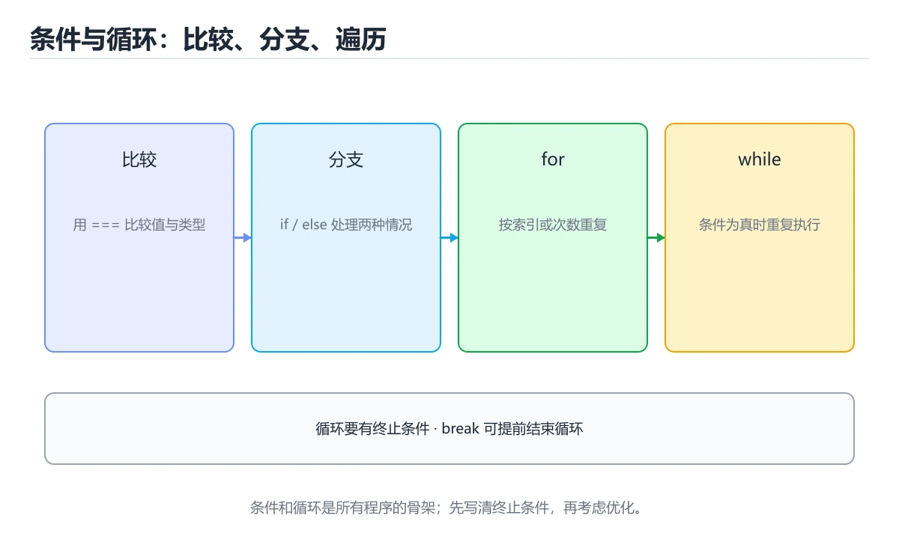

# JavaScript 条件与循环

> 内容更新时间：2026-10-06




## 学习目标

- 先认识JavaScript 条件与循环需要的工具、输入和输出。
- 按步骤运行最小示例，并记录结果与错误。
- 用一个边界输入验证自己是否真正掌握。

## 前置知识

- 会进行基本的文件或命令行操作。
- 不需要预先掌握「JavaScript」的高级知识。

## 一句话入门

用分支和循环处理一组数据。

## 最小示例

```javascript
let total = 0;
for (let i = 1; i <= 5; i++) {
  total += i;
}
console.log(`total=${total}`);
```

## 预期输出

```text
total=15
```

## 常见错误

- 把 == 与 === 混用，造成隐式类型转换。
- 复制命令时遗漏空格、引号或必要参数。

## 动手练习

1. 原样运行最小示例，保存命令和输出。
2. 把数字 2 改成 10，预测并验证新结果。
3. 制造一个错误输入，写出错误信息和修复方法。

## 本课小结

- 入门阶段先保证能运行、能观察、能解释，再追求复杂功能。
- 每次只改一个变量，记录预测与实际结果。
- 遇到错误先看第一条错误信息，再回到最小示例。

## 代码实验：把示例跑成证据

### 实验一：建立基线

```javascript
let total = 0;
for (let i = 1; i <= 5; i++) {
  total += i;
}
console.log(`total=${total}`);
```

### 实验二：只改一个输入

沿用「JavaScript 条件与循环」的最小示例做一次单变量实验：

| 实验 | 改动 | 预测 | 实际 | 结论 |
| --- | --- | --- | --- | --- |
| 基线 | 保持「JavaScript 条件与循环」示例原样 |  |  |  |
| 边界 | 把JavaScript 条件与循环换成空值或极值 |  |  |  |
| 失败 | 给JavaScript传入非法输入 |  |  |  |

做完后用一句话写出「JavaScript 条件与循环」的结论：输入怎么变，结果才怎么变。

### 实验三：制造一个可控错误

把一个预期为数字的值改成字符串，或者访问不存在的属性。记录结果是 undefined、NaN 还是类型错误，并说明为什么。

| 实验 | 改动 | 预测 | 实际 | 结论 |
| --- | --- | --- | --- | --- |
| 基线 | 保持原样 |  |  |  |
| 边界 |  |  |  |  |
| 失败 |  |  |  |  |

### 实验四：用三句话复述

1. 输入是什么，哪些输入属于合法范围，哪些属于边界或非法范围？
2. 程序按什么顺序处理输入，在哪一步产生了状态变化或副作用？
3. 输出如何验证，失败时第一条可观察证据是什么？

## JavaScript 基础机制速览

### 引擎、事件循环与执行上下文

JavaScript 是单线程执行模型，调用栈执行同步代码，事件循环在栈清空后处理任务队列和微任务队列。`setTimeout`、Promise、事件回调都通过异步机制排队执行。理解调用栈、任务队列和微任务的顺序，才能解释“为什么日志顺序和代码顺序不同”。浏览器和 Node.js 提供不同的宿主 API，但语言核心相同。

### 变量、作用域与类型转换

`var` 函数作用域且会提升，`let` 和 `const` 块级作用域并有暂时性死区。`const` 禁止重新赋值，但对象内容仍可修改。JavaScript 有原始类型和对象类型，`==` 会做隐式类型转换，`===` 同时比较类型和值；日常判断优先使用 `===`，只有明确需要转换时才用 `==`。`null`、`undefined`、`NaN` 的语义不同，判断存在性时要写清。

### 函数、闭包与 this

函数是一等对象，可以作为参数、返回值和对象属性。闭包让函数记住定义时的词法作用域，常用于回调、模块私有状态和工厂函数。`this` 的值取决于调用方式，普通调用、方法调用、构造函数和箭头函数规则不同；箭头函数不绑定自己的 this，适合回调，不适合需要动态 this 的方法。

### 对象、原型与模块

对象是键值集合，原型链提供属性查找和继承。`class` 是原型继承的语法糖，`extends` 和 `super` 简化继承写法。模块使用 `import`/`export` 显式声明依赖，避免全局污染。不可变数据、展开运算符和结构化克隆各有边界，浅拷贝不会复制嵌套对象。

### Promise、async 与 DOM

Promise 表示未来完成或失败的结果，`async/await` 让异步代码更接近同步写法，但不会把异步变成阻塞。错误要用 try/catch 或 `.catch` 处理，多个独立任务可以用 `Promise.all`，需要全部结束再汇总可以用 `Promise.allSettled`。DOM 操作应批量进行，避免在循环中反复读写布局；事件监听要注意冒泡、捕获、默认行为和移除监听器，防止内存泄漏。

## 本课自测清单与错误对照

本课测验以直接定义和步骤判断为主。请把每个错误选项改写成一句反例，
说明它在哪个输入、边界或前提变化下会失败。

### 完成标准

- [ ] 能用具体输入复现最小示例，并逐行解释输入、处理与输出。
- [ ] 能只改一个值完成边界实验，并让预测与实际结果一致。
- [ ] 能制造一个可控错误，读出第一条错误信息并完成修复。
- [ ] 能不看书说出本课至少两个易错点和对应的验证方法。

### 复盘记录

| 项目 | 记录 |
| --- | --- |
| 学到的核心机制 |  |
| 仍然不确定的问题 |  |
| 下一步验证动作 |  |

## 可运行练习

### 任务 1：先跑通，再解释

```javascript
let total = 0;
for (let i = 1; i <= 5; i++) {
  total += i;
}
console.log(`total=${total}`);
```

**预期输出**：total=${total}

### 任务 2：只改一个条件

把「JavaScript 条件与循环」的最小示例复制一份，只改一个条件再跑一次：

- 改动点：只把JavaScript 条件与循环的输入换成空值、极值或错误输入，其余保持不变。
- 预测：先写下「JavaScript 条件与循环」在改动后的输出或错误信息，再运行。
- 记录：对照改动前后的结果，指出差异出在哪一步。
- 验收：换回原条件能复现原结果，改动只影响JavaScript 条件与循环。

### 任务 3：迁移到自己的数据

用同一套思路处理一组你自己的数据或场景，保持输出格式与任务 1 一致。

## 故障现场

### 现场 1：本课的 JavaScript 条件与循环 常规用例通过，但边界用例失败

把这条结论放回「JavaScript 条件与循环」的完整流程里展开：

- 正文依据：症状：在本课的练习或生产场景里出现“本课的 JavaScript 结果在两次运行之间不一致”。
- 落地检查：把「现场 1：本课的 JavaScript 条件与循环 常规用例通过，但边界用例失败」改写成一条可执行的核对项，逐条验证输入、超时与失败路径。

### 现场 2：本课的 JavaScript 结果在两次运行之间不一致

**症状**：在本课的练习或生产场景里出现“本课的 JavaScript 结果在两次运行之间不一致”。

**复现**：准备一组最小输入，只保留触发“本课的 JavaScript 结果在两次运行之间不一致”的必要条件，连续运行两次确认结果稳定。

**定位**：围绕“JavaScript 依赖了当前版本、执行顺序或共享状态，单次运行无法暴露差异”检查调用链、输入数据和环境配置，先验证假设再改代码。

**预防**：把“本课的 JavaScript 结果在两次运行之间不一致”写成一条自动化用例，并在本课的验收清单里保留对应检查项。

### 现场 3：本课的验证只在开发机通过

**症状**：在本课的练习或生产场景里出现“本课的验证只在开发机通过”。

## 版本与时效

- 运行时要同时考虑浏览器基线、Node LTS 与打包工具的降级策略
- 升级前用特性检测和构建目标矩阵验证，不要只在本机浏览器测试

### 升级检查清单

- 先固定当前版本，跑通全部示例与测验，再升级工具链。
- 只改一个版本变量，记录编译、测试、性能与产物体积的变化。
- 重点回归默认值、弃用警告、序列化格式、并发语义和错误信息。
- 升级完成后更新本课的“最后复核 / 下次复核”日期与版本说明。

## 本课复习清单

离开本课前，逐项确认：

- [ ] 不看解析，能说出「示例中的 for 循环累加 1 到 5，输出是什么？」的判断依据。
- [ ] 不看解析，能说出的判断依据。
- [ ] 不看解析，能说出「在循环中 break 与 continue 的差别是？」的判断依据。
- [ ] 不看解析，能说出「下面代码想输出 0、1、2，但实际多输出一个值。问题在哪里？」的判断依据。
- [ ] 至少运行一次本课示例，记录输入、输出和一个边界情况。
- [ ] 把本课最容易混淆的两个概念写成一句话对照。

| 复盘项 | 记录 |
| --- | --- |
| 已经能独立解释的考点 |  |
| 仍然说不清的概念 |  |
| 下一步验证动作 |  |

## 逐节复习与自检

下面按正文顺序回顾每一节，并给出一个自检问题；说不清的地方回到原章节补课。

### 最小示例

```javascript
let total = 0;
for (let i = 1; i <= 5; i++) {
  total += i;
}
console.log(`total=${total}`);
```

自检：这一节与相邻主题的边界在哪里？

### 预期输出

```text
total=15
```

### 常见错误

自检：把这一节讲给没学过的人，最需要强调哪一点？

### 动手练习

自检：如果去掉这一节里的一个前提，结论会怎样变化？

## 术语速查

把「JavaScript 条件与循环」里反复出现的术语集中放在一起。复习时先遮住右列，尝试用自己的话解释，再回到正文核对。

| 术语 | 本课语境 |
| --- | --- |
| `JavaScript` | 按“JavaScript 条件与循环”中 JavaScript 条件与循环、JavaScript、入门练习 的实践顺序，把四个步骤排成从准备到复盘的合理顺序。 |
| `入门练习` | 按“JavaScript 条件与循环”中 JavaScript 条件与循环、JavaScript、入门练习 的实践顺序，把四个步骤排成从准备到复盘的合理顺序。 |

## 零基础精讲：把JavaScript 条件与循环真正讲透

### 先建立一个直觉

本课的摘要可以当作一张地图：用分支和循环处理一组数据。

### 逐步拆解

1. 澄清输入与目标。先写清「JavaScript 条件与循环」要解决的问题、合法输入范围和成功标准，再进入后续步骤。
2. 描述处理过程。把「JavaScript 条件与循环、JavaScript、入门练习」映射到具体步骤，每步都要求能单独验证。
3. 定义输出。输出不仅包括正常结果，还包括错误码、日志、指标和资源释放状态。
4. 找出一条失败路径。让错误尽早暴露，并说明重试、降级、回滚或人工处理的边界。
5. 用一个小例子贯穿全过程。先手算或预测结果，再运行代码或实验，最后解释差异。

### 把正文串成一条执行链

- **实验一：建立基线**：先原样运行上面的代码，记录命令、完整输出和退出状态
- **实验三：制造一个可控错误**：在「JavaScript 条件与循环」里，「实验三：制造一个可控错误」这一步要先写清输入与预期，再记录实际结果和差异；结果不符时回到对应小节核对前提。
- **引擎、事件循环与执行上下文**：在「JavaScript 条件与循环」里，「引擎、事件循环与执行上下文」这一步要先写清输入与预期，再记录实际结果和差异；结果不符时回到对应小节核对前提。
- **变量、作用域与类型转换**：`var` 函数作用域且会提升，`let` 和 `const` 块级作用域并有暂时性死区

### 从测验反推易错点

**检查点 1：示例中的 for 循环累加 1 到 5，输出是什么？**

- 参考判断：total=15，循环覆盖 1 到 5 全部整数
- 解析：正确答案是「total=15，循环覆盖 1 到 5 全部整数」，这道题在问示例中的for循环累加1到5，输出是什么，判断时要把题干限定的输入、边界与目标逐项对齐。let i = 1 且条件 i <= 5 让循环依次累加 1 到 5，得到 15。
- 自问：如果去掉题干里的一个限定词，结论还成立吗？

**检查点 2：JavaScript 中判断两个值是否相等时，null 与 undefined 的关系是？**

- 参考判断：使用 == 时二者相等
- 解析：正确答案是「使用 == 时二者相等」，这道题在问JavaScript中判断两个值是否相等时，null与undefined的关系是，判断时要把题干限定的输入、边界与目标逐项对齐。宽松相等的规则规定 null == undefined 为真，且两者相互比较是少数不触发额外类型转换的特例。

**检查点 3：在循环中 break 与 continue 的差别是？**

- 参考判断：break 结束整个循环，continue 进入下一次迭代
- 解析：正确答案是「break 结束整个循环，continue 进入下一次迭代」，这道题在问在循环中break与continue的差别是，判断时要把题干限定的输入、边界与目标逐项对齐。break 立即离开最近的循环或 switch，continue 跳过本轮剩余语句直接开始下一轮。

**检查点 4：下面代码想输出 0、1、2，但实际多输出一个值。问题在哪里？**

- 参考判断：循环条件使用了 <=，应改为 <
- 解析：正确答案是「循环条件使用了 <=，应改为 <」，这道题在问下面代码想输出0、1、2，但实际多输出一个值，问题在哪里，判断时要把题干限定的输入、边界与目标逐项对齐。循环变量从 0 开始，每轮结束后自增。下面代码想输出 0、1、2，但实际多输出一个值。

### 工程排错顺序

| 先查什么 | 要得到的证据 | 判断标准 |
| --- | --- | --- |
| 输入与前提是否满足 | 日志、输入样例、测试或指标 | 能复现并解释，才算定位 |
| 核心步骤是否产生了预期中间结果 | 日志、输入样例、测试或指标 | 能复现并解释，才算定位 |
| 失败路径是否可观测、可恢复 | 日志、输入样例、测试或指标 | 能复现并解释，才算定位 |
| 资源、权限与成本是否在预算内 | 日志、输入样例、测试或指标 | 能复现并解释，才算定位 |

### 变式训练

1. 把它放进一个只有单机、没有额外依赖的小项目，先保证正确，再考虑扩展。
2. 把输入规模扩大十倍，记录时间、内存和失败路径，找出第一个真正瓶颈。
3. 制造一次依赖超时或错误输入，要求系统给出可解释错误并且不留下半完成状态。
5. 删掉一个看似必要的步骤，观察哪个测试或指标先失败，用证据说明它为什么必要。
6. 把方案切换到低资源设备，重新评估默认参数、超时和降级策略。

### 本课自测

- [ ] 能用一句话解释JavaScript 条件与循环在本课中的角色与边界。
- [ ] 能举出一个正常例子和一个失败例子。
- [ ] 能说出最小验证步骤，以及需要记录的证据。
- [ ] 能用一句话解释「JavaScript」在本课中的角色与边界。
- [ ] 能用一句话解释「入门练习」在本课中的角色与边界。

### 迁移案例库

下面用不同约束重复同一套方法。每完成一轮，都把结论写进笔记，并只改变一个变量。

#### 迁移案例 1：围绕JavaScript 条件与循环做一次小实验

**目标**：在不改变课程主体的前提下，验证JavaScript 条件与循环中的一个关键判断。

**步骤**：
1. 复述当前方案对本课的假设，写成一句可证伪的话。
2. 设计一个正常输入和一个边界输入，分别预测输出。
3. 运行或逐步演算，记录实际输出、耗时和失败信息。
4. 只调整一个参数，比较前后差异并解释原因。
5. 补充一条测试或复习卡，确保下次能更快复现。

**验收**：结论有证据、差异可解释、失败可恢复；如果做不到，说明还需要缩小问题范围。

#### 迁移案例 2：围绕「JavaScript」做一次小实验

**步骤**：
1. 复述当前方案对「JavaScript」的假设，写成一句可证伪的话。

#### 迁移案例 3：围绕「入门练习」做一次小实验

**步骤**：
1. 复述当前方案对「入门练习」的假设，写成一句可证伪的话。

#### 迁移案例 4：围绕JavaScript 条件与循环做一次小实验

**步骤**：

#### 迁移案例 5：围绕「JavaScript」做一次小实验

**步骤**：

#### 迁移案例 6：围绕「入门练习」做一次小实验

**步骤**：

#### 迁移案例 7：围绕JavaScript 条件与循环做一次小实验

**步骤**：

#### 迁移案例 8：围绕「JavaScript」做一次小实验

**步骤**：

#### 迁移案例 9：围绕「入门练习」做一次小实验

**步骤**：

#### 迁移案例 10：围绕JavaScript 条件与循环做一次小实验

**步骤**：

#### 迁移案例 11：围绕「JavaScript」做一次小实验

**步骤**：

#### 迁移案例 12：围绕「入门练习」做一次小实验

**步骤**：

#### 迁移案例 13：围绕JavaScript 条件与循环做一次小实验

**步骤**：

#### 迁移案例 14：围绕「JavaScript」做一次小实验

**步骤**：

#### 迁移案例 15：围绕「入门练习」做一次小实验

**步骤**：

#### 迁移案例 16：围绕JavaScript 条件与循环做一次小实验

**步骤**：

<!-- p0-depth-v2:end -->

## 考点精讲

### 考点 1：顺序排列·JavaScript 条件与循环

- **题目**：按“JavaScript 条件与循环”中 JavaScript 条件与循环、JavaScript、入门练习 的实践顺序，把四个步骤排成从准备到复盘的合理顺序。
- **判断依据**：在「JavaScript 条件与循环」里，题干的正确项是写出最小示例并核对 JavaScript 的基线结果。这个顺序把 JavaScript 条件与循环 的输入、输出和约束放在最前面，在JavaScript 条件与循环里避免概念没对齐就开始调参。第二步用 JavaScript 建立可核对的基线，在JavaScript 条件与循环里第三步才允许改变一个变量并观察失败路径。

### 考点 2：多选辨析·JavaScript 条件与循环

- **题目**：围绕“JavaScript 条件与循环”中的 JavaScript 条件与循环、JavaScript、入门练习，下列哪两项是本课强调的实践判断？
- **判断依据**：题干的正确项是学习 JavaScript 条件与循环 时要同时说明输入、输出和失败路径，不能只看正常流程。在「JavaScript 条件与循环」里，验证 JavaScript 时要固定版本并覆盖边界输入，结论才可复现。“围绕JavaScript”与「JavaScript 条件与循环」的术语表相呼应，只有符合JavaScript 条件与循环、JavaScript、入门练习约束的“学习 JavaScript 条件与循环”才是正文支持的结论。

### 考点 3：概念判断·JavaScript 条件与循环

- **题目**：在循环中 break 与 continue 的差别是？
- **判断依据**：在「JavaScript 条件与循环」里，break 结束整个循环，continue 进入下一次迭代。break 立即离开最近的循环或 switch，continue 跳过本轮剩余语句直接开始下一轮。在「JavaScript 条件与循环」里判断这道题，要把JavaScript 条件与循环、JavaScript、入门练习的条件、过程与失败路径逐项对齐，换成“在循环中 break 与 conti”这个场景，只有满足前提的结论才成立。

### 考点 4：排错·JavaScript 条件与循环

- **题目**：下面代码想输出 0、1、2，但实际多输出一个值。问题在哪里？
- **判断依据**：在「JavaScript 条件与循环」里，结论应落在「循环条件使用了 <=，应改为 <」。循环变量从 0 开始，每轮结束后自增。下面代码想输出 0、1、2，但实际多输出一个值。在「JavaScript 条件与循环」里，这道题要求区分概念与边界，「循环条件使用了 <=，应改为 <」只有在题干给出的前提下才成立，而「初始值应改为 1」、「应使用 while」缺少同一组条件。

### 考点 5：填空·JavaScript 条件与循环

- **题目**：补全代码：判断两个值类型与内容都严格相等，应使用 ____ 运算符。
- **判断依据**：=== 会同时比较类型和值，不会触发隐式类型转换。JavaScript 条件与循环 的正文用 === 与 == 做过对比：== 会把字符串 "1" 和数字 1 判为相等，容易在条件分支里产生意料之外的结果；判断数字、字符串与布尔值时应该优先使用 ===，只有明确需要类型转换时才用 ==。

## English Overview

**Title:** JavaScript Conditions and Loops

**Summary:** Process data with branches and loops.

**Category:** JavaScript
**Level:** 入门
**Key terms:** JavaScript 条件与循环, JavaScript, 入门练习

## 内容元数据

- 内容版本：v2.0
- 最后更新：2026-10-06
- 学习阶段：入门
- 适用环境：Node.js 22+ / 现代浏览器
- 内容来源：内置结构化课程与工程实践整理
- 相关主题：JavaScript 条件与循环、JavaScript、入门练习
- 质量版本：P0 测验标准 + P1 覆盖扩展 + P2 体验补全

## 参考资料与复核

- 最后复核：2026-10-04
- 下次复核：2027-04-04
- 复核范围：版本兼容、API 行为、安全建议与工程实践
- 来源性质：官方文档、标准或权威教材；正文为离线教学重组

| 参考资料 | 本课用途 |
| --- | --- |
| [MDN JavaScript 指南](https://developer.mozilla.org/docs/Web/JavaScript/Guide) | 语言基础与浏览器 API |
| [Node 事件循环](https://nodejs.org/en/learn/asynchronous-work/event-loop-timers-and-nexttick) | 事件循环与异步顺序 |
| [npm 文档](https://docs.npmjs.com/) | 包管理与发布 |

> 「JavaScript 条件与循环」的链接用于离线阅读后的延伸核对；App 不会自动联网。

## 复习与迁移

复习目标：把「JavaScript 条件与循环」的判断标准放回可复现的例子里。先自己作答，再对照依据；如果结论正确但理由不完整，回到正文补足前提。

### 概念复述

- 用一句话说明「JavaScript 条件与循环」解决什么问题：用分支和循环处理一组数据。
- 写出JavaScript 条件与循环、JavaScript、入门练习之间的关系，并各举一个例子。
- 说出本课最容易混淆的两个概念，以及区分它们的判据。

### 正文逐节复核

- **JavaScript 基础机制速览**：JavaScript 是单线程执行模型，调用栈执行同步代码，事件循环在栈清空后处理任务队列和微任务队列。

### 测验回顾

1. 按“JavaScript 条件与循环”中 JavaScript 条件与循环、JavaScript、入门练习 的实践顺序，把四个步骤排成从准备到复盘的合理顺序。
   - 依据：在「JavaScript 条件与循环」里，题干的正确项是写出最小示例并核对 JavaScript 的基线结果。这个顺序把 JavaScript 条件与循环 的输入、输出和约束放在最前面，在JavaScript 条件与循环里避免概念没对齐就开始调参。第二步用 JavaScript 建立可核对的基线，在JavaScript 条件与循环里第三步才允许改变一个变量并观察失败路径。
2. 围绕“JavaScript 条件与循环”中的 JavaScript 条件与循环、JavaScript、入门练习，下列哪两项是本课强调的实践判断？
   - 依据：题干的正确项是学习 JavaScript 条件与循环 时要同时说明输入、输出和失败路径，不能只看正常流程。在「JavaScript 条件与循环」里，验证 JavaScript 时要固定版本并覆盖边界输入，结论才可复现。“围绕JavaScript”与「JavaScript 条件与循环」的术语表相呼应，只有符合JavaScript 条件与循环、JavaScript、入门练习约束的“学习 JavaScript 条件与循环”才是正文支持的结论。
3. 在循环中 break 与 continue 的差别是？
   - 依据：在「JavaScript 条件与循环」里，break 结束整个循环，continue 进入下一次迭代。break 立即离开最近的循环或 switch，continue 跳过本轮剩余语句直接开始下一轮。在「JavaScript 条件与循环」里判断这道题，要把JavaScript 条件与循环、JavaScript、入门练习的条件、过程与失败路径逐项对齐，换成“在循环中 break 与 conti”这个场景，只有满足前提的结论才成立。
4. 下面代码想输出 0、1、2，但实际多输出一个值。问题在哪里？
   - 依据：在「JavaScript 条件与循环」里，结论应落在「循环条件使用了 <=，应改为 <」。循环变量从 0 开始，每轮结束后自增。下面代码想输出 0、1、2，但实际多输出一个值。在「JavaScript 条件与循环」里，这道题要求区分概念与边界，「循环条件使用了 <=，应改为 <」只有在题干给出的前提下才成立，而「初始值应改为 1」、「应使用 while」缺少同一组条件。

### 迁移练习

把「JavaScript 条件与循环」的结论迁移到相邻主题，每次迁移都写清预测与证据：

1. 换输入：用JavaScript 条件与循环处理一组你自己的数据，对比教材示例的结果差异。
2. 换失败条件：制造一个JavaScript相关的错误，说明如何从错误信息定位根因。
3. 换规模：把数据量或并发度提高一个数量级，说明「JavaScript 条件与循环」的结论是否仍成立。
