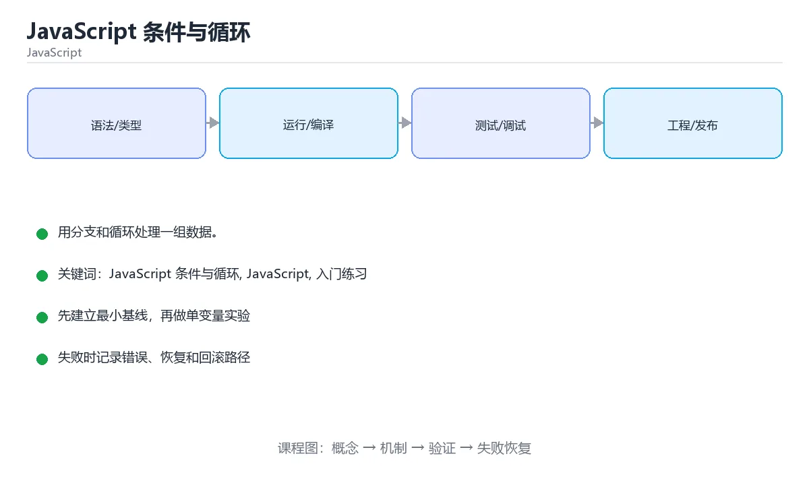

# JavaScript 条件与循环



> 内容更新时间：2026-10-03 · 学习阶段：入门 · 预计用时：15 分钟

## 学习目标

- 先认识「JavaScript 条件与循环」需要的工具、输入和输出。
- 按步骤运行最小示例，并记录结果与错误。
- 用一个边界输入验证自己是否真正掌握。

## 前置知识

- 会进行基本的文件或命令行操作。
- 不需要预先掌握「JavaScript」的高级知识。

## 一句话入门

用分支和循环处理一组数据。

## 最小示例

```javascript
let total = 0;
for (let i = 1; i <= 5; i++) {
  total += i;
}
console.log(`total=${total}`);
```

## 预期输出

```text
total=15
```

## 常见错误

- 把 == 与 === 混用，造成隐式类型转换。
- 复制命令时遗漏空格、引号或必要参数。

## 动手练习

1. 原样运行最小示例，保存命令和输出。
2. 把数字 2 改成 10，预测并验证新结果。
3. 制造一个错误输入，写出错误信息和修复方法。

## 本课小结

- 入门阶段先保证能运行、能观察、能解释，再追求复杂功能。
- 每次只改一个变量，记录预测与实际结果。
- 遇到错误先看第一条错误信息，再回到最小示例。


## 代码实验：把示例跑成证据

这一节不引入新语法，而是把「JavaScript 条件与循环」的最小示例变成可以复现、可以对照的实验。每次只改变一个条件，先写预测，再运行，最后解释差异。

### 实验一：建立基线

```javascript
let total = 0;
for (let i = 1; i <= 5; i++) {
  total += i;
}
console.log(`total=${total}`);
```

先原样运行上面的代码，记录命令、完整输出和退出状态。然后把输出与正文的预期输出逐字对照，不要用“看起来差不多”代替核对；空格、大小写、换行和错误流向都可能暴露环境差异。

### 实验二：只改一个输入

从代码中选一个会影响结果的字面量、参数或输入，把它替换成边界值：数值可尝试 0、1、最大值和最小值，字符串可尝试空串和超长文本，集合可尝试空集合、单元素和重复元素。先写出预测，再运行并记录实际结果。

### 实验三：制造一个可控错误

把一个预期为数字的值改成字符串，或者访问不存在的属性。记录结果是 undefined、NaN 还是类型错误，并说明为什么。

| 实验 | 改动 | 预测 | 实际 | 结论 |
| --- | --- | --- | --- | --- |
| 基线 | 保持原样 |  |  |  |
| 边界 |  |  |  |  |
| 失败 |  |  |  |  |

### 实验四：用三句话复述

1. 输入是什么，哪些输入属于合法范围，哪些属于边界或非法范围？
2. 程序按什么顺序处理输入，在哪一步产生了状态变化或副作用？
3. 输出如何验证，失败时第一条可观察证据是什么？

## JavaScript 基础机制速览

### 引擎、事件循环与执行上下文

JavaScript 是单线程执行模型，调用栈执行同步代码，事件循环在栈清空后处理任务队列和微任务队列。`setTimeout`、Promise、事件回调都通过异步机制排队执行。理解调用栈、任务队列和微任务的顺序，才能解释“为什么日志顺序和代码顺序不同”。浏览器和 Node.js 提供不同的宿主 API，但语言核心相同。

### 变量、作用域与类型转换

`var` 函数作用域且会提升，`let` 和 `const` 块级作用域并有暂时性死区。`const` 禁止重新赋值，但对象内容仍可修改。JavaScript 有原始类型和对象类型，`==` 会做隐式类型转换，`===` 同时比较类型和值；日常判断优先使用 `===`，只有明确需要转换时才用 `==`。`null`、`undefined`、`NaN` 的语义不同，判断存在性时要写清。

### 函数、闭包与 this

函数是一等对象，可以作为参数、返回值和对象属性。闭包让函数记住定义时的词法作用域，常用于回调、模块私有状态和工厂函数。`this` 的值取决于调用方式，普通调用、方法调用、构造函数和箭头函数规则不同；箭头函数不绑定自己的 this，适合回调，不适合需要动态 this 的方法。

### 对象、原型与模块

对象是键值集合，原型链提供属性查找和继承。`class` 是原型继承的语法糖，`extends` 和 `super` 简化继承写法。模块使用 `import`/`export` 显式声明依赖，避免全局污染。不可变数据、展开运算符和结构化克隆各有边界，浅拷贝不会复制嵌套对象。

### Promise、async 与 DOM

Promise 表示未来完成或失败的结果，`async/await` 让异步代码更接近同步写法，但不会把异步变成阻塞。错误要用 try/catch 或 `.catch` 处理，多个独立任务可以用 `Promise.all`，需要全部结束再汇总可以用 `Promise.allSettled`。DOM 操作应批量进行，避免在循环中反复读写布局；事件监听要注意冒泡、捕获、默认行为和移除监听器，防止内存泄漏。

## 本课自测清单与错误对照

下面把「JavaScript 条件与循环」最容易混淆的选项集中起来。不要只记正确答案，要能说明错误选项在什么条件下看似合理、又为什么不能满足题干。

本课测验以直接定义和步骤判断为主。请把每个错误选项改写成一句反例，
说明它在哪个输入、边界或前提变化下会失败。

### 完成标准

- [ ] 能用具体输入复现最小示例，并逐行解释输入、处理与输出。
- [ ] 能只改一个值完成边界实验，并让预测与实际结果一致。
- [ ] 能制造一个可控错误，读出第一条错误信息并完成修复。
- [ ] 能不看书说出本课至少两个易错点和对应的验证方法。

### 复盘记录

| 项目 | 记录 |
| --- | --- |
| 学到的核心机制 |  |
| 仍然不确定的问题 |  |
| 下一步验证动作 |  |


## 考点精讲：把测验题还原成判断过程

本课有 4 个判断点。先自己作答，再看「判断依据」；如果结论正确但理由不完整，回到正文对应章节补足概念。

### 考点 1：示例中的 for 循环累加 1 到 5，输出是什么？

- **正确判断**：total=15，循环覆盖 1 到 5 全部整数
- **判断依据**：正确答案是「total=15，循环覆盖 1 到 5 全部整数」，这道题在问示例中的for循环累加1到5，输出是什么，判断时要把题干限定的输入、边界与目标逐项对齐。let i = 1 且条件 i <= 5 让循环依次累加 1 到 5，得到 15。
- **迁移检查**：把题干里的一个条件换成边界值，原来的结论还成立吗？写出判断过程。

### 考点 2：JavaScript 中判断两个值是否相等时，null 与 undefined 的关系是？

- **正确判断**：使用 == 时二者相等
- **判断依据**：正确答案是「使用 == 时二者相等」，这道题在问JavaScript中判断两个值是否相等时，null与undefined的关系是，判断时要把题干限定的输入、边界与目标逐项对齐。宽松相等的规则规定 null == undefined 为真，且两者相互比较是少数不触发额外类型转换的特例。
- **迁移检查**：如果给某个错误选项去掉一个限定词，它会不会变成正确？说明理由。

### 考点 3：在循环中 break 与 continue 的差别是？

- **正确判断**：break 结束整个循环，continue 进入下一次迭代
- **判断依据**：正确答案是「break 结束整个循环，continue 进入下一次迭代」，这道题在问在循环中break与continue的差别是，判断时要把题干限定的输入、边界与目标逐项对齐。break 立即离开最近的循环或 switch，continue 跳过本轮剩余语句直接开始下一轮。
- **迁移检查**：如果给某个错误选项去掉一个限定词，它会不会变成正确？说明理由。

### 考点 4：下面代码想输出 0、1、2，但实际多输出一个值。问题在哪里？

- **正确判断**：循环条件使用了 <=，应改为 <
- **判断依据**：正确答案是「循环条件使用了 <=，应改为 <」，这道题在问下面代码想输出0、1、2，但实际多输出一个值，问题在哪里，判断时要把题干限定的输入、边界与目标逐项对齐。循环变量从 0 开始，每轮结束后自增。下面代码想输出 0、1、2，但实际多输出一个值。
- **迁移检查**：如果不修复这一处，程序会在哪一步失败？写出第一条错误信息。

## 本课复习清单

离开本课前，逐项确认：

- [ ] 不看解析，能说出「示例中的 for 循环累加 1 到 5，输出是什么？」的判断依据。
- [ ] 不看解析，能说出「JavaScript 中判断两个值是否相等时，null 与 undefined …」的判断依据。
- [ ] 不看解析，能说出「在循环中 break 与 continue 的差别是？」的判断依据。
- [ ] 不看解析，能说出「下面代码想输出 0、1、2，但实际多输出一个值。问题在哪里？」的判断依据。
- [ ] 至少运行一次本课示例，记录输入、输出和一个边界情况。
- [ ] 把本课最容易混淆的两个概念写成一句话对照。

| 复盘项 | 记录 |
| --- | --- |
| 已经能独立解释的考点 |  |
| 仍然说不清的概念 |  |
| 下一步验证动作 |  |

## 逐节复习与自检

下面按正文顺序回顾每一节，并给出一个自检问题；说不清的地方回到原章节补课。

### 最小示例

```javascript
let total = 0;
for (let i = 1; i <= 5; i++) {
  total += i;
}
console.log(`total=${total}`);
```

自检：这一节与相邻主题的边界在哪里？

### 预期输出

```text
total=15
```

自检：这一节与相邻主题的边界在哪里？

### 常见错误

把 == 与 === 混用，造成隐式类型转换。

自检：把这一节讲给没学过的人，最需要强调哪一点？

### 动手练习

把数字 2 改成 10，预测并验证新结果。制造一个错误输入，写出错误信息和修复方法。

自检：如果去掉这一节里的一个前提，结论会怎样变化？

## 术语速查

| 术语 | 本课语境 |
| --- | --- |
| `total=${total}` | console.log(`total=${total}`); |
| `setTimeout` | JavaScript 是单线程执行模型，调用栈执行同步代码，事件循环在栈清空后处理任务队列和微任务队列。`setTimeout`、Promise、事件回调都通过异步机制排队执行。理解调用栈、任务队列和微任务的顺序，才能解释“为什么日志顺序和… |
| `var` | `var` 函数作用域且会提升，`let` 和 `const` 块级作用域并有暂时性死区。`const` 禁止重新赋值，但对象内容仍可修改。JavaScript 有原始类型和对象类型，`==` 会做隐式类型转换，`===` 同时比较类型和值… |
| `let` | `var` 函数作用域且会提升，`let` 和 `const` 块级作用域并有暂时性死区。`const` 禁止重新赋值，但对象内容仍可修改。JavaScript 有原始类型和对象类型，`==` 会做隐式类型转换，`===` 同时比较类型和值… |
| `const` | `var` 函数作用域且会提升，`let` 和 `const` 块级作用域并有暂时性死区。`const` 禁止重新赋值，但对象内容仍可修改。JavaScript 有原始类型和对象类型，`==` 会做隐式类型转换，`===` 同时比较类型和值… |
| `==` | `var` 函数作用域且会提升，`let` 和 `const` 块级作用域并有暂时性死区。`const` 禁止重新赋值，但对象内容仍可修改。JavaScript 有原始类型和对象类型，`==` 会做隐式类型转换，`===` 同时比较类型和值… |
| `===` | `var` 函数作用域且会提升，`let` 和 `const` 块级作用域并有暂时性死区。`const` 禁止重新赋值，但对象内容仍可修改。JavaScript 有原始类型和对象类型，`==` 会做隐式类型转换，`===` 同时比较类型和值… |
| `null` | `var` 函数作用域且会提升，`let` 和 `const` 块级作用域并有暂时性死区。`const` 禁止重新赋值，但对象内容仍可修改。JavaScript 有原始类型和对象类型，`==` 会做隐式类型转换，`===` 同时比较类型和值… |
| `undefined` | `var` 函数作用域且会提升，`let` 和 `const` 块级作用域并有暂时性死区。`const` 禁止重新赋值，但对象内容仍可修改。JavaScript 有原始类型和对象类型，`==` 会做隐式类型转换，`===` 同时比较类型和值… |
| `NaN` | `var` 函数作用域且会提升，`let` 和 `const` 块级作用域并有暂时性死区。`const` 禁止重新赋值，但对象内容仍可修改。JavaScript 有原始类型和对象类型，`==` 会做隐式类型转换，`===` 同时比较类型和值… |
| `this` | 函数是一等对象，可以作为参数、返回值和对象属性。闭包让函数记住定义时的词法作用域，常用于回调、模块私有状态和工厂函数。`this` 的值取决于调用方式，普通调用、方法调用、构造函数和箭头函数规则不同；箭头函数不绑定自己的 this，适合回调… |
| `class` | 对象是键值集合，原型链提供属性查找和继承。`class` 是原型继承的语法糖，`extends` 和 `super` 简化继承写法。模块使用 `import`/`export` 显式声明依赖，避免全局污染。不可变数据、展开运算符和结构化克隆… |

## English Overview

**Title:** JavaScript Conditions and Loops

**Summary:** Process data with branches and loops.

**Category:** JavaScript  
**Level:** 入门  
**Key terms:** JavaScript 条件与循环, JavaScript, 入门练习

> The full tutorial is written in Chinese. This bilingual overview helps English readers identify the topic, scope and key terms before studying the detailed examples.

## 内容元数据

- 内容版本：v2.0
- 最后更新：2026-10-03
- 学习阶段：入门
- 适用环境：Node.js 22+ / 现代浏览器
- 内容来源：内置结构化课程与工程实践整理
- 相关主题：JavaScript 条件与循环、JavaScript、入门练习
- 质量版本：P0 测验标准 + P1 覆盖扩展 + P2 体验补全


## 参考资料与复核

- 最后复核：2026-10-04
- 下次复核：2027-04-04
- 复核范围：版本兼容、API 行为、安全建议与工程实践
- 来源性质：官方文档与标准；本课正文为离线教学重组，不复制原文

| 参考资料 | 本课用途 |
| --- | --- |
| [MDN JavaScript](https://developer.mozilla.org/docs/Web/JavaScript) | 语言、DOM 与运行时 |
| [ECMAScript](https://ecma-international.org/publications-and-standards/standards/ecma-262/) | 语言标准 |

> 本课主题：用分支和循环处理一组数据。

> App 完全离线展示文字链接，不会自动联网；需要延伸阅读时可复制链接到浏览器。
