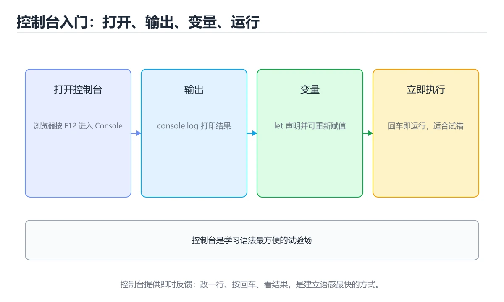
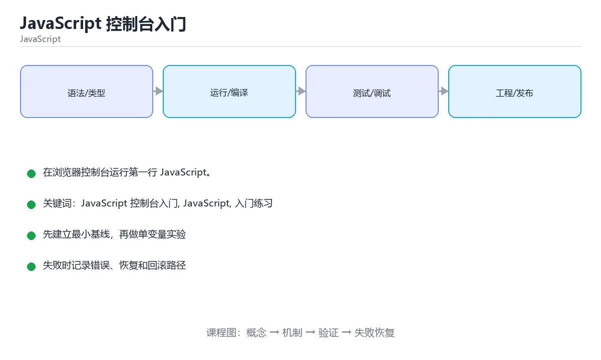

# JavaScript 控制台入门

> 内容更新时间：2026-10-06 · 学习阶段：入门 · 预计用时：45 分钟





## 本节知识框架

**课程定位**：所属分类 `javascript`（JavaScript），课程主题 `JavaScript 控制台入门`，学习阶段 入门，建议用时 60 分钟。

本课主线：在浏览器控制台运行第一行 JavaScript。

**学完本课应当能够**
- 说清 `控制台（Console）` 与 `console.log` 的含义与区别，并各举一个正例和一个反例。
- 用本课示例验证 `表达式与语句` 的行为，记录输入、输出与失败条件。
- 遇到「只看页面不看控制台」这类问题时，能说出触发条件与修复顺序。

### 从概念到验证的学习链条

1. `控制台（Console）`：先掌握 浏览器开发者工具里查看日志与报错的面板，再用它解释 `console.log` 为什么会出现。
2. `console.log`：先掌握 把值打印到控制台，是排查 JavaScript 的第一步，再用它解释 `表达式与语句` 为什么会出现。
3. `表达式与语句`：先掌握 表达式产生值，语句执行动作，分号可选但换行规则要注意，再用它解释 `浏览器运行环境` 为什么会出现。
4. `浏览器运行环境`：先掌握 JavaScript 在浏览器里能访问 window、document 等宿主对象，再用它解释 `函数` 为什么会出现。
5. `函数`：先掌握 函数是一等对象，可以作为参数、返回值和对象属性，再用它解释 `闭包` 为什么会出现。
6. `闭包`：先掌握 闭包让函数记住定义时的词法作用域，常用于回调、模块私有状态和工厂函数，再用它解释 本课示例的观察结果 为什么会出现。

**先修与衔接**：本课是「JavaScript」分类的第 1 课。相关或后续课程：《JavaScript 变量与类型入门》。

### 完成判据

- **定义关**：不看正文也能说明 `控制台（Console）` 是 浏览器开发者工具里查看日志与报错的面板，并指出一个反例。
- **机制关**：能按“输入 → 转换 → 输出 → 验证”复述 `JavaScript 控制台入门`，而不是只背结论。
- **示例关**：能运行或推演 `JavaScript 控制台入门` 的 `javascript` 示例，并说明一个真实出现的标识符或字面量。
- **证据关**：能指出 `JavaScript 控制台入门` 示例里的 调用了 `log()`，并说明它支持或反驳了本课的哪一条结论。
- **排错关**：能复现 只看页面不看控制台，记录现象并按 先看控制台的第一条错误 修复。
- **迁移关**：能把 `JavaScript 控制台入门`、`JavaScript`、`入门练习` 放进一个与 `JavaScript 控制台入门` 不同的项目场景，并保持输入与验证条件可追踪。
- **复盘关**：学完 `JavaScript 控制台入门` 后，用一句话写下仍然不确定的结论，并列出下一次验证需要的输入、环境和成功判据。

### 复习清单

- [ ] 能不看正文复述本课核心术语，并指出一个边界或反例。
- [ ] 能运行或推演本课示例，记录输入、输出与失败现象。
- [ ] 能完成一次自测，并把错题对照错误表定位原因。

## 核心概念定义

| 术语 | 操作性定义 | 常见边界与风险 |
| --- | --- | --- |
| 控制台（Console） | 浏览器开发者工具里查看日志与报错的面板。 | 只在「浏览器开发者工具里查看日志与报错的面板」这一前提下成立，换输入或换环境要重新验证。 |
| console.log | 把值打印到控制台，是排查 JavaScript 的第一步。 | 只在「把值打印到控制台，是排查 JavaScript 的第一步」这一前提下成立，换输入或换环境要重新验证。 |
| 表达式与语句 | 表达式产生值，语句执行动作，分号可选但换行规则要注意。 | 只在「表达式产生值，语句执行动作，分号可选但换行规则要注意」这一前提下成立，换输入或换环境要重新验证。 |
| 浏览器运行环境 | JavaScript 在浏览器里能访问 window、document 等宿主对象。 | 只在「JavaScript 在浏览器里能访问 window、document 等宿主对象」这一前提下成立，换输入或换环境要重新验证。 |
| 函数 | 函数是一等对象，可以作为参数、返回值和对象属性 | 结果依赖数据分布、模型版本与算力预算，换数据集或换硬件都要重新评估。 |
| 闭包 | 闭包让函数记住定义时的词法作用域，常用于回调、模块私有状态和工厂函数 | 缓存与状态残留会让结果过期，先明确失效策略再判断正确性。 |

## 原理与运行机制

### 机制总览

**教材衔接：一句话入门**

在浏览器控制台运行第一行 JavaScript。

**教材衔接：JavaScript 基础机制速览**

### 引擎、事件循环与执行上下文

JavaScript 是单线程执行模型，调用栈执行同步代码，事件循环在栈清空后处理任务队列和微任务队列。`setTimeout`、Promise、事件回调都通过异步机制排队执行。理解调用栈、任务队列和微任务的顺序，才能解释“为什么日志顺序和代码顺序不同”。浏览器和 Node.js 提供不同的宿主 API，但语言核心相同。

### 变量、作用域与类型转换

`var` 函数作用域且会提升，`let` 和 `const` 块级作用域并有暂时性死区。`const` 禁止重新赋值，但对象内容仍可修改。JavaScript 有原始类型和对象类型，`==` 会做隐式类型转换，`===` 同时比较类型和值；日常判断优先使用 `===`，只有明确需要转换时才用 `==`。`null`、`undefined`、`NaN` 的语义不同，判断存在性时要写清。

### 函数、闭包与 this

函数是一等对象，可以作为参数、返回值和对象属性。闭包让函数记住定义时的词法作用域，常用于回调、模块私有状态和工厂函数。`this` 的值取决于调用方式，普通调用、方法调用、构造函数和箭头函数规则不同；箭头函数不绑定自己的 this，适合回调，不适合需要动态 this 的方法。

### 对象、原型与模块

对象是键值集合，原型链提供属性查找和继承。`class` 是原型继承的语法糖，`extends` 和 `super` 简化继承写法。模块使用 `import`/`export` 显式声明依赖，避免全局污染。不可变数据、展开运算符和结构化克隆各有边界，浅拷贝不会复制嵌套对象。

### Promise、async 与 DOM

Promise 表示未来完成或失败的结果，`async/await` 让异步代码更接近同步写法，但不会把异步变成阻塞。错误要用 try/catch 或 `.catch` 处理，多个独立任务可以用 `Promise.all`，需要全部结束再汇总可以用 `Promise.allSettled`。DOM 操作应批量进行，避免在循环中反复读写布局；事件监听要注意冒泡、捕获、默认行为和移除监听器，防止内存泄漏。

**教材衔接：版本与时效**

- 运行时要同时考虑浏览器基线与 Node LTS；JavaScript 控制台入门 的降级策略要写清楚。
- 升级前先用 JavaScript 建立基线：记录版本、命令和输出，升级后只比较这些可观察量。

### 升级检查清单

- 先固定当前版本，跑通全部示例与测验，再升级工具链。
- 升级时只动一个依赖版本，用 JavaScript 记录构建与运行结果。
- 回归范围锁定 JavaScript 的默认行为，并确认弃用警告是否出现在构建输出里。
- 升级后把 JavaScript 的实测版本写进「内容元数据」，再更新复核日期。

### 机制拆解：每一步的输入、动作与输出

#### 1. `控制台（Console）`
- 输入：`JavaScript 控制台入门`；本步把 浏览器开发者工具里查看日志与报错的面板 当作判断规则。
- 动作：围绕 `控制台（Console）` 保留中间状态，并记录它与 `console.log` 的对应关系。
- 输出：`console.log`，它可以被下一段代码、测试或记录继续使用。
- `控制台（Console）` 的失败条件：只在「浏览器开发者工具里查看日志与报错的面板」这一前提下成立，换输入或换环境要重新验证。

#### 2. `console.log`
- 输入：`控制台（Console）`；本步把 把值打印到控制台，是排查 JavaScript 的第一步 当作判断规则。
- 动作：围绕 `console.log` 保留中间状态，并记录它与 `表达式与语句` 的对应关系。
- 输出：`表达式与语句`，它可以被下一段代码、测试或记录继续使用。
- `console.log` 的失败条件：只在「把值打印到控制台，是排查 JavaScript 的第一步」这一前提下成立，换输入或换环境要重新验证。

#### 3. `表达式与语句`
- 输入：`console.log`；本步把 表达式产生值，语句执行动作，分号可选但换行规则要注意 当作判断规则。
- 动作：围绕 `表达式与语句` 保留中间状态，并记录它与 `浏览器运行环境` 的对应关系。
- 输出：`浏览器运行环境`，它可以被下一段代码、测试或记录继续使用。
- `表达式与语句` 的失败条件：只在「表达式产生值，语句执行动作，分号可选但换行规则要注意」这一前提下成立，换输入或换环境要重新验证。

#### 4. `浏览器运行环境`
- 输入：`表达式与语句`；本步把 JavaScript 在浏览器里能访问 window、document 等宿主对象 当作判断规则。
- 动作：围绕 `浏览器运行环境` 保留中间状态，并记录它与 `函数` 的对应关系。
- 输出：`函数`，它可以被下一段代码、测试或记录继续使用。
- `浏览器运行环境` 的失败条件：只在「JavaScript 在浏览器里能访问 window、document 等宿主对象」这一前提下成立，换输入或换环境要重新验证。

#### 5. `函数`
- 输入：`浏览器运行环境`；本步把 函数是一等对象，可以作为参数、返回值和对象属性 当作判断规则。
- 动作：围绕 `函数` 保留中间状态，并记录它与 `闭包` 的对应关系。
- 输出：`闭包`，它可以被下一段代码、测试或记录继续使用。
- `函数` 的失败条件：结果依赖数据分布、模型版本与算力预算，换数据集或换硬件都要重新评估。

#### 6. `闭包`
- 输入：`函数`；本步把 闭包让函数记住定义时的词法作用域，常用于回调、模块私有状态和工厂函数 当作判断规则。
- 动作：围绕 `闭包` 保留中间状态，并记录它与 `log` 的对应关系。
- 输出：`log`，它可以被下一段代码、测试或记录继续使用。
- `闭包` 的失败条件：缓存与状态残留会让结果过期，先明确失效策略再判断正确性。

### 示例中的可观察事实

1. 调用了 `log()`；它对应的课程主题是 `JavaScript 控制台入门`。
2. 出现字面量 `hello from JavaScript`；它对应的课程主题是 `JavaScript 控制台入门`。

### 复现实验记录

- 环境：`JavaScript 控制台入门` 使用 `javascript` 示例，固定 `JavaScript 控制台入门`、`JavaScript`、`入门练习` 作为第一组条件。
- 首轮输入：先确认 调用了 `log()`，预测 `控制台（Console）` 会怎样变化。
- 基线观察：记录命令、输入、输出和错误原文，不用截图代替可复制的文本。
- 单变量修改：只改变 `JavaScript 控制台入门`，观察 `闭包` 是否仍满足定义。
- 失败注入：复现 只看页面不看控制台，确认现象是 脚本报错被误判成样式问题。
- 记录结论：把“修改前、修改后、预期变化、实际变化”写成四列表，这样复盘 `JavaScript 控制台入门` 时才能区分概念错误与实现错误。

## 典型应用场景

**教材衔接：代码实验：把示例跑成证据**

### 实验一：建立基线

```javascript
console.log("hello from JavaScript");
```

### 实验二：只改一个输入

沿用「JavaScript 控制台入门」的最小示例做一次单变量实验：

做完后用一句话写出「JavaScript 控制台入门」的结论：输入怎么变，结果才怎么变。

### 实验三：制造一个可控错误

给 JavaScript 一个非法输入，说明它属于哪一类失败并给出修复方向。

### 实验四：用三句话复述

1. 先写清 JavaScript 控制台入门 的输入契约：类型、范围、缺省值与非法值分别怎么处理？
2. JavaScript 的执行顺序里，哪一步会写数据或产生外部副作用？
3. 输出如何验证，失败时第一条可观察证据是什么？

- **只看页面不看控制台**：典型现象是脚本报错被误判成样式问题；正确做法是先看控制台的第一条错误。
- **打印对象却看到后续修改**：典型现象是打印的是引用，不是当时的快照；正确做法是需要快照时先复制或序列化。
- **脚本放在目标元素之前**：典型现象是查询结果为 null；正确做法是脚本放到末尾或等文档加载完成。

### 最小验证场景

- 准备：保留 `javascript` 示例的原始输入，先记录 `JavaScript 控制台入门` 的基线输出和完整运行命令。
- 观察：先核对 调用了 `log()`，再改变一个与 `控制台（Console）` 相关的条件。
- 判定：新结果与 `JavaScript 控制台入门` 的基线不同不等于错误；只有当差异破坏了 `控制台（Console）` 的定义或错误表中的约束，才判定为失败。

### 选择与边界

- 使用 `控制台（Console）` 时，先满足它的定义：浏览器开发者工具里查看日志与报错的面板；只在「浏览器开发者工具里查看日志与报错的面板」这一前提下成立，换输入或换环境要重新验证。
- 使用 `console.log` 时，先满足它的定义：把值打印到控制台，是排查 JavaScript 的第一步；只在「把值打印到控制台，是排查 JavaScript 的第一步」这一前提下成立，换输入或换环境要重新验证。
- 使用 `表达式与语句` 时，先满足它的定义：表达式产生值，语句执行动作，分号可选但换行规则要注意；只在「表达式产生值，语句执行动作，分号可选但换行规则要注意」这一前提下成立，换输入或换环境要重新验证。
- 使用 `浏览器运行环境` 时，先满足它的定义：JavaScript 在浏览器里能访问 window、document 等宿主对象；只在「JavaScript 在浏览器里能访问 window、document 等宿主对象」这一前提下成立，换输入或换环境要重新验证。
- 使用 `函数` 时，先满足它的定义：函数是一等对象，可以作为参数、返回值和对象属性；结果依赖数据分布、模型版本与算力预算，换数据集或换硬件都要重新评估。

## 代码/协议/SQL 示例

### 最小可验证示例

```javascript
console.log("hello from JavaScript");
```

**教材衔接：最小示例**

```javascript
console.log("hello from JavaScript");
```

**教材衔接：预期输出**

```text
hello from JavaScript
```

**教材衔接：零基础通俗讲：JavaScript 从控制台开始**

### 一句话说清它是什么

console.log 把内容打印到控制台，是 JavaScript 最直接的观察手段；写好代码后可以放进浏览器控制台或 Node.js 立刻运行。

### 用生活比喻理解

console.log 像在代码里插了一排小灯泡：程序走到哪儿、变量是什么值，灯一亮你就看到了。排查问题时先点灯，再谈修复。

### 完整可运行代码

```javascript
console.log("你好，JavaScript");

const name = "小明";
console.log(`欢迎，${name}`);
```

### 逐行拆开看

- `console.log("你好，JavaScript");` 调用 console 对象的 log 方法，把参数打印到控制台并换行。
- `const name = "小明";` 用 const 声明一个常量，声明后不能重新赋值，适合不会变的数据。
- 反引号包起来的是模板字符串，里面用美元符号加花括号把变量嵌进文字，比用加号拼接更清楚。
- 每条语句结尾的分号可以省略，但团队项目里建议统一保留，避免个别场景下的解析歧义。
- JavaScript 文件保存为 `.js`，在浏览器里通过 `<script src="...">` 引入，或在 Node.js 里用 `node 文件名.js` 运行。

### 把程序跑一遍

- 第一行执行，控制台出现「你好，JavaScript」。
- const 声明把「小明」存进 name。
- 模板字符串求值时把 name 换成实际内容，第二行输出「欢迎，小明」。
- 脚本执行完毕，全局作用域里留下一个名为 name 的常量。

### 新手最容易踩的坑

- 把 `console.log` 写成 `console.Log`：JavaScript 区分大小写，会报「不是函数」。
- 在浏览器里打开 HTML 却看不到输出：控制台不在页面上，要按 F12 打开开发者工具。
- 给 const 变量重新赋值：`name = "小红"` 会抛 TypeError。
- 中文全角引号或括号：看起来一样但不是合法符号，报 SyntaxError。
- 用 document.write 代替 console.log：会直接覆盖页面内容，调试时非常危险。

### 动手练一练

- 把输出改成自己的名字，在浏览器控制台和 Node.js 里各运行一次，比较结果。
- 用一个变量保存年龄，再用模板字符串输出一整句话。
- 故意把 `console.log` 写成 `console.logg`，记录报错信息。

### 本课速查卡

把下面八行抄进自己的笔记，复习时只看这一页就能回忆整课：

| 复习项 | 本课要点 |
| --- | --- |
| 核心结论 | console.log 把内容打印到控制台，是 JavaScript 最直接的观察手段；写好代码后可以放进浏览器控制台或 Node.js 立刻运行。 |
| 最少要写的代码 | `console.log("你好，JavaScript");` |
| 正确做法 | 第一行执行，控制台出现「你好，JavaScript」。 |
| 最常见的错误 | 把 `console.log` 写成 `console.Log`：JavaScript 区分大小写，会报「不是函数」。 |
| 出错先查什么 | 先读第一条报错信息，再回到最小示例只改一个地方 |
| 怎么确认学会了 | 把输出改成自己的名字，在浏览器控制台和 Node.js 里各运行一次，比较结果。 |
| 和别的知识点的关系 | 本课打下的语法与思维方式会被后面每一课反复用到 |
| 接下来做什么 | 合上教程，凭记忆把上面的最小代码重写一遍再运行 |

**运行方式**：运行 `JavaScript 控制台入门` 的示例时，保存为 `.js` 后用 `node 文件名.js` 运行；涉及浏览器 API 的示例要放到页面里执行。

### 示例精读：先找证据，再改一个条件

1. 调用了 `log()`；它出现在 `JavaScript 控制台入门` 的示例中，阅读时先确认它前后各发生了什么。
2. 出现字面量 `hello from JavaScript`；它出现在 `JavaScript 控制台入门` 的示例中，阅读时先确认它前后各发生了什么。
- 在 `JavaScript 控制台入门` 中与 `控制台（Console）` 对照：示例必须能支持 浏览器开发者工具里查看日志与报错的面板，否则说明这一段还缺少实现或验证步骤。
- 在 `JavaScript 控制台入门` 中与 `console.log` 对照：示例必须能支持 把值打印到控制台，是排查 JavaScript 的第一步，否则说明这一段还缺少实现或验证步骤。
- 在 `JavaScript 控制台入门` 中与 `表达式与语句` 对照：示例必须能支持 表达式产生值，语句执行动作，分号可选但换行规则要注意，否则说明这一段还缺少实现或验证步骤。
- 在 `JavaScript 控制台入门` 中与 `浏览器运行环境` 对照：示例必须能支持 JavaScript 在浏览器里能访问 window、document 等宿主对象，否则说明这一段还缺少实现或验证步骤。

## 时间/空间复杂度或性能分析

**性能关注点（JavaScript 控制台入门）**：事件循环与 DOM 操作是瓶颈来源：记录脚本执行时间、长任务与主线程阻塞时长。

**本课特有开销（JavaScript 控制台入门 · JavaScript 控制台入门）**：小文件看元数据开销，大文件看吞吐，两者要分别测量。

**测量方法**：以 `JavaScript 控制台入门` 的 `JavaScript 控制台入门` 场景为对象，固定输入跑一遍记录基线，再把规模或并发度提高一个数量级复测；两次结果的差值与波动范围才是结论依据。

### 需要控制的变量与记录项

- `JavaScript 控制台入门` 的 `JavaScript 控制台入门`：固定它的版本、输入范围和资源上限，分别记录速度、内存与失败率的变化。
- `JavaScript 控制台入门` 的 `JavaScript`：固定它的版本、输入范围和资源上限，分别记录速度、内存与失败率的变化。
- `JavaScript 控制台入门` 的 `入门练习`：固定它的版本、输入范围和资源上限，分别记录速度、内存与失败率的变化。
- `JavaScript 控制台入门` 中 `控制台（Console）` 的边界：只在「浏览器开发者工具里查看日志与报错的面板」这一前提下成立，换输入或换环境要重新验证。达到边界时不要外推，必须重新测量。
- `JavaScript 控制台入门` 中 `console.log` 的边界：只在「把值打印到控制台，是排查 JavaScript 的第一步」这一前提下成立，换输入或换环境要重新验证。达到边界时不要外推，必须重新测量。
- `JavaScript 控制台入门` 中 `表达式与语句` 的边界：只在「表达式产生值，语句执行动作，分号可选但换行规则要注意」这一前提下成立，换输入或换环境要重新验证。达到边界时不要外推，必须重新测量。
- `JavaScript 控制台入门` 中 `浏览器运行环境` 的边界：只在「JavaScript 在浏览器里能访问 window、document 等宿主对象」这一前提下成立，换输入或换环境要重新验证。达到边界时不要外推，必须重新测量。
- `JavaScript 控制台入门` 中 `函数` 的边界：结果依赖数据分布、模型版本与算力预算，换数据集或换硬件都要重新评估。达到边界时不要外推，必须重新测量。
- `JavaScript 控制台入门` 的代码证据：先验证 调用了 `log()`，再记录该路径的输入规模与耗时；只看代码行数不能推出复杂度。

## 常见误区与易错点

| 容易写错的做法 | 实际现象 | 原因与正确做法 |
| --- | --- | --- |
| 只看页面不看控制台 | 脚本报错被误判成样式问题。 | 先看控制台的第一条错误。 |
| 打印对象却看到后续修改 | 打印的是引用，不是当时的快照。 | 需要快照时先复制或序列化。 |
| 脚本放在目标元素之前 | 查询结果为 null。 | 脚本放到末尾或等文档加载完成。 |

### 现场 1：只看页面不看控制台

**症状**：脚本报错被误判成样式问题。

**根因与修复**：先看控制台的第一条错误。

**自检**：在本课示例里复现「只看页面不看控制台」，改成先看控制台的第一条错误后重跑；如果症状消失且失败路径按预期变化，说明定位正确。

### 现场 2：打印对象却看到后续修改

**症状**：打印的是引用，不是当时的快照。

**根因与修复**：需要快照时先复制或序列化。

**自检**：在本课示例里复现「打印对象却看到后续修改」，改成需要快照时先复制或序列化后重跑；如果症状消失且失败路径按预期变化，说明定位正确。

### 现场 3：脚本放在目标元素之前

**症状**：查询结果为 null。

**根因与修复**：脚本放到末尾或等文档加载完成。

**自检**：在本课示例里复现「脚本放在目标元素之前」，改成脚本放到末尾或等文档加载完成后重跑；如果症状消失且失败路径按预期变化，说明定位正确。

## 与其他知识点的关系

**教材衔接：复习与迁移**

### 概念复述

- 用一句话说明「JavaScript 控制台入门」解决什么问题：在浏览器控制台运行第一行 JavaScript。
- 写出JavaScript 控制台入门、JavaScript、入门练习之间的关系，并各举一个例子。
- 说出本课最容易混淆的两个概念，以及区分它们的判据。

### 正文逐节复核

- **一句话入门**：在浏览器控制台运行第一行 JavaScript。
- **JavaScript 基础机制速览**：JavaScript 是单线程执行模型，调用栈执行同步代码，事件循环在栈清空后处理任务队列和微任务队列。


### 迁移练习

- **相关或后续**：`JavaScript 变量与类型入门`。本课术语会在这些课程里继续使用。
- **术语归属**：`控制台（Console）`、`console.log`、`表达式与语句` 的定义以本课「核心概念定义」为准，换到其他课程时先确认定义是否被改写。
- 同一分类的《JavaScript 变量与类型入门》也涉及 `JavaScript`；两课衔接时先确认这个术语的定义是否一致。
- 同一分类的《JavaScript 条件与循环》也涉及 `JavaScript`；两课衔接时先确认这个术语的定义是否一致。

### 先修与后续术语接口

- `JavaScript 变量与类型入门`：共享术语 `函数`、`闭包`，共同关键词 `JavaScript`、`入门练习`。

### 容易混淆的相邻概念

- `控制台（Console）` 与 `console.log`：前者强调 浏览器开发者工具里查看日志与报错的面板；后者强调 把值打印到控制台，是排查 JavaScript 的第一步。判断时分别检查两条定义的适用范围，不要只看名称相似就互换。
- `console.log` 与 `表达式与语句`：前者强调 把值打印到控制台，是排查 JavaScript 的第一步；后者强调 表达式产生值，语句执行动作，分号可选但换行规则要注意。判断时分别检查两条定义的适用范围，不要只看名称相似就互换。
- `表达式与语句` 与 `浏览器运行环境`：前者强调 表达式产生值，语句执行动作，分号可选但换行规则要注意；后者强调 JavaScript 在浏览器里能访问 window、document 等宿主对象。判断时分别检查两条定义的适用范围，不要只看名称相似就互换。
- `浏览器运行环境` 与 `函数`：前者强调 JavaScript 在浏览器里能访问 window、document 等宿主对象；后者强调 函数是一等对象，可以作为参数、返回值和对象属性。判断时分别检查两条定义的适用范围，不要只看名称相似就互换。
- `函数` 与 `闭包`：前者强调 函数是一等对象，可以作为参数、返回值和对象属性；后者强调 闭包让函数记住定义时的词法作用域，常用于回调、模块私有状态和工厂函数。判断时分别检查两条定义的适用范围，不要只看名称相似就互换。

## 自测题与参考答案

> 先独立作答，再对照参考答案；答案都能在本课正文、术语表或错误表里找到依据。

### 自测 1（概念复述）

不看正文，写出 `控制台（Console）` 的操作性定义，并说明它与 `console.log` 的区别。

**参考答案**：浏览器开发者工具里查看日志与报错的面板。

`console.log` 的定位是：把值打印到控制台，是排查 JavaScript 的第一步；两者的差别要从适用对象与失败模式上说明。

### 自测 2（排错）

本课错误表记录了「只看页面不看控制台」这类做法。请写出它会出现的现象、根因，以及修复顺序。

**参考答案**：现象是脚本报错被误判成样式问题；正确做法是先看控制台的第一条错误。修复时先复现现象并保留证据，再改动一处假设重跑，确认现象消失。

### 自测 3（动手验证）

运行本课的 `javascript` 示例，把其中的 `"hello from JavaScript"` 换成一个边界值后重新运行，记录输出与错误信息。

**参考答案**：正常输入下 `javascript` 示例应当复现正文给出的结果；把 `"hello from JavaScript"` 换成边界值后，如果结果改变或报错，先核对它是否满足 `JavaScript 控制台入门` 中`控制台（Console）` 的适用范围，再检查错误表里是否有同类现象。

### 自测 4（代码阅读）

阅读本课开头的 `javascript` 示例，说明它体现了`控制台（Console）` 的哪一条性质，并指出改动哪个输入会让这条性质不再成立。

**参考答案**：`控制台（Console）` 的定义是 浏览器开发者工具里查看日志与报错的面板，示例正是在实现这条定义。改动与 `控制台（Console）` 有关的一个输入后，如果结果不再符合 `JavaScript 控制台入门` 的正文描述，就说明该性质只在当前前提成立。

### 自测 5（迁移）

把 `JavaScript 控制台入门` 的方法迁移到自己的项目：围绕 `控制台（Console）` 写出一个与错误表同类的风险点，并说明触发条件和检验方式。

**参考答案**：例如「脚本放在目标元素之前」，它会导致查询结果为 null；检验方式是按脚本放到末尾或等文档加载完成改一处再复现，确认现象消失且没有引入新的失败分支。

### 自测 6（对比）

用一个表格对比 `控制台（Console）` 与 `console.log`：各写一行适用场景、一行失败表现。

**参考答案**：`控制台（Console）` 的定义是浏览器开发者工具里查看日志与报错的面板；`console.log` 的定义是把值打印到控制台，是排查 JavaScript 的第一步。两者的失败表现分别对应本课错误表里与本术语相关的行。

### 自测 7（排错顺序）

面对「只看页面不看控制台」引发的问题，请把“复现 脚本报错被误判成样式问题 → 保留证据 → 先看控制台的第一条错误 → 回归验证”四步写成可执行的检查清单。

**参考答案**：第一步按脚本报错被误判成样式问题复现；第二步记录输入、版本与完整报错；第三步按先看控制台的第一条错误只改一处；第四步重跑并确认失败路径也按预期变化。

### 自测 8（边界判断）

针对 `闭包`，分别写出“可以使用”的条件和“结论不再成立”的条件。

**参考答案**：缓存与状态残留会让结果过期，先明确失效策略再判断正确性。 同时要把 `闭包` 的定义 闭包让函数记住定义时的词法作用域，常用于回调、模块私有状态和工厂函数 与实际输入逐项对照。

### 自测 9（机制重建）

不看正文，按输入、转换、输出、验证四段重建 `控制台（Console）` → `console.log` → `表达式与语句` → `浏览器运行环境` 的作用链。

**参考答案**：起点是 `控制台（Console）` 的定义 浏览器开发者工具里查看日志与报错的面板；中间每一步都保留可观察状态；终点由 `闭包` 检查，失败时回到错误表定位第一个偏离定义的步骤。

### 自测 10（综合排错）

在 `JavaScript 控制台入门` 中，现象是 查询结果为 null。请围绕 脚本放在目标元素之前 写出最小复现、关键证据、修复动作和回归验证，并说明为什么不能只凭一次运行下结论。

**参考答案**：先复现 脚本放在目标元素之前，记录输入与完整错误；再按 脚本放到末尾或等文档加载完成 只改一处。回归时同时跑正常路径和边界路径，只有两次结果都可解释，才把修复视为完成。

### 自测 11（一分钟复述）

用每分钟约 200 字的速度复述 `JavaScript 控制台入门`：先给主问题，再按顺序说出 `控制台（Console）`、`console.log`、`表达式与语句`、`浏览器运行环境`，最后给一个失败案例。

**自评标准**：主问题必须对应 在浏览器控制台运行第一行 JavaScript；每个术语都要能接上一句定义或边界；失败案例必须写成可观察现象，不能用“可能有风险”代替证据。

## 术语速查

| 术语 | 一句话说明 |
| --- | --- |
| `控制台（Console）` | 浏览器开发者工具里查看日志与报错的面板。 |
| `console.log` | 把值打印到控制台，是排查 JavaScript 的第一步。 |
| `表达式与语句` | 表达式产生值，语句执行动作，分号可选但换行规则要注意。 |
| `浏览器运行环境` | JavaScript 在浏览器里能访问 window、document 等宿主对象。 |
| `函数` | 函数是一等对象，可以作为参数、返回值和对象属性。 |
| `闭包` | 闭包让函数记住定义时的词法作用域，常用于回调、模块私有状态和工厂函数。 |

**术语关系**：`控制台（Console）`（浏览器开发者工具里查看日志与报错的面板） → `console.log`（把值打印到控制台） → `表达式与语句`（表达式产生值） → `浏览器运行环境`（JavaScript 在浏览器里能访问 window、document 等宿主对象）。

## 考点精讲

`JavaScript 控制台入门` 的题库有 5 道题，下面逐题给出题干、正确项与判断依据：先自己作答，再核对正确项，最后回到正文对应小节复核。

### 考点 1：第 1 题

- **题目**：阅读 `JavaScript 控制台入门` 的 `控制台（Console）` 示例。它服务于在浏览器控制台运行第一行 JavaScript。代码中实际包含下列哪一项？
- **正确项**：出现字面量 `hello from JavaScript`
- **判断依据**：这道题落在术语 `控制台（Console）` 上：浏览器开发者工具里查看日志与报错的面板。复习时把 `控制台（Console）` 的定义、适用边界和一个反例一起说清楚，再回到「核心概念定义」核对原文。

### 考点 2：第 2 题

- **题目**：为什么现代 JavaScript 更推荐使用 === 而不是 ==？
- **正确项**：=== 不做隐式类型转换，比较结果更可预测
- **判断依据**：这道题检验本课主问题：在浏览器控制台运行第一行 JavaScript。复习时先复述本课主问题，再举一个会让结论失效的输入。

### 考点 3：第 3 题

- **题目**：围绕“JavaScript 控制台入门”中的 JavaScript 控制台入门、JavaScript、入门练习，下列哪两项是本课强调的实践判断？
- **正确项**：验证 JavaScript 时要固定版本并覆盖边界输入，结论才可复现；学习 JavaScript 控制台入门 时要同时说明输入、输出和失败路径，不能只看正常流程
- **判断依据**：这道题检验本课主问题：在浏览器控制台运行第一行 JavaScript。复习时先复述本课主问题，再举一个会让结论失效的输入。

### 考点 4：第 4 题

- **题目**：示例代码末尾的分号在 JavaScript 中意味着什么？
- **正确项**：表示一条语句结束，多数情况下可以省略但建议保留
- **判断依据**：这道题检验本课主问题：在浏览器控制台运行第一行 JavaScript。复习时先复述本课主问题，再举一个会让结论失效的输入。

### 考点 5：第 5 题

- **题目**：填空：补齐下面这段术语说明中的空缺。课程 `在浏览器控制台运行第一行 JavaScript。`，这段说明是：`____`：浏览器开发者工具里查看日志与报错的面板。空缺处应填哪个术语？
- **正确项**：控制台（Console）
- **判断依据**：这道题落在术语 `控制台（Console）` 上：浏览器开发者工具里查看日志与报错的面板。复习时把 `控制台（Console）` 的定义、适用边界和一个反例一起说清楚，再回到「核心概念定义」核对原文。

### 考点 6：`控制台（Console）`

- **要点**：浏览器开发者工具里查看日志与报错的面板。
- **控制台（Console） 的边界**：只在「浏览器开发者工具里查看日志与报错的面板」这一前提下成立，换输入或换环境要重新验证。

### 考点 7：`console.log`

- **要点**：把值打印到控制台，是排查 JavaScript 的第一步。
- **console.log 的边界**：只在「把值打印到控制台，是排查 JavaScript 的第一步」这一前提下成立，换输入或换环境要重新验证。

### 考点 8：`表达式与语句`

- **要点**：表达式产生值，语句执行动作，分号可选但换行规则要注意。
- **表达式与语句 的边界**：只在「表达式产生值，语句执行动作，分号可选但换行规则要注意」这一前提下成立，换输入或换环境要重新验证。

### 考点 9：`浏览器运行环境`

- **要点**：JavaScript 在浏览器里能访问 window、document 等宿主对象。
- **浏览器运行环境 的边界**：只在「JavaScript 在浏览器里能访问 window、document 等宿主对象」这一前提下成立，换输入或换环境要重新验证。

### 考点 10：`函数`

- **要点**：函数是一等对象，可以作为参数、返回值和对象属性
- **函数 的边界**：结果依赖数据分布、模型版本与算力预算，换数据集或换硬件都要重新评估。

### 考点 11：`闭包`

- **要点**：闭包让函数记住定义时的词法作用域，常用于回调、模块私有状态和工厂函数
- **闭包 的边界**：缓存与状态残留会让结果过期，先明确失效策略再判断正确性。

### 考点 12：排错——只看页面不看控制台

- **现象**：脚本报错被误判成样式问题。
- **处理**：先看控制台的第一条错误。

### 考点 13：排错——打印对象却看到后续修改

- **现象**：打印的是引用，不是当时的快照。
- **处理**：需要快照时先复制或序列化。

### 考点 14：综合辨析——`控制台（Console）` 与 `闭包`

- **辨析点**：`控制台（Console）` 的定义是 浏览器开发者工具里查看日志与报错的面板；`闭包` 的定义是 闭包让函数记住定义时的词法作用域，常用于回调、模块私有状态和工厂函数。
- **答题要求**：面对 `JavaScript 控制台入门` 的题目，先判断描述的是 `控制台（Console）` 还是 `闭包`，再归到对应定义，最后写出一个会让该定义失效的边界输入。

### 考点 15：排错评分点

- **现象分**：能写出 脚本报错被误判成样式问题，而不是只写“程序有错”。
- **证据分**：保留触发 只看页面不看控制台 的输入、版本和错误原文。
- **修复分**：按 先看控制台的第一条错误 只改一处，并同时回归正常路径与边界路径。

## 内容元数据

- 内容版本：v2.0
- 最后更新：2026-10-06
- 学习阶段：入门
- 适用环境：Node.js 22+ / 现代浏览器；本课聚焦 JavaScript 控制台入门。
- 内容来源：内置结构化课程与工程实践整理
- 相关主题：JavaScript 控制台入门、JavaScript、入门练习
- 质量版本：P0 测验标准 + P1 覆盖扩展 + P2 体验补全

## 参考资料与复核

- 最后复核：2026-10-04
- 下次复核：2027-05-17
- 复核范围：版本兼容、API 行为、安全建议与工程实践
- 来源性质：官方文档、标准或权威教材；本课核对关键词：JavaScript 控制台入门、JavaScript、入门练习。

| 参考资料 | 本课用途 |
| --- | --- |
| [MDN JavaScript 指南](https://developer.mozilla.org/docs/Web/JavaScript/Guide) | 语言基础与浏览器 API |
| [Jest 文档](https://jestjs.io/docs/getting-started) | JavaScript 测试与断言 |
| [Node 事件循环](https://nodejs.org/en/learn/asynchronous-work/event-loop-timers-and-nexttick) | 事件循环与异步顺序 |

| [本课术语索引：JavaScript 控制台入门](#核心概念定义) | 按本课输入、术语边界和错误表现逐项核对 |
> 「JavaScript 控制台入门」的链接用于离线阅读后的延伸核对；App 不会自动联网。