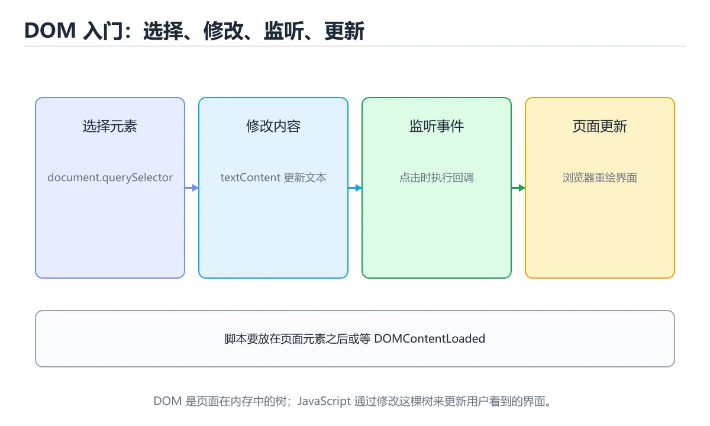
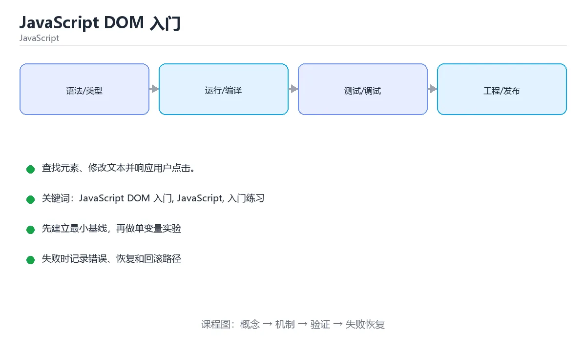

# JavaScript DOM 入门

> 内容更新时间：2026-10-06 · 学习阶段：基础 · 预计用时：45 分钟





## 本节知识框架

**课程定位**：所属分类 `javascript`（JavaScript），课程主题 `JavaScript DOM 入门`，学习阶段 基础，建议用时 45 分钟。

本课主线：查找元素、修改文本并响应用户点击。

**学完本课应当能够**
- 说清 `DOM` 与 `querySelector` 的含义与区别，并各举一个正例和一个反例。
- 用本课示例验证 `textContent 与 innerHTML` 的行为，记录输入、输出与失败条件。
- 遇到「样式与文本状态各自为政」这类问题时，能说出触发条件与修复顺序。

### 从概念到验证的学习链条

1. `DOM`：先掌握 浏览器把 HTML 解析成的对象树，JavaScript 通过它读写页面，再用它解释 `querySelector` 为什么会出现。
2. `querySelector`：先掌握 用 CSS 选择器找到第一个匹配元素，querySelectorAll 返回全部，再用它解释 `textContent 与 innerHTML` 为什么会出现。
3. `textContent 与 innerHTML`：先掌握 前者按纯文本读写，后者会解析 HTML，有注入风险，再用它解释 `事件监听` 为什么会出现。
4. `事件监听`：先掌握 addEventListener 把处理函数绑定到事件，回调里用 event 取详情，再用它解释 `事件冒泡` 为什么会出现。
5. `事件冒泡`：先掌握 事件从触发元素向上传播，可用 stopPropagation 阻止，再用它解释 `函数` 为什么会出现。
6. `函数`：先掌握 函数是一等对象，可以作为参数、返回值和对象属性，再用它解释 本课示例的观察结果 为什么会出现。

**先修与衔接**：本课是「JavaScript」分类的第 5 课。先修内容：《JavaScript 函数入门》。《JavaScript 函数入门》里的 `函数声明`、`箭头函数` 是本课的前提。

### 完成判据

- **定义关**：不看正文也能说明 `DOM` 是 浏览器把 HTML 解析成的对象树，JavaScript 通过它读写页面，并指出一个反例。
- **机制关**：能按“输入 → 转换 → 输出 → 验证”复述 `JavaScript DOM 入门`，而不是只背结论。
- **示例关**：能运行或推演 `JavaScript DOM 入门` 的 `javascript` 示例，并说明一个真实出现的标识符或字面量。
- **证据关**：能指出 `JavaScript DOM 入门` 示例里的 调用了 `createElement()`，并说明它支持或反驳了本课的哪一条结论。
- **排错关**：能复现 样式与文本状态各自为政，记录现象并按 统一由状态驱动渲染，类名切换而不是零散改样式 修复。
- **迁移关**：能把 `JavaScript DOM 入门`、`JavaScript`、`入门练习` 放进一个与 `JavaScript DOM 入门` 不同的项目场景，并保持输入与验证条件可追踪。
- **复盘关**：学完 `JavaScript DOM 入门` 后，用一句话写下仍然不确定的结论，并列出下一次验证需要的输入、环境和成功判据。

### 复习清单

- [ ] 能不看正文复述本课核心术语，并指出一个边界或反例。
- [ ] 能运行或推演本课示例，记录输入、输出与失败现象。
- [ ] 能完成一次自测，并把错题对照错误表定位原因。

## 核心概念定义

| 术语 | 操作性定义 | 常见边界与风险 |
| --- | --- | --- |
| DOM | 浏览器把 HTML 解析成的对象树，JavaScript 通过它读写页面。 | 只在「浏览器把 HTML 解析成的对象树，JavaScript 通过它读写页面」这一前提下成立，换输入或换环境要重新验证。 |
| querySelector | 用 CSS 选择器找到第一个匹配元素，querySelectorAll 返回全部。 | 只在「用 CSS 选择器找到第一个匹配元素，querySelectorAll 返回全部」这一前提下成立，换输入或换环境要重新验证。 |
| textContent 与 innerHTML | 前者按纯文本读写，后者会解析 HTML，有注入风险。 | 权限与密钥策略变化会让结论失效，按最小权限并用真实凭据流程复验。 |
| 事件监听 | addEventListener 把处理函数绑定到事件，回调里用 event 取详情。 | 只在「addEventListener 把处理函数绑定到事件，回调里用 event 取详情」这一前提下成立，换输入或换环境要重新验证。 |
| 事件冒泡 | 事件从触发元素向上传播，可用 stopPropagation 阻止。 | 只在「事件从触发元素向上传播，可用 stopPropagation 阻止」这一前提下成立，换输入或换环境要重新验证。 |
| 函数 | 函数是一等对象，可以作为参数、返回值和对象属性 | 结果依赖数据分布、模型版本与算力预算，换数据集或换硬件都要重新评估。 |

## 原理与运行机制

### 机制总览

**教材衔接：一句话入门**

查找元素、修改文本并响应用户点击。

**教材衔接：JavaScript 基础机制速览**

### 引擎、事件循环与执行上下文

JavaScript 是单线程执行模型，调用栈执行同步代码，事件循环在栈清空后处理任务队列和微任务队列。`setTimeout`、Promise、事件回调都通过异步机制排队执行。理解调用栈、任务队列和微任务的顺序，才能解释“为什么日志顺序和代码顺序不同”。浏览器和 Node.js 提供不同的宿主 API，但语言核心相同。

### 变量、作用域与类型转换

`var` 函数作用域且会提升，`let` 和 `const` 块级作用域并有暂时性死区。`const` 禁止重新赋值，但对象内容仍可修改。JavaScript 有原始类型和对象类型，`==` 会做隐式类型转换，`===` 同时比较类型和值；日常判断优先使用 `===`，只有明确需要转换时才用 `==`。`null`、`undefined`、`NaN` 的语义不同，判断存在性时要写清。

### 函数、闭包与 this

函数是一等对象，可以作为参数、返回值和对象属性。闭包让函数记住定义时的词法作用域，常用于回调、模块私有状态和工厂函数。`this` 的值取决于调用方式，普通调用、方法调用、构造函数和箭头函数规则不同；箭头函数不绑定自己的 this，适合回调，不适合需要动态 this 的方法。

### 对象、原型与模块

对象是键值集合，原型链提供属性查找和继承。`class` 是原型继承的语法糖，`extends` 和 `super` 简化继承写法。模块使用 `import`/`export` 显式声明依赖，避免全局污染。不可变数据、展开运算符和结构化克隆各有边界，浅拷贝不会复制嵌套对象。

### Promise、async 与 DOM

Promise 表示未来完成或失败的结果，`async/await` 让异步代码更接近同步写法，但不会把异步变成阻塞。错误要用 try/catch 或 `.catch` 处理，多个独立任务可以用 `Promise.all`，需要全部结束再汇总可以用 `Promise.allSettled`。DOM 操作应批量进行，避免在循环中反复读写布局；事件监听要注意冒泡、捕获、默认行为和移除监听器，防止内存泄漏。

**教材衔接：版本与时效**

- 打包与运行时版本会共同影响 JavaScript，升级前先固定二者版本。
- 升级前先用 createElement 建立基线：记录版本、命令和输出，升级后只比较这些可观察量。

### 升级检查清单

- 先固定当前版本，跑通全部示例与测验，再升级工具链。
- 一次只改一个版本条件，把 JavaScript DOM 入门 相关的差异单独记成一条结论。
- 升级后重点回归 JavaScript DOM 入门 的默认值、警告信息与错误格式。
- 升级后把 createElement 的实测版本写进「内容元数据」，再更新复核日期。

### 机制拆解：每一步的输入、动作与输出

#### 1. `DOM`
- 输入：`JavaScript DOM 入门`；本步把 浏览器把 HTML 解析成的对象树，JavaScript 通过它读写页面 当作判断规则。
- 动作：围绕 `DOM` 保留中间状态，并记录它与 `querySelector` 的对应关系。
- 输出：`querySelector`，它可以被下一段代码、测试或记录继续使用。
- `DOM` 的失败条件：只在「浏览器把 HTML 解析成的对象树，JavaScript 通过它读写页面」这一前提下成立，换输入或换环境要重新验证。

#### 2. `querySelector`
- 输入：`DOM`；本步把 用 CSS 选择器找到第一个匹配元素，querySelectorAll 返回全部 当作判断规则。
- 动作：围绕 `querySelector` 保留中间状态，并记录它与 `textContent 与 innerHTML` 的对应关系。
- 输出：`textContent 与 innerHTML`，它可以被下一段代码、测试或记录继续使用。
- `querySelector` 的失败条件：只在「用 CSS 选择器找到第一个匹配元素，querySelectorAll 返回全部」这一前提下成立，换输入或换环境要重新验证。

#### 3. `textContent 与 innerHTML`
- 输入：`querySelector`；本步把 前者按纯文本读写，后者会解析 HTML，有注入风险 当作判断规则。
- 动作：围绕 `textContent 与 innerHTML` 保留中间状态，并记录它与 `事件监听` 的对应关系。
- 输出：`事件监听`，它可以被下一段代码、测试或记录继续使用。
- `textContent 与 innerHTML` 的失败条件：权限与密钥策略变化会让结论失效，按最小权限并用真实凭据流程复验。

#### 4. `事件监听`
- 输入：`textContent 与 innerHTML`；本步把 addEventListener 把处理函数绑定到事件，回调里用 event 取详情 当作判断规则。
- 动作：围绕 `事件监听` 保留中间状态，并记录它与 `事件冒泡` 的对应关系。
- 输出：`事件冒泡`，它可以被下一段代码、测试或记录继续使用。
- `事件监听` 的失败条件：只在「addEventListener 把处理函数绑定到事件，回调里用 event 取详情」这一前提下成立，换输入或换环境要重新验证。

#### 5. `事件冒泡`
- 输入：`事件监听`；本步把 事件从触发元素向上传播，可用 stopPropagation 阻止 当作判断规则。
- 动作：围绕 `事件冒泡` 保留中间状态，并记录它与 `函数` 的对应关系。
- 输出：`函数`，它可以被下一段代码、测试或记录继续使用。
- `事件冒泡` 的失败条件：只在「事件从触发元素向上传播，可用 stopPropagation 阻止」这一前提下成立，换输入或换环境要重新验证。

#### 6. `函数`
- 输入：`事件冒泡`；本步把 函数是一等对象，可以作为参数、返回值和对象属性 当作判断规则。
- 动作：围绕 `函数` 保留中间状态，并记录它与 `createElement` 的对应关系。
- 输出：`createElement`，它可以被下一段代码、测试或记录继续使用。
- `函数` 的失败条件：结果依赖数据分布、模型版本与算力预算，换数据集或换硬件都要重新评估。

### 示例中的可观察事实

1. 调用了 `createElement()`；它对应的课程主题是 `JavaScript DOM 入门`。
2. 调用了 `append()`；它对应的课程主题是 `JavaScript DOM 入门`。
3. 调用了 `log()`；它对应的课程主题是 `JavaScript DOM 入门`。
4. 调用了 `querySelector()`；它对应的课程主题是 `JavaScript DOM 入门`。
5. 出现字面量 `button`；它对应的课程主题是 `JavaScript DOM 入门`。
6. 出现字面量 `点击我`；它对应的课程主题是 `JavaScript DOM 入门`。

### 复现实验记录

- 环境：`JavaScript DOM 入门` 使用 `javascript` 示例，固定 `JavaScript DOM 入门`、`JavaScript`、`入门练习` 作为第一组条件。
- 首轮输入：先确认 调用了 `createElement()`，预测 `DOM` 会怎样变化。
- 基线观察：记录命令、输入、输出和错误原文，不用截图代替可复制的文本。
- 单变量修改：只改变 `JavaScript DOM 入门`，观察 `函数` 是否仍满足定义。
- 失败注入：复现 样式与文本状态各自为政，确认现象是 界面与数据不一致。
- 记录结论：把“修改前、修改后、预期变化、实际变化”写成四列表，这样复盘 `JavaScript DOM 入门` 时才能区分概念错误与实现错误。

## 典型应用场景

**教材衔接：代码实验：把示例跑成证据**

### 实验一：建立基线

```javascript
const button = document.createElement("button");
button.textContent = "点击我";
document.body.append(button);
console.log(document.querySelector("button").textContent);
```

### 实验二：只改一个输入

沿用「JavaScript DOM 入门」的最小示例做一次单变量实验：

做完后用一句话写出「JavaScript DOM 入门」的结论：输入怎么变，结果才怎么变。

### 实验三：制造一个可控错误

把 JavaScript DOM 入门 相关的那一行改成边界值（空、极值或类型不符），记录第一条错误信息、发生位置和恢复方式。

### 实验四：用三句话复述

1. JavaScript DOM 入门 的输入是什么，哪些取值合法，哪些属于边界或非法范围？
2. createElement 的执行顺序里，哪一步会写数据或产生外部副作用？
3. 输出如何验证，失败时第一条可观察证据是什么？

- **样式与文本状态各自为政**：典型现象是界面与数据不一致；正确做法是统一由状态驱动渲染，类名切换而不是零散改样式。
- **查询结果不判空就操作**：典型现象是空引用直接报错；正确做法是查询后先判断元素是否存在。
- **频繁读写布局属性**：典型现象是触发多次重排，页面卡顿；正确做法是批量读写，先集中读再集中写。

### 最小验证场景

- 准备：保留 `javascript` 示例的原始输入，先记录 `JavaScript DOM 入门` 的基线输出和完整运行命令。
- 观察：先核对 调用了 `createElement()`，再改变一个与 `DOM` 相关的条件。
- 判定：新结果与 `JavaScript DOM 入门` 的基线不同不等于错误；只有当差异破坏了 `DOM` 的定义或错误表中的约束，才判定为失败。

### 选择与边界

- 使用 `DOM` 时，先满足它的定义：浏览器把 HTML 解析成的对象树，JavaScript 通过它读写页面；只在「浏览器把 HTML 解析成的对象树，JavaScript 通过它读写页面」这一前提下成立，换输入或换环境要重新验证。
- 使用 `querySelector` 时，先满足它的定义：用 CSS 选择器找到第一个匹配元素，querySelectorAll 返回全部；只在「用 CSS 选择器找到第一个匹配元素，querySelectorAll 返回全部」这一前提下成立，换输入或换环境要重新验证。
- 使用 `textContent 与 innerHTML` 时，先满足它的定义：前者按纯文本读写，后者会解析 HTML，有注入风险；权限与密钥策略变化会让结论失效，按最小权限并用真实凭据流程复验。
- 使用 `事件监听` 时，先满足它的定义：addEventListener 把处理函数绑定到事件，回调里用 event 取详情；只在「addEventListener 把处理函数绑定到事件，回调里用 event 取详情」这一前提下成立，换输入或换环境要重新验证。
- 使用 `事件冒泡` 时，先满足它的定义：事件从触发元素向上传播，可用 stopPropagation 阻止；只在「事件从触发元素向上传播，可用 stopPropagation 阻止」这一前提下成立，换输入或换环境要重新验证。

## 代码/协议/SQL 示例

### 最小可验证示例

**教材衔接：最小示例**

**教材衔接：预期输出**

```text
点击我
```

**教材衔接：零基础通俗讲：JavaScript 操作页面**

### 一句话说清它是什么

DOM 是浏览器把 HTML 解析成的一棵树，JavaScript 通过选择器找到节点、修改内容或监听事件，从而让页面动起来。

### 用生活比喻理解

把 DOM 想成一棵家族树：每个标签是一个成员，id 是身份证号。querySelector 按身份证找人，addEventListener 是给这个人装上「听到门铃就开门」的机关。

### 完整可运行代码

```html
<button id="count-button">点我加一</button>
<p id="count-text">当前计数：0</p>

<script>
  let count = 0;
  const button = document.querySelector("#count-button");
  const text = document.querySelector("#count-text");

  button.addEventListener("click", () => {
    count += 1;
    text.textContent = `当前计数：${count}`;
  });
</script>
```

### 逐行拆开看

- 页面上放了一个按钮和一个段落，各自带 id 方便定位。
- `let count = 0;` 用来保存点击次数，必须放在事件函数外面，否则每次点击都会重新归零。
- `document.querySelector("#count-button")` 按 CSS 选择器语法查找第一个匹配元素并返回。
- `addEventListener("click", ...)` 注册点击监听器，事件发生时浏览器会调用后面的函数。
- 回调里先让 count 加一，再更新段落的 textContent，文字立刻反映在页面上。
- 用 textContent 而不是 innerHTML 写入纯文本，可以避免把用户内容当成 HTML 执行。

### 把程序跑一遍

- 页面加载时执行脚本，count 初始化为 0，两个元素被找到并保存。
- 用户点一次按钮，click 事件触发，count 变成 1。
- textContent 被更新为「当前计数：1」，页面文字立刻变化。
- 再点一次，count 变成 2，如此往复。

### 新手最容易踩的坑

- 脚本写在 head 里且没有 defer：DOM 还没解析到按钮，querySelector 返回 null，调用时报错。
- id 拼写错：选择器找不到元素，报无法读取 null 的属性。
- 用 innerHTML 拼接用户输入：可能被注入脚本，存在 XSS 风险。
- 把 count 定义在回调里面：每次点击都重新初始化为 0，计数永远显示 1。
- 同一个事件重复注册监听器：一次点击触发多次处理，数字会跳着涨。

### 动手练一练

- 把按钮文字改成「增加」，确认点击后的行为不变。
- 再加一个重置按钮，把计数恢复为 0。
- 把 textContent 换成 innerHTML 并输入一段带有尖括号的文字，观察差异。

### 本课速查卡

把下面八行抄进自己的笔记，复习时只看这一页就能回忆整课：

| 复习项 | 本课要点 |
| --- | --- |
| 核心结论 | DOM 是浏览器把 HTML 解析成的一棵树，JavaScript 通过选择器找到节点、修改内容或监听事件，从而让页面动起来。 |
| 最少要写的代码 | `<button id="count-button">点我加一</button>` |
| 正确做法 | 页面加载时执行脚本，count 初始化为 0，两个元素被找到并保存。 |
| 最常见的错误 | 脚本写在 head 里且没有 defer：DOM 还没解析到按钮，querySelector 返回 null，调用时报错。 |
| 出错先查什么 | 先读第一条报错信息，再回到最小示例只改一个地方 |
| 怎么确认学会了 | 把按钮文字改成「增加」，确认点击后的行为不变。 |
| 和别的知识点的关系 | 本课打下的语法与思维方式会被后面每一课反复用到 |
| 接下来做什么 | 合上教程，凭记忆把上面的最小代码重写一遍再运行 |

**运行方式**：运行 `JavaScript DOM 入门` 的示例时，保存为 `.js` 后用 `node 文件名.js` 运行；涉及浏览器 API 的示例要放到页面里执行。

### 示例精读：先找证据，再改一个条件

1. 调用了 `createElement()`；它出现在 `JavaScript DOM 入门` 的示例中，阅读时先确认它前后各发生了什么。
2. 调用了 `append()`；它出现在 `JavaScript DOM 入门` 的示例中，阅读时先确认它前后各发生了什么。
3. 调用了 `log()`；它出现在 `JavaScript DOM 入门` 的示例中，阅读时先确认它前后各发生了什么。
4. 调用了 `querySelector()`；它出现在 `JavaScript DOM 入门` 的示例中，阅读时先确认它前后各发生了什么。
5. 出现字面量 `button`；它出现在 `JavaScript DOM 入门` 的示例中，阅读时先确认它前后各发生了什么。
6. 出现字面量 `点击我`；它出现在 `JavaScript DOM 入门` 的示例中，阅读时先确认它前后各发生了什么。
- 在 `JavaScript DOM 入门` 中与 `DOM` 对照：示例必须能支持 浏览器把 HTML 解析成的对象树，JavaScript 通过它读写页面，否则说明这一段还缺少实现或验证步骤。
- 在 `JavaScript DOM 入门` 中与 `querySelector` 对照：示例必须能支持 用 CSS 选择器找到第一个匹配元素，querySelectorAll 返回全部，否则说明这一段还缺少实现或验证步骤。
- 在 `JavaScript DOM 入门` 中与 `textContent 与 innerHTML` 对照：示例必须能支持 前者按纯文本读写，后者会解析 HTML，有注入风险，否则说明这一段还缺少实现或验证步骤。
- 在 `JavaScript DOM 入门` 中与 `事件监听` 对照：示例必须能支持 addEventListener 把处理函数绑定到事件，回调里用 event 取详情，否则说明这一段还缺少实现或验证步骤。

## 时间/空间复杂度或性能分析

**性能关注点（JavaScript DOM 入门）**：事件循环与 DOM 操作是瓶颈来源：记录脚本执行时间、长任务与主线程阻塞时长。

**本课特有开销（JavaScript DOM 入门 · JavaScript DOM 入门）**：小文件看元数据开销，大文件看吞吐，两者要分别测量。

**测量方法**：以 `JavaScript DOM 入门` 的 `JavaScript DOM 入门` 场景为对象，固定输入跑一遍记录基线，再把规模或并发度提高一个数量级复测；两次结果的差值与波动范围才是结论依据。

### 需要控制的变量与记录项

- `JavaScript DOM 入门` 的 `JavaScript DOM 入门`：固定它的版本、输入范围和资源上限，分别记录速度、内存与失败率的变化。
- `JavaScript DOM 入门` 的 `JavaScript`：固定它的版本、输入范围和资源上限，分别记录速度、内存与失败率的变化。
- `JavaScript DOM 入门` 的 `入门练习`：固定它的版本、输入范围和资源上限，分别记录速度、内存与失败率的变化。
- `JavaScript DOM 入门` 中 `DOM` 的边界：只在「浏览器把 HTML 解析成的对象树，JavaScript 通过它读写页面」这一前提下成立，换输入或换环境要重新验证。达到边界时不要外推，必须重新测量。
- `JavaScript DOM 入门` 中 `querySelector` 的边界：只在「用 CSS 选择器找到第一个匹配元素，querySelectorAll 返回全部」这一前提下成立，换输入或换环境要重新验证。达到边界时不要外推，必须重新测量。
- `JavaScript DOM 入门` 中 `textContent 与 innerHTML` 的边界：权限与密钥策略变化会让结论失效，按最小权限并用真实凭据流程复验。达到边界时不要外推，必须重新测量。
- `JavaScript DOM 入门` 中 `事件监听` 的边界：只在「addEventListener 把处理函数绑定到事件，回调里用 event 取详情」这一前提下成立，换输入或换环境要重新验证。达到边界时不要外推，必须重新测量。
- `JavaScript DOM 入门` 中 `事件冒泡` 的边界：只在「事件从触发元素向上传播，可用 stopPropagation 阻止」这一前提下成立，换输入或换环境要重新验证。达到边界时不要外推，必须重新测量。
- `JavaScript DOM 入门` 的代码证据：先验证 调用了 `createElement()`，再记录该路径的输入规模与耗时；只看代码行数不能推出复杂度。

## 常见误区与易错点

| 容易写错的做法 | 实际现象 | 原因与正确做法 |
| --- | --- | --- |
| 样式与文本状态各自为政 | 界面与数据不一致。 | 统一由状态驱动渲染，类名切换而不是零散改样式。 |
| 查询结果不判空就操作 | 空引用直接报错。 | 查询后先判断元素是否存在。 |
| 频繁读写布局属性 | 触发多次重排，页面卡顿。 | 批量读写，先集中读再集中写。 |

### 现场 1：样式与文本状态各自为政

**症状**：界面与数据不一致。

**根因与修复**：统一由状态驱动渲染，类名切换而不是零散改样式。

**自检**：在本课示例里复现「样式与文本状态各自为政」，改成统一由状态驱动渲染，类名切换而不是零散改样式后重跑；如果症状消失且失败路径按预期变化，说明定位正确。

### 现场 2：查询结果不判空就操作

**症状**：空引用直接报错。

**根因与修复**：查询后先判断元素是否存在。

**自检**：在本课示例里复现「查询结果不判空就操作」，改成查询后先判断元素是否存在后重跑；如果症状消失且失败路径按预期变化，说明定位正确。

### 现场 3：频繁读写布局属性

**症状**：触发多次重排，页面卡顿。

**根因与修复**：批量读写，先集中读再集中写。

**自检**：在本课示例里复现「频繁读写布局属性」，改成批量读写，先集中读再集中写后重跑；如果症状消失且失败路径按预期变化，说明定位正确。

## 与其他知识点的关系

**教材衔接：复习与迁移**

### 概念复述

- 用一句话说明「JavaScript DOM 入门」解决什么问题：查找元素、修改文本并响应用户点击。
- 写出JavaScript DOM 入门、JavaScript、入门练习之间的关系，并各举一个例子。
- 说出本课最容易混淆的两个概念，以及区分它们的判据。

### 正文逐节复核

- **JavaScript 基础机制速览**：JavaScript 是单线程执行模型，调用栈执行同步代码，事件循环在栈清空后处理任务队列和微任务队列。


### 迁移练习

<!-- language-intro-deep-dive:start -->

- **先修**：`JavaScript 函数入门`。本课默认这些内容已经掌握。
- **术语归属**：`DOM`、`querySelector`、`textContent 与 innerHTML` 的定义以本课「核心概念定义」为准，换到其他课程时先确认定义是否被改写。
- 同一分类的《JavaScript 控制台入门》也涉及 `JavaScript`；两课衔接时先确认这个术语的定义是否一致。
- 同一分类的《JavaScript 变量与类型入门》也涉及 `JavaScript`；两课衔接时先确认这个术语的定义是否一致。

### 先修与后续术语接口

- `JavaScript 函数入门`：共享术语 `函数`，共同关键词 `JavaScript`、`入门练习`。

### 容易混淆的相邻概念

- `DOM` 与 `querySelector`：前者强调 浏览器把 HTML 解析成的对象树，JavaScript 通过它读写页面；后者强调 用 CSS 选择器找到第一个匹配元素，querySelectorAll 返回全部。判断时分别检查两条定义的适用范围，不要只看名称相似就互换。
- `querySelector` 与 `textContent 与 innerHTML`：前者强调 用 CSS 选择器找到第一个匹配元素，querySelectorAll 返回全部；后者强调 前者按纯文本读写，后者会解析 HTML，有注入风险。判断时分别检查两条定义的适用范围，不要只看名称相似就互换。
- `textContent 与 innerHTML` 与 `事件监听`：前者强调 前者按纯文本读写，后者会解析 HTML，有注入风险；后者强调 addEventListener 把处理函数绑定到事件，回调里用 event 取详情。判断时分别检查两条定义的适用范围，不要只看名称相似就互换。
- `事件监听` 与 `事件冒泡`：前者强调 addEventListener 把处理函数绑定到事件，回调里用 event 取详情；后者强调 事件从触发元素向上传播，可用 stopPropagation 阻止。判断时分别检查两条定义的适用范围，不要只看名称相似就互换。
- `事件冒泡` 与 `函数`：前者强调 事件从触发元素向上传播，可用 stopPropagation 阻止；后者强调 函数是一等对象，可以作为参数、返回值和对象属性。判断时分别检查两条定义的适用范围，不要只看名称相似就互换。

## 自测题与参考答案

> 先独立作答，再对照参考答案；答案都能在本课正文、术语表或错误表里找到依据。

### 自测 1（概念复述）

不看正文，写出 `DOM` 的操作性定义，并说明它与 `querySelector` 的区别。

**参考答案**：浏览器把 HTML 解析成的对象树，JavaScript 通过它读写页面。

`querySelector` 的定位是：用 CSS 选择器找到第一个匹配元素，querySelectorAll 返回全部；两者的差别要从适用对象与失败模式上说明。

### 自测 2（排错）

本课错误表记录了「样式与文本状态各自为政」这类做法。请写出它会出现的现象、根因，以及修复顺序。

**参考答案**：现象是界面与数据不一致；正确做法是统一由状态驱动渲染，类名切换而不是零散改样式。修复时先复现现象并保留证据，再改动一处假设重跑，确认现象消失。

### 自测 3（动手验证）

运行本课的 `javascript` 示例，把其中的 `"button"` 换成一个边界值后重新运行，记录输出与错误信息。

**参考答案**：正常输入下 `javascript` 示例应当复现正文给出的结果；把 `"button"` 换成边界值后，如果结果改变或报错，先核对它是否满足 `JavaScript DOM 入门` 中`DOM` 的适用范围，再检查错误表里是否有同类现象。

### 自测 4（代码阅读）

阅读本课开头的 `javascript` 示例，说明它体现了`DOM` 的哪一条性质，并指出改动哪个输入会让这条性质不再成立。

**参考答案**：`DOM` 的定义是 浏览器把 HTML 解析成的对象树，JavaScript 通过它读写页面，示例正是在实现这条定义。改动与 `DOM` 有关的一个输入后，如果结果不再符合 `JavaScript DOM 入门` 的正文描述，就说明该性质只在当前前提成立。

### 自测 5（迁移）

把 `JavaScript DOM 入门` 的方法迁移到自己的项目：围绕 `DOM` 写出一个与错误表同类的风险点，并说明触发条件和检验方式。

**参考答案**：例如「频繁读写布局属性」，它会导致触发多次重排，页面卡顿；检验方式是按批量读写，先集中读再集中写改一处再复现，确认现象消失且没有引入新的失败分支。

### 自测 6（对比）

用一个表格对比 `DOM` 与 `querySelector`：各写一行适用场景、一行失败表现。

**参考答案**：`DOM` 的定义是浏览器把 HTML 解析成的对象树，JavaScript 通过它读写页面；`querySelector` 的定义是用 CSS 选择器找到第一个匹配元素，querySelectorAll 返回全部。两者的失败表现分别对应本课错误表里与本术语相关的行。

### 自测 7（排错顺序）

面对「样式与文本状态各自为政」引发的问题，请把“复现 界面与数据不一致 → 保留证据 → 统一由状态驱动渲染，类名切换而不是零散改样式 → 回归验证”四步写成可执行的检查清单。

**参考答案**：第一步按界面与数据不一致复现；第二步记录输入、版本与完整报错；第三步按统一由状态驱动渲染，类名切换而不是零散改样式只改一处；第四步重跑并确认失败路径也按预期变化。

### 自测 8（边界判断）

针对 `函数`，分别写出“可以使用”的条件和“结论不再成立”的条件。

**参考答案**：结果依赖数据分布、模型版本与算力预算，换数据集或换硬件都要重新评估。 同时要把 `函数` 的定义 函数是一等对象，可以作为参数、返回值和对象属性 与实际输入逐项对照。

### 自测 9（机制重建）

不看正文，按输入、转换、输出、验证四段重建 `DOM` → `querySelector` → `textContent 与 innerHTML` → `事件监听` 的作用链。

**参考答案**：起点是 `DOM` 的定义 浏览器把 HTML 解析成的对象树，JavaScript 通过它读写页面；中间每一步都保留可观察状态；终点由 `函数` 检查，失败时回到错误表定位第一个偏离定义的步骤。

### 自测 10（综合排错）

在 `JavaScript DOM 入门` 中，现象是 触发多次重排，页面卡顿。请围绕 频繁读写布局属性 写出最小复现、关键证据、修复动作和回归验证，并说明为什么不能只凭一次运行下结论。

**参考答案**：先复现 频繁读写布局属性，记录输入与完整错误；再按 批量读写，先集中读再集中写 只改一处。回归时同时跑正常路径和边界路径，只有两次结果都可解释，才把修复视为完成。

### 自测 11（一分钟复述）

用每分钟约 200 字的速度复述 `JavaScript DOM 入门`：先给主问题，再按顺序说出 `DOM`、`querySelector`、`textContent 与 innerHTML`、`事件监听`，最后给一个失败案例。

**自评标准**：主问题必须对应 查找元素、修改文本并响应用户点击；每个术语都要能接上一句定义或边界；失败案例必须写成可观察现象，不能用“可能有风险”代替证据。

## 术语速查

| 术语 | 一句话说明 |
| --- | --- |
| `DOM` | 浏览器把 HTML 解析成的对象树，JavaScript 通过它读写页面。 |
| `querySelector` | 用 CSS 选择器找到第一个匹配元素，querySelectorAll 返回全部。 |
| `textContent 与 innerHTML` | 前者按纯文本读写，后者会解析 HTML，有注入风险。 |
| `事件监听` | addEventListener 把处理函数绑定到事件，回调里用 event 取详情。 |
| `事件冒泡` | 事件从触发元素向上传播，可用 stopPropagation 阻止。 |
| `函数` | 函数是一等对象，可以作为参数、返回值和对象属性。 |

**术语关系**：`DOM`（浏览器把 HTML 解析成的对象树） → `querySelector`（用 CSS 选择器找到第一个匹配元素） → `textContent 与 innerHTML`（前者按纯文本读写） → `事件监听`（addEventListener 把处理函数绑定到事件）。

## 考点精讲

`JavaScript DOM 入门` 的题库有 5 道题，下面逐题给出题干、正确项与判断依据：先自己作答，再核对正确项，最后回到正文对应小节复核。

### 考点 1：第 1 题

- **题目**：这段 `javascript` 代码对应 `JavaScript DOM 入门` 的 `DOM`。课程要解决的是查找元素、修改文本并响应用户点击。关于代码内容，哪一项说法准确？
- **正确项**：调用了 `createElement()`
- **判断依据**：这道题落在术语 `DOM` 上：浏览器把 HTML 解析成的对象树，JavaScript 通过它读写页面。复习时把 `DOM` 的定义、适用边界和一个反例一起说清楚，再回到「核心概念定义」核对原文。

### 考点 2：第 2 题

- **题目**：围绕“JavaScript DOM 入门”中的 JavaScript DOM 入门、JavaScript、入门练习，下列哪两项是本课强调的实践判断？
- **正确项**：学习 JavaScript DOM 入门 时要同时说明输入、输出和失败路径，不能只看正常流程；验证 JavaScript 时要固定版本并覆盖边界输入，结论才可复现
- **判断依据**：这道题落在术语 `DOM` 上：浏览器把 HTML 解析成的对象树，JavaScript 通过它读写页面。复习时把 `DOM` 的定义、适用边界和一个反例一起说清楚，再回到「核心概念定义」核对原文。

### 考点 3：第 3 题

- **题目**：示例中 console.log(document.querySelector("button").textContent) 输出什么？
- **正确项**：点击我，读取的是按钮元素的文本内容
- **判断依据**：这道题落在术语 `querySelector` 上：用 CSS 选择器找到第一个匹配元素，querySelectorAll 返回全部。复习时把 `querySelector` 的定义、适用边界和一个反例一起说清楚，再回到「核心概念定义」核对原文。

### 考点 4：第 4 题

- **题目**：要让按钮响应用户点击，应该使用哪个方法？
- **正确项**：addEventListener
- **判断依据**：这道题检验本课主问题：查找元素、修改文本并响应用户点击。复习时先复述本课主问题，再举一个会让结论失效的输入。

### 考点 5：第 5 题

- **题目**：填空：补齐下面这段术语说明中的空缺。课程 `查找元素、修改文本并响应用户点击。`，这段说明是：`____`是一等对象，可以作为参数、返回值和对象属性。空缺处应填哪个术语？
- **正确项**：函数
- **判断依据**：这道题落在术语 `函数` 上：函数是一等对象，可以作为参数、返回值和对象属性。复习时把 `函数` 的定义、适用边界和一个反例一起说清楚，再回到「核心概念定义」核对原文。

### 考点 6：`DOM`

- **要点**：浏览器把 HTML 解析成的对象树，JavaScript 通过它读写页面。
- **DOM 的边界**：只在「浏览器把 HTML 解析成的对象树，JavaScript 通过它读写页面」这一前提下成立，换输入或换环境要重新验证。

### 考点 7：`querySelector`

- **要点**：用 CSS 选择器找到第一个匹配元素，querySelectorAll 返回全部。
- **querySelector 的边界**：只在「用 CSS 选择器找到第一个匹配元素，querySelectorAll 返回全部」这一前提下成立，换输入或换环境要重新验证。

### 考点 8：`textContent 与 innerHTML`

- **要点**：前者按纯文本读写，后者会解析 HTML，有注入风险。
- **textContent 与 innerHTML 的边界**：权限与密钥策略变化会让结论失效，按最小权限并用真实凭据流程复验。

### 考点 9：`事件监听`

- **要点**：addEventListener 把处理函数绑定到事件，回调里用 event 取详情。
- **事件监听 的边界**：只在「addEventListener 把处理函数绑定到事件，回调里用 event 取详情」这一前提下成立，换输入或换环境要重新验证。

### 考点 10：`事件冒泡`

- **要点**：事件从触发元素向上传播，可用 stopPropagation 阻止。
- **事件冒泡 的边界**：只在「事件从触发元素向上传播，可用 stopPropagation 阻止」这一前提下成立，换输入或换环境要重新验证。

### 考点 11：`函数`

- **要点**：函数是一等对象，可以作为参数、返回值和对象属性
- **函数 的边界**：结果依赖数据分布、模型版本与算力预算，换数据集或换硬件都要重新评估。

### 考点 12：排错——样式与文本状态各自为政

- **现象**：界面与数据不一致。
- **处理**：统一由状态驱动渲染，类名切换而不是零散改样式。

### 考点 13：排错——查询结果不判空就操作

- **现象**：空引用直接报错。
- **处理**：查询后先判断元素是否存在。

### 考点 14：综合辨析——`DOM` 与 `函数`

- **辨析点**：`DOM` 的定义是 浏览器把 HTML 解析成的对象树，JavaScript 通过它读写页面；`函数` 的定义是 函数是一等对象，可以作为参数、返回值和对象属性。
- **答题要求**：面对 `JavaScript DOM 入门` 的题目，先判断描述的是 `DOM` 还是 `函数`，再归到对应定义，最后写出一个会让该定义失效的边界输入。

### 考点 15：排错评分点

- **现象分**：能写出 界面与数据不一致，而不是只写“程序有错”。
- **证据分**：保留触发 样式与文本状态各自为政 的输入、版本和错误原文。
- **修复分**：按 统一由状态驱动渲染，类名切换而不是零散改样式 只改一处，并同时回归正常路径与边界路径。

## 内容元数据

- 内容版本：v2.0
- 最后更新：2026-10-06
- 学习阶段：基础
- 适用环境：Node.js 22+ / 现代浏览器
；本课聚焦 JavaScript DOM 入门。
- 内容来源：内置结构化课程与工程实践整理
- 相关主题：JavaScript DOM 入门、JavaScript、入门练习
- 质量版本：P0 测验标准 + P1 覆盖扩展 + P2 体验补全

## 参考资料与复核

- 最后复核：2026-10-04
- 下次复核：2027-05-17
- 复核范围：版本兼容、API 行为、安全建议与工程实践
- 来源性质：官方文档、标准或权威教材；本课核对关键词：JavaScript DOM 入门、JavaScript、入门练习。

| 参考资料 | 本课用途 |
| --- | --- |
| [MDN JavaScript 指南](https://developer.mozilla.org/docs/Web/JavaScript/Guide) | 语言基础与浏览器 API |
| [ECMAScript 标准](https://tc39.es/ecma262/) | JavaScript 语言标准 |
| [MDN Fetch API](https://developer.mozilla.org/docs/Web/API/Fetch_API) | 网络请求与响应处理 |

| [本课术语索引：JavaScript DOM 入门](#核心概念定义) | 按本课输入、术语边界和错误表现逐项核对 |
> 「JavaScript DOM 入门」的链接用于离线阅读后的延伸核对；App 不会自动联网。