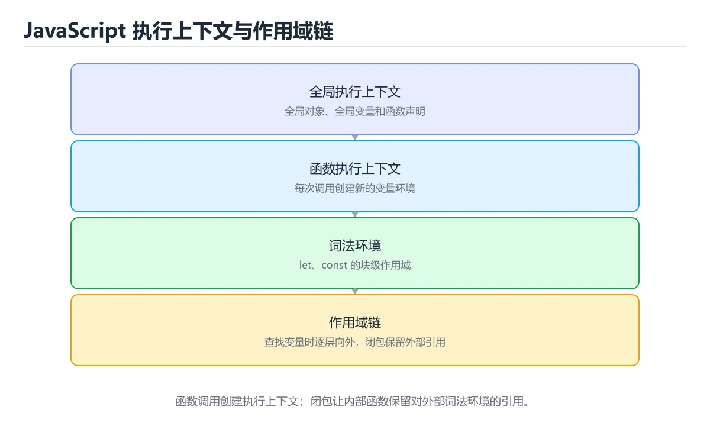
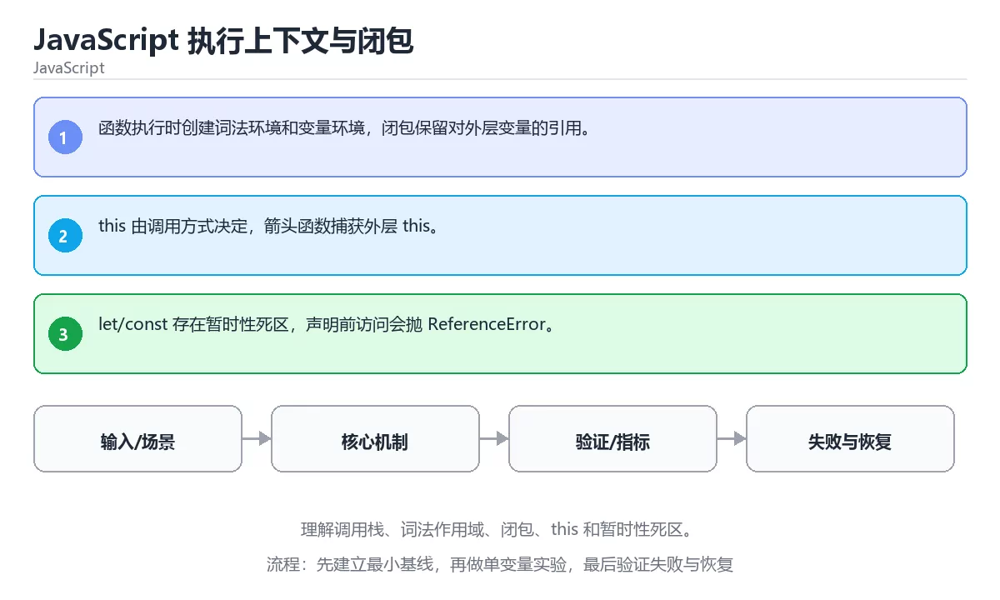

# JavaScript 执行上下文与闭包

> 内容更新时间：2026-10-06 · 学习阶段：高级 · 预计用时：40 分钟





## 本节知识框架

**课程定位**：所属分类 `javascript`（JavaScript），课程主题 `JavaScript 执行上下文与闭包`，学习阶段 高级，建议用时 45 分钟。

本课主线：理解调用栈、词法作用域、闭包、this 和暂时性死区。

**学完本课应当能够**
- 说清 `执行上下文` 与 `闭包` 的含义与区别，并各举一个正例和一个反例。
- 用本课示例验证 `this` 的行为，记录输入、输出与失败条件。
- 遇到「函数作用域变量在回调里使用」这类问题时，能说出触发条件与修复顺序。

### 从概念到验证的学习链条

1. `执行上下文`：先掌握 JavaScript 执行代码时保存变量环境、作用域链和 this 绑定的内部记录，再用它解释 `闭包` 为什么会出现。
2. `闭包`：先掌握 按“JavaScript 执行上下文与闭包”中 执行上下文、闭包、this 的实践顺序，把四个步骤排成从准备到复盘的合理顺序，再用它解释 `this` 为什么会出现。
3. `this`：先掌握 函数调用时的接收者，取值由调用方式决定（方法调用、call/apply、箭头函数继承外层），再用它解释 `作用域` 为什么会出现。
4. `作用域`：先掌握 程序中名字可见和可访问的范围，由词法结构或运行时上下文决定，再用它解释 本课示例的观察结果 为什么会出现。

**先修与衔接**：本课是「JavaScript」分类的第 19 课。先修内容：《实战：JavaScript 实时聊天室》。《实战：JavaScript 实时聊天室》里的 `WebSocket`、`Node.js` 是本课的前提。相关或后续课程：《JavaScript 内存管理与垃圾回收》。

### 完成判据

- **定义关**：不看正文也能说明 `执行上下文` 是 JavaScript 执行代码时保存变量环境、作用域链和 this 绑定的内部记录，并指出一个反例。
- **机制关**：能按“输入 → 转换 → 输出 → 验证”复述 `JavaScript 执行上下文与闭包`，而不是只背结论。
- **示例关**：能运行或推演 `JavaScript 执行上下文与闭包` 的 `text` 示例，并说明一个真实出现的标识符或字面量。
- **证据关**：能指出 `JavaScript 执行上下文与闭包` 示例里的 调用了 `makeCounter()`，并说明它支持或反驳了本课的哪一条结论。
- **排错关**：能复现 函数作用域变量在回调里使用，记录现象并按 用块级作用域声明变量 修复。
- **迁移关**：能把 `执行上下文`、`闭包`、`this`、`作用域` 放进一个与 `JavaScript 执行上下文与闭包` 不同的项目场景，并保持输入与验证条件可追踪。
- **复盘关**：学完 `JavaScript 执行上下文与闭包` 后，用一句话写下仍然不确定的结论，并列出下一次验证需要的输入、环境和成功判据。

### 复习清单

- [ ] 能不看正文复述本课核心术语，并指出一个边界或反例。
- [ ] 能运行或推演本课示例，记录输入、输出与失败现象。
- [ ] 能完成一次自测，并把错题对照错误表定位原因。

## 核心概念定义

| 术语 | 操作性定义 | 常见边界与风险 |
| --- | --- | --- |
| 执行上下文 | JavaScript 执行代码时保存变量环境、作用域链和 this 绑定的内部记录。 | 只在「JavaScript 执行代码时保存变量环境、作用域链和 this 绑定的内部记录」这一前提下成立，换输入或换环境要重新验证。 |
| 闭包 | 按“JavaScript 执行上下文与闭包”中 执行上下文、闭包、this 的实践顺序，把四个步骤排成从准备到复盘的合理顺序。 | 易错：闭包持有的是引用，后续修改会反映出来；正确做法是需要快照时提前取值保存。 |
| this | 函数调用时的接收者，取值由调用方式决定（方法调用、call/apply、箭头函数继承外层）。 | 易错：方法内访问属性得到 undefined；正确做法是用箭头函数或提前绑定 this。 |
| 作用域 | 程序中名字可见和可访问的范围，由词法结构或运行时上下文决定。 | 易错：所有回调看到同一个值；正确做法是用块级作用域声明变量。 |

## 原理与运行机制

### 机制总览

**教材衔接：核心知识**

### 1. 函数执行时创建词法环境和变量环境，闭包保留对外层变量的引用。

- 关键做法：先用 makeCounter 建立 执行上下文 的基线，再逐步加入边界与失败条件。
- 验证标准：闭包 的异常路径有明确错误信息与恢复动作。

### 2. this 由调用方式决定，箭头函数捕获外层 this。

把这条结论放回「JavaScript 执行上下文与闭包」的完整流程里展开：

- 正文依据：能用自己的话解释：函数执行时创建词法环境和变量环境，闭包保留对外层变量的引用。
- 落地检查：把「2. this 由调用方式决定，箭头函数捕获外层 this。」改写成一条可执行的核对项，逐条验证输入、超时与失败路径。

### 3. let/const 存在暂时性死区，声明前访问会抛 ReferenceError。

把这条结论放回「JavaScript 执行上下文与闭包」的完整流程里展开：

- 正文依据：能用自己的话解释：this 由调用方式决定，箭头函数捕获外层 this。
- 落地检查：把「3. let/const 存在暂时性死区，声明前访问会抛 ReferenceError。」改写成一条可执行的核对项，逐条验证输入、超时与失败路径。

**教材衔接：关键流程**

**教材衔接：实践路径**

**教材衔接：版本与时效**

- makeCounter 依赖的新 API 必须有降级路径，否则老环境直接报错。
- 升级「JavaScript 执行上下文与闭包」涉及的依赖前，先用 makeCounter 复现当前行为，再逐项核对版本说明与破坏性变更。

### 升级检查清单

- 先固定当前版本，跑通全部示例与测验，再升级工具链。
- 只改 执行上下文 的版本变量，记录编译、测试与产物体积的变化。
- 回归范围锁定 makeCounter 的默认行为，并确认弃用警告是否出现在构建输出里。
- 升级完成后记录 执行上下文 的新旧版本差异，并据此调整下次复核时间。

**教材衔接：零基础精讲：把JavaScript 执行上下文与闭包真正讲透**

### 先建立一个直觉

本课的摘要可以当作一张地图：理解调用栈、词法作用域、闭包、this 和暂时性死区。

### 逐步拆解

1. 澄清输入与目标。先写清「JavaScript 执行上下文与闭包」要解决的问题、合法输入范围和成功标准，再进入后续步骤。
2. 描述处理过程。把「执行上下文、闭包、this、作用域」映射到具体步骤，每步都要求能单独验证。
3. 定义输出。执行上下文 的输出不仅包括正常结果，还包括错误码、日志和资源释放状态。
4. 构造一次执行上下文越界，记录系统是拒绝、降级还是静默出错；三者对应的修复策略完全不同。
5. 用 makeCounter 构造一个最小反例，证明「JavaScript 执行上下文与闭包」的结论有边界。

### 把正文串成一条执行链

- **考点 3：关于「let/const 存在暂时性死区，声明前访问会抛 ReferenceError。」，下列说法正确的是？**：先独立作答，再回到本课对应小节核对判断依据；答错时记录是哪一个前提被忽略。

### 从测验反推易错点

- 参考判断：函数执行时创建词法环境和变量环境，闭包保留对外层变量的引用。
- 自问：如果去掉题干里的一个限定词，结论还成立吗？

- 参考判断：this 由调用方式决定，箭头函数捕获外层 this。

- 参考判断：let/const 存在暂时性死区，声明前访问会抛 ReferenceError。

**检查点 4：本课的核心学习目标是什么？**

- 参考判断：理解调用栈、词法作用域、闭包、this 和暂时性死区。

- 参考判断：执行上下文、闭包


### 变式训练

1. 先用一个单文件示例验证 makeCounter，确认正确性后再引入框架或分布式组件。
2. 把 makeCounter 的数据量提高一个数量级，观察延迟与内存的变化拐点。
3. 把 闭包 换成失败输入，记录错误信息与恢复动作。
5. 在 核心知识 这一步去掉一个前提，观察 执行上下文 的输出怎样变化，并写出「JavaScript 执行上下文与闭包」里哪条假设被破坏。
6. 把 执行上下文 的方案切换到低资源设备，重新评估默认参数、超时和降级策略。


### 迁移案例库

围绕 makeCounter 重复同一套方法，每完成一轮就把差异写进笔记。

#### 迁移案例 1：围绕「执行上下文」做一次小实验

**验收**：结论要能追溯到正文的具体小节与代码位置，并记录闭包相关的指标变化。

#### 迁移案例 2：围绕「闭包」做一次小实验

**步骤**：
1. 复述当前方案对「闭包」的假设，写成一句可证伪的话。

#### 迁移案例 3：围绕「this」做一次小实验

**步骤**：
1. 复述当前方案对「this」的假设，写成一句可证伪的话。

#### 迁移案例 4：围绕「作用域」做一次小实验

**步骤**：
1. 复述当前方案对「作用域」的假设，写成一句可证伪的话。

#### 迁移案例 5：围绕「执行上下文」做一次小实验

**步骤**：

#### 迁移案例 6：围绕「闭包」做一次小实验

**步骤**：

#### 迁移案例 7：围绕「this」做一次小实验

**步骤**：

#### 迁移案例 8：围绕「作用域」做一次小实验

**步骤**：

#### 迁移案例 9：围绕「执行上下文」做一次小实验

**步骤**：

#### 迁移案例 10：围绕「闭包」做一次小实验

**步骤**：

#### 迁移案例 11：围绕「this」做一次小实验

**步骤**：

#### 迁移案例 12：围绕「作用域」做一次小实验

**步骤**：

#### 迁移案例 13：围绕「执行上下文」做一次小实验

**步骤**：

#### 迁移案例 14：围绕「闭包」做一次小实验

**步骤**：

#### 迁移案例 15：围绕「this」做一次小实验

**步骤**：

#### 迁移案例 16：围绕「作用域」做一次小实验

**步骤**：

<!-- p0-depth-v2:end -->

**教材衔接：验证步骤**

### 机制拆解：每一步的输入、动作与输出

#### 1. `执行上下文`
- 输入：`执行上下文`；本步把 JavaScript 执行代码时保存变量环境、作用域链和 this 绑定的内部记录 当作判断规则。
- 动作：围绕 `执行上下文` 保留中间状态，并记录它与 `闭包` 的对应关系。
- 输出：`闭包`，它可以被下一段代码、测试或记录继续使用。
- `执行上下文` 的失败条件：只在「JavaScript 执行代码时保存变量环境、作用域链和 this 绑定的内部记录」这一前提下成立，换输入或换环境要重新验证。

#### 2. `闭包`
- 输入：`执行上下文`；本步把 按“JavaScript 执行上下文与闭包”中 执行上下文、闭包、this 的实践顺序，把四个步骤排成从准备到复盘的合理顺序 当作判断规则。
- 动作：围绕 `闭包` 保留中间状态，并记录它与 `this` 的对应关系。
- 输出：`this`，它可以被下一段代码、测试或记录继续使用。
- `闭包` 的失败条件：当以为闭包复制了变量时，会出现闭包持有的是引用，后续修改会反映出来。

#### 3. `this`
- 输入：`闭包`；本步把 函数调用时的接收者，取值由调用方式决定（方法调用、call/apply、箭头函数继承外层） 当作判断规则。
- 动作：围绕 `this` 保留中间状态，并记录它与 `作用域` 的对应关系。
- 输出：`作用域`，它可以被下一段代码、测试或记录继续使用。
- `this` 的失败条件：当混淆调用中的 this 指向时，会出现方法内访问属性得到 undefined。

#### 4. `作用域`
- 输入：`this`；本步把 程序中名字可见和可访问的范围，由词法结构或运行时上下文决定 当作判断规则。
- 动作：围绕 `作用域` 保留中间状态，并记录它与 `makeCounter` 的对应关系。
- 输出：`makeCounter`，它可以被下一段代码、测试或记录继续使用。
- `作用域` 的失败条件：当函数作用域变量在回调里使用时，会出现所有回调看到同一个值。

### 示例中的可观察事实

1. 调用了 `makeCounter()`；它对应的课程主题是 `JavaScript 执行上下文与闭包`。
2. 调用了 `next()`；它对应的课程主题是 `JavaScript 执行上下文与闭包`。
3. 调用了 `log()`；它对应的课程主题是 `JavaScript 执行上下文与闭包`。

### 复现实验记录

- 环境：`JavaScript 执行上下文与闭包` 使用 `text` 示例，固定 `执行上下文`、`闭包`、`this`、`作用域` 作为第一组条件。
- 首轮输入：先确认 调用了 `makeCounter()`，预测 `执行上下文` 会怎样变化。
- 基线观察：记录命令、输入、输出和错误原文，不用截图代替可复制的文本。
- 单变量修改：只改变 `执行上下文`，观察 `作用域` 是否仍满足定义。
- 失败注入：复现 函数作用域变量在回调里使用，确认现象是 所有回调看到同一个值。
- 记录结论：把“修改前、修改后、预期变化、实际变化”写成四列表，这样复盘 `JavaScript 执行上下文与闭包` 时才能区分概念错误与实现错误。

## 典型应用场景

**教材衔接：深度拓展与实战**

这一节把 执行上下文 的定义、makeCounter 的代码与常见失败串成一条复习路线。

### 机制拆解

- **1. 函数执行时创建词法环境和变量环境，闭包保留对外层变量的引用。**：在「JavaScript 执行上下文与闭包」里，「1. 函数执行时创建词法环境和变量环境，闭包保留对外层变量的引用。」这一步要先写清输入与预期，再记录实际结果和差异；结果不符时回到对应小节核对前提。
- **2. this 由调用方式决定，箭头函数捕获外层 this。**：在「JavaScript 执行上下文与闭包」里，「2. this 由调用方式决定，箭头函数捕获外层 this。」这一步要先写清输入与预期，再记录实际结果和差异；结果不符时回到对应小节核对前提。
- **3. let/const 存在暂时性死区，声明前访问会抛 ReferenceError。**：在「JavaScript 执行上下文与闭包」里，「3. let/const 存在暂时性死区，声明前访问会抛 ReferenceError。」这一步要先写清输入与预期，再记录实际结果和差异；结果不符时回到对应小节核对前提。
- **考点 1：关于「函数执行时创建词法环境和变量环境，闭包保留对外层变量的引用。」，下列说法正确的是？**：先独立作答，再回到本课对应小节核对判断依据；答错时记录是哪一个前提被忽略。
- **考点 2：关于「this 由调用方式决定，箭头函数捕获外层 this。」，下列说法正确的是？**：先独立作答，再回到本课对应小节核对判断依据；答错时记录是哪一个前提被忽略。


### 工程检查表

- [ ] 能否用自己的话说明JavaScript 执行上下文与闭包解决什么问题，以及它不负责什么？
- [ ] 能否说明 执行上下文 的正常输出，以及失败时留下的错误信息？
- [ ] 能否解释本课关键词在真实项目中的边界与取舍？
- [ ] 能否把 执行上下文 的方法迁移到相近问题，并说明需要改哪一步？

### 迁移练习

1. 保持正文示例不变，写出它的输入、处理步骤和预期输出。
2. 把 闭包 换成边界值，说明依据后再实际运行。
3. 结合执行上下文、闭包、this、作用域，写出一个真实项目中的使用场景。
4. 写下一个反例，说明它在什么条件下会使朴素做法失效。

<!-- p0-depth-v2:start -->

- **函数作用域变量在回调里使用**：典型现象是所有回调看到同一个值；正确做法是用块级作用域声明变量。
- **混淆调用中的 this 指向**：典型现象是方法内访问属性得到 undefined；正确做法是用箭头函数或提前绑定 this。
- **以为闭包复制了变量**：典型现象是闭包持有的是引用，后续修改会反映出来；正确做法是需要快照时提前取值保存。

### 最小验证场景

- 准备：保留 `text` 示例的原始输入，先记录 `JavaScript 执行上下文与闭包` 的基线输出和完整运行命令。
- 观察：先核对 调用了 `makeCounter()`，再改变一个与 `执行上下文` 相关的条件。
- 判定：新结果与 `JavaScript 执行上下文与闭包` 的基线不同不等于错误；只有当差异破坏了 `执行上下文` 的定义或错误表中的约束，才判定为失败。

### 选择与边界

- 使用 `执行上下文` 时，先满足它的定义：JavaScript 执行代码时保存变量环境、作用域链和 this 绑定的内部记录；只在「JavaScript 执行代码时保存变量环境、作用域链和 this 绑定的内部记录」这一前提下成立，换输入或换环境要重新验证。
- 使用 `闭包` 时，先满足它的定义：按“JavaScript 执行上下文与闭包”中 执行上下文、闭包、this 的实践顺序，把四个步骤排成从准备到复盘的合理顺序；易错：闭包持有的是引用，后续修改会反映出来；正确做法是需要快照时提前取值保存。
- 使用 `this` 时，先满足它的定义：函数调用时的接收者，取值由调用方式决定（方法调用、call/apply、箭头函数继承外层）；易错：方法内访问属性得到 undefined；正确做法是用箭头函数或提前绑定 this。
- 使用 `作用域` 时，先满足它的定义：程序中名字可见和可访问的范围，由词法结构或运行时上下文决定；易错：所有回调看到同一个值；正确做法是用块级作用域声明变量。

## 代码/协议/SQL 示例

### 最小可验证示例

**教材衔接：最小可运行示例**

先用下面的示例确认 执行上下文 的基线，再只改一个与 闭包 相关的值：

```javascript
function makeCounter() {
  let count = 0;
  return () => ++count;
}

const next = makeCounter();
next();
next();
console.log(next());
```

**教材衔接：预期输出**

```text
3
```

### 示例精读：先找证据，再改一个条件

1. 调用了 `makeCounter()`；它出现在 `JavaScript 执行上下文与闭包` 的示例中，阅读时先确认它前后各发生了什么。
2. 调用了 `next()`；它出现在 `JavaScript 执行上下文与闭包` 的示例中，阅读时先确认它前后各发生了什么。
3. 调用了 `log()`；它出现在 `JavaScript 执行上下文与闭包` 的示例中，阅读时先确认它前后各发生了什么。
- 在 `JavaScript 执行上下文与闭包` 中与 `执行上下文` 对照：示例必须能支持 JavaScript 执行代码时保存变量环境、作用域链和 this 绑定的内部记录，否则说明这一段还缺少实现或验证步骤。
- 在 `JavaScript 执行上下文与闭包` 中与 `闭包` 对照：示例必须能支持 按“JavaScript 执行上下文与闭包”中 执行上下文、闭包、this 的实践顺序，把四个步骤排成从准备到复盘的合理顺序，否则说明这一段还缺少实现或验证步骤。
- 在 `JavaScript 执行上下文与闭包` 中与 `this` 对照：示例必须能支持 函数调用时的接收者，取值由调用方式决定（方法调用、call/apply、箭头函数继承外层），否则说明这一段还缺少实现或验证步骤。
- 在 `JavaScript 执行上下文与闭包` 中与 `作用域` 对照：示例必须能支持 程序中名字可见和可访问的范围，由词法结构或运行时上下文决定，否则说明这一段还缺少实现或验证步骤。

## 时间/空间复杂度或性能分析

**性能关注点（JavaScript 执行上下文与闭包）**：事件循环与 DOM 操作是瓶颈来源：记录脚本执行时间、长任务与主线程阻塞时长。

**测量方法**：以 `JavaScript 执行上下文与闭包` 的 `执行上下文` 场景为对象，固定输入跑一遍记录基线，再把规模或并发度提高一个数量级复测；两次结果的差值与波动范围才是结论依据。

### 需要控制的变量与记录项

- `JavaScript 执行上下文与闭包` 的 `执行上下文`：固定它的版本、输入范围和资源上限，分别记录速度、内存与失败率的变化。
- `JavaScript 执行上下文与闭包` 的 `闭包`：固定它的版本、输入范围和资源上限，分别记录速度、内存与失败率的变化。
- `JavaScript 执行上下文与闭包` 的 `this`：固定它的版本、输入范围和资源上限，分别记录速度、内存与失败率的变化。
- `JavaScript 执行上下文与闭包` 的 `作用域`：固定它的版本、输入范围和资源上限，分别记录速度、内存与失败率的变化。
- `JavaScript 执行上下文与闭包` 中 `执行上下文` 的边界：只在「JavaScript 执行代码时保存变量环境、作用域链和 this 绑定的内部记录」这一前提下成立，换输入或换环境要重新验证。达到边界时不要外推，必须重新测量。
- `JavaScript 执行上下文与闭包` 中 `闭包` 的边界：易错：闭包持有的是引用，后续修改会反映出来；正确做法是需要快照时提前取值保存。达到边界时不要外推，必须重新测量。
- `JavaScript 执行上下文与闭包` 中 `this` 的边界：易错：方法内访问属性得到 undefined；正确做法是用箭头函数或提前绑定 this。达到边界时不要外推，必须重新测量。
- `JavaScript 执行上下文与闭包` 中 `作用域` 的边界：易错：所有回调看到同一个值；正确做法是用块级作用域声明变量。达到边界时不要外推，必须重新测量。
- `JavaScript 执行上下文与闭包` 的代码证据：先验证 调用了 `makeCounter()`，再记录该路径的输入规模与耗时；只看代码行数不能推出复杂度。

## 常见误区与易错点

| 容易写错的做法 | 实际现象 | 原因与正确做法 |
| --- | --- | --- |
| 函数作用域变量在回调里使用 | 所有回调看到同一个值。 | 用块级作用域声明变量。 |
| 混淆调用中的 this 指向 | 方法内访问属性得到 undefined。 | 用箭头函数或提前绑定 this。 |
| 以为闭包复制了变量 | 闭包持有的是引用，后续修改会反映出来。 | 需要快照时提前取值保存。 |

### 现场 1：函数作用域变量在回调里使用

**症状**：所有回调看到同一个值。

**根因与修复**：用块级作用域声明变量。

**自检**：在本课示例里复现「函数作用域变量在回调里使用」，改成用块级作用域声明变量后重跑；如果症状消失且失败路径按预期变化，说明定位正确。

### 现场 2：混淆调用中的 this 指向

**症状**：方法内访问属性得到 undefined。

**根因与修复**：用箭头函数或提前绑定 this。

**自检**：在本课示例里复现「混淆调用中的 this 指向」，改成用箭头函数或提前绑定 this后重跑；如果症状消失且失败路径按预期变化，说明定位正确。

### 现场 3：以为闭包复制了变量

**症状**：闭包持有的是引用，后续修改会反映出来。

**根因与修复**：需要快照时提前取值保存。

**自检**：在本课示例里复现「以为闭包复制了变量」，改成需要快照时提前取值保存后重跑；如果症状消失且失败路径按预期变化，说明定位正确。

## 与其他知识点的关系

**教材衔接：复习与迁移**

### 概念复述

- 用一句话说明「JavaScript 执行上下文与闭包」解决什么问题：理解调用栈、词法作用域、闭包、this 和暂时性死区。
- 写出执行上下文、闭包、this之间的关系，并各举一个例子。
- 说出本课最容易混淆的两个概念，以及区分它们的判据。

### 正文逐节复核

- **零基础精讲：把JavaScript 执行上下文与闭包真正讲透**：本课的摘要可以当作一张地图：理解调用栈、词法作用域、闭包、this 和暂时性死区。


### 迁移练习

- **先修**：`实战：JavaScript 实时聊天室`。本课默认这些内容已经掌握。
- **相关或后续**：`JavaScript 内存管理与垃圾回收`。本课术语会在这些课程里继续使用。
- **术语归属**：`执行上下文`、`闭包`、`this` 的定义以本课「核心概念定义」为准，换到其他课程时先确认定义是否被改写。
- 同一分类的《函数、作用域与 this》也涉及 `闭包`；两课衔接时先确认这个术语的定义是否一致。

### 先修与后续术语接口

- `实战：JavaScript 实时聊天室`：两者通过本分类的学习顺序衔接，阅读时重点比较各自的输入与失败条件。
- `JavaScript 内存管理与垃圾回收`：两者通过本分类的学习顺序衔接，阅读时重点比较各自的输入与失败条件。

### 容易混淆的相邻概念

- `执行上下文` 与 `闭包`：前者强调 JavaScript 执行代码时保存变量环境、作用域链和 this 绑定的内部记录；后者强调 按“JavaScript 执行上下文与闭包”中 执行上下文、闭包、this 的实践顺序，把四个步骤排成从准备到复盘的合理顺序。判断时分别检查两条定义的适用范围，不要只看名称相似就互换。
- `闭包` 与 `this`：前者强调 按“JavaScript 执行上下文与闭包”中 执行上下文、闭包、this 的实践顺序，把四个步骤排成从准备到复盘的合理顺序；后者强调 函数调用时的接收者，取值由调用方式决定（方法调用、call/apply、箭头函数继承外层）。判断时分别检查两条定义的适用范围，不要只看名称相似就互换。
- `this` 与 `作用域`：前者强调 函数调用时的接收者，取值由调用方式决定（方法调用、call/apply、箭头函数继承外层）；后者强调 程序中名字可见和可访问的范围，由词法结构或运行时上下文决定。判断时分别检查两条定义的适用范围，不要只看名称相似就互换。

## 自测题与参考答案

> 先独立作答，再对照参考答案；答案都能在本课正文、术语表或错误表里找到依据。

### 自测 1（概念复述）

不看正文，写出 `执行上下文` 的操作性定义，并说明它与 `闭包` 的区别。

**参考答案**：JavaScript 执行代码时保存变量环境、作用域链和 this 绑定的内部记录。

`闭包` 的定位是：按“JavaScript 执行上下文与闭包”中 执行上下文、闭包、this 的实践顺序，把四个步骤排成从准备到复盘的合理顺序；两者的差别要从适用对象与失败模式上说明。

### 自测 2（排错）

本课错误表记录了「函数作用域变量在回调里使用」这类做法。请写出它会出现的现象、根因，以及修复顺序。

**参考答案**：现象是所有回调看到同一个值；正确做法是用块级作用域声明变量。修复时先复现现象并保留证据，再改动一处假设重跑，确认现象消失。

### 自测 3（动手验证）

运行本课的 `text` 示例，改动其中一个输入后重新运行，记录输出与错误信息。

**参考答案**：正常输入下 `text` 示例应当复现正文给出的结果；改动输入后，如果结果改变或报错，先核对它是否满足 `JavaScript 执行上下文与闭包` 中`执行上下文` 的适用范围，再检查错误表里是否有同类现象。

### 自测 4（代码阅读）

阅读本课开头的 `text` 示例，说明它体现了`执行上下文` 的哪一条性质，并指出改动哪个输入会让这条性质不再成立。

**参考答案**：`执行上下文` 的定义是 JavaScript 执行代码时保存变量环境、作用域链和 this 绑定的内部记录，示例正是在实现这条定义。改动与 `执行上下文` 有关的一个输入后，如果结果不再符合 `JavaScript 执行上下文与闭包` 的正文描述，就说明该性质只在当前前提成立。

### 自测 5（迁移）

把 `JavaScript 执行上下文与闭包` 的方法迁移到自己的项目：围绕 `执行上下文` 写出一个与错误表同类的风险点，并说明触发条件和检验方式。

**参考答案**：例如「以为闭包复制了变量」，它会导致闭包持有的是引用，后续修改会反映出来；检验方式是按需要快照时提前取值保存改一处再复现，确认现象消失且没有引入新的失败分支。

### 自测 6（对比）

用一个表格对比 `执行上下文` 与 `闭包`：各写一行适用场景、一行失败表现。

**参考答案**：`执行上下文` 的定义是JavaScript 执行代码时保存变量环境、作用域链和 this 绑定的内部记录；`闭包` 的定义是按“JavaScript 执行上下文与闭包”中 执行上下文、闭包、this 的实践顺序，把四个步骤排成从准备到复盘的合理顺序。两者的失败表现分别对应本课错误表里与本术语相关的行。

### 自测 7（排错顺序）

面对「函数作用域变量在回调里使用」引发的问题，请把“复现 所有回调看到同一个值 → 保留证据 → 用块级作用域声明变量 → 回归验证”四步写成可执行的检查清单。

**参考答案**：第一步按所有回调看到同一个值复现；第二步记录输入、版本与完整报错；第三步按用块级作用域声明变量只改一处；第四步重跑并确认失败路径也按预期变化。

### 自测 8（边界判断）

针对 `作用域`，分别写出“可以使用”的条件和“结论不再成立”的条件。

**参考答案**：易错：所有回调看到同一个值；正确做法是用块级作用域声明变量。 同时要把 `作用域` 的定义 程序中名字可见和可访问的范围，由词法结构或运行时上下文决定 与实际输入逐项对照。

### 自测 9（机制重建）

不看正文，按输入、转换、输出、验证四段重建 `执行上下文` → `闭包` → `this` → `作用域` 的作用链。

**参考答案**：起点是 `执行上下文` 的定义 JavaScript 执行代码时保存变量环境、作用域链和 this 绑定的内部记录；中间每一步都保留可观察状态；终点由 `作用域` 检查，失败时回到错误表定位第一个偏离定义的步骤。

### 自测 10（综合排错）

在 `JavaScript 执行上下文与闭包` 中，现象是 闭包持有的是引用，后续修改会反映出来。请围绕 以为闭包复制了变量 写出最小复现、关键证据、修复动作和回归验证，并说明为什么不能只凭一次运行下结论。

**参考答案**：先复现 以为闭包复制了变量，记录输入与完整错误；再按 需要快照时提前取值保存 只改一处。回归时同时跑正常路径和边界路径，只有两次结果都可解释，才把修复视为完成。

### 自测 11（一分钟复述）

用每分钟约 200 字的速度复述 `JavaScript 执行上下文与闭包`：先给主问题，再按顺序说出 `执行上下文`、`闭包`、`this`、`作用域`，最后给一个失败案例。

**自评标准**：主问题必须对应 理解调用栈、词法作用域、闭包、this 和暂时性死区；每个术语都要能接上一句定义或边界；失败案例必须写成可观察现象，不能用“可能有风险”代替证据。

## 术语速查

| 术语 | 一句话说明 |
| --- | --- |
| `执行上下文` | JavaScript 执行代码时保存变量环境、作用域链和 this 绑定的内部记录。 |
| `闭包` | 按“JavaScript 执行上下文与闭包”中 执行上下文、闭包、this 的实践顺序，把四个步骤排成从准备到复盘的合理顺序。 |
| `this` | 函数调用时的接收者，取值由调用方式决定（方法调用、call/apply、箭头函数继承外层）。 |
| `作用域` | 程序中名字可见和可访问的范围，由词法结构或运行时上下文决定。 |

**术语关系**：`执行上下文`（JavaScript 执行代码时保存变量环境、作用域链和 this 绑定的内部记录） → `闭包`（按“JavaScript 执行上下文与闭包”中 执行上下文、闭包、this 的实践顺序） → `this`（函数调用时的接收者） → `作用域`（程序中名字可见和可访问的范围）。

## 考点精讲

`JavaScript 执行上下文与闭包` 的题库有 6 道题，下面逐题给出题干、正确项与判断依据：先自己作答，再核对正确项，最后回到正文对应小节复核。

### 考点 1：第 1 题

- **题目**：在 `JavaScript 执行上下文与闭包` 里，与 `执行上下文` 有关的说法中，哪一项最符合理解调用栈、词法作用域、闭包、this 和暂时性死区。？
- **正确项**：函数执行时创建词法环境和变量环境，闭包保留对外层变量的引用。
- **判断依据**：这道题落在术语 `执行上下文` 上：JavaScript 执行代码时保存变量环境、作用域链和 this 绑定的内部记录。复习时把 `执行上下文` 的定义、适用边界和一个反例一起说清楚，再回到「核心概念定义」核对原文。

### 考点 2：第 2 题

- **题目**：在 `JavaScript 执行上下文与闭包` 里，与 `执行上下文` 有关的说法中，哪一项最符合理解调用栈、词法作用域、闭包、this 和暂时性死区。？（JavaScript 执行上下文与闭包·JavaScript 第 2 题）
- **正确项**：this 由调用方式决定，箭头函数捕获外层 this。
- **判断依据**：这道题落在术语 `执行上下文` 上：JavaScript 执行代码时保存变量环境、作用域链和 this 绑定的内部记录。复习时把 `执行上下文` 的定义、适用边界和一个反例一起说清楚，再回到「核心概念定义」核对原文。

### 考点 3：第 3 题

- **题目**：在 `JavaScript 执行上下文与闭包` 里，与 `执行上下文` 有关的说法中，哪一项最符合理解调用栈、词法作用域、闭包、this 和暂时性死区。？（JavaScript 执行上下文与闭包·JavaScript 第 3 题）
- **正确项**：let/const 存在暂时性死区，声明前访问会抛 ReferenceError。
- **判断依据**：这道题落在术语 `执行上下文` 上：JavaScript 执行代码时保存变量环境、作用域链和 this 绑定的内部记录。复习时把 `执行上下文` 的定义、适用边界和一个反例一起说清楚，再回到「核心概念定义」核对原文。

### 考点 4：第 4 题

- **题目**：按“JavaScript 执行上下文与闭包”中 执行上下文、闭包、this 的实践顺序，把四个步骤排成从准备到复盘的合理顺序。
- **正确项**：先明确 执行上下文 的输入、输出与约束 → 写出最小示例并核对 闭包 的基线结果 → 只改一个变量，记录边界与失败路径的变化 → 固定版本与证据，把“JavaScript 执行上下文与闭包”的结论写成可复现记录
- **判断依据**：这道题落在术语 `执行上下文` 上：JavaScript 执行代码时保存变量环境、作用域链和 this 绑定的内部记录。复习时把 `执行上下文` 的定义、适用边界和一个反例一起说清楚，再回到「核心概念定义」核对原文。

### 考点 5：第 5 题

- **题目**：课程 `理解调用栈、词法作用域、闭包、this 和暂时性死区。`。在 `JavaScript 执行上下文与闭包` 里，`执行上下文`、`闭包` 与下面哪些选项属于同一层概念？（多选）
- **正确项**：执行上下文；闭包
- **判断依据**：这道题落在术语 `执行上下文` 上：JavaScript 执行代码时保存变量环境、作用域链和 this 绑定的内部记录。复习时把 `执行上下文` 的定义、适用边界和一个反例一起说清楚，再回到「核心概念定义」核对原文。

### 考点 6：第 6 题

- **题目**：`JavaScript 执行上下文与闭包` 的示例代码服务于“理解调用栈、词法作用域、闭包、this 和暂时性死区。”。哪一条判断是正确的？
- **正确项**：函数执行时创建词法环境和变量环境，闭包保留对外层变量的引用。
- **判断依据**：这道题落在术语 `执行上下文` 上：JavaScript 执行代码时保存变量环境、作用域链和 this 绑定的内部记录。复习时把 `执行上下文` 的定义、适用边界和一个反例一起说清楚，再回到「核心概念定义」核对原文。

### 考点 7：`执行上下文`

- **要点**：JavaScript 执行代码时保存变量环境、作用域链和 this 绑定的内部记录。
- **执行上下文 的边界**：只在「JavaScript 执行代码时保存变量环境、作用域链和 this 绑定的内部记录」这一前提下成立，换输入或换环境要重新验证。

### 考点 8：`闭包`

- **要点**：按“JavaScript 执行上下文与闭包”中 执行上下文、闭包、this 的实践顺序，把四个步骤排成从准备到复盘的合理顺序。
- **闭包 的边界**：易错：闭包持有的是引用，后续修改会反映出来；正确做法是需要快照时提前取值保存。

### 考点 9：`this`

- **要点**：函数调用时的接收者，取值由调用方式决定（方法调用、call/apply、箭头函数继承外层）。
- **this 的边界**：易错：方法内访问属性得到 undefined；正确做法是用箭头函数或提前绑定 this。

### 考点 10：`作用域`

- **要点**：程序中名字可见和可访问的范围，由词法结构或运行时上下文决定。
- **作用域 的边界**：易错：所有回调看到同一个值；正确做法是用块级作用域声明变量。

### 考点 11：排错——函数作用域变量在回调里使用

- **现象**：所有回调看到同一个值。
- **处理**：用块级作用域声明变量。

### 考点 12：排错——混淆调用中的 this 指向

- **现象**：方法内访问属性得到 undefined。
- **处理**：用箭头函数或提前绑定 this。

### 考点 13：综合辨析——`执行上下文` 与 `作用域`

- **辨析点**：`执行上下文` 的定义是 JavaScript 执行代码时保存变量环境、作用域链和 this 绑定的内部记录；`作用域` 的定义是 程序中名字可见和可访问的范围，由词法结构或运行时上下文决定。
- **答题要求**：面对 `JavaScript 执行上下文与闭包` 的题目，先判断描述的是 `执行上下文` 还是 `作用域`，再归到对应定义，最后写出一个会让该定义失效的边界输入。

### 考点 14：排错评分点

- **现象分**：能写出 所有回调看到同一个值，而不是只写“程序有错”。
- **证据分**：保留触发 函数作用域变量在回调里使用 的输入、版本和错误原文。
- **修复分**：按 用块级作用域声明变量 只改一处，并同时回归正常路径与边界路径。

## 内容元数据

- 内容版本：v2.0
- 最后更新：2026-10-06
- 学习阶段：高级
- 适用环境：Node.js 22+ / 现代浏览器；本课聚焦 执行上下文。
- 内容来源：内置结构化课程与工程实践整理
- 相关主题：执行上下文、闭包、this、作用域
- 质量版本：P0 测验标准 + P1 覆盖扩展 + P2 体验补全

## 参考资料与复核

- 最后复核：2026-10-04
- 下次复核：2027-05-17
- 复核范围：版本兼容、API 行为、安全建议与工程实践
- 来源性质：官方文档、标准或权威教材；本课核对关键词：执行上下文、闭包、this、作用域。

| 参考资料 | 本课用途 |
| --- | --- |
| [MDN JavaScript 指南](https://developer.mozilla.org/docs/Web/JavaScript/Guide) | 语言基础与浏览器 API |
| [MDN Promise](https://developer.mozilla.org/docs/Web/JavaScript/Reference/Global_Objects/Promise) | Promise 与异步链 |
| [MDN 模块](https://developer.mozilla.org/docs/Web/JavaScript/Guide/Modules) | ES Module 与依赖组织 |

| [本课术语索引：JavaScript 执行上下文与闭包](#核心概念定义) | 按本课输入、术语边界和错误表现逐项核对 |
> 「JavaScript 执行上下文与闭包」的链接用于离线阅读后的延伸核对；App 不会自动联网。