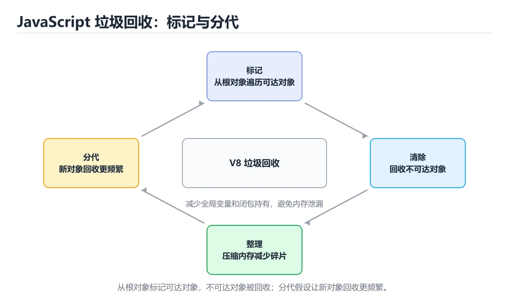
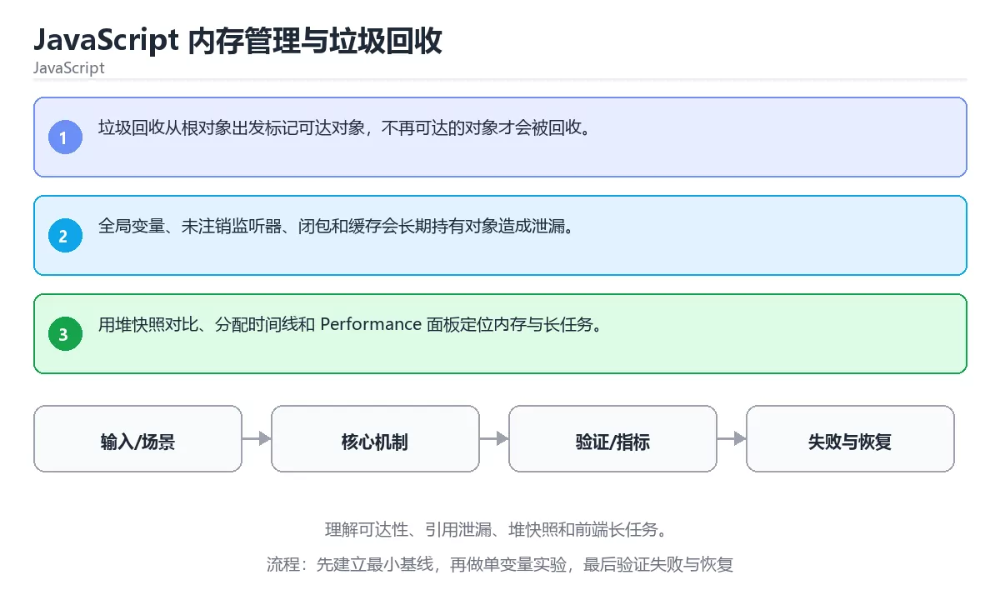

# JavaScript 内存管理与垃圾回收

> 内容更新时间：2026-10-06 · 学习阶段：高级 · 预计用时：45 分钟





## 本节知识框架

**课程定位**：所属分类为「JavaScript」，课程主题为「JavaScript 内存管理与垃圾回收」，学习阶段为「高级」，建议用时 45 分钟。

**本课要解决的主问题**：理解可达性、引用泄漏、堆快照和前端长任务。

| 学习层次 | 要回答的问题 | 完成判据 |
| --- | --- | --- |
| 概念层 | 「JavaScript 内存管理与垃圾回收」有哪些必须区分的对象与术语？ | 能用自己的话定义核心术语，并各举一个正例和一个反例。 |
| 机制层 | 这些对象按什么顺序发生作用，输入如何变成输出？ | 能画出或写出机制步骤，并说明每一步的失败条件。 |
| 应用层 | 什么场景适合使用「JavaScript 内存管理与垃圾回收」，什么场景不适合？ | 能给出一个真实场景、一个最小示例和一个边界案例。 |
| 性能层 | 时间、空间、吞吐或延迟受哪些量影响？ | 能说出复杂度或性能瓶颈的证据来源；没有证据时明确写“材料未提供”。 |
| 复习层 | 怎样确认自己不是只记住了结论？ | 能独立完成本课自测，并把错误定位到概念、机制、示例或边界。 |

### 阅读路线

1. 先读「核心概念定义」，建立「内存」等对象的精确定义。
2. 再读「原理与运行机制」，把定义串成可重复的过程。
3. 用「代码/协议/SQL 示例」验证过程，并只改一个条件观察结果变化。
4. 最后检查性能、易错点、知识关系与自测题，形成可复习的证据链。

**前置知识**：《JavaScript 执行上下文与闭包》

**学习位置**：本课位于《JavaScript 执行上下文与闭包》之后；如果前一课的自测不能通过，应先回补再继续。

**后续衔接**：下一课《Node.js 后端工程》会继续使用本课术语，学完后建议立即完成一次自测。

**教材衔接：学习目标**

- 能用自己的话解释：垃圾回收从根对象出发标记可达对象，不再可达的对象才会被回收。
- 能用自己的话解释：全局变量、未注销监听器、闭包和缓存会长期持有对象造成泄漏。
- 能用自己的话解释：用堆快照对比、分配时间线和 Performance 面板定位内存与长任务。
- 能把本课知识放回「JavaScript」，并完成练习与测验。

**教材衔接：前置知识**

- 能运行 WeakSet 所在的示例环境，并读懂报错信息。
- 本课关键词：内存、GC、堆快照、泄漏。
- 遇到不熟悉的术语先记录问题，完成练习后再回读。

**教材衔接：本课小结**

- 本课围绕 内存、GC、堆快照、泄漏 展开，复习时重点核对它们的输入、输出和失败路径。
- 完成练习和测验后，把 内存 上仍然不确定的问题写成下一轮验证清单。

## 核心概念定义

> 阅读约定：本课先给「JavaScript 内存管理与垃圾回收」相关术语的操作性定义与适用边界；正文里的口语化说法与定义冲突时，以定义和可复现示例为准。

| 术语 | 操作性定义 | 本课中的边界 |
| --- | --- | --- |
| 内存 | 程序运行时保存指令、数据与对象的高速可寻址存储。 | 仅在「JavaScript 内存管理与垃圾回收」明确给出的输入、版本与资源条件下成立。 |
| GC | 垃圾回收，运行时自动回收不再可达的对象并管理内存。 | 仅在「JavaScript 内存管理与垃圾回收」明确给出的输入、版本与资源条件下成立。 |
| 堆快照 | 按“JavaScript 内存管理与垃圾回收”中 内存、GC、堆快照 的实践顺序，把四个步骤排成从准备到复盘的合理顺序。 | 仅在「JavaScript 内存管理与垃圾回收」明确给出的输入、版本与资源条件下成立。 |
| 泄漏 | 资源、内存或敏感信息未被正确释放或被未授权方获取。 | 仅在「JavaScript 内存管理与垃圾回收」明确给出的输入、版本与资源条件下成立。 |

### 定义如何使用

在「JavaScript 内存管理与垃圾回收」中判断一个说法是否成立，先确认它使用的是哪个对象的定义，再检查输入规模、运行环境与失败路径。定义不是口号，而是后续推导、代码示例和自测题共享的约束。

## 原理与运行机制

### 机制总览

1. **建立输入**：把「内存」按本课定义整理成可观察、可重复的输入条件。
2. **执行转换**：围绕「GC」执行本课的核心步骤；每一步都记录中间状态，避免只看最终输出。
3. **产生输出**：得到「堆快照」后，用正文示例或协议/SQL 结果核对输出是否符合预期。
4. **改变一个条件**：只替换一个边界条件或环境参数，观察「JavaScript 内存管理与垃圾回收」的结论是否仍然成立。

| 阶段 | 关注对象 | 失败时应检查 |
| --- | --- | --- |
| 输入 | 内存 | 类型、范围、编码、版本或前置状态是否满足定义。 |
| 处理 | GC | 顺序、可见性、锁、路由、事务或调度规则是否被破坏。 |
| 输出 | 堆快照 | 结果是否可复现，错误是否被正确传播而不是被吞掉。 |

本课的机制结论要用「JavaScript 内存管理与垃圾回收」自己的示例验证。「JavaScript 内存管理与垃圾回收」没有给出某个数量级、吞吐或内存数据时，本课把该判断标为“材料未提供”，不从相邻主题外推。

**教材衔接：核心知识**

### 1. 垃圾回收从根对象出发标记可达对象，不再可达的对象才会被回收。

- 关键做法：基线只保留 GC 必需的部分，其余条件一次加一个。
- 验证标准：GC 的异常路径有明确错误信息与恢复动作。

### 2. 全局变量、未注销监听器、闭包和缓存会长期持有对象造成泄漏。

把这条结论放回「JavaScript 内存管理与垃圾回收」的完整流程里展开：

- 正文依据：能用自己的话解释：全局变量、未注销监听器、闭包和缓存会长期持有对象造成泄漏。
- 落地检查：把「2. 全局变量、未注销监听器、闭包和缓存会长期持有对象造成泄漏。」改写成一条可执行的核对项，逐条验证输入、超时与失败路径。

### 3. 用堆快照对比、分配时间线和 Performance 面板定位内存与长任务。

把这条结论放回「JavaScript 内存管理与垃圾回收」的完整流程里展开：

- 正文依据：能用自己的话解释：用堆快照对比、分配时间线和 Performance 面板定位内存与长任务。
- 落地检查：把「3. 用堆快照对比、分配时间线和 Performance 面板定位内存与长任务。」改写成一条可执行的核对项，逐条验证输入、超时与失败路径。

**教材衔接：关键流程**

```text
输入 → 校验 → 核心处理 → 验证 → 记录指标 → 失败恢复
```

**教材衔接：实践路径**

1. 用一句话复述本课要解决的问题。
2. 跑通正文中的最小示例并记录基线。
3. 只改变一个输入或参数，预测并验证结果。
4. 补一个失败路径，记录错误、恢复和指标。
5. 把结论写成可复现的笔记或测试。

**教材衔接：版本与时效**

- WeakSet 依赖的新 API 必须有降级路径，否则老环境直接报错。
- 升级前先用 WeakSet 建立基线：记录版本、命令和输出，升级后只比较这些可观察量。

### 升级检查清单

- 先固定当前版本，跑通全部示例与测验，再升级工具链。
- 一次只改一个版本条件，把 内存 相关的差异单独记成一条结论。
- 先回归 内存 与 GC 的默认行为和错误信息，再扩大测试范围。
- 升级后把 WeakSet 的实测版本写进「内容元数据」，再更新复核日期。

**教材衔接：验证步骤**

1. 记录运行环境、命令和真实输出。
2. 修改一个输入，先写预测再运行。
4. 把结论写回本课笔记或测试用例。

## 典型应用场景

| 场景 | 典型输入或前提 | 期望产物 |
| --- | --- | --- |
| 学习验证 | 使用本课最小示例和 内存、GC | 能复现正文结论，并解释每一步。 |
| 工程落地 | 把「JavaScript 内存管理与垃圾回收」放入真实模块或服务边界 | 输出可观测、失败可定位、参数可配置。 |
| 故障排查 | 只改一个版本、规模、输入或依赖条件 | 能区分概念错误、实现错误和环境差异。 |

判断「JavaScript 内存管理与垃圾回收」的场景是否成立，标准是能否写出输入、处理、输出和失败路径；材料中没有出现的数据在本课标注为“材料未提供”，不用推测替代证据。

**课程内置实验入口**：`sandbox:javascript`，用于动手验证《JavaScript 内存管理与垃圾回收》的机制；实验结论不替代概念定义与复杂度分析。

**教材衔接：深度拓展与实战**

这一节把「JavaScript 内存管理与垃圾回收」的判断依据、示例和反例整理成复习步骤。

### 机制拆解

- **1. 垃圾回收从根对象出发标记可达对象，不再可达的对象才会被回收。**：在「JavaScript 内存管理与垃圾回收」里，「1. 垃圾回收从根对象出发标记可达对象，不再可达的对象才会被回收。」这一步要先写清输入与预期，再记录实际结果和差异；结果不符时回到对应小节核对前提。
- **2. 全局变量、未注销监听器、闭包和缓存会长期持有对象造成泄漏。**：在「JavaScript 内存管理与垃圾回收」里，「2. 全局变量、未注销监听器、闭包和缓存会长期持有对象造成泄漏。」这一步要先写清输入与预期，再记录实际结果和差异；结果不符时回到对应小节核对前提。
- **3. 用堆快照对比、分配时间线和 Performance 面板定位内存与长任务。**：在「JavaScript 内存管理与垃圾回收」里，「3. 用堆快照对比、分配时间线和 Performance 面板定位内存与长任务。」这一步要先写清输入与预期，再记录实际结果和差异；结果不符时回到对应小节核对前提。
- **考点 1：按“JavaScript 内存管理与垃圾回收”中 内存、GC、堆快照 的实践顺序，把四个步骤排成从准备到复盘的合理顺序。**：先独立作答，再回到本课对应小节核对判断依据；答错时记录是哪一个前提被忽略。
- **考点 2：关于「全局变量、未注销监听器、闭包和缓存会长期持有对象造成泄漏。」，下列说法正确的是？**：先独立作答，再回到本课对应小节核对判断依据；答错时记录是哪一个前提被忽略。

### 边界条件与常见反例

「JavaScript 内存管理与垃圾回收」的边界不只包括最大最小值，还要覆盖空、重复和失败：

| 条件 | 常见反例 | 处理方式 |
| --- | --- | --- |
| 空输入 | 内存 没有任何取值 | 先判空，给出明确错误而不是继续执行 |
| 边界值 | GC 取最小或最大 | 用最小值、最大值和越界值各跑一次 |
| 重复执行 | 同一输入被执行两次 | 保证结果可重复，必要时加锁或去重 |
| 失败路径 | 内存 相关步骤报错 | 保留原始错误，确认回滚或重试行为 |

### 工程检查表

- [ ] 能否用自己的话说明JavaScript 内存管理与垃圾回收解决什么问题，以及它不负责什么？
- [ ] 能否说明 内存 的正常输出，以及失败时留下的错误信息？
- [ ] 能否解释本课关键词在真实项目中的边界与取舍？
- [ ] 能否说明 GC 在新场景下需要补充什么前提？

### 迁移练习

1. 保持正文示例不变，写出它的输入、处理步骤和预期输出。
2. 只改变 内存 的一个条件，预测结果并说明依据；再运行或手算验证。
3. 结合内存、GC、堆快照、泄漏，写出一个真实项目中的使用场景。
4. 写下一个反例，说明它在什么条件下会使朴素做法失效。

## 代码/协议/SQL 示例

### 最小可验证示例

下面保留《JavaScript 内存管理与垃圾回收》原文中的最小示例。先预测《JavaScript 内存管理与垃圾回收》示例的输出，再按正文步骤运行或推演；示例依赖外部环境时，同时记录版本与输入。

```text
输入 → 校验 → 核心处理 → 验证 → 记录指标 → 失败恢复
```

**教材衔接：最小可运行示例**

先用 WeakSet 跑通最小示例，然后只改一个与 内存 相关的取值：

```javascript
const tracked = new WeakSet();
let node = { id: 1 };
tracked.add(node);
console.log("tracked:", tracked.has(node));
node = null;
console.log("after release:", tracked.has(node));
```

**教材衔接：预期输出**

```text
tracked: true
after release: false
```

## 时间/空间复杂度或性能分析

**复杂度证据**：「JavaScript 内存管理与垃圾回收」的现有材料没有给出渐近时间或空间复杂度的明确结论，本课只做定性检查，不补写未经验证的 $O$ 记号。

| 维度 | 本课关注点 | 判断依据 |
| --- | --- | --- |
| 时间/延迟 | 「JavaScript 内存管理与垃圾回收」的主要步骤是否会随输入规模、并发度或网络往返增长。 | 以正文复杂度、基准数据或可重复测量为准。 |
| 空间/内存 | 中间状态、缓存、副本、连接或索引是否随规模增长。 | 记录峰值内存与数据副本，不只看最终结果。 |
| 吞吐/资源 | 版本、调度、锁、IO、序列化或协议开销是否成为瓶颈。 | 固定环境做对照实验，改变一个变量。 |

评估「JavaScript 内存管理与垃圾回收」时要区分“正确性成立”和“性能达标”两件事；材料没有给出基准时，本课只保留量级来源与测量方法，不写不可验证的绝对数字。

## 常见误区与易错点

> 复核《JavaScript 内存管理与垃圾回收》的易错点时，优先保留原文的错误表、故障现场与排错路径；每条修正都要能用本课示例复验。

| 易错点 | 常见表现 | 正确做法 |
| --- | --- | --- |
| 只背结论 | 能复述「JavaScript 内存管理与垃圾回收」的定义，却说不清输入、输出与边界。 | 回到机制步骤，用最小示例逐一验证。 |
| 混淆相邻概念 | 把本课对象与相邻主题的对象当成同一类。 | 先比较定义、资源归属、生命周期和失败模式。 |
| 忽略版本与环境 | 在开发机通过后直接外推到生产环境。 | 固定版本、输入和资源条件，再记录可复现结果。 |

**教材衔接：常见错误与排查**

> 说明：本表由《JavaScript 内存管理与垃圾回收》的核心知识整理（2026-10-07），人工复核进度见 docs/content_review_batches.md。

| 易错点 | 容易踩的做法 | 正确结论 |
| --- | --- | --- |
| 定时器与监听不清理 | 对象无法回收，内存持续增长 | 组件销毁时移除监听与定时器 |
| 闭包长期持有大对象 | 内存无法释放 | 缩小闭包捕获范围，只保留必要数据 |
| 靠手动触发回收掩盖问题 | 真实泄漏被隐藏 | 用内存快照对比定位泄漏对象 |

**教材衔接：故障现场**

### 现场 1：定时器与监听不清理

**症状**：在《JavaScript 内存管理与垃圾回收》的复现场景中，对象无法回收，内存持续增长。

**根因**：“对象无法回收，内存持续增长”只是表层结果。向上追溯会落到“定时器与监听不清理”这一步，因为它省略了《JavaScript 内存管理与垃圾回收》的约束，使实现行为和预期模型发生了偏离。

**修复**：针对《JavaScript 内存管理与垃圾回收》的问题，组件销毁时移除监听与定时器。

**验证**：保留《JavaScript 内存管理与垃圾回收》里触发“对象无法回收，内存持续增长”的输入、版本和日志，按“组件销毁时移除监听与定时器”完成修改后原样重放；只有失败现象消失且相邻场景仍可解释，才保留改动。

### 现场 2：闭包长期持有大对象

**症状**：在《JavaScript 内存管理与垃圾回收》的复现场景中，内存无法释放。

**根因**：触发点是把“闭包长期持有大对象”当成安全做法。它没有满足《JavaScript 内存管理与垃圾回收》要求的前提，因此先表现为“内存无法释放”；排查时先完整复现这一段，再核对输入、配置与依赖。

**修复**：针对《JavaScript 内存管理与垃圾回收》的问题，缩小闭包捕获范围，只保留必要数据。

**验证**：先在《JavaScript 内存管理与垃圾回收》中记录“闭包长期持有大对象”留下的失败证据，再执行“缩小闭包捕获范围，只保留必要数据”并重放；确认错误路径变为明确结果，且修复没有掩盖同类故障。

### 现场 3：靠手动触发回收掩盖问题

**症状**：在《JavaScript 内存管理与垃圾回收》的复现场景中，真实泄漏被隐藏。

**根因**：“真实泄漏被隐藏”只是表层结果。向上追溯会落到“靠手动触发回收掩盖问题”这一步，因为它省略了《JavaScript 内存管理与垃圾回收》的约束，使实现行为和预期模型发生了偏离。

**修复**：针对《JavaScript 内存管理与垃圾回收》的问题，用内存快照对比定位泄漏对象。

**验证**：先在《JavaScript 内存管理与垃圾回收》中记录“靠手动触发回收掩盖问题”留下的失败证据，再执行“用内存快照对比定位泄漏对象”并重放；确认错误路径变为明确结果，且修复没有掩盖同类故障。

**教材衔接：工程化精练：决策、失败与验证**

这一章把「JavaScript 内存管理与垃圾回收」从“看懂”推进到“能判断、能验证、能排错”。所有判断都围绕内存、GC与堆快照展开，并与前文的示例、测验和失败现场互相对照。

### 一、内存 的判断算法

| 步骤 | 要回答的问题 | 判断依据 | 记录什么 |
| --- | --- | --- | --- |
| 1. 定目标 | 「JavaScript 内存管理与垃圾回收」这一步要解决什么问题？ | 把内存的目标写成一句可验证的结论 | 输入、约束、成功标准 |
| 2. 找边界 | GC在什么条件下失效？ | 先列空值、极值、重复和失败路径 | 反例与触发条件 |
| 3. 跑基线 | 原始示例的真实输出是什么？ | 命令、版本和环境必须可复现 | 命令、输出、耗时 |
| 4. 只改一处 | 把堆快照换成另一种取值会怎样？ | 预测写在运行之前 | 预测与实际的差异 |
| 5. 回写结论 | 结论能否被他人复现？ | 把判断写成清单或测试 | 结论、证据、遗留问题 |

这张表的用法不是从上到下浏览，而是每次只填一行：先用「JavaScript 内存管理与垃圾回收」前文的示例验证第 3 行，再故意破坏一个条件验证第 2 行。当你能在不看解析的情况下说出内存的判断依据，才算真正掌握本课。

- 先从内存入手：把它写成“输入是什么、输出是什么、哪一步最容易出错”。如果这三句话中有一句说不清，说明对「JavaScript 内存管理与垃圾回收」的理解还停留在术语层面，需要回到正文的最小示例重新观察一次。

- 再把GC当成对照实验的变量：固定其他条件，只改变它的取值，记录输出是否变化。结论“变”或“不变”都要写出理由，并说明这个理由能否被他人独立复现。

- 针对堆快照做一次失败演练：故意给出空值、极值或错误类型，观察「JavaScript 内存管理与垃圾回收」的报错位置和处理方式。错误信息只是入口，真正要定位的是哪一层假设被破坏。

- 把「JavaScript 内存管理与垃圾回收」的结论压缩成一条可执行清单：先检查输入，再检查版本与环境，然后跑最小用例，最后才扩大规模。顺序颠倒会让排错范围成倍增加。

- 如果结论依赖时间或规模，就把数据量提高一个数量级再跑一次。在「JavaScript 内存管理与垃圾回收」里，小样本成立不代表大样本成立，复杂度、资源占用和失败率都要重新记录。

- 如果结论依赖并发或共享状态，就固定输入并连续运行多次。结果不一致时，优先怀疑「JavaScript 内存管理与垃圾回收」中内存相关步骤的隐藏状态，而不是先改代码。

- 把「JavaScript 内存管理与垃圾回收」的判断写成测试：一个正常用例、一个边界用例、一个失败用例。测试通过只是起点，还要确认失败用例确实以预期方式失败。

- 把本课与相邻主题连起来：内存解决的是“怎么做”，GC回答“什么时候不适用”。两者都答得出来，迁移才算完成。

> 第 2 轮复核「JavaScript 内存管理与垃圾回收」：把上面的结论逐条改写为可验证的问题，并记录仍不确定的部分。

- 先从内存入手：把它写成“输入是什么、输出是什么、哪一步最容易出错”。如果这三句话中有一句说不清，说明对「JavaScript 内存管理与垃圾回收」的理解还停留在术语层面，需要回到正文的最小示例重新观察一次。

- 再把GC当成对照实验的变量：固定其他条件，只改变它的取值，记录输出是否变化。结论“变”或“不变”都要写出理由，并说明这个理由能否被他人独立复现。

### 二、JavaScript 内存管理与垃圾回收 的机制拆解与自测

把本课考点还原成可回答的问题，再逐题写出依据：

**问题 1**：按“JavaScript 内存管理与垃圾回收”中 内存、GC、堆快照 的实践顺序，把四个步骤排成从准备到复盘的合理顺序。

- 关联术语：内存
- 判断依据：写出最小示例并核对 GC 的基线结果
- 追问：如果把内存的条件换成边界值，这个结论是否仍然成立？

**问题 2**：关于「全局变量、未注销监听器、闭包和缓存会长期持有对象造成泄漏。」，下列说法正确的是？

- 关联术语：GC
- 判断依据：全局变量、未注销监听器、闭包和缓存会长期持有对象造成泄漏。
- 追问：如果把GC的条件换成边界值，这个结论是否仍然成立？

**问题 3**：关于「用堆快照对比、分配时间线和 Performance 面板定位内存与长任务。」，下列说法正确的是？

- 关联术语：堆快照
- 判断依据：用堆快照对比、分配时间线和 Performance 面板定位内存与长任务。
- 追问：如果把堆快照的条件换成边界值，这个结论是否仍然成立？

**问题 4**：「JavaScript 内存管理与垃圾回收」的核心学习目标是什么？

- 关联术语：泄漏
- 判断依据：理解可达性、引用泄漏、堆快照和前端长任务。
- 追问：如果把泄漏的条件换成边界值，这个结论是否仍然成立？

**问题 5**：以下哪些术语与「JavaScript 内存管理与垃圾回收」直接相关？（多选）

- 关联术语：内存
- 判断依据：回到「JavaScript 内存管理与垃圾回收」正文对应小节，先用最小示例验证再下结论。
- 追问：如果把内存的条件换成边界值，这个结论是否仍然成立？

**问题 6**：阅读「JavaScript 内存管理与垃圾回收」的代码片段，下面哪项判断是正确的？

- 关联术语：GC
- 判断依据：回到「JavaScript 内存管理与垃圾回收」正文对应小节，先用最小示例验证再下结论。
- 追问：如果把GC的条件换成边界值，这个结论是否仍然成立？

### 三、失败模式与修复顺序

| 失败信号 | 常见根因 | 先做什么 | 修复后如何确认 |
| --- | --- | --- | --- |
| 「JavaScript 内存管理与垃圾回收」中 内存 相关步骤报错 | 输入、版本或前置条件与示例不一致 | 保留第一条错误信息，回到最小输入 | 用写出最小示例并核对 GC 的基线结果复跑，确认输出可复现 |
| 「JavaScript 内存管理与垃圾回收」中 GC 相关步骤报错 | 输入、版本或前置条件与示例不一致 | 保留第一条错误信息，回到最小输入 | 用全局变量、未注销监听器、闭包和缓存会长期持有对象造成泄漏。复跑，确认输出可复现 |
| 「JavaScript 内存管理与垃圾回收」中 堆快照 相关步骤报错 | 输入、版本或前置条件与示例不一致 | 保留第一条错误信息，回到最小输入 | 用用堆快照对比、分配时间线和 Performance 面板定位内存与长任务。复跑，确认输出可复现 |
- 检查点：固定版本与输入重跑《JavaScript 内存管理与垃圾回收》，记录两次差异并定位不稳定条件。
| 单次结果正确但规模一大就失效 | 只测了正常路径，没有覆盖边界 | 把数据量或并发度提高一个数量级 | 记录边界值、耗时与失败率 |

排错顺序固定为：先复现，再缩小输入，然后只改一个条件，最后把结论写成回归用例。对「JavaScript 内存管理与垃圾回收」来说，任何不能复现的“修好了”都不算完成。

### 四、离开本课前的验证清单

| 检查项 | 通过标准 | 证据 |
| --- | --- | --- |
| 能复述 | 用三句话说明「JavaScript 内存管理与垃圾回收」解决什么问题、边界在哪 | 不看解析写出的结论 |
| 能运行 | 最小示例在本机跑通 | 命令、输出与版本 |
| 能改条件 | 只改一个输入并解释差异 | 预测与实际的对照 |
| 能排错 | 至少制造并修复一个失败 | 错误信息与修复步骤 |
| 能迁移 | 把内存、GC、堆快照、泄漏用到新场景 | 一个自选练习的结论 |

完成标准：能不看解析说清「JavaScript 内存管理与垃圾回收」全部自测题的依据，并且至少有一条内存相关的结论经过真实运行验证。如果某一步只停留在“感觉懂了”，就把它写成下一轮针对「JavaScript 内存管理与垃圾回收」的最小验证任务。

### 五、把结论写成可检查的证据

学习「JavaScript 内存管理与垃圾回收」时，最容易出现的情况是“听过、看懂了，但换一个输入就说不清”。下面把内存与GC放进一条可检查的证据链：每一句结论都要能回答“从哪里来、在什么条件下成立、失败时怎么发现”。

| 证据类型 | 本课要求 | 不合格的表现 |
| --- | --- | --- |
| 概念证据 | 用一句话说明内存的定义与适用场景 | 只背术语，说不出它解决什么问题 |
| 运行证据 | 能复现「JavaScript 内存管理与垃圾回收」的最小示例 | 输出与记录对不上，或换机器就不一致 |
| 对照证据 | 只改一个条件，说明差异来自哪里 | 一次改多个变量，无法归因 |
| 失败证据 | 故意制造错误并记录恢复步骤 | 只测正常路径，失败时靠猜 |
| 迁移证据 | 把GC用到自选场景 | 换一个例子就完全套不上 |

举例：写出最小示例并核对 GC 的基线结果。把这个结论代回「JavaScript 内存管理与垃圾回收」的正文，找出它对应的输入、处理步骤与输出；再换掉其中一个条件，观察结论是否仍然成立。能完成这一步，才说明这条知识已经从“记忆”变成“可用的判断”。

最后留一个自检问题：如果只能保留三条笔记，你会写下哪三句？把答案限定为「JavaScript 内存管理与垃圾回收」中的可验证结论，并给每条结论配一个反例。这三句加上对应反例，就是本课最值得带入后续课程的复习材料。

## 与其他知识点的关系

| 关系 | 课程 | 为什么 |
| --- | --- | --- |
| 先修 | 《JavaScript 执行上下文与闭包》 | 本课会直接使用它的概念或操作前提。 |
| 关联 | 《Node.js 后端工程》 | 用于横向比较或把本课结论迁移到相邻主题。 |
| 前置顺序 | 《JavaScript 执行上下文与闭包》 | 同分类中安排在本课之前，建议先完成其自测。 |
| 后续顺序 | 《Node.js 后端工程》 | 同分类中安排在本课之后，会继续使用本课术语。 |

把「JavaScript 内存管理与垃圾回收」放回知识体系时，不只要记住“前面学过什么”，还要说明两个主题在输入、机制、资源边界和失败模式上的差异。这样才能把单课知识迁移到项目、排障和后续课程。

**教材衔接：复习与迁移**

复习目标：把「JavaScript 内存管理与垃圾回收」的判断标准放回可复现的例子里。先自己作答，再对照依据；如果结论正确但理由不完整，回到正文补足前提。

### 概念复述

- 用一句话说明「JavaScript 内存管理与垃圾回收」解决什么问题：理解可达性、引用泄漏、堆快照和前端长任务。
- 写出内存、GC、堆快照之间的关系，并各举一个例子。
- 说出本课最容易混淆的两个概念，以及区分它们的判据。

### 测验回顾

1. 按“JavaScript 内存管理与垃圾回收”中 内存、GC、堆快照 的实践顺序，把四个步骤排成从准备到复盘的合理顺序。
   - 依据：在「JavaScript 内存管理与垃圾回收」里，在本课的练习里，顺序应当是：先明确 内存 的输入、输出与约束 → 写出最小示例并核对 GC 的基线结果 → 只改一个变量，记录边界与失败路径的变化 → 固定版本与证据，把本课的结论写成可复现记录。这个顺序把 内存 的输入、输出和约束放在最前面，在JavaScript 内存管理与垃圾回收里避免概念没对齐就开始调参。第二步用 GC 建立可核对的基线，在JavaScript 内存管理与垃圾回收里第三步才允许改变一个变量并观察失败路径。
2. 关于「全局变量、未注销监听器、闭包和缓存会长期持有对象造成泄漏。」，下列说法正确的是？
   - 依据：在「JavaScript 内存管理与垃圾回收」里，全局变量、未注销监听器、闭包和缓存会长期持有对象造成泄漏。回到「JavaScript 内存管理与垃圾回收」的正文示例，用“关于全局变量、未注销监听器、闭包和缓”走一遍内存、GC、堆快照的完整流程，能复现的结论才可以保留。
3. 关于「用堆快照对比、分配时间线和 Performance 面板定位内存与长任务。」，下列说法正确的是？
   - 依据：在「JavaScript 内存管理与垃圾回收」里，用堆快照对比、分配时间线和 Performance 面板定位内存与长任务。回到「JavaScript 内存管理与垃圾回收」的正文示例，用“关于用堆快照对比、分配时间线和 Pe”走一遍内存、GC、堆快照的完整流程，能复现的结论才可以保留。
4. 「JavaScript 内存管理与垃圾回收」的核心学习目标是什么？
   - 依据：在「JavaScript 内存管理与垃圾回收」里，这道题要求区分概念与边界，「理解可达性、引用泄漏、堆快照和前端长任务。在「JavaScript 内存管理与垃圾回收」里，」只有在题干给出的前提下才成立，而「理解调用栈、词法作用域、闭包、this 和暂时性死区。在「JavaScript 内存管理与垃圾回收」里，」、「覆盖异步 IO、事件循环、进程模型、错误处理和部署。」缺少同一组条件。
5. 以下哪些术语与「JavaScript 内存管理与垃圾回收」直接相关？（多选）
   - 依据：在「JavaScript 内存管理与垃圾回收」里，GC。在「JavaScript 内存管理与垃圾回收」里判断这道题，要把内存、GC、堆快照的条件、过程与失败路径逐项对齐，换成“以下哪些术语与JavaScript”这个场景，只有满足前提的结论才成立。
6. 阅读「JavaScript 内存管理与垃圾回收」的代码片段，下面哪项判断是正确的？
   - 依据：在「JavaScript 内存管理与垃圾回收」里，垃圾回收从根对象出发标记可达对象，不再可达的对象才会被回收。这道题的关键在「JavaScript 内存管理与垃圾回收」的内存、GC、堆快照：先确认题干“阅读JavaScript 内存管理与”问的是哪一步，再排除偷换前提的选项。

### 迁移练习

把「JavaScript 内存管理与垃圾回收」的结论迁移到相邻主题，每次迁移都写清预测与证据：

1. 换输入：用内存处理一组你自己的数据，对比教材示例的结果差异。
2. 换失败条件：制造一个GC相关的错误，说明如何从错误信息定位根因。
3. 换规模：把数据量或并发度提高一个数量级，说明「JavaScript 内存管理与垃圾回收」的结论是否仍成立。

## 自测题与参考答案

> 先独立作答《JavaScript 内存管理与垃圾回收》的自测题，再对照答案与解析；每处判断都要能在本课正文或示例中找到依据。

### 自测 1

按“JavaScript 内存管理与垃圾回收”中 内存、GC、堆快照 的实践顺序，把四个步骤排成从准备到复盘的合理顺序。

A. 写出最小示例并核对 GC 的基线结果
B. 只改一个变量，记录边界与失败路径的变化
C. 固定版本与证据，把“JavaScript 内存管理与垃圾回收”的结论写成可复现记录
D. 先明确 内存 的输入、输出与约束

**参考答案**：先明确 内存 的输入、输出与约束 → 写出最小示例并核对 GC 的基线结果 → 只改一个变量，记录边界与失败路径的变化 → 固定版本与证据，把“JavaScript 内存管理与垃圾回收”的结论写成可复现记录

**解析**：在「JavaScript 内存管理与垃圾回收」里，在本课的练习里，顺序应当是：先明确 内存 的输入、输出与约束 → 写出最小示例并核对 GC 的基线结果 → 只改一个变量，记录边界与失败路径的变化 → 固定版本与证据，把本课的结论写成可复现记录。这个顺序把 内存 的输入、输出和约束放在最前面，在JavaScript 内存管理与垃圾回收里避免概念没对齐就开始调参。第二步用 GC 建立可核对的基线，在JavaScript 内存管理与垃圾回收里第三步才允许改变一个变量并观察失败路径。

### 自测 2

关于「全局变量、未注销监听器、闭包和缓存会长期持有对象造成泄漏。」，下列说法正确的是？

A. 全局变量、未注销监听器、闭包和缓存会长期持有对象造成泄漏。
B. this 由调用方式决定，箭头函数捕获外层 this。
C. cluster/worker_threads 分别适合多进程扩展和 CPU 并行，但共享状态要重新设计。
D. 只要小数据能跑通，大规模和异常情况也一定正确。

**参考答案**：全局变量、未注销监听器、闭包和缓存会长期持有对象造成泄漏。

**解析**：在「JavaScript 内存管理与垃圾回收」里，全局变量、未注销监听器、闭包和缓存会长期持有对象造成泄漏。回到「JavaScript 内存管理与垃圾回收」的正文示例，用“关于全局变量、未注销监听器、闭包和缓”走一遍内存、GC、堆快照的完整流程，能复现的结论才可以保留。

### 自测 3

以下哪些术语与「JavaScript 内存管理与垃圾回收」直接相关？（多选）

A. 内存
B. 探针
C. GC
D. 接口

**参考答案**：内存；GC

**解析**：在「JavaScript 内存管理与垃圾回收」里，GC。在「JavaScript 内存管理与垃圾回收」里判断这道题，要把内存、GC、堆快照的条件、过程与失败路径逐项对齐，换成“以下哪些术语与JavaScript”这个场景，只有满足前提的结论才成立。

**教材衔接：动手练习**

1. 合上教程，用 3～5 句话解释JavaScript 内存管理与垃圾回收。
2. 从正文选一个例子，改变一个条件并预测结果。
3. 设计一个失败场景，写出止损与恢复步骤。

**验收标准**：留下输入、命令、输出、差异和下一步问题。

**教材衔接：可运行练习**

### 任务 1：先跑通，再解释

```javascript
const tracked = new WeakSet();
let node = { id: 1 };
tracked.add(node);
console.log("tracked:", tracked.has(node));
node = null;
console.log("after release:", tracked.has(node));
```

### 任务 2：只改一个条件

把「JavaScript 内存管理与垃圾回收」的最小示例复制一份，只改一个条件再跑一次：

- 改动点：把 GC 换成边界值，其他输入保持原样。
- 预测：先写下「JavaScript 内存管理与垃圾回收」在改动后的输出或错误信息，再运行。
- 记录：对照改动前后的结果，指出差异出在哪一步。
- 验收：换回原条件能复现原结果，改动只影响内存。

### 任务 3：迁移到自己的数据

换一个 GC 场景重做一次，确认结论不是只对示例数据成立。

**教材衔接：本课复习清单**

离开本课前，逐项确认：

- [ ] 不看解析，能说出「关于「全局变量、未注销监听器、闭包和缓存会长期持有对象造成泄漏。」，下列说法正确的是？」的判断依据。
- [ ] 不看解析，能说出「关于「用堆快照对比、分配时间线和 Performance 面板定位内存与长任务。」，下列说法正确的是？」的判断依据。
- [ ] 不看解析，能说出「「JavaScript 内存管理与垃圾回收」的核心学习目标是什么？」的判断依据。
- [ ] 至少运行一次《JavaScript 内存管理与垃圾回收》的示例，记录输入、输出和一个边界情况。
- [ ] 把本课最容易混淆的两个概念写成一句话对照。

| 复盘项 | 记录 |
| --- | --- |
| 已经能独立解释的考点 |  |
| 仍然说不清的概念 |  |
| 下一步验证动作 |  |

**教材衔接：复习与自测**

下面按正文顺序回顾「JavaScript 内存管理与垃圾回收」的每一节；说不清的地方回到 核心知识 补课。

### 核心知识

自检：这一节与相邻主题的边界在哪里？

### 动手练习

自检：如果去掉这一节里的一个前提，结论会怎样变化？

### 最小可运行示例

```javascript
const tracked = new WeakSet();
let node = { id: 1 };
tracked.add(node);
console.log("tracked:", tracked.has(node));
node = null;
console.log("after release:", tracked.has(node));
```

自检：把这一节讲给没学过的人，最需要强调哪一点？

### 预期输出

```text
tracked: true
after release: false
```

### 验证步骤

制造一次错误输入，记录错误信息与修复方式。

---

## 术语速查

| 术语 | 一句话说明 |
| --- | --- |
| `内存` | 程序运行时保存指令、数据与对象的高速可寻址存储。 |
| `GC` | 垃圾回收，运行时自动回收不再可达的对象并管理内存。 |
| `堆快照` | 按“JavaScript 内存管理与垃圾回收”中 内存、GC、堆快照 的实践顺序，把四个步骤排成从准备到复盘的合理顺序。 |
| `泄漏` | 资源、内存或敏感信息未被正确释放或被未授权方获取。 |

## 考点精讲

### 考点 1：顺序排列·内存

- **题目**：按“JavaScript 内存管理与垃圾回收”中 内存、GC、堆快照 的实践顺序，把四个步骤排成从准备到复盘的合理顺序。
- **判断依据**：在「JavaScript 内存管理与垃圾回收」里，在本课的练习里，顺序应当是：先明确 内存 的输入、输出与约束 → 写出最小示例并核对 GC 的基线结果 → 只改一个变量，记录边界与失败路径的变化 → 固定版本与证据，把本课的结论写成可复现记录。这个顺序把 内存 的输入、输出和约束放在最前面，在JavaScript 内存管理与垃圾回收里避免概念没对齐就开始调参。第二步用 GC 建立可核对的基线，在JavaScript 内存管理与垃圾回收里第三步才允许改变一个变量并观察失败路径。

### 考点 2：概念判断·内存

- **题目**：关于「全局变量、未注销监听器、闭包和缓存会长期持有对象造成泄漏。」，下列说法正确的是？
- **判断依据**：在「JavaScript 内存管理与垃圾回收」里，全局变量、未注销监听器、闭包和缓存会长期持有对象造成泄漏。回到「JavaScript 内存管理与垃圾回收」的正文示例，用“关于全局变量、未注销监听器、闭包和缓”走一遍内存、GC、堆快照的完整流程，能复现的结论才可以保留。

### 考点 3：概念判断·内存

- **题目**：关于「用堆快照对比、分配时间线和 Performance 面板定位内存与长任务。」，下列说法正确的是？
- **判断依据**：在「JavaScript 内存管理与垃圾回收」里，用堆快照对比、分配时间线和 Performance 面板定位内存与长任务。回到「JavaScript 内存管理与垃圾回收」的正文示例，用“关于用堆快照对比、分配时间线和 Pe”走一遍内存、GC、堆快照的完整流程，能复现的结论才可以保留。

### 考点 4：概念判断·内存

- **题目**：「JavaScript 内存管理与垃圾回收」的核心学习目标是什么？
- **判断依据**：在「JavaScript 内存管理与垃圾回收」里，这道题要求区分概念与边界，「理解可达性、引用泄漏、堆快照和前端长任务。在「JavaScript 内存管理与垃圾回收」里，」只有在题干给出的前提下才成立，而「理解调用栈、词法作用域、闭包、this 和暂时性死区。在「JavaScript 内存管理与垃圾回收」里，」、「覆盖异步 IO、事件循环、进程模型、错误处理和部署。」缺少同一组条件。

### 考点 5：多选辨析·内存

- **题目**：以下哪些术语与「JavaScript 内存管理与垃圾回收」直接相关？（多选）
- **判断依据**：在「JavaScript 内存管理与垃圾回收」里，GC。在「JavaScript 内存管理与垃圾回收」里判断这道题，要把内存、GC、堆快照的条件、过程与失败路径逐项对齐，换成“以下哪些术语与JavaScript”这个场景，只有满足前提的结论才成立。

### 考点 6：排错·内存

- **题目**：阅读「JavaScript 内存管理与垃圾回收」的代码片段，下面哪项判断是正确的？
- **判断依据**：在「JavaScript 内存管理与垃圾回收」里，垃圾回收从根对象出发标记可达对象，不再可达的对象才会被回收。这道题的关键在「JavaScript 内存管理与垃圾回收」的内存、GC、堆快照：先确认题干“阅读JavaScript 内存管理与”问的是哪一步，再排除偷换前提的选项。

## English Overview

**Title:** JavaScript Memory and Garbage Collection

**Summary:** Learn reachability, leaks, heap snapshots and long tasks.

**Category:** JavaScript
**Level:** 高级
**Key terms:** 内存, GC, 堆快照, 泄漏

## 内容元数据

- 内容版本：v2.0
- 最后更新：2026-10-06
- 学习阶段：高级
- 适用环境：Node.js 22+ / 现代浏览器；本课聚焦 内存。
- 内容来源：内置结构化课程与工程实践整理
- 相关主题：内存、GC、堆快照、泄漏
- 质量版本：P0 测验标准 + P1 覆盖扩展 + P2 体验补全

## 参考资料与复核

- 最后复核：2026-10-04
- 下次复核：2027-05-17
- 复核范围：版本兼容、API 行为、安全建议与工程实践
- 来源性质：官方文档、标准或权威教材；正文为离线教学重组

| 参考资料 | 本课用途 |
| --- | --- |
| [MDN JavaScript 指南](https://developer.mozilla.org/docs/Web/JavaScript/Guide) | 语言基础与浏览器 API |
| [Jest 文档](https://jestjs.io/docs/getting-started) | JavaScript 测试与断言 |
| [Node.js 文档](https://nodejs.org/docs/latest/api/) | 服务端运行时与模块 |

> 「JavaScript 内存管理与垃圾回收」的链接用于离线阅读后的延伸核对；App 不会自动联网。
