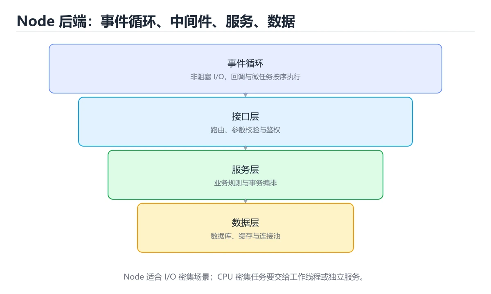
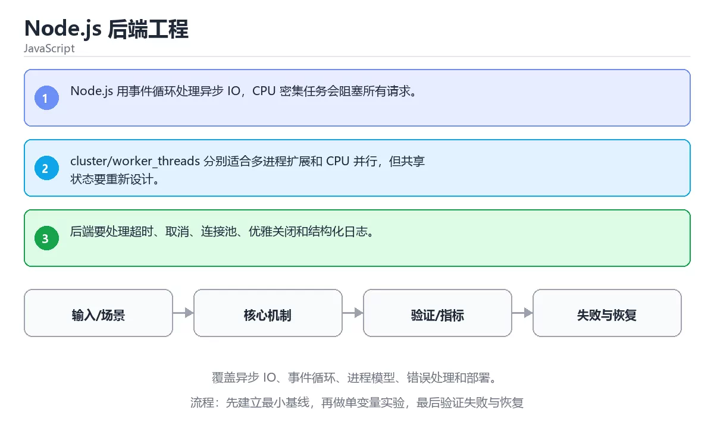

# Node.js 后端工程

> 内容更新时间：2026-10-06 · 学习阶段：高级 · 预计用时：35 分钟





## 学习目标

- 能用自己的话解释：Node.js 用事件循环处理异步 IO，CPU 密集任务会阻塞所有请求。
- 能用自己的话解释：cluster/worker_threads 分别适合多进程扩展和 CPU 并行，但共享状态要重新设计。
- 能用自己的话解释：后端要处理超时、取消、连接池、优雅关闭和结构化日志。
- 能把本课知识放回「JavaScript」，并完成练习与测验。

## 前置知识

- 能运行 createServer 所在的示例环境，并读懂报错信息。
- 本课关键词：Node.js、事件循环、后端、进程。
- 遇到不熟悉的术语先记录问题，完成练习后再回读。

## 核心知识

### 1. Node.js 用事件循环处理异步 IO，CPU 密集任务会阻塞所有请求。

- 关键做法：先用 createServer 建立 Node.js 的基线，再逐步加入边界与失败条件。
- 验证标准：事件循环 的异常路径有明确错误信息与恢复动作。

### 2. cluster/worker_threads 分别适合多进程扩展和 CPU 并行，但共享状态要重新设计。

把这条结论放回「Node.js 后端工程」的完整流程里展开：

- 正文依据：能用自己的话解释：Node.js 用事件循环处理异步 IO，CPU 密集任务会阻塞所有请求。
- 落地检查：把「2. cluster/worker_threads 分别适合多进程扩展和 CPU 并行，但共享状态要重新设计。」改写成一条可执行的核对项，逐条验证输入、超时与失败路径。

### 3. 后端要处理超时、取消、连接池、优雅关闭和结构化日志。

把这条结论放回「Node.js 后端工程」的完整流程里展开：

- 正文依据：能用自己的话解释：cluster/workerthreads 分别适合多进程扩展和 CPU 并行，但共享状态要重新设计。
- 落地检查：把「3. 后端要处理超时、取消、连接池、优雅关闭和结构化日志。」改写成一条可执行的核对项，逐条验证输入、超时与失败路径。

## 关键流程

```text
输入 → 校验 → 核心处理 → 验证 → 记录指标 → 失败恢复
```

## 实践路径

1. 用一句话复述本课要解决的问题。
2. 跑通正文中的最小示例并记录基线。
3. 只改变一个输入或参数，预测并验证结果。
4. 补一个失败路径，记录错误、恢复和指标。
5. 把结论写成可复现的笔记或测试。

## 常见错误与排查

> 说明：本表由《Node.js 后端工程》的核心知识整理（2026-10-07），人工复核进度见 docs/content_review_batches.md。

| 易错点 | 容易踩的做法 | 正确结论 |
| --- | --- | --- |
| 请求路径里用同步阻塞调用 | 事件循环被卡住，所有请求变慢 | 改用异步 API 或把重活交给工作线程 |
| 未捕获的 Promise 拒绝 | 进程异常退出 | 统一捕获并记录，设置进程级兜底 |
| 依赖不锁定版本 | 部署结果不一致 | 锁定依赖版本并定期审计漏洞 |

## 动手练习

1. 合上教程，用 3～5 句话解释Node.js 后端工程。
2. 从正文选一个例子，改变一个条件并预测结果。
3. 设计一个失败场景，写出止损与恢复步骤。

**验收标准**：留下输入、命令、输出、差异和下一步问题。

## 本课小结

- 本课围绕 Node.js、事件循环、后端、进程 展开，复习时重点核对它们的输入、输出和失败路径。
- 完成练习和测验后，把 Node.js 上仍然不确定的问题写成下一轮验证清单。


## 可运行练习

### 任务 1：先跑通，再解释

```javascript
import http from "node:http";

const server = http.createServer((req, res) => {
  res.end(JSON.stringify({ path: req.url }));
});

server.listen(0, () => {
  console.log("listening");
  server.close();
});
```

**预期输出**：listening

### 任务 2：只改一个条件

把「Node.js 后端工程」的最小示例复制一份，只改一个条件再跑一次：

- 改动点：把 事件循环 换成边界值，其他输入保持原样。
- 预测：先写下「Node.js 后端工程」在改动后的输出或错误信息，再运行。
- 记录：对照改动前后的结果，指出差异出在哪一步。
- 验收：换回原条件能复现原结果，改动只影响Node.js。

### 任务 3：迁移到自己的数据

用同一套思路处理一组你自己的 Node.js 数据，保持输出格式与任务 1 一致。

## 故障现场

### 现场 1：请求路径里用同步阻塞调用

**症状**：在《Node.js 后端工程》的复现场景中，事件循环被卡住，所有请求变慢。

**根因**：当出现“请求路径里用同步阻塞调用”时，执行路径已经绕过了《Node.js 后端工程》的关键约束，最终以“事件循环被卡住，所有请求变慢”暴露出来；修复前必须先确认约束在哪里失效。

**修复**：针对《Node.js 后端工程》的问题，改用异步 API 或把重活交给工作线程。

**验证**：在《Node.js 后端工程》中按“改用异步 API 或把重活交给工作线程”调整后，从“请求路径里用同步阻塞调用”的触发条件重放同一条路径，确认“事件循环被卡住，所有请求变慢”不再出现，并补一个相邻边界用例检查没有引入新问题。

### 现场 2：未捕获的 Promise 拒绝

**症状**：在《Node.js 后端工程》的复现场景中，进程异常退出。

**根因**：触发点是把“未捕获的 Promise 拒绝”当成安全做法。它没有满足《Node.js 后端工程》要求的前提，因此先表现为“进程异常退出”；排查时先完整复现这一段，再核对输入、配置与依赖。

**修复**：针对《Node.js 后端工程》的问题，统一捕获并记录，设置进程级兜底。

**验证**：保留《Node.js 后端工程》里触发“进程异常退出”的输入、版本和日志，按“统一捕获并记录，设置进程级兜底”完成修改后原样重放；只有失败现象消失且相邻场景仍可解释，才保留改动。

### 现场 3：依赖不锁定版本

**症状**：在《Node.js 后端工程》的复现场景中，部署结果不一致。

**根因**：“部署结果不一致”只是表层结果。向上追溯会落到“依赖不锁定版本”这一步，因为它省略了《Node.js 后端工程》的约束，使实现行为和预期模型发生了偏离。

**修复**：针对《Node.js 后端工程》的问题，锁定依赖版本并定期审计漏洞。

**验证**：在《Node.js 后端工程》中按“锁定依赖版本并定期审计漏洞”调整后，从“依赖不锁定版本”的触发条件重放同一条路径，确认“部署结果不一致”不再出现，并补一个相邻边界用例检查没有引入新问题。

## 版本与时效

- 运行时要同时考虑浏览器基线与 Node LTS；Node.js 的降级策略要写清楚。
- 升级前先用 createServer 建立基线：记录版本、命令和输出，升级后只比较这些可观察量。

### 升级检查清单

- 先固定当前版本，跑通全部示例与测验，再升级工具链。
- 只改 Node.js 的版本变量，记录编译、测试与产物体积的变化。
- 先回归 Node.js 与 事件循环 的默认行为和错误信息，再扩大测试范围。
- 升级完成后记录 Node.js 的新旧版本差异，并据此调整下次复核时间。

## 本课复习清单


离开本课前，逐项确认：

- [ ] 不看解析，能说出「关于「Node.js 用事件循环处理异步 IO，CPU 密集任务会阻塞所有请求。」，下列说法正确的是？」的判断依据。
- [ ] 不看解析，能说出「围绕“Node.js 后端工程”中的 Node.js、事件循环、后端，下列哪两项是本课强调的实践判断？」的判断依据。
- [ ] 不看解析，能说出「关于「后端要处理超时、取消、连接池、优雅关闭和结构化日志。」，下列说法正确的是？」的判断依据。
- [ ] 至少运行一次《Node.js 后端工程》的示例，记录输入、输出和一个边界情况。
- [ ] 把本课最容易混淆的两个概念写成一句话对照。

| 复盘项 | 记录 |
| --- | --- |
| 已经能独立解释的考点 |  |
| 仍然说不清的概念 |  |
| 下一步验证动作 |  |

## 复习与自测

下面按正文顺序回顾「Node.js 后端工程」的每一节；说不清的地方回到 核心知识 补课。

### 核心知识

自检：这一节与相邻主题的边界在哪里？

### 动手练习

自检：如果去掉这一节里的一个前提，结论会怎样变化？

### 最小可运行示例

```javascript
import http from "node:http";

const server = http.createServer((req, res) => {
  res.end(JSON.stringify({ path: req.url }));
});

server.listen(0, () => {
  console.log("listening");
  server.close();
});
```

自检：把这一节讲给没学过的人，最需要强调哪一点？

### 预期输出

```text
listening
```

### 验证步骤

制造一次错误输入，记录错误信息与修复方式。

## 术语速查

| 术语 | 一句话说明 |
| --- | --- |
| `Node.js` | 基于 V8 的 JavaScript 运行时，用事件循环和非阻塞 I/O 构建服务端程序。 |
| `事件循环` | 运行时从任务队列取出回调并执行的调度循环，负责协调同步栈与异步任务。 |
| `后端` | 运行在服务器侧、负责业务逻辑、数据访问和接口提供的系统部分。 |
| `进程` | 操作系统分配资源和隔离地址空间的运行实例。 |

## 零基础精讲：把Node.js 后端工程真正讲透

### 先建立一个直觉

本课的摘要可以当作一张地图：覆盖异步 IO、事件循环、进程模型、错误处理和部署。

### 逐步拆解

1. 澄清输入与目标。先写清「Node.js 后端工程」要解决的问题、合法输入范围和成功标准，再进入后续步骤。
2. 描述处理过程。把「Node.js、事件循环、后端、进程」映射到具体步骤，每步都要求能单独验证。
3. 定义输出。明确 Node.js 与 事件循环 各自的产物，以及失败时留下什么证据。
4. 让「Node.js 后端工程」的失败路径尽早暴露：把Node.js推到边界值，记录错误信息、重试或降级动作，以及人工兜底条件。
5. 用 createServer 贯穿一次小实验：先预测输出，再运行或逐步推演，最后解释差异来自哪一步。

### 把正文串成一条执行链

- **1. Node.js 用事件循环处理异步 IO，CPU 密集任务会阻塞所有请求。**：在「Node.js 后端工程」里，「1. Node.js 用事件循环处理异步 IO，CPU 密集任务会阻塞所有请求。」这一步要先写清输入与预期，再记录实际结果和差异；结果不符时回到对应小节核对前提。
- **2. cluster/worker_threads 分别适合多进程扩展和 CPU 并行，但共享状态要重新设计。**：在「Node.js 后端工程」里，「2. cluster/worker_threads 分别适合多进程扩展和 CPU 并行，但共享状态要重新设计。」这一步要先写清输入与预期，再记录实际结果和差异；结果不符时回到对应小节核对前提。
- **3. 后端要处理超时、取消、连接池、优雅关闭和结构化日志。**：在「Node.js 后端工程」里，「3. 后端要处理超时、取消、连接池、优雅关闭和结构化日志。」这一步要先写清输入与预期，再记录实际结果和差异；结果不符时回到对应小节核对前提。
- **考点 1：关于「Node.js 用事件循环处理异步 IO，CPU 密集任务会阻塞所有请求。」，下列说法正确的是？**：先独立作答，再回到本课对应小节核对判断依据；答错时记录是哪一个前提被忽略。
- **考点 2：围绕“Node.js 后端工程”中的 Node.js、事件循环、后端，下列哪两项是本课强调的实践判断？**：先独立作答，再回到本课对应小节核对判断依据；答错时记录是哪一个前提被忽略。
- **考点 3：关于「后端要处理超时、取消、连接池、优雅关闭和结构化日志。」，下列说法正确的是？**：先独立作答，再回到本课对应小节核对判断依据；答错时记录是哪一个前提被忽略。

### 从测验反推易错点

**检查点 1：关于「Node.js 用事件循环处理异步 IO，CPU 密集任务会阻塞所有请求。」，下列说法正确的是？**

- 参考判断：Node.js 用事件循环处理异步 IO，CPU 密集任务会阻塞所有请求。
- 自问：如果去掉题干里的一个限定词，结论还成立吗？

**检查点 2：关于「cluster/worker_threads 分别适合多进程扩展和 CPU 并行，但共享状态要重新设计。」，下列说法正确的是？**

- 参考判断：cluster/worker_threads 分别适合多进程扩展和 CPU 并行，但共享状态要重新设计。

**检查点 3：关于「后端要处理超时、取消、连接池、优雅关闭和结构化日志。」，下列说法正确的是？**

- 参考判断：后端要处理超时、取消、连接池、优雅关闭和结构化日志。

**检查点 4：本课的核心学习目标是什么？**

- 参考判断：覆盖异步 IO、事件循环、进程模型、错误处理和部署。

- 参考判断：http

### 工程排错顺序

| 先查什么 | 要得到的证据 | 判断标准 |
| --- | --- | --- |
| 输入与前提是否满足 | 日志、输入样例、测试或指标 | 能复现并解释，才算定位 |
| 核心步骤是否产生了预期中间结果 | 日志、输入样例、测试或指标 | 能复现并解释，才算定位 |
| 失败路径是否可观测、可恢复 | 日志、输入样例、测试或指标 | 能复现并解释，才算定位 |
| 资源、权限与成本是否在预算内 | 日志、输入样例、测试或指标 | 能复现并解释，才算定位 |

### 变式训练

1. 先用一个单文件示例验证 createServer，确认正确性后再引入框架或分布式组件。
2. 把 createServer 的数据量提高一个数量级，观察延迟与内存的变化拐点。
3. 制造一次 Node.js 相关的依赖超时或错误输入，要求错误可解释且不留半完成状态。
5. 删掉一个看似必要的步骤（例如 Node.js 相关的校验），观察哪个测试或指标先失败，用证据说明它为什么不能省。
6. 限制 CPU 与内存上限后重跑 createServer，观察哪一项参数需要重新设定。

### 本课自测

- [ ] 能用一句话解释「Node.js」在本课中的角色与边界。
- [ ] 能举出一个正常例子和一个失败例子。
- [ ] 能说出最小验证步骤，以及需要记录的证据。
- [ ] 能用一句话解释「事件循环」在本课中的角色与边界。
- [ ] 能用一句话解释「后端」在本课中的角色与边界。
- [ ] 能用一句话解释「进程」在本课中的角色与边界。

### 迁移案例库

下面用不同约束重复同一套方法，每轮只改变 Node.js 的一个取值并记录结论。

#### 迁移案例 1：围绕「Node.js」做一次小实验

**目标**：在不改变课程主体的前提下，验证Node.js 后端工程中的一个关键判断。

**步骤**：
1. 复述当前方案对「Node.js」的假设，写成一句可证伪的话。
2. 设计一个正常输入和一个边界输入，分别预测输出。
3. 运行或逐步演算，记录实际输出、耗时和失败信息。
4. 只调整一个参数，比较前后差异并解释原因。
5. 补充一条测试或复习卡，确保下次能更快复现。

**验收**：至少给出一个反例，说明Node.js在什么情况下会失效；只写成功案例不算通过。

#### 迁移案例 2：围绕「事件循环」做一次小实验

**步骤**：
1. 复述当前方案对「事件循环」的假设，写成一句可证伪的话。

#### 迁移案例 3：围绕「后端」做一次小实验

**步骤**：
1. 复述当前方案对「后端」的假设，写成一句可证伪的话。

#### 迁移案例 4：围绕「进程」做一次小实验

**步骤**：
1. 复述当前方案对「进程」的假设，写成一句可证伪的话。

#### 迁移案例 5：围绕「Node.js」做一次小实验

**步骤**：

#### 迁移案例 6：围绕「事件循环」做一次小实验

**步骤**：

#### 迁移案例 7：围绕「后端」做一次小实验

**步骤**：

#### 迁移案例 8：围绕「进程」做一次小实验

**步骤**：

#### 迁移案例 9：围绕「Node.js」做一次小实验

**步骤**：

#### 迁移案例 10：围绕「事件循环」做一次小实验

**步骤**：

#### 迁移案例 11：围绕「后端」做一次小实验

**步骤**：

#### 迁移案例 12：围绕「进程」做一次小实验

**步骤**：

#### 迁移案例 13：围绕「Node.js」做一次小实验

**步骤**：

#### 迁移案例 14：围绕「事件循环」做一次小实验

**步骤**：

#### 迁移案例 15：围绕「后端」做一次小实验

**步骤**：

#### 迁移案例 16：围绕「进程」做一次小实验

**步骤**：

<!-- p0-depth-v2:end -->

## 考点精讲

### 考点 1：概念判断·Node.js

- **题目**：关于「Node.js 用事件循环处理异步 IO，CPU 密集任务会阻塞所有请求。」，下列说法正确的是？
- **判断依据**：在「Node.js 后端工程」里，Node.js 用事件循环处理异步 IO这道题的关键在「Node.js 后端工程」的Node.js、事件循环、后端：先确认题干“关于Node.js 用事件循环处理异”问的是哪一步，再排除偷换前提的选项。把“Node.js 用事件循环处理异步 IO”代回「Node.js 后端工程」里“Node.js 用事件循环处理异步 IO”的例子核对，条件一旦改变，结论就要用Node.js、事件循环、后端重新推导。

### 考点 2：多选辨析·Node.js

- **题目**：围绕“Node.js 后端工程”中的 Node.js、事件循环、后端，下列哪两项是本课强调的实践判断？
- **判断依据**：本课把Node.js 后端工程拆成概念、示例与故障现场三部分，因此判断 Node.js 时必须同时交代输入、输出和失败路径，这使“学习 Node.js 时要同时说明输入、输出和失败路径，不能只看正常流程”成立。在Node.js 后端工程里，判断 事件循环 时要固定版本与边界输入，所以“验证 事件循环 时要固定版本并覆盖边界输入，结论才可复现”才可复现。

### 考点 3：概念判断·Node.js

- **题目**：关于「后端要处理超时、取消、连接池、优雅关闭和结构化日志。」，下列说法正确的是？
- **判断依据**：在「Node.js 后端工程」里，后端要处理超时、取消、连接池、优雅关闭和结构化日志。这道题的关键在「Node.js 后端工程」的Node.js、事件循环、后端：先确认题干“关于后端要处理超时、取消、连接池、优”问的是哪一步，再排除偷换前提的选项。把“后端要处理超时、取消、连接池”代回「Node.js 后端工程」里“后端要处理超时、取消、连接池、优雅关闭和结构化日志”的例子核对，条件一旦改变，结论就要用Node.js、事件循环、后端重新推导。

### 考点 4：代码补全·Node.js

- **题目**：阅读「Node.js 后端工程」正文里的这段 JavaScript 代码，下面哪一项判断是正确的？
- **判断依据**：在「Node.js 后端工程」里，题干的正确项是这段代码会产生可观察的输出，运行后能看到结果，在「Node.js 后端工程」里要结合Node.js核对输出是否符合预期。把输入或边界换成空值、极值或失败情况后，结论要以「Node.js 后端工程」的实际运行结果为准。「Node.js 后端工程」要求先交代Node.js、事件循环、后端的前提再下结论，所以“这段代码会产生可观察的输出”只在题干“阅读Node.js 后端工程正文里的这段 JavaScrip”给定的条件下成立。

### 考点 5：填空·Node.js

- **题目**：补全代码：「Node.js 后端工程」示例中，下面这行代码缺少哪个关键字或函数名？请填入 ____。 `const server = ____.createServer((req, res) => {`
- **判断依据**：在「Node.js 后端工程」里，http。这道题的关键在「Node.js 后端工程」的Node.js、事件循环、后端：先确认题干“补全代码”问的是哪一步，再排除偷换前提的选项。回到Node.js、事件循环、后端本身再看一遍：只有“http”与题干“Node.js”的前提一致，结论才成立。

## English Overview

**Title:** Node.js Backend Engineering

**Summary:** Cover async IO, event loop, process model, errors and deployment.

**Category:** JavaScript
**Level:** 高级
**Key terms:** Node.js, 事件循环, 后端, 进程

## 内容元数据

- 内容版本：v2.0
- 最后更新：2026-10-06
- 学习阶段：高级
- 适用环境：Node.js 22+ / 现代浏览器；本课聚焦 Node.js。
- 内容来源：内置结构化课程与工程实践整理
- 相关主题：Node.js、事件循环、后端、进程
- 质量版本：P0 测验标准 + P1 覆盖扩展 + P2 体验补全

## 最小可运行示例

先用 createServer 跑通最小示例，然后只改一个与 Node.js 相关的取值：

```javascript
import http from "node:http";

const server = http.createServer((req, res) => {
  res.end(JSON.stringify({ path: req.url }));
});

server.listen(0, () => {
  console.log("listening");
  server.close();
});
```

## 预期输出

```text
listening
```

## 验证步骤

1. 记录运行环境、命令和真实输出。
2. 修改一个输入，先写预测再运行。
4. 把结论写回本课笔记或测试用例。

## 参考资料与复核

- 最后复核：2026-10-04
- 下次复核：2027-05-10
- 复核范围：版本兼容、API 行为、安全建议与工程实践
- 来源性质：官方文档、标准或权威教材；正文为离线教学重组

| 参考资料 | 本课用途 |
| --- | --- |
| [Node 事件循环](https://nodejs.org/en/learn/asynchronous-work/event-loop-timers-and-nexttick) | 事件循环与异步顺序 |
| [Node.js 文档](https://nodejs.org/docs/latest/api/) | 服务端运行时与模块 |
| [npm 文档](https://docs.npmjs.com/) | 包管理与发布 |

> 「Node.js 后端工程」的链接用于离线阅读后的延伸核对；App 不会自动联网。

## 复习与迁移

复习目标：把「Node.js 后端工程」的判断标准放回可复现的例子里。先自己作答，再对照依据；如果结论正确但理由不完整，回到正文补足前提。

### 概念复述

- 用一句话说明「Node.js 后端工程」解决什么问题：覆盖异步 IO、事件循环、进程模型、错误处理和部署。
- 写出Node.js、事件循环、后端之间的关系，并各举一个例子。
- 说出本课最容易混淆的两个概念，以及区分它们的判据。

### 正文逐节复核

- **零基础精讲：把Node.js 后端工程真正讲透**：本课的摘要可以当作一张地图：覆盖异步 IO、事件循环、进程模型、错误处理和部署。

### 测验回顾

1. 关于「Node.js 用事件循环处理异步 IO，CPU 密集任务会阻塞所有请求。」，下列说法正确的是？
   - 依据：在「Node.js 后端工程」里，Node.js 用事件循环处理异步 IO，CPU 密集任务会阻塞所有请求。这道题的关键在「Node.js 后端工程」的Node.js、事件循环、后端：先确认题干“关于Node.js 用事件循环处理异”问的是哪一步，再排除偷换前提的选项。把“Node.js 用事件循环处理异步 IO”代回「Node.js 后端工程」里“Node.js 用事件循环处理异步 IO”的例子核对，条件一旦改变，结论就要用Node.js、事件循环、后端重新推导。
2. 围绕“Node.js 后端工程”中的 Node.js、事件循环、后端，下列哪两项是本课强调的实践判断？
   - 依据：本课把Node.js 后端工程拆成概念、示例与故障现场三部分，因此判断 Node.js 时必须同时交代输入、输出和失败路径，这使“学习 Node.js 时要同时说明输入、输出和失败路径，不能只看正常流程”成立。在Node.js 后端工程里，判断 事件循环 时要固定版本与边界输入，所以“验证 事件循环 时要固定版本并覆盖边界输入，结论才可复现”才可复现。
3. 关于「后端要处理超时、取消、连接池、优雅关闭和结构化日志。」，下列说法正确的是？
   - 依据：在「Node.js 后端工程」里，后端要处理超时、取消、连接池、优雅关闭和结构化日志。这道题的关键在「Node.js 后端工程」的Node.js、事件循环、后端：先确认题干“关于后端要处理超时、取消、连接池、优”问的是哪一步，再排除偷换前提的选项。把“后端要处理超时、取消、连接池”代回「Node.js 后端工程」里“后端要处理超时、取消、连接池、优雅关闭和结构化日志”的例子核对，条件一旦改变，结论就要用Node.js、事件循环、后端重新推导。
4. 阅读「Node.js 后端工程」正文里的这段 JavaScript 代码，下面哪一项判断是正确的？
   - 依据：在「Node.js 后端工程」里，题干的正确项是这段代码会产生可观察的输出，运行后能看到结果，在「Node.js 后端工程」里要结合Node.js核对输出是否符合预期。把输入或边界换成空值、极值或失败情况后，结论要以「Node.js 后端工程」的实际运行结果为准。「Node.js 后端工程」要求先交代Node.js、事件循环、后端的前提再下结论，所以“这段代码会产生可观察的输出”只在题干“阅读Node.js 后端工程正文里的这段 JavaScrip”给定的条件下成立。
5. 补全代码：「Node.js 后端工程」示例中，下面这行代码缺少哪个关键字或函数名？请填入 ____。

`const server = ____.createServer((req, res) => {`
   - 依据：在「Node.js 后端工程」里，http。这道题的关键在「Node.js 后端工程」的Node.js、事件循环、后端：先确认题干“补全代码”问的是哪一步，再排除偷换前提的选项。回到Node.js、事件循环、后端本身再看一遍：只有“http”与题干“Node.js”的前提一致，结论才成立。

### 迁移练习

把「Node.js 后端工程」的结论迁移到相邻主题，每次迁移都写清预测与证据：

1. 换输入：用Node.js处理一组你自己的数据，对比教材示例的结果差异。
2. 换失败条件：制造一个事件循环相关的错误，说明如何从错误信息定位根因。
3. 换规模：把数据量或并发度提高一个数量级，说明「Node.js 后端工程」的结论是否仍成立。
