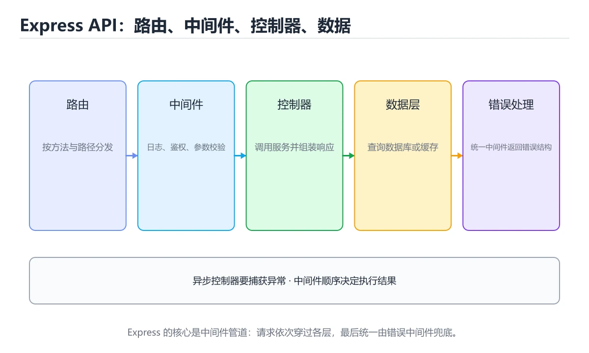
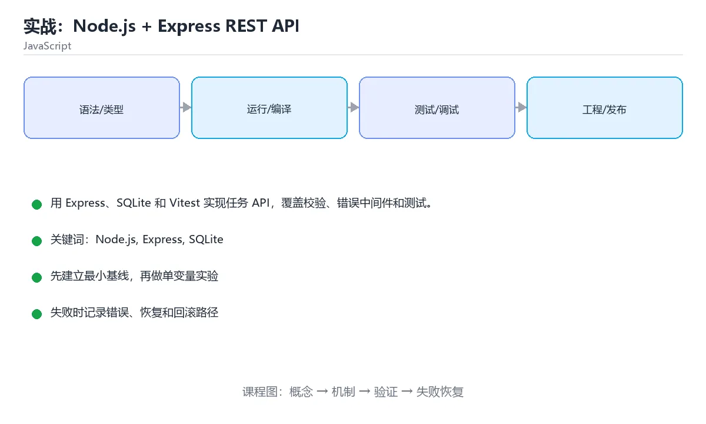

# 本课主题





> 内容更新时间：2026-10-03 · 学习阶段：高级 · 预计用时：120 分钟

## 学习目标

- 能设计分层路由、服务和数据访问。
- 能用 Zod 做请求校验并统一错误响应。
- 能用 supertest 验证 HTTP 状态和响应体。

## 前置知识

- 已完成本分类的基础与进阶课程，能独立运行正文中的最小示例。
- 熟悉命令行、依赖管理、测试和 Git 基本操作。
- 本课涉及：Node.js、Express、SQLite、REST、Vitest。

## 项目背景

团队需要一个本地任务服务：创建任务、分配负责人、更新状态和查询列表。API 要能在 CI 中独立启动，不依赖外部数据库。

一句话摘要：用 Express、SQLite 和 Vitest 实现任务 API，覆盖校验、错误中间件和测试。

## 技术栈

- Node.js 22
- Express
- better-sqlite3
- Zod
- Vitest
- supertest

## 架构与数据流

```text
输入 → 参数校验 → 业务处理 → 持久化/外部调用 → 结果输出 → 指标与日志
                 ↘ 失败分类 → 重试/回滚 → 错误响应
```

- 读路径要明确查询条件、分页方式和返回字段，避免一次加载全部数据。
- 写路径要明确事务边界、幂等键和失败补偿，不能留下半完成状态。
- 外部调用要设置超时、重试上限和降级策略。
- 每个关键阶段都要留下日志、指标或测试证据。

## 功能范围

- [ ] 创建任务并返回 201
- [ ] 按状态和负责人过滤
- [ ] 更新任务状态
- [ ] 删除任务并处理不存在情况

## 示例数据与边界

| 场景 | 输入 | 期望结果 | 检查点 |
| --- | --- | --- | --- |
| 正常路径 | 合法的最小数据集 | 成功返回并写入正确数据 | 状态码、数据库记录、日志 |
| 边界值 | 最大值、最小值或空集合 | 明确成功或给出可理解错误 | 不崩溃、不越界、不写半条数据 |
| 非法输入 | 类型错误、缺字段、超长内容 | 返回校验错误并指出字段 | 错误结构统一且不泄露内部信息 |
| 依赖失败 | 数据库不可用、超时、网络抖动 | 重试、降级或快速失败 | 可恢复、可观测、无重复副作用 |

## 实施步骤

### 步骤 1：建立路由、服务和仓储目录

- 输入与产出：先写清本步依赖的配置、数据和最终产物，再开始编码。
- 验证方法：用最小请求、最小数据集或单元测试证明本步结果正确。
- 失败处理：记录错误类型、回滚动作和重试条件，避免把问题带到下一步。
- 证据留存：保留命令、输出、日志或截图，方便评审与复盘。

### 步骤 2：定义 Zod 请求模型

### 步骤 3：实现 SQLite 表与参数化查询

### 步骤 4：加入统一错误中间件

### 步骤 5：用 supertest 写接口测试

### 步骤 6：补分页、排序和健康检查

## 关键代码

```javascript
import express from 'express';
import { z } from 'zod';

const app = express();
app.use(express.json());

const CreateTask = z.object({ title: z.string().min(1), priority: z.enum(['low', 'high']) });
app.post('/tasks', (req, res) => {
  const result = CreateTask.safeParse(req.body);
  if (!result.success) return res.status(422).json({ error: result.error.issues });
  res.status(201).json({ id: 1, ...result.data });
});
export default app;
```

## 验证命令与预期输出

```text
1. 安装依赖并启动项目
2. 执行至少 3 条自动化测试，其中包含 1 条失败路径
3. 用正常请求验证成功响应
4. 用非法输入验证错误响应
5. 重复执行一次，确认没有重复写入或副作用
```

## 建议目录结构

```text
src/
  entry/        启动与配置
  domain/       业务模型与规则
  service/      用例编排
  infra/        数据库、HTTP、消息等适配器
tests/          单元、集成与接口测试
```

## 质量门禁

- [ ] 格式化和静态检查通过，不遗留明显警告。
- [ ] 单元测试覆盖核心规则，集成测试覆盖数据库或外部边界。
- [ ] 错误响应不泄露堆栈、SQL 和密钥。
- [ ] 配置来自环境变量或配置文件，不硬编码敏感信息。
- [ ] README 写清启动、测试、配置和回滚步骤。

## 安全、成本与可观测性

- 权限遵循最小授权，数据库账号、云资源和接口令牌都不能使用管理员默认权限。
- 所有外部输入都要校验、限长并转义，错误信息不能泄露内部路径和 SQL。
- 密钥通过环境变量或密钥管理服务注入，并记录轮换方式。
- 为数据库连接、线程/协程、队列、文件和网络请求设置上限，避免资源耗尽。
- 至少记录请求量、错误率、P95/P99 延迟、资源使用和成本趋势。
- 出现异常时能从日志和指标还原时间线，而不是只看到一句“服务不可用”。

## 测试与验收

- 缺少 title 返回 422 和字段错误
- 不存在的任务更新返回 404
- 分页返回稳定顺序且不重复

### 验收记录表

| 检查项 | 证据 | 结果 | 备注 |
| --- | --- | --- | --- |
| 最小路径可运行 | 启动命令与输出 |  |  |
| 失败路径可恢复 | 错误日志与重试 |  |  |
| 自动化测试通过 | 测试报告 |  |  |
| 配置和密钥安全 | 配置检查 |  |  |

## 常见问题

| 问题 | 原因 | 解决 |
| --- | --- | --- |
| 把业务逻辑写进路由 | 难以测试和复用 | 拆分 service 和 repository |
| 直接把 req.body 写库 | 脏数据和注入风险 | 使用校验和参数化查询 |
| 错误响应格式不统一 | 调用方处理困难 | 集中错误中间件和错误码 |
| 测试依赖真实数据库文件 | 测试互相污染 | 每个测试使用内存数据库 |

## 扩展任务

- 加入 JWT 认证和用户隔离
- 用 OpenAPI 生成接口文档
- 加入速率限制和审计日志

## 性能、容量与故障演练

| 维度 | 基线 | 压测方法 | 失败信号 |
| --- | --- | --- | --- |
| 延迟 | 记录 P50/P95/P99 | 用固定数据集逐步增加并发 | P99 持续上升或超时率增加 |
| 吞吐 | 记录每秒处理量 | 逐步加压直到资源打满 | 队列积压、CPU/内存饱和 |
| 存储 | 记录数据增长与索引大小 | 导入 10 倍数据并观察查询 | 磁盘、连接或锁等待成为瓶颈 |
| 恢复 | 记录故障恢复时间 | 停止数据库、注入延迟或重复请求 | 数据不一致、重复副作用、无法回滚 |

## 实施记录与复盘

每完成一步，记录以下内容：

1. 本步的输入、命令和输出是什么？
2. 遇到的最小失败是什么，如何定位和修复？
3. 哪个假设被验证或推翻？
4. 下一步的风险是什么，如何回滚？
5. 如果数据量或并发扩大 10 倍，最先出现的瓶颈在哪里？

## 动手练习

### 练习 1：最小可运行版本（30 分钟）

只实现最核心的一条路径，确保能启动、能返回结果、能运行测试。

**验收标准**：留下启动命令、请求示例和成功输出。

### 练习 2：失败路径（30 分钟）

制造一次输入错误、依赖失败或超时，记录系统如何报错、如何恢复。

**验收标准**：错误信息清晰，且不会破坏已有数据。

### 练习 3：扩展一个功能（60 分钟）

从扩展任务中选一项实现，并补一条自动化测试。

**验收标准**：新功能通过测试，且原有测试不回归。

## 本课小结

- 项目课的核心不是堆功能，而是把输入、状态、错误和验收标准连接起来。
- 先跑通最小路径，再补失败处理、测试和文档，最后才做性能优化。
- 每个阶段都要留下可复现证据：命令、输出、测试和变更记录。
- 完成后用扩展任务检验迁移能力，而不是只复制示例代码。

## 完成标准

- [ ] 能从干净环境按 README 启动项目。
- [ ] 至少 3 条自动化测试通过，且包含一条失败路径。
- [ ] 能演示一次错误、一次恢复和一次回滚。
- [ ] 有一份资源或性能基线，能说明瓶颈在哪里。
- [ ] 能说清一个尚未解决的问题和下一步验证方法。

## 可运行练习

### 任务 1：先跑通，再解释

```json
{
  "project": "js_project_node_api",
  "input": {"case": "normal", "value": 5},
  "expected": {"ok": true, "result": 5},
  "failure_case": {"value": -1, "error": "validation_error"},
  "idempotency_key": "demo-001"
}
```

### 任务 2：只改一个条件

### 任务 3：迁移到自己的数据

用同一套思路处理一组你自己的数据或场景，保持输出格式与任务 1 一致。

## 故障现场

### 现场 1：本课的 Node.js 常规用例通过，但边界用例失败

**症状**：在本课的练习或生产场景里出现“本课的 Node.js 常规用例通过，但边界用例失败”。

**复现**：准备一组最小输入，只保留触发“本课的 Node.js 常规用例通过，但边界用例失败”的必要条件，连续运行两次确认结果稳定。

**定位**：围绕“Node.js 的前置条件与取值边界没有写进代码，默认值掩盖了空值和极值”检查调用链、输入数据和环境配置，先验证假设再改代码。

**预防**：把“本课的 Node.js 常规用例通过，但边界用例失败”写成一条自动化用例，并在本课的验收清单里保留对应检查项。

### 现场 2：本课的 Express 结果在两次运行之间不一致

**症状**：在本课的练习或生产场景里出现“本课的 Express 结果在两次运行之间不一致”。

**复现**：准备一组最小输入，只保留触发“本课的 Express 结果在两次运行之间不一致”的必要条件，连续运行两次确认结果稳定。

**定位**：围绕“Express 依赖了当前版本、执行顺序或共享状态，单次运行无法暴露差异”检查调用链、输入数据和环境配置，先验证假设再改代码。

**预防**：把“本课的 Express 结果在两次运行之间不一致”写成一条自动化用例，并在本课的验收清单里保留对应检查项。

### 现场 3：本课的验证只在开发机通过

**症状**：在本课的练习或生产场景里出现“本课的验证只在开发机通过”。

**定位**：围绕“环境版本、配置和输入规模与目标环境不同，Node.js 缺少可重复的验证记录”检查调用链、输入数据和环境配置，先验证假设再改代码。

## 版本与时效

- 运行时要同时考虑浏览器基线、Node LTS 与打包工具的降级策略
- 升级前用特性检测和构建目标矩阵验证，不要只在本机浏览器测试

### 升级检查清单

- 先固定当前版本，跑通全部示例与测验，再升级工具链。
- 只改一个版本变量，记录编译、测试、性能与产物体积的变化。
- 重点回归默认值、弃用警告、序列化格式、并发语义和错误信息。
- 升级完成后更新本课的“最后复核 / 下次复核”日期与版本说明。

## 本课复习清单

离开本课前，逐项确认：

- [ ] 不看解析，能说出「哪个库适合做请求结构校验？」的判断依据。
- [ ] 不看解析，能说出「创建资源成功最适合返回什么？」的判断依据。
- [ ] 不看解析，能说出「为什么测试要使用内存数据库？」的判断依据。
- [ ] 不看解析，能说出「统一错误中间件解决什么问题？」的判断依据。
- [ ] 不看解析，能说出「请求体缺少 title 时，下面代码会返回什么？」的判断依据。
- [ ] 至少运行一次本课示例，记录输入、输出和一个边界情况。
- [ ] 把本课最容易混淆的两个概念写成一句话对照。

| 复盘项 | 记录 |
| --- | --- |
| 已经能独立解释的考点 |  |
| 仍然说不清的概念 |  |
| 下一步验证动作 |  |

## 术语速查

| 术语 | 本课语境 |
| --- | --- |
| `Node.js` | 本课围绕该主题展开，结合正文与代码示例理解它的适用边界。 |
| `Express` | 本课围绕该主题展开，结合正文与代码示例理解它的适用边界。 |
| `SQLite` | 本课围绕该主题展开，结合正文与代码示例理解它的适用边界。 |
| `REST` | 本课围绕该主题展开，结合正文与代码示例理解它的适用边界。 |
| `Vitest` | 本课围绕该主题展开，结合正文与代码示例理解它的适用边界。 |

## 考点精讲

### 考点 1：哪个库适合做请求结构校验？

- **判断依据**：Zod 提供运行时校验和类型推断，适合 API 边界。作答时，先用Node.js建立输入与输出的基线，再把Zod代入边界条件核对，结论才能复现。判断这类题时，要把「Zod」放回题干限定的对象、输入和边界，「Lodash」、「Day.js」 等说法虽然包含相关术语，但范围或前提与本题不一致。

### 考点 2：创建资源成功最适合返回什么？

- **判断依据**：201 表示资源已创建，并通常返回新资源标识。作答时，先用Node.js建立输入与输出的基线，再把201代入边界条件核对，结论才能复现。解题的关键不是记住孤立术语，而是确认「201」是否完整覆盖题干的输入、输出和失败路径，并排除「301」、「500」这类相邻概念。

### 考点 3：围绕“实战：Node.js + Express REST API”中的 Node.js、Express、SQLite，下列哪两项是本课强调的实践判断？

- **判断依据**：正确答案包括「学习 Node.js 时要同时说明输入、输出和失败路径，不能只看正常流程」、「验证 Express 时要固定版本并覆盖边界输入，结论才可复现」。符合题干条件的是学习 Node.js 时要同时说明输入、输出和失败路径。本课把本课主题拆成概念、示例与故障现场三部分，因此判断 Node.js 时必须同时交代输入、输出和失败路径，这使“学习 Node.js 时要同时说明输入、输出和失败路径，不能只看正常流程”成立。在本课主题里，判断 Express 时要固定版本与边界输入，所以“验证 Express 时要固定版本并覆盖边界输入，结论才可复现”才可复现。

### 考点 4：统一错误中间件解决什么问题？

- **判断依据**：统一结构能让客户端稳定解析错误并做重试或提示。作答时，先用Node.js建立输入与输出的基线，再把让错误响应格式一致代入边界条件核对，结论才能复现。这道题要求区分概念与边界，「让错误响应格式一致」只有在题干给出的前提下才成立，而「替代日志」、「压缩图片」缺少同一组条件。

### 考点 5：请求体缺少 title 时，下面代码会返回什么？

- **判断依据**：正确答案是「422 和包含字段错误的 JSON」。CreateTask.safeParse 校验失败时不会抛异常，代码显式返回 422 并把 Zod 的错误列表放进响应体。422 表示请求格式正确但语义校验未通过，201 只在创建成功后返回。

### 考点 6：按照「实战：Node.js + Express REST API」从概念到实践的讲解顺序排列下列主题。

- **判断依据**：结合Node.js、Express来看，正确的执行顺序是「项目背景 → 技术栈 → 架构与数据流 → 功能范围」。本课围绕用 Express、SQLite 和 Vitest 实现任务 API，覆盖校验、错误中间件和测试。结合Node.js、Express来看，解题的关键不是记住孤立术语，而是确认「项目背景 → 技术栈 → 架构与数据流 → 功能范围」是否完整覆盖题干的输入、输出和失败路径，并排除「项目背景」、「技术栈」这类相邻概念。

## English Overview

**Title:** Project: Node.js + Express REST API

**Summary:** Build a task API with Express, SQLite and Vitest.

**Category:** JavaScript
**Level:** 高级
**Key terms:** Node.js, Express, SQLite, REST, Vitest

## 内容元数据

- 内容版本：v2.0
- 最后更新：2026-10-03
- 学习阶段：高级
- 适用环境：Node.js 22+ / 现代浏览器
- 内容来源：内置结构化课程与工程实践整理
- 相关主题：Node.js、Express、SQLite、REST、Vitest
- 质量版本：P0 测验标准 + P1 覆盖扩展 + P2 体验补全

## 项目专属规格：本课主题

### 核心场景

用 Express、SQLite 和 Vitest 实现任务 API，覆盖校验、错误中间件和测试。 项目目标是把「Node.js、Express、SQLite、REST、Vitest」落实为可运行、可测试、可回滚的交付物。

### 架构与数据流

```text
用户/输入 → 接口或命令 → 领域逻辑 → 存储/外部依赖 → 输出与监控
                         ↘ 失败分类 → 重试/补偿 → 回滚
```

### 最小数据模型

| 对象 | 关键字段 | 约束 |
| --- | --- | --- |
| 输入实体 | Node.js、时间、来源 | 必填校验、长度限制、幂等键 |
| 任务实体 | 状态、优先级、创建时间 | 状态迁移合法、不可重复执行 |
| 结果实体 | 输出、错误码、耗时 | 可序列化、错误可解释 |
| 审计记录 | 操作者、动作、结果、时间 | 不可篡改、可查询、脱敏 |

### 验收场景

1. 正常路径：最小输入得到预期输出，并留下日志与指标。
2. 边界路径：空值、最大值、重复数据和超长内容得到明确处理。
3. 失败路径：依赖超时或不可用时能快速失败、重试或降级。
4. 幂等路径：同一请求执行两次不会产生重复副作用。
5. 回滚路径：回滚后数据一致，且能说明恢复时间和影响范围。

## 项目交付物

### 建议仓库结构

```text
src/
  routes/
  services/
  repositories/
tests/
package.json
```

### 测试矩阵

| 层级 | 覆盖内容 | 最低数量 | 通过标准 |
| --- | --- | ---: | --- |
| 单元测试 | 领域规则、边界和错误分类 | 8 | 正常、边界、失败路径全部通过 |
| 集成测试 | 数据库、网络、文件或平台边界 | 3 | 使用真实边界且可重复运行 |
| 端到端测试 | 核心用户路径 | 1 | 从输入到输出完整跑通 |
| 手动验收 | 文档中列出的 5 个场景 | 5 | 有命令、输出和结论记录 |

### 验收数据

```json
{
  "project": "js_project_node_api",
  "input": {"case": "normal", "value": 5},
  "expected": {"ok": true, "result": 5},
  "failure_case": {"value": -1, "error": "validation_error"},
  "idempotency_key": "demo-001"
}
```

### 复盘模板

| 问题 | 记录 |
| --- | --- |
| 原目标是什么？ | 用一句话描述可验收目标 |
| 实际发生了什么？ | 时间线、指标和关键日志 |
| 哪个假设被推翻？ | 根因与促成因素 |
| 如何回滚？ | 步骤、耗时和数据校验 |
| 下一步做什么？ | 负责人、期限和验证方式 |

> 项目验收围绕「Node.js、Express、SQLite」：至少完成一次正常路径、一次边界输入、一次失败恢复和一次幂等检查。


## 参考资料与复核

- 最后复核：2026-10-04
- 下次复核：2027-04-04
- 复核范围：版本兼容、API 行为、安全建议与工程实践
- 来源性质：官方文档、标准或权威教材；正文为离线教学重组

| 参考资料 | 本课用途 |
| --- | --- |
| [Node.js 文档](https://nodejs.org/docs/latest/api/) | 服务端运行时与模块 |
| [Jest 文档](https://jestjs.io/docs/getting-started) | JavaScript 测试与断言 |
| [Node 事件循环](https://nodejs.org/en/learn/asynchronous-work/event-loop-timers-and-nexttick) | 事件循环与异步顺序 |

> 「实战：Node.js + Express REST API」的链接用于离线阅读后的延伸核对；App 不会自动联网。

## 复习与迁移

- 围绕「哪个库适合做请求结构校验？」做迁移时，先记录输入、边界和预期，再观察Node.js对结果的影响，并用「Zod」解释正常与失败路径。
- 把Express放进最小实验：固定版本和输入，只改变一个条件，记录输出差异，并说明「201」在什么前提下成立。
- 复习「围绕本课主题中的 Node.js、Express、SQLite，下列哪两项是本课强调的实践判断？」时，不要只背结论；用SQLite的边界值复现一次，再把现象、原因和修复写成三步记录。
- 如果把REST换成空值、极值或并发输入，「让错误响应格式一致」是否仍然成立？写出验证命令和观察到的结果。
- 围绕「请求体缺少 title 时，下面代码会返回什么？」做迁移时，先记录输入、边界和预期，再观察Vitest对结果的影响，并用「422 和包含字段错误的 JSON」解释正常与失败路径。
- 把Node.js放进最小实验：固定版本和输入，只改变一个条件，记录输出差异，并说明「项目背景 → 技术栈 → 架构与数据流 → 功能范围」在什么前提下成立。
- 复习「哪个库适合做请求结构校验？」时，不要只背结论；用Express的边界值复现一次，再把现象、原因和修复写成三步记录。
<!-- p0p1-review:end -->
