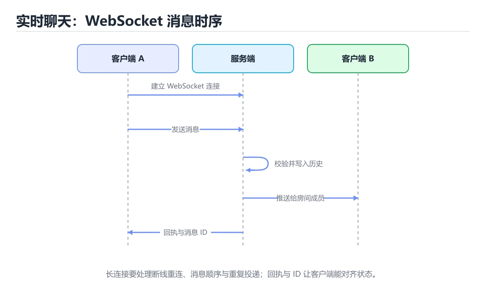
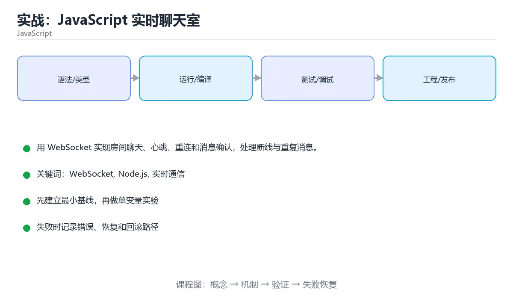

# 实战：JavaScript 实时聊天室





> 内容更新时间：2026-10-06 · 学习阶段：高级 · 预计用时：60 分钟

## 学习目标

- 能设计 WebSocket 消息协议和消息 ID。
- 能处理心跳、断线和指数退避重连。
- 能验证广播、去重和离线补发。

## 前置知识

- 已完成本分类的基础与进阶课程，能独立运行 WebSocket 的最小示例。
- 熟悉命令行、依赖管理、测试和 Git 基本操作。
- 本课涉及：WebSocket、Node.js、实时通信、重连、消息确认。

## 项目背景

一个多房间聊天服务需要支持在线列表、消息广播、断线重连和消息去重；弱网下不能丢失或重复显示消息。

一句话摘要：用 WebSocket 实现房间聊天、心跳、重连和消息确认，处理断线与重复消息。

## 技术栈

- Node.js 22
- ws
- 浏览器 WebSocket API
- Vitest

## 架构与数据流

```text
「实战：JavaScript 实时聊天室」的链路可以写成：项目背景 → 技术栈 → 架构与数据流 → 功能范围。链上任何一环缺少可观察的输出，都不能算验证完成。
                 ↘ 失败分类 → 重试/回滚 → 错误响应
```

- 查询 Node.js 时限定字段与分页范围，把全表扫描留作最后手段。
- WebSocketServer 的写入要以幂等键为准，失败后能补偿或安全重试。
- 外部调用要设置超时、重试上限和降级策略。
- 每个关键阶段都要留下日志、指标或测试证据。

## 功能范围

- [ ] 加入/离开房间
- [ ] 广播文本消息
- [ ] 心跳检测死连接
- [ ] 断线重连并补发未确认消息

## 示例数据与边界

| 场景 | 输入 | 期望结果 | 检查点 |
| --- | --- | --- | --- |
| 正常路径 | 合法的最小数据集 | 成功返回并写入正确数据 | 状态码、数据库记录、日志 |
| 边界值 | 最大值、最小值或空集合 | 明确成功或给出可理解错误 | 不崩溃、不越界、不写半条数据 |
| 非法输入 | 类型错误、缺字段、超长内容 | 返回校验错误并指出字段 | 错误结构统一且不泄露内部信息 |
| 依赖失败 | 数据库不可用、超时、网络抖动 | 重试、降级或快速失败 | 可恢复、可观测、无重复副作用 |

## 实施步骤

### 步骤 1：定义消息类型和错误码

- 输入与产出：先写清 WebSocket 依赖的配置、数据和最终产物，再开始编码。
- 为 Node.js 补一个最小用例，明确通过标准再扩展规模。
- 为 WebSocketServer 定义失败分类与重试上限，超出后走人工处理。
- 证据留存：保留命令、输出、日志或截图，方便评审与复盘。

### 步骤 2：实现房间与客户端映射

「实战：JavaScript 实时聊天室」的「步骤 2：实现房间与客户端映射」一节补全如下：

- 定位：这一节说明步骤 2：实现房间与客户端映射在「实战：JavaScript 实时聊天室」知识体系里的位置。
- 要点：能设计 WebSocket 消息协议和消息 ID。
- 自检：能否用一个最小例子解释步骤 2：实现房间与客户端映射？

### 步骤 3：加入消息 ID 和确认机制

「实战：JavaScript 实时聊天室」的「步骤 3：加入消息 ID 和确认机制」一节补全如下：

- 定位：这一节说明步骤 3：加入消息 ID 和确认机制在「实战：JavaScript 实时聊天室」知识体系里的位置。
- 要点：本课涉及：WebSocket、Node.js、实时通信、重连、消息确认。
- 自检：能否用一个最小例子解释步骤 3：加入消息 ID 和确认机制？

### 步骤 4：实现服务端心跳与超时清理

「实战：JavaScript 实时聊天室」的「步骤 4：实现服务端心跳与超时清理」一节补全如下：

- 定位：这一节说明步骤 4：实现服务端心跳与超时清理在「实战：JavaScript 实时聊天室」知识体系里的位置。
- 要点：一个多房间聊天服务需要支持在线列表、消息广播、断线重连和消息去重；弱网下不能丢失或重复显示消息。
- 自检：能否用一个最小例子解释步骤 4：实现服务端心跳与超时清理？

### 步骤 5：客户端实现退避重连

「实战：JavaScript 实时聊天室」的「步骤 5：客户端实现退避重连」一节补全如下：

- 定位：这一节说明步骤 5：客户端实现退避重连在「实战：JavaScript 实时聊天室」知识体系里的位置。
- 要点：一句话摘要：用 WebSocket 实现房间聊天、心跳、重连和消息确认，处理断线与重复消息。
- 自检：能否用一个最小例子解释步骤 5：客户端实现退避重连？

### 步骤 6：用模拟网络抖动验证消息顺序

「实战：JavaScript 实时聊天室」的「步骤 6：用模拟网络抖动验证消息顺序」一节补全如下：

- 定位：这一节说明步骤 6：用模拟网络抖动验证消息顺序在「实战：JavaScript 实时聊天室」知识体系里的位置。
- 检查点：用空值、极值和依赖失败各跑一次《实战：JavaScript 实时聊天室》，确认边界行为与正文一致。
- 自检：能否用一个最小例子解释步骤 6：用模拟网络抖动验证消息顺序？

## 关键代码

```javascript
import { WebSocketServer } from 'ws';

const wss = new WebSocketServer({ port: 8080 });
wss.on('connection', (socket) => {
  socket.on('message', (raw) => {
    const msg = JSON.parse(raw.toString());
    const frame = JSON.stringify({ id: msg.id, type: 'message', text: msg.text });
    for (const client of wss.clients) {
      if (client.readyState === client.OPEN) client.send(frame);
    }
  });
});
```

## 验证命令与预期输出

```text
1. 安装依赖并启动项目
2. 执行至少 3 条自动化测试，其中包含 1 条失败路径
3. 用正常请求验证成功响应
4. 用非法输入验证错误响应
5. 重复执行一次，确认没有重复写入或副作用
```

## 建议目录结构

```text
src/
  entry/        启动与配置
  domain/       业务模型与规则
  service/      用例编排
  infra/        数据库、HTTP、消息等适配器
tests/          单元、集成与接口测试
```

## 质量门禁

- [ ] 格式化和静态检查通过，不遗留明显警告。
- [ ] 单元测试覆盖 WebSocket 的核心规则，集成测试覆盖数据库或外部边界。
- [ ] 错误响应不泄露堆栈、SQL 和密钥。
- [ ] 配置来自环境变量或配置文件，不硬编码敏感信息。
- [ ] README 写清启动、测试、配置和回滚步骤。

## 安全、成本与可观测性

- 权限遵循最小授权：WebSocket 用到的数据库账号、云资源和令牌都不能使用管理员默认权限。
- 把 Node.js 的输入约束写成白名单，并统一错误结构。
- 密钥通过环境变量或密钥管理服务注入，并记录轮换方式。
- WebSocketServer 的并发度要有上限，并在达到上限时给出可解释的拒绝。
- 至少记录 WebSocket 的请求量、错误率、P95/P99 延迟与资源使用趋势。
- 把 Node.js 的日志与指标对齐到同一时间轴，便于事后复盘。

## 测试与验收

- 同一消息 ID 重复发送只显示一次
- 连接断开后客户端按退避策略重连
- 房间广播不会发送给其他房间

### 验收记录表

| 检查项 | 证据 | 结果 | 备注 |
| --- | --- | --- | --- |
| 最小路径可运行 | 启动命令与输出 |  |  |
| 失败路径可恢复 | 错误日志与重试 |  |  |
| 自动化测试通过 | 测试报告 |  |  |
| 配置和密钥安全 | 配置检查 |  |  |

## 常见错误与排查

| 问题 | 原因 | 解决 |
| --- | --- | --- |
| 没有消息 ID | 重连后重复显示 | 为每条消息分配稳定 ID 并去重 |
| 只依赖 TCP 保活 | 半开连接无法及时发现 | 应用层心跳和超时清理 |
| 重连间隔固定 | 服务端恢复时再次被打满 | 指数退避加随机抖动 |
| 广播不检查房间 | 消息串房 | 按房间维护订阅集合并校验权限 |

## 扩展任务

- 加入历史消息和离线补发
- 支持图片和文件分片
- 用 Redis 支持多实例广播

## 性能、容量与故障演练

| 维度 | 基线 | 压测方法 | 失败信号 |
| --- | --- | --- | --- |
| 延迟 | 记录 P50/P95/P99 | 用固定数据集逐步增加并发 | P99 持续上升或超时率增加 |
| 吞吐 | 记录每秒处理量 | 逐步加压直到资源打满 | 队列积压、CPU/内存饱和 |
| 存储 | 记录数据增长与索引大小 | 导入 10 倍数据并观察查询 | 磁盘、连接或锁等待成为瓶颈 |
| 恢复 | 记录故障恢复时间 | 停止数据库、注入延迟或重复请求 | 数据不一致、重复副作用、无法回滚 |

## 实施记录与复盘

每完成一步，记录以下内容：

1. 本步的输入、命令和输出是什么？
2. 遇到的最小失败是什么，如何定位和修复？
3. 哪个假设被验证或推翻？
4. 下一步的风险是什么，如何回滚？
5. 把 WebSocketServer 的负载提高一个数量级，预期哪一项指标先触顶？

## 动手练习

### 练习 1：最小可运行版本（30 分钟）

只实现 WebSocket 最核心的一条路径，确保能启动、能返回结果、能运行测试。

**验收标准**：留下启动命令、请求示例和成功输出。

### 练习 2：失败路径（30 分钟）

给 Node.js 注入一次失败，检查是否有半完成状态残留。

**验收标准**：错误信息清晰，且不会破坏已有数据。

### 练习 3：扩展一个功能（60 分钟）

从扩展任务中选一项实现，并补一条自动化测试。

**验收标准**：新功能通过测试，且原有测试不回归。

## 本课小结

- 本项目的重点是让 WebSocket 的输入、状态与错误都有明确归属。
- 先跑通 WebSocket 的最小路径，再补失败处理、测试和文档，最后才做性能优化。
- 把 WebSocket 的验证命令与输出一起归档，作为阶段交付物。
- 完成后用扩展任务检验迁移能力，而不是只复制示例代码。

## 完成标准

- [ ] 能从干净环境按 README 启动项目。
- [ ] 为 WebSocketServer 补三条测试：正常、边界、失败各一条。
- [ ] 能演示一次错误、一次恢复和一次回滚。
- [ ] 有一份资源或性能基线，能说明瓶颈在哪里。
- [ ] 能说清一个尚未解决的问题和下一步验证方法。

## 可运行练习

### 任务 1：先跑通，再解释

```javascript
import { WebSocketServer } from 'ws';

const wss = new WebSocketServer({ port: 8080 });
wss.on('connection', (socket) => {
  socket.on('message', (raw) => {
    const msg = JSON.parse(raw.toString());
    const frame = JSON.stringify({ id: msg.id, type: 'message', text: msg.text });
    for (const client of wss.clients) {
      if (client.readyState === client.OPEN) client.send(frame);
    }
  });
});
```

### 任务 2：只改一个条件

把「实战：JavaScript 实时聊天室」的最小示例复制一份，只改一个条件再跑一次：

- 改动点：只把 WebSocket 的输入换成空值、极值或错误输入，其余保持不变。
- 预测：先写下「实战：JavaScript 实时聊天室」在改动后的输出或错误信息，再运行。
- 记录：对照改动前后的结果，指出差异出在哪一步。
- 验收：换回原条件能复现原结果，改动只影响WebSocket。

### 任务 3：迁移到自己的数据

换一个 Node.js 场景重做一次，确认结论不是只对示例数据成立。

## 故障现场

### 现场 1：没有消息 ID

**症状**：在《实战：JavaScript 实时聊天室》的复现场景中，重连后重复显示。

**根因**：触发点是把“没有消息 ID”当成安全做法。它没有满足《实战：JavaScript 实时聊天室》要求的前提，因此先表现为“重连后重复显示”；排查时先完整复现这一段，再核对输入、配置与依赖。

**修复**：针对《实战：JavaScript 实时聊天室》的问题，为每条消息分配稳定 ID 并去重。

**验证**：保留《实战：JavaScript 实时聊天室》里触发“重连后重复显示”的输入、版本和日志，按“为每条消息分配稳定 ID 并去重”完成修改后原样重放；只有失败现象消失且相邻场景仍可解释，才保留改动。

### 现场 2：只依赖 TCP 保活

**症状**：在《实战：JavaScript 实时聊天室》的复现场景中，半开连接无法及时发现。

**根因**：触发点是把“只依赖 TCP 保活”当成安全做法。它没有满足《实战：JavaScript 实时聊天室》要求的前提，因此先表现为“半开连接无法及时发现”；排查时先完整复现这一段，再核对输入、配置与依赖。

**修复**：针对《实战：JavaScript 实时聊天室》的问题，应用层心跳和超时清理。

**验证**：先在《实战：JavaScript 实时聊天室》中记录“只依赖 TCP 保活”留下的失败证据，再执行“应用层心跳和超时清理”并重放；确认错误路径变为明确结果，且修复没有掩盖同类故障。

### 现场 3：重连间隔固定

**症状**：在《实战：JavaScript 实时聊天室》的复现场景中，服务端恢复时再次被打满。

**根因**：当出现“重连间隔固定”时，执行路径已经绕过了《实战：JavaScript 实时聊天室》的关键约束，最终以“服务端恢复时再次被打满”暴露出来；修复前必须先确认约束在哪里失效。

**修复**：针对《实战：JavaScript 实时聊天室》的问题，指数退避加随机抖动。

**验证**：先在《实战：JavaScript 实时聊天室》中记录“重连间隔固定”留下的失败证据，再执行“指数退避加随机抖动”并重放；确认错误路径变为明确结果，且修复没有掩盖同类故障。

## 版本与时效

- WebSocketServer 依赖的新 API 必须有降级路径，否则老环境直接报错。
- 升级「实战：JavaScript 实时聊天室」涉及的依赖前，先用 WebSocketServer 复现当前行为，再逐项核对版本说明与破坏性变更。

### 升级检查清单

- 先固定当前版本，跑通全部示例与测验，再升级工具链。
- 升级时只动一个依赖版本，用 WebSocketServer 记录构建与运行结果。
- 升级后重点回归 WebSocket 的默认值、警告信息与错误格式。
- 升级完成后记录 WebSocket 的新旧版本差异，并据此调整下次复核时间。

## 本课复习清单

离开本课前，逐项确认：

- [ ] 不看解析，能说出「服务端收到重复的消息 ID 时，正确的处理顺序是？」的判断依据。
- [ ] 不看解析，能说出「消息 ID 的主要作用是什么？」的判断依据。
- [ ] 不看解析，能说出「应用层心跳解决什么问题？」的判断依据。
- [ ] 不看解析，能说出「重连为什么要加随机抖动？」的判断依据。
- [ ] 不看解析，能说出「房间广播前最重要检查什么？」的判断依据。
- [ ] 至少运行一次 WebSocketServer 的示例，记录输入、输出和 WebSocket 的边界情况。
- [ ] 把本课最容易混淆的两个概念写成一句话对照。

| 复盘项 | 记录 |
| --- | --- |
| 已经能独立解释的考点 |  |
| 仍然说不清的概念 |  |
| 下一步验证动作 |  |

## 术语速查

把「实战：JavaScript 实时聊天室」里反复出现的术语集中放在一起。复习时先遮住右列，尝试用自己的话解释，再回到正文核对。

| 术语 | 一句话说明 |
| --- | --- |
| `WebSocket` | 用一句话说明「实战：JavaScript 实时聊天室」解决什么问题：用 WebSocket 实现房间聊天、心跳、重连和消息确认，处理断线与重复消息。 |
| `Node.js` | 基于 V8 的 JavaScript 运行时，用事件循环和非阻塞 I/O 构建服务端程序。 |
| `实时通信` | 客户端与服务器保持长连接并及时交换消息，常见协议包括 WebSocket 与 WebRTC。 |
| `重连` | 用 WebSocket 实现房间聊天、心跳、重连和消息确认，处理断线与重复消息。 |

## 考点精讲

### 考点 1：代码补全·WebSocket

- **题目**：阅读「实战：JavaScript 实时聊天室」正文里的这段 JavaScript 代码，下面哪一项判断是正确的？
- **判断依据**：在「实战：JavaScript 实时聊天室」里，这段代码包含条件分支，不同输入会走不同的执行路径。这段代码出自「实战：JavaScript 实时聊天室」的正文示例，围绕WebSocket、Node.js、实时通信展开；把输入或边界换成空值、极值或失败情况后，结论要以「实战：JavaScript 实时聊天室」的实际运行结果为准。

### 考点 2：概念判断·WebSocket

- **题目**：消息 ID 的主要作用是什么？
- **判断依据**：稳定消息 ID 让客户端识别重复消息并做确认。作答时，先用WebSocket建立输入与输出的基线，再把去重和确认代入边界条件核对，结论才能复现。“的主要作用是什么”与「实战：JavaScript 实时聊天室」的术语表相呼应，只有符合WebSocket、Node.js、实时通信约束的“去重和确认”才是正文支持的结论。

### 考点 3：概念判断·WebSocket

- **题目**：应用层心跳解决什么问题？
- **判断依据**：TCP 不一定及时感知断线，应用层心跳能主动检测。作答时，先用WebSocket建立输入与输出的基线，再把发现半开连接代入边界条件核对，结论才能复现。「实战：JavaScript 实时聊天室」要求先交代WebSocket、Node.js、实时通信的前提再下结论，所以“发现半开连接”只在题干“应用层心跳解决什么问题”给定的条件下成立。

### 考点 4：概念判断·WebSocket

- **题目**：重连为什么要加随机抖动？
- **判断依据**：抖动分散重连时间，避免惊群和二次雪崩。在「实战：JavaScript 实时聊天室」里，作答时，先用WebSocket建立输入与输出的基线，再把避免所有客户端同时重连代入边界条件核对，结论才能复现。在「实战：JavaScript 实时聊天室」里，这道题要求区分概念与边界，「避免所有客户端同时重连」只有在题干给出的前提下才成立，而「提升 CPU」、「减少消息 ID」缺少同一组条件。

### 考点 5：多选辨析·WebSocket

- **题目**：围绕“实战：JavaScript 实时聊天室”中的 WebSocket、Node.js、实时通信，下列哪两项是本课强调的实践判断？
- **判断依据**：本课把实战：JavaScript 实时聊天室拆成概念、示例与故障现场三部分，因此判断 WebSocket 时必须同时交代输入、输出和失败路径，这使“学习 WebSocket 时要同时说明输入、输出和失败路径，不能只看正常流程”成立。在实战：JavaScript 实时聊天室里，判断 Node.js 时要固定版本与边界输入，所以“验证 Node.js 时要固定版本并覆盖边界输入，结论才可复现”才可复现。

### 考点 6：填空·"project": "____",

- **题目**：补全代码：「实战：JavaScript 实时聊天室」示例中，下面这行代码缺少哪个关键字或函数名？请填入 ____。 `"project": "____",`
- **判断依据**：空格应填写「js_project_realtime_chat」。"project": "", 限定的语境来判断。把“jsprojectrealtimecha”代回「实战：JavaScript 实时聊天室」里“实战：JavaScript 实时聊天室示例中，下面这行代码缺”的例子核对，条件一旦改变，结论就要用WebSocket、Node.js、实时通信重新推导。

## English Overview

**Title:** Project: JavaScript Realtime Chat

**Summary:** Build a WebSocket chat with rooms, heartbeat and reconnect.

**Category:** JavaScript
**Level:** 高级
**Key terms:** WebSocket, Node.js, 实时通信, 重连, 消息确认

## 内容元数据

- 内容版本：v2.0
- 最后更新：2026-10-06
- 学习阶段：高级
- 适用环境：Node.js 22+ / 现代浏览器；本课聚焦 WebSocket。
- 内容来源：内置结构化课程与工程实践整理
- 相关主题：WebSocket、Node.js、实时通信、重连、消息确认
- 质量版本：P0 测验标准 + P1 覆盖扩展 + P2 体验补全

## 项目专属规格：实战：JavaScript 实时聊天室

### 核心场景

用 WebSocket 实现房间聊天、心跳、重连和消息确认，处理断线与重复消息。 项目目标是把「WebSocket、Node.js、实时通信、重连、消息确认」落实为可运行、可测试、可回滚的交付物。

### 架构与数据流

```text
用户/输入 → 接口或命令 → 领域逻辑 → 存储/外部依赖 → 输出与监控
                         ↘ 失败分类 → 重试/补偿 → 回滚
```

### 最小数据模型

| 对象 | 关键字段 | 约束 |
| --- | --- | --- |
| 输入实体 | WebSocket、时间、来源 | 必填校验、长度限制、幂等键 |
| 任务实体 | 状态、优先级、创建时间 | 状态迁移合法、不可重复执行 |
| 结果实体 | 输出、错误码、耗时 | 可序列化、错误可解释 |
| 审计记录 | 操作者、动作、结果、时间 | 不可篡改、可查询、脱敏 |

### 验收场景

1. 正常路径：最小输入得到预期输出，并留下日志与指标。
2. 边界路径：Node.js 在重复提交与超长输入下不产生额外副作用。
3. 失败路径：依赖超时或不可用时能快速失败、重试或降级。
4. 幂等路径：同一请求执行两次不会产生重复副作用。
5. 回滚路径：撤掉 WebSocketServer 的变更后，数据与资源都回到变更前的状态。

## 项目交付物

### 建议仓库结构

```text
src/
  routes/
  services/
  repositories/
tests/
package.json
```

### 测试矩阵

| 层级 | 覆盖内容 | 最低数量 | 通过标准 |
| --- | --- | ---: | --- |
| 单元测试 | 领域规则、边界和错误分类 | 8 | 正常、边界、失败路径全部通过 |
| 集成测试 | 数据库、网络、文件或平台边界 | 3 | 使用真实边界且可重复运行 |
| 端到端测试 | 核心用户路径 | 1 | 从输入到输出完整跑通 |
| 手动验收 | 文档中列出的 5 个场景 | 5 | 有命令、输出和结论记录 |

### 验收数据

```json
{
  "project": "js_project_realtime_chat",
  "scenario": "WebSocket的正常路径",
  "input": {"case": "normal", "value": "WebSocketServer"},
  "expected": {"ok": true, "checks": ["WebSocket可复现", "Node.js有记录"]},
  "failure_case": {"case": "Node.js越界或缺失", "error": "validation_error"},
  "idempotency_key": "js_project_realtime_chat-001"
}
```

### 复盘模板

| 问题 | 记录 |
| --- | --- |
| 原目标是什么？ | 用一句话描述可验收目标 |
| 实际发生了什么？ | 时间线、指标和关键日志 |
| 哪个假设被推翻？ | 根因与促成因素 |
| 如何回滚？ | 步骤、耗时和数据校验 |
| 下一步做什么？ | 负责人、期限和验证方式 |

> 项目验收围绕「WebSocket、Node.js、实时通信」：至少完成一次正常路径、一次边界输入、一次失败恢复和一次幂等检查。

## 参考资料与复核

- 最后复核：2026-10-04
- 下次复核：2027-05-10
- 复核范围：版本兼容、API 行为、安全建议与工程实践
- 来源性质：官方文档、标准或权威教材；正文为离线教学重组

| 参考资料 | 本课用途 |
| --- | --- |
| [Node.js 文档](https://nodejs.org/docs/latest/api/) | 服务端运行时与模块 |
| [MDN 模块](https://developer.mozilla.org/docs/Web/JavaScript/Guide/Modules) | ES Module 与依赖组织 |
| [Node 事件循环](https://nodejs.org/en/learn/asynchronous-work/event-loop-timers-and-nexttick) | 事件循环与异步顺序 |

> 「实战：JavaScript 实时聊天室」的链接用于离线阅读后的延伸核对；App 不会自动联网。

## 复习与迁移

复习目标：把「实战：JavaScript 实时聊天室」的判断标准放回可复现的例子里。先自己作答，再对照依据；如果结论正确但理由不完整，回到正文补足前提。

### 概念复述

- 用一句话说明「实战：JavaScript 实时聊天室」解决什么问题：用 WebSocket 实现房间聊天、心跳、重连和消息确认，处理断线与重复消息。
- 写出WebSocket、Node.js、实时通信之间的关系，并各举一个例子。
- 说出本课最容易混淆的两个概念，以及区分它们的判据。

### 正文逐节复核

- **项目背景**：一个多房间聊天服务需要支持在线列表、消息广播、断线重连和消息去重；弱网下不能丢失或重复显示消息。
- **项目专属规格：实战：JavaScript 实时聊天室**：用 WebSocket 实现房间聊天、心跳、重连和消息确认，处理断线与重复消息。

### 测验回顾

1. 阅读「实战：JavaScript 实时聊天室」正文里的这段 JavaScript 代码，下面哪一项判断是正确的？
   - 依据：在「实战：JavaScript 实时聊天室」里，这段代码包含条件分支，不同输入会走不同的执行路径。这段代码出自「实战：JavaScript 实时聊天室」的正文示例，围绕WebSocket、Node.js、实时通信展开；把输入或边界换成空值、极值或失败情况后，结论要以「实战：JavaScript 实时聊天室」的实际运行结果为准。
2. 消息 ID 的主要作用是什么？
   - 依据：稳定消息 ID 让客户端识别重复消息并做确认。作答时，先用WebSocket建立输入与输出的基线，再把去重和确认代入边界条件核对，结论才能复现。“的主要作用是什么”与「实战：JavaScript 实时聊天室」的术语表相呼应，只有符合WebSocket、Node.js、实时通信约束的“去重和确认”才是正文支持的结论。
3. 应用层心跳解决什么问题？
   - 依据：TCP 不一定及时感知断线，应用层心跳能主动检测。作答时，先用WebSocket建立输入与输出的基线，再把发现半开连接代入边界条件核对，结论才能复现。「实战：JavaScript 实时聊天室」要求先交代WebSocket、Node.js、实时通信的前提再下结论，所以“发现半开连接”只在题干“应用层心跳解决什么问题”给定的条件下成立。
4. 重连为什么要加随机抖动？
   - 依据：抖动分散重连时间，避免惊群和二次雪崩。在「实战：JavaScript 实时聊天室」里，作答时，先用WebSocket建立输入与输出的基线，再把避免所有客户端同时重连代入边界条件核对，结论才能复现。在「实战：JavaScript 实时聊天室」里，这道题要求区分概念与边界，「避免所有客户端同时重连」只有在题干给出的前提下才成立，而「提升 CPU」、「减少消息 ID」缺少同一组条件。
5. 围绕“实战：JavaScript 实时聊天室”中的 WebSocket、Node.js、实时通信，下列哪两项是本课强调的实践判断？
   - 依据：本课把实战：JavaScript 实时聊天室拆成概念、示例与故障现场三部分，因此判断 WebSocket 时必须同时交代输入、输出和失败路径，这使“学习 WebSocket 时要同时说明输入、输出和失败路径，不能只看正常流程”成立。在实战：JavaScript 实时聊天室里，判断 Node.js 时要固定版本与边界输入，所以“验证 Node.js 时要固定版本并覆盖边界输入，结论才可复现”才可复现。
6. 补全代码：「实战：JavaScript 实时聊天室」示例中，下面这行代码缺少哪个关键字或函数名？请填入 ____。

`"project": "____",`
   - 依据：空格应填写「js_project_realtime_chat」。"project": "", 限定的语境来判断。把“jsprojectrealtimecha”代回「实战：JavaScript 实时聊天室」里“实战：JavaScript 实时聊天室示例中，下面这行代码缺”的例子核对，条件一旦改变，结论就要用WebSocket、Node.js、实时通信重新推导。

### 迁移练习

把「实战：JavaScript 实时聊天室」的结论迁移到相邻主题，每次迁移都写清预测与证据：

1. 换输入：用WebSocket处理一组你自己的数据，对比教材示例的结果差异。
2. 换失败条件：制造一个Node.js相关的错误，说明如何从错误信息定位根因。
3. 换规模：把数据量或并发度提高一个数量级，说明「实战：JavaScript 实时聊天室」的结论是否仍成立。

## 复习与自测

- [ ] 能不看正文写出「项目背景」的关键步骤。
- [ ] 能用一句话说明「架构与数据流」解决什么问题。
- [ ] 能把「功能范围」的判断标准套到一个新例子上。
- [ ] 能说清「示例数据与边界」的结论，并说出它的适用边界。
- [ ] 能用自己的话复述「实施步骤」，并各举一个正例和反例。
- [ ] 能解释「步骤 1：定义消息类型和错误码」里最容易混淆的两个概念。

<!-- p1-project-review:start -->
## 交付评审：评分表、决策记录与证据链

「实战：JavaScript 实时聊天室」的验收不能只看功能能不能跑通。下面把正文里的交付物、验证命令和关键设计点整理成一张评审表，按表逐项留下证据即可。

### 一、「实战：JavaScript 实时聊天室」的交付物评分表

| 交付物 | 权重 | 合格线 | 需要的证据 |
| --- | ---: | --- | --- |
| 核心链路 | 34% | 能在干净环境复现，且失败路径有明确处理 | 命令与输出、对应测试、一次失败与恢复记录 |
| 测试与验收记录 | 33% | 能在干净环境复现，且失败路径有明确处理 | 命令与输出、对应测试、一次失败与恢复记录 |
| 运行与回滚说明 | 33% | 能在干净环境复现，且失败路径有明确处理 | 命令与输出、对应测试、一次失败与恢复记录 |

「实战：JavaScript 实时聊天室」的评分先看证据再打分：任意一项只要拿不出可复现的命令或测试，该项按 0 分计，不允许用「基本完成」代替。

### 二、需要写下来的决策（ADR）

| 决策点 | 本课给出的做法 | 备选方案 | 代价与回滚 |
| --- | --- | --- | --- |
| 架构与数据流 | 用户/输入 → 接口或命令 → 领域逻辑 → 存储/外部依赖 → 输出与监控 | 不做「架构与数据流」，沿用最朴素的实现（需要额外补一次对照实验） | 若「架构与数据流」出问题，回到上一版本并按本课验收场景重跑 |

ADR 不需要长：每个决策三行就够——选了什么、放弃了什么、出问题怎么退。评审时只检查这三行是否和「实战：JavaScript 实时聊天室」的实际代码一致。

### 三、「实战：JavaScript 实时聊天室」的交付证据链

| # | 命令 | 这条命令要留下的证据 |
| ---: | --- | --- |
| 1 | `1. 安装依赖并启动项目` | 完整输出、退出码、耗时，以及与「实战：JavaScript 实时聊天室」验收口径的对应关系 |
| 2 | `2. 执行至少 3 条自动化测试，其中包含 1 条失败路径` | 完整输出、退出码、耗时，以及与「实战：JavaScript 实时聊天室」验收口径的对应关系 |
| 3 | `3. 用正常请求验证成功响应` | 完整输出、退出码、耗时，以及与「实战：JavaScript 实时聊天室」验收口径的对应关系 |
| 4 | `4. 用非法输入验证错误响应` | 完整输出、退出码、耗时，以及与「实战：JavaScript 实时聊天室」验收口径的对应关系 |
| 5 | `5. 重复执行一次，确认没有重复写入或副作用` | 完整输出、退出码、耗时，以及与「实战：JavaScript 实时聊天室」验收口径的对应关系 |

把「实战：JavaScript 实时聊天室」的上表整理成一个 evidence/ 目录：每条命令一个文件，文件名带日期，内容包含版本、命令与输出。评审时直接按目录核对，不再口头确认。

### 四、「实战：JavaScript 实时聊天室」的验收指标

| 指标 | 目标值 | 测量方式 | 不达标时的动作 |
| --- | --- | --- | --- |
| 至少记录 WebSocket 的请求量、错误率、P95/P99 延迟与资源使用趋势。 | 用本课正文给出的阈值，没有就写实测基线 | 固定环境重复三次取中位数 | 回到对应小节定位，先修原因再重测 |
| | 延迟 | 记录 P50/P95/P99 | 用固定数据集逐步增加并发 | P99 持续上升或超时率增加 | | 用本课正文给出的阈值，没有就写实测基线 | 固定环境重复三次取中位数 | 回到对应小节定位，先修原因再重测 |
| | 存储 | 记录数据增长与索引大小 | 导入 10 倍数据并观察查询 | 磁盘、连接或锁等待成为瓶颈 | | 用本课正文给出的阈值，没有就写实测基线 | 固定环境重复三次取中位数 | 回到对应小节定位，先修原因再重测 |

指标必须能用一条命令或一次操作测出来；写不出测量方式的指标，在「实战：JavaScript 实时聊天室」的评审里一律视为未定义。

### 五、评审记录模板

| 记录项 | 填写要求 |
| --- | --- |
| 项目标识 | `js_project_realtime_chat` |
| 本次范围 | 说明这一轮交付了「实战：JavaScript 实时聊天室」的哪些部分 |
| 未完成项 | 列出与 WebSocket 相关但本轮未做的内容 |
| 证据位置 | 指向 evidence/ 目录下的具体文件 |
| 风险与回滚 | 写清剩余风险、回滚步骤和验证方式 |
| 结论 | 通过 / 有条件通过 / 不通过，三者选一 |

「实战：JavaScript 实时聊天室」评审结束后把这张表填完并归档；下一轮迭代直接读上一次的「未完成项」与「风险与回滚」，避免重复讨论同一个问题。
<!-- p1-project-review:end -->
