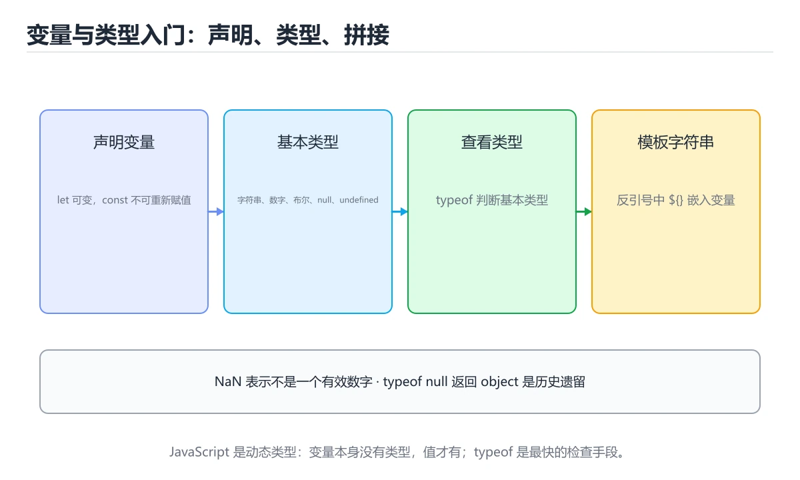
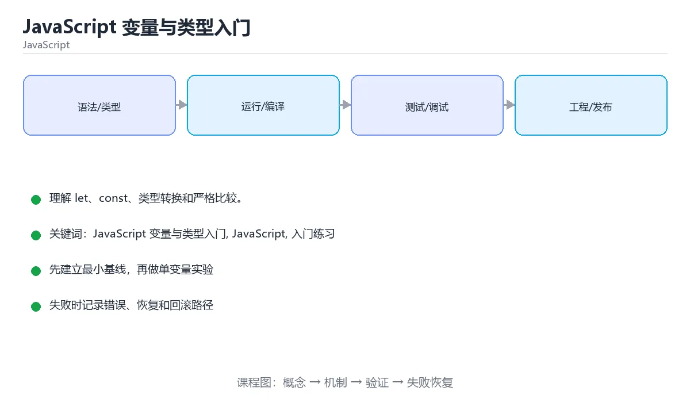

# JavaScript 变量与类型入门

> 内容更新时间：2026-10-06 · 学习阶段：入门 · 预计用时：55 分钟





## 本节知识框架

**课程定位**：所属分类为「JavaScript」，课程主题为「JavaScript 变量与类型入门」，学习阶段为「入门」，建议用时 55 分钟。

**本课要解决的主问题**：理解 let、const、类型转换和严格比较。

| 学习层次 | 要回答的问题 | 完成判据 |
| --- | --- | --- |
| 概念层 | 「JavaScript 变量与类型入门」有哪些必须区分的对象与术语？ | 能用自己的话定义核心术语，并各举一个正例和一个反例。 |
| 机制层 | 这些对象按什么顺序发生作用，输入如何变成输出？ | 能画出或写出机制步骤，并说明每一步的失败条件。 |
| 应用层 | 什么场景适合使用「JavaScript 变量与类型入门」，什么场景不适合？ | 能给出一个真实场景、一个最小示例和一个边界案例。 |
| 性能层 | 时间、空间、吞吐或延迟受哪些量影响？ | 能说出复杂度或性能瓶颈的证据来源；没有证据时明确写“材料未提供”。 |
| 复习层 | 怎样确认自己不是只记住了结论？ | 能独立完成本课自测，并把错误定位到概念、机制、示例或边界。 |

### 阅读路线

1. 先读「核心概念定义」，建立「JavaScript 变量与类型入门」等对象的精确定义。
2. 再读「原理与运行机制」，把定义串成可重复的过程。
3. 用「代码/协议/SQL 示例」验证过程，并只改一个条件观察结果变化。
4. 最后检查性能、易错点、知识关系与自测题，形成可复习的证据链。

**前置知识**：《JavaScript 控制台入门》

**学习位置**：本课位于《JavaScript 控制台入门》之后；如果前一课的自测不能通过，应先回补再继续。

**后续衔接**：下一课《JavaScript 条件与循环》会继续使用本课术语，学完后建议立即完成一次自测。

**教材衔接：学习目标**

- 先认识JavaScript 变量与类型入门需要的工具、输入和输出。
- 按步骤运行最小示例，并记录结果与错误。
- 用一个边界输入验证自己是否真正掌握。

**教材衔接：前置知识**

- 会进行基本的文件或命令行操作。
- 不需要预先掌握「JavaScript」的高级知识。

**教材衔接：本课小结**

- 入门阶段先保证能运行、能观察、能解释，再追求复杂功能。
- 每次只改一个变量，记录预测与实际结果。
- 遇到错误先看第一条错误信息，再回到最小示例。

## 核心概念定义

> 阅读约定：本课先给「JavaScript 变量与类型入门」相关术语的操作性定义与适用边界；正文里的口语化说法与定义冲突时，以定义和可复现示例为准。

| 术语 | 操作性定义 | 本课中的边界 |
| --- | --- | --- |
| let 与 const | let 声明可重新赋值的变量，const 声明不可重新赋值的绑定。 | 仅在「JavaScript 变量与类型入门」明确给出的输入、版本与资源条件下成立。 |
| 动态类型 | 变量本身没有类型，类型跟着当前保存的值走。 | 仅在「JavaScript 变量与类型入门」明确给出的输入、版本与资源条件下成立。 |
| 原始类型与引用类型 | 数字、字符串等按值比较，对象与数组按引用比较。 | 仅在「JavaScript 变量与类型入门」明确给出的输入、版本与资源条件下成立。 |
| typeof | 返回值的类型字符串，注意 typeof null 会得到 "object"。 | 仅在「JavaScript 变量与类型入门」明确给出的输入、版本与资源条件下成立。 |
| 函数 | 函数是一等对象，可以作为参数、返回值和对象属性 | 仅在「JavaScript 变量与类型入门」明确给出的输入、版本与资源条件下成立。 |
| 闭包 | 闭包让函数记住定义时的词法作用域，常用于回调、模块私有状态和工厂函数 | 仅在「JavaScript 变量与类型入门」明确给出的输入、版本与资源条件下成立。 |

### 定义如何使用

在「JavaScript 变量与类型入门」中判断一个说法是否成立，先确认它使用的是哪个对象的定义，再检查输入规模、运行环境与失败路径。定义不是口号，而是后续推导、代码示例和自测题共享的约束。

**教材衔接：零基础通俗讲：JavaScript 变量与类型**

### 一句话说清它是什么

JavaScript 用 let 声明可变的变量、const 声明不变的绑定；类型由值决定，同一个变量可以在不同时刻装不同类型的值。

### 用生活比喻理解

像没有固定标签的收纳盒：盒子本身不限定装什么，里面放的是衣服它就是衣物盒，换成书就成了书盒。类型跟着内容走，而不是跟着盒子走。

### 完整可运行代码

```javascript
const name = "小明";
let age = 18;
let height = 1.75;
let isBeginner = true;

console.log(`${name} 今年 ${age} 岁`);
console.log(`身高 ${height} 米，是否初学者：${isBeginner}`);
console.log(typeof name, typeof age, typeof height, typeof isBeginner);
```

### 逐行拆开看

- `const name = "小明";` 用 const 声明字符串常量，绑定不能再指向别的值。
- `let age = 18;` 用 let 声明可以重新赋值的变量，作用域限制在最近的一对花括号内。
- `let height = 1.75;` JavaScript 只有一种数字类型 Number，整数和小数不分家。
- `let isBeginner = true;` 布尔值只有 true 和 false 两个字面量。
- 模板字符串里的美元符号加花括号可以放任意表达式，不只是变量名。
- `typeof` 返回一个描述类型的字符串，是排查类型问题时最常用的工具。

### 把程序跑一遍

- 四行声明依次执行，各自保存一个值。
- 两条输出把值嵌进模板字符串，屏幕显示两行中文。
- typeof 依次返回 string、number、number、boolean，注意 age 和 height 的类型都是 number。
- 如果把 18 改成 "18"，typeof 的结果会变成 string，而输出文字看不出差别，这正是 JavaScript 容易踩坑的地方。

### 新手最容易踩的坑

- 用 var 声明变量：var 没有块级作用域，循环里声明的变量会泄漏到循环外。
- 以为 `typeof null` 是 null：它其实返回 object，这是语言的历史遗留问题。
- 用 `==` 比较不同类型：`"18" == 18` 为 true，应该用 `===` 严格比较。
- 给 const 声明的对象改属性：对象属性可以改，只有整个绑定不能换，容易误解。
- 数字精度问题：`0.1 + 0.2` 得到 0.30000000000000004，金额计算要转换成整数分。

### 动手练一练

- 分别用 let 和 const 声明变量，尝试重新赋值，观察哪一个会报错。
- 输出 `typeof null`、`typeof []`、`typeof function () {}` 的结果，把它们记下来。
- 用 `===` 和 `==` 分别比较 `"1"` 和 1，解释差异。

### 本课速查卡

把下面八行抄进自己的笔记，复习时只看这一页就能回忆整课：

| 复习项 | 本课要点 |
| --- | --- |
| 核心结论 | JavaScript 用 let 声明可变的变量、const 声明不变的绑定；类型由值决定，同一个变量可以在不同时刻装不同类型的值。 |
| 最少要写的代码 | `const name = "小明";` |
| 正确做法 | 四行声明依次执行，各自保存一个值。 |
| 最常见的错误 | 用 var 声明变量：var 没有块级作用域，循环里声明的变量会泄漏到循环外。 |
| 出错先查什么 | 先读第一条报错信息，再回到最小示例只改一个地方 |
| 怎么确认学会了 | 分别用 let 和 const 声明变量，尝试重新赋值，观察哪一个会报错。 |
| 和别的知识点的关系 | 本课打下的语法与思维方式会被后面每一课反复用到 |
| 接下来做什么 | 合上教程，凭记忆把上面的最小代码重写一遍再运行 |

## 原理与运行机制

### 机制总览

1. **建立输入**：把「let 与 const」按本课定义整理成可观察、可重复的输入条件。
2. **执行转换**：围绕「动态类型」执行本课的核心步骤；每一步都记录中间状态，避免只看最终输出。
3. **产生输出**：得到「原始类型与引用类型」后，用正文示例或协议/SQL 结果核对输出是否符合预期。
4. **改变一个条件**：只替换一个边界条件或环境参数，观察「JavaScript 变量与类型入门」的结论是否仍然成立。

| 阶段 | 关注对象 | 失败时应检查 |
| --- | --- | --- |
| 输入 | let 与 const | 类型、范围、编码、版本或前置状态是否满足定义。 |
| 处理 | 动态类型 | 顺序、可见性、锁、路由、事务或调度规则是否被破坏。 |
| 输出 | 原始类型与引用类型 | 结果是否可复现，错误是否被正确传播而不是被吞掉。 |

本课的机制结论要用「JavaScript 变量与类型入门」自己的示例验证。「JavaScript 变量与类型入门」没有给出某个数量级、吞吐或内存数据时，本课把该判断标为“材料未提供”，不从相邻主题外推。

**教材衔接：一句话入门**

理解 let、const、类型转换和严格比较。

**教材衔接：JavaScript 基础机制速览**

### 引擎、事件循环与执行上下文

JavaScript 是单线程执行模型，调用栈执行同步代码，事件循环在栈清空后处理任务队列和微任务队列。`setTimeout`、Promise、事件回调都通过异步机制排队执行。理解调用栈、任务队列和微任务的顺序，才能解释“为什么日志顺序和代码顺序不同”。浏览器和 Node.js 提供不同的宿主 API，但语言核心相同。

### 变量、作用域与类型转换

`var` 函数作用域且会提升，`let` 和 `const` 块级作用域并有暂时性死区。`const` 禁止重新赋值，但对象内容仍可修改。JavaScript 有原始类型和对象类型，`==` 会做隐式类型转换，`===` 同时比较类型和值；日常判断优先使用 `===`，只有明确需要转换时才用 `==`。`null`、`undefined`、`NaN` 的语义不同，判断存在性时要写清。

### 函数、闭包与 this

函数是一等对象，可以作为参数、返回值和对象属性。闭包让函数记住定义时的词法作用域，常用于回调、模块私有状态和工厂函数。`this` 的值取决于调用方式，普通调用、方法调用、构造函数和箭头函数规则不同；箭头函数不绑定自己的 this，适合回调，不适合需要动态 this 的方法。

### 对象、原型与模块

对象是键值集合，原型链提供属性查找和继承。`class` 是原型继承的语法糖，`extends` 和 `super` 简化继承写法。模块使用 `import`/`export` 显式声明依赖，避免全局污染。不可变数据、展开运算符和结构化克隆各有边界，浅拷贝不会复制嵌套对象。

### Promise、async 与 DOM

Promise 表示未来完成或失败的结果，`async/await` 让异步代码更接近同步写法，但不会把异步变成阻塞。错误要用 try/catch 或 `.catch` 处理，多个独立任务可以用 `Promise.all`，需要全部结束再汇总可以用 `Promise.allSettled`。DOM 操作应批量进行，避免在循环中反复读写布局；事件监听要注意冒泡、捕获、默认行为和移除监听器，防止内存泄漏。

**教材衔接：版本与时效**

- 运行时要同时考虑浏览器基线与 Node LTS；JavaScript 变量与类型入门 的降级策略要写清楚。
- 升级「JavaScript 变量与类型入门」涉及的依赖前，先用 console 复现当前行为，再逐项核对版本说明与破坏性变更。

### 升级检查清单

- 先固定当前版本，跑通全部示例与测验，再升级工具链。
- 升级时只动一个依赖版本，用 console 记录构建与运行结果。
- 升级后重点回归 JavaScript 变量与类型入门 的默认值、警告信息与错误格式。
- 升级完成后记录 JavaScript 变量与类型入门 的新旧版本差异，并据此调整下次复核时间。

## 典型应用场景

| 场景 | 典型输入或前提 | 期望产物 |
| --- | --- | --- |
| 学习验证 | 使用本课最小示例和 JavaScript 变量与类型入门、JavaScript | 能复现正文结论，并解释每一步。 |
| 工程落地 | 把「JavaScript 变量与类型入门」放入真实模块或服务边界 | 输出可观测、失败可定位、参数可配置。 |
| 故障排查 | 只改一个版本、规模、输入或依赖条件 | 能区分概念错误、实现错误和环境差异。 |

判断「JavaScript 变量与类型入门」的场景是否成立，标准是能否写出输入、处理、输出和失败路径；材料中没有出现的数据在本课标注为“材料未提供”，不用推测替代证据。

**课程内置实验入口**：`sandbox:javascript`，用于动手验证《JavaScript 变量与类型入门》的机制；实验结论不替代概念定义与复杂度分析。

**教材衔接：代码实验：把示例跑成证据**

### 实验一：建立基线

```javascript
const name = "Ada";
const year = 1815;
console.log(`${name} born in ${year}`);
```

### 实验二：只改一个输入

沿用「JavaScript 变量与类型入门」的最小示例做一次单变量实验：

| 实验 | 改动 | 预测 | 实际 | 结论 |
| --- | --- | --- | --- | --- |
| 基线 | 保持「JavaScript 变量与类型入门」示例原样 |  |  |  |
| 边界 | 把JavaScript 变量与类型入门换成空值或极值 |  |  |  |
| 失败 | 给JavaScript传入非法输入 |  |  |  |

做完后用一句话写出「JavaScript 变量与类型入门」的结论：输入怎么变，结果才怎么变。

### 实验三：制造一个可控错误

把 console 的输入推到越界值，记录错误信息与恢复动作。

| 实验 | 改动 | 预测 | 实际 | 结论 |
| --- | --- | --- | --- | --- |
| 基线 | 保持原样 |  |  |  |
| 边界 |  |  |  |  |
| 失败 |  |  |  |  |

### 实验四：用三句话复述

1. JavaScript 变量与类型入门 的输入是什么，哪些取值合法，哪些属于边界或非法范围？
2. 在 代码实验：把示例跑成证据 里，JavaScript 的状态是在什么条件下被改变的？
3. 输出如何验证，失败时第一条可观察证据是什么？

## 代码/协议/SQL 示例

### 最小可验证示例

下面保留《JavaScript 变量与类型入门》原文中的最小示例。先预测《JavaScript 变量与类型入门》示例的输出，再按正文步骤运行或推演；示例依赖外部环境时，同时记录版本与输入。

```javascript
const name = "Ada";
const year = 1815;
console.log(`${name} born in ${year}`);
```

**教材衔接：最小示例**

```javascript
const name = "Ada";
const year = 1815;
console.log(`${name} born in ${year}`);
```

**教材衔接：预期输出**

```text
Ada born in 1815
```

## 时间/空间复杂度或性能分析

**复杂度证据**：「JavaScript 变量与类型入门」的现有材料没有给出渐近时间或空间复杂度的明确结论，本课只做定性检查，不补写未经验证的 $O$ 记号。

| 维度 | 本课关注点 | 判断依据 |
| --- | --- | --- |
| 时间/延迟 | 「JavaScript 变量与类型入门」的主要步骤是否会随输入规模、并发度或网络往返增长。 | 以正文复杂度、基准数据或可重复测量为准。 |
| 空间/内存 | 中间状态、缓存、副本、连接或索引是否随规模增长。 | 记录峰值内存与数据副本，不只看最终结果。 |
| 吞吐/资源 | 版本、调度、锁、IO、序列化或协议开销是否成为瓶颈。 | 固定环境做对照实验，改变一个变量。 |

评估「JavaScript 变量与类型入门」时要区分“正确性成立”和“性能达标”两件事；材料没有给出基准时，本课只保留量级来源与测量方法，不写不可验证的绝对数字。

## 常见误区与易错点

> 复核《JavaScript 变量与类型入门》的易错点时，优先保留原文的错误表、故障现场与排错路径；每条修正都要能用本课示例复验。

| 易错点 | 常见表现 | 正确做法 |
| --- | --- | --- |
| 只背结论 | 能复述「JavaScript 变量与类型入门」的定义，却说不清输入、输出与边界。 | 回到机制步骤，用最小示例逐一验证。 |
| 混淆相邻概念 | 把本课对象与相邻主题的对象当成同一类。 | 先比较定义、资源归属、生命周期和失败模式。 |
| 忽略版本与环境 | 在开发机通过后直接外推到生产环境。 | 固定版本、输入和资源条件，再记录可复现结果。 |

**教材衔接：常见错误与排查**

> 说明：本表由《JavaScript 变量与类型入门》的核心知识整理（2026-10-07），人工复核进度见 docs/content_review_batches.md。

| 易错点 | 容易踩的做法 | 正确结论 |
| --- | --- | --- |
| 变量声明方式混用 | 作用域与提升行为混乱 | 默认用常量声明，需要修改时用块级变量声明 |
| 混淆空值与未定义 | 判断出现意料之外的分支 | 统一空值语义并集中处理 |
| 依赖隐式类型转换 | 加法与比较结果不符合预期 | 显式转换类型后再运算 |

**教材衔接：故障现场**

### 现场 1：变量声明方式混用

**症状**：在《JavaScript 变量与类型入门》的复现场景中，作用域与提升行为混乱。

**根因**：触发点是把“变量声明方式混用”当成安全做法。它没有满足《JavaScript 变量与类型入门》要求的前提，因此先表现为“作用域与提升行为混乱”；排查时先完整复现这一段，再核对输入、配置与依赖。

**修复**：针对《JavaScript 变量与类型入门》的问题，默认用常量声明，需要修改时用块级变量声明。

**验证**：在《JavaScript 变量与类型入门》中按“默认用常量声明，需要修改时用块级变量声明”调整后，从“变量声明方式混用”的触发条件重放同一条路径，确认“作用域与提升行为混乱”不再出现，并补一个相邻边界用例检查没有引入新问题。

### 现场 2：混淆空值与未定义

**症状**：在《JavaScript 变量与类型入门》的复现场景中，判断出现意料之外的分支。

**根因**：触发点是把“混淆空值与未定义”当成安全做法。它没有满足《JavaScript 变量与类型入门》要求的前提，因此先表现为“判断出现意料之外的分支”；排查时先完整复现这一段，再核对输入、配置与依赖。

**修复**：针对《JavaScript 变量与类型入门》的问题，统一空值语义并集中处理。

**验证**：在《JavaScript 变量与类型入门》中按“统一空值语义并集中处理”调整后，从“混淆空值与未定义”的触发条件重放同一条路径，确认“判断出现意料之外的分支”不再出现，并补一个相邻边界用例检查没有引入新问题。

### 现场 3：依赖隐式类型转换

**症状**：在《JavaScript 变量与类型入门》的复现场景中，加法与比较结果不符合预期。

**根因**：触发点是把“依赖隐式类型转换”当成安全做法。它没有满足《JavaScript 变量与类型入门》要求的前提，因此先表现为“加法与比较结果不符合预期”；排查时先完整复现这一段，再核对输入、配置与依赖。

**修复**：针对《JavaScript 变量与类型入门》的问题，显式转换类型后再运算。

**验证**：在《JavaScript 变量与类型入门》中按“显式转换类型后再运算”调整后，从“依赖隐式类型转换”的触发条件重放同一条路径，确认“加法与比较结果不符合预期”不再出现，并补一个相邻边界用例检查没有引入新问题。

**教材衔接：工程化精练：决策、失败与验证**

这一章把「JavaScript 变量与类型入门」从“看懂”推进到“能判断、能验证、能排错”。所有判断都围绕JavaScript 变量与类型入门、JavaScript与入门练习展开，并与前文的示例、测验和失败现场互相对照。

### 一、JavaScript 变量与类型入门 的判断算法

| 步骤 | 要回答的问题 | 判断依据 | 记录什么 |
| --- | --- | --- | --- |
| 1. 定目标 | 「JavaScript 变量与类型入门」这一步要解决什么问题？ | 把JavaScript 变量与类型入门的目标写成一句可验证的结论 | 输入、约束、成功标准 |
| 2. 找边界 | JavaScript在什么条件下失效？ | 先列空值、极值、重复和失败路径 | 反例与触发条件 |
| 3. 跑基线 | 原始示例的真实输出是什么？ | 命令、版本和环境必须可复现 | 命令、输出、耗时 |
| 4. 只改一处 | 把入门练习换成另一种取值会怎样？ | 预测写在运行之前 | 预测与实际的差异 |
| 5. 回写结论 | 结论能否被他人复现？ | 把判断写成清单或测试 | 结论、证据、遗留问题 |

这张表的用法不是从上到下浏览，而是每次只填一行：先用「JavaScript 变量与类型入门」前文的示例验证第 3 行，再故意破坏一个条件验证第 2 行。当你能在不看解析的情况下说出JavaScript 变量与类型入门的判断依据，才算真正掌握本课。

- 先从JavaScript 变量与类型入门入手：把它写成“输入是什么、输出是什么、哪一步最容易出错”。如果这三句话中有一句说不清，说明对「JavaScript 变量与类型入门」的理解还停留在术语层面，需要回到正文的最小示例重新观察一次。

- 再把JavaScript当成对照实验的变量：固定其他条件，只改变它的取值，记录输出是否变化。结论“变”或“不变”都要写出理由，并说明这个理由能否被他人独立复现。

- 针对入门练习做一次失败演练：故意给出空值、极值或错误类型，观察「JavaScript 变量与类型入门」的报错位置和处理方式。错误信息只是入口，真正要定位的是哪一层假设被破坏。

- 把「JavaScript 变量与类型入门」的结论压缩成一条可执行清单：先检查输入，再检查版本与环境，然后跑最小用例，最后才扩大规模。顺序颠倒会让排错范围成倍增加。

- 如果结论依赖时间或规模，就把数据量提高一个数量级再跑一次。在「JavaScript 变量与类型入门」里，小样本成立不代表大样本成立，复杂度、资源占用和失败率都要重新记录。

- 如果结论依赖并发或共享状态，就固定输入并连续运行多次。结果不一致时，优先怀疑「JavaScript 变量与类型入门」中JavaScript 变量与类型入门相关步骤的隐藏状态，而不是先改代码。

- 把「JavaScript 变量与类型入门」的判断写成测试：一个正常用例、一个边界用例、一个失败用例。测试通过只是起点，还要确认失败用例确实以预期方式失败。

- 把本课与相邻主题连起来：JavaScript 变量与类型入门解决的是“怎么做”，JavaScript回答“什么时候不适用”。两者都答得出来，迁移才算完成。

> 第 2 轮复核「JavaScript 变量与类型入门」：把上面的结论逐条改写为可验证的问题，并记录仍不确定的部分。

- 先从JavaScript 变量与类型入门入手：把它写成“输入是什么、输出是什么、哪一步最容易出错”。如果这三句话中有一句说不清，说明对「JavaScript 变量与类型入门」的理解还停留在术语层面，需要回到正文的最小示例重新观察一次。

- 再把JavaScript当成对照实验的变量：固定其他条件，只改变它的取值，记录输出是否变化。结论“变”或“不变”都要写出理由，并说明这个理由能否被他人独立复现。

- 针对入门练习做一次失败演练：故意给出空值、极值或错误类型，观察「JavaScript 变量与类型入门」的报错位置和处理方式。错误信息只是入口，真正要定位的是哪一层假设被破坏。

- 把「JavaScript 变量与类型入门」的结论压缩成一条可执行清单：先检查输入，再检查版本与环境，然后跑最小用例，最后才扩大规模。顺序颠倒会让排错范围成倍增加。

### 二、JavaScript 变量与类型入门 的机制拆解与自测

把本课考点还原成可回答的问题，再逐题写出依据：

**问题 1**：下面这段 JavaScript 代码摘自「JavaScript 变量与类型入门」的正文示例。关于这段代码，下面哪一项说法与实际内容相符？

- 关联术语：JavaScript 变量与类型入门
- 判断依据：回到「JavaScript 变量与类型入门」正文对应小节，先用最小示例验证再下结论。
- 追问：如果把JavaScript 变量与类型入门的条件换成边界值，这个结论是否仍然成立？

**问题 2**：模板字符串 `${name} born in ${year}` 相比加号拼接的优势是？

- 关联术语：JavaScript
- 判断依据：用 ${} 直接嵌入表达式，可读性更好且不易漏空格
- 追问：如果把JavaScript的条件换成边界值，这个结论是否仍然成立？

**问题 3**：围绕“JavaScript 变量与类型入门”中的 JavaScript 变量与类型入门、JavaScript、入门练习，下列哪两项是本课强调的实践判断？

- 关联术语：入门练习
- 判断依据：验证 JavaScript 时要固定版本并覆盖边界输入，结论才可复现
- 追问：JavaScript 的条件变化到什么程度时，需要换一种做法？

**问题 4**：补全代码：在现代 JavaScript 中声明可重新赋值的块级变量，应写 ____ count = 1;。

- 关联术语：JavaScript 变量与类型入门
- 判断依据：回到「JavaScript 变量与类型入门」正文对应小节，先用最小示例验证再下结论。
- 追问：如果把JavaScript 变量与类型入门的条件换成边界值，这个结论是否仍然成立？

### 三、失败模式与修复顺序

| 失败信号 | 常见根因 | 先做什么 | 修复后如何确认 |
| --- | --- | --- | --- |
| 「JavaScript 变量与类型入门」中 JavaScript 变量与类型入门 相关步骤报错 | 输入、版本或前置条件与示例不一致 | 保留第一条错误信息，回到最小输入 | 用用 ${} 直接嵌入表达式，可读性更好且不易漏空格复跑，确认输出可复现 |
| 「JavaScript 变量与类型入门」中 JavaScript 相关步骤报错 | 输入、版本或前置条件与示例不一致 | 保留第一条错误信息，回到最小输入 | 用验证 JavaScript 时要固定版本并覆盖边界输入，结论才可复现复跑，确认输出可复现 |
| 「JavaScript 变量与类型入门」中 入门练习 相关步骤报错 | 输入、版本或前置条件与示例不一致 | 保留第一条错误信息，回到最小输入 | 用用 ${} 直接嵌入表达式，可读性更好且不易漏空格复跑，确认输出可复现 |
- 检查点：固定版本与输入重跑《JavaScript 变量与类型入门》，记录两次差异并定位不稳定条件。
| 单次结果正确但规模一大就失效 | 只测了正常路径，没有覆盖边界 | 把数据量或并发度提高一个数量级 | 记录边界值、耗时与失败率 |

排错顺序固定为：先复现，再缩小输入，然后只改一个条件，最后把结论写成回归用例。对「JavaScript 变量与类型入门」来说，任何不能复现的“修好了”都不算完成。

### 四、离开本课前的验证清单

| 检查项 | 通过标准 | 证据 |
| --- | --- | --- |
| 能复述 | 用三句话说明「JavaScript 变量与类型入门」解决什么问题、边界在哪 | 不看解析写出的结论 |
| 能运行 | 最小示例在本机跑通 | 命令、输出与版本 |
| 能改条件 | 只改一个输入并解释差异 | 预测与实际的对照 |
| 能排错 | 至少制造并修复一个失败 | 错误信息与修复步骤 |
| 能迁移 | 把JavaScript 变量与类型入门、JavaScript、入门练习用到新场景 | 一个自选练习的结论 |

完成标准：能不看解析说清「JavaScript 变量与类型入门」全部自测题的依据，并且至少有一条JavaScript 变量与类型入门相关的结论经过真实运行验证。如果某一步只停留在“感觉懂了”，就把它写成下一轮针对「JavaScript 变量与类型入门」的最小验证任务。

### 五、把结论写成可检查的证据

学习「JavaScript 变量与类型入门」时，最容易出现的情况是“听过、看懂了，但换一个输入就说不清”。下面把JavaScript 变量与类型入门与JavaScript放进一条可检查的证据链：每一句结论都要能回答“从哪里来、在什么条件下成立、失败时怎么发现”。

| 证据类型 | 本课要求 | 不合格的表现 |
| --- | --- | --- |
| 概念证据 | 用一句话说明JavaScript 变量与类型入门的定义与适用场景 | 只背术语，说不出它解决什么问题 |
| 运行证据 | 能复现「JavaScript 变量与类型入门」的最小示例 | 输出与记录对不上，或换机器就不一致 |
| 对照证据 | 只改一个条件，说明差异来自哪里 | 一次改多个变量，无法归因 |
| 失败证据 | 故意制造错误并记录恢复步骤 | 只测正常路径，失败时靠猜 |
| 迁移证据 | 把JavaScript用到自选场景 | 换一个例子就完全套不上 |

举例：用 ${} 直接嵌入表达式，可读性更好且不易漏空格。把这个结论代回「JavaScript 变量与类型入门」的正文，找出它对应的输入、处理步骤与输出；再换掉其中一个条件，观察结论是否仍然成立。能完成这一步，才说明这条知识已经从“记忆”变成“可用的判断”。

最后留一个自检问题：如果只能保留三条笔记，你会写下哪三句？把答案限定为「JavaScript 变量与类型入门」中的可验证结论，并给每条结论配一个反例。这三句加上对应反例，就是本课最值得带入后续课程的复习材料。

<!-- language-intro-deep-dive:start -->

## 与其他知识点的关系

| 关系 | 课程 | 为什么 |
| --- | --- | --- |
| 先修 | 《JavaScript 控制台入门》 | 本课会直接使用它的概念或操作前提。 |
| 关联 | 《JavaScript 条件与循环》 | 用于横向比较或把本课结论迁移到相邻主题。 |
| 前置顺序 | 《JavaScript 控制台入门》 | 同分类中安排在本课之前，建议先完成其自测。 |
| 后续顺序 | 《JavaScript 条件与循环》 | 同分类中安排在本课之后，会继续使用本课术语。 |

把「JavaScript 变量与类型入门」放回知识体系时，不只要记住“前面学过什么”，还要说明两个主题在输入、机制、资源边界和失败模式上的差异。这样才能把单课知识迁移到项目、排障和后续课程。

**教材衔接：复习与迁移**

复习目标：把「JavaScript 变量与类型入门」的判断标准放回可复现的例子里。先自己作答，再对照依据；如果结论正确但理由不完整，回到正文补足前提。

### 概念复述

- 用一句话说明「JavaScript 变量与类型入门」解决什么问题：理解 let、const、类型转换和严格比较。
- 写出JavaScript 变量与类型入门、JavaScript、入门练习之间的关系，并各举一个例子。
- 说出本课最容易混淆的两个概念，以及区分它们的判据。

### 正文逐节复核

- **JavaScript 基础机制速览**：JavaScript 是单线程执行模型，调用栈执行同步代码，事件循环在栈清空后处理任务队列和微任务队列。

### 测验回顾

1. 下面这段 JavaScript 代码摘自「JavaScript 变量与类型入门」的正文示例。关于这段代码，下面哪一项说法与实际内容相符？
   - 依据：在「JavaScript 变量与类型入门」里，题干的正确项是这段代码会产生可观察的输出，运行后能看到结果，在「JavaScript 变量与类型入门」里要结合JavaScript 变量与类型入门核对输出是否符合预期。这段代码出自「JavaScript 变量与类型入门」的正文示例，围绕JavaScript 变量与类型入门、JavaScript、入门练习展开；把输入或边界换成空值、极值或失败情况后，结论要以「JavaScript 变量与类型入门」的实际运行结果为准。
2. 模板字符串 `${name} born in ${year}` 相比加号拼接的优势是？
   - 依据：在「JavaScript 变量与类型入门」里，用 ${} 直接嵌入表达式，可读性更好且不易漏空格。模板字符串用反引号包围，${} 内可以写变量或任意表达式，输出时自动转换为字符串并拼接，比一连串加号更容易检查空格与结构。回到「JavaScript 变量与类型入门」的正文示例，用“模板字符串 ${name} born”走一遍JavaScript 变量与类型入门、JavaScript、入门练习的完整流程，能复现的结论才可以保留。
3. 围绕“JavaScript 变量与类型入门”中的 JavaScript 变量与类型入门、JavaScript、入门练习，下列哪两项是本课强调的实践判断？
   - 依据：在「JavaScript 变量与类型入门」里，题干的正确项是验证 JavaScript 时要固定版本并覆盖边界输入，结论才可复现。学习 JavaScript 变量与类型入门 时要同时说明输入、输出和失败路径，不能只看正常流程。“围绕JavaScript”与「JavaScript 变量与类型入门」的术语表相呼应，只有符合JavaScript 变量与类型入门、JavaScript、入门练习约束的“验证 JavaScript 时要固定版本”才是正文支持的结论。
4. 补全代码：在现代 JavaScript 中声明可重新赋值的块级变量，应写 ____ count = 1;。
   - 依据：let 声明的变量属于块级作用域，并且允许之后重新赋值，适合计数器、循环状态等会变化的变量。const 也使用块级作用域，但绑定不能再次指向新值。在「JavaScript 变量与类型入门」里判断这道题，要把JavaScript 变量与类型入门、JavaScript、入门练习的条件、过程与失败路径逐项对齐，换成“补全代码”这个场景，只有满足前提的结论才成立。

### 迁移练习

把「JavaScript 变量与类型入门」的结论迁移到相邻主题，每次迁移都写清预测与证据：

1. 换输入：用JavaScript 变量与类型入门处理一组你自己的数据，对比教材示例的结果差异。
2. 换失败条件：制造一个JavaScript相关的错误，说明如何从错误信息定位根因。
3. 换规模：把数据量或并发度提高一个数量级，说明「JavaScript 变量与类型入门」的结论是否仍成立。

## 自测题与参考答案

> 先独立作答《JavaScript 变量与类型入门》的自测题，再对照答案与解析；每处判断都要能在本课正文或示例中找到依据。

### 自测 1

下面这段 JavaScript 代码摘自「JavaScript 变量与类型入门」的正文示例。关于这段代码，下面哪一项说法与实际内容相符？

```javascript
const name = "Ada";
const year = 1815;
console.log(`${name} born in ${year}`);
```

A. 这段代码只做静态声明，没有循环、分支或可观察输出。
B. 这段代码会产生可观察的输出，运行后能看到结果。
C. 这段代码包含异常处理分支，失败时会走专门的补救路径。
D. 这段代码会读取外部输入，结果依赖传入的数据。

**参考答案**：这段代码会产生可观察的输出，运行后能看到结果。

**解析**：在「JavaScript 变量与类型入门」里，题干的正确项是这段代码会产生可观察的输出，运行后能看到结果，在「JavaScript 变量与类型入门」里要结合JavaScript 变量与类型入门核对输出是否符合预期。这段代码出自「JavaScript 变量与类型入门」的正文示例，围绕JavaScript 变量与类型入门、JavaScript、入门练习展开；把输入或边界换成空值、极值或失败情况后，结论要以「JavaScript 变量与类型入门」的实际运行结果为准。

### 自测 2

模板字符串 `${name} born in ${year}` 相比加号拼接的优势是？

A. 模板字符串会自动把数字转换成字符串常量
B. 模板字符串会跳过转义字符的处理
C. 只有模板字符串才能输出变量的值
D. 用 ${} 直接嵌入表达式

**参考答案**：用 ${} 直接嵌入表达式

**解析**：在「JavaScript 变量与类型入门」里，用 ${} 直接嵌入表达式。模板字符串用反引号包围，${} 内可以写变量或任意表达式，输出时自动转换为字符串并拼接，比一连串加号更容易检查空格与结构。回到「JavaScript 变量与类型入门」的正文示例，用“模板字符串 ${name} born”走一遍JavaScript 变量与类型入门、JavaScript、入门练习的完整流程，能复现的结论才可以保留。

### 自测 3

围绕“JavaScript 变量与类型入门”中的 JavaScript 变量与类型入门、JavaScript、入门练习，下列哪两项是本课强调的实践判断？

A. 验证 JavaScript 时要固定版本并覆盖边界输入，结论才可复现
B. 把 JavaScript 的单次运行结果当成所有版本和规模都成立
C. 学习 JavaScript 变量与类型入门 时要同时说明输入、输出和失败路径，不能只看正常流程
D. 只要 JavaScript 变量与类型入门 的常规示例通过，就可以跳过边界与异常路径

**参考答案**：验证 JavaScript 时要固定版本并覆盖边界输入，结论才可复现；学习 JavaScript 变量与类型入门 时要同时说明输入、输出和失败路径，不能只看正常流程

**解析**：在「JavaScript 变量与类型入门」里，题干的正确项是验证 JavaScript 时要固定版本并覆盖边界输入，结论才可复现。学习 JavaScript 变量与类型入门 时要同时说明输入、输出和失败路径，不能只看正常流程。“围绕JavaScript”与「JavaScript 变量与类型入门」的术语表相呼应，只有符合JavaScript 变量与类型入门、JavaScript、入门练习约束的“验证 JavaScript 时要固定版本”才是正文支持的结论。

**教材衔接：动手练习**

1. 原样运行最小示例，保存命令和输出。
2. 把数字 2 改成 10，预测并验证新结果。
3. 制造一个错误输入，写出错误信息和修复方法。

**教材衔接：复习与自测**

本课测验检验 console 的判断依据。请把每个错误选项改写成一句反例，
说明它在哪个输入、边界或前提变化下会失败。

### 完成标准

- [ ] 能逐行说明 console 的输出是怎么得到的。
- [ ] 能只改 JavaScript 变量与类型入门 的一个值完成边界实验，并让预测与实际一致。
- [ ] 能复现 JavaScript 的异常并说明恢复步骤。
- [ ] 能说出 console 的两个常见误用，并各配一个检查方法。

### 复盘记录

| 项目 | 记录 |
| --- | --- |
| 学到的核心机制 |  |
| 仍然不确定的问题 |  |
| 下一步验证动作 |  |
对照 代码实验：把示例跑成证据 复述本课结论，答不上来的部分回到 console 的示例重跑一次。

### 一句话入门

自检：这一节的关键输入与输出分别是什么？

### 最小示例

```javascript
const name = "Ada";
const year = 1815;
console.log(`${name} born in ${year}`);
```

自检：这一节与相邻主题的边界在哪里？

### 预期输出

```text
Ada born in 1815
```

### 常见错误

自检：把这一节讲给没学过的人，最需要强调哪一点？

### 动手练习

自检：如果去掉这一节里的一个前提，结论会怎样变化？

**教材衔接：可运行练习**

### 任务 1：先跑通，再解释

```javascript
const name = "Ada";
const year = 1815;
console.log(`${name} born in ${year}`);
```

**预期输出**：${name} born in ${year}

### 任务 2：只改一个条件

把「JavaScript 变量与类型入门」的最小示例复制一份，只改一个条件再跑一次：

- 改动点：只把 JavaScript 变量与类型入门 的输入换成空值、极值或错误输入，其余保持不变。
- 预测：先写下「JavaScript 变量与类型入门」在改动后的输出或错误信息，再运行。
- 记录：对照改动前后的结果，指出差异出在哪一步。
- 验收：换回原条件能复现原结果，改动只影响JavaScript 变量与类型入门。

### 任务 3：迁移到自己的数据

换一个 JavaScript 场景重做一次，确认结论不是只对示例数据成立。

**教材衔接：本课复习清单**

离开本课前，逐项确认：

- [ ] 不看解析，能说出「JavaScript 中 const 与 let 的区别是？」的判断依据。
- [ ] 不看解析，能说出「JavaScript 中 typeof null 的结果是什么？」的判断依据。
- [ ] 至少运行一次 console 的示例，记录输入、输出和 JavaScript 变量与类型入门 的边界情况。
- [ ] 把本课最容易混淆的两个概念写成一句话对照。

| 复盘项 | 记录 |
| --- | --- |
| 已经能独立解释的考点 |  |
| 仍然说不清的概念 |  |
| 下一步验证动作 |  |

---

## 术语速查

把「JavaScript 变量与类型入门」里反复出现的术语集中放在一起。复习时先遮住右列，尝试用自己的话解释，再回到正文核对。

| 术语 | 一句话说明 |
| --- | --- |
| `let 与 const` | let 声明可重新赋值的变量，const 声明不可重新赋值的绑定。 |
| `动态类型` | 变量本身没有类型，类型跟着当前保存的值走。 |
| `原始类型与引用类型` | 数字、字符串等按值比较，对象与数组按引用比较。 |
| `typeof` | 返回值的类型字符串，注意 typeof null 会得到 "object"。 |
| `函数` | 函数是一等对象，可以作为参数、返回值和对象属性 |
| `闭包` | 闭包让函数记住定义时的词法作用域，常用于回调、模块私有状态和工厂函数 |

## 考点精讲

### 考点 1：代码补全·JavaScript 变量与类型入门

- **题目**：下面这段 JavaScript 代码摘自「JavaScript 变量与类型入门」的正文示例。关于这段代码，下面哪一项说法与实际内容相符？
- **判断依据**：在「JavaScript 变量与类型入门」里，题干的正确项是这段代码会产生可观察的输出，运行后能看到结果，在「JavaScript 变量与类型入门」里要结合JavaScript 变量与类型入门核对输出是否符合预期。这段代码出自「JavaScript 变量与类型入门」的正文示例，围绕JavaScript 变量与类型入门、JavaScript、入门练习展开；把输入或边界换成空值、极值或失败情况后，结论要以「JavaScript 变量与类型入门」的实际运行结果为准。

### 考点 2：概念判断·JavaScript 变量与类型入门

- **题目**：模板字符串 `${name} born in ${year}` 相比加号拼接的优势是？
- **判断依据**：在「JavaScript 变量与类型入门」里，用 ${} 直接嵌入表达式。模板字符串用反引号包围，${} 内可以写变量或任意表达式，输出时自动转换为字符串并拼接，比一连串加号更容易检查空格与结构。回到「JavaScript 变量与类型入门」的正文示例，用“模板字符串 ${name} born”走一遍JavaScript 变量与类型入门、JavaScript、入门练习的完整流程，能复现的结论才可以保留。

### 考点 3：多选辨析·JavaScript 变量与类型入门

- **题目**：围绕“JavaScript 变量与类型入门”中的 JavaScript 变量与类型入门、JavaScript、入门练习，下列哪两项是本课强调的实践判断？
- **判断依据**：在「JavaScript 变量与类型入门」里，题干的正确项是验证 JavaScript 时要固定版本并覆盖边界输入，结论才可复现。学习 JavaScript 变量与类型入门 时要同时说明输入、输出和失败路径，不能只看正常流程。“围绕JavaScript”与「JavaScript 变量与类型入门」的术语表相呼应，只有符合JavaScript 变量与类型入门、JavaScript、入门练习约束的“验证 JavaScript 时要固定版本”才是正文支持的结论。

### 考点 4：填空·JavaScript 变量与类型入门

- **题目**：补全代码：在现代 JavaScript 中声明可重新赋值的块级变量，应写 ____ count = 1;。
- **判断依据**：let 声明的变量属于块级作用域，并且允许之后重新赋值，适合计数器、循环状态等会变化的变量。const 也使用块级作用域，但绑定不能再次指向新值。在「JavaScript 变量与类型入门」里判断这道题，要把JavaScript 变量与类型入门、JavaScript、入门练习的条件、过程与失败路径逐项对齐，换成“补全代码”这个场景，只有满足前提的结论才成立。

### 考点 5：填空·JavaScript 变量与类型

- **题目**：补全代码：声明一个初始化后不再重新赋值的块级常量，应写成 ____ PI = 3.14;。
- **判断依据**：const 声明块级作用域的常量，必须在声明时初始化，之后不能重新赋值。JavaScript 变量与类型入门 的正文对比了 var、let 与 const：var 存在变量提升和函数作用域问题，let 允许重新赋值，只有确定不会改变的绑定才用 const，这样能在运行前就暴露误改。

## English Overview

**Title:** JavaScript Variables and Types

**Summary:** Learn let, const, coercion and strict equality.

**Category:** JavaScript
**Level:** 入门
**Key terms:** JavaScript 变量与类型入门, JavaScript, 入门练习

## 内容元数据

- 内容版本：v2.0
- 最后更新：2026-10-06
- 学习阶段：入门
- 适用环境：Node.js 22+ / 现代浏览器；本课聚焦 JavaScript 变量与类型入门。
- 内容来源：内置结构化课程与工程实践整理
- 相关主题：JavaScript 变量与类型入门、JavaScript、入门练习
- 质量版本：P0 测验标准 + P1 覆盖扩展 + P2 体验补全

## 参考资料与复核

- 最后复核：2026-10-04
- 下次复核：2027-05-17
- 复核范围：版本兼容、API 行为、安全建议与工程实践
- 来源性质：官方文档、标准或权威教材；正文为离线教学重组

| 参考资料 | 本课用途 |
| --- | --- |
| [MDN JavaScript 指南](https://developer.mozilla.org/docs/Web/JavaScript/Guide) | 语言基础与浏览器 API |
| [Node.js 文档](https://nodejs.org/docs/latest/api/) | 服务端运行时与模块 |
| [npm 文档](https://docs.npmjs.com/) | 包管理与发布 |

> 「JavaScript 变量与类型入门」的链接用于离线阅读后的延伸核对；App 不会自动联网。
