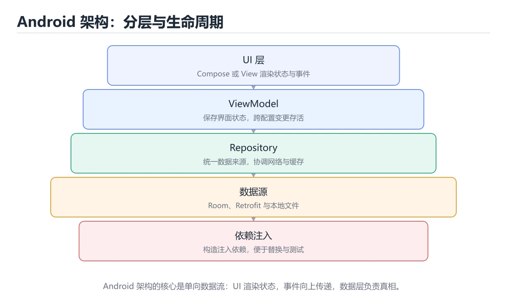

# Kotlin Android 架构

> 内容更新时间：2026-10-06 · 学习阶段：高级 · 预计用时：35 分钟




## 学习目标

- 能用自己的话解释：UI 层只负责渲染和事件，业务状态放在 ViewModel，数据访问放在 Repository。
- 能用自己的话解释：配置变更和进程重建要求状态可保存、可恢复。
- 能用自己的话解释：依赖注入、协程作用域和生命周期必须匹配，避免泄漏和重复请求。
- 能把本课知识放回「Kotlin」，并完成练习与测验。

## 前置知识

- 能运行 UiState 所在的示例环境，并读懂报错信息。
- 本课关键词：Android、ViewModel、Repository、生命周期。
- 遇到不熟悉的术语先记录问题，完成练习后再回读。

## 核心知识

### 1. UI 层只负责渲染和事件，业务状态放在 ViewModel，数据访问放在 Repository。

- 关键做法：先让 Android 的最小示例可复现，再加入并发或规模条件。
- 验证标准：UiState 的输出能被他人复现，边界输入有对应用例。

### 2. 配置变更和进程重建要求状态可保存、可恢复。

把这条结论放回「Kotlin Android 架构」的完整流程里展开：

- 正文依据：能用自己的话解释：UI 层只负责渲染和事件，业务状态放在 ViewModel，数据访问放在 Repository。
- 落地检查：把「2. 配置变更和进程重建要求状态可保存、可恢复。」改写成一条可执行的核对项，逐条验证输入、超时与失败路径。

### 3. 依赖注入、协程作用域和生命周期必须匹配，避免泄漏和重复请求。

把这条结论放回「Kotlin Android 架构」的完整流程里展开：

- 正文依据：能用自己的话解释：依赖注入、协程作用域和生命周期必须匹配，避免泄漏和重复请求。
- 落地检查：把「3. 依赖注入、协程作用域和生命周期必须匹配，避免泄漏和重复请求。」改写成一条可执行的核对项，逐条验证输入、超时与失败路径。

## 关键流程

```text
输入 → 校验 → 核心处理 → 验证 → 记录指标 → 失败恢复
```

## 实践路径

1. 用一句话复述本课要解决的问题。
2. 跑通正文中的最小示例并记录基线。
3. 只改变一个输入或参数，预测并验证结果。
4. 补一个失败路径，记录错误、恢复和指标。
5. 把结论写成可复现的笔记或测试。

## 常见错误与排查

> 说明：本表由《Kotlin Android 架构》的核心知识整理（2026-10-07），人工复核进度见 docs/content_review_batches.md。

| 易错点 | 容易踩的做法 | 正确结论 |
| --- | --- | --- |
| 业务逻辑堆在界面组件里 | 难测试，生命周期问题多 | 拆分视图模型与数据层 |
| 不感知生命周期收集数据流 | 页面销毁后仍更新界面 | 使用带生命周期感知的收集方式 |
| 配置变更后状态丢失 | 旋转屏幕后界面重置 | 把状态放进视图模型，必要时使用保存状态 |

## 动手练习

1. 合上教程，用 3～5 句话解释Kotlin Android 架构。
2. 从正文选一个例子，改变一个条件并预测结果。
3. 设计一个失败场景，写出止损与恢复步骤。

**验收标准**：留下输入、命令、输出、差异和下一步问题。

## 本课小结

- 本课围绕 Android、ViewModel、Repository、生命周期 展开，复习时重点核对它们的输入、输出和失败路径。
- 做完本课测验后，把答错且解释不清的 ViewModel 相关题目记成验证任务。


## 语言专项实践：Kotlin Android 架构

### 一、工具链

| 阶段 | 推荐工具 | 验收标准 |
| --- | --- | --- |
| 编译构建 | kotlinc / Gradle | 命令可复现且错误能被定位 |
| 测试 | JUnit + coroutines-test | 命令可复现且错误能被定位 |
| 静态检查 | detekt / ktlint | 命令可复现且错误能被定位 |
| 发布 | R8/ProGuard + App Bundle | 命令可复现且错误能被定位 |

### 二、运行时与内存模型

围绕「Android、ViewModel、Repository、生命周期」说明变量生命周期、资源释放、并发模型和错误传播。语言语法只是入口，真正决定行为的是运行时、标准库和平台约束。

### 三、测试策略

- 单元测试覆盖核心规则和边界。
- 集成测试覆盖文件、网络、数据库或平台 API。
- 失败测试覆盖超时、取消、异常和资源耗尽。
- 性能测试记录基线，避免只凭感觉优化。

### 四、发布检查

- [ ] 版本和依赖锁定，构建可复现。
- [ ] 产物经过签名、校验和最小权限配置。
- [ ] 日志不泄露密钥和个人信息。
- [ ] 有升级、回滚和故障恢复说明。

## 可运行练习

本节围绕Kotlin Android 架构安排 3 个可交付任务，每个任务都要求留下可以复查的记录。

### 任务 1：用自己的话画出结构

不看书，用一张图说清「Kotlin Android 架构」的结构，画完再对照骨架：

- 主干：核心知识 → 交付物 → 验收标准 → 复盘
- 连接线：在每条边上标出输入、输出与失败路径。
- 自检：能否用一句话说明Android与ViewModel的关系？

### 任务 2：做一次对比实验

**验收标准**：写出换方案的触发条件——当ViewModel的规模、精度或资源上限变化到什么程度时，「核心知识」里的结论不再成立。

### 任务 3：迁移到自己的场景

**验收标准**：用自己的话复述 Android，并配一个反例；只写定义不算通过。

## 故障现场

### 现场 1：业务逻辑堆在界面组件里

**症状**：在《Kotlin Android 架构》的复现场景中，难测试，生命周期问题多。

**根因**：“难测试，生命周期问题多”只是表层结果。向上追溯会落到“业务逻辑堆在界面组件里”这一步，因为它省略了《Kotlin Android 架构》的约束，使实现行为和预期模型发生了偏离。

**修复**：针对《Kotlin Android 架构》的问题，拆分视图模型与数据层。

**验证**：先在《Kotlin Android 架构》中记录“业务逻辑堆在界面组件里”留下的失败证据，再执行“拆分视图模型与数据层”并重放；确认错误路径变为明确结果，且修复没有掩盖同类故障。

### 现场 2：不感知生命周期收集数据流

**症状**：在《Kotlin Android 架构》的复现场景中，页面销毁后仍更新界面。

**根因**：“页面销毁后仍更新界面”只是表层结果。向上追溯会落到“不感知生命周期收集数据流”这一步，因为它省略了《Kotlin Android 架构》的约束，使实现行为和预期模型发生了偏离。

**修复**：针对《Kotlin Android 架构》的问题，使用带生命周期感知的收集方式。

**验证**：先在《Kotlin Android 架构》中记录“不感知生命周期收集数据流”留下的失败证据，再执行“使用带生命周期感知的收集方式”并重放；确认错误路径变为明确结果，且修复没有掩盖同类故障。

### 现场 3：配置变更后状态丢失

**症状**：在《Kotlin Android 架构》的复现场景中，旋转屏幕后界面重置。

**根因**：“旋转屏幕后界面重置”只是表层结果。向上追溯会落到“配置变更后状态丢失”这一步，因为它省略了《Kotlin Android 架构》的约束，使实现行为和预期模型发生了偏离。

**修复**：针对《Kotlin Android 架构》的问题，把状态放进视图模型，必要时使用保存状态。

**验证**：保留《Kotlin Android 架构》里触发“旋转屏幕后界面重置”的输入、版本和日志，按“把状态放进视图模型，必要时使用保存状态”完成修改后原样重放；只有失败现象消失且相邻场景仍可解释，才保留改动。

## 版本与时效

- 版本提示：Android 的行为在最近几个大版本里有过调整，升级「Kotlin Android 架构」前先用 UiState 复现当前输出，再对照官方发布说明逐条核对。
- 升级前确认 Android 的兼容范围，把不可回退的改动单独拆成一次提交。
- 显式 API 模式与多平台源集是团队协作时的重点
- 官方说明：https://kotlinlang.org/docs/releases.html

### 升级检查清单

- 先固定当前版本，跑通全部示例与测验，再升级工具链。
- 升级时只动一个依赖版本，用 UiState 记录构建与运行结果。
- 回归范围锁定 UiState 的默认行为，并确认弃用警告是否出现在构建输出里。
- 升级后把 UiState 的实测版本写进「内容元数据」，再更新复核日期。

## 本课复习清单


离开本课前，逐项确认：

- [ ] 不看解析，能说出「关于「UI 层只负责渲染和事件，业务状态放在 ViewModel，数据访问放在 Repository。」，下列说法正确的是？」的判断依据。
- [ ] 不看解析，能说出「围绕“Kotlin Android 架构”中的 Android、ViewModel、Repository，下列哪两项是本课强调的实践判断？」的判断依据。
- [ ] 不看解析，能说出「关于「依赖注入、协程作用域和生命周期必须匹配，避免泄漏和重复请求。」，下列说法正确的是？」的判断依据。
- [ ] 至少运行一次《Kotlin Android 架构》的示例，记录输入、输出和一个边界情况。
- [ ] 把本课最容易混淆的两个概念写成一句话对照。

| 复盘项 | 记录 |
| --- | --- |
| 已经能独立解释的考点 |  |
| 仍然说不清的概念 |  |
| 下一步验证动作 |  |

## 复习与自测

逐节自检：能说清 Android 的输入、输出与失败路径才算通过，否则回到原文。

### 核心知识

自检：这一节与相邻主题的边界在哪里？

### 动手练习

自检：如果去掉这一节里的一个前提，结论会怎样变化？

### 语言专项实践：Kotlin Android 架构

「Kotlin Android 架构」的「语言专项实践：Kotlin Android 架构」一节补全如下：

- 定位：这一节说明语言专项实践：Kotlin Android 架构在「Kotlin Android 架构」知识体系里的位置。
- 要点：合上教程，用 3～5 句话解释Kotlin Android 架构。
- 自检：能否用一个最小例子解释语言专项实践：Kotlin Android 架构？

### 最小可运行示例

```kotlin
data class UiState(val title: String, val loading: Boolean = false)

fun render(state: UiState) = if (state.loading) "loading" else state.title

fun main() {
    println(render(UiState(title = "课程列表")))
}
```

自检：把这一节讲给没学过的人，最需要强调哪一点？

### 预期输出

```text
课程列表
```

### 验证步骤

制造一次错误输入，记录错误信息与修复方式。

## 术语速查

| 术语 | 一句话说明 |
| --- | --- |
| `Android` | 谷歌的移动操作系统：应用以 Activity、Service 等组件运行在 ART 上，权限与生命周期由系统管理。 |
| `生命周期` | 二、运行时与内存模型：围绕「Android、ViewModel、Repository、生命周期」说明变量生命周期、资源释放、并发模型和错误传播。 |
| `协程` | Kotlin 的轻量并发单元，用挂起函数顺序书写异步逻辑，由调度器决定跑在哪个线程。 |
| `空安全` | 类型系统区分可空与非空，编译期就要求处理空值，减少空指针崩溃。 |

## 零基础精讲：把Kotlin Android 架构真正讲透

### 先建立一个直觉

本课的摘要可以当作一张地图：用 ViewModel、Repository、生命周期和依赖注入组织 Android 应用。

### 逐步拆解

1. 澄清输入与目标。先写清「Kotlin Android 架构」要解决的问题、合法输入范围和成功标准，再进入后续步骤。
2. 描述处理过程。把「Android、ViewModel、Repository、生命周期」映射到具体步骤，每步都要求能单独验证。
3. 定义输出。Android 的输出不仅包括正常结果，还包括错误码、日志和资源释放状态。
4. 让「Kotlin Android 架构」的失败路径尽早暴露：把Android推到边界值，记录错误信息、重试或降级动作，以及人工兜底条件。
5. 用 UiState 贯穿一次小实验：先预测输出，再运行或逐步推演，最后解释差异来自哪一步。

### 把正文串成一条执行链

- **1. UI 层只负责渲染和事件，业务状态放在 ViewModel，数据访问放在 Repository。**：在「Kotlin Android 架构」里，「1. UI 层只负责渲染和事件，业务状态放在 ViewModel，数据访问放在 Repository。」这一步要先写清输入与预期，再记录实际结果和差异；结果不符时回到对应小节核对前提。
- **2. 配置变更和进程重建要求状态可保存、可恢复。**：在「Kotlin Android 架构」里，「2. 配置变更和进程重建要求状态可保存、可恢复。」这一步要先写清输入与预期，再记录实际结果和差异；结果不符时回到对应小节核对前提。
- **3. 依赖注入、协程作用域和生命周期必须匹配，避免泄漏和重复请求。**：在「Kotlin Android 架构」里，「3. 依赖注入、协程作用域和生命周期必须匹配，避免泄漏和重复请求。」这一步要先写清输入与预期，再记录实际结果和差异；结果不符时回到对应小节核对前提。
- 一、工具链：完成 核心知识 的推荐工具与检查项
- **二、运行时与内存模型**：围绕「Android、ViewModel、Repository、生命周期」说明变量生命周期、资源释放、并发模型和错误传播
- **三、测试策略**：- 单元测试覆盖核心规则和边界

### 从测验反推易错点

**检查点 1：关于「UI 层只负责渲染和事件，业务状态放在 ViewModel，数据访问放在 Repository。」，下列说法正确的是？**

- 参考判断：UI 层只负责渲染和事件，业务状态放在 ViewModel，数据访问放在 Repository。
- 自问：如果去掉题干里的一个限定词，结论还成立吗？

**检查点 2：关于「配置变更和进程重建要求状态可保存、可恢复。」，下列说法正确的是？**

- 参考判断：配置变更和进程重建要求状态可保存、可恢复。

**检查点 3：关于「依赖注入、协程作用域和生命周期必须匹配，避免泄漏和重复请求。」，下列说法正确的是？**

- 参考判断：依赖注入、协程作用域和生命周期必须匹配，避免泄漏和重复请求。

**检查点 4：本课的核心学习目标是什么？**

- 参考判断：用 ViewModel，Repository

- 参考判断：title

### 工程排错顺序

| 先查什么 | 要得到的证据 | 判断标准 |
| --- | --- | --- |
| 输入与前提是否满足 | 日志、输入样例、测试或指标 | 能复现并解释，才算定位 |
| 核心步骤是否产生了预期中间结果 | 日志、输入样例、测试或指标 | 能复现并解释，才算定位 |
| 失败路径是否可观测、可恢复 | 日志、输入样例、测试或指标 | 能复现并解释，才算定位 |
| 资源、权限与成本是否在预算内 | 日志、输入样例、测试或指标 | 能复现并解释，才算定位 |

### 变式训练

1. 把 Android 放进一个只有单机、没有额外依赖的小项目，先保证正确再扩展。
2. 扩大 ViewModel 的规模，记录本课结论在哪一个量级开始不成立。
3. 把 ViewModel 换成失败输入，记录错误信息与恢复动作。
5. 把 UiState 的执行顺序调换一次，记录哪个中间结果先错；顺序敏感的地方就是本课的关键约束。
6. 在低带宽或低算力条件下重跑 ViewModel，记录降级路径是否仍然可用。

### 本课自测

- [ ] 能用一句话解释「Android」在本课中的角色与边界。
- [ ] 能举出一个正常例子和一个失败例子。
- [ ] 能说出最小验证步骤，以及需要记录的证据。
- [ ] 能用一句话解释「ViewModel」在本课中的角色与边界。
- [ ] 能用一句话解释「Repository」在本课中的角色与边界。
- [ ] 能用一句话解释「生命周期」在本课中的角色与边界。

### 迁移案例库

换一个 ViewModel 约束重做一次，确认结论在新条件下是否仍然成立。

#### 迁移案例 1：围绕「Android」做一次小实验

**目标**：在不改变课程主体的前提下，验证Kotlin Android 架构中的一个关键判断。

**步骤**：
1. 复述当前方案对「Android」的假设，写成一句可证伪的话。
2. 设计一个正常输入和一个边界输入，分别预测输出。
3. 运行或逐步演算，记录实际输出、耗时和失败信息。
4. 只调整一个参数，比较前后差异并解释原因。
5. 补充一条测试或复习卡，确保下次能更快复现。

**验收**：至少给出一个反例，说明Android在什么情况下会失效；只写成功案例不算通过。

#### 迁移案例 2：围绕「ViewModel」做一次小实验

**步骤**：
1. 复述当前方案对「ViewModel」的假设，写成一句可证伪的话。

#### 迁移案例 3：围绕「Repository」做一次小实验

**步骤**：
1. 复述当前方案对「Repository」的假设，写成一句可证伪的话。

#### 迁移案例 4：围绕「生命周期」做一次小实验

**步骤**：
1. 复述当前方案对「生命周期」的假设，写成一句可证伪的话。

#### 迁移案例 5：围绕「Android」做一次小实验

**步骤**：

#### 迁移案例 6：围绕「ViewModel」做一次小实验

**步骤**：

#### 迁移案例 7：围绕「Repository」做一次小实验

**步骤**：

#### 迁移案例 8：围绕「生命周期」做一次小实验

**步骤**：

#### 迁移案例 9：围绕「Android」做一次小实验

**步骤**：

#### 迁移案例 10：围绕「ViewModel」做一次小实验

**步骤**：

#### 迁移案例 11：围绕「Repository」做一次小实验

**步骤**：

#### 迁移案例 12：围绕「生命周期」做一次小实验

**步骤**：

#### 迁移案例 13：围绕「Android」做一次小实验

**步骤**：

#### 迁移案例 14：围绕「ViewModel」做一次小实验

**步骤**：

#### 迁移案例 15：围绕「Repository」做一次小实验

**步骤**：

#### 迁移案例 16：围绕「生命周期」做一次小实验

**步骤**：

<!-- p0-depth-v2:end -->

## 考点精讲

### 考点 1：概念判断·Android

- **题目**：关于「UI 层只负责渲染和事件，业务状态放在 ViewModel，数据访问放在 Repository。」，下列说法正确的是？
- **判断依据**：在「Kotlin Android 架构」里，UI 层只负责渲染和事件，业务状态放在 ViewModel，数据访问放在 Repository。“层只负责渲染和事件”与「Kotlin Android 架构」的术语表相呼应，只有符合Android、ViewModel、Repository约束的“UI 层只负责渲染和事件”才是正文支持的结论。

### 考点 2：多选辨析·Android

- **题目**：围绕“Kotlin Android 架构”中的 Android、ViewModel、Repository，下列哪两项是本课强调的实践判断？
- **判断依据**：本课把Kotlin Android 架构拆成概念、示例与故障现场三部分，因此判断 Android 时必须同时交代输入、输出和失败路径，这使“学习 Android 时要同时说明输入、输出和失败路径，不能只看正常流程”成立。在Kotlin Android 架构里，判断 ViewModel 时要固定版本与边界输入，所以“验证 ViewModel 时要固定版本并覆盖边界输入，结论才可复现”才可复现。

### 考点 3：概念判断·Android

- **题目**：关于「依赖注入、协程作用域和生命周期必须匹配，避免泄漏和重复请求。」，下列说法正确的是？
- **判断依据**：在「Kotlin Android 架构」里，依赖注入、协程作用域和生命周期必须匹配，避免泄漏和重复请求。在「Kotlin Android 架构」里，如果只凭关键词作答，很容易把扩展函数是静态解析的，不能在运行时多态覆盖。回到「Kotlin Android 架构」的正文示例，用“关于依赖注入、协程作用域和生命周期必”走一遍Android、ViewModel、Repository的完整流程，能复现的结论才可以保留。

### 考点 4：概念判断·Android

- **题目**：「Kotlin Android 架构」的核心学习目标是什么？
- **判断依据**：在「Kotlin Android 架构」里，这道题要求区分概念与边界，用 ViewModel，Repository只有在题干给出的前提下才成立，而掌握 val/var、类型推断、可空类型和安全调用。在「Kotlin Android 架构」里，理解默认参数、扩展函数、高阶函数和内联。在「Kotlin Android 架构」里，作答时，先用Android建立输入与输出的基线，再把用 ViewModel，Repository代入边界条件核对，结论才能复现。

### 考点 5：填空·Android

- **题目**：补全代码：「Kotlin Android 架构」示例中，下面这行代码缺少哪个关键字或函数名？请填入 ____。 `fun render(state: UiState) = if (state.loading) "loading" else state.____`
- **判断依据**：这道题的关键在「Kotlin Android 架构」的Android、ViewModel、Repository：先确认题干“补全代码”问的是哪一步，再排除偷换前提的选项。把“title”代回「Kotlin Android 架构」里“Kotlin Android 架构示例中”的例子核对，条件一旦改变，结论就要用Android、ViewModel、Repository重新推导。

### 考点 6：排错·Android

- **题目**：阅读「Kotlin Android 架构」的代码片段，下面哪项判断是正确的？
- **判断依据**：在「Kotlin Android 架构」里，UI 层只负责渲染和事件，业务状态放在 ViewModel，数据访问放在 Repository。回到「Kotlin Android 架构」的正文示例，用“阅读Kotlin Android 架”走一遍Android、ViewModel、Repository的完整流程，能复现的结论才可以保留。

## English Overview

**Title:** Kotlin Android Architecture

**Summary:** Organize Android apps with ViewModel, Repository, lifecycle and DI.

**Category:** Kotlin
**Level:** 高级
**Key terms:** Android, ViewModel, Repository, 生命周期

## 内容元数据

- 内容版本：v2.0
- 最后更新：2026-10-06
- 学习阶段：高级
- 适用环境：Kotlin 2.x / Android SDK；本课聚焦 Android。
- 内容来源：内置结构化课程与工程实践整理
- 相关主题：Android、ViewModel、Repository、生命周期
- 质量版本：P0 测验标准 + P1 覆盖扩展 + P2 体验补全

## 最小可运行示例

先用下面的示例确认 Android 的基线，再只改一个与 ViewModel 相关的值：

```kotlin
data class UiState(val title: String, val loading: Boolean = false)

fun render(state: UiState) = if (state.loading) "loading" else state.title

fun main() {
    println(render(UiState(title = "课程列表")))
}
```

## 预期输出

```text
课程列表
```

## 验证步骤

1. 记录运行环境、命令和真实输出。
2. 修改一个输入，先写预测再运行。
4. 把结论写回本课笔记或测试用例。

## 参考资料与复核

- 最后复核：2026-10-04
- 下次复核：2026-11-24
- 复核范围：版本兼容、API 行为、安全建议与工程实践
- 来源性质：官方文档、标准或权威教材；正文为离线教学重组

| 参考资料 | 本课用途 |
| --- | --- |
| [Android 架构指南](https://developer.android.com/topic/architecture) | 分层、状态与生命周期 |
| [Android Kotlin](https://developer.android.com/kotlin) | Android 官方 Kotlin 实践 |
| [Kotlin 测试](https://kotlinlang.org/docs/testing.html) | 单元测试与断言 |

> 「Kotlin Android 架构」的链接用于离线阅读后的延伸核对；App 不会自动联网。

## 复习与迁移

复习目标：把「Kotlin Android 架构」的判断标准放回可复现的例子里。先自己作答，再对照依据；如果结论正确但理由不完整，回到正文补足前提。

### 概念复述

- 用一句话说明「Kotlin Android 架构」解决什么问题：用 ViewModel、Repository、生命周期和依赖注入组织 Android 应用。
- 写出Android、ViewModel、Repository之间的关系，并各举一个例子。
- 说出本课最容易混淆的两个概念，以及区分它们的判据。

### 正文逐节复核

- **语言专项实践：Kotlin Android 架构**：围绕「Android、ViewModel、Repository、生命周期」说明变量生命周期、资源释放、并发模型和错误传播。
- **实践任务**：本节围绕Kotlin Android 架构安排 3 个可交付任务，每个任务都要求留下可以复查的记录。
- **零基础精讲：把Kotlin Android 架构真正讲透**：本课的摘要可以当作一张地图：用 ViewModel、Repository、生命周期和依赖注入组织 Android 应用。

### 测验回顾

1. 关于「UI 层只负责渲染和事件，业务状态放在 ViewModel，数据访问放在 Repository。」，下列说法正确的是？
   - 依据：在「Kotlin Android 架构」里，UI 层只负责渲染和事件，业务状态放在 ViewModel，数据访问放在 Repository。“层只负责渲染和事件”与「Kotlin Android 架构」的术语表相呼应，只有符合Android、ViewModel、Repository约束的“UI 层只负责渲染和事件”才是正文支持的结论。
2. 围绕“Kotlin Android 架构”中的 Android、ViewModel、Repository，下列哪两项是本课强调的实践判断？
   - 依据：本课把Kotlin Android 架构拆成概念、示例与故障现场三部分，因此判断 Android 时必须同时交代输入、输出和失败路径，这使“学习 Android 时要同时说明输入、输出和失败路径，不能只看正常流程”成立。在Kotlin Android 架构里，判断 ViewModel 时要固定版本与边界输入，所以“验证 ViewModel 时要固定版本并覆盖边界输入，结论才可复现”才可复现。
3. 关于「依赖注入、协程作用域和生命周期必须匹配，避免泄漏和重复请求。」，下列说法正确的是？
   - 依据：在「Kotlin Android 架构」里，依赖注入、协程作用域和生命周期必须匹配，避免泄漏和重复请求。在「Kotlin Android 架构」里，如果只凭关键词作答，很容易把扩展函数是静态解析的，不能在运行时多态覆盖。回到「Kotlin Android 架构」的正文示例，用“关于依赖注入、协程作用域和生命周期必”走一遍Android、ViewModel、Repository的完整流程，能复现的结论才可以保留。
4. 「Kotlin Android 架构」的核心学习目标是什么？
   - 依据：在「Kotlin Android 架构」里，这道题要求区分概念与边界，用 ViewModel，Repository只有在题干给出的前提下才成立，而掌握 val/var、类型推断、可空类型和安全调用。在「Kotlin Android 架构」里，理解默认参数、扩展函数、高阶函数和内联。在「Kotlin Android 架构」里，作答时，先用Android建立输入与输出的基线，再把用 ViewModel，Repository代入边界条件核对，结论才能复现。
5. 补全代码：「Kotlin Android 架构」示例中，下面这行代码缺少哪个关键字或函数名？请填入 ____。

`fun render(state: UiState) = if (state.loading) "loading" else state.____`
   - 依据：这道题的关键在「Kotlin Android 架构」的Android、ViewModel、Repository：先确认题干“补全代码”问的是哪一步，再排除偷换前提的选项。把“title”代回「Kotlin Android 架构」里“Kotlin Android 架构示例中”的例子核对，条件一旦改变，结论就要用Android、ViewModel、Repository重新推导。
1. 阅读「Kotlin Android 架构」的代码片段，下面哪项判断是正确的？
   - 依据：在「Kotlin Android 架构」里，UI 层只负责渲染和事件，业务状态放在 ViewModel，数据访问放在 Repository。回到「Kotlin Android 架构」的正文示例，用“阅读Kotlin Android 架”走一遍Android、ViewModel、Repository的完整流程，能复现的结论才可以保留。

### 迁移练习

把「Kotlin Android 架构」的结论迁移到相邻主题，每次迁移都写清预测与证据：

1. 换输入：用Android处理一组你自己的数据，对比教材示例的结果差异。
2. 换失败条件：制造一个ViewModel相关的错误，说明如何从错误信息定位根因。
3. 换规模：把数据量或并发度提高一个数量级，说明「Kotlin Android 架构」的结论是否仍成立。
