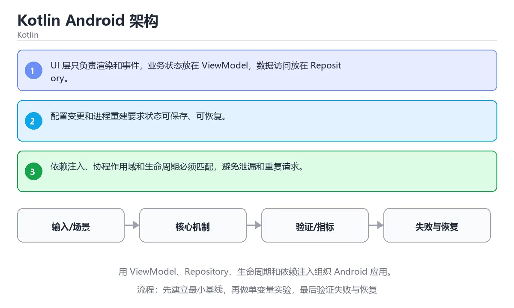

# Kotlin Android 架构



> 内容更新时间：2026-10-03 · 学习阶段：高级 · 预计用时：25 分钟

## 学习目标

- 能用自己的话解释：UI 层只负责渲染和事件，业务状态放在 ViewModel，数据访问放在 Repository。
- 能用自己的话解释：配置变更和进程重建要求状态可保存、可恢复。
- 能用自己的话解释：依赖注入、协程作用域和生命周期必须匹配，避免泄漏和重复请求。
- 能把本课知识放回「Kotlin」，并完成练习与测验。

## 前置知识

- 已完成「Kotlin」的基础课程，能运行正文中的最小示例。
- 本课关键词：Android、ViewModel、Repository、生命周期。
- 遇到不熟悉的术语先记录问题，完成练习后再回读。

## 核心知识

### 1. UI 层只负责渲染和事件，业务状态放在 ViewModel，数据访问放在 Repository。

- 它解决的问题：把「UI 层只负责渲染和事件，业务状态放在 ViewModel，数据访问放在 Repository。」放回真实场景，说明不做它会带来什么后果。
- 关键做法：先用最小示例建立基线，再逐步加入边界、失败和性能条件。
- 验证标准：结果可复现、错误可解释、边界有测试、失败能恢复。

### 2. 配置变更和进程重建要求状态可保存、可恢复。

- 它解决的问题：把「配置变更和进程重建要求状态可保存、可恢复。」放回真实场景，说明不做它会带来什么后果。
- 关键做法：先用最小示例建立基线，再逐步加入边界、失败和性能条件。
- 验证标准：结果可复现、错误可解释、边界有测试、失败能恢复。

### 3. 依赖注入、协程作用域和生命周期必须匹配，避免泄漏和重复请求。

- 它解决的问题：把「依赖注入、协程作用域和生命周期必须匹配，避免泄漏和重复请求。」放回真实场景，说明不做它会带来什么后果。
- 关键做法：先用最小示例建立基线，再逐步加入边界、失败和性能条件。
- 验证标准：结果可复现、错误可解释、边界有测试、失败能恢复。

## 关键流程

```text
输入 → 校验 → 核心处理 → 验证 → 记录指标 → 失败恢复
```

## 实践路径

1. 用一句话复述本课要解决的问题。
2. 跑通正文中的最小示例并记录基线。
3. 只改变一个输入或参数，预测并验证结果。
4. 补一个失败路径，记录错误、恢复和指标。
5. 把结论写成可复现的笔记或测试。

## 常见误区

| 误区 | 后果 | 修正 |
| --- | --- | --- |
| 只记术语不做实验 | 遇到真实问题无法判断 | 用最小输入跑通并记录结果 |
| 只测正常路径 | 边界和故障上线才暴露 | 补空值、极值和依赖失败 |
| 没有基线就优化 | 无法证明改进有效 | 先测量再修改 |
| 忽略成本与安全 | 性能和风险失控 | 同时记录资源、权限与失败代价 |

## 动手练习

1. 合上教程，用 3～5 句话解释「Kotlin Android 架构」。
2. 从正文选一个例子，改变一个条件并预测结果。
3. 设计一个失败场景，写出止损与恢复步骤。

**验收标准**：留下输入、命令、输出、差异和下一步问题。

## 本课小结

- 本课属于「Kotlin」，核心关键词是 Android、ViewModel、Repository、生命周期。
- 先保证正确与可复现，再讨论性能和扩展。
- 完成练习和测验后，把仍然不确定的问题写成下一轮验证清单。

> 本课由 P1 内容扩展生成，重点补充原有课程缺失的主题与工程边界。


## 语言专项实践：Kotlin Android 架构

### 一、工具链

| 阶段 | 推荐工具 | 验收标准 |
| --- | --- | --- |
| 编译构建 | kotlinc / Gradle | 命令可复现且错误能被定位 |
| 测试 | JUnit + coroutines-test | 命令可复现且错误能被定位 |
| 静态检查 | detekt / ktlint | 命令可复现且错误能被定位 |
| 发布 | R8/ProGuard + App Bundle | 命令可复现且错误能被定位 |

### 二、运行时与内存模型

围绕「Android、ViewModel、Repository、生命周期」说明变量生命周期、资源释放、并发模型和错误传播。语言语法只是入口，真正决定行为的是运行时、标准库和平台约束。

### 三、测试策略

- 单元测试覆盖核心规则和边界。
- 集成测试覆盖文件、网络、数据库或平台 API。
- 失败测试覆盖超时、取消、异常和资源耗尽。
- 性能测试记录基线，避免只凭感觉优化。

### 四、发布检查

- [ ] 版本和依赖锁定，构建可复现。
- [ ] 产物经过签名、校验和最小权限配置。
- [ ] 日志不泄露密钥和个人信息。
- [ ] 有升级、回滚和故障恢复说明。


## 考点精讲：把测验题还原成判断过程

本课有 4 个判断点。先自己作答，再看「判断依据」；如果结论正确但理由不完整，回到正文对应章节补足概念。

### 考点 1：关于「UI 层只负责渲染和事件 业务状态放…」，下列说法正确的是？

- **正确判断**：UI 层只负责渲染和事件，业务状态放在 ViewModel，数据访问放在 Repository。
- **判断依据**：学习《Kotlin Android 架构》时应把该要点与「Android」一起理解。正确项「UI 层只负责渲染和事件，业务状态放在 ViewModel，数据访问放在 Repository」既符合定义也满足题干限定的场景，因此应当选择。错误项「默认参数和命名参数能减少重载，扩展函数让外部类型获得新能力但不修改原类」把因果关系颠倒了，不能作为正确结论。错误项「数据类自动生成 equals、hashCode、toString 和 copy，适合承载值语义」忽略了题目中的限制条件，因此不成立。错误项「val 声明只读引用，var 可重新赋值，集合内容是否可变由具体类型决定」把不同概念混在一起，缺少题干限定的前提。把题干「关于「UI 层只负责渲染和事件 业务状态放…」，下列说法正确的是？」放回《Kotlin Android 架构》的「用 ViewModel、Repository、生命周期和依赖注入组织 Android 应用」语境，逐项对照定义与边界条件，就能排除其余说法。
- **迁移检查**：把题干里的一个条件换成边界值，原来的结论还成立吗？写出判断过程。

### 考点 2：关于「配置变更和进程重建要求状态可保存、可…」，下列说法正确的是？

- **正确判断**：配置变更和进程重建要求状态可保存、可恢复。
- **判断依据**：学习《Kotlin Android 架构》时应把该要点与「Android」一起理解。正确项「配置变更和进程重建要求状态可保存、可恢复」完整覆盖了题目要求的关键点，没有遗漏前提。错误项「密封类限制子类型集合，配合 when 可以做穷尽分支检查」在边界或失败路径上会得出错误结果。错误项「可空类型在编译期强制处理，?.、?: 和 let 是常用安全操作」把因果关系颠倒了，不能作为正确结论。错误项「高阶函数接收或返回函数，inline 能减少 Lambda 对象和调用开销」忽略了题目中的限制条件，因此不成立。把题干「关于「配置变更和进程重建要求状态可保存、可…」，下列说法正确的是？」放回《Kotlin Android 架构》的「用 ViewModel、Repository、生命周期和依赖注入组织 Android 应用」语境，逐项对照定义与边界条件，就能排除其余说法。
- **迁移检查**：把题干里的一个条件换成边界值，原来的结论还成立吗？写出判断过程。

### 考点 3：关于「依赖注入、协程作用域和生命周期必须匹…」，下列说法正确的是？

- **正确判断**：依赖注入、协程作用域和生命周期必须匹配，避免泄漏和重复请求。
- **判断依据**：学习《Kotlin Android 架构》时应把该要点与「Android」一起理解。正确项「依赖注入、协程作用域和生命周期必须匹配，避免泄漏和重复请求」描述正确，能够解释题干场景中的现象与结果。错误项「扩展函数是静态解析的，不能在运行时多态覆盖」与课程给出的定义相冲突，不能回答题目所问。错误项「委托把实现交给其他对象，by lazy 和接口委托是常见用法」只看到了表面现象，没有解释题干真正考查的机制。错误项「类型推断减少样板代码，但公开 API 仍应显式写出关键类型」适用于其他场景，但与本题的前提不匹配。把题干「关于「依赖注入、协程作用域和生命周期必须匹…」，下列说法正确的是？」放回《Kotlin Android 架构》的「用 ViewModel、Repository、生命周期和依赖注入组织 Android 应用」语境，逐项对照定义与边界条件，就能排除其余说法。
- **迁移检查**：遮住选项，只根据定义复述一次答案，再回来看哪个选项与复述一致。

### 考点 4：「Kotlin Android 架构」的核心学习目标是什么？

- **正确判断**：用 ViewModel，Repository
- **判断依据**：正确项「用 ViewModel，Repository」是该问题的规范说法，换成其他表述都会丢失条件。错误项「掌握 val/var、类型推断、可空类型和安全调用」适用于其他场景，但与本题的前提不匹配。错误项「理解默认参数、扩展函数、高阶函数和内联」把因果关系颠倒了，不能作为正确结论。错误项「覆盖主构造器、数据类、密封类、伴生对象和委托」忽略了题目中的限制条件，因此不成立。把题干「「Kotlin Android 架构」的核心学习目标是什么？」放回《Kotlin Android 架构》的「用 ViewModel、Repository、生命周期和依赖注入组织 Android 应用」语境，逐项对照定义与边界条件，就能排除其余说法。
- **迁移检查**：如果给某个错误选项去掉一个限定词，它会不会变成正确？说明理由。

## 本课复习清单

离开本课前，逐项确认：

- [ ] 不看解析，能说出「关于「UI 层只负责渲染和事件 业务状态放…」，下列说法正确的是？」的判断依据。
- [ ] 不看解析，能说出「关于「配置变更和进程重建要求状态可保存、可…」，下列说法正确的是？」的判断依据。
- [ ] 不看解析，能说出「关于「依赖注入、协程作用域和生命周期必须匹…」，下列说法正确的是？」的判断依据。
- [ ] 不看解析，能说出「「Kotlin Android 架构」的核心学习目标是什么？」的判断依据。
- [ ] 至少运行一次本课示例，记录输入、输出和一个边界情况。
- [ ] 把本课最容易混淆的两个概念写成一句话对照。

| 复盘项 | 记录 |
| --- | --- |
| 已经能独立解释的考点 |  |
| 仍然说不清的概念 |  |
| 下一步验证动作 |  |

## 逐节复习与自检

下面按正文顺序回顾每一节，并给出一个自检问题；说不清的地方回到原章节补课。

### 核心知识

」放回真实场景，说明不做它会带来什么后果。关键做法：先用最小示例建立基线，再逐步加入边界、失败和性能条件。

自检：这一节与相邻主题的边界在哪里？

### 动手练习

合上教程，用 3～5 句话解释「Kotlin Android 架构」。从正文选一个例子，改变一个条件并预测结果。

自检：如果去掉这一节里的一个前提，结论会怎样变化？

### 语言专项实践：Kotlin Android 架构

围绕「Android、ViewModel、Repository、生命周期」说明变量生命周期、资源释放、并发模型和错误传播。语言语法只是入口，真正决定行为的是运行时、标准库和平台约束。

自检：这一节与相邻主题的边界在哪里？

### 最小可运行示例

```kotlin
data class UiState(val title: String, val loading: Boolean = false)

fun render(state: UiState) = if (state.loading) "loading" else state.title

fun main() {
    println(render(UiState(title = "课程列表")))
}
```

自检：把这一节讲给没学过的人，最需要强调哪一点？

### 预期输出

```text
课程列表
```

自检：这一节与相邻主题的边界在哪里？

### 验证步骤

制造一次错误输入，记录错误信息与修复方式。

自检：如果去掉这一节里的一个前提，结论会怎样变化？

## English Overview

**Title:** Kotlin Android Architecture

**Summary:** Organize Android apps with ViewModel, Repository, lifecycle and DI.

**Category:** Kotlin  
**Level:** 高级  
**Key terms:** Android, ViewModel, Repository, 生命周期

> The full tutorial is written in Chinese. This bilingual overview helps English readers identify the topic, scope and key terms before studying the detailed examples.

## 内容元数据

- 内容版本：v2.0
- 最后更新：2026-10-03
- 学习阶段：高级
- 适用环境：Kotlin 2.x / Android SDK
- 内容来源：内置结构化课程与工程实践整理
- 相关主题：Android、ViewModel、Repository、生命周期
- 质量版本：P0 测验标准 + P1 覆盖扩展 + P2 体验补全


## 最小可运行示例

下面示例用于验证「Kotlin Android 架构」的最小输入、处理和输出。先原样运行，再只修改一个值：

```kotlin
data class UiState(val title: String, val loading: Boolean = false)

fun render(state: UiState) = if (state.loading) "loading" else state.title

fun main() {
    println(render(UiState(title = "课程列表")))
}
```

## 预期输出

```text
课程列表
```

## 验证步骤

1. 记录运行环境、命令和真实输出。
2. 修改一个输入，先写预测再运行。
3. 制造一次错误输入，记录错误信息与修复方式。
4. 把结论写回本课笔记或测试用例。


## 参考资料与复核

- 最后复核：2026-10-04
- 下次复核：2027-04-04
- 复核范围：版本兼容、API 行为、安全建议与工程实践
- 来源性质：官方文档与标准；本课正文为离线教学重组，不复制原文

| 参考资料 | 本课用途 |
| --- | --- |
| [Kotlin 官方文档](https://kotlinlang.org/docs/home.html) | 语言、协程与互操作 |
| [Android Kotlin](https://developer.android.com/kotlin) | Android 工程实践 |

> 本课主题：用 ViewModel、Repository、生命周期和依赖注入组织 Android 应用。

> App 完全离线展示文字链接，不会自动联网；需要延伸阅读时可复制链接到浏览器。

