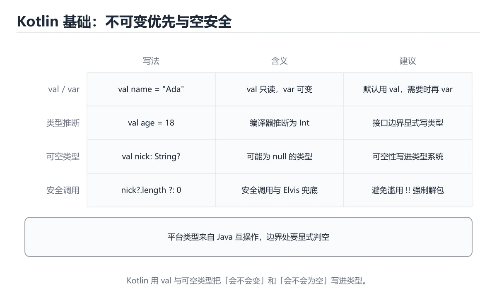
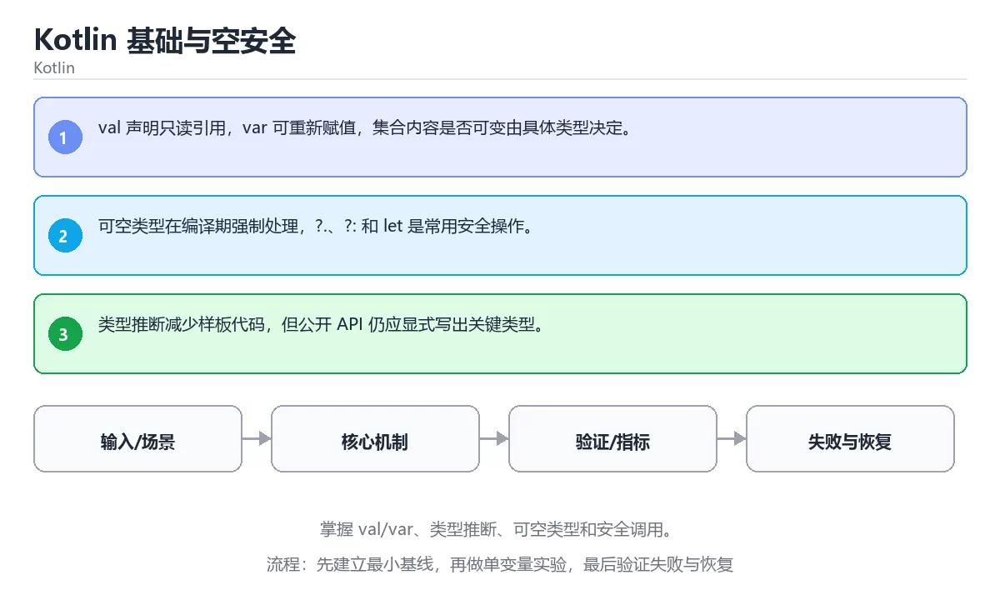

# Kotlin 基础与空安全





> 内容更新时间：2026-10-06 · 学习阶段：基础 · 预计用时：35 分钟

## 本节知识框架

**课程定位**：所属分类 `kotlin`（Kotlin），课程主题 `Kotlin 基础与空安全`，学习阶段 基础，建议用时 50 分钟。

本课主线：掌握 val/var、类型推断、可空类型和安全调用。

**学完本课应当能够**
- 说清 `Kotlin` 与 `空安全` 的含义与区别，并各举一个正例和一个反例。
- 用本课示例验证 `val` 的行为，记录输入、输出与失败条件。
- 遇到「用非空断言处理可空类型」这类问题时，能说出触发条件与修复顺序。

### 从概念到验证的学习链条

1. `Kotlin`：先掌握 运行于 JVM 等平台、强调空安全与简洁语法的现代编程语言，再用它解释 `空安全` 为什么会出现。
2. `空安全`：先掌握 类型系统区分可空与非空值，并在编译期要求显式处理空值，再用它解释 `val` 为什么会出现。
3. `val`：先掌握 Kotlin 中声明只读引用的关键字，引用一旦赋值不能再指向其他对象，再用它解释 `类型推断` 为什么会出现。
4. `类型推断`：先掌握 编译器根据初始值推断变量类型（val x = 1 即 Int），显式标注只在需要澄清时使用，再用它解释 本课示例的观察结果 为什么会出现。

**先修与衔接**：本课是「Kotlin」分类的第 6 课。相关或后续课程：《Kotlin 函数、Lambda 与扩展》。

### 完成判据

- **定义关**：不看正文也能说明 `Kotlin` 是 运行于 JVM 等平台、强调空安全与简洁语法的现代编程语言，并指出一个反例。
- **机制关**：能按“输入 → 转换 → 输出 → 验证”复述 `Kotlin 基础与空安全`，而不是只背结论。
- **示例关**：能运行或推演 `Kotlin 基础与空安全` 的 `text` 示例，并说明一个真实出现的标识符或字面量。
- **证据关**：能指出 `Kotlin 基础与空安全` 示例里的 调用了 `main()`，并说明它支持或反驳了本课的哪一条结论。
- **排错关**：能复现 用非空断言处理可空类型，记录现象并按 用安全调用与默认值替代断言 修复。
- **迁移关**：能把 `Kotlin`、`空安全`、`val`、`类型推断` 放进一个与 `Kotlin 基础与空安全` 不同的项目场景，并保持输入与验证条件可追踪。
- **复盘关**：学完 `Kotlin 基础与空安全` 后，用一句话写下仍然不确定的结论，并列出下一次验证需要的输入、环境和成功判据。

### 复习清单

- [ ] 能不看正文复述本课核心术语，并指出一个边界或反例。
- [ ] 能运行或推演本课示例，记录输入、输出与失败现象。
- [ ] 能完成一次自测，并把错题对照错误表定位原因。

## 核心概念定义

| 术语 | 操作性定义 | 常见边界与风险 |
| --- | --- | --- |
| Kotlin | 运行于 JVM 等平台、强调空安全与简洁语法的现代编程语言。 | 权限与密钥策略变化会让结论失效，按最小权限并用真实凭据流程复验。 |
| 空安全 | 类型系统区分可空与非空值，并在编译期要求显式处理空值。 | 静态检查只在编译期成立，运行期输入仍需校验。 |
| val | Kotlin 中声明只读引用的关键字，引用一旦赋值不能再指向其他对象。 | 越界、悬垂引用与释放顺序会破坏结论，必须在边界输入下复验。 |
| 类型推断 | 编译器根据初始值推断变量类型（val x = 1 即 Int），显式标注只在需要澄清时使用。 | 静态检查只在编译期成立，运行期输入仍需校验。 |

## 原理与运行机制

### 机制总览

**教材衔接：核心知识**

### 1. val 声明只读引用，var 可重新赋值，集合内容是否可变由具体类型决定。

- 关键做法：先让 Kotlin 的最小示例可复现，再加入并发或规模条件。
- 验证标准：main 的输出能被他人复现，边界输入有对应用例。

### 2. 可空类型在编译期强制处理，?.、?: 和 let 是常用安全操作。

把这条结论放回「Kotlin 基础与空安全」的完整流程里展开：

- 正文依据：能用自己的话解释：val 声明只读引用，var 可重新赋值，集合内容是否可变由具体类型决定。
- 落地检查：把「2. 可空类型在编译期强制处理，?.、?: 和 let 是常用安全操作。」改写成一条可执行的核对项，逐条验证输入、超时与失败路径。

### 3. 类型推断减少样板代码，但公开 API 仍应显式写出关键类型。

把这条结论放回「Kotlin 基础与空安全」的完整流程里展开：

- 正文依据：能用自己的话解释：类型推断减少样板代码，但公开 API 仍应显式写出关键类型。
- 落地检查：把「3. 类型推断减少样板代码，但公开 API 仍应显式写出关键类型。」改写成一条可执行的核对项，逐条验证输入、超时与失败路径。

**教材衔接：关键流程**

**教材衔接：实践路径**

**教材衔接：语言专项实践：Kotlin 基础与空安全**

### 一、工具链

| 阶段 | 推荐工具 | 验收标准 |
| --- | --- | --- |
| 编译构建 | kotlinc / Gradle | 命令可复现且错误能被定位 |
| 测试 | JUnit + coroutines-test | 命令可复现且错误能被定位 |
| 静态检查 | detekt / ktlint | 命令可复现且错误能被定位 |
| 发布 | R8/ProGuard + App Bundle | 命令可复现且错误能被定位 |


### 四、发布检查

**教材衔接：版本与时效**

- 版本提示：Kotlin 的行为在最近几个大版本里有过调整，升级「Kotlin 基础与空安全」前先用 main 复现当前输出，再对照官方发布说明逐条核对。
- 升级前确认 Kotlin 的兼容范围，把不可回退的改动单独拆成一次提交。
- 显式 API 模式与多平台源集是团队协作时的重点
- 官方说明：https://kotlinlang.org/docs/releases.html

### 升级检查清单

- 先固定当前版本，跑通全部示例与测验，再升级工具链。
- 升级时只动一个依赖版本，用 main 记录构建与运行结果。
- 回归范围锁定 main 的默认行为，并确认弃用警告是否出现在构建输出里。
- 升级后把 main 的实测版本写进「内容元数据」，再更新复核日期。

**教材衔接：验证步骤**

### 机制拆解：每一步的输入、动作与输出

#### 1. `Kotlin`
- 输入：`Kotlin`；本步把 运行于 JVM 等平台、强调空安全与简洁语法的现代编程语言 当作判断规则。
- 动作：围绕 `Kotlin` 保留中间状态，并记录它与 `空安全` 的对应关系。
- 输出：`空安全`，它可以被下一段代码、测试或记录继续使用。
- `Kotlin` 的失败条件：权限与密钥策略变化会让结论失效，按最小权限并用真实凭据流程复验。

#### 2. `空安全`
- 输入：`Kotlin`；本步把 类型系统区分可空与非空值，并在编译期要求显式处理空值 当作判断规则。
- 动作：围绕 `空安全` 保留中间状态，并记录它与 `val` 的对应关系。
- 输出：`val`，它可以被下一段代码、测试或记录继续使用。
- `空安全` 的失败条件：静态检查只在编译期成立，运行期输入仍需校验。

#### 3. `val`
- 输入：`空安全`；本步把 Kotlin 中声明只读引用的关键字，引用一旦赋值不能再指向其他对象 当作判断规则。
- 动作：围绕 `val` 保留中间状态，并记录它与 `类型推断` 的对应关系。
- 输出：`类型推断`，它可以被下一段代码、测试或记录继续使用。
- `val` 的失败条件：越界、悬垂引用与释放顺序会破坏结论，必须在边界输入下复验。

#### 4. `类型推断`
- 输入：`val`；本步把 编译器根据初始值推断变量类型（val x = 1 即 Int），显式标注只在需要澄清时使用 当作判断规则。
- 动作：围绕 `类型推断` 保留中间状态，并记录它与 `main` 的对应关系。
- 输出：`main`，它可以被下一段代码、测试或记录继续使用。
- `类型推断` 的失败条件：静态检查只在编译期成立，运行期输入仍需校验。

### 示例中的可观察事实

1. 调用了 `main()`；它对应的课程主题是 `Kotlin 基础与空安全`。
2. 调用了 `println()`；它对应的课程主题是 `Kotlin 基础与空安全`。
3. 出现字面量 `Ada`；它对应的课程主题是 `Kotlin 基础与空安全`。
4. 出现字面量 `$name born in $year`；它对应的课程主题是 `Kotlin 基础与空安全`。

### 复现实验记录

- 环境：`Kotlin 基础与空安全` 使用 `text` 示例，固定 `Kotlin`、`空安全`、`val`、`类型推断` 作为第一组条件。
- 首轮输入：先确认 调用了 `main()`，预测 `Kotlin` 会怎样变化。
- 基线观察：记录命令、输入、输出和错误原文，不用截图代替可复制的文本。
- 单变量修改：只改变 `Kotlin`，观察 `类型推断` 是否仍满足定义。
- 失败注入：复现 用非空断言处理可空类型，确认现象是 运行期空指针异常。
- 记录结论：把“修改前、修改后、预期变化、实际变化”写成四列表，这样复盘 `Kotlin 基础与空安全` 时才能区分概念错误与实现错误。

## 典型应用场景

**课程内置实验入口**：`sandbox:kotlin`，用于动手验证《Kotlin 基础与空安全》的机制；实验结论不替代概念定义与复杂度分析。

- **用非空断言处理可空类型**：典型现象是运行期空指针异常；正确做法是用安全调用与默认值替代断言。
- **可变与不可变声明混用**：典型现象是对象被意外修改；正确做法是默认使用不可变声明，只在需要时开放可变。
- **依赖平台类型的可空性**：典型现象是编译期不报错，运行期崩溃；正确做法是在边界处显式声明可空性。

### 最小验证场景

- 准备：保留 `text` 示例的原始输入，先记录 `Kotlin 基础与空安全` 的基线输出和完整运行命令。
- 观察：先核对 调用了 `main()`，再改变一个与 `Kotlin` 相关的条件。
- 判定：新结果与 `Kotlin 基础与空安全` 的基线不同不等于错误；只有当差异破坏了 `Kotlin` 的定义或错误表中的约束，才判定为失败。

### 选择与边界

- 使用 `Kotlin` 时，先满足它的定义：运行于 JVM 等平台、强调空安全与简洁语法的现代编程语言；权限与密钥策略变化会让结论失效，按最小权限并用真实凭据流程复验。
- 使用 `空安全` 时，先满足它的定义：类型系统区分可空与非空值，并在编译期要求显式处理空值；静态检查只在编译期成立，运行期输入仍需校验。
- 使用 `val` 时，先满足它的定义：Kotlin 中声明只读引用的关键字，引用一旦赋值不能再指向其他对象；越界、悬垂引用与释放顺序会破坏结论，必须在边界输入下复验。
- 使用 `类型推断` 时，先满足它的定义：编译器根据初始值推断变量类型（val x = 1 即 Int），显式标注只在需要澄清时使用；静态检查只在编译期成立，运行期输入仍需校验。

## 代码/协议/SQL 示例

### 最小可验证示例

**教材衔接：最小可运行示例**

先用 main 跑通最小示例，然后只改一个与 Kotlin 相关的取值：

```kotlin
fun main() {
    val name = "Ada"
    val year = 1815
    println("$name born in $year")
}
```

**教材衔接：预期输出**

```text
Ada born in 1815
```

### 示例精读：先找证据，再改一个条件

1. 调用了 `main()`；它出现在 `Kotlin 基础与空安全` 的示例中，阅读时先确认它前后各发生了什么。
2. 调用了 `println()`；它出现在 `Kotlin 基础与空安全` 的示例中，阅读时先确认它前后各发生了什么。
3. 出现字面量 `Ada`；它出现在 `Kotlin 基础与空安全` 的示例中，阅读时先确认它前后各发生了什么。
4. 出现字面量 `$name born in $year`；它出现在 `Kotlin 基础与空安全` 的示例中，阅读时先确认它前后各发生了什么。
- 在 `Kotlin 基础与空安全` 中与 `Kotlin` 对照：示例必须能支持 运行于 JVM 等平台、强调空安全与简洁语法的现代编程语言，否则说明这一段还缺少实现或验证步骤。
- 在 `Kotlin 基础与空安全` 中与 `空安全` 对照：示例必须能支持 类型系统区分可空与非空值，并在编译期要求显式处理空值，否则说明这一段还缺少实现或验证步骤。
- 在 `Kotlin 基础与空安全` 中与 `val` 对照：示例必须能支持 Kotlin 中声明只读引用的关键字，引用一旦赋值不能再指向其他对象，否则说明这一段还缺少实现或验证步骤。
- 在 `Kotlin 基础与空安全` 中与 `类型推断` 对照：示例必须能支持 编译器根据初始值推断变量类型（val x = 1 即 Int），显式标注只在需要澄清时使用，否则说明这一段还缺少实现或验证步骤。

## 时间/空间复杂度或性能分析

**性能关注点（Kotlin 基础与空安全）**：JVM 与协程调度影响开销：记录吞吐、延迟与调度器线程占用。

**测量方法**：以 `Kotlin 基础与空安全` 的 `Kotlin` 场景为对象，固定输入跑一遍记录基线，再把规模或并发度提高一个数量级复测；两次结果的差值与波动范围才是结论依据。

### 需要控制的变量与记录项

- `Kotlin 基础与空安全` 的 `Kotlin`：固定它的版本、输入范围和资源上限，分别记录速度、内存与失败率的变化。
- `Kotlin 基础与空安全` 的 `空安全`：固定它的版本、输入范围和资源上限，分别记录速度、内存与失败率的变化。
- `Kotlin 基础与空安全` 的 `val`：固定它的版本、输入范围和资源上限，分别记录速度、内存与失败率的变化。
- `Kotlin 基础与空安全` 的 `类型推断`：固定它的版本、输入范围和资源上限，分别记录速度、内存与失败率的变化。
- `Kotlin 基础与空安全` 中 `Kotlin` 的边界：权限与密钥策略变化会让结论失效，按最小权限并用真实凭据流程复验。达到边界时不要外推，必须重新测量。
- `Kotlin 基础与空安全` 中 `空安全` 的边界：静态检查只在编译期成立，运行期输入仍需校验。达到边界时不要外推，必须重新测量。
- `Kotlin 基础与空安全` 中 `val` 的边界：越界、悬垂引用与释放顺序会破坏结论，必须在边界输入下复验。达到边界时不要外推，必须重新测量。
- `Kotlin 基础与空安全` 中 `类型推断` 的边界：静态检查只在编译期成立，运行期输入仍需校验。达到边界时不要外推，必须重新测量。
- `Kotlin 基础与空安全` 的代码证据：先验证 调用了 `main()`，再记录该路径的输入规模与耗时；只看代码行数不能推出复杂度。

## 常见误区与易错点

| 容易写错的做法 | 实际现象 | 原因与正确做法 |
| --- | --- | --- |
| 用非空断言处理可空类型 | 运行期空指针异常。 | 用安全调用与默认值替代断言。 |
| 可变与不可变声明混用 | 对象被意外修改。 | 默认使用不可变声明，只在需要时开放可变。 |
| 依赖平台类型的可空性 | 编译期不报错，运行期崩溃。 | 在边界处显式声明可空性。 |

### 现场 1：用非空断言处理可空类型

**症状**：运行期空指针异常。

**根因与修复**：用安全调用与默认值替代断言。

**自检**：在本课示例里复现「用非空断言处理可空类型」，改成用安全调用与默认值替代断言后重跑；如果症状消失且失败路径按预期变化，说明定位正确。

### 现场 2：可变与不可变声明混用

**症状**：对象被意外修改。

**根因与修复**：默认使用不可变声明，只在需要时开放可变。

**自检**：在本课示例里复现「可变与不可变声明混用」，改成默认使用不可变声明，只在需要时开放可变后重跑；如果症状消失且失败路径按预期变化，说明定位正确。

### 现场 3：依赖平台类型的可空性

**症状**：编译期不报错，运行期崩溃。

**根因与修复**：在边界处显式声明可空性。

**自检**：在本课示例里复现「依赖平台类型的可空性」，改成在边界处显式声明可空性后重跑；如果症状消失且失败路径按预期变化，说明定位正确。

## 与其他知识点的关系

**教材衔接：复习与迁移**

### 概念复述

- 用一句话说明「Kotlin 基础与空安全」解决什么问题：掌握 val/var、类型推断、可空类型和安全调用。
- 写出Kotlin、空安全、val之间的关系，并各举一个例子。
- 说出本课最容易混淆的两个概念，以及区分它们的判据。

### 正文逐节复核

- **语言专项实践：Kotlin 基础与空安全**：围绕「Kotlin、空安全、val、类型推断」说明变量生命周期、资源释放、并发模型和错误传播。
- **实践任务**：本节围绕Kotlin 基础与空安全安排 3 个可交付任务，每个任务都要求留下可以复查的记录。


### 迁移练习

- **相关或后续**：`Kotlin 函数、Lambda 与扩展`。本课术语会在这些课程里继续使用。
- **术语归属**：`Kotlin`、`空安全`、`val` 的定义以本课「核心概念定义」为准，换到其他课程时先确认定义是否被改写。
- 同一分类的《Kotlin 第一个程序》也涉及 `Kotlin`；两课衔接时先确认这个术语的定义是否一致。
- 同一分类的《Kotlin 变量与空值》也涉及 `Kotlin`；两课衔接时先确认这个术语的定义是否一致。

### 先修与后续术语接口

- `Kotlin 函数、Lambda 与扩展`：两者通过本分类的学习顺序衔接，阅读时重点比较各自的输入与失败条件。

### 容易混淆的相邻概念

- `Kotlin` 与 `空安全`：前者强调 运行于 JVM 等平台、强调空安全与简洁语法的现代编程语言；后者强调 类型系统区分可空与非空值，并在编译期要求显式处理空值。判断时分别检查两条定义的适用范围，不要只看名称相似就互换。
- `空安全` 与 `val`：前者强调 类型系统区分可空与非空值，并在编译期要求显式处理空值；后者强调 Kotlin 中声明只读引用的关键字，引用一旦赋值不能再指向其他对象。判断时分别检查两条定义的适用范围，不要只看名称相似就互换。
- `val` 与 `类型推断`：前者强调 Kotlin 中声明只读引用的关键字，引用一旦赋值不能再指向其他对象；后者强调 编译器根据初始值推断变量类型（val x = 1 即 Int），显式标注只在需要澄清时使用。判断时分别检查两条定义的适用范围，不要只看名称相似就互换。

## 自测题与参考答案

> 先独立作答，再对照参考答案；答案都能在本课正文、术语表或错误表里找到依据。

### 自测 1（概念复述）

不看正文，写出 `Kotlin` 的操作性定义，并说明它与 `空安全` 的区别。

**参考答案**：运行于 JVM 等平台、强调空安全与简洁语法的现代编程语言。

`空安全` 的定位是：类型系统区分可空与非空值，并在编译期要求显式处理空值；两者的差别要从适用对象与失败模式上说明。

### 自测 2（排错）

本课错误表记录了「用非空断言处理可空类型」这类做法。请写出它会出现的现象、根因，以及修复顺序。

**参考答案**：现象是运行期空指针异常；正确做法是用安全调用与默认值替代断言。修复时先复现现象并保留证据，再改动一处假设重跑，确认现象消失。

### 自测 3（动手验证）

运行本课的 `text` 示例，改动其中一个输入后重新运行，记录输出与错误信息。

**参考答案**：正常输入下 `text` 示例应当复现正文给出的结果；改动输入后，如果结果改变或报错，先核对它是否满足 `Kotlin 基础与空安全` 中`Kotlin` 的适用范围，再检查错误表里是否有同类现象。

### 自测 4（代码阅读）

阅读本课开头的 `text` 示例，说明它体现了`Kotlin` 的哪一条性质，并指出改动哪个输入会让这条性质不再成立。

**参考答案**：`Kotlin` 的定义是 运行于 JVM 等平台、强调空安全与简洁语法的现代编程语言，示例正是在实现这条定义。改动与 `Kotlin` 有关的一个输入后，如果结果不再符合 `Kotlin 基础与空安全` 的正文描述，就说明该性质只在当前前提成立。

### 自测 5（迁移）

把 `Kotlin 基础与空安全` 的方法迁移到自己的项目：围绕 `Kotlin` 写出一个与错误表同类的风险点，并说明触发条件和检验方式。

**参考答案**：例如「依赖平台类型的可空性」，它会导致编译期不报错，运行期崩溃；检验方式是按在边界处显式声明可空性改一处再复现，确认现象消失且没有引入新的失败分支。

### 自测 6（对比）

用一个表格对比 `Kotlin` 与 `空安全`：各写一行适用场景、一行失败表现。

**参考答案**：`Kotlin` 的定义是运行于 JVM 等平台、强调空安全与简洁语法的现代编程语言；`空安全` 的定义是类型系统区分可空与非空值，并在编译期要求显式处理空值。两者的失败表现分别对应本课错误表里与本术语相关的行。

### 自测 7（排错顺序）

面对「用非空断言处理可空类型」引发的问题，请把“复现 运行期空指针异常 → 保留证据 → 用安全调用与默认值替代断言 → 回归验证”四步写成可执行的检查清单。

**参考答案**：第一步按运行期空指针异常复现；第二步记录输入、版本与完整报错；第三步按用安全调用与默认值替代断言只改一处；第四步重跑并确认失败路径也按预期变化。

### 自测 8（边界判断）

针对 `类型推断`，分别写出“可以使用”的条件和“结论不再成立”的条件。

**参考答案**：静态检查只在编译期成立，运行期输入仍需校验。 同时要把 `类型推断` 的定义 编译器根据初始值推断变量类型（val x = 1 即 Int），显式标注只在需要澄清时使用 与实际输入逐项对照。

### 自测 9（机制重建）

不看正文，按输入、转换、输出、验证四段重建 `Kotlin` → `空安全` → `val` → `类型推断` 的作用链。

**参考答案**：起点是 `Kotlin` 的定义 运行于 JVM 等平台、强调空安全与简洁语法的现代编程语言；中间每一步都保留可观察状态；终点由 `类型推断` 检查，失败时回到错误表定位第一个偏离定义的步骤。

### 自测 10（综合排错）

在 `Kotlin 基础与空安全` 中，现象是 编译期不报错，运行期崩溃。请围绕 依赖平台类型的可空性 写出最小复现、关键证据、修复动作和回归验证，并说明为什么不能只凭一次运行下结论。

**参考答案**：先复现 依赖平台类型的可空性，记录输入与完整错误；再按 在边界处显式声明可空性 只改一处。回归时同时跑正常路径和边界路径，只有两次结果都可解释，才把修复视为完成。

### 自测 11（一分钟复述）

用每分钟约 200 字的速度复述 `Kotlin 基础与空安全`：先给主问题，再按顺序说出 `Kotlin`、`空安全`、`val`、`类型推断`，最后给一个失败案例。

**自评标准**：主问题必须对应 掌握 val/var、类型推断、可空类型和安全调用；每个术语都要能接上一句定义或边界；失败案例必须写成可观察现象，不能用“可能有风险”代替证据。

## 术语速查

| 术语 | 一句话说明 |
| --- | --- |
| `Kotlin` | 运行于 JVM 等平台、强调空安全与简洁语法的现代编程语言。 |
| `空安全` | 类型系统区分可空与非空值，并在编译期要求显式处理空值。 |
| `val` | Kotlin 中声明只读引用的关键字，引用一旦赋值不能再指向其他对象。 |
| `类型推断` | 编译器根据初始值推断变量类型（val x = 1 即 Int），显式标注只在需要澄清时使用。 |

**术语关系**：`Kotlin`（运行于 JVM 等平台、强调空安全与简洁语法的现代编程语言） → `空安全`（类型系统区分可空与非空值） → `val`（Kotlin 中声明只读引用的关键字） → `类型推断`（编译器根据初始值推断变量类型（val x = 1 即 Int））。

## 考点精讲

`Kotlin 基础与空安全` 的题库有 6 道题，下面逐题给出题干、正确项与判断依据：先自己作答，再核对正确项，最后回到正文对应小节复核。

### 考点 1：第 1 题

- **题目**：代码语言为 `kotlin`，选自 `Kotlin 基础与空安全` 的 `Kotlin` 部分。课程问题为掌握 val/var、类型推断、可空类型和安全调用。哪一项描述与代码一致？
- **正确项**：出现字面量 `$name born in $year`
- **判断依据**：这道题落在术语 `Kotlin` 上：运行于 JVM 等平台、强调空安全与简洁语法的现代编程语言。复习时把 `Kotlin` 的定义、适用边界和一个反例一起说清楚，再回到「核心概念定义」核对原文。

### 考点 2：第 2 题

- **题目**：在 `Kotlin 基础与空安全` 里，与 `Kotlin` 有关的说法中，哪一项最符合掌握 val/var、类型推断、可空类型和安全调用。？
- **正确项**：可空类型在编译期强制处理，?.、?: 和 let 是常用安全操作。
- **判断依据**：这道题落在术语 `Kotlin` 上：运行于 JVM 等平台、强调空安全与简洁语法的现代编程语言。复习时把 `Kotlin` 的定义、适用边界和一个反例一起说清楚，再回到「核心概念定义」核对原文。

### 考点 3：第 3 题

- **题目**：在 `Kotlin 基础与空安全` 里，与 `Kotlin` 有关的说法中，哪一项最符合掌握 val/var、类型推断、可空类型和安全调用。？（Kotlin 基础与空安全·Kotlin 第 3 题）
- **正确项**：类型推断减少样板代码，但公开 API 仍应显式写出关键类型。
- **判断依据**：这道题落在术语 `Kotlin` 上：运行于 JVM 等平台、强调空安全与简洁语法的现代编程语言。复习时把 `Kotlin` 的定义、适用边界和一个反例一起说清楚，再回到「核心概念定义」核对原文。

### 考点 4：第 4 题

- **题目**：`Kotlin 基础与空安全` 的主线是：掌握 val/var、类型推断、可空类型和安全调用。下面哪一项与这条主线一致？
- **正确项**：掌握 val/var、类型推断、可空类型和安全调用。
- **判断依据**：这道题落在术语 `Kotlin` 上：运行于 JVM 等平台、强调空安全与简洁语法的现代编程语言。复习时把 `Kotlin` 的定义、适用边界和一个反例一起说清楚，再回到「核心概念定义」核对原文。

### 考点 5：第 5 题

- **题目**：课程 `掌握 val/var、类型推断、可空类型和安全调用。`。在 `Kotlin 基础与空安全` 里，`Kotlin`、`空安全` 与下面哪些选项属于同一层概念？（多选）
- **正确项**：Kotlin；空安全
- **判断依据**：这道题落在术语 `Kotlin` 上：运行于 JVM 等平台、强调空安全与简洁语法的现代编程语言。复习时把 `Kotlin` 的定义、适用边界和一个反例一起说清楚，再回到「核心概念定义」核对原文。

### 考点 6：第 6 题

- **题目**：下面几项都与 `Kotlin` 有关，请按 `Kotlin 基础与空安全` 的正文顺序排列；该课主线是掌握 val/var、类型推断、可空类型和安全调用。
- **正确项**：核心知识 → 关键流程 → 实践路径 → 常见误区
- **判断依据**：这道题落在术语 `Kotlin` 上：运行于 JVM 等平台、强调空安全与简洁语法的现代编程语言。复习时把 `Kotlin` 的定义、适用边界和一个反例一起说清楚，再回到「核心概念定义」核对原文。

### 考点 7：`Kotlin`

- **要点**：运行于 JVM 等平台、强调空安全与简洁语法的现代编程语言。
- **Kotlin 的边界**：权限与密钥策略变化会让结论失效，按最小权限并用真实凭据流程复验。

### 考点 8：`空安全`

- **要点**：类型系统区分可空与非空值，并在编译期要求显式处理空值。
- **空安全 的边界**：静态检查只在编译期成立，运行期输入仍需校验。

### 考点 9：`val`

- **要点**：Kotlin 中声明只读引用的关键字，引用一旦赋值不能再指向其他对象。
- **val 的边界**：越界、悬垂引用与释放顺序会破坏结论，必须在边界输入下复验。

### 考点 10：`类型推断`

- **要点**：编译器根据初始值推断变量类型（val x = 1 即 Int），显式标注只在需要澄清时使用。
- **类型推断 的边界**：静态检查只在编译期成立，运行期输入仍需校验。

### 考点 11：排错——用非空断言处理可空类型

- **现象**：运行期空指针异常。
- **处理**：用安全调用与默认值替代断言。

### 考点 12：排错——可变与不可变声明混用

- **现象**：对象被意外修改。
- **处理**：默认使用不可变声明，只在需要时开放可变。

### 考点 13：综合辨析——`Kotlin` 与 `类型推断`

- **辨析点**：`Kotlin` 的定义是 运行于 JVM 等平台、强调空安全与简洁语法的现代编程语言；`类型推断` 的定义是 编译器根据初始值推断变量类型（val x = 1 即 Int），显式标注只在需要澄清时使用。
- **答题要求**：面对 `Kotlin 基础与空安全` 的题目，先判断描述的是 `Kotlin` 还是 `类型推断`，再归到对应定义，最后写出一个会让该定义失效的边界输入。

### 考点 14：排错评分点

- **现象分**：能写出 运行期空指针异常，而不是只写“程序有错”。
- **证据分**：保留触发 用非空断言处理可空类型 的输入、版本和错误原文。
- **修复分**：按 用安全调用与默认值替代断言 只改一处，并同时回归正常路径与边界路径。

## 内容元数据

- 内容版本：v2.0
- 最后更新：2026-10-06
- 学习阶段：基础
- 适用环境：Kotlin 2.x / Android SDK；本课聚焦 Kotlin。
- 内容来源：内置结构化课程与工程实践整理
- 相关主题：Kotlin、空安全、val、类型推断
- 质量版本：P0 测验标准 + P1 覆盖扩展 + P2 体验补全

## 参考资料与复核

- 最后复核：2026-10-04
- 下次复核：2026-11-10
- 复核范围：版本兼容、API 行为、安全建议与工程实践
- 来源性质：官方文档、标准或权威教材；本课核对关键词：Kotlin、空安全、val、类型推断。

| 参考资料 | 本课用途 |
| --- | --- |
| [Kotlin 基础语法](https://kotlinlang.org/docs/basic-syntax.html) | 语法、类型与函数 |
| [Android Kotlin](https://developer.android.com/kotlin) | Android 官方 Kotlin 实践 |
| [Android 架构指南](https://developer.android.com/topic/architecture) | 分层、状态与生命周期 |

| [本课术语索引：Kotlin 基础与空安全](#核心概念定义) | 按本课输入、术语边界和错误表现逐项核对 |
> 「Kotlin 基础与空安全」的链接用于离线阅读后的延伸核对；App 不会自动联网。