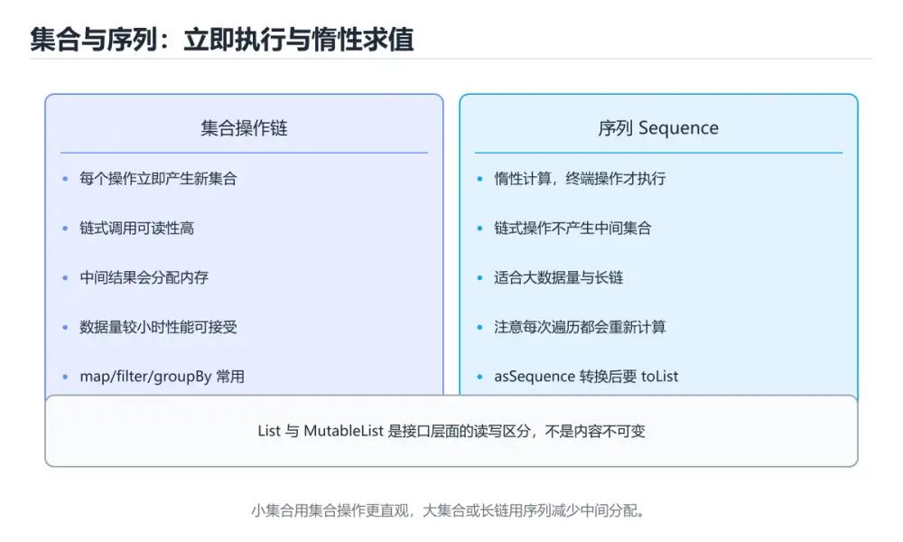
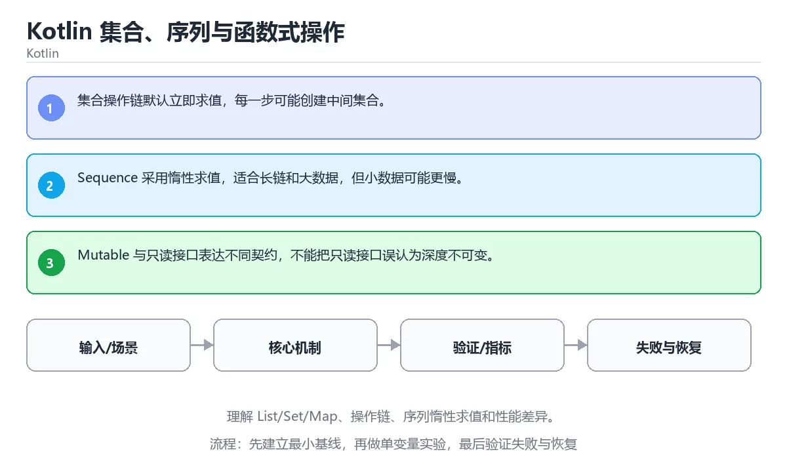

# Kotlin 集合、序列与函数式操作





> 内容更新时间：2026-10-03 · 学习阶段：进阶 · 预计用时：22 分钟

## 学习目标

- 能用自己的话解释：集合操作链默认立即求值，每一步可能创建中间集合。
- 能用自己的话解释：Sequence 采用惰性求值，适合长链和大数据，但小数据可能更慢。
- 能用自己的话解释：Mutable 与只读接口表达不同契约，不能把只读接口误认为深度不可变。
- 能把本课知识放回「Kotlin」，并完成练习与测验。

## 前置知识

- 已完成「Kotlin」的基础课程，能运行正文中的最小示例。
- 本课关键词：集合、Sequence、map、惰性求值。
- 遇到不熟悉的术语先记录问题，完成练习后再回读。

## 核心知识

### 1. 集合操作链默认立即求值，每一步可能创建中间集合。

- 它解决的问题：把「集合操作链默认立即求值，每一步可能创建中间集合。」放回真实场景，说明不做它会带来什么后果。
- 关键做法：先用最小示例建立基线，再逐步加入边界、失败和性能条件。
- 验证标准：结果可复现、错误可解释、边界有测试、失败能恢复。

### 2. Sequence 采用惰性求值，适合长链和大数据，但小数据可能更慢。

- 它解决的问题：把「Sequence 采用惰性求值，适合长链和大数据，但小数据可能更慢。」放回真实场景，说明不做它会带来什么后果。
- 关键做法：先用最小示例建立基线，再逐步加入边界、失败和性能条件。
- 验证标准：结果可复现、错误可解释、边界有测试、失败能恢复。

### 3. Mutable 与只读接口表达不同契约，不能把只读接口误认为深度不可变。

- 它解决的问题：把「Mutable 与只读接口表达不同契约，不能把只读接口误认为深度不可变。」放回真实场景，说明不做它会带来什么后果。
- 关键做法：先用最小示例建立基线，再逐步加入边界、失败和性能条件。
- 验证标准：结果可复现、错误可解释、边界有测试、失败能恢复。

## 关键流程

```text
输入 → 校验 → 核心处理 → 验证 → 记录指标 → 失败恢复
```

## 实践路径

1. 用一句话复述本课要解决的问题。
2. 跑通正文中的最小示例并记录基线。
3. 只改变一个输入或参数，预测并验证结果。
4. 补一个失败路径，记录错误、恢复和指标。
5. 把结论写成可复现的笔记或测试。

## 常见误区

| 误区 | 后果 | 修正 |
| --- | --- | --- |
| 只记术语不做实验 | 遇到真实问题无法判断 | 用最小输入跑通并记录结果 |
| 只测正常路径 | 边界和故障上线才暴露 | 补空值、极值和依赖失败 |
| 没有基线就优化 | 无法证明改进有效 | 先测量再修改 |
| 忽略成本与安全 | 性能和风险失控 | 同时记录资源、权限与失败代价 |

## 动手练习

1. 合上教程，用 3～5 句话解释「Kotlin 集合、序列与函数式操作」。
2. 从正文选一个例子，改变一个条件并预测结果。
3. 设计一个失败场景，写出止损与恢复步骤。

**验收标准**：留下输入、命令、输出、差异和下一步问题。

## 本课小结

- 本课属于「Kotlin」，核心关键词是 集合、Sequence、map、惰性求值。
- 先保证正确与可复现，再讨论性能和扩展。
- 完成练习和测验后，把仍然不确定的问题写成下一轮验证清单。

> 本课由 P1 内容扩展生成，重点补充原有课程缺失的主题与工程边界。


## 语言专项实践：Kotlin 集合、序列与函数式操作

### 一、工具链

| 阶段 | 推荐工具 | 验收标准 |
| --- | --- | --- |
| 编译构建 | kotlinc / Gradle | 命令可复现且错误能被定位 |
| 测试 | JUnit + coroutines-test | 命令可复现且错误能被定位 |
| 静态检查 | detekt / ktlint | 命令可复现且错误能被定位 |
| 发布 | R8/ProGuard + App Bundle | 命令可复现且错误能被定位 |

### 二、运行时与内存模型

围绕「集合、Sequence、map、惰性求值」说明变量生命周期、资源释放、并发模型和错误传播。语言语法只是入口，真正决定行为的是运行时、标准库和平台约束。

### 三、测试策略

- 单元测试覆盖核心规则和边界。
- 集成测试覆盖文件、网络、数据库或平台 API。
- 失败测试覆盖超时、取消、异常和资源耗尽。
- 性能测试记录基线，避免只凭感觉优化。

### 四、发布检查

- [ ] 版本和依赖锁定，构建可复现。
- [ ] 产物经过签名、校验和最小权限配置。
- [ ] 日志不泄露密钥和个人信息。
- [ ] 有升级、回滚和故障恢复说明。


## 考点精讲：把测验题还原成判断过程

本课有 5 个判断点。先自己作答，再看「判断依据」；如果结论正确但理由不完整，回到正文对应章节补足概念。

### 考点 1：关于「集合操作链默认立即求值 每一步可能创…」，下列说法正确的是？

- **正确判断**：集合操作链默认立即求值，每一步可能创建中间集合。
- **判断依据**：正确答案是「集合操作链默认立即求值，每一步可能创建中间集合。」，本课在「核心知识」中说明：它解决的问题：把Sequence 采用惰性求值，适合长链和大数据，但小数据可能更慢。，本课在「核心知识」中说明：它解决的问题：把集合操作链默认立即求值，每一步可能创建中间集合。，本课在「本课小结」中说明：本课属于「Kotlin」，核心关键词是 集合、Sequence、map、惰性求值。
- **迁移检查**：把题干里的一个条件换成边界值，原来的结论还成立吗？写出判断过程。

### 考点 2：关于「Sequence 采用惰性求值 适合…」，下列说法正确的是？

- **正确判断**：Sequence 采用惰性求值，适合长链和大数据，但小数据可能更慢。
- **判断依据**：正确答案是「Sequence 采用惰性求值，适合长链和大数据，但小数据可能更慢。」，本课在「本课小结」中说明：本课属于「Kotlin」，核心关键词是 集合、Sequence、map、惰性求值。，本课在「核心知识」中说明：它解决的问题：把Sequence 采用惰性求值，适合长链和大数据，但小数据可能更慢。，本课在「核心知识」中说明：它解决的问题：把集合操作链默认立即求值，每一步可能创建中间集合。
- **迁移检查**：如果给某个错误选项去掉一个限定词，它会不会变成正确？说明理由。

### 考点 3：关于「Mutable 与只读接口表达不同契…」，下列说法正确的是？

- **正确判断**：Mutable 与只读接口表达不同契约，不能把只读接口误认为深度不可变。
- **判断依据**：正确答案是「Mutable 与只读接口表达不同契约，不能把只读接口误认为深度不可变。」，本课在「本课小结」中说明：本课属于「Kotlin」，核心关键词是 集合、Sequence、map、惰性求值。，本课在核心知识中说明：它解决的问题：把Mutable 与只读接口表达不同契约，不能把只读接口误认为深度不可变。两者的关键区别是：Mutable 与只读接口表达不同契约，不能把只读接口误认为深度不可变。本课还在「核心知识」中说明：它解决的问题：把Sequence 采用惰性求值，适合长链和大数据，但小数据可能更慢。
- **迁移检查**：如果给某个错误选项去掉一个限定词，它会不会变成正确？说明理由。

### 考点 4：「Kotlin 集合、序列与函数式操作」的核心学习目标是什么？

- **正确判断**：理解 List/Set/Map、操作链、序列惰性求值和性能差异。
- **判断依据**：正确答案是「理解 List/Set/Map、操作链、序列惰性求值和性能差异。」，本课在「核心知识」中说明：它解决的问题：把Mutable 与只读接口表达不同契约，不能把只读接口误认为深度不可变。，本课在核心知识中说明：它解决的问题：把集合操作链默认立即求值，每一步可能创建中间集合。
- **迁移检查**：把题干里的一个条件换成边界值，原来的结论还成立吗？写出判断过程。

### 考点 5：以下哪些术语与「Kotlin 集合、序列与函数式操作」直接相关？（多选）

- **正确判断**：集合、Sequence
- **判断依据**：正确答案是「集合、Sequence」，本课在「核心知识」中说明：它解决的问题：把集合操作链默认立即求值，每一步可能创建中间集合。课程摘要指出理解 List/Set/Map，操作链，序列惰性求值和性能差异，本课要判断的正是以下哪些术语与Kotlin集合、序列与函数式操作直接相关，（多选）。
- **迁移检查**：把其中一个正确项换成它的反例，判断结论会怎样变化。

### 补充考点 1：阅读「Kotlin 集合、序列与函数式操作」的代码片段，下面哪项判断是正确的？

- **正确判断**：集合操作链默认立即求值，每一步可能创建中间集合。
- **判断依据**：正确答案是「集合操作链默认立即求值，每一步可能创建中间集合。」。这段代码来自「Kotlin 集合、序列与函数式操作」的示例，判断时先看输入与输出，再检查条件、循环和边界。正确答案是「集合操作链默认立即求值，每一步可能创建中间集合。」，本课在「核心知识」中说明：它解决的问题：把集合操作链默认立即求值，每一步可能创建中间集合。，本课在「本课小结」中说明：本课属于「Kotl…在「Kotlin 集合、序列与函数式操作」中，如果只改一个条件，输出通常会随之改变，因此不能脱离代码前提作答。

## 本课复习清单

离开本课前，逐项确认：

- [ ] 不看解析，能说出「关于「集合操作链默认立即求值 每一步可能创…」，下列说法正确的是？」的判断依据。
- [ ] 不看解析，能说出「关于「Sequence 采用惰性求值 适合…」，下列说法正确的是？」的判断依据。
- [ ] 不看解析，能说出「关于「Mutable 与只读接口表达不同契…」，下列说法正确的是？」的判断依据。
- [ ] 不看解析，能说出「「Kotlin 集合、序列与函数式操作」的核心学习目标是什么？」的判断依据。
- [ ] 不看解析，能说出「以下哪些术语与「Kotlin 集合、序列与函数式操作」直接相关？（多选）」的判断依据。
- [ ] 至少运行一次本课示例，记录输入、输出和一个边界情况。
- [ ] 把本课最容易混淆的两个概念写成一句话对照。

| 复盘项 | 记录 |
| --- | --- |
| 已经能独立解释的考点 |  |
| 仍然说不清的概念 |  |
| 下一步验证动作 |  |

## 逐节复习与自检

下面按正文顺序回顾每一节，并给出一个自检问题；说不清的地方回到原章节补课。

### 核心知识

」放回真实场景，说明不做它会带来什么后果。关键做法：先用最小示例建立基线，再逐步加入边界、失败和性能条件。

自检：这一节与相邻主题的边界在哪里？

### 动手练习

合上教程，用 3～5 句话解释「Kotlin 集合、序列与函数式操作」。从正文选一个例子，改变一个条件并预测结果。

自检：如果去掉这一节里的一个前提，结论会怎样变化？

### 语言专项实践：Kotlin 集合、序列与函数式操作

围绕「集合、Sequence、map、惰性求值」说明变量生命周期、资源释放、并发模型和错误传播。语言语法只是入口，真正决定行为的是运行时、标准库和平台约束。

自检：这一节的关键输入与输出分别是什么？

### 最小可运行示例

```kotlin
fun main() {
    val scores = mapOf("a" to 90, "b" to 72)
    println(scores.filterValues { it >= 80 }.keys)
}
```

自检：把这一节讲给没学过的人，最需要强调哪一点？

### 预期输出

```text
[a]
```

自检：这一节与相邻主题的边界在哪里？

### 验证步骤

制造一次错误输入，记录错误信息与修复方式。

自检：如果去掉这一节里的一个前提，结论会怎样变化？

## 术语速查

把本课反复出现的术语集中放在一起。复习时先遮住右列，尝试用自己的话解释，再回到正文核对。

| 术语 | 本课语境 |
| --- | --- |
| `集合` | 本课围绕该主题展开，结合正文与代码示例理解它的适用边界。 |
| `Sequence` | 本课围绕该主题展开，结合正文与代码示例理解它的适用边界。 |
| `map` | 本课围绕该主题展开，结合正文与代码示例理解它的适用边界。 |
| `惰性求值` | 本课围绕该主题展开，结合正文与代码示例理解它的适用边界。 |

## 面试问答与自测

下面把本课考点换成面试追问。先口述自己的答案，
再对照参考回答检查是否遗漏了前提、边界或失败路径。

### 追问 1：关于「集合操作链默认立即求值 每一步可能创…」，下列说法正确的是？

**参考回答**：正确答案是「集合操作链默认立即求值，每一步可能创建中间集合。」，本课在「核心知识」中说明：它解决的问题：把集合操作链默认立即求值，每一步可能创建中间集合。，本课在「本课小结」中说明：本课属于「Kotlin」，核心关键词是 集合、Sequence、map、惰性求值。，本课在「核心知识」中说明：它解决的问题：把Sequence 采用惰性求值，适合长链和大数据，但小数据可能更慢。

### 追问 2：关于「Sequence 采用惰性求值 适合…」，下列说法正确的是？

**参考回答**：正确答案是「Sequence 采用惰性求值，适合长链和大数据，但小数据可能更慢。」，本课在「核心知识」中说明：它解决的问题：把Sequence 采用惰性求值，适合长链和大数据，但小数据可能更慢。，本课在「核心知识」中说明：它解决的问题：把集合操作链默认立即求值，每一步可能创建中间集合。，本课在「本课小结」中说明：本课属于「Kotlin」，核心关键词是 集合、Sequence、map、惰性求值。

### 追问 3：关于「Mutable 与只读接口表达不同契…」，下列说法正确的是？

**参考回答**：正确答案是「Mutable 与只读接口表达不同契约，不能把只读接口误认为深度不可变。」，本课在「本课小结」中说明：本课属于「Kotlin」，核心关键词是 集合、Sequence、map、惰性求值。，本课在核心知识中说明：它解决的问题：把Mutable 与只读接口表达不同契约，不能把只读接口误认为深度不可变。两者的关键区别是：Mutable 与只读接口表达不同契约，不能把只读接口误认为深度不可变。本课还在「核心知识」中说明：它解决的问题：把Sequence 采用惰性求值，适合长链和大数据，但小数据可能更慢。

### 追问 4：「Kotlin 集合、序列与函数式操作」的核心学习目标是什么？

**参考回答**：正确答案是「理解 List/Set/Map、操作链、序列惰性求值和性能差异。」，本课在「本课小结」中说明：本课属于「Kotlin」，核心关键词是 集合、Sequence、map、惰性求值。，本课在「核心知识」中说明：它解决的问题：把Mutable 与只读接口表达不同契约，不能把只读接口误认为深度不可变。，本课在核心知识中说明：它解决的问题：把集合操作链默认立即求值，每一步可能创建中间集合。

### 追问 5：以下哪些术语与「Kotlin 集合、序列与函数式操作」直接相关？（多选）

**参考回答**：正确答案是「集合、Sequence」，本课在「核心知识」中说明：它解决的问题：把集合操作链默认立即求值，每一步可能创建中间集合。本课还在「核心知识」中说明：它解决的问题：把Mutable 与只读接口表达不同契约，不能把只读接口误认为深度不可变。

## 深度拓展与实战

这一节把正文里的定义、代码和失败模式串成一条可操作的复习路线。

### 机制拆解

- **1. 集合操作链默认立即求值，每一步可能创建中间集合。**：1. 集合操作链默认立即求值，每一步可能创建中间集合
- **2. Sequence 采用惰性求值，适合长链和大数据，但小数据可能更慢。**：2. Sequence 采用惰性求值，适合长链和大数据，但小数据可能更慢
- **3. Mutable 与只读接口表达不同契约，不能把只读接口误认为深度不可变。**：3. Mutable 与只读接口表达不同契约，不能把只读接口误认为深度不可变
- **一、工具链**：| 阶段 | 推荐工具 | 验收标准 |
- **二、运行时与内存模型**：围绕「集合、Sequence、map、惰性求值」说明变量生命周期、资源释放、并发模型和错误传播

### 边界条件与常见反例

- **关于「集合操作链默认立即求值 每一步可能创…」，下列说法正确的是？**：正确答案是「集合操作链默认立即求值，每一步可能创建中间集合。」，本课在「核心知识」中说明：它解决的问题：把集合操作链默认立即求值，每一步可能创建中间集合。，本课在「本课小结」中说明：本课属于「Kotlin」，核心关键词是 集合、Sequence、map、惰性求值。，本课在「核心知识」中说明：它解决的问题：把Sequence 采用惰性求值，适合长链和大数据，但小数据可能更慢。
- **关于「Sequence 采用惰性求值 适合…」，下列说法正确的是？**：正确答案是「Sequence 采用惰性求值，适合长链和大数据，但小数据可能更慢。」，本课在「核心知识」中说明：它解决的问题：把Sequence 采用惰性求值，适合长链和大数据，但小数据可能更慢。，本课在「核心知识」中说明：它解决的问题：把集合操作链默认立即求值，每一步可能创建中间集合。，本课在「本课小结」中说明：本课属于「Kotlin」，核心关键词是 集合、Sequence、map、惰性求值。
- **关于「Mutable 与只读接口表达不同契…」，下列说法正确的是？**：正确答案是「Mutable 与只读接口表达不同契约，不能把只读接口误认为深度不可变。」，本课在「本课小结」中说明：本课属于「Kotlin」，核心关键词是 集合、Sequence、map、惰性求值。，本课在核心知识中说明：它解决的问题：把Mutable 与只读接口表达不同契约，不能把只读接口误认为深度不可变。两者的关键区别是：Mutable 与只读接口表达不同契约，不能把只读接口误认为深度不可变。本课还在「核心知识」中说明：它解决的问题：把Sequence 采用惰性求值，适合长链和大数据，但小数据可能更慢。
- **「Kotlin 集合、序列与函数式操作」的核心学习目标是什么？**：正确答案是「理解 List/Set/Map、操作链、序列惰性求值和性能差异。」，本课在「本课小结」中说明：本课属于「Kotlin」，核心关键词是 集合、Sequence、map、惰性求值。，本课在「核心知识」中说明：它解决的问题：把Mutable 与只读接口表达不同契约，不能把只读接口误认为深度不可变。，本课在核心知识中说明：它解决的问题：把集合操作链默认立即求值，每一步可能创建中间集合。

### 工程检查表

- [ ] 能否用自己的话说明Kotlin 集合、序列与函数式操作解决什么问题，以及它不负责什么？
- [ ] 能否指出最小可运行示例的输入、输出和一条失败路径？
- [ ] 能否解释本课关键词在真实项目中的边界与取舍？
- [ ] 能否把本课方法迁移到另一个相近问题，并说明需要改什么？

### 迁移练习

1. 保持正文示例不变，写出它的输入、处理步骤和预期输出。
2. 只改变一个条件，预测结果并说明依据；再运行或手算验证。
3. 结合集合、Sequence、map、惰性求值，写出一个真实项目中的使用场景。
4. 写下一个反例，说明它在什么条件下会使朴素做法失效。


## English Overview

**Title:** Kotlin Collections, Sequences and Functional Operations

**Summary:** Learn collections, chains, lazy sequences and performance differences.

**Category:** Kotlin  
**Level:** 进阶  
**Key terms:** 集合, Sequence, map, 惰性求值

> The full tutorial is written in Chinese. This bilingual overview helps English readers identify the topic, scope and key terms before studying the detailed examples.

## 内容元数据

- 内容版本：v2.0
- 最后更新：2026-10-03
- 学习阶段：进阶
- 适用环境：Kotlin 2.x / Android SDK
- 内容来源：内置结构化课程与工程实践整理
- 相关主题：集合、Sequence、map、惰性求值
- 质量版本：P0 测验标准 + P1 覆盖扩展 + P2 体验补全


## 最小可运行示例

下面示例用于验证「Kotlin 集合、序列与函数式操作」的最小输入、处理和输出。先原样运行，再只修改一个值：

```kotlin
fun main() {
    val scores = mapOf("a" to 90, "b" to 72)
    println(scores.filterValues { it >= 80 }.keys)
}
```

## 预期输出

```text
[a]
```

## 验证步骤

1. 记录运行环境、命令和真实输出。
2. 修改一个输入，先写预测再运行。
3. 制造一次错误输入，记录错误信息与修复方式。
4. 把结论写回本课笔记或测试用例。


## 参考资料与复核

- 最后复核：2026-10-04
- 下次复核：2027-04-04
- 复核范围：版本兼容、API 行为、安全建议与工程实践
- 来源性质：官方文档与标准；本课正文为离线教学重组，不复制原文

| 参考资料 | 本课用途 |
| --- | --- |
| [Kotlin 官方文档](https://kotlinlang.org/docs/home.html) | 语言、协程与互操作 |
| [Android Kotlin](https://developer.android.com/kotlin) | Android 工程实践 |

> 本课主题：理解 List/Set/Map、操作链、序列惰性求值和性能差异。

> App 完全离线展示文字链接，不会自动联网；需要延伸阅读时可复制链接到浏览器。
