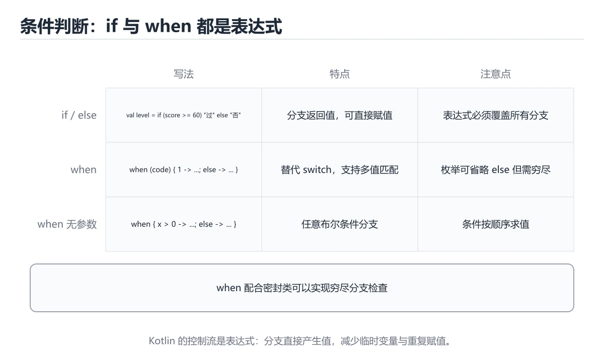
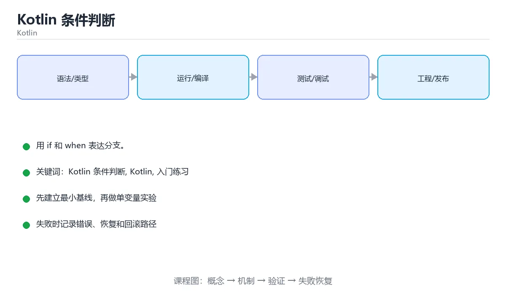

# Kotlin 条件判断

> 内容更新时间：2026-10-06 · 学习阶段：入门 · 预计用时：40 分钟





## 学习目标

- 先认识Kotlin 条件判断需要的工具、输入和输出。
- 按步骤运行最小示例，并记录结果与错误。
- 用一个边界输入验证自己是否真正掌握。

## 前置知识

- 会进行基本的文件或命令行操作。
- 不需要预先掌握「Kotlin」的高级知识。

## 一句话入门

用 if 和 when 表达分支。

## 最小示例

```kotlin
fun main() {
    val temperature = 31
    println(if (temperature > 30) "hot" else "normal")
}
```

## 预期输出

```text
hot
```

## 常见错误与排查

> 说明：本表由《Kotlin 条件判断》的核心知识整理（2026-10-07），人工复核进度见 docs/content_review_batches.md。

| 易错点 | 容易踩的做法 | 正确结论 |
| --- | --- | --- |
| 条件分支缺少兜底 | 新增枚举值后没有处理 | 写兜底分支，或用穷尽的条件表达式 |
| 用等号比较未实现相等性的对象 | 比较的是引用，结果不符合预期 | 数据类自带相等性，普通类需要自行实现 |
| 分支顺序写反 | 具体分支被宽泛条件吞掉 | 从具体到宽泛排列条件 |

## 动手练习

1. 原样运行最小示例，保存命令和输出。
2. 把数字 2 改成 10，预测并验证新结果。
3. 制造一个错误输入，写出错误信息和修复方法。

## 本课小结

- 入门阶段先保证能运行、能观察、能解释，再追求复杂功能。
- 每次只改一个变量，记录预测与实际结果。
- 遇到错误先看第一条错误信息，再回到最小示例。

## 代码实验：把示例跑成证据

### 实验一：建立基线

```kotlin
fun main() {
    val temperature = 31
    println(if (temperature > 30) "hot" else "normal")
}
```

### 实验二：只改一个输入

沿用「Kotlin 条件判断」的最小示例做一次单变量实验：

| 实验 | 改动 | 预测 | 实际 | 结论 |
| --- | --- | --- | --- | --- |
| 基线 | 保持「Kotlin 条件判断」示例原样 |  |  |  |
| 边界 | 把Kotlin 条件判断换成空值或极值 |  |  |  |
| 失败 | 给Kotlin传入非法输入 |  |  |  |

做完后用一句话写出「Kotlin 条件判断」的结论：输入怎么变，结果才怎么变。

### 实验三：制造一个可控错误

把 Kotlin 条件判断 的输入从正常值改成越界值，记录程序是报错、降级还是静默出错；「Kotlin 条件判断」要求三者区分对待。

| 实验 | 改动 | 预测 | 实际 | 结论 |
| --- | --- | --- | --- | --- |
| 基线 | 保持原样 |  |  |  |
| 边界 |  |  |  |  |
| 失败 |  |  |  |  |

### 实验四：用三句话复述

1. 在「Kotlin 条件判断」里，temperature 接受哪些输入，非法输入应该在哪里被挡住？
2. 在 代码实验：把示例跑成证据 里，Kotlin 的状态是在什么条件下被改变的？
3. 输出如何验证，失败时第一条可观察证据是什么？

## Kotlin 基础机制速览

### JVM、Android 与工具链

Kotlin 主要编译成 JVM 字节码，也可以编译成 JavaScript 或原生代码。Android 开发常用 Gradle 构建，Kotlin 与 Java 可以互操作：Kotlin 调用 Java 时要注意平台类型可能为空，Java 调用 Kotlin 时要注意默认参数、扩展函数和顶层函数的生成方式。理解编译目标和互操作边界，能解释很多“本地能跑、发布变慢或崩溃”的问题。

### val/var、类型与空安全

`val` 是只读引用，`var` 是可重新赋值的引用；只读引用指向的对象内容仍可能可变。Kotlin 区分可空类型 `T?` 和非空类型 `T`，编译器要求使用安全调用 `?.`、Elvis 运算符 `?:`、非空断言 `!!` 或智能转换处理空值。`lateinit` 适合生命周期保证会初始化的 var，`by lazy` 适合第一次访问时初始化；两者都不能滥用。

### 函数、表达式与数据类

Kotlin 函数是表达式，单表达式函数可以省略花括号和 return。默认参数、命名参数、扩展函数和顶层函数减少工具类的数量。`data class` 自动生成 equals、hashCode、toString 和 copy，适合值对象；`sealed class` 和 sealed interface 表达有限的互斥状态，配合 when 可以做穷尽检查。高阶函数和 lambda 让集合操作更简洁，但要注意内联与分配成本。

### 集合、泛型与作用域函数

`List`、`Set`、`Map` 默认只读接口，`MutableList` 等提供修改操作。集合操作 `map`、`filter`、`groupBy`、`associate` 返回新集合，序列 Sequence 适合大数据惰性处理。泛型通过 `out` 和 `in` 表达协变与逆变，类型投影处理更复杂的使用位置。`let`、`run`、`with`、`apply`、`also` 的作用域和返回值不同，应根据“访问对象、配置对象还是返回结果”选择。

### 协程、异常与测试

协程用 suspend 函数表达可暂停的异步计算，CoroutineScope 决定生命周期，Dispatcher 决定运行线程，Job 支持取消和结构化并发。不要使用 GlobalScope 泄漏任务，异常传播和取消需要按层级处理。Kotlin 没有受检异常，资源应使用 `use` 自动关闭。测试要覆盖空值、集合边界、协程取消和线程切换，不能只验证 happy path。

## 可运行练习

本节围绕Kotlin 条件判断安排 3 个可交付任务，每个任务都要求留下可以复查的记录。

### 任务 1：用自己的话画出结构

不看书，用一张图说清「Kotlin 条件判断」的结构，画完再对照骨架：

- 主干：Kotlin 条件判断 的定义 → 最小示例 → 预期输出 → 常见错误
- 连接线：在每条边上标出输入、输出与失败路径。
- 自检：能否用一句话说明Kotlin 条件判断与Kotlin的关系？

### 任务 2：做一次对比实验

**验收标准**：两个方案至少在一个输入上给出不同结果；把差异归因到Kotlin 条件判断，而不是笼统地写「性能更好」。

### 任务 3：迁移到自己的场景

**验收标准**：结论要能追溯到「代码实验：把示例跑成证据」的具体段落，并说明它和 Kotlin 的边界。

## 故障现场

### 现场 1：条件分支缺少兜底

**症状**：在《Kotlin 条件判断》的复现场景中，新增枚举值后没有处理。

**根因**：当出现“条件分支缺少兜底”时，执行路径已经绕过了《Kotlin 条件判断》的关键约束，最终以“新增枚举值后没有处理”暴露出来；修复前必须先确认约束在哪里失效。

**修复**：针对《Kotlin 条件判断》的问题，写兜底分支，或用穷尽的条件表达式。

**验证**：先在《Kotlin 条件判断》中记录“条件分支缺少兜底”留下的失败证据，再执行“写兜底分支，或用穷尽的条件表达式”并重放；确认错误路径变为明确结果，且修复没有掩盖同类故障。

### 现场 2：用等号比较未实现相等性的对象

**症状**：在《Kotlin 条件判断》的复现场景中，比较的是引用，结果不符合预期。

**根因**：触发点是把“用等号比较未实现相等性的对象”当成安全做法。它没有满足《Kotlin 条件判断》要求的前提，因此先表现为“比较的是引用，结果不符合预期”；排查时先完整复现这一段，再核对输入、配置与依赖。

**修复**：针对《Kotlin 条件判断》的问题，数据类自带相等性，普通类需要自行实现。

**验证**：保留《Kotlin 条件判断》里触发“比较的是引用，结果不符合预期”的输入、版本和日志，按“数据类自带相等性，普通类需要自行实现”完成修改后原样重放；只有失败现象消失且相邻场景仍可解释，才保留改动。

### 现场 3：分支顺序写反

**症状**：在《Kotlin 条件判断》的复现场景中，具体分支被宽泛条件吞掉。

**根因**：“具体分支被宽泛条件吞掉”只是表层结果。向上追溯会落到“分支顺序写反”这一步，因为它省略了《Kotlin 条件判断》的约束，使实现行为和预期模型发生了偏离。

**修复**：针对《Kotlin 条件判断》的问题，从具体到宽泛排列条件。

**验证**：保留《Kotlin 条件判断》里触发“具体分支被宽泛条件吞掉”的输入、版本和日志，按“从具体到宽泛排列条件”完成修改后原样重放；只有失败现象消失且相邻场景仍可解释，才保留改动。

## 版本与时效

- 版本提示：Kotlin 条件判断 的行为在最近几个大版本里有过调整，升级「Kotlin 条件判断」前先用 temperature 复现当前输出，再对照官方发布说明逐条核对。
- 升级前先用 temperature 建立基线：记录版本、命令和输出，升级后只比较这些可观察量。
- 显式 API 模式与多平台源集是团队协作时的重点
- 官方说明：https://kotlinlang.org/docs/releases.html

### 升级检查清单

- 先固定当前版本，跑通全部示例与测验，再升级工具链。
- 只改 Kotlin 条件判断 的版本变量，记录编译、测试与产物体积的变化。
- 回归范围锁定 temperature 的默认行为，并确认弃用警告是否出现在构建输出里。
- 升级完成后更新本课「最后复核 / 下次复核」日期，并记录 Kotlin 条件判断 的版本变化。

## 本课复习清单

离开本课前，逐项确认：

- [ ] 不看解析，能说出「when 表达式相比 if 链的优势主要体现在哪里？」的判断依据。
- [ ] 不看解析，能说出「Kotlin 的智能转换（smart cast）指的是？」的判断依据。
- [ ] 不看解析，能说出「示例中 temperature 等于 31，输出结果是什么？」的判断依据。
- [ ] 不看解析，能说出「填空：Kotlin 条件判断术语速查中，表示的判断依据。
- [ ] 至少运行一次 temperature 的示例，记录输入、输出和 Kotlin 条件判断 的边界情况。
- [ ] 把本课最容易混淆的两个概念写成一句话对照。

| 复盘项 | 记录 |
| --- | --- |
| 已经能独立解释的考点 |  |
| 仍然说不清的概念 |  |
| 下一步验证动作 |  |

## 复习与自测

对照 代码实验：把示例跑成证据 复述本课结论，答不上来的部分回到 temperature 的示例重跑一次。

### 最小示例

```kotlin
fun main() {
    val temperature = 31
    println(if (temperature > 30) "hot" else "normal")
}
```

自检：这一节与相邻主题的边界在哪里？

### 预期输出

```text
hot
```

### 常见错误

自检：把这一节讲给没学过的人，最需要强调哪一点？

### 动手练习

自检：如果去掉这一节里的一个前提，结论会怎样变化？

### 语言专项实践：Kotlin 条件判断

围绕「Kotlin 条件判断、Kotlin、入门练习」说明变量生命周期、资源释放、并发模型和错误传播。语言语法只是入口，真正决定行为的是运行时、标准库和平台约束。

自检：这一节的关键输入与输出分别是什么？

## 术语速查

把「Kotlin 条件判断」里反复出现的术语集中放在一起。复习时先遮住右列，尝试用自己的话解释，再回到正文核对。

| 术语 | 一句话说明 |
| --- | --- |
| `if 表达式` | Kotlin 的 if 有返回值，可以直接赋给变量。 |
| `when` | 多分支匹配，既能当语句也能当表达式，比 switch 更灵活。 |
| `区间与 in` | 用 1..10 表示闭区间，in 判断值是否落在区间或集合里。 |
| `智能转换` | 判断过类型或非空后，编译器自动按更精确的类型处理。 |
| `函数` | Kotlin 函数是表达式，单表达式函数可以省略花括号和 return |
| `集合` | 集合操作 map、filter、groupBy、associate 返回新集合，序列 Sequence 适合大数据惰性处理 |

## 考点精讲

### 考点 1：多选辨析·Kotlin 条件判断

- **题目**：围绕“Kotlin 条件判断”中的 Kotlin 条件判断、Kotlin、入门练习，下列哪两项是本课强调的实践判断？
- **判断依据**：题干的正确项是学习 Kotlin 条件判断 时要同时说明输入、输出和失败路径，不能只看正常流程；在「Kotlin 条件判断」里，验证 Kotlin 时要固定版本并覆盖边界输入，结论才可复现。回到「Kotlin 条件判断」的正文示例，用“围绕Kotlin 条件判断中的 Ko”走一遍Kotlin 条件判断、Kotlin、入门练习的完整流程，能复现的结论才可以保留。

### 考点 2：概念判断·Kotlin 条件判断

- **题目**：when 表达式相比 if 链的优势主要体现在哪里？
- **判断依据**：在「Kotlin 条件判断」里，按多个分支逐一匹配。when 把多个分支平铺在一起，支持常量、范围、类型判断和无参数形式，作为表达式使用时还要求覆盖所有情况或提供 else。「Kotlin 条件判断」要求先交代Kotlin 条件判断、Kotlin、入门练习的前提再下结论，所以“按多个分支逐一匹配”只在题干“when 表达式相比 if 链的优势主要体现在哪里”给定的条件下成立。

### 考点 3：代码补全·Kotlin 条件判断

- **题目**：下面这段 Kotlin 代码摘自「Kotlin 条件判断」的正文示例。关于这段代码，下面哪一项说法与实际内容相符？
- **判断依据**：在「Kotlin 条件判断」里，题干的正确项是这段代码包含条件分支，不同输入会走不同的执行路径，在「Kotlin 条件判断」里分支条件由Kotlin 条件判断决定，替换条件后结论可能变化。这段代码出自「Kotlin 条件判断」的正文示例，围绕Kotlin 条件判断、Kotlin、入门练习展开；把输入或边界换成空值、极值或失败情况后，结论要以「Kotlin 条件判断」的实际运行结果为准。这道题的关键在Kotlin 条件判断、Kotlin、入门练习：先确认题干“下面这段”问的是哪一步，再排除偷换前提的选项。

### 考点 4：概念判断·Kotlin 条件判断

- **题目**：示例中 temperature 等于 31，输出结果是什么？
- **判断依据**：在「Kotlin 条件判断」里，结论应落在「输出 hot，因为条件 31 > 30 成立并取第一个分支」。31 大于 30，条件成立，if 表达式返回字符串 "hot"，println 把它输出为一行 hot。这道题的关键在「Kotlin 条件判断」的Kotlin 条件判断、Kotlin、入门练习：先确认题干“示例中 temperature 等于”问的是哪一步，再排除偷换前提的选项。

### 考点 5：填空·____

- **题目**：填空：在「Kotlin 条件判断」的术语速查里，「`____` 是只读引用，`var` 是可重新赋值的引用；只读引用指向的对象内容仍可能可变。Kotlin 区分可空类型 `T?` 和非空类型 `T`，编译器要求使用安全调用 `?.`、Elvis 运算符 `?:`、非空断言 `!!` 或智能转」描述的是哪个术语？
- **判断依据**：题干的正确项是val。回到「Kotlin 条件判断」的正文示例，用“填空”走一遍Kotlin 条件判断、Kotlin、入门练习的完整流程，能复现的结论才可以保留。在「Kotlin 条件判断」里判断这道题，要把Kotlin 条件判断、Kotlin、入门练习的条件、过程与失败路径逐项对齐，换成“在Kotlin”这个场景，只有满足前提的结论才成立。

## English Overview

**Title:** Kotlin Conditionals

**Summary:** Express branches with if and when.

**Category:** Kotlin
**Level:** 入门
**Key terms:** Kotlin 条件判断, Kotlin, 入门练习

## 内容元数据

- 内容版本：v2.0
- 最后更新：2026-10-06
- 学习阶段：入门
- 适用环境：Kotlin 2.x / Android SDK；本课聚焦 Kotlin 条件判断。
- 内容来源：内置结构化课程与工程实践整理
- 相关主题：Kotlin 条件判断、Kotlin、入门练习
- 质量版本：P0 测验标准 + P1 覆盖扩展 + P2 体验补全

## 语言专项实践：Kotlin 条件判断

### 一、工具链

| 阶段 | 推荐工具 | 验收标准 |
| --- | --- | --- |
| 编译构建 | kotlinc / Gradle | 命令可复现且错误能被定位 |
| 测试 | JUnit + coroutines-test | 命令可复现且错误能被定位 |
| 静态检查 | detekt / ktlint | 命令可复现且错误能被定位 |
| 发布 | R8/ProGuard + App Bundle | 命令可复现且错误能被定位 |

### 二、运行时与内存模型

「Kotlin 条件判断」的「二、运行时与内存模型」一节补全如下：

- 定位：这一节说明二、运行时与内存模型在「Kotlin 条件判断」知识体系里的位置。
- 检查点：固定版本与输入重跑《Kotlin 条件判断》，记录两次差异并定位不稳定条件。
- 自检：能否用一个最小例子解释二、运行时与内存模型？

### 三、测试策略

- 单元测试覆盖核心规则和边界。
- 集成测试覆盖文件、网络、数据库或平台 API。
- 失败测试覆盖超时、取消、异常和资源耗尽。
- 性能测试记录基线，避免只凭感觉优化。

### 四、发布检查

- [ ] 版本和依赖锁定，构建可复现。
- [ ] 产物经过签名、校验和最小权限配置。
- [ ] 日志不泄露密钥和个人信息。
- [ ] 有升级、回滚和故障恢复说明。

## 参考资料与复核

- 最后复核：2026-10-04
- 下次复核：2026-11-10
- 复核范围：版本兼容、API 行为、安全建议与工程实践
- 来源性质：官方文档、标准或权威教材；正文为离线教学重组

| 参考资料 | 本课用途 |
| --- | --- |
| [Android Kotlin](https://developer.android.com/kotlin) | Android 官方 Kotlin 实践 |
| [Kotlin 协程](https://kotlinlang.org/docs/coroutines-guide.html) | 结构化并发与异步流 |
| [Kotlin 测试](https://kotlinlang.org/docs/testing.html) | 单元测试与断言 |

> 「Kotlin 条件判断」的链接用于离线阅读后的延伸核对；App 不会自动联网。

## 复习与迁移

复习目标：把「Kotlin 条件判断」的判断标准放回可复现的例子里。先自己作答，再对照依据；如果结论正确但理由不完整，回到正文补足前提。

### 概念复述

- 用一句话说明「Kotlin 条件判断」解决什么问题：用 if 和 when 表达分支。
- 写出Kotlin 条件判断、Kotlin、入门练习之间的关系，并各举一个例子。
- 说出本课最容易混淆的两个概念，以及区分它们的判据。

### 正文逐节复核

- **Kotlin 基础机制速览**：Kotlin 主要编译成 JVM 字节码，也可以编译成 JavaScript 或原生代码。
- **实践任务**：本节围绕Kotlin 条件判断安排 3 个可交付任务，每个任务都要求留下可以复查的记录。
- **逐节复习与自检**：围绕「Kotlin 条件判断、Kotlin、入门练习」说明变量生命周期、资源释放、并发模型和错误传播。

### 测验回顾

1. 围绕“Kotlin 条件判断”中的 Kotlin 条件判断、Kotlin、入门练习，下列哪两项是本课强调的实践判断？
   - 依据：题干的正确项是学习 Kotlin 条件判断 时要同时说明输入、输出和失败路径，不能只看正常流程；在「Kotlin 条件判断」里，验证 Kotlin 时要固定版本并覆盖边界输入，结论才可复现。回到「Kotlin 条件判断」的正文示例，用“围绕Kotlin 条件判断中的 Ko”走一遍Kotlin 条件判断、Kotlin、入门练习的完整流程，能复现的结论才可以保留。
2. when 表达式相比 if 链的优势主要体现在哪里？
   - 依据：在「Kotlin 条件判断」里，按多个分支逐一匹配，可读性更好且支持类型与范围条件。when 把多个分支平铺在一起，支持常量、范围、类型判断和无参数形式，作为表达式使用时还要求覆盖所有情况或提供 else。「Kotlin 条件判断」要求先交代Kotlin 条件判断、Kotlin、入门练习的前提再下结论，所以“按多个分支逐一匹配”只在题干“when 表达式相比 if 链的优势主要体现在哪里”给定的条件下成立。
3. 下面这段 Kotlin 代码摘自「Kotlin 条件判断」的正文示例。关于这段代码，下面哪一项说法与实际内容相符？
   - 依据：在「Kotlin 条件判断」里，题干的正确项是这段代码包含条件分支，不同输入会走不同的执行路径，在「Kotlin 条件判断」里分支条件由Kotlin 条件判断决定，替换条件后结论可能变化。这段代码出自「Kotlin 条件判断」的正文示例，围绕Kotlin 条件判断、Kotlin、入门练习展开；把输入或边界换成空值、极值或失败情况后，结论要以「Kotlin 条件判断」的实际运行结果为准。这道题的关键在Kotlin 条件判断、Kotlin、入门练习：先确认题干“下面这段”问的是哪一步，再排除偷换前提的选项。
4. 示例中 temperature 等于 31，输出结果是什么？
   - 依据：在「Kotlin 条件判断」里，结论应落在「输出 hot，因为条件 31 > 30 成立并取第一个分支」。31 大于 30，条件成立，if 表达式返回字符串 "hot"，println 把它输出为一行 hot。这道题的关键在「Kotlin 条件判断」的Kotlin 条件判断、Kotlin、入门练习：先确认题干“示例中 temperature 等于”问的是哪一步，再排除偷换前提的选项。
5. 填空：在「Kotlin 条件判断」的术语速查里，「`____` 是只读引用，`var` 是可重新赋值的引用；只读引用指向的对象内容仍可能可变。Kotlin 区分可空类型 `T?` 和非空类型 `T`，编译器要求使用安全调用 `?.`、Elvis 运算符 `?:`、非空断言 `!!` 或智能转」描述的是哪个术语？
   - 依据：题干的正确项是val。回到「Kotlin 条件判断」的正文示例，用“填空”走一遍Kotlin 条件判断、Kotlin、入门练习的完整流程，能复现的结论才可以保留。在「Kotlin 条件判断」里判断这道题，要把Kotlin 条件判断、Kotlin、入门练习的条件、过程与失败路径逐项对齐，换成“在Kotlin”这个场景，只有满足前提的结论才成立。

### 迁移练习

把「Kotlin 条件判断」的结论迁移到相邻主题，每次迁移都写清预测与证据：

1. 换输入：用Kotlin 条件判断处理一组你自己的数据，对比教材示例的结果差异。
2. 换失败条件：制造一个Kotlin相关的错误，说明如何从错误信息定位根因。
3. 换规模：把数据量或并发度提高一个数量级，说明「Kotlin 条件判断」的结论是否仍成立。

## 工程化精练：决策、失败与验证

这一章把「Kotlin 条件判断」从“看懂”推进到“能判断、能验证、能排错”。所有判断都围绕Kotlin 条件判断、Kotlin与入门练习展开，并与前文的示例、测验和失败现场互相对照。

### 一、Kotlin 条件判断 的判断算法

| 步骤 | 要回答的问题 | 判断依据 | 记录什么 |
| --- | --- | --- | --- |
| 1. 定目标 | 「Kotlin 条件判断」这一步要解决什么问题？ | 把Kotlin 条件判断的目标写成一句可验证的结论 | 输入、约束、成功标准 |
| 2. 找边界 | Kotlin在什么条件下失效？ | 先列空值、极值、重复和失败路径 | 反例与触发条件 |
| 3. 跑基线 | 原始示例的真实输出是什么？ | 命令、版本和环境必须可复现 | 命令、输出、耗时 |
| 4. 只改一处 | 把入门练习换成另一种取值会怎样？ | 预测写在运行之前 | 预测与实际的差异 |
| 5. 回写结论 | 结论能否被他人复现？ | 把判断写成清单或测试 | 结论、证据、遗留问题 |

这张表的用法不是从上到下浏览，而是每次只填一行：先用「Kotlin 条件判断」前文的示例验证第 3 行，再故意破坏一个条件验证第 2 行。当你能在不看解析的情况下说出Kotlin 条件判断的判断依据，才算真正掌握本课。

- 先从Kotlin 条件判断入手：把它写成“输入是什么、输出是什么、哪一步最容易出错”。如果这三句话中有一句说不清，说明对「Kotlin 条件判断」的理解还停留在术语层面，需要回到正文的最小示例重新观察一次。

- 再把Kotlin当成对照实验的变量：固定其他条件，只改变它的取值，记录输出是否变化。结论“变”或“不变”都要写出理由，并说明这个理由能否被他人独立复现。

- 针对入门练习做一次失败演练：故意给出空值、极值或错误类型，观察「Kotlin 条件判断」的报错位置和处理方式。错误信息只是入口，真正要定位的是哪一层假设被破坏。

- 把「Kotlin 条件判断」的结论压缩成一条可执行清单：先检查输入，再检查版本与环境，然后跑最小用例，最后才扩大规模。顺序颠倒会让排错范围成倍增加。

- 如果结论依赖时间或规模，就把数据量提高一个数量级再跑一次。在「Kotlin 条件判断」里，小样本成立不代表大样本成立，复杂度、资源占用和失败率都要重新记录。

- 如果结论依赖并发或共享状态，就固定输入并连续运行多次。结果不一致时，优先怀疑「Kotlin 条件判断」中Kotlin 条件判断相关步骤的隐藏状态，而不是先改代码。

- 把「Kotlin 条件判断」的判断写成测试：一个正常用例、一个边界用例、一个失败用例。测试通过只是起点，还要确认失败用例确实以预期方式失败。

- 把本课与相邻主题连起来：Kotlin 条件判断解决的是“怎么做”，Kotlin回答“什么时候不适用”。两者都答得出来，迁移才算完成。

> 第 2 轮复核「Kotlin 条件判断」：把上面的结论逐条改写为可验证的问题，并记录仍不确定的部分。

- 先从Kotlin 条件判断入手：把它写成“输入是什么、输出是什么、哪一步最容易出错”。如果这三句话中有一句说不清，说明对「Kotlin 条件判断」的理解还停留在术语层面，需要回到正文的最小示例重新观察一次。

- 再把Kotlin当成对照实验的变量：固定其他条件，只改变它的取值，记录输出是否变化。结论“变”或“不变”都要写出理由，并说明这个理由能否被他人独立复现。

- 针对入门练习做一次失败演练：故意给出空值、极值或错误类型，观察「Kotlin 条件判断」的报错位置和处理方式。错误信息只是入口，真正要定位的是哪一层假设被破坏。

- 把「Kotlin 条件判断」的结论压缩成一条可执行清单：先检查输入，再检查版本与环境，然后跑最小用例，最后才扩大规模。顺序颠倒会让排错范围成倍增加。

### 二、Kotlin 条件判断 的机制拆解与自测

把本课考点还原成可回答的问题，再逐题写出依据：

**问题 1**：围绕“Kotlin 条件判断”中的 Kotlin 条件判断、Kotlin、入门练习，下列哪两项是本课强调的实践判断？

- 关联术语：Kotlin 条件判断
- 判断依据：学习 Kotlin 条件判断 时要同时说明输入、输出和失败路径，不能只看正常流程
- 追问：如果把Kotlin 条件判断的条件换成边界值，这个结论是否仍然成立？

**问题 2**：when 表达式相比 if 链的优势主要体现在哪里？

- 关联术语：Kotlin
- 判断依据：按多个分支逐一匹配，可读性更好且支持类型与范围条件
- 追问：如果把Kotlin的条件换成边界值，这个结论是否仍然成立？

**问题 3**：下面这段 Kotlin 代码摘自「Kotlin 条件判断」的正文示例。关于这段代码，下面哪一项说法与实际内容相符？

- 关联术语：入门练习
- 判断依据：回到「Kotlin 条件判断」正文对应小节，先用最小示例验证再下结论。
- 追问：当 temperature 的输入越过合法范围时，本课结论还成立吗？

**问题 4**：示例中 temperature 等于 31，输出结果是什么？

- 关联术语：Kotlin 条件判断
- 判断依据：输出 hot，因为条件 31 > 30 成立并取第一个分支
- 追问：如果把Kotlin 条件判断的条件换成边界值，这个结论是否仍然成立？

**问题 5**：填空：在「Kotlin 条件判断」的术语速查里，「`____` 是只读引用，`var` 是可重新赋值的引用；只读引用指向的对象内容仍可能可变。Kotlin 区分可空类型 `T?` 和非空类型 `T`，编译器要求使用安全调用 `?.`、Elvis 运算符 `?:`、非空断言 `!!` 或智能转」描述的是哪个术语？

- 关联术语：Kotlin
- 判断依据：回到「Kotlin 条件判断」正文对应小节，先用最小示例验证再下结论。
- 追问：如果把Kotlin的条件换成边界值，这个结论是否仍然成立？

### 三、失败模式与修复顺序

| 失败信号 | 常见根因 | 先做什么 | 修复后如何确认 |
| --- | --- | --- | --- |
| 「Kotlin 条件判断」中 Kotlin 条件判断 相关步骤报错 | 输入、版本或前置条件与示例不一致 | 保留第一条错误信息，回到最小输入 | 用学习 Kotlin 条件判断 时要同时说明输入、输出和失败路径，不能只看正常流程复跑，确认输出可复现 |
| 「Kotlin 条件判断」中 Kotlin 相关步骤报错 | 输入、版本或前置条件与示例不一致 | 保留第一条错误信息，回到最小输入 | 用按多个分支逐一匹配，可读性更好且支持类型与范围条件复跑，确认输出可复现 |
| 「Kotlin 条件判断」中 入门练习 相关步骤报错 | 输入、版本或前置条件与示例不一致 | 保留第一条错误信息，回到最小输入 | 用输出 hot，因为条件 31 > 30 成立并取第一个分支复跑，确认输出可复现 |
- 检查点：固定版本与输入重跑《Kotlin 条件判断》，记录两次差异并定位不稳定条件。
| 单次结果正确但规模一大就失效 | 只测了正常路径，没有覆盖边界 | 把数据量或并发度提高一个数量级 | 记录边界值、耗时与失败率 |

排错顺序固定为：先复现，再缩小输入，然后只改一个条件，最后把结论写成回归用例。对「Kotlin 条件判断」来说，任何不能复现的“修好了”都不算完成。

### 四、离开本课前的验证清单

| 检查项 | 通过标准 | 证据 |
| --- | --- | --- |
| 能复述 | 用三句话说明「Kotlin 条件判断」解决什么问题、边界在哪 | 不看解析写出的结论 |
| 能运行 | 最小示例在本机跑通 | 命令、输出与版本 |
| 能改条件 | 只改一个输入并解释差异 | 预测与实际的对照 |
| 能排错 | 至少制造并修复一个失败 | 错误信息与修复步骤 |
| 能迁移 | 把Kotlin 条件判断、Kotlin、入门练习用到新场景 | 一个自选练习的结论 |

完成标准：能不看解析说清「Kotlin 条件判断」全部自测题的依据，并且至少有一条Kotlin 条件判断相关的结论经过真实运行验证。如果某一步只停留在“感觉懂了”，就把它写成下一轮针对「Kotlin 条件判断」的最小验证任务。

### 五、把结论写成可检查的证据

学习「Kotlin 条件判断」时，最容易出现的情况是“听过、看懂了，但换一个输入就说不清”。下面把Kotlin 条件判断与Kotlin放进一条可检查的证据链：每一句结论都要能回答“从哪里来、在什么条件下成立、失败时怎么发现”。

| 证据类型 | 本课要求 | 不合格的表现 |
| --- | --- | --- |
| 概念证据 | 用一句话说明Kotlin 条件判断的定义与适用场景 | 只背术语，说不出它解决什么问题 |
| 运行证据 | 能复现「Kotlin 条件判断」的最小示例 | 输出与记录对不上，或换机器就不一致 |
| 对照证据 | 只改一个条件，说明差异来自哪里 | 一次改多个变量，无法归因 |
| 失败证据 | 故意制造错误并记录恢复步骤 | 只测正常路径，失败时靠猜 |
| 迁移证据 | 把Kotlin用到自选场景 | 换一个例子就完全套不上 |

举例：学习 Kotlin 条件判断 时要同时说明输入、输出和失败路径，不能只看正常流程。把这个结论代回「Kotlin 条件判断」的正文，找出它对应的输入、处理步骤与输出；再换掉其中一个条件，观察结论是否仍然成立。能完成这一步，才说明这条知识已经从“记忆”变成“可用的判断”。

最后留一个自检问题：如果只能保留三条笔记，你会写下哪三句？把答案限定为「Kotlin 条件判断」中的可验证结论，并给每条结论配一个反例。这三句加上对应反例，就是本课最值得带入后续课程的复习材料。

<!-- language-intro-deep-dive:start -->

## 零基础通俗讲：Kotlin 条件判断

### 一句话说清它是什么

Kotlin 的 if 是表达式，可以直接赋值；when 取代了传统 switch，既能匹配值也能写条件分支。

### 用生活比喻理解

when 像分诊台的一张对照表：从上往下逐条对照，第一条匹配的规则决定去向，剩下的规则不再看。

### 完整可运行代码

```kotlin
fun main() {
    val score = 72

    if (score >= 90) {
        println("优秀")
    } else if (score >= 60) {
        println("及格")
    } else {
        println("需要补考")
    }

    val level = when {
        score >= 90 -> 'A'
        score >= 60 -> 'B'
        else -> 'C'
    }
    println("等级：$level")
}
```

### 逐行拆开看

- `val score = 72` 类型自动推断为 Int。
- `if (score >= 90) {` 条件要写括号，这和 Go 正好相反。
- `else if` 和 `else` 的写法和 Java 类似，但分支体是表达式。
- when 不带参数时按条件判断，等价于链式 if/else if。
- 箭头右边的字符就是该分支的值，when 整体作为表达式赋给 level。
- 分支必须覆盖所有可能，否则作为表达式使用时编译不通过。


### 把程序跑一遍

- score 为 72：if 链走第二个分支，输出「及格」。
- when 表达式从上往下匹配：90 分支假，60 分支真，得到字符 B。
- 输出「等级：B」。
- 如果把 score 改成 95，if 链输出「优秀」，when 得到 A。


### 新手最容易踩的坑

- when 缺少 else：作为表达式使用时必须穷尽所有情况，否则编译失败。
- 分支顺序写反：低档写在高档前面，高档永远匹配不到。
- 在分支里写多行却不加花括号：箭头分支需要花括号包围多语句。
- 用一个等号代替两个等号：Kotlin 会报类型错误，比 C 安全。
- 把 when 写成 switch：Kotlin 没有 switch 关键字，旧代码迁移时要注意。


### 动手练一练

- 用 90、89、60、59 四个值测试两个分支结构。
- 把 when 改成带参数的写法，用分数区间做映射。
- 尝试删掉 else，观察编译器的报错。


### 本课速查卡

把下面八行抄进自己的笔记，复习时只看这一页就能回忆整课：

| 复习项 | 本课要点 |
| --- | --- |
| 核心结论 | Kotlin 的 if 是表达式，可以直接赋值；when 取代了传统 switch，既能匹配值也能写条件分支。 |
| 最少要写的代码 | `fun main() {` |
| 正确做法 | score 为 72：if 链走第二个分支，输出「及格」。 |
| 最常见的错误 | when 缺少 else：作为表达式使用时必须穷尽所有情况，否则编译失败。 |
| 出错先查什么 | 先读第一条报错信息，再回到最小示例只改一个地方 |
| 怎么确认学会了 | 用 90、89、60、59 四个值测试两个分支结构。 |
| 和别的知识点的关系 | 本课打下的语法与思维方式会被后面每一课反复用到 |
| 接下来做什么 | 合上教程，凭记忆把上面的最小代码重写一遍再运行 |
