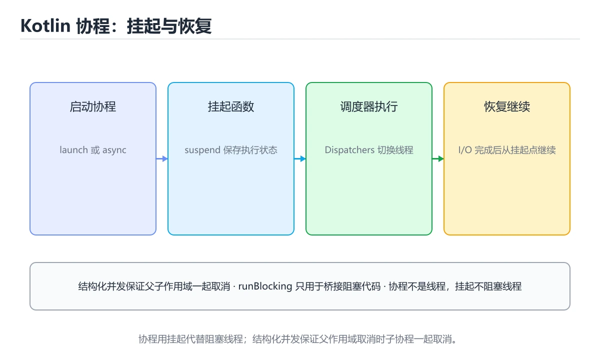
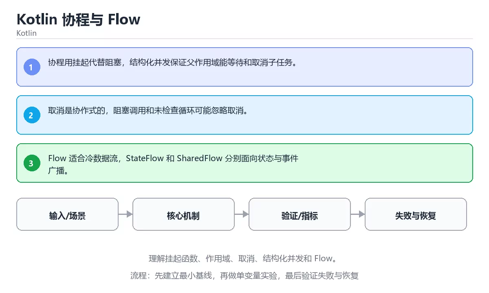

# Kotlin 协程与 Flow





> 内容更新时间：2026-10-03 · 学习阶段：高级 · 预计用时：25 分钟

## 学习目标

- 能用自己的话解释：协程用挂起代替阻塞，结构化并发保证父作用域能等待和取消子任务。
- 能用自己的话解释：取消是协作式的，阻塞调用和未检查循环可能忽略取消。
- 能用自己的话解释：Flow 适合冷数据流，StateFlow 和 SharedFlow 分别面向状态与事件广播。
- 能把本课知识放回「Kotlin」，并完成练习与测验。

## 前置知识

- 已完成「Kotlin」的基础课程，能运行正文中的最小示例。
- 本课关键词：协程、suspend、Flow、取消。
- 遇到不熟悉的术语先记录问题，完成练习后再回读。

## 核心知识

### 1. 协程用挂起代替阻塞，结构化并发保证父作用域能等待和取消子任务。

- 它解决的问题：把「协程用挂起代替阻塞，结构化并发保证父作用域能等待和取消子任务。」放回真实场景，说明不做它会带来什么后果。
- 关键做法：先用最小示例建立基线，再逐步加入边界、失败和性能条件。
- 验证标准：结果可复现、错误可解释、边界有测试、失败能恢复。

### 2. 取消是协作式的，阻塞调用和未检查循环可能忽略取消。

- 它解决的问题：把「取消是协作式的，阻塞调用和未检查循环可能忽略取消。」放回真实场景，说明不做它会带来什么后果。
- 关键做法：先用最小示例建立基线，再逐步加入边界、失败和性能条件。
- 验证标准：结果可复现、错误可解释、边界有测试、失败能恢复。

### 3. Flow 适合冷数据流，StateFlow 和 SharedFlow 分别面向状态与事件广播。

- 它解决的问题：把「Flow 适合冷数据流，StateFlow 和 SharedFlow 分别面向状态与事件广播。」放回真实场景，说明不做它会带来什么后果。
- 关键做法：先用最小示例建立基线，再逐步加入边界、失败和性能条件。
- 验证标准：结果可复现、错误可解释、边界有测试、失败能恢复。

## 关键流程

```text
输入 → 校验 → 核心处理 → 验证 → 记录指标 → 失败恢复
```

## 实践路径

1. 用一句话复述本课要解决的问题。
2. 跑通正文中的最小示例并记录基线。
3. 只改变一个输入或参数，预测并验证结果。
4. 补一个失败路径，记录错误、恢复和指标。
5. 把结论写成可复现的笔记或测试。

## 常见误区

| 误区 | 后果 | 修正 |
| --- | --- | --- |
| 只记术语不做实验 | 遇到真实问题无法判断 | 用最小输入跑通并记录结果 |
| 只测正常路径 | 边界和故障上线才暴露 | 补空值、极值和依赖失败 |
| 没有基线就优化 | 无法证明改进有效 | 先测量再修改 |
| 忽略成本与安全 | 性能和风险失控 | 同时记录资源、权限与失败代价 |

## 动手练习

1. 合上教程，用 3～5 句话解释「Kotlin 协程与 Flow」。
2. 从正文选一个例子，改变一个条件并预测结果。
3. 设计一个失败场景，写出止损与恢复步骤。

**验收标准**：留下输入、命令、输出、差异和下一步问题。

## 本课小结

- 本课属于「Kotlin」，核心关键词是 协程、suspend、Flow、取消。
- 先保证正确与可复现，再讨论性能和扩展。
- 完成练习和测验后，把仍然不确定的问题写成下一轮验证清单。

> 本课由 P1 内容扩展生成，重点补充原有课程缺失的主题与工程边界。


## 语言专项实践：Kotlin 协程与 Flow

### 一、工具链

| 阶段 | 推荐工具 | 验收标准 |
| --- | --- | --- |
| 编译构建 | kotlinc / Gradle | 命令可复现且错误能被定位 |
| 测试 | JUnit + coroutines-test | 命令可复现且错误能被定位 |
| 静态检查 | detekt / ktlint | 命令可复现且错误能被定位 |
| 发布 | R8/ProGuard + App Bundle | 命令可复现且错误能被定位 |

### 二、运行时与内存模型

围绕「协程、suspend、Flow、取消」说明变量生命周期、资源释放、并发模型和错误传播。语言语法只是入口，真正决定行为的是运行时、标准库和平台约束。

### 三、测试策略

- 单元测试覆盖核心规则和边界。
- 集成测试覆盖文件、网络、数据库或平台 API。
- 失败测试覆盖超时、取消、异常和资源耗尽。
- 性能测试记录基线，避免只凭感觉优化。

### 四、发布检查

- [ ] 版本和依赖锁定，构建可复现。
- [ ] 产物经过签名、校验和最小权限配置。
- [ ] 日志不泄露密钥和个人信息。
- [ ] 有升级、回滚和故障恢复说明。


## 考点精讲：把测验题还原成判断过程

本课有 5 个判断点。先自己作答，再看「判断依据」；如果结论正确但理由不完整，回到正文对应章节补足概念。

### 考点 1：关于「协程用挂起代替阻塞 结构化并发保证父…」，下列说法正确的是？

- **正确判断**：协程用挂起代替阻塞，结构化并发保证父作用域能等待和取消子任务。
- **判断依据**：正确答案是「协程用挂起代替阻塞，结构化并发保证父作用域能等待和取消子任务。」，本课在「本课小结」中说明：本课属于「Kotlin」，核心关键词是 协程、suspend、Flow、取消。，本课在「核心知识」中说明：它解决的问题：把协程用挂起代替阻塞，结构化并发保证父作用域能等待和取消子任务。，本课在「核心知识」中说明：它解决的问题：把取消是协作式的，阻塞调用和未检查循环可能忽略取消。
- **迁移检查**：把题干里的一个条件换成边界值，原来的结论还成立吗？写出判断过程。

### 考点 2：关于「取消是协作式的 阻塞调用和未检查循环…」，下列说法正确的是？

- **正确判断**：取消是协作式的，阻塞调用和未检查循环可能忽略取消。
- **判断依据**：正确答案是「取消是协作式的，阻塞调用和未检查循环可能忽略取消。」，本课在「本课小结」中说明：本课属于「Kotlin」，核心关键词是 协程、suspend、Flow、取消。，本课在「核心知识」中说明：它解决的问题：把取消是协作式的，阻塞调用和未检查循环可能忽略取消。，本课在「核心知识」中说明：它解决的问题：把协程用挂起代替阻塞，结构化并发保证父作用域能等待和取消子任务。
- **迁移检查**：如果给某个错误选项去掉一个限定词，它会不会变成正确？说明理由。

### 考点 3：关于「Flow 适合冷数据流 StateF…」，下列说法正确的是？

- **正确判断**：Flow 适合冷数据流
- **判断依据**：正确答案是「Flow 适合冷数据流」，本课在「核心知识」中说明：它解决的问题：把Flow 适合冷数据流，StateFlow 和 SharedFlow 分别面向状态与事件广播。本课还在核心知识中说明：它解决的问题：把协程用挂起代替阻塞，结构化并发保证父作用域能等待和取消子任务。本课还在核心知识中说明：它解决的问题：把取消是协作式的，阻塞调用和未检查循环可能忽略取消。
- **迁移检查**：遮住选项，只根据定义复述一次答案，再回来看哪个选项与复述一致。

### 考点 4：「Kotlin 协程与 Flow」的核心学习目标是什么？

- **正确判断**：理解挂起函数、作用域、取消、结构化并发和 Flow。
- **判断依据**：正确答案是「理解挂起函数、作用域、取消、结构化并发和 Flow。」，这道题在问Kotlin协程与Flow的核心学习目标是什么，判断时要把题干限定的输入、边界与目标逐项对齐。，本课在核心知识中说明：它解决的问题：把协程用挂起代替阻塞，结构化并发保证父作用域能等待和取消子任务。本课还在核心知识中说明：它解决的问题：把取消是协作式的，阻塞调用和未检查循环可能忽略取消。
- **迁移检查**：如果给某个错误选项去掉一个限定词，它会不会变成正确？说明理由。

### 考点 5：补全代码：「Kotlin 协程与 Flow」示例中，下面这行代码缺少哪个关键字或函数名？请填入 ____。 `import kotlinx.____.Dispatchers`

- **正确判断**：coroutines
- **判断依据**：正确答案是「coroutines」，本课在「核心知识」中说明：它解决的问题：把协程用挂起代替阻塞，结构化并发保证父作用域能等待和取消子任务。本课还在「核心知识」中说明：它解决的问题：把取消是协作式的，阻塞调用和未检查循环可能忽略取消。本课示例中还能看到 `import kotlinx.coroutines.Dispatchers` 这样的用法，说明该关键字在本课代码中承担实际功能。
- **迁移检查**：不看题干，用自己的话补全这句话，再与标准答案对照。

### 补充考点 1：阅读「Kotlin 协程与 Flow」的代码片段，下面哪项判断是正确的？

- **正确判断**：协程用挂起代替阻塞，结构化并发保证父作用域能等待和取消子任务。
- **判断依据**：正确答案是「协程用挂起代替阻塞，结构化并发保证父作用域能等待和取消子任务。」。这段代码来自「Kotlin 协程与 Flow」的示例，判断时先看输入与输出，再检查条件、循环和边界。正确答案是「协程用挂起代替阻塞，结构化并发保证父作用域能等待和取消子任务。」，本课在「核心知识」中说明：它解决的问题：把协程用挂起代替阻塞，结构化并发保证父作用域能等待和取消子任务。，本课在「核心知识…在「Kotlin 协程与 Flow」中，如果只改一个条件，输出通常会随之改变，因此不能脱离代码前提作答。

## 本课复习清单

离开本课前，逐项确认：

- [ ] 不看解析，能说出「关于「协程用挂起代替阻塞 结构化并发保证父…」，下列说法正确的是？」的判断依据。
- [ ] 不看解析，能说出「关于「取消是协作式的 阻塞调用和未检查循环…」，下列说法正确的是？」的判断依据。
- [ ] 不看解析，能说出「关于「Flow 适合冷数据流 StateF…」，下列说法正确的是？」的判断依据。
- [ ] 不看解析，能说出「「Kotlin 协程与 Flow」的核心学习目标是什么？」的判断依据。
- [ ] 不看解析，能说出「补全代码：「Kotlin 协程与 Flow」示例中，下面这行代码缺少哪个关键字或…」的判断依据。
- [ ] 至少运行一次本课示例，记录输入、输出和一个边界情况。
- [ ] 把本课最容易混淆的两个概念写成一句话对照。

| 复盘项 | 记录 |
| --- | --- |
| 已经能独立解释的考点 |  |
| 仍然说不清的概念 |  |
| 下一步验证动作 |  |

## 术语速查

把本课反复出现的术语集中放在一起。复习时先遮住右列，尝试用自己的话解释，再回到正文核对。

| 术语 | 本课语境 |
| --- | --- |
| `协程` | 本课围绕该主题展开，结合正文与代码示例理解它的适用边界。 |
| `suspend` | 本课围绕该主题展开，结合正文与代码示例理解它的适用边界。 |
| `Flow` | 本课围绕该主题展开，结合正文与代码示例理解它的适用边界。 |
| `取消` | 本课围绕该主题展开，结合正文与代码示例理解它的适用边界。 |

## 面试问答与自测

下面把本课考点换成面试追问。先口述自己的答案，
再对照参考回答检查是否遗漏了前提、边界或失败路径。

### 追问 1：关于「协程用挂起代替阻塞 结构化并发保证父…」，下列说法正确的是？

**参考回答**：正确答案是「协程用挂起代替阻塞，结构化并发保证父作用域能等待和取消子任务。」，本课在「核心知识」中说明：它解决的问题：把协程用挂起代替阻塞，结构化并发保证父作用域能等待和取消子任务。，本课在「核心知识」中说明：它解决的问题：把取消是协作式的，阻塞调用和未检查循环可能忽略取消。，本课在「本课小结」中说明：本课属于「Kotlin」，核心关键词是 协程、suspend、Flow、取消。

### 追问 2：关于「取消是协作式的 阻塞调用和未检查循环…」，下列说法正确的是？

**参考回答**：正确答案是「取消是协作式的，阻塞调用和未检查循环可能忽略取消。」，本课在「核心知识」中说明：它解决的问题：把取消是协作式的，阻塞调用和未检查循环可能忽略取消。，本课在「核心知识」中说明：它解决的问题：把协程用挂起代替阻塞，结构化并发保证父作用域能等待和取消子任务。，本课在「本课小结」中说明：本课属于「Kotlin」，核心关键词是 协程、suspend、Flow、取消。

### 追问 3：关于「Flow 适合冷数据流 StateF…」，下列说法正确的是？

**参考回答**：正确答案是「Flow 适合冷数据流」，本课在「核心知识」中说明：它解决的问题：把Flow 适合冷数据流，StateFlow 和 SharedFlow 分别面向状态与事件广播。本课还在核心知识中说明：它解决的问题：把协程用挂起代替阻塞，结构化并发保证父作用域能等待和取消子任务。本课还在核心知识中说明：它解决的问题：把取消是协作式的，阻塞调用和未检查循环可能忽略取消。本课还在「本课小结」中说明：本课属于「Kotlin」，核心关键词是 协程、suspend、Flow、取消。

### 追问 4：「Kotlin 协程与 Flow」的核心学习目标是什么？

**参考回答**：正确答案是「理解挂起函数、作用域、取消、结构化并发和 Flow。」，本课在「本课小结」中说明：本课属于「Kotlin」，核心关键词是 协程、suspend、Flow、取消。，本课在核心知识中说明：它解决的问题：把协程用挂起代替阻塞，结构化并发保证父作用域能等待和取消子任务。本课还在核心知识中说明：它解决的问题：把取消是协作式的，阻塞调用和未检查循环可能忽略取消。

### 追问 5：补全代码：「Kotlin 协程与 Flow」示例中，下面这行代码缺少哪个关键字或函数名？请填入 ____。 `import kotlinx.____.Dispatchers`

**参考回答**：正确答案是「coroutines」，本课在「核心知识」中说明：它解决的问题：把协程用挂起代替阻塞，结构化并发保证父作用域能等待和取消子任务。本课示例中还能看到 `import kotlinx.coroutines.Dispatchers` 这样的用法，说明该关键字在本课代码中承担实际功能。

## English Overview

**Title:** Kotlin Coroutines and Flow

**Summary:** Learn suspend functions, scopes, cancellation, structured concurrency and Flow.

**Category:** Kotlin  
**Level:** 高级  
**Key terms:** 协程, suspend, Flow, 取消

> The full tutorial is written in Chinese. This bilingual overview helps English readers identify the topic, scope and key terms before studying the detailed examples.

## 内容元数据

- 内容版本：v2.0
- 最后更新：2026-10-03
- 学习阶段：高级
- 适用环境：Kotlin 2.x / Android SDK
- 内容来源：内置结构化课程与工程实践整理
- 相关主题：协程、suspend、Flow、取消
- 质量版本：P0 测验标准 + P1 覆盖扩展 + P2 体验补全


## 最小可运行示例

下面示例用于验证「Kotlin 协程与 Flow」的最小输入、处理和输出。先原样运行，再只修改一个值：

```kotlin
import kotlinx.coroutines.Dispatchers
import kotlinx.coroutines.runBlocking
import kotlinx.coroutines.withContext

fun main() = runBlocking {
    val value = withContext(Dispatchers.Default) { 6 * 7 }
    println("answer=$value")
}
```

## 预期输出

```text
answer=42
```

## 验证步骤

1. 记录运行环境、命令和真实输出。
2. 修改一个输入，先写预测再运行。
3. 制造一次错误输入，记录错误信息与修复方式。
4. 把结论写回本课笔记或测试用例。


## Full English Study Guide

### Overview

**Kotlin Coroutines and Flow** focuses on Learn suspend functions, scopes, cancellation, structured concurrency and Flow.

### Learning Outcomes

- Explain what **Kotlin Coroutines and Flow** solves and when it should be used.
- Identify inputs, outputs, state and failure boundaries.
- Build a minimal reproducible example and observe the real result.
- Test normal, boundary and failure paths.
- Measure performance, resource cost or security impact before optimizing.
- Document the decision, rollback path and remaining uncertainty.

### Core Mental Model

1. **Problem first:** define the exact problem before choosing a tool or pattern.
2. **Smallest example:** reduce the system to one input and one observable output.
3. **State and flow:** trace how data, control or responsibility moves through the system.
4. **Boundaries:** identify invalid input, resource limits, timeouts and permission edges.
5. **Evidence:** use tests, logs, metrics or reproductions instead of intuition.
6. **Trade-offs:** compare correctness, latency, cost, complexity and operability.

### Step-by-step Study Plan

1. Read the Chinese lesson once and write down the main problem in one sentence.
2. Run the smallest example and save the exact command and output.
3. Change only one input or parameter and predict the result before running it.
4. Introduce one failure and record how the system detects, reports and recovers.
5. Write one test or checklist item for the normal, boundary and failure paths.
6. Complete the quiz and explain every wrong answer in your own words.

### Practice Tasks

- Rebuild the minimal example from an empty directory.
- Add one boundary test and one failure test.
- Produce a short report containing the baseline, change, result and rollback.

### Common Failure Modes

- Treating a happy-path demo as production readiness.
- Skipping boundary values and invalid inputs.
- Optimizing before establishing a measurable baseline.
- Hiding errors, permissions or resource limits.

### Self-check Questions

1. What is the smallest observable result that proves this lesson works?
2. What input or state is most likely to break it?
3. Which metric or test would reveal a regression?
4. What is the rollback path?
5. What is the cost of using this approach at 10x scale?
6. Which adjacent topic is most often confused with this one?

### Glossary

- Topic: **Kotlin Coroutines and Flow**
- Related terms: 协程, suspend, Flow, 取消
- Primary evidence: command output, tests, logs, metrics or reproductions

> This guide is an English study companion for the detailed Chinese lesson. It covers the learning path, mental model and acceptance questions; code examples and engineering details remain in the main tutorial.


## Bilingual Section Outline

| 中文小节 | English section |
| --- | --- |
| 学习目标 | Learning objectives |
| 前置知识 | Prerequisites |
| 核心知识 | Core concepts |
| 关键流程 | 关键流程 |
| 实践路径 | 实践路径 |
| 常见误区 | 常见误区 |
| 动手练习 | Hands-on practice |
| 本课小结 | Summary |
| 语言专项实践：Kotlin 协程与 Flow | 语言专项实践：Kotlin 协程与 Flow |
| 最小可运行示例 | 最小可运行示例 |

> 该大纲把每个中文小节映射为英文标题，配合 Full English Study Guide 使用。


## 参考资料与复核

- 最后复核：2026-10-04
- 下次复核：2027-04-04
- 复核范围：版本兼容、API 行为、安全建议与工程实践
- 来源性质：官方文档与标准；本课正文为离线教学重组，不复制原文

| 参考资料 | 本课用途 |
| --- | --- |
| [Kotlin 官方文档](https://kotlinlang.org/docs/home.html) | 语言、协程与互操作 |
| [Android Kotlin](https://developer.android.com/kotlin) | Android 工程实践 |

> 本课主题：理解挂起函数、作用域、取消、结构化并发和 Flow。

> App 完全离线展示文字链接，不会自动联网；需要延伸阅读时可复制链接到浏览器。
