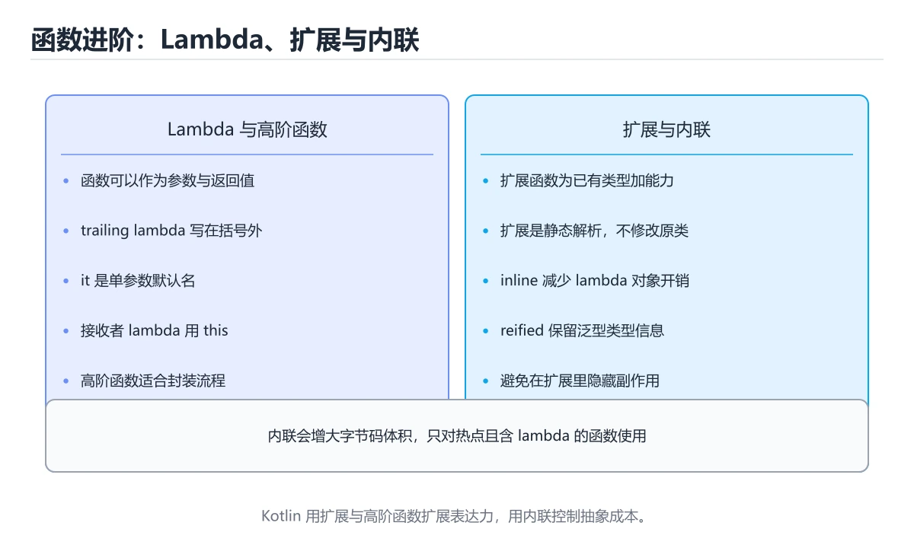
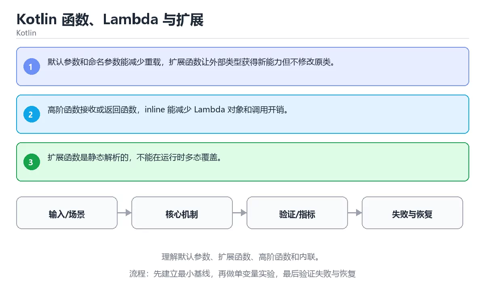

# Kotlin 函数、Lambda 与扩展





> 内容更新时间：2026-10-06 · 学习阶段：基础 · 预计用时：35 分钟

## 学习目标

- 能用自己的话解释：默认参数和命名参数能减少重载，扩展函数让外部类型获得新能力但不修改原类。
- 能用自己的话解释：高阶函数接收或返回函数，inline 能减少 Lambda 对象和调用开销。
- 能用自己的话解释：扩展函数是静态解析的，不能在运行时多态覆盖。
- 能把本课知识放回「Kotlin」，并完成练习与测验。

## 前置知识

- 具备本分类的前置知识，能跑通「Kotlin 函数、Lambda 与扩展」的示例并解释输出。
- 本课关键词：函数、Lambda、扩展函数、inline。
- 遇到不熟悉的术语先记录问题，完成练习后再回读。

## 核心知识

### 1. 默认参数和命名参数能减少重载，扩展函数让外部类型获得新能力但不修改原类。

- 关键做法：先用 joinToString 建立 函数 的基线，再逐步加入边界与失败条件。
- 验证标准：函数 的结果可复现、错误可解释、失败能恢复。

### 2. 高阶函数接收或返回函数，inline 能减少 Lambda 对象和调用开销。

把这条结论放回「Kotlin 函数、Lambda 与扩展」的完整流程里展开：

- 正文依据：能用自己的话解释：默认参数和命名参数能减少重载，扩展函数让外部类型获得新能力但不修改原类。
- 落地检查：把「2. 高阶函数接收或返回函数，inline 能减少 Lambda 对象和调用开销。」改写成一条可执行的核对项，逐条验证输入、超时与失败路径。

### 3. 扩展函数是静态解析的，不能在运行时多态覆盖。

把这条结论放回「Kotlin 函数、Lambda 与扩展」的完整流程里展开：

- 正文依据：能用自己的话解释：高阶函数接收或返回函数，inline 能减少 Lambda 对象和调用开销。
- 落地检查：把「3. 扩展函数是静态解析的，不能在运行时多态覆盖。」改写成一条可执行的核对项，逐条验证输入、超时与失败路径。

## 关键流程

```text
输入 → 校验 → 核心处理 → 验证 → 记录指标 → 失败恢复
```

## 实践路径

1. 用一句话复述本课要解决的问题。
2. 跑通正文中的最小示例并记录基线。
3. 只改变一个输入或参数，预测并验证结果。
4. 补一个失败路径，记录错误、恢复和指标。
5. 把结论写成可复现的笔记或测试。

## 常见错误与排查

> 说明：本表由《Kotlin 函数、Lambda 与扩展》的核心知识整理（2026-10-07），人工复核进度见 docs/content_review_batches.md。

| 易错点 | 容易踩的做法 | 正确结论 |
| --- | --- | --- |
| 到处使用扩展函数 | 破坏封装，调用方难以发现 | 只在确有需要时使用扩展，并放在合适位置 |
| 高阶函数捕获可变状态 | 行为不确定，难以测试 | 保持函数纯净，需要状态时显式传参 |
| 默认参数与重载混用 | 调用解析不明确 | 控制重载数量，让调用点一目了然 |

## 动手练习

1. 合上教程，用 3～5 句话解释Kotlin 函数、Lambda 与扩展。
2. 从正文选一个例子，改变一个条件并预测结果。
3. 设计一个失败场景，写出止损与恢复步骤。

**验收标准**：留下输入、命令、输出、差异和下一步问题。

## 本课小结

- 本课围绕 函数、Lambda、扩展函数、inline 展开，复习时重点核对它们的输入、输出和失败路径。
- 把还不确定的 joinToString 行为写成一条可执行验证，再进入下一课。


## 语言专项实践：Kotlin 函数、Lambda 与扩展

### 一、工具链

| 阶段 | 推荐工具 | 验收标准 |
| --- | --- | --- |
| 编译构建 | kotlinc / Gradle | 命令可复现且错误能被定位 |
| 测试 | JUnit + coroutines-test | 命令可复现且错误能被定位 |
| 静态检查 | detekt / ktlint | 命令可复现且错误能被定位 |
| 发布 | R8/ProGuard + App Bundle | 命令可复现且错误能被定位 |

### 二、运行时与内存模型

围绕「函数、Lambda、扩展函数、inline」说明变量生命周期、资源释放、并发模型和错误传播。语言语法只是入口，真正决定行为的是运行时、标准库和平台约束。

### 三、测试策略

- 单元测试覆盖核心规则和边界。
- 集成测试覆盖文件、网络、数据库或平台 API。
- 失败测试覆盖超时、取消、异常和资源耗尽。
- 性能测试记录基线，避免只凭感觉优化。

### 四、发布检查

- [ ] 版本和依赖锁定，构建可复现。
- [ ] 产物经过签名、校验和最小权限配置。
- [ ] 日志不泄露密钥和个人信息。
- [ ] 有升级、回滚和故障恢复说明。

## 可运行练习

本节围绕Kotlin 函数、Lambda 与扩展安排 3 个可交付任务，每个任务都要求留下可以复查的记录。

### 任务 1：用自己的话画出结构

不看书，用一张图说清「Kotlin 函数、Lambda 与扩展」的结构，画完再对照骨架：

- 主干：函数 的核心知识 → 关键流程 → 实践路径 → 常见误区
- 连接线：在每条边上标出输入、输出与失败路径。
- 自检：能否用一句话说明函数与Lambda的关系？

### 任务 2：做一次对比实验

**验收标准**：写出换方案的触发条件——当Lambda的规模、精度或资源上限变化到什么程度时，「核心知识」里的结论不再成立。

### 任务 3：迁移到自己的场景

**验收标准**：把自己的判断写成可检查的形式——输入、步骤、输出、差异各一条，其中输入必须包含 函数。

## 故障现场

### 现场 1：到处使用扩展函数

**症状**：在《Kotlin 函数、Lambda 与扩展》的复现场景中，破坏封装，调用方难以发现。

**根因**：“破坏封装，调用方难以发现”只是表层结果。向上追溯会落到“到处使用扩展函数”这一步，因为它省略了《Kotlin 函数、Lambda 与扩展》的约束，使实现行为和预期模型发生了偏离。

**修复**：针对《Kotlin 函数、Lambda 与扩展》的问题，只在确有需要时使用扩展，并放在合适位置。

**验证**：在《Kotlin 函数、Lambda 与扩展》中按“只在确有需要时使用扩展，并放在合适位置”调整后，从“到处使用扩展函数”的触发条件重放同一条路径，确认“破坏封装，调用方难以发现”不再出现，并补一个相邻边界用例检查没有引入新问题。

### 现场 2：高阶函数捕获可变状态

**症状**：在《Kotlin 函数、Lambda 与扩展》的复现场景中，行为不确定，难以测试。

**根因**：当出现“高阶函数捕获可变状态”时，执行路径已经绕过了《Kotlin 函数、Lambda 与扩展》的关键约束，最终以“行为不确定，难以测试”暴露出来；修复前必须先确认约束在哪里失效。

**修复**：针对《Kotlin 函数、Lambda 与扩展》的问题，保持函数纯净，需要状态时显式传参。

**验证**：先在《Kotlin 函数、Lambda 与扩展》中记录“高阶函数捕获可变状态”留下的失败证据，再执行“保持函数纯净，需要状态时显式传参”并重放；确认错误路径变为明确结果，且修复没有掩盖同类故障。

### 现场 3：默认参数与重载混用

**症状**：在《Kotlin 函数、Lambda 与扩展》的复现场景中，调用解析不明确。

**根因**：当出现“默认参数与重载混用”时，执行路径已经绕过了《Kotlin 函数、Lambda 与扩展》的关键约束，最终以“调用解析不明确”暴露出来；修复前必须先确认约束在哪里失效。

**修复**：针对《Kotlin 函数、Lambda 与扩展》的问题，控制重载数量，让调用点一目了然。

**验证**：先在《Kotlin 函数、Lambda 与扩展》中记录“默认参数与重载混用”留下的失败证据，再执行“控制重载数量，让调用点一目了然”并重放；确认错误路径变为明确结果，且修复没有掩盖同类故障。

## 版本与时效

- 版本提示：函数 的行为在最近几个大版本里有过调整，升级「Kotlin 函数、Lambda 与扩展」前先用 joinToString 复现当前输出，再对照官方发布说明逐条核对。
- 升级前确认 函数 的兼容范围，把不可回退的改动单独拆成一次提交。
- 显式 API 模式与多平台源集是团队协作时的重点
- 官方说明：https://kotlinlang.org/docs/releases.html

### 升级检查清单

- 先固定当前版本，跑通全部示例与测验，再升级工具链。
- 一次只改一个版本条件，把 函数 相关的差异单独记成一条结论。
- 回归范围锁定 joinToString 的默认行为，并确认弃用警告是否出现在构建输出里。
- 升级完成后记录 函数 的新旧版本差异，并据此调整下次复核时间。

## 本课复习清单


离开本课前，逐项确认：

- [ ] 不看解析，能说出「关于「默认参数和命名参数能减少重载，扩展函数让外部类型获得新能力但不修改原类。」，下列说法正确的是？」的判断依据。
- [ ] 不看解析，能说出「下面这段 Kotlin 代码摘自「Kotlin 函数、Lambda 与扩展」的正文示例。关于这段代码，下面哪一项说法与实际内容相符？」的判断依据。
- [ ] 不看解析，能说出「关于「扩展函数是静态解析的，不能在运行时多态覆盖。」，下列说法正确的是？」的判断依据。
- [ ] 至少运行一次《Kotlin 函数、Lambda 与扩展》的示例，记录输入、输出和一个边界情况。
- [ ] 把本课最容易混淆的两个概念写成一句话对照。

| 复盘项 | 记录 |
| --- | --- |
| 已经能独立解释的考点 |  |
| 仍然说不清的概念 |  |
| 下一步验证动作 |  |

## 复习与自测

逐节自检：能说清 函数 的输入、输出与失败路径才算通过，否则回到原文。

### 核心知识

自检：这一节与相邻主题的边界在哪里？

### 动手练习

自检：如果去掉这一节里的一个前提，结论会怎样变化？

### 语言专项实践：Kotlin 函数、Lambda 与扩展

把这条结论放回「Kotlin 函数、Lambda 与扩展」的完整流程里展开：

- 正文依据：本课关键词：函数、Lambda、扩展函数、inline。
- 落地检查：把「语言专项实践：Kotlin 函数、Lambda 与扩展」改写成一条可执行的核对项，逐条验证输入、超时与失败路径。

### 最小可运行示例

```kotlin
fun main() {
    val numbers = listOf(1, 2, 3, 4)
    val doubled = numbers.map { it * 2 }
    println(doubled.joinToString(","))
}
```

自检：把这一节讲给没学过的人，最需要强调哪一点？

### 预期输出

```text
2,4,6,8
```

### 验证步骤

制造一次错误输入，记录错误信息与修复方式。

## 术语速查

| 术语 | 一句话说明 |
| --- | --- |
| `函数` | 接收输入、执行确定逻辑并返回结果的代码单元。 |
| `Lambda` | 匿名函数表达式，可把一段行为作为参数传递。 |
| `扩展函数` | 二、运行时与内存模型：围绕「函数、Lambda、扩展函数、inline」说明变量生命周期、资源释放、并发模型和错误传播。 |
| `inline` | Summary: Learn default arguments, extension functions, higher-order functions and inline.。 |

## 深度拓展与实战

这一节把 核心知识 中容易混淆的两点写成对照与反例。

### 机制拆解

- **1. 默认参数和命名参数能减少重载，扩展函数让外部类型获得新能力但不修改原类。**：在「Kotlin 函数、Lambda 与扩展」里，「1. 默认参数和命名参数能减少重载，扩展函数让外部类型获得新能力但不修改原类。」这一步要先写清输入与预期，再记录实际结果和差异；结果不符时回到对应小节核对前提。
- **2. 高阶函数接收或返回函数，inline 能减少 Lambda 对象和调用开销。**：在「Kotlin 函数、Lambda 与扩展」里，「2. 高阶函数接收或返回函数，inline 能减少 Lambda 对象和调用开销。」这一步要先写清输入与预期，再记录实际结果和差异；结果不符时回到对应小节核对前提。
- **3. 扩展函数是静态解析的，不能在运行时多态覆盖。**：在「Kotlin 函数、Lambda 与扩展」里，「3. 扩展函数是静态解析的，不能在运行时多态覆盖。」这一步要先写清输入与预期，再记录实际结果和差异；结果不符时回到对应小节核对前提。
- 一、工具链：实现 joinToString 所需的阶段与验收标准
- **二、运行时与内存模型**：围绕「函数、Lambda、扩展函数、inline」说明变量生命周期、资源释放、并发模型和错误传播

### 边界条件与常见反例

「Kotlin 函数、Lambda 与扩展」的边界不只包括最大最小值，还要覆盖空、重复和失败：

| 条件 | 常见反例 | 处理方式 |
| --- | --- | --- |
| 空输入 | 函数 没有任何取值 | 先判空，给出明确错误而不是继续执行 |
| 边界值 | Lambda 取最小或最大 | 用最小值、最大值和越界值各跑一次 |
| 重复执行 | 同一输入被执行两次 | 保证结果可重复，必要时加锁或去重 |
| 失败路径 | 函数 相关步骤报错 | 保留原始错误，确认回滚或重试行为 |

### 工程检查表

- [ ] 能否用自己的话说明Kotlin 函数、Lambda 与扩展解决什么问题，以及它不负责什么？
- [ ] 能否指出 joinToString 最小示例的输入、输出和一条失败路径？
- [ ] 能否解释本课关键词在真实项目中的边界与取舍？
- [ ] 能否把 函数 的方法迁移到相近问题，并说明需要改哪一步？

### 迁移练习

1. 保持正文示例不变，写出它的输入、处理步骤和预期输出。
2. 把 Lambda 换成边界值，说明依据后再实际运行。
3. 结合函数、Lambda、扩展函数、inline，写出一个真实项目中的使用场景。
4. 写下一个反例，说明它在什么条件下会使朴素做法失效。

<!-- p0-depth-v2:start -->

## 零基础精讲：把Kotlin 函数、Lambda 与扩展真正讲透

### 先建立一个直觉

本课的摘要可以当作一张地图：理解默认参数、扩展函数、高阶函数和内联。

### 逐步拆解

1. 澄清输入与目标。先写清「Kotlin 函数、Lambda 与扩展」要解决的问题、合法输入范围和成功标准，再进入后续步骤。
2. 描述处理过程。把「函数、Lambda、扩展函数、inline」映射到具体步骤，每步都要求能单独验证。
3. 定义输出。把 joinToString 的返回值、日志和失败信号都写清楚，缺一项都不算完整。
4. 把 joinToString 的输入换成空值、极值或类型不符的形式，记录第一条错误信息、发生位置和修复动作。
5. 选一个只有两三步的函数例子，先写出预期输出，再运行确认；不一致时先怀疑前提而不是代码。

### 把正文串成一条执行链

- **三、测试策略**：- 单元测试覆盖核心规则和边界

### 从测验反推易错点

**检查点 1：关于「默认参数和命名参数能减少重载，扩展函数让外部类型获得新能力但不修改原类。」，下列说法正确的是？**

- 参考判断：默认参数和命名参数能减少重载，扩展函数让外部类型获得新能力但不修改原类。
- 自问：如果去掉题干里的一个限定词，结论还成立吗？

**检查点 2：关于「高阶函数接收或返回函数，inline 能减少 Lambda 对象和调用开销。」，下列说法正确的是？**

- 参考判断：高阶函数接收或返回函数，inline 能减少 Lambda 对象和调用开销。

**检查点 3：关于「扩展函数是静态解析的，不能在运行时多态覆盖。」，下列说法正确的是？**

- 参考判断：扩展函数是静态解析的，不能在运行时多态覆盖。

**检查点 4：本课的核心学习目标是什么？**

- 参考判断：理解默认参数、扩展函数、高阶函数和内联。

**检查点 5：以下哪些术语与Kotlin 函数、Lambda 与扩展直接相关？（多选）**

- 参考判断：函数、Lambda

### 工程排错顺序

| 先查什么 | 要得到的证据 | 判断标准 |
| --- | --- | --- |
| 输入与前提是否满足 | 日志、输入样例、测试或指标 | 能复现并解释，才算定位 |
| 核心步骤是否产生了预期中间结果 | 日志、输入样例、测试或指标 | 能复现并解释，才算定位 |
| 失败路径是否可观测、可恢复 | 日志、输入样例、测试或指标 | 能复现并解释，才算定位 |
| 资源、权限与成本是否在预算内 | 日志、输入样例、测试或指标 | 能复现并解释，才算定位 |

### 变式训练

1. 把 函数 放进一个只有单机、没有额外依赖的小项目，先保证正确再扩展。
2. 扩大 Lambda 的规模，记录本课结论在哪一个量级开始不成立。
3. 把 Lambda 换成失败输入，记录错误信息与恢复动作。
5. 把 joinToString 的执行顺序调换一次，记录哪个中间结果先错；顺序敏感的地方就是本课的关键约束。
6. 限制 CPU 与内存上限后重跑 joinToString，观察哪一项参数需要重新设定。

### 本课自测

- [ ] 能用一句话解释「函数」在本课中的角色与边界。
- [ ] 能举出一个正常例子和一个失败例子。
- [ ] 能说出最小验证步骤，以及需要记录的证据。
- [ ] 能用一句话解释「Lambda」在本课中的角色与边界。
- [ ] 能用一句话解释「扩展函数」在本课中的角色与边界。
- [ ] 能用一句话解释「inline」在本课中的角色与边界。

### 迁移案例库

围绕 joinToString 重复同一套方法，每完成一轮就把差异写进笔记。

#### 迁移案例 1：围绕「函数」做一次小实验

**目标**：在不改变课程主体的前提下，验证Kotlin 函数、Lambda 与扩展中的一个关键判断。

**步骤**：
1. 复述当前方案对「函数」的假设，写成一句可证伪的话。
2. 设计一个正常输入和一个边界输入，分别预测输出。
3. 运行或逐步演算，记录实际输出、耗时和失败信息。
4. 只调整一个参数，比较前后差异并解释原因。
5. 补充一条测试或复习卡，确保下次能更快复现。

**验收**：函数的结论要有证据、差异可解释、失败可恢复；做不到时回到「核心知识」缩小问题范围。

#### 迁移案例 2：围绕「Lambda」做一次小实验

**步骤**：
1. 复述当前方案对「Lambda」的假设，写成一句可证伪的话。

#### 迁移案例 3：围绕「扩展函数」做一次小实验

**步骤**：
1. 复述当前方案对「扩展函数」的假设，写成一句可证伪的话。

#### 迁移案例 4：围绕「inline」做一次小实验

**步骤**：
1. 复述当前方案对「inline」的假设，写成一句可证伪的话。

#### 迁移案例 5：围绕「函数」做一次小实验

**步骤**：

#### 迁移案例 6：围绕「Lambda」做一次小实验

**步骤**：

#### 迁移案例 7：围绕「扩展函数」做一次小实验

**步骤**：

#### 迁移案例 8：围绕「inline」做一次小实验

**步骤**：

#### 迁移案例 9：围绕「函数」做一次小实验

**步骤**：

#### 迁移案例 10：围绕「Lambda」做一次小实验

**步骤**：

#### 迁移案例 11：围绕「扩展函数」做一次小实验

**步骤**：

#### 迁移案例 12：围绕「inline」做一次小实验

**步骤**：

#### 迁移案例 13：围绕「函数」做一次小实验

**步骤**：

#### 迁移案例 14：围绕「Lambda」做一次小实验

**步骤**：

#### 迁移案例 15：围绕「扩展函数」做一次小实验

**步骤**：

#### 迁移案例 16：围绕「inline」做一次小实验

**步骤**：

<!-- p0-depth-v2:end -->

## 考点精讲

### 考点 1：概念判断·函数

- **题目**：关于「默认参数和命名参数能减少重载，扩展函数让外部类型获得新能力但不修改原类。」，下列说法正确的是？
- **判断依据**：在「Kotlin 函数、Lambda 与扩展」里，默认参数和命名参数能减少重载，扩展函数让外部类型获得新能力但不修改原类。“默认参数和命名参数能减少重载”与「Kotlin 函数、Lambda 与扩展」的术语表相呼应，只有符合函数、Lambda、扩展函数约束的“默认参数和命名参数能减少重载”才是正文支持的结论。

### 考点 2：代码补全·函数

- **题目**：下面这段 Kotlin 代码摘自「Kotlin 函数、Lambda 与扩展」的正文示例。关于这段代码，下面哪一项说法与实际内容相符？
- **判断依据**：在「Kotlin 函数、Lambda 与扩展」里，这段代码会产生可观察的输出，运行后能看到结果。这段代码出自「Kotlin 函数、Lambda 与扩展」的正文示例，围绕函数、Lambda、扩展函数展开；把输入或边界换成空值、极值或失败情况后，结论要以「Kotlin 函数、Lambda 与扩展」的实际运行结果为准。

### 考点 3：概念判断·函数

- **题目**：关于「扩展函数是静态解析的，不能在运行时多态覆盖。」，下列说法正确的是？
- **判断依据**：在「Kotlin 函数、Lambda 与扩展」里，扩展函数是静态解析的，不能在运行时多态覆盖。在「Kotlin 函数、Lambda 与扩展」里判断这道题，要把函数、Lambda、扩展函数的条件、过程与失败路径逐项对齐，换成“关于扩展函数是静态解析的”这个场景，只有满足前提的结论才成立。

### 考点 4：概念判断·函数

- **题目**：「Kotlin 函数、Lambda 与扩展」的核心学习目标是什么？
- **判断依据**：在「Kotlin 函数、Lambda 与扩展」里，这道题要求区分概念与边界，「理解默认参数、扩展函数、高阶函数和内联。在「Kotlin 函数、Lambda 与扩展」里，」只有在题干给出的前提下才成立，而「掌握 val/var、类型推断、可空类型和安全调用。在「Kotlin 函数、Lambda 与扩展」里，」、「覆盖主构造器、数据类、密封类、伴生对象和委托。」缺少同一组条件。

### 考点 5：多选辨析·函数

- **题目**：以下哪些术语与「Kotlin 函数、Lambda 与扩展」直接相关？（多选）
- **判断依据**：回到「Kotlin 函数、Lambda 与扩展」的正文示例，用“以下哪些术语与Kotlin 函数、L”走一遍函数、Lambda、扩展函数的完整流程，能复现的结论才可以保留。回到函数、Lambda、扩展函数本身再看一遍：只有“函数”与题干“以下哪些术语与Kotlin”的前提一致，结论才成立。

### 考点 6：顺序排列·函数

- **题目**：按照「Kotlin 函数、Lambda 与扩展」从概念到实践的讲解顺序排列下列主题。
- **判断依据**：结合函数、Lambda来看，正确的执行顺序是「核心知识 → 关键流程 → 实践路径 → 常见误区」。本课围绕理解默认参数、扩展函数、高阶函数和内联。“按照Kotlin”与「Kotlin 函数、Lambda 与扩展」的术语表相呼应，只有符合函数、Lambda、扩展函数约束的“核心知识”才是正文支持的结论。

## English Overview

**Title:** Kotlin Functions, Lambdas and Extensions

**Summary:** Learn default arguments, extension functions, higher-order functions and inline.

**Category:** Kotlin
**Level:** 进阶
**Key terms:** 函数, Lambda, 扩展函数, inline

## 内容元数据

- 内容版本：v2.0
- 最后更新：2026-10-06
- 学习阶段：基础
- 适用环境：Kotlin 2.x / Android SDK；本课聚焦 函数。
- 内容来源：内置结构化课程与工程实践整理
- 相关主题：函数、Lambda、扩展函数、inline
- 质量版本：P0 测验标准 + P1 覆盖扩展 + P2 体验补全

## 最小可运行示例

先用 joinToString 跑通最小示例，然后只改一个与 函数 相关的取值：

```kotlin
fun main() {
    val numbers = listOf(1, 2, 3, 4)
    val doubled = numbers.map { it * 2 }
    println(doubled.joinToString(","))
}
```

## 预期输出

```text
2,4,6,8
```

## 验证步骤

1. 记录运行环境、命令和真实输出。
2. 修改一个输入，先写预测再运行。
4. 把结论写回本课笔记或测试用例。

## 参考资料与复核

- 最后复核：2026-10-04
- 下次复核：2026-11-24
- 复核范围：版本兼容、API 行为、安全建议与工程实践
- 来源性质：官方文档、标准或权威教材；正文为离线教学重组

| 参考资料 | 本课用途 |
| --- | --- |
| [Kotlin 基础语法](https://kotlinlang.org/docs/basic-syntax.html) | 语法、类型与函数 |
| [Android Kotlin](https://developer.android.com/kotlin) | Android 官方 Kotlin 实践 |
| [Kotlin 协程](https://kotlinlang.org/docs/coroutines-guide.html) | 结构化并发与异步流 |

> 「Kotlin 函数、Lambda 与扩展」的链接用于离线阅读后的延伸核对；App 不会自动联网。

## 复习与迁移

复习目标：把「Kotlin 函数、Lambda 与扩展」的判断标准放回可复现的例子里。先自己作答，再对照依据；如果结论正确但理由不完整，回到正文补足前提。

### 概念复述

- 用一句话说明「Kotlin 函数、Lambda 与扩展」解决什么问题：理解默认参数、扩展函数、高阶函数和内联。
- 写出函数、Lambda、扩展函数之间的关系，并各举一个例子。
- 说出本课最容易混淆的两个概念，以及区分它们的判据。

### 正文逐节复核

- **语言专项实践：Kotlin 函数、Lambda 与扩展**：围绕「函数、Lambda、扩展函数、inline」说明变量生命周期、资源释放、并发模型和错误传播。
- **实践任务**：本节围绕Kotlin 函数、Lambda 与扩展安排 3 个可交付任务，每个任务都要求留下可以复查的记录。
- **零基础精讲：把Kotlin 函数、Lambda 与扩展真正讲透**：本课的摘要可以当作一张地图：理解默认参数、扩展函数、高阶函数和内联。

### 测验回顾

1. 关于「默认参数和命名参数能减少重载，扩展函数让外部类型获得新能力但不修改原类。」，下列说法正确的是？
   - 依据：在「Kotlin 函数、Lambda 与扩展」里，默认参数和命名参数能减少重载，扩展函数让外部类型获得新能力但不修改原类。“默认参数和命名参数能减少重载”与「Kotlin 函数、Lambda 与扩展」的术语表相呼应，只有符合函数、Lambda、扩展函数约束的“默认参数和命名参数能减少重载”才是正文支持的结论。
2. 下面这段 Kotlin 代码摘自「Kotlin 函数、Lambda 与扩展」的正文示例。关于这段代码，下面哪一项说法与实际内容相符？
   - 依据：在「Kotlin 函数、Lambda 与扩展」里，这段代码会产生可观察的输出，运行后能看到结果。这段代码出自「Kotlin 函数、Lambda 与扩展」的正文示例，围绕函数、Lambda、扩展函数展开；把输入或边界换成空值、极值或失败情况后，结论要以「Kotlin 函数、Lambda 与扩展」的实际运行结果为准。
3. 关于「扩展函数是静态解析的，不能在运行时多态覆盖。」，下列说法正确的是？
   - 依据：在「Kotlin 函数、Lambda 与扩展」里，扩展函数是静态解析的，不能在运行时多态覆盖。在「Kotlin 函数、Lambda 与扩展」里判断这道题，要把函数、Lambda、扩展函数的条件、过程与失败路径逐项对齐，换成“关于扩展函数是静态解析的”这个场景，只有满足前提的结论才成立。
4. 「Kotlin 函数、Lambda 与扩展」的核心学习目标是什么？
   - 依据：在「Kotlin 函数、Lambda 与扩展」里，这道题要求区分概念与边界，「理解默认参数、扩展函数、高阶函数和内联。在「Kotlin 函数、Lambda 与扩展」里，」只有在题干给出的前提下才成立，而「掌握 val/var、类型推断、可空类型和安全调用。在「Kotlin 函数、Lambda 与扩展」里，」、「覆盖主构造器、数据类、密封类、伴生对象和委托。」缺少同一组条件。
5. 以下哪些术语与「Kotlin 函数、Lambda 与扩展」直接相关？（多选）
   - 依据：回到「Kotlin 函数、Lambda 与扩展」的正文示例，用“以下哪些术语与Kotlin 函数、L”走一遍函数、Lambda、扩展函数的完整流程，能复现的结论才可以保留。回到函数、Lambda、扩展函数本身再看一遍：只有“函数”与题干“以下哪些术语与Kotlin”的前提一致，结论才成立。
6. 按照「Kotlin 函数、Lambda 与扩展」从概念到实践的讲解顺序排列下列主题。
   - 依据：结合函数、Lambda来看，正确的执行顺序是「核心知识 → 关键流程 → 实践路径 → 常见误区」。本课围绕理解默认参数、扩展函数、高阶函数和内联。“按照Kotlin”与「Kotlin 函数、Lambda 与扩展」的术语表相呼应，只有符合函数、Lambda、扩展函数约束的“核心知识”才是正文支持的结论。

### 迁移练习

把「Kotlin 函数、Lambda 与扩展」的结论迁移到相邻主题，每次迁移都写清预测与证据：

1. 换输入：用函数处理一组你自己的数据，对比教材示例的结果差异。
2. 换失败条件：制造一个Lambda相关的错误，说明如何从错误信息定位根因。
3. 换规模：把数据量或并发度提高一个数量级，说明「Kotlin 函数、Lambda 与扩展」的结论是否仍成立。
